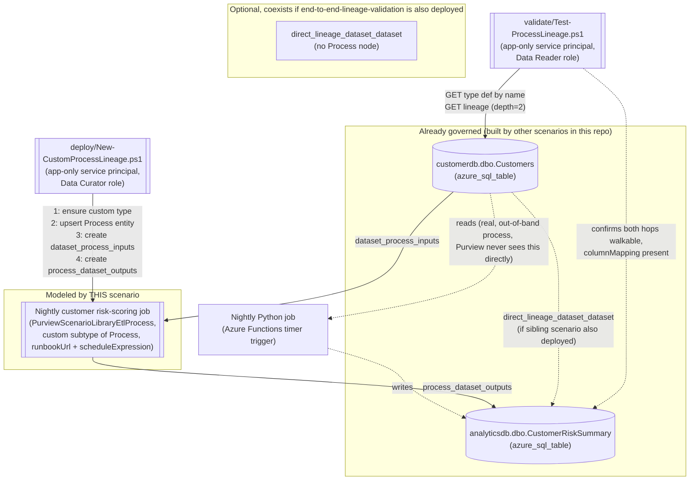

## 1. Scenario summary

Extends `scenarios/data-lineage/end-to-end-lineage-validation/` from a single unattributed
DataSet-to-DataSet edge into the richer **DataSet -> Process -> DataSet** lineage shape: the
nightly custom transform job itself becomes a queryable, Process-typed entity in the Purview lineage
graph - carrying a runbook URL and a schedule expression - rather than an invisible hop a reviewer
has to already know to ask about. This closes the exact follow-up
`end-to-end-lineage-validation/design.md` Section 7 left open: that scenario's own grounding pass
did not confirm a REST-documented body for creating a custom Process entity, so it used only the
direct-edge shape. This scenario's grounding pass found and confirmed that body.

**Who it's for:** the same audience as the sibling scenario - a data governance or platform
engineering team with custom ETL/ELT jobs outside Purview's auto-lineage connector list - who
additionally wants the transform job itself represented and searchable in the lineage graph (who
owns it, where the runbook lives, when it runs), not just an edge between two tables.

## 2. Business/regulatory driver

Same underlying driver as `end-to-end-lineage-validation/README.md` Section 2 - Microsoft's Cloud
Adoption Framework guidance to "enable automated lineage where available and close gaps manually
where required," and the same GDPR Art. 30/PCI DSS cardholder-data-flow-mapping and impact-analysis
use cases that depend on a complete graph. This scenario adds a narrower, complementary driver:
**root-cause and change-management workflows need to know *who to call*, not just *that a hop
exists*.** When `analyticsdb.dbo.CustomerRiskSummary` looks wrong, "there's an unattributed edge
from `Customers`" tells an investigator less than "there's a `Nightly customer risk-scoring job`
node with a runbook URL and a `0 3 * * *` schedule" - the second is immediately actionable inside
the same portal view the investigator is already looking at, without needing separate institutional
knowledge of which team owns which script.

## 3. Prerequisites

Full licensing detail and citations: [Licensing matrix](/docs/licensing-matrix/). Summary for this scenario (same
Data Map / Azure-consumption billing model as `end-to-end-lineage-validation` - see that scenario's
README.md Section 3 for the full PAYG framing, not repeated here):

| Requirement | Minimum | Notes |
|---|---|---|
| Microsoft Purview account + Data Map | Active Azure subscription, Purview account with Data Map enabled | Same PAYG billing as the sibling scenario - [Licensing matrix §1](/docs/licensing-matrix/#1-the-two-billing-models-read-this-first)-2 |
| Create/update the Process entity and both relationships | **Data Curator** role on the collection containing the upstream/downstream assets | Classic Data Map role, Catalog Data plane. Same collection-wide blast-radius caveat `end-to-end-lineage-validation/README.md` §3 already documents - treat this credential with the same care |
| Create the custom Process **type definition** | **VERIFY** - at minimum Data Curator on a collection (confirmed sufficient for the closely related "create a custom **classification**" action); this scenario's grounding pass found no equally explicit permission statement specifically for creating a custom **entity type definition** via Type - Bulk Create. Not independently confirmed whether type creation is collection-scoped or requires a broader/root-level grant - flagged in Section 11 rather than asserted. **Residual risk regardless of which way this resolves**: Apache Atlas type definitions are account-wide objects, not partitioned per collection the way entities are - if type creation turns out to require (or merely be possible with) only collection-level Data Curator, that credential can create/pollute the tenant's entire shared type namespace, not just objects inside its own collection. Treat the deploy credential's blast radius as tenant-wide for this specific action, on top of the collection-wide entity/relationship blast radius the sibling scenario's own Red Team review already flagged |
| Read lineage and the type definition only (validation) | **Data Reader** role on the same collection | Least-privilege for the read-only `validate/` script |
| Grant the automation identity a Purview role at all | **Collection Admin** role at root (or the relevant sub-collection) | Only a Collection Admin can assign Data Curator/Data Reader to a service principal |
| The upstream and downstream assets already exist | Both registered and scanned via Data Map - same assets `end-to-end-lineage-validation` already targets (`scenarios/data-map/scan-azure-sql-and-classify/` for `customerdb.dbo.Customers`) | This scenario does not register or scan either source - see §6/`design.md` §7 |
| Automation identity for the REST calls themselves | App registration with Data Curator (deploy) or Data Reader (validate) Purview role | Client-secret app-only OAuth2, same token endpoint as this repo's other surface-4 scripts - [Automation surface §3](/docs/automation-surface/#3-authentication-patterns-interactive-vs-unattended) |

> Verify current entitlement names against [Licensing matrix](/docs/licensing-matrix/) before a sales commitment.

## 4. Architecture



The deploy script creates one custom Process-typed entity and up to two lineage relationships
(each only if missing). It never touches the upstream/downstream DataSet entities themselves, and
it never removes any pre-existing `direct_lineage_dataset_dataset` edge - see `design.md` Section 6
for what a reader should make of seeing both edge types in the portal simultaneously. Full design
rationale: `design.md`.

## 5. Step-by-step implementation

### Portal path (for a first manual walkthrough / to validate intent before scripting)

1. Confirm both DataSet assets already exist and copy their exact **Qualified name** values from
 each asset's **Overview** page in the Purview portal - same manual-copy step
 `end-to-end-lineage-validation/README.md` §5 step 2 documents, and the same open VERIFY
 (§11 below) about the exact `azure_sql_table` qualifiedName format.
2. Assign the automation identity's *human* counterpart (or yourself, for this walkthrough) the
 **Data Curator** role on the collection containing both assets: **Data Map** -> **Collections**
 -> select the collection -> **Role assignments** -> add under **Data curators**.
3. After running the script (below), open the upstream asset's **Lineage** tab in the Purview
 portal and confirm a new node - the Process entity, named "Nightly customer risk-scoring job" -
 now sits between `customerdb.dbo.Customers` and `analyticsdb.dbo.CustomerRiskSummary`, with the
 `runbookUrl` and `scheduleExpression` attributes visible when you select it.

### Script path (idempotent, parameterized, dry-run capable)

```powershell
# 1. Copy the upstream/downstream assets' real Qualified Name values from the portal into the
#    definition file first - see deploy/lineage/customer-risk-summary-process-lineage.json.
#    (The Process entity's own qualifiedName is authored by this scenario, not copied - see §11.)

# 2. Deploy (dry run first - reports what already exists and what would be created)
./deploy/New-CustomProcessLineage.ps1 `
    -PurviewAccountEndpoint 'https://api.purview-service.microsoft.com' `
    -TenantId $TenantId -AppId $AppId -ClientSecret $ClientSecret `
    -LineageDefinitionPath './deploy/lineage/customer-risk-summary-process-lineage.json' `
    -WhatIf

# 3. Deploy for real - creates the custom type (if missing), upserts the Process entity, and
#    creates either or both relationships if missing
./deploy/New-CustomProcessLineage.ps1 `
    -PurviewAccountEndpoint 'https://api.purview-service.microsoft.com' `
    -TenantId $TenantId -AppId $AppId -ClientSecret $ClientSecret `
    -LineageDefinitionPath './deploy/lineage/customer-risk-summary-process-lineage.json'

# 4. Validate - confirms the full DataSet -> Process -> DataSet chain is connected
./validate/Test-ProcessLineage.ps1 `
    -PurviewAccountEndpoint 'https://api.purview-service.microsoft.com' `
    -TenantId $TenantId -AppId $AppId -ClientSecret $ClientSecret `
    -LineageDefinitionPath './deploy/lineage/customer-risk-summary-process-lineage.json'
```

Both scripts use the **Microsoft Purview Data Map / Atlas v2 REST API** - automation surface 4 per
[Automation surface §1](/docs/automation-surface/#1-five-automation-surfaces-not-one-read-this-first) - the same surface `end-to-end-lineage-validation` uses, extended
here to the **Type** and (for the first time in this repo) **Entity** operation groups. Token
acquisition follows the same client-credentials pattern already used by this repo's other
surface-4 scripts.

## 6. Configuration reference

| Setting | Value this scenario uses | Notes |
|---|---|---|
| Custom Process type name | `PurviewScenarioLibraryEtlProcess` | `superTypes: ["Process"]` - directly confirmed shape from Microsoft's "Create a Custom Process Type" worked example |
| Custom type attributes | `runbookUrl` (string), `scheduleExpression` (string), both `cardinality: SINGLE`, `isOptional: true` | Confirmed `AtlasAttributeDef` shape from Microsoft's own `Type - Bulk Create` worked example (`azure_sql_server_example`) |
| Process entity qualifiedName | `custom-lineage.nightly-customer-risk-scoring-job` | Authored by this scenario, not copied from the portal - the Process entity doesn't pre-exist as a scanned asset, so there is no format to match. Deliberately dot-namespaced, following the same convention as Microsoft's own worked example (`test_lineage.HiveQuery1`) |
| Relationship types | `dataset_process_inputs` (upstream DataSet -> Process), `process_dataset_outputs` (Process -> downstream DataSet) | Both directly confirmed via Microsoft's own worked Example 1 |
| Relationship end typeName for the Process node | Literal `Process` | Matches Microsoft's own worked example exactly - see `design.md` §5. Not independently re-confirmed for a *custom* Process subtype specifically - §11 |
| Column-level detail | `columnMapping` **on the Process entity's own attributes** (JSON-encoded string: `[{"DatasetMapping":{...},"ColumnMapping":[...]}]`) | Matches Microsoft's own worked DataSet -> Process -> DataSet example exactly - a genuinely different placement from the sibling scenario's direct-edge case, where `columnMapping` sits on the relationship instead (`design.md` §5) |
| Process entity idempotency | Entity - Bulk Create Or Update's documented upsert-by-qualifiedName | No separate existence check needed - stronger grounding than the relationship/type idempotency mechanisms below (`design.md` §2) |
| Type definition idempotency | `Type - Get Entity Def By Name` existence check before `Type - Bulk Create` | That operation's reference page warns "avoid recreating existing types" |
| Relationship idempotency | Single depth-2 `Lineage - Get By Unique Attribute` existence check (from the upstream asset) before either `Relationship - Create` POST | See `design.md` §2/§4 |
| Deploy role | **Data Curator** | Catalog Data plane write access |
| Validate role | **Data Reader** | Catalog Data plane read-only access |
| API version pinned by both scripts | `2023-09-01` | Confirmed current via direct fetch of Microsoft's own REST reference pages for Entity - Bulk Create Or Update, Type - Bulk Create, Type - Get Entity Def By Name, Relationship - Create, and Lineage - Get By Unique Attribute |
| `-PurviewAccountEndpoint` accepted values | `https://api.purview-service.microsoft.com` (new portal) or `https://<account>.purview.azure.com` (classic portal) | Same dual-endpoint confirmation as the sibling scenario |

Full REST-body grounding: `deploy/New-CustomProcessLineage.ps1`, `deploy/
Remove-CustomProcessLineage.ps1`, and `validate/Test-ProcessLineage.ps1` inline comments and their
`.NOTES` blocks cite the exact Microsoft Learn reference pages.

## 7. Validation / how to prove it works

1. **Automated end-to-end check** - `./validate/Test-ProcessLineage.ps1` confirms the custom type
 exists **and its attribute set matches this scenario's definition file** (catching schema drift
 the deploy script's own existence-only check can't - see §11), fetches the two-hop lineage graph
 in one call, and confirms both the
 `dataset_process_inputs` and `process_dataset_outputs` hops are walkable edges *in the correct
 order* (not merely that all three nodes appear somewhere in the graph), plus that the Process
 entity's `columnMapping` attribute survived. Exits non-zero on any hard failure.
2. **Portal evidence** - open `customerdb.dbo.Customers`' **Lineage** tab; a new "Nightly customer
 risk-scoring job" Process node should appear between it and
 `analyticsdb.dbo.CustomerRiskSummary`. Selecting the node should show the `runbookUrl` and
 `scheduleExpression` attributes; selecting either edge should show the relationship type.
3. **Negative test (prove the validator actually detects a gap)** - run
 `deploy/Remove-CustomProcessLineage.ps1` to delete both relationships and the Process entity,
 then re-run `validate/Test-ProcessLineage.ps1` and confirm it now reports `[FAIL]` for the
 Process entity's presence (and, consequently, both hops) with the guidance pointing back at the
 deploy script. Re-run the deploy script afterward to restore the chain.
4. **Idempotency proof** - re-run `deploy/New-CustomProcessLineage.ps1` a second time against an
 already-deployed chain and confirm every step reports `[SKIP]`/upsert-no-op rather than creating
 duplicates - including a **third** run after that, to confirm the second run's idempotency wasn't
 a fluke of ordering.

## 8. Operations & tuning

**KPIs to watch (first 30 days):** same validation-pass/fail-trend pattern
`end-to-end-lineage-validation/README.md` §8 already establishes - wire
`validate/Test-ProcessLineage.ps1` into the same recurring scheduled check. This scenario adds one
additional signal worth tracking: **Process entity attribute drift** - if `runbookUrl` starts
returning stale links (404s, or pointing at a decommissioned wiki), that's a maintenance signal
distinct from a connectivity failure; this scenario's validate script does not check the URL is
live (that would require a network call outside Purview's own data plane - explicitly out of scope,
`design.md` §8), only that the attribute is non-empty.

**Alert routing:** no Purview-native alert for a broken or drifted lineage relationship - identical
situation to the sibling scenario. The recurring `validate/` run **is** the detection mechanism;
route its non-zero exit code the same way `end-to-end-lineage-validation/README.md` §8 recommends.

**Incident-response runbook (validation reports a gap):** follow
`end-to-end-lineage-validation/README.md` §8's runbook for the "asset re-created with a new GUID"
and "relationship deleted" cases - both apply identically here, just with the Process entity as an
additional node that can independently go missing or be re-created with a new GUID. One
scenario-specific addition: if **only** the Process entity check fails (both DataSet assets still
present and, if the sibling scenario is also deployed, still connected via the direct edge), the
transform job's context is missing but the underlying data-flow claim isn't - a lower-severity
finding than a full connectivity gap, worth triaging separately.

**Review cadence:** re-run `validate/Test-ProcessLineage.ps1` on the same cadence as the sibling
scenario's validate script - at minimum monthly, and after any change to either DataSet asset or
the transform job's ownership/schedule (which should also trigger an update to the Process entity's
`runbookUrl`/`scheduleExpression` attributes via a re-run of the deploy script).

## 9. Rollback / decommission

See `rollback.md` for the full procedure. Quick reference:
`./deploy/Remove-CustomProcessLineage.ps1` deletes both lineage relationships and the Process
entity; the upstream/downstream assets and the custom Process type definition are left untouched.

## 10. Cost & licensing notes

- **PAYG, not per-user, and effectively free at this scenario's scale** - same Data Map /
 Azure-consumption metering as the sibling scenario ([Licensing matrix §1](/docs/licensing-matrix/#1-the-two-billing-models-read-this-first)-2). Creating one
 type definition and one entity is a lighter-weight metadata write than even the sibling's
 relationship-only calls.
- **No M365 per-user license required.**
- **The real cost driver is operational, not metered**: keeping the Process entity's
 `runbookUrl`/`scheduleExpression` attributes current as the underlying job changes owners or
 schedules - budget engineering time for that, not Azure spend.

## 11. Known limitations & gotchas

- **Custom lineage - including this scenario's Process node - is asserted, not verified.** Same
 evidentiary caveat as `end-to-end-lineage-validation/README.md` §11: Purview does not check that
 the modeled job actually does what its attributes claim. If this graph is cited as
 audit/compliance evidence, distinguish natively-captured lineage from custom-asserted lineage
 (both the edges *and* this Process node) explicitly.
- **VERIFY - relation-end typeName for a *custom* Process subtype.** This scenario uses the literal
 `Process` (not `PurviewScenarioLibraryEtlProcess`) as the relationship-end typeName for both
 `dataset_process_inputs` and `process_dataset_outputs`, matching Microsoft's own worked example
 exactly - but that example's concrete entity type was a **built-in** subtype (`hive_view_query`),
 not a custom one. Whether the same ancestor-typeName resolution behavior holds identically for a
 custom subtype was not independently re-confirmed by this build's grounding pass. If it doesn't,
 the fix is a one-line change (use `PurviewScenarioLibraryEtlProcess` instead of `Process` in both
 relationship end definitions) - flagged rather than assumed either way.
- **VERIFY - permission scope for creating a custom entity type definition.** §3 above; this
 build's grounding pass confirmed collection-level Data Curator is sufficient for the closely
 related "create a custom classification" action, but found no equally explicit statement for
 Type - Bulk Create specifically.
- **The deploy script's type-existence check does not detect schema drift** - it only asks "does a
 type with this name exist," and (per Type - Bulk Create's own "avoid recreating existing types"
 warning) never re-submits the shape to reconcile an existing type that was edited out-of-band.
 `validate/Test-ProcessLineage.ps1` closes the detection gap (a dedicated schema-drift check
 compares the live type's attribute names against this definition file), but does not - and, given
 the unconfirmed update semantics, should not - attempt to fix drift automatically. See that
 script's inline comments.
- **VERIFY - the not-found status code for Type - Get Entity Def By Name.** This script's existence
 check treats *any* non-success response as "type does not exist yet" rather than assuming 404
 specifically - see the deploy script's `.NOTES`. Functionally safe (a transient error would also
 be misread as "missing," causing a redundant-but-harmless Type - Bulk Create attempt that itself
 would then either succeed or surface a clearer error), but not the same as a confirmed 404.
- **VERIFY - the exact qualifiedName string format Purview assigns to an `azure_sql_table` asset.**
 Same open item the sibling scenario already carries (`end-to-end-lineage-validation/README.md`
 §11) - applies here identically to the upstream/downstream references, not to the Process
 entity's own (self-authored) qualifiedName.
- **This scenario does not validate that `runbookUrl` points at a live, current document** - see
 §8. A stale link is not detected by `validate/Test-ProcessLineage.ps1`.
- **Rollback does not delete the custom Process type definition** - see `rollback.md` "What
 rollback does not undo" for why, and the open VERIFY on the Type - Delete operation itself.
- **This is the Data Map / Atlas REST surface, not the retiring classic Data Catalog UI** - same
 clarification as the sibling scenario (`end-to-end-lineage-validation/README.md` §11); nothing
 here depends on the classic Data Catalog UI or is at risk from its retirement.

## 12. References

1. Data lineage in classic Data Catalog (overview, use cases, granularity), <https://learn.microsoft.com/purview/data-gov-classic-lineage>
2. Data lineage user guide for classic Data Catalog (supported systems table, known limitations, manual lineage), <https://learn.microsoft.com/purview/data-gov-classic-lineage-user-guide>
3. Data governance and security baselines with Microsoft Purview, "Data visibility baseline" (Recommendation: "Enable automated lineage where available and close gaps manually where required"), <https://learn.microsoft.com/azure/cloud-adoption-framework/data/governance-security-baselines-purview-data-estate-unify-data-platform>
4. Type definitions and how to create custom types (asset/type concepts, `Referenceable`/`Asset`/`DataSet`/`Process` base types), <https://learn.microsoft.com/purview/data-gov-api-custom-types>
5. Tutorial: Authenticate for Microsoft Purview data-plane APIs (service principal setup, Data Curator/Data Reader roles for the Catalog Data plane, token acquisition), <https://learn.microsoft.com/purview/data-gov-api-rest-data-plane>
6. Create and get lineage relationships using the REST API, Example 1 (DataSet -> Process -> DataSet: create a Process entity via Entity Bulk Create, then `dataset_process_inputs`/`process_dataset_outputs` relationships) and "Create New Custom Types" (custom Process/DataSet type bodies), <https://learn.microsoft.com/purview/data-gov-api-create-lineage-relationships>
7. Custom classifications in Data Map, confirms "data curator or data source administrator permission on a domain or collection... at any collection level" for the closely related custom-classification-creation action, <https://learn.microsoft.com/purview/data-map-classification-custom>
8. Data lineage user guide for classic Data Catalog, manual lineage entries and portal Lineage tab, <https://learn.microsoft.com/purview/data-gov-classic-lineage-user-guide#manual-lineage>
9. Manage domains and collections in Microsoft Purview Data Map, Data Curator/Data Reader/Collection Administrator role definitions, <https://learn.microsoft.com/purview/data-map-domains-collections-manage#add-roles-and-restrict-access>
10. Type - Bulk Create REST reference (API version 2023-09-01; "Please avoid recreating existing types"; `azure_sql_server_example` worked `AtlasAttributeDef` shape), <https://learn.microsoft.com/rest/api/purview/datamapdataplane/type/bulk-create>
11. GraphQL API with Microsoft Purview (preview), confirms both `api.purview-service.microsoft.com` and `{account}.purview.azure.com` as valid endpoint hosts for the `/datamap/api/...` path family, <https://learn.microsoft.com/purview/data-gov-api-graphql>
12. Entity - Bulk Create Or Update REST reference (API version 2023-09-01; confirms upsert-by-qualifiedName semantics directly in its own description), <https://learn.microsoft.com/rest/api/purview/datamapdataplane/entity/bulk-create-or-update>
13. Type - Get Entity Def By Name REST reference (API version 2023-09-01), <https://learn.microsoft.com/rest/api/purview/datamapdataplane/type/get-entity-def-by-name>
14. Relationship - Create REST reference (API version 2023-09-01), <https://learn.microsoft.com/rest/api/purview/datamapdataplane/relationship/create>
15. Relationship - Delete REST reference (API version 2023-09-01), <https://learn.microsoft.com/rest/api/purview/datamapdataplane/relationship/delete>
16. Lineage - Get By Unique Attribute REST reference (API version 2023-09-01), <https://learn.microsoft.com/rest/api/purview/datamapdataplane/lineage/get-by-unique-attribute>
17. Entity.DeleteByUniqueAttribute method (.NET SDK; confirms `DELETE /datamap/api/atlas/v2/entity/uniqueAttribute/type/{typeName}?attr:qualifiedName={qn}`, this build's grounding pass did not independently fetch a canonical REST-reference page at the same depth as the other operations cited here, see `rollback.md` and the removal script's `.NOTES`), <https://learn.microsoft.com/dotnet/api/azure.analytics.purview.datamap.entity.deletebyuniqueattribute>
18. TypeDefinition.Delete method (.NET SDK; confirms a Type - Delete operation exists, but this build did not independently confirm its REST path or in-use-type deletion behavior, `rollback.md`), <https://learn.microsoft.com/dotnet/api/azure.analytics.purview.datamap.typedefinition.delete>

> Re-verify all links and the VERIFY items in §11 against current Microsoft Learn before a
> customer-facing deployment, Microsoft's own Data Map REST surface is explicitly called out
> elsewhere in this repo (`scenarios/data-map/scan-azure-sql-and-classify/README.md` §11) as
> evolving.
