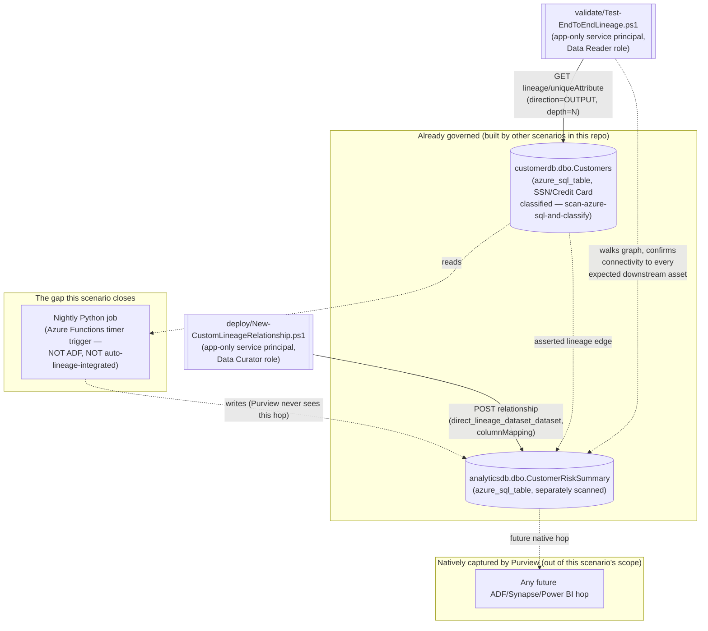

## 1. Scenario summary

Closes a common data-lineage gap - a custom data-processing job that isn't one of Microsoft
Purview's automatically-integrated systems (Azure Data Factory, Synapse, Power BI, Databricks,
Airflow/OpenLineage, and a handful of others) - by asserting the missing link via the Purview Data
Map REST API's custom-lineage support, then proves the *entire* chain from origin to destination is
actually connected with a repeatable, read-only validation script. This is the first Data Lineage
scenario in this repo, and it deliberately targets the harder, more novel half of "lineage" that
the other Data Governance scenarios here don't cover: not "did a scan discover an asset" (Data Map)
or "is the data named and governed" (Unified Catalog) or "is the data any good" (Data Quality), but
"can we actually prove, end-to-end, how data moves and where it came from" - the specific question
root-cause analysis, impact analysis, and audit evidence all depend on.

**Who it's for:** a data governance or platform engineering team that has custom ETL/ELT jobs
(internal scripts, legacy batch processes, anything outside Purview's supported auto-lineage
connector list) sitting between Purview-scanned assets, and needs those hops to show up in lineage
- plus a repeatable way to prove the resulting graph stays connected over time, not just on the day
it was built.

## 2. Business/regulatory driver

Microsoft's own Cloud Adoption Framework guidance for Purview data governance states the
requirement plainly: *"Data lineage provides visibility into how data moves and changes across
systems. Recommendation: Enable automated lineage where available and close gaps manually where
required"* [[3]](#references). A broken or incomplete lineage graph isn't just an inconvenience -
it directly undermines the specific compliance and security use cases lineage exists for: GDPR
Art. 30 records-of-processing and Art. 15 subject-access requests both depend on being able to
trace where personal data flows once it leaves its source of record; PCI DSS cardholder-data-flow
diagrams (Requirement 1.2.4/prior v3.2.1 Requirement 1.1.3) require an accurate, current map of
where card data moves, not a diagram that stops at the first custom transform; and impact analysis
before a schema change - "if we drop this column from `Customers`, what breaks downstream" - is
only as reliable as the graph is complete. A lineage graph that silently stops at every custom job
gives a false sense of completeness: it looks the same, in the portal, as "there is genuinely no
downstream consumer," which is the worst possible failure mode for a control whose entire purpose
is visibility.

This scenario also ties directly into this repo's existing Data Governance narrative:
`scenarios/data-map/scan-azure-sql-and-classify/` already classifies `customerdb.dbo.Customers`
with SSN/Credit Card Number sensitive information types. Without lineage connecting it to
`analyticsdb.dbo.CustomerRiskSummary`, a reviewer asking "where else does this classified data end
up" gets an incomplete answer purely because the connecting job happens to be a custom script
instead of an Azure Data Factory pipeline - an accident of implementation, not a difference in
actual risk.

## 3. Prerequisites

Full licensing detail and citations: `docs/licensing-matrix.md`. Summary for this scenario:

| Requirement | Minimum | Notes |
|---|---|---|
| Microsoft Purview account + Data Map | Active Azure subscription, Purview account with Data Map enabled | Data Map/lineage is **PAYG-billed Azure consumption**, not a per-user M365 entitlement — see `docs/licensing-matrix.md` §1–2 |
| Create/update the custom lineage relationship | **Data Curator** role on the collection containing both target assets | Classic Data Map role — grants access to the **Catalog Data plane**, which is what the entity/relationship/lineage REST operations this scenario uses live on [[7]](#references). **This role is granted at the collection level, not per asset or per relationship** — a service principal holding Data Curator on the collection containing these two tables can create, edit, or delete entities and relationships on *any* asset in that collection, not just the two this scenario targets. See `docs/rbac-model.md` §5 and treat this credential with the same care as any collection-wide write grant, reviewing membership periodically |
| Read lineage only (validation) | **Data Reader** role on the same collection | Least-privilege for the read-only `validate/` script [[7]](#references) |
| Grant the automation identity a Purview role at all | **Collection Admin** role at root (or the relevant sub-collection) to perform the role assignment | Only a Collection Admin can assign Data Curator/Data Reader to a service principal [[7]](#references) |
| The upstream and downstream assets already exist | Both registered and scanned via Data Map (e.g. `scenarios/data-map/scan-azure-sql-and-classify/` for `customerdb.dbo.Customers`, and an equivalent scan of the analytics database for `analyticsdb.dbo.CustomerRiskSummary`) | This scenario does **not** register or scan either source — see §6/`design.md` §6 |
| Automation identity for the REST calls themselves | App registration with **Data Curator** (deploy) or **Data Reader** (validate) Purview role on the collection | Client-secret app-only OAuth2, same token endpoint as this repo's other surface-4 scripts — `docs/automation-surface.md` §3 |

> Verify current entitlement names against `docs/licensing-matrix.md` (dated 2026-09-02) before a
> sales commitment — SKU names and billing meters change.

## 4. Architecture



The deploy script creates one `direct_lineage_dataset_dataset` relationship between two
**already-existing** DataSet entities — it never creates entities, only the edge between them. The
validate script is deliberately a separate, broader check: it walks the whole reachable graph from
the origin asset and confirms every asset in an independently-declared expected chain is actually
connected, not just that this scenario's one link exists. Full design rationale: `design.md`.

## 5. Step-by-step implementation

### Portal path (for a first manual walkthrough / to validate intent before scripting)

1. Confirm both assets already exist: **Data Map** → the source registered and scanned (for
   `customerdb.dbo.Customers`, this is `scenarios/data-map/scan-azure-sql-and-classify/`'s own
   output); repeat the same scan pattern against the analytics database for
   `analyticsdb.dbo.CustomerRiskSummary`.
2. Open each asset's **Overview** page in the Purview portal and copy its exact **Qualified name**
   — this build's grounding pass did not independently confirm the precise qualifiedName string
   format Purview assigns to an `azure_sql_table` asset, so this scenario does not construct or
   guess it; copy it directly from the portal (or resolve it via the Data Map GraphQL/search API)
   into the definition file (§11).
3. To create a lineage link manually first (to see the intended result before scripting it): open
   the upstream asset's **Lineage** tab → look for a manual-lineage option, or use the portal's
   documented manual-lineage entry flow [[6]](#references). This scenario's script path (below) is
   the repeatable, code-reviewable equivalent.
4. Assign the automation identity's *human* counterpart (or yourself, for this walkthrough) the
   **Data Curator** role on the collection containing both assets: **Data Map** → **Collections** →
   select the collection → **Role assignments** → add under **Data curators** [[7]](#references).
5. After creating the link (via script, below), open the upstream asset's **Lineage** tab in the
   portal and confirm the downstream asset now appears, connected by an edge, with the column-level
   mapping visible when you select the edge.

### Script path (idempotent, parameterized, dry-run capable)

```powershell
# 1. Copy the assets' real Qualified Name values from the portal into the definition file first —
#    see deploy/lineage/customer-risk-summary-lineage.json and README.md Section 11.

# 2. Deploy (dry run first — reports which links already exist and which would be created)
./deploy/New-CustomLineageRelationship.ps1 `
    -PurviewAccountEndpoint 'https://api.purview-service.microsoft.com' `
    -TenantId $TenantId -AppId $AppId -ClientSecret $ClientSecret `
    -LineageDefinitionPath './deploy/lineage/customer-risk-summary-lineage.json' `
    -WhatIf

# 3. Deploy for real — creates any missing custom lineage relationships, skips ones that already exist
./deploy/New-CustomLineageRelationship.ps1 `
    -PurviewAccountEndpoint 'https://api.purview-service.microsoft.com' `
    -TenantId $TenantId -AppId $AppId -ClientSecret $ClientSecret `
    -LineageDefinitionPath './deploy/lineage/customer-risk-summary-lineage.json'

# 4. Validate — proves the full chain from the origin asset is connected end-to-end
./validate/Test-EndToEndLineage.ps1 `
    -PurviewAccountEndpoint 'https://api.purview-service.microsoft.com' `
    -TenantId $TenantId -AppId $AppId -ClientSecret $ClientSecret `
    -LineageDefinitionPath './deploy/lineage/customer-risk-summary-lineage.json'
```

Both scripts use the **Microsoft Purview Data Map / Atlas v2 REST API** — automation surface 4 per
`docs/automation-surface.md` §1 — because entity/relationship/lineage objects have no Security &
Compliance PowerShell or Graph equivalent. Token acquisition follows the same client-credentials
pattern already used by this repo's other surface-4 scripts.

## 6. Configuration reference

| Setting | Value this scenario uses | Notes |
|---|---|---|
| Entity type (both ends) | `azure_sql_table` | Confirmed Purview asset type name for an Azure SQL Database table [[8]](#references) |
| Relationship type | `direct_lineage_dataset_dataset` | "DataSet1 is the upstream of DataSet2, although we wouldn't know exactly which Process is between them" — the documented shape for a custom link with no modeled intermediate process [[5]](#references) |
| Column-level detail | `attributes.columnMapping` — a **JSON-encoded string** (not a nested object), matching Microsoft's own worked example exactly | `[{"Source":"CustomerId","Sink":"CustomerId"}]` in the shipped example — see §11 for the scope of what this scenario validates about it |
| Idempotency mechanism | `Lineage - Get By Unique Attribute` (direction `OUTPUT`, depth 1) existence check before every `Relationship - Create` POST | See `design.md` §2/§5 |
| Deploy role | **Data Curator** | Catalog Data plane write access [[7]](#references) |
| Validate role | **Data Reader** | Catalog Data plane read-only access [[7]](#references) |
| API version pinned by both scripts | `2023-09-01` | Confirmed current via direct fetch of Microsoft's own REST reference pages for all four operations this scenario uses (Relationship - Create, Relationship - Delete, Lineage - Get, Lineage - Get By Unique Attribute) |
| `-PurviewAccountEndpoint` accepted values | `https://api.purview-service.microsoft.com` (new portal) or `https://<account>.purview.azure.com` (classic portal) | Both explicitly confirmed as valid for this `/datamap/api/...` path family [[9]](#references) |

Full REST-body grounding: `deploy/New-CustomLineageRelationship.ps1` and
`validate/Test-EndToEndLineage.ps1` inline comments and their `.NOTES` blocks cite the exact
Microsoft Learn reference pages.

## 7. Validation / how to prove it works

1. **Automated end-to-end check** — `./validate/Test-EndToEndLineage.ps1` walks the full graph from
   the origin asset and confirms every asset in `expectedDownstreamChain` is both present *and*
   reachable by a walkable path (not merely co-listed in the response), plus that each custom
   link's column mapping survived. Exits non-zero on any hard failure (safe for a CI-style
   pre-flight or a recurring scheduled check).
2. **Portal evidence** — open `customerdb.dbo.Customers`' **Lineage** tab in the Purview portal;
   `analyticsdb.dbo.CustomerRiskSummary` should now appear downstream, connected by a
   `direct_lineage_dataset_dataset` edge. Selecting the edge should show the `CustomerId ->
   CustomerId` column mapping [[6]](#references).
3. **Negative test (prove the validator actually detects a gap, not just a happy path)** — run
   `deploy/Remove-CustomLineageRelationship.ps1` to delete the link, then re-run
   `validate/Test-EndToEndLineage.ps1` and confirm it now reports a `[FAIL]` for the missing
   downstream asset with the "most likely cause" guidance pointing back at the deploy script — this
   is the concrete proof the validation is actually checking connectivity, not just returning
   success unconditionally. Re-run the deploy script afterward to restore the link.
4. **Idempotency proof** — re-run `deploy/New-CustomLineageRelationship.ps1` a second time against
   an already-deployed link and confirm it reports `[SKIP] ... already exists` rather than creating
   a duplicate edge.

## 8. Operations & tuning

**KPIs to watch (first 30 days):**
- **Validation pass/fail trend** — wire `validate/Test-EndToEndLineage.ps1` into a recurring
  scheduled check (matching the pattern this repo's Data Quality scenario recommends for its own
  validate script). A sudden `[FAIL]` after a run that previously passed usually means either the
  custom relationship was deleted (accidentally, or by an unrelated cleanup script), or one of the
  two assets was re-scanned in a way that changed its qualifiedName — both worth investigating, not
  ignoring as a flake.
- **Chain length / breadth over time** — as more custom hops get added to `expectedDownstreamChain`,
  track how many are asserted (this scenario's pattern) vs. natively captured — a growing share of
  custom-asserted links is a signal worth raising with the platform team: it may mean a
  transform workload should be migrated onto Azure Data Factory or another natively-integrated
  system instead of accumulating more manually-maintained lineage assertions.

**Alert routing:** there is no Purview-native alert for "a lineage relationship was deleted" or "a
lineage graph developed a gap" — unlike DLP or Data Quality, lineage has no `GenerateAlert`
equivalent. The recurring `validate/Test-EndToEndLineage.ps1` run (above) **is** the detection
mechanism for this control; route its non-zero exit code into whatever CI/ops alerting this
buyer already has, the same way `scenarios/data-quality/rules-and-scorecards/README.md` §8
recommends for its own validate script.

**Incident-response runbook (validation reports a gap):**
1. **Triage** — read which specific check failed: "present but not connected" is an unambiguous
   graph topology issue (e.g. the relationship exists but between the wrong GUIDs after one asset
   was re-created by a rescan) — `-MaxDepth` cannot explain it, since the asset already had to be
   within the traversed depth to be "present" at all. "Not present at all" is ambiguous between a
   deleted relationship, a stale qualifiedName in the definition file, and `-MaxDepth` simply being
   too shallow to reach it — rule out the last one first by re-running with a larger `-MaxDepth`
   before assuming the link is genuinely missing.
2. **Classify the cause**, in order of likelihood: (a) `deploy/Remove-CustomLineageRelationship.ps1`
   or a manual portal deletion removed the link; (b) one of the two assets was deleted and
   re-created by a subsequent Data Map rescan, which assigns a **new** GUID even if the
   qualifiedName is unchanged — the old relationship (pointing at the old GUID) silently becomes
   orphaned; (c) the qualifiedName in the definition file is simply wrong or stale.
3. **Remediate** — re-run `deploy/New-CustomLineageRelationship.ps1`; its existence check will
   correctly detect the (b) case as "missing" (the old GUID's relationship is irrelevant once the
   asset itself has a new GUID) and create a fresh, correctly-targeted relationship.
4. **Escalate** if the gap recurs immediately after remediation — likely means the custom transform
   job's target table is being dropped and recreated (not just truncated/reloaded) on every run,
   which will always orphan lineage; that's a signal for the data engineering team to change the
   job's write pattern, not something this scenario's script can work around.

**Review cadence:** re-run `validate/Test-EndToEndLineage.ps1` after any change to either asset's
underlying schema or any rescan of either source, and at minimum monthly as a standing health
check — lineage gaps have no other native detection mechanism (see Alert routing, above).

## 9. Rollback / decommission

See `rollback.md` for the full procedure. Quick reference:
`./deploy/Remove-CustomLineageRelationship.ps1` deletes the custom lineage relationship(s) named in
the definition file; the upstream and downstream assets themselves are never touched (this scenario
didn't create them).

## 10. Cost & licensing notes

- **PAYG, not per-user, and effectively free at this scenario's scale.** Entity/relationship/
  lineage REST calls bill through the same Data Map / Azure-consumption metering as
  `scenarios/data-map/scan-azure-sql-and-classify/` — see `docs/licensing-matrix.md` §1–2. Unlike a
  scan, this scenario's calls are lightweight, low-volume metadata writes (one relationship per
  custom hop), not a data-scanning workload — cost impact at typical scale (tens to low hundreds of
  custom links) is negligible compared to the Data Map scanning this scenario depends on as a
  prerequisite.
- **No M365 per-user license required** — same PAYG/Azure-consumption model as this repo's other
  Data Map scenarios, not an M365 per-user entitlement feature.
- **The real cost driver is operational, not metered**: keeping `expectedDownstreamChain` current
  as new custom hops are added, and running the recurring validation check (§8) — budget engineering
  time for definition-file maintenance, not Azure spend, when scaling this pattern past a handful
  of links.

## 11. Known limitations & gotchas

- **Custom lineage is asserted, not verified.** Purview does not check a custom
  `direct_lineage_dataset_dataset` relationship against reality in any way — it accepts whatever
  the caller (this scenario's deploy script, or a human via the portal) claims. If this repository
  is used to produce audit or compliance evidence ("here is our data flow map"), be explicit in
  that narrative about which edges were natively captured (Purview independently observed the
  system doing the work) versus custom-asserted (an engineer told Purview this is true). This
  scenario's own `README.md` §1/§4 and `deploy/lineage/customer-risk-summary-lineage.json`'s
  `description` field are written to make that distinction easy to preserve downstream — don't
  drop it when citing this graph as evidence.
- **This is the Data Map / Atlas REST surface, not the retiring classic Data Catalog UI.** Several
  citations below (references 1, 2, 4, 6) point at articles titled "classic Data Catalog" because
  that's where Microsoft documents lineage *concepts* (the DataSet/Process model, relationship
  types, the supported auto-lineage system list) in most detail. The REST API this scenario
  actually calls (`datamap/api/atlas/v2/...`, references 5/10–14) is the current, actively
  maintained Data Map data plane — the same one the (non-deprecated) Unified Catalog reads from
  for its own Lineage tab. Nothing this scenario builds depends on the classic Data Catalog UI or
  is at risk from its retirement.
- **This scenario does not model the transform as a Process asset.** The lineage graph shows a
  direct edge from `customerdb.dbo.Customers` to `analyticsdb.dbo.CustomerRiskSummary` with no
  intermediate node representing the nightly job itself — Microsoft's model supports a richer
  DataSet -> Process -> DataSet shape, but this build's grounding pass did not confirm a
  REST-documented body for creating a *custom* Process-typed entity (only for referencing the
  built-in `Process` type against entities a tutorial had already created via a different flow —
  see `design.md` Section 1/7). Follow-up tracked in `PROGRESS.md`.
- **VERIFY — the exact qualifiedName format Purview assigns to an `azure_sql_table` asset.** This
  build's grounding pass did not find a documented format string (e.g. an `mssql://...` scheme) for
  this asset type specifically. This scenario's definition file requires the operator to copy the
  real value from each asset's Overview page in the portal rather than having either script
  construct or guess it.
- **VERIFY — `Relationship - Create`'s behavior on a duplicate POST.** This build's grounding pass
  confirmed `Relationship - Create`'s request/response shape directly from Microsoft's REST
  reference, but that reference does not state whether re-POSTing an identical relationship
  rejects, no-ops, or creates a second (duplicate) edge. This scenario's own existence check makes
  its idempotency independent of the answer (`design.md` Section 2), but a production integration
  that calls `Relationship - Create` directly, without this scenario's check first, should confirm
  the behavior against a pilot tenant.
- **A rescanned asset gets a new GUID even if its qualifiedName is unchanged.** If either the
  upstream or downstream table is deleted and re-registered (not just re-scanned in place) by Data
  Map, the old relationship — which points at GUIDs, not qualifiedNames, once created — becomes
  orphaned. `validate/Test-EndToEndLineage.ps1` will correctly detect this as a connectivity
  failure (see §8's incident-response runbook); re-running the deploy script resolves it.
- **This scenario's validate script checks that a column mapping is *present*, not that it's
  *correct or current*.** It confirms the `columnMapping` attribute this scenario's own deploy
  script wrote didn't get cleared or corrupted — it does not re-derive the mapping from either
  table's live schema, so a schema change that silently invalidates the mapping (e.g. `CustomerId`
  renamed on one side) is not caught by this scenario. See `design.md` Section 7.
- **No Purview-native alerting for a broken lineage link** — see §8's Alert routing note; the
  recurring `validate/` run is the only detection mechanism this scenario provides.

## 12. References

1. Data lineage in classic Data Catalog (overview, use cases, granularity) — <https://learn.microsoft.com/purview/data-gov-classic-lineage>
2. Data lineage user guide for classic Data Catalog (lineage collection, supported systems table, known limitations) — <https://learn.microsoft.com/purview/data-gov-classic-lineage-user-guide>
3. Data governance and security baselines with Microsoft Purview — "Data visibility baseline" (Recommendation: "Enable automated lineage where available and close gaps manually where required") — <https://learn.microsoft.com/azure/cloud-adoption-framework/data/governance-security-baselines-purview-data-estate-unify-data-platform>
4. Data lineage user guide for classic Data Catalog — supported data-processing-system lineage table (ADF, Synapse, Azure SQL Database preview, Airflow/OpenLineage, Azure Data Share) — <https://learn.microsoft.com/purview/data-gov-classic-lineage-user-guide#lineage-collection>
5. Create and get lineage relationships using the REST API (concepts, relationship types, worked Bulk Create/Create Relationship/Get Lineage examples, `direct_lineage_dataset_dataset` shape) — <https://learn.microsoft.com/purview/data-gov-api-create-lineage-relationships>
6. Data lineage user guide for classic Data Catalog — manual lineage entries and portal Lineage tab — <https://learn.microsoft.com/purview/data-gov-classic-lineage-user-guide#manual-lineage>
7. Tutorial: Authenticate for Microsoft Purview data-plane APIs (service principal setup, Data Curator/Data Reader roles for the Catalog Data plane, token acquisition) — <https://learn.microsoft.com/purview/data-gov-api-rest-data-plane>
8. Type definitions and how to create custom types — confirms `azure_sql_table` as the Azure SQL Table asset type name — <https://learn.microsoft.com/purview/data-gov-api-custom-types>
9. GraphQL API with Microsoft Purview (preview) — confirms both `api.purview-service.microsoft.com` (new portal) and `{account}.purview.azure.com` (classic portal) as valid endpoint hosts for the `/datamap/api/...` path family — <https://learn.microsoft.com/purview/data-gov-api-graphql>
10. Relationship - Create REST reference (API version 2023-09-01) — <https://learn.microsoft.com/rest/api/purview/datamapdataplane/relationship/create>
11. Relationship - Delete REST reference (API version 2023-09-01) — <https://learn.microsoft.com/rest/api/purview/datamapdataplane/relationship/delete>
12. Lineage - Get REST reference (API version 2023-09-01) — <https://learn.microsoft.com/rest/api/purview/datamapdataplane/lineage/get>
13. Lineage - Get By Unique Attribute REST reference (API version 2023-09-01) — <https://learn.microsoft.com/rest/api/purview/datamapdataplane/lineage/get-by-unique-attribute>
14. Entity - Bulk Create Or Update REST reference (API version 2023-09-01; upsert-by-qualifiedName semantics, referenced for contrast in `design.md`) — <https://learn.microsoft.com/rest/api/purview/datamapdataplane/entity/bulk-create-or-update>

> Re-verify all links and the two VERIFY items in §11 against current Microsoft Learn before a
> customer-facing deployment — Microsoft's own Data Map REST surface is explicitly called out
> elsewhere in this repo (`scenarios/data-map/scan-azure-sql-and-classify/README.md` §11) as
> evolving.
