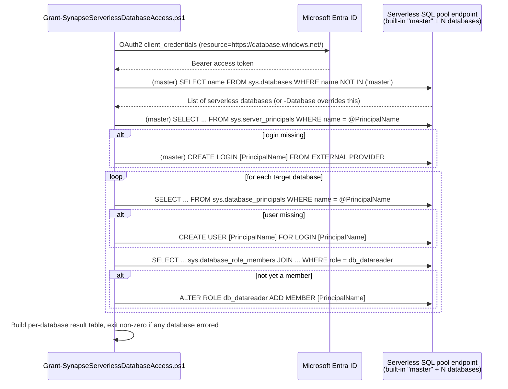

## 1. Problem statement

`scenarios/data-map/scan-azure-synapse-and-classify/` documents a real, CISO-flagged cost-scaling
problem (`reviews.md`, CISO finding 1; `README.md` §3's cost/effort note): the serverless half of that
scenario's enumeration-authentication story needs a `CREATE LOGIN ... FROM EXTERNAL PROVIDER` and a
`CREATE USER ...` + `db_datareader` grant applied before the Purview scan can classify anything, and
Microsoft's own documented procedure is a manual, per-database Synapse Studio walkthrough. A workspace
with a handful of serverless databases makes this a minor one-time chore; a workspace with dozens (a
realistic shape for an enterprise data-mesh-style Synapse deployment, where teams spin up their own
serverless databases over external tables) turns it into dozens of manual SQL-script operations before
the parent scenario's scan can do anything useful. This scenario automates that loop.

## 2. Design goals

1. **Solve exactly the CISO-flagged gap, nothing more.** This is a bulk-application script for one
   specific, named prerequisite step of the parent scenario - not a general-purpose Synapse
   administration toolkit and not a re-implementation of the parent scenario's own Purview
   registration/scan logic.
2. **Get the server-scoped-vs-per-database question right, even though it means correcting the
   framing the parent scenario shipped with.** §4 below is the single source of truth for this.
3. **Idempotent, safe to re-run against a workspace where some databases are already granted.** Every
   mutating statement is preceded by a live catalog check; a re-run only touches what's still missing.
4. **Don't let one bad database sink the batch.** A single database that fails (e.g. a read-only
   Spark/Lake replica - see §6) is reported and skipped, not a fatal error for every other database in
   the run.
5. **Don't fabricate what isn't confirmed.** Every T-SQL statement and catalog-view query this scenario
   uses is grounded in a directly-fetched Microsoft Learn page (see §7) - none of it is inferred from
   API naming conventions the way some of the parent scenario's own Data Map REST body properties had
   to be.

## 3. Why a separate scenario/script, not an extension of the parent scenario's own deploy script

The parent scenario's `New-AzureSynapseDataMapScan.ps1` calls the **Microsoft Purview Data Map REST
API** (`https://{account}.purview.azure.com`) - automation surface 4 per `docs/automation-surface.md`.
This scenario's script calls **the Synapse serverless SQL pool endpoint directly** via T-SQL
(`Invoke-Sqlcmd -AccessToken`, resource `https://database.windows.net/`) - a materially different
automation surface with a materially different identity model:

| | Parent scenario's deploy script | This scenario's deploy script |
|---|---|---|
| Target | Purview Data Map control plane | The Synapse workspace's own SQL engine |
| Auth resource | `https://purview.azure.net` | `https://database.windows.net/` |
| Required role on the caller | Purview **Data Source Administrator** (a Purview RBAC role) | Synapse **Synapse Administrator** / SQL Active Directory Admin (an Azure Synapse RBAC role - a completely different system; see README.md §3 and `docs/rbac-model.md`'s gap note below) |
| What it does | Registers a data source + scan object | Runs DDL (`CREATE LOGIN`/`CREATE USER`/`ALTER ROLE`) directly against the target databases |

Folding this into the parent script would mean one script juggling two unrelated authentication
surfaces and two unrelated privilege models - the same one-script-per-genuinely-different-surface
precedent this repo already follows for module boundaries (e.g. `scan-azure-synapse-and-classify`
itself staying a separate scenario from its two Azure SQL siblings, `design.md` §3 there).

**Not a duplicate of a native Microsoft capability.** Checked directly during this build: Microsoft's
own documentation for both the enumeration-login and per-database grant steps consistently directs
operators to "run SQL scripts" against each database, with no ARM template, `Az.Synapse` cmdlet, or
portal bulk action found that performs this operation across multiple databases in one call.
`Az.Synapse`'s `New-AzSynapseRoleAssignment` manages Synapse **workspace RBAC roles** (e.g. Synapse
Administrator) - a different, adjacent system from the database-level `db_datareader` grant this
scenario automates, not a substitute for it (flagged as a Microsoft Product Owner finding in
`reviews.md`).

**Cross-cutting doc gap surfaced by this build, not fixed here:** neither `docs/automation-surface.md`
(five REST/PowerShell/Graph surfaces, none of them a direct T-SQL connection) nor
`docs/rbac-model.md` (nine systems, none of them Azure Synapse's own workspace RBAC) currently covers
what this scenario's script actually is - a sixth automation surface and a tenth RBAC system
respectively. Flagged in `README.md` §3/§11 and recorded as a follow-up in `PROGRESS.md` rather than
edited into those two cross-cutting docs in this same fragment (`AGENTS.md` §6 - one fragment per
turn).

## 4. The server-scoped-vs-per-database correction (read this before touching the script)

The parent scenario's `README.md` §5 step 3c and `design.md` §4 describe the serverless
`CREATE LOGIN ... FROM EXTERNAL PROVIDER` step as something to **"repeat for every serverless database
to be scanned"** - a direct, literal transcription of Microsoft's own portal walkthrough, which frames
the step as something you do from inside each database's own Synapse Studio "New SQL script" context
(`register-scan-synapse-workspace` §"Authentication for enumerating serverless SQL Database
resources").

This build's own grounding pass, going one level deeper than the parent scenario's build did, found two
independent, directly-fetched Microsoft Learn pages stating plainly that this is a **server-level**
operation:

- *Troubleshoot serverless SQL pool in Azure Synapse Analytics*: a worked `CREATE LOGIN`/role-grant
  example is prefixed with `use master` and the page's own text for the closely related
  workspace-level-reader pattern states the statements **"should be executed on master database, as
  these are all server-level permissions."**
- *Access lake databases using serverless SQL pool*'s "Create workspace-level data reader" example runs
  `CREATE LOGIN [wsdatareader@contoso.com] FROM EXTERNAL PROVIDER` exactly **once**, with no per-database
  repetition, immediately followed by two `GRANT ... TO` statements that are also server-level.

This is also the standard, unsurprising SQL Server/Azure SQL behavior: `CREATE LOGIN` has always been a
server-scoped statement regardless of which database context executes it - Synapse serverless is not
documented anywhere as an exception to that rule. Microsoft's own portal walkthrough repeating the step
per database is best read as a UI-navigation artifact (you can only reach "New SQL script" from inside a
specific database's context in Synapse Studio), not a statement about the underlying login's scope.

**Consequence for this script:** `Grant-SynapseServerlessDatabaseAccess.ps1` creates the login **once**,
against `master`, guarded by a `sys.server_principals` existence check - not once per database. This is
also precisely why a bulk-grant script is worth having at all beyond "a loop that repeats one
command": the genuinely per-database work is only the `CREATE USER`/`ALTER ROLE` pair, which this
script still applies once per target database.

**Not retroactively fixed in the parent scenario.** `scan-azure-synapse-and-classify/README.md` and
`design.md` are not edited by this fragment - a follow-up to reconcile that scenario's wording is
recorded in `PROGRESS.md` instead, consistent with this repo's existing practice of not batching a
second scenario's edits into a new scenario's own fragment (`AGENTS.md` §6).

## 5. Object model and call sequence

## 6. Key decisions

| Decision | Choice | Rationale |
|---|---|---|
| Automation surface | Direct T-SQL via `Invoke-Sqlcmd -AccessToken` against the serverless endpoint | The parent scenario's REST-based deploy script has no operation for granting SQL-level permissions - this genuinely is a different surface, see §3 |
| Login-creation scope | **Once**, against `master`, not once per database | Corrected per §4's grounding - server-scoped statement |
| Enumeration mechanism | `SELECT name FROM sys.databases` against the built-in pool's `master` | Directly confirmed by Microsoft's own worked example in *Access lake databases using serverless SQL pool* |
| Idempotency mechanism | Live catalog checks (`sys.server_principals`/`sys.database_principals`/`sys.database_role_members`) before every mutating statement | Matches this repo's established idempotency pattern (check-then-act) used elsewhere for surfaces with no native create-or-replace semantics |
| Per-database failure handling | Catch and continue, report a result table, exit non-zero only if the run had ≥1 error | A bulk operation across N independent databases should not be all-or-nothing; matches the parent scenario's own scan-level behavior of not failing a whole registration over one bad property |
| Operator identity (`-AppId`) | A Synapse **Synapse Administrator**-privileged service principal - distinct from `-PrincipalName`, the (typically lower-privileged) identity being granted read access | Confirmed by Microsoft's own *Azure Synapse workspace access control overview*: "Synapse Administrators are granted db_owner (DBO) permissions on the serverless SQL pool, Built-in. To grant other users access to the serverless SQL pool, Synapse administrators need to run SQL scripts on the serverless pool." |
| Input handling for `-PrincipalName` | Character allow-list `ValidatePattern` + bracket/literal escaping before splicing into generated T-SQL | `-PrincipalName` becomes part of `CREATE LOGIN [...]`/`CREATE USER [...]` identifiers and `WHERE name = N'...'` literals - untrusted input here would be a SQL-injection vector into DDL with elevated privilege |
| Default policy mode | No mutating statement runs without either a live catalog check confirming it's needed, or `-WhatIf` reporting it | Matches `AGENTS.md` §4's dry-run-by-default code standard |

## 7. Grounding method for this build

`learn.microsoft.com` was directly reachable via the Microsoft Learn MCP documentation tool during this
build (both search and full-page fetch) - unlike several earlier Data Map fragments in this repo, which
recorded `EGRESS_BLOCKED` for direct fetches and fell back to WebSearch-only grounding. Every T-SQL
statement, catalog-view query, and the `Invoke-Sqlcmd -AccessToken` connection pattern in this
scenario's scripts is confirmed by a **direct, full fetch** of the cited Microsoft Learn pages (listed
in the deploy script's own `.NOTES` and `README.md` §12), not inferred or reconstructed from search
snippets.

## 8. Non-goals

- **Dedicated SQL pool bulk-granting.** Dedicated pools use a different, non-login-based grant pattern
  (`CREATE USER ... FROM EXTERNAL PROVIDER` + `sp_addrolemember`, no separate `CREATE LOGIN` step), and
  a workspace typically has at most one dedicated pool - the CISO-flagged scaling problem this scenario
  solves is specific to serverless's many-databases-per-workspace shape. Out of scope; the parent
  scenario's own manual walkthrough (§5 step 4, dedicated branch) remains the documented path for that
  one-time cost.
- **Auto-detecting read-only Spark/Lake-replicated databases.** Microsoft's own documentation states
  these "do not apply" to the serverless grant steps (they are read-only), but no catalog column or
  documented signal identifying them was found during this build's grounding pass. This script surfaces
  a failed grant attempt against one as a per-database `Error` result rather than fabricating a
  detection heuristic; `-ExcludeDatabase` lets an operator skip known ones on subsequent runs. See
  `README.md` §11.
- **Creating the operator's own Synapse Administrator role assignment.** A documented prerequisite
  (`README.md` §3), not a deliverable - granting oneself elevated Synapse RBAC is exactly the kind of
  rare, high-privilege, one-time directory/workspace grant this repo's established convention (see
  PROGRESS.md's `verify-purview-entra-graph-prerequisites` follow-up) declines to automate.
- **The external-table scoped-credential grant** (`GRANT REFERENCES ON DATABASE SCOPED
  CREDENTIAL::...`) - unchanged non-goal carried over from the parent scenario; workspace-specific
  credential names can't be generically parameterized here either.
- **Registering or running the Purview scan itself** - that remains
  `scan-azure-synapse-and-classify/deploy/New-AzureSynapseDataMapScan.ps1`'s job.
