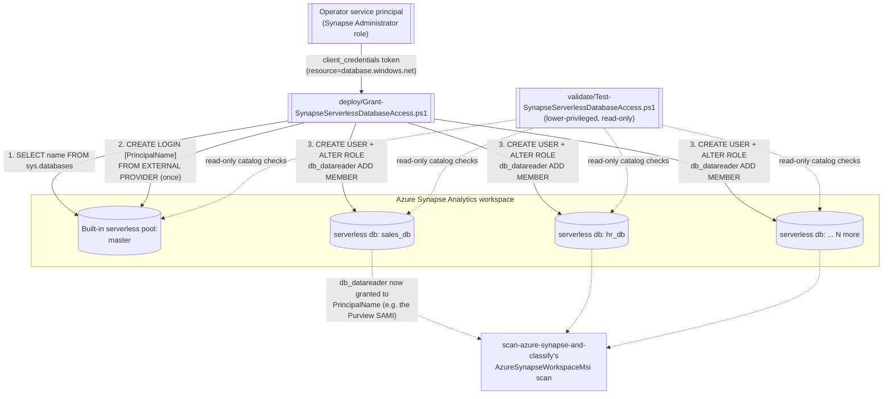

## 1. Scenario summary

Automates the per-serverless-database `CREATE LOGIN`/`CREATE USER`/`db_datareader` grants
`scenarios/data-map/scan-azure-synapse-and-classify/`'s serverless-SQL-pool scanning path depends on,
across every serverless database in an Azure Synapse Analytics workspace (or an explicit subset) in one
idempotent run, instead of the manual, per-database Synapse Studio SQL-script walkthrough Microsoft
documents. This is a **companion/prerequisite-automation scenario**, not a standalone one - it exists
because that parent scenario's own four-lens review flagged the manual version as a real cost that
scales with database count, not a fixed one-time chore (see `reviews.md`, CISO finding 1, there).

**Who it's for:** the same data governance/security team deploying
`scan-azure-synapse-and-classify/` against a Synapse workspace that has more than a handful of
serverless databases - a common shape for a workspace supporting several teams' own external-table
databases over a shared data lake.

## 2. Business/regulatory driver

Same underlying drivers as the parent scenario (`scan-azure-synapse-and-classify/README.md` §2) - this
scenario doesn't add a new regulatory driver of its own, it removes an operational blocker to realizing
that scenario's classification coverage at scale. A workspace whose prerequisite grants are only
partially applied (because the manual per-database walkthrough was too costly to finish) has classification
coverage gaps in exactly the databases nobody got around to granting - a silent, self-inflicted version of
the same "unclassified aggregation point" risk the parent scenario's §2 describes.

## 3. Prerequisites

Full licensing detail and citations: `docs/licensing-matrix.md` (no incremental license cost - this
scenario uses only Azure Synapse's own RBAC/SQL surface, not a Purview or M365 entitlement). Summary for
this scenario:

| Requirement | Minimum | Notes |
|---|---|---|
| Operator identity to run this script (`-AppId`) | **Synapse Administrator** role on the workspace (Azure Synapse's own RBAC, assignable in Synapse Studio → **Manage** → **Access control**, or `New-AzSynapseRoleAssignment -RoleDefinitionName 'Synapse Administrator'` from the `Az.Synapse` module) | A **completely different RBAC system** from the Purview roles the parent scenario's deploy script needs - confirmed via Microsoft's own *Azure Synapse workspace access control overview*: "Synapse Administrators are granted db_owner (DBO) permissions on the serverless SQL pool... To grant other users access to the serverless SQL pool, Synapse administrators need to run SQL scripts on the serverless pool." **Not yet cross-referenced in `docs/rbac-model.md`** (that doc currently documents nine systems, none of them Azure Synapse workspace RBAC), flagged rather than guessed at a section number; recorded as a follow-up in `PROGRESS.md` |
| Principal being granted access (`-PrincipalName`) | Any Microsoft Entra-backed principal Azure Synapse accepts in `CREATE LOGIN ... FROM EXTERNAL PROVIDER` | Typically the Microsoft Purview account's own display name (the parent scenario's SAMI) - the two parameters are deliberately different identities in the common case, see `design.md` §6 |
| Workspace **firewall**: "Allow Azure services and resources to access this workspace" = **On** | Azure portal → the workspace → **Firewalls/Networking** | Same prerequisite the parent scenario documents (`scan-azure-synapse-and-classify/README.md` §3) - this script also needs a network path to the serverless endpoint, from wherever it runs |
| `SqlServer` PowerShell module | A version supporting `Invoke-Sqlcmd -AccessToken` (Microsoft's own worked examples for this parameter use current module releases; pin a specific version before shipping to a buyer) | `Install-Module -Name SqlServer -Scope CurrentUser`. This is a **sixth automation surface** for this repo, not yet catalogued in `docs/automation-surface.md`'s five - see §11 |
| Automation identity for the read-only `validate/` script | A lower-privileged identity than the deploy script's operator - only needs `CONNECT`/catalog-view visibility, not Synapse Administrator | See `validate/Test-SynapseServerlessDatabaseAccess.ps1`'s own `.PARAMETER AppId` note |

> Verify current role names and RBAC assignment mechanics against `docs/rbac-model.md` and Microsoft
> Learn before a sales commitment - this scenario's RBAC system (Azure Synapse workspace roles) is not
> yet cross-referenced there.

## 4. Architecture



## 5. Step-by-step implementation

### Portal path (for a first manual walkthrough / to validate intent before scripting)

This scenario automates a bulk version of Microsoft's own documented manual procedure - see
`scan-azure-synapse-and-classify/README.md` §5 steps 3c, 4 for the equivalent single-database portal
walkthrough (Synapse Studio → **Data** → a database's **...** menu → new SQL script). This scenario's
script exists specifically to replace repeating that walkthrough once per database.

### Script path (idempotent, parameterized, dry-run capable)

```powershell
# 1. Dry run - reports every login/user/role statement that would run, changes nothing
./deploy/Grant-SynapseServerlessDatabaseAccess.ps1 `
    -ServerlessSqlEndpoint 'ws-contoso-prod-ondemand.sql.azuresynapse.net' `
    -PrincipalName 'contoso-purview' `
    -TenantId $TenantId -AppId $OperatorAppId -ClientSecret $OperatorClientSecret `
    -WhatIf

# 2. Apply for real, across every serverless database in the workspace
./deploy/Grant-SynapseServerlessDatabaseAccess.ps1 `
    -ServerlessSqlEndpoint 'ws-contoso-prod-ondemand.sql.azuresynapse.net' `
    -PrincipalName 'contoso-purview' `
    -TenantId $TenantId -AppId $OperatorAppId -ClientSecret $OperatorClientSecret

# 3. Apply, excluding a known read-only Spark/Lake-replicated database
./deploy/Grant-SynapseServerlessDatabaseAccess.ps1 `
    -ServerlessSqlEndpoint 'ws-contoso-prod-ondemand.sql.azuresynapse.net' `
    -PrincipalName 'contoso-purview' `
    -TenantId $TenantId -AppId $OperatorAppId -ClientSecret $OperatorClientSecret `
    -ExcludeDatabase 'spark_replica_db'

# 4. Validate (lower-privileged, read-only identity)
./validate/Test-SynapseServerlessDatabaseAccess.ps1 `
    -ServerlessSqlEndpoint 'ws-contoso-prod-ondemand.sql.azuresynapse.net' `
    -PrincipalName 'contoso-purview' `
    -TenantId $TenantId -AppId $ReaderAppId -ClientSecret $ReaderClientSecret
```

Run this scenario's deploy script **before** `scan-azure-synapse-and-classify/deploy/
New-AzureSynapseDataMapScan.ps1 -RunNow` (or before its recurring trigger's next fire) - the parent
scenario's scan silently returns zero serverless assets for any database this scenario hasn't yet
granted access to, per that scenario's own `README.md` §8 incident-response cause (e).

> **Always run step 1 (`-WhatIf`) first and read the printed database count/list before step 2.**
> The manual, one-database-at-a-time portal walkthrough this script replaces has built-in friction
> that forces a human to look at each database before granting it access; a single bulk run against
> the wrong `-ServerlessSqlEndpoint`, or without `-ExcludeDatabase` for databases that shouldn't be
> in scope, removes that friction and can grant read access across every database in a workspace in
> one shot (flagged as a Red Team finding in `reviews.md`). For a workspace that mixes
> sensitivity levels across databases, prefer an explicit `-Database` allow-list over the
> full-workspace default until you've confirmed the scope is what you intend.

## 6. Configuration reference

| Setting | Value this scenario uses | Notes |
|---|---|---|
| Login creation | **Once**, `CREATE LOGIN [...] FROM EXTERNAL PROVIDER`, run against `master` | Corrected from the parent scenario's per-database framing - see `design.md` §4 |
| Per-database user | `CREATE USER [...] FOR LOGIN [...];` | Skipped if the user already exists (idempotent) |
| Per-database role membership | `ALTER ROLE db_datareader ADD MEMBER [...];` | Skipped if already a member (idempotent) |
| Database enumeration | `SELECT name FROM sys.databases WHERE name NOT IN ('master')` against the built-in pool's `master` | Confirmed via Microsoft's own worked example, see `design.md` §7; override with `-Database` |
| Connection mechanism | `Invoke-Sqlcmd -ServerInstance <endpoint> -Database <db> -AccessToken <token>` | Confirmed via `Invoke-Sqlcmd`'s own "Example 12: Connect to Azure SQL Database (or Managed Instance) using a Service Principal" reference |
| Token resource/audience | `https://database.windows.net/` | Distinct from the parent scenario's `https://purview.azure.net` - this script never calls the Purview control plane |
| Login-existence check | `SELECT COUNT(*) FROM sys.server_principals WHERE name = @p AND type IN ('E','X')` | `'E'`/`'X'` are the external/Azure-AD server-principal type codes, per Microsoft's own troubleshooting-doc worked example |
| User/role-membership check | `sys.database_principals` joined to `sys.database_role_members` | Same join shape as Microsoft's own `register-scan-synapse-workspace` verification query, narrowed to the target principal |
| Untrusted-input handling | `-PrincipalName` validated by `ValidatePattern`, then bracket/literal-escaped before use in generated T-SQL | See both scripts' `.NOTES` |

## 7. Validation / how to prove it works

1. **Automated check**, `./validate/Test-SynapseServerlessDatabaseAccess.ps1` confirms the server-level
   login exists and, for every target database, that the principal is both a database user and a
   `db_datareader` member. Exits non-zero on any hard failure.
2. **Manual spot-check**, from Synapse Studio, against any target database:
   ```sql
   SELECT p.name AS UserName, r.name AS RoleName
   FROM sys.database_principals p
   LEFT JOIN sys.database_role_members rm ON p.principal_id = rm.member_principal_id
   LEFT JOIN sys.database_principals r ON rm.role_principal_id = r.principal_id
   WHERE p.authentication_type_desc = 'EXTERNAL'
   ORDER BY p.name;
   ```
   (Microsoft's own documented verification query, unfiltered - shows every external principal, not
   just the one this scenario granted.)
3. **Downstream evidence**, after running this scenario's deploy script, re-run
   `scan-azure-synapse-and-classify/deploy/New-AzureSynapseDataMapScan.ps1 -RunNow` and confirm (via
   that scenario's own `validate/Test-AzureSynapseDataMapScan.ps1` and §7) that the previously-ungranted
   databases now report discovered/classified assets.

## 8. Operations & tuning

**When to run this scenario:** on first deployment of `scan-azure-synapse-and-classify/` against a
serverless-pool-bearing workspace, and again whenever a new serverless database is added to that
workspace (this script is safe to re-run against the whole workspace each time - already-granted
databases are skipped, only new ones are touched).

**KPI:** `Error` count in the deploy script's own result table, trending to zero. A persistent non-zero
count after excluding known read-only replicas (§11) indicates a database with some other, unexpected
access problem worth a direct look (e.g. the operator identity's Synapse Administrator role was revoked,
or the workspace firewall setting was reverted).

**Review cadence:** re-run alongside the parent scenario's own review cadence
(`scan-azure-synapse-and-classify/README.md` §8) - specifically, after any new serverless database is
added to the workspace, and after any database restore/recreate (which, per that scenario's own
incident-response cause (e), silently drops these grants).

**Downstream use:** feeds directly into `scan-azure-synapse-and-classify/`'s serverless scanning path -
this scenario produces no classification or catalog output of its own.

**Change-management note:** because one run can touch every database in a workspace, treat a `-WhatIf`
preview's printed target list as the artifact your change-approval process reviews - the same role a
single pull request diff plays for a code change - rather than approving "run the bulk-grant script"
as an undifferentiated one-line change request (flagged as a CISO finding in `reviews.md`).

**Audit trail:** this script's own console output (the per-database result table) is not persisted
anywhere by default - redirect it to a transcript (`Start-Transcript`) or capture it in your pipeline's
own run log if you need a durable record of which run granted which database. The authoritative,
tamper-evident record of the actual `CREATE LOGIN`/`CREATE USER`/`ALTER ROLE` statements is Azure SQL/
Synapse's own **SQL auditing** (workspace **Auditing** blade → diagnostic logs), which this scenario
does not configure or verify, flagged as a Blue Team finding in `reviews.md` and out of scope for this
fragment (a candidate for a future cross-cutting Data Map auditing scenario, not built here).

## 9. Rollback / decommission

See `rollback.md` for the full procedure (revoke `db_datareader` membership per database, optionally
drop the server-level login). Quick reference: this scenario's deploy script has no corresponding
`Remove-*` script - revocation is a small enough, low-frequency operation that this fragment documents
it as direct T-SQL in `rollback.md` rather than shipping a third script; see that file for the exact
statements and staging.

## 10. Cost & licensing notes

No incremental license cost - this scenario grants SQL-level permissions using Azure Synapse's own RBAC
and T-SQL surface, not a Purview or Microsoft 365 entitlement. The operator identity's Synapse
Administrator role assignment itself has no billing implication either. See `docs/licensing-matrix.md`
for the parent scenario's own PAYG/Azure-consumption notes, which this scenario doesn't add to.

## 11. Known limitations & gotchas

- **Cannot auto-detect read-only Spark/Lake-replicated databases.** Microsoft documents that "the
  following steps for serverless databases do not apply to replicated databases" (databases replicated
  from a Spark/Lake database are currently read-only), but no catalog column or documented signal
  identifying them was found during this build's grounding pass. This script surfaces a failed grant
  attempt against one as a per-database `Error` in its result table rather than fabricating a detection
  heuristic - use `-ExcludeDatabase` to skip known ones on subsequent runs.
- **`-PrincipalName` for a service-principal grantee is a known naming ambiguity this repo already
  carries elsewhere.** Microsoft's own documentation uses the literal placeholder `[ServicePrincipalID]`
  for this case without stating whether it means the app's display name or its application (client) ID
  - the same ambiguity `scan-azure-synapse-and-classify` and its two Azure-SQL siblings already flag for
  their own service-principal-authentication non-goals. This scenario's default use case (granting the
  Purview account's own MSI, by its unambiguous display name) is unaffected.
- **CORRECTION applied here, not yet backported to the parent scenario.** `scan-azure-synapse-and-classify/
  README.md` §5 step 3c and `design.md` §4 describe `CREATE LOGIN` as a per-database step. This
  scenario's own grounding pass found two independent Microsoft Learn sources confirming it is a
  server-scoped statement (run once against `master`) - see `design.md` §4 for the full grounding. This
  scenario implements the corrected behavior; the parent scenario's wording is not edited by this
  fragment (`AGENTS.md` §6) - a follow-up to reconcile it is recorded in `PROGRESS.md`.
- **Idempotency checks match by name only, not by a stable identifier.** The login/user-existence
  checks (`sys.server_principals`/`sys.database_principals` filtered by `name = @PrincipalName`) would
  treat an unrelated pre-existing principal that happens to share the same display name as "already
  granted," silently skipping the intended grant. Azure Synapse's external-provider login model doesn't
  document a way to pin a specific Microsoft Entra object ID at creation time the way a dedicated pool's
  SID-aware variant can, flagged as a Red Team finding in `reviews.md` rather than resolved by
  guessing a pinning mechanism. Low real-world likelihood (display-name collisions across
  Entra-backed principals in one tenant are uncommon) but worth knowing before trusting this script's
  "already granted" result for a principal name you didn't choose yourself.
- **Cross-cutting doc gaps surfaced, not fixed here.** This scenario introduces a **sixth** automation
  surface (direct T-SQL via `Invoke-Sqlcmd`) not yet in `docs/automation-surface.md`'s five, and relies
  on a **tenth** RBAC system (Azure Synapse workspace roles - Synapse Administrator) not yet in
  `docs/rbac-model.md`'s nine. Both are flagged inline above rather than silently assumed covered;
  follow-ups to add them are recorded in `PROGRESS.md`.
- **Dedicated SQL pools are out of scope** - see `design.md` §8. The parent scenario's manual,
  one-time-per-workspace dedicated-pool grant remains unautomated (and, per that scenario's own
  reasoning, doesn't need bulk automation - a workspace typically has at most one dedicated pool).
- **Network path required from wherever this script runs.** Unlike the parent scenario's SAMI-authenticated
  scan (which runs inside the Purview service), this script's operator identity connects directly to the
  serverless SQL endpoint over TDS/1433 from wherever the script executes - confirm outbound network
  reachability (and the workspace firewall setting) from that location before troubleshooting an
  authentication failure as a permissions problem.

## 12. References

1. Connect to and manage Azure Synapse Analytics workspaces in Microsoft Purview (per-database
   `CREATE USER`/`ALTER ROLE`/verification-query T-SQL this scenario's per-database logic is modeled
   on), <https://learn.microsoft.com/purview/register-scan-synapse-workspace>
2. Invoke-Sqlcmd (SqlServer PowerShell module reference, confirms the `-AccessToken`
   client-credentials connection pattern via its own "Example 12" worked example), <https://learn.microsoft.com/powershell/module/sqlserver/invoke-sqlcmd>
3. Access lake databases using serverless SQL pool (confirms `SELECT * FROM sys.databases` as the
   documented way to enumerate databases visible to a serverless SQL pool, and the once-only
   `CREATE LOGIN` "Create workspace-level data reader" example), <https://learn.microsoft.com/azure/synapse-analytics/metadata/database>
4. Troubleshoot serverless SQL pool in Azure Synapse Analytics (confirms `CREATE LOGIN` as a
   `master`-scoped, server-level statement, and the `sys.server_principals` login-existence query), <https://learn.microsoft.com/azure/synapse-analytics/sql/resources-self-help-sql-on-demand>
5. Azure Synapse workspace access control overview (confirms the Synapse Administrator role's
   `db_owner` permission on the serverless pool and its authority to grant others access), <https://learn.microsoft.com/azure/synapse-analytics/security/synapse-workspace-access-control-overview>
6. SQL Authentication in Azure Synapse Analytics (confirms bracket-quoted `CREATE LOGIN`/`CREATE USER`
   syntax forms for both SQL and Microsoft Entra-backed principals), <https://learn.microsoft.com/azure/synapse-analytics/sql/sql-authentication>
7. `scenarios/data-map/scan-azure-synapse-and-classify/`, the parent scenario this one is a
   prerequisite-automation companion to; see its `README.md` §3 (the CISO-flagged cost note this
   scenario resolves) and `reviews.md` (CISO finding 1).

> Re-verify all cmdlet parameters, T-SQL syntax, and RBAC role names against current Microsoft Learn
> before a customer-facing deployment. This build's `learn.microsoft.com` fetches succeeded directly
> (via the Microsoft Learn documentation tool) rather than needing the WebSearch-only fallback several
> earlier Data Map fragments in this repo recorded.
