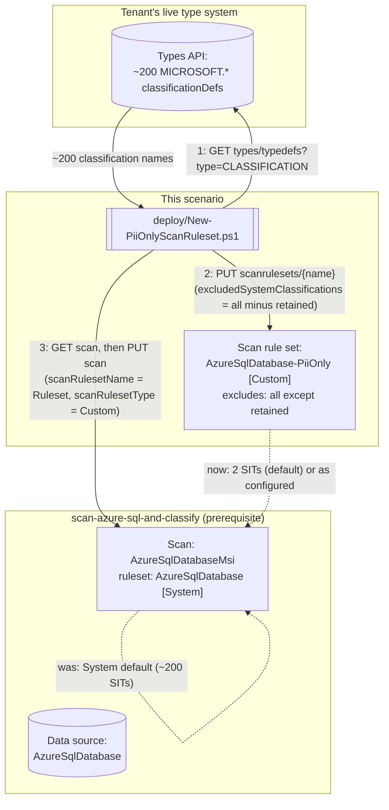

## 1. Problem statement

`scenarios/data-map/scan-azure-sql-and-classify/` scans an Azure SQL Database against Microsoft's
**system default** scan rule set: every built-in classification Purview ships for this source
type, roughly 200 sensitive information types (SITs). That is the right default for a first,
exploratory scan — you don't yet know what's in the database, so cast the widest net. It is the
wrong steady-state configuration for a buyer who already knows their compliance driver is narrow
(PCI cardholder data, or a PII-only privacy program) and does not want a catalog cluttered with
~198 classification types they will never act on, nor a scan that spends time comparing every
column against patterns for currencies, credentials, and national ID formats that will never
apply to their program.

This scenario builds that narrower rule set — a named allowlist that keeps only the
classifications the buyer names (SSN and Credit Card Number by default) and excludes every other
system classification — and reconciles the base scenario's already-registered scan onto it. It was
explicitly deferred from the base scenario's build (see that scenario's `README.md` §11) because
the exact REST body for creating a custom scan rule set was not independently confirmed at the
time; this build closes that gap with a direct fetch of the canonical Microsoft Learn reference
page (see `README.md` §11 for the full resolution).

## 2. Design goals

1. **Never hand-type the ~200-entry exclusion list.** A PII-only ruleset for Azure SQL Database
   needs `excludedSystemClassifications` to contain essentially every system classification except
   the ones the buyer wants to keep. Typing that list out by hand from a documentation page risks
   silently fabricating or mis-spelling `MICROSOFT.*` identifiers — a violation of `AGENTS.md` §4's
   grounding standard, and a page (`data-map-classification-supported-list`) that in this build's
   own grounding pass turned out to list classifications by **human-readable name only**, with no
   exact `MICROSOFT.*` identifier string anywhere on the page. Instead, this scenario's deploy
   script calls the Data Map **Types API** (`GET .../types/typedefs?type=CLASSIFICATION`) at run
   time and derives the exclusion list from the tenant's own live classification definitions —
   simultaneously more accurate (no risk of a stale or invented name) and self-maintaining (a
   classification Microsoft adds or retires next release is picked up automatically, no script
   edit required).
2. **Reconcile, don't reconstruct.** The scan object being modified already exists and already has
   an authentication configuration, database name, and collection reference the base scenario set
   up correctly. This script's deploy step does a `GET` on the existing scan and copies its
   properties forward unchanged except the two ruleset fields, rather than re-deriving the whole
   scan body — a `PUT` that omitted a property the base scenario set (e.g. by only setting the
   fields this scenario cares about) would silently reset that property to whatever the API
   defaults to, which is a worse failure mode than doing the extra `GET`.
3. **The ruleset is account-wide, not scan-scoped — design for reuse.** `AzureSqlDatabaseScanRulesetProperties`
   (confirmed via direct fetch of the Scan Rulesets REST reference) has no `collection` field —
   unlike data sources and scans, a scan rule set is not scoped to a collection or a single scan.
   One `AzureSqlDatabase-PiiOnly` ruleset, created once, can be referenced by every Azure SQL
   Database scan in the account that wants this same narrower scope — this scenario's default
   ruleset name is deliberately generic (not tied to one data source) to make that reuse the
   obvious path rather than an afterthought.
4. **Fail loudly on an implausible result, rather than silently deploying a near-no-op ruleset.**
   If the Types API call ever returned an empty or tiny `classificationDefs` list (a permissions
   problem, an API version mismatch, or an unexpected response shape), naively building
   `excludedSystemClassifications` from it would produce a ruleset that excludes almost nothing —
   functionally identical to the System default, but silently reported as "PII-only." The deploy
   script hard-fails if the discovered system-classification count is smaller than the number of
   classifications the buyer asked to retain, since that can never be a valid tenant state.
5. **Detach before delete.** No Microsoft documentation this build could find confirms whether
   deleting a scan rule set that is still referenced by a live scan succeeds, is rejected, or
   silently orphans the scan's reference. `deploy/Remove-PiiOnlyScanRuleset.ps1` always reverts the
   scan to a System ruleset first, and only then (with `-DeleteRuleset`) attempts the delete —
   never the reverse order, and never both in one unconditional call.
6. **Never silently overwrite a shared, account-wide object.** Because a scan rule set is
   account-wide (goal 3), two teams both accepting the default `-ScanRulesetName` would otherwise
   clobber each other's retained-classification choice via an unremarkable create-or-replace `PUT`
   — a genuine Red Team finding from `reviews.md`, resolved by having the deploy script `GET` the
   existing ruleset first and print an explicit diff (classifications newly excluded vs. no longer
   excluded) whenever the content would actually change, rather than staying silent on any
   pre-existing object.

## 3. Architecture

## 4. Configuration model

| Element | Value | Why |
|---|---|---|
| Ruleset `kind` | `AzureSqlDatabase` | Matches the base scenario's source type — a scan rule set's `kind` must match the scan's data source type [[1]](#references) |
| Ruleset `scanRulesetType` | `Custom` | The only type that supports `excludedSystemClassifications`/`includedCustomClassificationRuleNames` — `System` rulesets are Microsoft-managed and read-only [[1]](#references) [[6]](#references) |
| Retained classifications (default) | `MICROSOFT.GOVERNMENT.US.SOCIAL_SECURITY_NUMBER`, `MICROSOFT.FINANCIAL.CREDIT_CARD_NUMBER` | Same pair already established in `scenarios/information-protection/auto-label-confidential-sharepoint/` and `scenarios/dlp/pci-teams-exfil-block/` — a consistent classification vocabulary across this repo's Data Governance and Data Security scenarios [[2]](#references) [[3]](#references) |
| Exclusion-list source | Live `GET .../types/typedefs?type=CLASSIFICATION`, filtered to the `MICROSOFT.` namespace | Never a hard-coded snapshot — see Design goal 1 |
| Ruleset scope | Account-wide (no `collection` property) | Confirmed via direct fetch of `AzureSqlDatabaseScanRulesetProperties` — see Design goal 3 |
| Reconciliation strategy | `GET` scan, copy all properties, overwrite only the two ruleset fields, `PUT` | See Design goal 2 |

## 5. What this scenario does not do

- **Author custom classification rules.** `-IncludedCustomClassificationRuleNames` accepts names of
  *pre-existing* custom classification rules only. No documented REST endpoint for creating a
  custom classification rule was found during this build (see `README.md` §11) — Microsoft's own
  community guidance states custom classification rules "must be created manually in the portal.
  They cannot be created or managed via REST API or SDKs" as of this build's grounding pass.
- **Re-scan automatically.** Narrowing the ruleset does not retroactively reclassify assets from
  prior scan runs — Data Map classifications are a scan-time artifact. `-RunNow` (optional) starts
  an immediate re-scan; without it, the narrower ruleset only takes effect on the *next* run
  (on-demand or the base scenario's recurring trigger, if configured).
- **Apply the ruleset to any other source type.** `AzureSqlDatabaseScanRuleset` is source-type
  specific; a PII-only ruleset for, say, Azure Synapse or on-premises SQL Server would need its
  own `kind` (`AzureSynapse`, `SqlServerDatabase`) and is out of scope here — see `PROGRESS.md`
  follow-ups for candidate sibling scenarios.

## 6. References

Full citation list in `README.md` §12.
