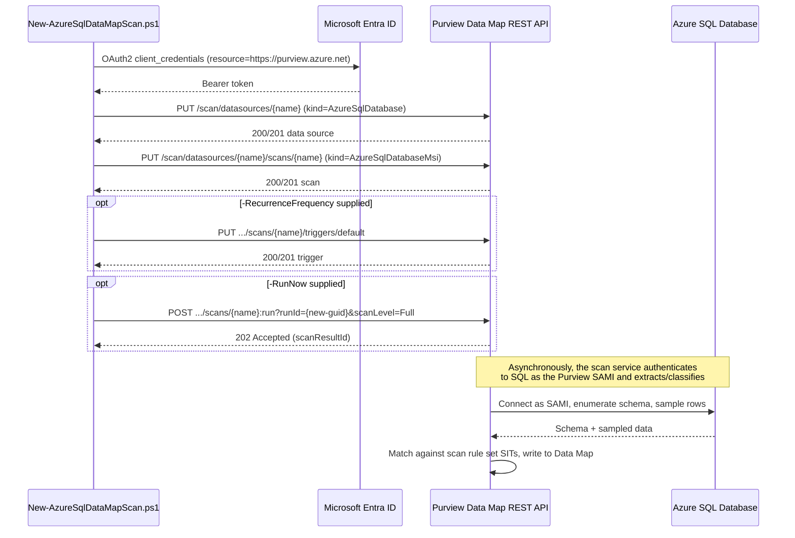

## 1. Problem statement

A tenant standing up Microsoft Purview needs to know, with evidence rather than institutional
memory, which Azure SQL databases and columns contain regulated personal data before it can
credibly scope any downstream control (DLP, auto-labeling, access policy, retention). This
scenario automates that discovery for one Azure SQL Database: register it as a Data Map source,
scan it on a recurring basis, and classify columns against Microsoft's system default sensitive
information type (SIT) set, which includes the SSN and Credit Card Number SITs this repo already
uses elsewhere, producing a living, queryable inventory instead of a one-time manual audit that
goes stale on the next schema change.

## 2. Design goals

1. **Credential-free by default.** Use the Purview account's own system-assigned managed identity
   (SAMI) to authenticate the scan, so there is no secret, Key Vault link, or credential object
   for this scenario's automation to create, store, or rotate, only two grants (Azure IAM
   `Reader`, SQL `db_datareader`) that are themselves auditable, standard Azure primitives.
2. **Idempotent by construction, not by extra logic.** The Data Map REST API's create-or-replace
   semantics ("if the object doesn't exist, it's created; if it exists, it's overwritten", 
   `README.md` reference 1) already satisfy `AGENTS.md` §4's idempotency requirement for the
   `PUT` calls themselves. The deploy script does not need existence-check-then-branch logic the
   way the DLP template scenario's `New-`/`Set-DlpComplianceRule` pattern does, it needs to
   *report* what a `PUT` would change under `-WhatIf`, since `Invoke-RestMethod` has no native
   `ShouldProcess` integration.
3. **Classification scope includes this repo's established PII baseline, and more.** Default to
   Microsoft's system scan rule set (every built-in SIT for this source type) rather than
   fabricating a narrower custom rule set body this build couldn't independently verify, SSN and
   Credit Card Number, the pair already used in `scenarios/information-protection/
   auto-label-confidential-sharepoint/` and `scenarios/dlp/pci-teams-exfil-block/`, are included
   in that system set, so a buyer evaluating this repo end-to-end still sees a consistent
   classification vocabulary across Data Governance and Data Security.
4. **Separate the two identities cleanly.** The identity that *calls the Purview REST API*
   (an app-only service principal with the Data Source Administrator Purview role) and the
   identity the *scan uses to read the SQL database* (the Purview account's own SAMI) are
   different principals with different grants. Conflating them in the docs is a common source of
   confusion this design explicitly avoids, see `README.md` §3 for the split.
5. **Ship "register + scan," not "act on the result."** This scenario stops at making
   classification visible in the catalog. Acting on it (labeling, DLP targeting, access policy) is
   already covered, or will be, by other scenarios in this repo; see §7 Non-goals.

## 3. Why Data Map scanning (not a manual inventory, not Defender for Cloud data discovery)

- **Manual/spreadsheet inventory** goes stale the moment a column is added or renamed, and has no
  mechanism to re-verify itself, the exact failure mode this scenario exists to close.
- **Microsoft Defender for Cloud's sensitive data discovery** (in Defender for Storage/SQL) is a
  security-posture signal scoped to specific Defender plans and does not populate Purview's Data
  Map/Unified Catalog, it answers "is this resource risky," not "what is this data and where
  else does it live across my estate." Out of scope here; a tenant may run both, but they are not
  substitutes for each other.
- **Purview Data Map** is the one Microsoft-native surface that produces a queryable,
  cross-source catalog with classification, that every other Purview Data Security control in
  this repo (DLP's sensitive info types, auto-labeling, IRM) is built to consume the *output* of,
  even though most of them don't require Data Map to have run first technically, Data Map makes
  the coverage claim evidence-based rather than assumed.

## 4. Authentication architecture, two identities, two grants

| Identity | Role | Grant | Why |
|---|---|---|---|
| Deploy automation's app registration | Calls the Purview Data Map REST API (`Invoke-RestMethod`) | **Data Source Administrator** Purview role on the target collection (a Collection Admin must assign it) | Registers/updates the data source and scan objects, `README.md` §3 |
| Purview account's system-assigned managed identity (SAMI) | The scan's own runtime identity when it connects to the SQL database | **Reader** (Azure IAM, on the SQL Server/resource group/subscription) **+** `db_datareader` (SQL, as a Microsoft Entra external-provider database user) | Reader lets the scan enumerate the server/database via ARM; `db_datareader` lets it query schema and sample rows for classification, `README.md` §5-6 |

These are never the same principal in this design. A buyer who tries to reuse the deploy
automation's app registration as the scan's database identity will find it doesn't work, SAMI is
specifically the *Purview account's* managed identity, not an arbitrary service principal, and
would have to switch the scan `kind` to `AzureSqlDatabaseCredential` with a service-principal
credential instead (supported, but requires a portal-created credential object, see §7 Non-goals
and `README.md` §11).

## 5. Object model and REST call sequence

Every `PUT` in this sequence is a create-or-replace call at the same API version (`2023-09-01`
for the Scans object, confirmed by direct fetch of Microsoft's REST reference; the sibling
Data Sources/Triggers calls use the same version by inference, see `README.md` §11 VERIFY). The
`-RunNow` call is deliberately not a `PUT`: **Scan Result - Run Scan** is an action-style
`POST .../scans/{name}:run?runId={guid}&scanLevel={level}` (colon-suffixed, `runId` as a query
parameter), confirmed by direct fetch during the Azure SQL Managed Instance sibling scenario's
build and backported here 2026-09-04, correcting this script's original unconfirmed resource-style
`PUT .../runs/{runId}` assumption. Object creation and the scan *run* are two separate steps:
creating the scan object does not execute a scan by itself, either a trigger fires it on
schedule, or `-RunNow` invokes it immediately, matching the portal's own "Save" vs. "Save and run"
distinction.

## 6. Key decisions

| Decision | Choice | Rationale |
|---|---|---|
| Deploy surface | Purview Data Map REST API (`Invoke-RestMethod`), per `docs/automation-surface.md` surface 4 | No PowerShell module or Graph equivalent exists for data source/scan objects; automation-surface.md documents raw REST as this library's established surface-4 pattern (see also §7 for why this scenario doesn't switch to the `Az.Purview` module) |
| Scan authentication (default) | System-assigned managed identity (`AzureSqlDatabaseMsi`) | Microsoft's own documented "recommended" option; zero credential material for this scenario's automation to manage, `README.md` §5 |
| SIT set | Microsoft's system default scan rule set (`scanRulesetType: System`) | Includes U.S. Social Security Number + Credit Card Number, consistent with this repo's established PII baseline (Design goal 3), plus ~200 other built-in SITs; a narrower custom rule set is a documented, not-yet-scripted alternative (see §7 Non-goals) rather than a fabricated REST body |
| Scan level | `Full` for the first/on-demand run, `Incremental` for the recurring trigger | Matches Microsoft's own guidance that incremental scans are the steady-state pattern once a full baseline exists, `README.md` §6-8 |
| Idempotency mechanism | Rely on the API's native create-or-replace semantics rather than a Get-then-branch pattern | Simpler, matches the API's actual contract, and avoids a false sense of "already exists, skipping" masking a drifted configuration the way a Get-based skip would, a re-run of this script always reconciles the object to the script's current parameters |
| Default policy mode | Register + scan-object creation only; **no** trigger and **no** run unless `-RecurrenceFrequency`/`-RunNow` are explicitly passed | Matches `AGENTS.md` §4's dry-run-by-default code standard, nothing in this repo takes an enforcing/executing action against a live tenant without an explicit, deliberate flag |

## 7. Non-goals

- This scenario does not programmatically create a **custom** scan rule set narrowed to a subset
  of SITs. The product supports it (portal, and the `Az.Purview` module's
  `New-AzPurviewAzureSqlDatabaseScanRulesetObject -ExcludedSystemClassification`, confirmed to
  exist during this build's grounding pass), but the exact REST JSON body for the underlying
  "Scan Rulesets - Create Or Update" operation was not independently confirmed, see `README.md`
  §11 VERIFY. This scenario ships the system default rule set instead, which already includes the
  SSN/Credit Card Number pair this repo standardizes on.
- This scenario does not create the Key Vault-backed credential object needed for
  `AzureSqlDatabaseCredential` (SQL auth or service-principal) scanning. **Corrected 2026-09-16:**
  this build originally concluded no documented REST endpoint existed for credential creation and
  that the portal was the only path, that was wrong. `PUT /scan/credentials/{credentialName}` and
  `PUT /scan/azureKeyVaults/{azureKeyVaultName}` are documented operation groups at
  `api-version=2023-09-01`, and `scenarios/data-map/scan-credential-key-vault-backed/` now scripts
  both. Creating that object stays out of scope *here* (it is a separate, reusable object shared
  across many scans, not a per-scan concern), but it is no longer a manual step anywhere in this
  repo. A buyer needing that path builds the credential there and passes its name in.
- This scenario does not act on the classification results it produces, no auto-labeling, no DLP
  policy targeting, no access-policy authoring. Those are the concern of
  `scenarios/information-protection/`, `scenarios/dlp/`, and a future Data Owner/DevOps-policy
  scenario respectively.
- This scenario does not enable stored-procedure lineage extraction (a separate, six-hour-fixed-
  schedule feature with its own `db_owner` requirement), see `README.md` §11.
- This scenario does not cover scanning Azure SQL Managed Instance, Synapse dedicated/serverless
  SQL pools, or on-premises SQL Server, each has its own registration/authentication nuances
  documented separately by Microsoft and would be a natural follow-up fragment (see
  `PROGRESS.md`).
- This scenario does not stand up the Purview account itself, the collection hierarchy, or the
  Azure Key Vault used elsewhere in this repo's DLP/labeling scenarios, those are prerequisites,
  not deliverables, of this fragment.
