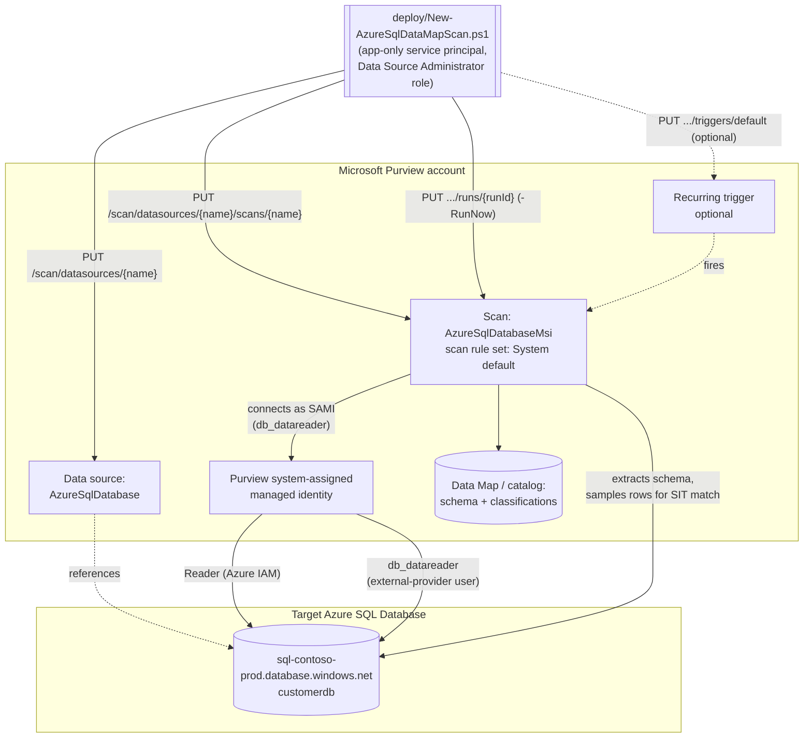

## 1. Scenario summary

Registers an Azure SQL Database as a Microsoft Purview Data Map source, configures a scan that
authenticates with the Purview account's own system-assigned managed identity (SAMI, Microsoft's
recommended, credential-free option), and runs that scan with Microsoft's system default scan
rule set, which includes the SSN and Credit Card Number sensitive information types (SITs) this
repo already uses elsewhere, among ~200 built-in classifications, so sensitive columns are
automatically classified and surfaced in the catalog. This is the foundational data-discovery scenario every
other Data Security control in this repo assumes already happened: DLP, auto-labeling, and IRM
policies all act on data whose sensitivity is already known, Data Map scanning is how a tenant
first finds out.

**Who it's for:** a data governance or security team standing up Microsoft Purview Data Map
against an existing Azure SQL estate, greenfield discovery of "what sensitive data do we have,
and where" before layering DLP, labeling, or access-policy controls on top.

## 2. Business/regulatory driver

Every major data-protection regulation (GDPR Art. 30 records of processing, CCPA/CPRA data
inventory obligations, PCI DSS Requirement 3.2/12.5.2 cardholder data discovery, HIPAA §164.308
risk analysis) starts from the same unglamorous prerequisite: an accurate, current inventory of
where regulated data lives. Manual spreadsheet-based data inventories go stale the moment a new
table or column is added. Microsoft Purview Data Map scanning automates that inventory for
Azure SQL Database, extracting schema (server → database → schema → tables/views → columns) and
automatically applying classifications to columns that match a sensitive information type (SIT),
on a recurring schedule, so the inventory tracks the live schema instead of a point-in-time
manual audit [[1]](#references).

This scenario is deliberately the **first** Data Governance fragment in this library (see
`PROGRESS.md`): the DLP, Information Protection, and Insider Risk scenarios already built assume
sensitive data has been located and (for Information Protection) labeled. Data Map scanning is
the step that makes those downstream controls evidence-based rather than guesswork, "we believe
customers' SSNs are in these three databases" becomes "Purview confirms 14 columns across 3
databases classified as U.S. Social Security Number, last scanned 6 hours ago."

## 3. Prerequisites

Full licensing detail and citations: `docs/licensing-matrix.md`. Summary for this scenario:

| Requirement | Minimum | Notes |
|---|---|---|
| Microsoft Purview account + Data Map | Active **Azure subscription** with the M365 tenant, resource group for the Purview account | Data Map scanning is **PAYG-billed Azure consumption**, not a per-user M365 entitlement, see `docs/licensing-matrix.md` §1-2 [[2]](#references) |
| Register + configure the source/scan | **Data Source Administrator** role on the target collection (or a parent collection with inheritance) | Classic Data Map role, see `docs/rbac-model.md` §5 |
| Call the Data Map REST API at all (any role) | **Collection Admin** role at root collection assigns data-plane roles to the automation service principal | Only a Collection Admin can grant Data Source Administrator/Data Curator/Data Reader to a service principal, see `docs/rbac-model.md` §5 and [[3]](#references) |
| Read scan results / browse classified assets (validation) | **Data Reader** role on the target collection | Least-privilege for the read-only `validate/` script |
| Azure IAM on the target SQL Server | **Reader** role for the Purview account's system-assigned managed identity (SAMI), scoped to the **SQL Server resource itself** | Required so the SAMI-based scan (this scenario's default) can enumerate the server/database, a separate, ARM-level role assignment from any Purview role. **Scope it to the server, not the resource group or subscription**, Microsoft's docs show Reader can be granted at any of those three levels, but a broader grant gives the Purview account's SAMI read visibility into every other resource in that resource group/subscription, not just the SQL server this scenario targets [[4]](#references) |
| Database-level access for the scan identity | `db_datareader` granted to the Purview account's SAMI as a Microsoft Entra external-provider database user | T-SQL step in §5, grants read access to sample data for classification, not just schema [[4]](#references) |
| Network path to the database | Either **Allow Azure services and resources to access this server** enabled on the SQL logical server, a self-hosted integration runtime, or a Purview managed virtual network | SAMI/UAMI authentication is **not supported** over a self-hosted integration runtime, see §11 [[4]](#references) |
| Automation identity for the REST calls themselves | App registration with **Data Source Administrator** (and, for the validate script, **Data Reader**) Purview role on the collection | Client-secret or certificate app-only OAuth2, see `docs/automation-surface.md` §3 and §7 below |

> Verify current entitlement names and the PAYG meter against `docs/licensing-matrix.md` (dated
> 2026-09-02) before a sales commitment, SKU names and billing meters change.

## 4. Architecture



Two Purview Data Map objects, both created by the same idempotent (create-or-replace) REST call
pattern: a **data source** (the registration record pointing at the Azure SQL logical server) and
a **scan** (the credential, scope, and scan rule set for one database under that source). The
scan authenticates to the database as the Purview account's own SAMI, no credential object, no
Key Vault link, nothing for this script to manage beyond the two Azure/SQL-side grants in §5.
Classification happens inline during the scan: matched columns get tagged with the SITs selected
in the scan rule set and become searchable/filterable in the catalog. Full design rationale and
the SAMI-vs-alternatives decision: `design.md`.

## 5. Step-by-step implementation

### Portal path (for a first manual walkthrough / to validate intent before scripting)

1. Sign in to the [Microsoft Purview portal](https://purview.microsoft.com) → **Data Map** →
   **Collections**. Create or select the collection this source belongs to.
2. Under **Sources**, select **Register** → **Azure SQL Database** → **Continue**.
3. Name the source, pick the **Azure subscription** and **Server name**, select the target
   **collection**, and select **Apply** [[1]](#references).
4. If the SQL logical server has a firewall, either enable **Allow Azure services and resources
   to access this server** under **Security → Networking**, or set up a self-hosted integration
   runtime / managed virtual network [[1]](#references). **Security tradeoff:** the "Allow Azure
   services" toggle opens the firewall to connection attempts from **any Azure-hosted resource in
   any subscription or tenant**, not just this Purview account, authentication (SQL/Entra
   credentials) is still required to actually read data, but it materially widens the network
   attack surface. For a production database, prefer a Purview managed virtual network or a
   self-hosted integration runtime instead (the latter requires switching off SAMI authentication
   to a service principal or SQL auth, see §11).
5. Configure authentication (this scenario defaults to system-assigned managed identity, see
   §6 for the alternatives and when to use them):
   - In Azure SQL, [configure Microsoft Entra authentication](https://learn.microsoft.com/azure/azure-sql/database/authentication-aad-configure)
     if not already done.
   - Run the T-SQL in §6's "Grant the scan identity database access" against the target database,
     using the **exact name of your Purview account** as `[Username]`.
   - In the Azure portal, on the **SQL Server resource itself** (not the resource group or
     subscription, see §3), grant the Purview account's name the **Reader** IAM role.
6. Back in the Purview portal, select **New Scan** under the registered source. Provide a name,
   select the **system-assigned managed identity** credential, select **Test connection**, then
   **Continue**.
7. Select or scope the database(s)/tables to scan, then choose a **scan rule set**, either the
   system default (all classifications, this scenario's default) or a custom rule set narrowed to
   the SITs you care about (see §6).
8. Choose a **scan trigger**, **Once** for an ad hoc first pass, or a recurring schedule, and
   select **Save and run** [[1]](#references).
9. After the scan completes, browse the classified assets in **Unified Catalog** to confirm
   columns matching your target SITs are tagged.

### Script path (idempotent, parameterized, dry-run capable)

```powershell
# 1. Deploy (dry run first, reports every REST call that would be made, changes nothing)
./deploy/New-AzureSqlDataMapScan.ps1 `
    -PurviewAccountName 'contoso-purview' `
    -TenantId $TenantId -AppId $AppId -ClientSecret $ClientSecret `
    -SubscriptionId $SubscriptionId -ResourceGroupName 'rg-contoso-data' `
    -SqlServerName 'sql-contoso-prod' -DatabaseName 'customerdb' -Location 'eastus' `
    -CollectionReferenceName 'a1b2c' `
    -WhatIf

# 2. Deploy for real, registers the source and the scan, does not run it yet
./deploy/New-AzureSqlDataMapScan.ps1 `
    -PurviewAccountName 'contoso-purview' `
    -TenantId $TenantId -AppId $AppId -ClientSecret $ClientSecret `
    -SubscriptionId $SubscriptionId -ResourceGroupName 'rg-contoso-data' `
    -SqlServerName 'sql-contoso-prod' -DatabaseName 'customerdb' -Location 'eastus' `
    -CollectionReferenceName 'a1b2c'

# 3. Deploy, add a weekly recurring trigger, and kick off an immediate full scan
./deploy/New-AzureSqlDataMapScan.ps1 `
    -PurviewAccountName 'contoso-purview' `
    -TenantId $TenantId -AppId $AppId -ClientSecret $ClientSecret `
    -SubscriptionId $SubscriptionId -ResourceGroupName 'rg-contoso-data' `
    -SqlServerName 'sql-contoso-prod' -DatabaseName 'customerdb' -Location 'eastus' `
    -CollectionReferenceName 'a1b2c' `
    -RecurrenceFrequency Week -RecurrenceInterval 1 -RunNow

# 4. Validate
./validate/Test-AzureSqlDataMapScan.ps1 `
    -PurviewAccountName 'contoso-purview' -TenantId $TenantId -AppId $AppId -ClientSecret $ClientSecret `
    -DataSourceName 'sql-contoso-prod-customerdb'
```

The deploy script uses the **Microsoft Purview Data Map / Data Governance REST API**, automation
surface 4 per `docs/automation-surface.md` §1, because data source and scan objects have no
Security & Compliance PowerShell or Graph equivalent; they exist only on this data plane. Token
acquisition follows `docs/automation-surface.md` §3's client-credentials pattern.

## 6. Configuration reference

| Setting | Value this scenario uses | Notes |
|---|---|---|
| Data source `kind` | `AzureSqlDatabase` | [[5]](#references) |
| Scan `kind` (default) | `AzureSqlDatabaseMsi` | SAMI-authenticated, no credential object to create or rotate |
| Scan `kind` (alternative) | `AzureSqlDatabaseCredential` | SQL authentication or service principal, both requiring a Key Vault-backed credential object. Create it with `scenarios/data-map/scan-credential-key-vault-backed/` (scripted via `PUT /scan/credentials/{name}`) and reference it by name, the "portal-only" claim this scenario originally carried here was incorrect; see §11 |
| Collection reference | `{ "referenceName": "<5-char collection ID>", "type": "CollectionReference" }` | The ID is **not** the collection's friendly name, read it from the collection's URL in the portal or the `List Collections` API [[6]](#references) |
| Scan rule set (this scenario's default) | `scanRulesetName: "AzureSqlDatabase"`, `scanRulesetType: "System"` | Microsoft's system rule set, every classification available for this source type, roughly 200 built-in SITs including **U.S. Social Security Number (SSN)** and **Credit Card Number**, the same pair already established in `scenarios/information-protection/auto-label-confidential-sharepoint/` and `scenarios/dlp/pci-teams-exfil-block/` [[11]](#references) |
| Scan rule set (narrower, PII-only) | A **custom** rule set built from the system default with unwanted classifications excluded | Supported by the product (portal, and the `Az.Purview` module's `New-AzPurviewAzureSqlDatabaseScanRulesetObject -ExcludedSystemClassification`), this scenario's script does not create one programmatically; see §11 VERIFY |
| Scan level | `Full` (first run) → `Incremental` (subsequent scheduled runs) | Customizable per-source scan levels (L1/L2/L3) are supported for Azure SQL Database specifically [[7]](#references) |
| Recurring trigger | Optional; `RecurrenceFrequency`/`RecurrenceInterval` parameters | Trigger resource name is always `default`, one trigger per scan [[8]](#references) |
| API version pinned by this script | `2023-09-01` | Confirmed current for the Scans object and (as of 2026-09-04) the Run Scan/List Scan History operations; see §11 VERIFY for the sibling Data Sources/Triggers endpoints |

Full cmdlet/REST-body grounding: `deploy/New-AzureSqlDataMapScan.ps1` inline comments and its
`.NOTES` block cite the exact Microsoft Learn reference pages.

## 7. Validation / how to prove it works

1. **Automated config check**, `./validate/Test-AzureSqlDataMapScan.ps1` confirms the data
   source and scan objects exist with the expected `kind`, collection, and scan rule set, and
   reports the most recent scan run's status. Exits non-zero on any hard failure (safe for a
   CI-style pre-flight).
2. **Scan run status**, Purview portal → **Data Map** → **Data sources** → select the source →
   **Recent scans** → the run shows **Queued → In progress → Completed**, with assets
   discovered/classified counts [[9]](#references). Scan run history is retained for **90 days**
   [[9]](#references).
3. **Classification evidence**, browse or search the **Unified Catalog** for the scanned
   database asset; confirm the target columns carry the **U.S. Social Security Number** or
   **Credit Card Number** classification badges, and that the classification is visible at both
   the asset and column level.
4. **Negative test**, temporarily scope the scan rule set to exclude one of the two SITs, rerun,
   and confirm columns previously classified with the excluded SIT no longer gain **new** matches
   on the next full scan (existing classifications from prior scans are not retroactively removed
, see §11).
5. **Access-path evidence**, confirm in Azure SQL (`SELECT * FROM sys.database_principals WHERE
   type = 'E'`) that the Purview account's SAMI appears as an external-provider database user with
   `db_datareader`, corroborating that the scan is reading with the least-privilege grant this
   scenario configured, not an over-broad one.

## 8. Operations & tuning

**KPIs to watch (first 30 days):**
- **Assets discovered vs. assets classified** (per scan run, from the run history), a large,
  stable gap between the two after several runs usually means the scan rule set's SITs aren't
  matching real content shapes in this database (tune SIT confidence/count thresholds) rather than
  a scan failure.
- **Scan duration trend**, a steadily growing duration on `Incremental` runs against a database
  whose schema isn't growing proportionally can indicate classification sampling is re-scanning
  more than expected; compare against the scan level setting in §6.
- **Scan failure rate**, track `Failed`/`TransientFailure`/`Canceled` run statuses
  [[10]](#references); a recurring firewall or credential failure after a database migration is
  the most common cause (see §11).

**Alert routing:** Data Map scan failures do **not** generate a DLP-style alert/incident report, 
there is no equivalent of `GenerateAlert` for scans. Poll scan run status via the REST API (or the
portal's **Monitoring** view) on the same cadence as the recurring trigger, and wire failures into
existing monitoring (a scheduled pipeline step that calls `validate/Test-AzureSqlDataMapScan.ps1`
and fails the pipeline on a non-`Completed` last-run status is the pattern this scenario's
validate script is built for).

**Incident-response runbook (scan repeatedly fails, or a run status stays non-`Succeeded`):**
1. **Triage**, pull the failing run's detail from the portal (**Data Map → Monitoring →** the
   run ID) or the scan history API; note the discovery-phase status and any error message
   [[9]](#references).
2. **Classify the cause**, the most common failure classes, in order of likelihood: (a) the
   firewall/network path changed (SQL firewall rule removed, self-hosted IR machine offline); (b)
   the SAMI's `db_datareader` grant was revoked or the database user was dropped (e.g. after a
   point-in-time restore, which does not preserve Entra database users); (c) the SQL resource
   moved to a different resource group/subscription, breaking the Azure IAM `Reader` grant's ARM
   path (see the Review cadence note below); (d) a transient service-side issue (`TransientFailure` status), 
   safe to let the next scheduled run retry.
3. **Remediate**, re-apply the specific broken grant (T-SQL `db_datareader`, or the Azure IAM
   `Reader` assignment) rather than re-running the full deploy script blind; re-run
   `validate/Test-AzureSqlDataMapScan.ps1` to confirm the objects are still correctly configured
   before assuming the grants are the problem.
4. **Escalate** if `Failed` recurs after confirming both grants and the network path are intact, 
   this points at a Purview-service-side issue worth a support case, not a configuration gap this
   scenario's script can fix.

**Review cadence:** re-run `validate/Test-AzureSqlDataMapScan.ps1` after any change to the target
database's firewall, Microsoft Entra admin configuration, or resource group/subscription move, 
Purview's data-resource policies (and, by extension, this scan's Azure IAM `Reader` grant) are
tied to the SQL resource's ARM path, and a resource move silently breaks the grant without
breaking the scan's *registration* [[4]](#references). Review the classification results
quarterly against the tenant's actual regulatory scope (see §11's regional-SIT note), a scan rule
set built once at rollout tends to drift out of date as new sensitive-data categories become
relevant.

**Downstream use:** once columns are classified, they become groundwork for
`scenarios/information-protection/` auto-labeling scope decisions, `scenarios/dlp/` policy
targeting, and `scenarios/data-estate-insights/classification-coverage-report/`, which turns this
scenario's own `customerdb.dbo.Customers` classification output into an exportable, historical
coverage trend line, this scenario intentionally stops at "classify and make visible," not "act on
the classification."

## 9. Rollback / decommission

See `rollback.md` for the full staged procedure (disable trigger → delete scan → delete data
source). Quick reference: `./deploy/Remove-AzureSqlDataMapScan.ps1` removes the scan and its
trigger (reversible by re-running the deploy script); add `-RemoveDataSource` to also delete the
data source registration.

## 10. Cost & licensing notes

- **PAYG, not per-user.** Data Map scanning bills through **Azure consumption** tied to the
  Purview account's associated Azure subscription, not an M365 per-user license, see
  `docs/licensing-matrix.md` §1-2 [[2]](#references). There is no scan charge once the source is
  on Unified Catalog PAYG or an Enterprise tier, per the licensing matrix, confirm current
  metering against the Purview pricing calculator before estimating cost at scale.
- **No M365 license consumed** by this scenario itself, no user needs a Purview-tier M365 SKU to
  benefit from Data Map scanning specifically (contrast with `scenarios/dlp/` and
  `scenarios/information-protection/`, which are M365 per-user entitlement features).
- **Sizing note:** cost scales with **number of sources scanned and scan frequency**, not with the
  number of Purview users browsing results, a large SQL estate with many databases scanned daily
  costs materially more than the same estate scanned weekly with incremental scans between full
  scans. Start with `Incremental` for steady-state and reserve `Full` for the first run and
  periodic re-baselines.
- **Cost governance.** Because this is PAYG/consumption billing rather than a fixed per-user
  license, cost grows automatically as more sources and recurring triggers are added over time
  with no natural ceiling, set an Azure Cost Management budget/alert on the Purview account's
  resource group before rolling this pattern out across an estate larger than a handful of
  databases, rather than discovering the run-rate at the next invoice.

## 11. Known limitations & gotchas

- **SAMI cannot be used with a self-hosted integration runtime.** If the target SQL Server is
  behind a private network reachable only via self-hosted IR, this scenario's default
  authentication (SAMI) will not work, fall back to service principal or SQL authentication
  (both supported over self-hosted IR) and a Key Vault-backed credential created via the portal
  [[4]](#references).
- **Existing classifications are not retroactively removed** when a scan rule set is narrowed.
  Removing a SIT from the rule set stops **new** matches on subsequent scans; it does not clear
  classification tags already applied by prior runs. Clearing stale classifications requires a
  separate cleanup action outside this scenario's scope.
- **U.S.-centric SIT starter set.** As with `scenarios/information-protection/
  auto-label-confidential-sharepoint/`, the SSN + Credit Card Number pair is a U.S.-centric
  starting point, not GDPR-complete personal-data coverage for an EU/UK-only tenant, swap in the
  relevant regional SITs (e.g. national ID formats) before presenting this as complete PII
  discovery for a non-U.S. estate.
- **Stored procedure lineage extraction runs on its own fixed six-hour schedule** and has several
  documented constraints (no INSERT/DROP statements captured, requires `db_owner` not just
  `db_datareader`, no public-access-disabled Purview accounts), this scenario does not enable
  lineage extraction by default; see the source documentation before turning it on
  [[1]](#references).
- **RESOLVED (2026-09-04), Run Scan / List Scan History REST shapes were corrected, not just
  verified.** The sibling `scenarios/data-map/scan-azure-sql-managed-instance-and-classify/` build
  independently direct-fetched the canonical **Scan Result - Run Scan** and **Scan Result - List
  Scan History** REST reference pages this scenario's own build could not reach, and found both of
  this scenario's original reconstructed shapes were wrong: Run Scan is an action-style
  `POST {endpoint}/scan/datasources/{ds}/scans/{scan}:run?runId={guid}&scanLevel={level}&
  api-version=...` (this script previously sent an unconfirmed resource-style
  `PUT .../runs/{runId}`), and List Scan History's per-run asset counts are nested at
  `discoveryExecutionDetails.statistics.assets.discovered`/`.classified` (this script's validate
  companion previously read unconfirmed flat `.assetsDiscovered`/`.assetsClassified` properties).
  Both `deploy/New-AzureSqlDataMapScan.ps1` and `validate/Test-AzureSqlDataMapScan.ps1` have been
  corrected to the confirmed shapes, see reference 17 below and each script's `.NOTES`.
- **VERIFY, Data Sources / Triggers REST body shapes.** This build's grounding for the
  **Scans - Create Or Replace** endpoint (URI, API version `2023-09-01`, and the
  `AzureSqlDatabaseMsiScanProperties`/`AzureSqlDatabaseCredentialScanProperties` body schema) comes
  from a direct fetch of Microsoft's own REST reference page. The sibling **Data Sources - Create
  Or Update** and **Triggers - Create Or Replace** reference pages returned fetch errors in this
  build environment; the request shapes this scenario's script uses for those two calls are
  reconstructed from the matching path pattern on the Scans endpoint, the official
  `@azure-rest/purview-scanning` JS SDK type definitions (which mirror the REST wire format, 
  `AzureSqlDatabaseProperties`/`AzureDataSourceProperties` confirming `serverEndpoint`,
  `resourceName`, `resourceGroup`, `subscriptionId`, `location`, `collection`), and the `Az.Purview`
  PowerShell module's parameter signatures (`New-AzPurviewDataSource`, `New-AzPurviewTrigger`), 
  three independent sources converging on the same shape, but none of them a direct fetch of the
  canonical REST reference for those two operations specifically. The Managed Instance sibling
  scenario's build independently direct-fetched both and confirmed the reconstructed shapes were
  correct for its own `AzureSqlDatabaseManagedInstance` source (design.md §5), strong corroborating
  evidence, but not yet a direct fetch of these two operations' pages for this exact
  `AzureSqlDatabase` source kind. Confirm against a pilot tenant or the OpenAPI spec before
  production use; flagged inline in the deploy script's `.NOTES`.
- **VERIFY, custom scan rule set REST creation.** This scenario ships Microsoft's system default
  scan rule set rather than a narrower, PII-only custom rule set. The product supports a custom
  rule set that excludes specific system classifications (confirmed via the `Az.Purview` module's
  `New-AzPurviewAzureSqlDatabaseScanRulesetObject -ExcludedSystemClassification` parameter), but
  the exact REST JSON body for the "Scan Rulesets - Create Or Update" operation was not
  independently confirmed during this build. Follow-up: script that call once grounded, or use the
  `Az.Purview` PowerShell module directly for this one object type.
- **~~VERIFY, credential-object REST creation.~~ RESOLVED 2026-09-16, this scenario's original
  claim was wrong.** This scenario's build concluded that no documented REST endpoint existed for
  creating a Key Vault-backed credential object (needed for the `AzureSqlDatabaseCredential` scan
  kind), and that credential creation was portal-only. **It is not.** The Purview Scanning
  data-plane API exposes **Credential** (`PUT /scan/credentials/{credentialName}`) and **Key Vault
  Connections** (`PUT /scan/azureKeyVaults/{azureKeyVaultName}`) as first-class documented
  operation groups at `api-version=2023-09-01`. Both are now scripted end-to-end by
  `scenarios/data-map/scan-credential-key-vault-backed/`, which also documents the one field shape
  that genuinely remains unconfirmed (the two `KeyVaultSecret` discriminator literals). A buyer
  needing SQL-auth or service-principal scanning should build the credential with that scenario and
  reference it by name here, no portal step required. This scenario's own script still defaults to
  the SAMI (`AzureSqlDatabaseMsi`) path, which remains Microsoft's recommended option where it is
  available.

## 12. References

1. Discover and govern Azure SQL Database in Microsoft Purview (registration, firewall, authentication options, scan setup, known limitations), <https://learn.microsoft.com/purview/register-scan-azure-sql-database>
2. Microsoft Purview billing models (PAYG for Data Map), <https://learn.microsoft.com/purview/purview-billing-models>
3. Tutorial: Authenticate for Microsoft Purview data-plane APIs (service principal setup, Data Source Administrator/Data Curator/Collection Admin/Policy Author role assignment, token acquisition), <https://learn.microsoft.com/purview/data-gov-api-rest-data-plane>
4. Discover and govern Azure SQL Database, "Configure authentication for a scan" (SAMI/UAMI/service principal/SQL auth options, T-SQL grants, self-hosted IR incompatibility with managed identity), <https://learn.microsoft.com/purview/register-scan-azure-sql-database#configure-authentication-for-a-scan>
5. Scans - Create Or Replace REST API reference (API version 2023-09-01; `AzureSqlDatabaseMsiScan`/`AzureSqlDatabaseCredentialScan` kinds and properties), <https://learn.microsoft.com/rest/api/purview/scanningdataplane/scans/create-or-replace>
6. Connect to and manage Azure Synapse Analytics workspaces in Microsoft Purview, collection ID lookup via portal URL or List Collections API, <https://learn.microsoft.com/purview/register-scan-synapse-workspace#scan>
7. Scans and ingestion in Data Map (customizable scan levels for Azure SQL Database, scan rule sets), <https://learn.microsoft.com/purview/data-map-scan-ingestion>
8. New-AzPurviewTrigger (Az.Purview PowerShell module), trigger resource path pattern (`datasources/{name}/scans/{name}/triggers/default`), recurrence parameters, <https://learn.microsoft.com/powershell/module/az.purview/new-azpurviewtrigger>
9. Monitor Data Map population in Microsoft Purview (scan run statuses, 90-day run-history retention), <https://learn.microsoft.com/purview/data-map-scan-run-monitor-population>
10. ScanRunStatus enumeration (Accepted/InProgress/TransientFailure/Succeeded/Failed/Canceled), <https://learn.microsoft.com/rest/api/purview/scanningdataplane/scans/create-or-replace> (Definitions section)
11. Create a scan rule set in Data Map (system vs. custom rule sets, classification-rule selection), <https://learn.microsoft.com/purview/data-map-scan-rule-set>
12. Classification best practices in the Microsoft Purview Data Map, <https://learn.microsoft.com/purview/data-gov-best-practices-classification>
13. AzureSqlDatabaseProperties / AzureDataSourceProperties interfaces (`@azure-rest/purview-scanning` JS SDK, `serverEndpoint`, `resourceName`, `resourceGroup`, `subscriptionId`, `location`, `collection` field confirmation), <https://learn.microsoft.com/javascript/api/@azure-rest/purview-scanning/azuresqldatabaseproperties> and <https://learn.microsoft.com/javascript/api/@azure-rest/purview-scanning/azuredatasourceproperties>
14. Az.Purview PowerShell module reference (`New-AzPurviewDataSource`, `New-AzPurviewScan`, `Remove-AzPurviewDataSource`, `Remove-AzPurviewScan`, `Start-AzPurviewScanResultScan`), <https://learn.microsoft.com/powershell/module/az.purview/>
15. Data governance roles and permissions in Microsoft Purview (classic Data Map role vocabulary, Data Source Administrator, Data Curator, Data Reader, Collection Admin), <https://learn.microsoft.com/purview/data-gov-classic-permissions>
16. New-AzPurviewAzureSqlDatabaseScanRulesetObject (Az.Purview PowerShell module, confirms the exclusion-based custom scan rule set model via `-ExcludedSystemClassification`), <https://learn.microsoft.com/powershell/module/az.purview/new-azpurviewazuresqldatabasescanrulesetobject>
17. Scan Result - Run Scan and Scan Result - List Scan History REST API references (confirmed the action-style `POST .../:run?runId=...` shape and the nested `discoveryExecutionDetails.statistics.assets` shape; direct-fetched during the Azure SQL Managed Instance sibling scenario's build and backported here 2026-09-04), <https://learn.microsoft.com/rest/api/purview/scanningdataplane/scan-result/run-scan> and <https://learn.microsoft.com/rest/api/purview/scanningdataplane/scan-result/list-scan-history>

> Re-verify all links, API versions, and REST body shapes against current Microsoft Learn before a
> customer-facing deployment, the Data Map REST surface is explicitly called out by Microsoft as
> evolving. Two VERIFY items remain open in §11 (Data Sources/Triggers body shapes; the two other
> items on custom scan-rule-set and credential-object REST creation) and should be closed against a
> pilot tenant first.
