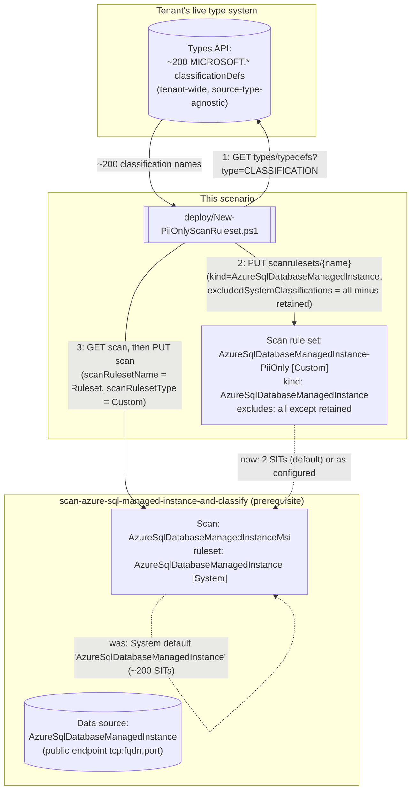

## 1. Problem statement

[`data-map/scan-azure-sql-managed-instance-and-classify`](/scenarios/data-map/scan-azure-sql-managed-instance-and-classify/) scans an Azure SQL Managed
Instance database against Microsoft's **system default** scan rule set (named
`AzureSqlDatabaseManagedInstance`): every built-in classification Purview ships for this source
type, roughly 200 sensitive information types (SITs). That is the right default for a first,
exploratory scan — you don't yet know what's in the database. It is the wrong steady-state
configuration for a buyer who already knows their compliance driver is narrow (PCI cardholder data,
or a PII-only privacy program) and does not want a catalog cluttered with ~198 classification types
they will never act on, nor a scan that spends time comparing every column against patterns for
currencies, credentials, and national ID formats that will never apply to their program.

This is the third of this repo's Data Map PII-only scan rule set scenarios, tracked as a follow-up
in `PROGRESS.md` from the first (`scan-azure-sql-and-classify-pii-ruleset`): "the same PII-only
custom scan rule set pattern for this repo's remaining two sibling Data Map source types (`kind`
values `AzureSqlDatabaseManagedInstance`/`SqlServerDatabase`)... ground each one's actual ruleset
`kind` string independently before building." This build applies that proven pattern to Azure SQL
Managed Instance, following the explicit warning left by the Azure Synapse Analytics sibling's own
build: do not assume a source type's custom ruleset `kind` matches a shorthand guess, or the
Azure SQL Database sibling's name-equals-kind shortcut, without independently checking. The
remaining sibling (on-premises SQL Server, `kind: SqlServerDatabase`) stays a separate, not-yet-
built fragment — see §5.

## 2. Design goals

Goals 1, 2, 4, and 5 below are carried over unchanged from both sibling PII-ruleset scenarios' own
design (same underlying REST surface, same failure modes). Goal 3 restates the account-wide-object
goal with Managed Instance-specific evidence. Goal 6 is this scenario's own independent finding:
unlike the Azure Synapse Analytics sibling, Managed Instance's custom ruleset `kind` and its System
default ruleset's NAME are the *same* string — the Azure SQL Database sibling's pattern, not the
Synapse naming trap.

1. **Never hand-type the ~200-entry exclusion list.** Same reasoning as both siblings: the Data Map
   classification-supported-list page has no exact `MICROSOFT.*` identifier strings, only
   human-readable names. This scenario's deploy script calls the Data Map **Types API**
   (`GET .../types/typedefs?type=CLASSIFICATION`) at run time — a tenant-wide, source-type-agnostic
   surface, so no new grounding was needed here beyond what the first sibling already confirmed.
2. **Reconcile, don't reconstruct.** The scan object being modified already exists with an
   authentication kind (Msi or Credential), a server endpoint (the managed instance's public
   endpoint FQDN:port), a database name, and a collection reference. This script's deploy step
   `GET`s the existing scan and copies its properties forward unchanged except the two ruleset
   fields, so it neither disturbs the network/authentication configuration the base scenario
   established nor makes a new, uninformed decision about any other scan property.
3. **The ruleset is account-wide, not scan-scoped — design for reuse.** Confirmed via the
   `New-AzPurviewAzureSqlDatabaseManagedInstanceScanRulesetObject` constructor cmdlet, whose
   parameter list (`-Description`/`-ExcludedSystemClassification`/
   `-IncludedCustomClassificationRuleName`/`-Type`) has no collection- or scan-scoping parameter —
   the same absence-of-evidence pattern both sibling scenarios used to establish their own
   ruleset's account-wide scope. One `AzureSqlDatabaseManagedInstance-PiiOnly` ruleset, created
   once, can be referenced by every Azure SQL Managed Instance scan in the account that wants this
   same narrower scope.
4. **Fail loudly on an implausible result, rather than silently deploying a near-no-op ruleset.**
   Same guard as both siblings: hard-fail if the discovered system-classification count is smaller
   than the number of classifications the buyer asked to retain.
5. **Detach before delete.** Same as both siblings — no Microsoft documentation found confirms
   whether deleting an in-use scan rule set succeeds, is rejected, or orphans the scan's reference.
   `deploy/Remove-PiiOnlyScanRuleset.ps1` always reverts the scan first.
6. **Independently confirm this source type's own name-vs-kind relationship — do not inherit
   either sibling's pattern by assumption.** The Azure SQL Database sibling's System default
   ruleset name and its custom ruleset `kind` are the identical string (`AzureSqlDatabase`); the
   Azure Synapse Analytics sibling's are *not* (`AzureSynapseSQL` name vs. `AzureSynapseWorkspace`
   kind — a trap that sibling's own build specifically warned future scenarios not to assume away).
   This build's own direct fetch of
   `New-AzPurviewAzureSqlDatabaseManagedInstanceScanRulesetObject.md` (reference 1) confirms Managed
   Instance's custom ruleset `Kind: AzureSqlDatabaseManagedInstance` — the IDENTICAL string to the
   base scenario's own `-ScanRulesetName` default (`'AzureSqlDatabaseManagedInstance'`) and to
   `New-AzPurviewAzureSqlDatabaseManagedInstanceMsiScanObject`'s worked example
   (`ScanRulesetName: AzureSqlDatabaseManagedInstance` / `ScanRulesetType: System`). So this
   scenario follows the Azure SQL Database sibling's simpler pattern (`-RevertToRulesetName`
   hard-coded to the same string used as the `kind` constant elsewhere in the script) — but that
   conclusion was independently verified for this source type, not copied on the assumption it
   would hold. `README.md` §11 states this explicitly so a reader does not have to guess which of
   the two prior siblings' patterns applies here.

## 3. Architecture

## 4. Configuration model

| Element | Value | Why |
|---|---|---|
| Ruleset `kind` | `AzureSqlDatabaseManagedInstance` | Confirmed via `New-AzPurviewAzureSqlDatabaseManagedInstanceScanRulesetObject`'s output-property documentation (`Kind: "AzureSqlDatabaseManagedInstance"`) — the SAME string as the System default ruleset's NAME (goal 6) |
| Ruleset `scanRulesetType` | `Custom` | The only type that supports `excludedSystemClassifications`/`includedCustomClassificationRuleNames` — `System` rulesets are Microsoft-managed and read-only |
| System default ruleset name (revert target) | `AzureSqlDatabaseManagedInstance` | Confirmed via the base scenario's own `-ScanRulesetName` default and independently via `New-AzPurviewAzureSqlDatabaseManagedInstanceMsiScanObject`'s worked example |
| Compatible scan `kind`s | `AzureSqlDatabaseManagedInstanceMsi`, `AzureSqlDatabaseManagedInstanceCredential` | Both documented on the base scenario's own README §6 configuration table; the base scenario in this repo only builds the Msi (SAMI) variant, but the guard accepts either so a future Credential-authenticated scan is not spuriously rejected |
| Retained classifications (default) | `MICROSOFT.GOVERNMENT.US.SOCIAL_SECURITY_NUMBER`, `MICROSOFT.FINANCIAL.CREDIT_CARD_NUMBER` | Same pair as every Data Map PII-ruleset scenario in this repo |
| Exclusion-list source | Live `GET .../types/typedefs?type=CLASSIFICATION`, filtered to the `MICROSOFT.` namespace | Never a hard-coded snapshot — tenant-wide, not source-type-specific, so this scenario reuses both siblings' confirmed call shape unchanged |
| Ruleset scope | Account-wide (no collection-scoping parameter on the constructor cmdlet) | See Design goal 3 |
| Reconciliation strategy | `GET` scan, copy all properties (server endpoint, database name, collection, authentication kind), overwrite only the two ruleset fields, `PUT` | See Design goal 2 |

## 5. What this scenario does not do

- **Author custom classification rules.** Same scope boundary as every Data Map sibling scenario —
  `-IncludedCustomClassificationRuleNames` only references pre-existing, portal-authored rules.
- **Re-scan automatically.** Narrowing the ruleset does not retroactively reclassify assets from
  prior scan runs. `-RunNow` (optional) starts an immediate re-scan of the database the base
  scenario's scan targets; without it, the narrower ruleset only takes effect on the *next* run.
- **Grant or verify the base scenario's own extra Managed Instance prerequisites** (public endpoint
  enablement, `Set-AzSqlInstanceActiveDirectoryAdministrator`, the Directory Readers Microsoft
  Entra role, the NSG inbound rule, the `db_datareader` SQL grant). This scenario assumes the base
  scenario's own scan already runs successfully — it only ever touches the scan's
  `scanRulesetName`/`scanRulesetType` properties.
- **Apply the ruleset to any other source type.** `AzureSqlDatabaseManagedInstanceScanRuleset` is
  source-type specific; the one remaining sibling scenario
  (`scan-on-premises-sql-server-and-classify-pii-ruleset`, `kind: SqlServerDatabase`) is tracked
  separately in `PROGRESS.md` and must independently confirm its own name-vs-kind relationship per
  goal 6 above rather than inheriting this scenario's conclusion.

## 6. References

Full citation list in `README.md` §12.
