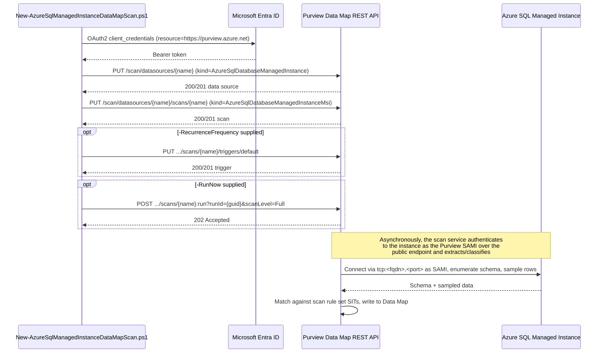

## 1. Problem statement

A tenant that has already stood up Microsoft Purview Data Map against Azure SQL Database (this
repo's `scenarios/data-map/scan-azure-sql-and-classify/`) frequently also runs Azure SQL Managed
Instance, a lift-and-shift-friendly PaaS SQL engine with its own instance-level network,
identity, and connectivity model distinct from a logical server. That instance needs the same
discovery-and-classification treatment, but **cannot** simply reuse the logical-server scenario's
script: Azure SQL Managed Instance is a separate Purview data source `kind`
(`AzureSqlDatabaseManagedInstance`) with its own registration prerequisites, its own scan object
`kind` (`AzureSqlDatabaseManagedInstanceMsi`), and, materially, its own extra Microsoft Entra
prerequisite (the **Directory Readers** role) the single-database scenario never needed. This
scenario automates discovery and classification for one Azure SQL Managed Instance database,
following the sibling scenario's proven pattern everywhere the two data sources are actually the
same, and diverging from it explicitly and only where Microsoft's own documentation says they
differ.

## 2. Design goals

1. **Reuse the sibling scenario's proven shape, don't fork it.** Same object model (data source +
   scan, both create-or-replace), same credential-free-by-default posture (SAMI), same
   idempotency mechanism, same four-lens review structure. A buyer who has already deployed
   `scan-azure-sql-and-classify` should find this scenario immediately familiar, with the diffs
   confined to what Microsoft's own docs say is actually different about Managed Instance.
2. **Name every genuine difference explicitly, in one place.** §4 below is the single source of
   truth for "what's different about Managed Instance" so neither this design doc, the README, nor
   the scripts re-derive it inconsistently.
3. **Raise this build's own grounding bar.** The sibling scenario shipped three open VERIFY items
   because three of its four REST reference pages returned fetch errors at build time. This build
   independently re-fetched all four canonical REST reference pages successfully and found **two
   real discrepancies** between the sibling's reconstructed shapes and Microsoft's actual documented
   contract (see §5). Rather than silently ship the same discrepancies again, this scenario's
   scripts use the corrected shapes, and the discrepancies are logged as a follow-up to backport
   into the sibling scenario.
4. **Don't re-litigate what the sibling already decided correctly.** SAMI-first authentication,
   system-default scan rule set (not a fabricated custom PII-only set), create-or-replace-native
   idempotency, and the "register + scan, don't act on results" scope boundary all carry over
   unchanged, see the sibling's own `design.md` §2-3 for that reasoning, not repeated here.

## 3. Why a separate scenario, not a `-SourceKind` parameter on the sibling script

Azure SQL Managed Instance and Azure SQL Database are adjacent but genuinely distinct Purview data
sources, different `kind` enum values on **both** the data source and scan objects, a different
system scan rule set name, a different server-endpoint string format, and (per §4 below) a Microsoft
Entra prerequisite Azure SQL Database doesn't have. Branching a single script on `-SourceKind` would
either silently hide that last prerequisite behind a flag the operator might not read, or force the
script to detect and warn about it dynamically, more complexity than a second, explicit scenario
that documents the one real workflow difference up front. This matches the branching precedent this
repo has already set for other "adjacent but distinct" pairs (e.g. `scenarios/ediscovery/
premium-legal-hold-and-export/` vs. `scenarios/ediscovery/location-scoped-legal-hold/`, which the
sibling scenario's own `PROGRESS.md` follow-up flagged this fragment as continuing).

## 4. What's actually different from `scan-azure-sql-and-classify`

| Dimension | Azure SQL Database (sibling) | Azure SQL Managed Instance (this scenario) |
|---|---|---|
| Data source `kind` | `AzureSqlDatabase` | `AzureSqlDatabaseManagedInstance` |
| Scan `kind` (SAMI) | `AzureSqlDatabaseMsi` | `AzureSqlDatabaseManagedInstanceMsi` |
| System scan rule set name | `AzureSqlDatabase` | `AzureSqlDatabaseManagedInstance` |
| `serverEndpoint` format | bare hostname (`<server>.database.windows.net`) | `tcp:<fqdn>,<port>`, a literal `tcp:` prefix and explicit port, confirmed by Microsoft's own worked PowerShell example |
| Network reachability | logical server's firewall, or private endpoint/self-hosted IR | instance's **public endpoint** must be explicitly enabled, plus an NSG inbound rule allowing the `AzureCloud` service tag over the ports the instance's connection type (Redirect: 1433 + 11000-11999; Proxy: 3342) requires, or a private endpoint + self-hosted IR VM (SAMI/UAMI not supported over a private endpoint, per Microsoft's own note) |
| Microsoft Entra admin | set at the **logical server** (`Set-AzSqlServerActiveDirectoryAdministrator`) | set at the **instance** (`Set-AzSqlInstanceActiveDirectoryAdministrator`), a different cmdlet/API against a different resource type |
| Extra Microsoft Entra prerequisite | none beyond the admin | the instance's own managed identity needs the **Directory Readers** Microsoft Entra role (or equivalent fine-grained Graph permissions) before Microsoft Entra authentication works *at all*, granted by a **Privileged Role Administrator**, not the Purview/SQL roles this scenario's other grants use |
| Contained database user T-SQL | referenced generically | `CREATE USER [<PurviewAccountName>] FROM EXTERNAL PROVIDER;` then a `db_datareader` role grant, confirmed directly from Microsoft's Entra-authentication configuration guide (README.md reference 9), which this scenario cites verbatim rather than leaving as a dangling cross-reference |
| Access-policy support | Data Owner + DevOps policies | DevOps policies confirmed; Data Owner policy support is documented but not exercised by either scenario, out of scope for both |

Everything **not** in this table (credential-free-by-default posture, create-or-replace idempotency,
system-default-not-custom scan rule set, dry-run design, staged rollback) is unchanged from the
sibling scenario by deliberate design choice, not oversight.

## 5. Grounding improvement over the sibling scenario, two corrected REST shapes

The sibling scenario's `README.md` §11 records three open VERIFY items because the **Data
Sources**, **Triggers**, and **Scan Result - Run Scan** REST reference pages returned fetch errors
in that build's environment; its scripts reconstruct those three shapes from SDK type definitions
and `Az.Purview` PowerShell parameter signatures instead. This build independently re-fetched all
four canonical REST reference pages (Data Sources, Scans, Triggers, Scan Result) successfully and
found:

1. **Data Sources and Triggers**: the sibling's reconstructed shapes were correct, this scenario's
   direct fetch confirms the same URI pattern, verb, and body shape (adjusted for the
   `AzureSqlDatabaseManagedInstance`-specific field values in §4's table).
2. **Scan Result - Run Scan is genuinely different from what the sibling assumed.** The confirmed
   operation is an *action-style* `POST {endpoint}/scan/datasources/{ds}/scans/{scan}:run?
   runId={guid}&scanLevel={level}&api-version=...` (a colon-suffixed action on the scan resource,
   with `runId` as a query parameter), not a *resource-style* `PUT .../runs/{runId}` the sibling
   scenario's `New-AzureSqlDataMapScan.ps1` sends. This scenario's `New-AzureSqlManagedInstanceDataMapScan.ps1`
   uses the confirmed shape.
3. **Scan Result - List Scan History's per-run asset counts are nested, not flat.** The confirmed
   response shape carries them at `discoveryExecutionDetails.statistics.assets.discovered`/
   `.classified` on each run record, not as flat `.assetsDiscovered`/`.assetsClassified` properties
   the sibling's `Test-AzureSqlDataMapScan.ps1` reads. This scenario's validate script reads the
   confirmed nested path.

Both discrepancies are logged as a `PROGRESS.md` follow-up to backport into the sibling scenario, 
out of scope for this fragment itself (`AGENTS.md` §6: one fragment per turn), but worth fixing
promptly since a `PUT .../runs/{runId}` call against the real API would either 404 or hit an
unintended route.

## 6. Object model and REST call sequence

Every mutating call is a create-or-replace or action-style REST call at API version `2023-09-01`,
directly confirmed by fetching each operation's own canonical Microsoft Learn REST reference page
during this build (§5), a stronger grounding bar than the sibling scenario achieved for three of
its four calls.

## 7. Key decisions

| Decision | Choice | Rationale |
|---|---|---|
| Deploy surface | Purview Data Map REST API (`Invoke-RestMethod`), per `docs/automation-surface.md` surface 4 | Same as the sibling scenario, no PowerShell module or Graph equivalent exists for data source/scan objects |
| Scan authentication (default) | System-assigned managed identity (`AzureSqlDatabaseManagedInstanceMsi`) | Microsoft's own documented supported option for this source type, and the credential-free default this repo's Data Map scenarios standardize on |
| Network path (default) | Public endpoint | Matches the sibling scenario's "credential-free, network-simple by default" posture; private endpoint + self-hosted IR is a documented, not-yet-scripted alternative (§8 Non-goals), and is the *only* path when SAMI/UAMI can't be used per Microsoft's own private-endpoint note |
| SIT set | Microsoft's system default scan rule set (`scanRulesetName: AzureSqlDatabaseManagedInstance`, `scanRulesetType: System`) | Same rationale as the sibling scenario, includes the SSN + Credit Card Number pair this repo standardizes on |
| Run Scan / List Scan History call shapes | The corrected, directly-confirmed shapes (§5), not the sibling's reconstructed ones | `AGENTS.md` §4, ground every product fact; a confirmed shape supersedes an inferred one even when the inferred one already shipped elsewhere in this repo |
| Idempotency mechanism | Rely on the API's native create-or-replace semantics, same as the sibling scenario | Consistency with this repo's established Data Map pattern; no reason to diverge |
| Default policy mode | Register + scan-object creation only; **no** trigger and **no** run unless `-RecurrenceFrequency`/`-RunNow` are explicitly passed | Matches `AGENTS.md` §4's dry-run-by-default code standard, same as every other scenario in this repo |

## 8. Non-goals

- This scenario does not script the **private endpoint + self-hosted integration runtime** path.
  Microsoft's own documentation states managed identity authentication is not supported when
  connecting to Microsoft Purview over private endpoints, so a buyer needing that topology must
  switch to a service-principal or SQL-authentication credential object created via the portal (the
  same portal-only credential-object gap the sibling scenario already carries as an open VERIFY), 
  see `README.md` §11.
- This scenario does not script the Microsoft Entra admin assignment
  (`Set-AzSqlInstanceActiveDirectoryAdministrator`) or the Directory Readers role grant. Both are
  one-time, higher-privilege (Privileged Role Administrator) prerequisites documented as manual
  portal/PowerShell steps in `README.md` §5, consistent with this repo's convention of not
  automating rare, high-privilege, one-time setup steps that sit outside the automation identity's
  own Purview/Azure IAM role scope.
- This scenario does not create a custom, PII-only scan rule set, or the Key Vault-backed
  credential object needed for the `AzureSqlDatabaseManagedInstanceCredential` scan kind, both
  carried over unchanged from the sibling scenario's own non-goals (`scan-azure-sql-and-classify/
  design.md` §7) since neither is Managed-Instance-specific.
- This scenario does not act on the classification results it produces, same scope boundary as
  the sibling scenario and every other Data Map scenario in this repo.
- This scenario does not stand up the Purview account, the collection hierarchy, or the managed
  instance itself, prerequisites, not deliverables, of this fragment.
