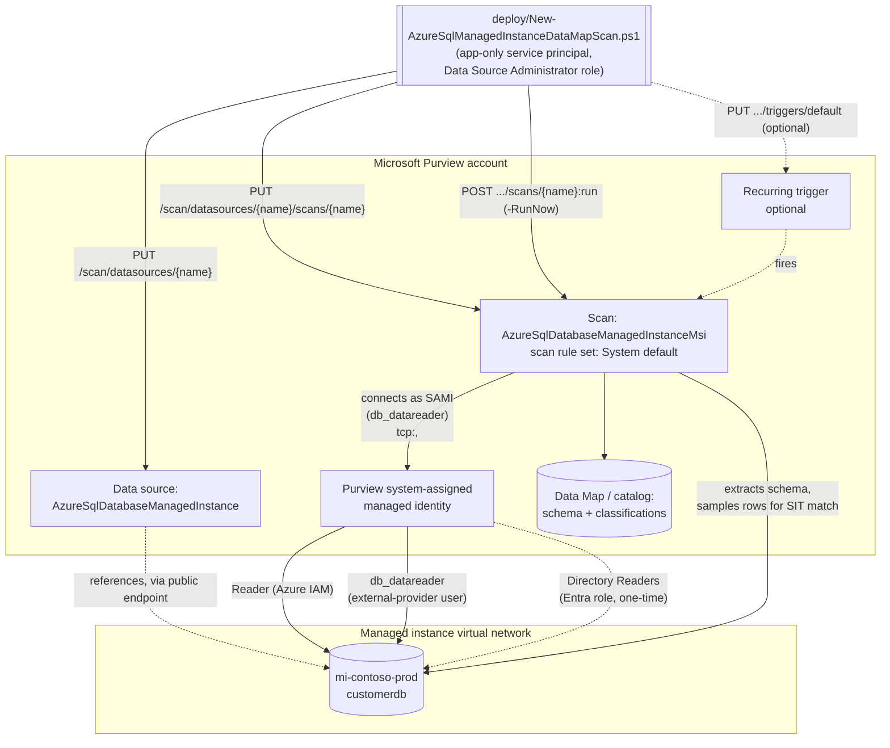

## 1. Scenario summary

Registers an Azure SQL Managed Instance database as a Microsoft Purview Data Map source, configures
a scan that authenticates with the Purview account's own system-assigned managed identity (SAMI —
credential-free, no Key Vault link to manage), and runs that scan with Microsoft's system default
scan rule set for this source type — which includes the SSN and Credit Card Number sensitive
information types (SITs) this repo already uses elsewhere — so sensitive columns are automatically
classified and surfaced in the catalog. This is the Managed Instance sibling of
`scenarios/data-map/scan-azure-sql-and-classify/`, following the same proven pattern but adapted for
the genuine registration, network, and Microsoft Entra differences Managed Instance has as its own
Purview data source `kind` — see `design.md` §4 for the full diff.

**Who it's for:** a data governance or security team that has already deployed (or is deploying
alongside) `scan-azure-sql-and-classify` and also runs Azure SQL Managed Instance — a common
lift-and-shift target for on-premises SQL Server estates — and needs the same discovery-and-
classification coverage for it, without silently reusing a script built for a different data source
`kind`.

## 2. Business/regulatory driver

Same underlying drivers as the sibling scenario — GDPR Art. 30 records of processing, CCPA/CPRA
data inventory obligations, PCI DSS Requirement 3.2/12.5.2 cardholder data discovery, HIPAA §164.308
risk analysis all require an accurate, current inventory of where regulated data lives
[[1]](#references). Azure SQL Managed Instance is a common landing zone for lift-and-shift
migrations of on-premises SQL Server estates specifically *because* it preserves near-full SQL
Server surface area (cross-database queries, SQL Agent, linked servers) — which also means it tends
to accumulate the same long-lived, schema-drifted databases that made the original on-premises
inventory go stale in the first place. Scanning it with the same automated, recurring discovery this
repo already applies to Azure SQL Database keeps a lift-and-shift migration from silently
regressing the tenant's classification coverage.

## 3. Prerequisites

Full licensing detail and citations: `docs/licensing-matrix.md`. Summary for this scenario (deltas
from the sibling scenario's table are called out explicitly):

| Requirement | Minimum | Notes |
|---|---|---|
| Microsoft Purview account + Data Map | Active **Azure subscription** with the M365 tenant, resource group for the Purview account | PAYG-billed Azure consumption, not a per-user M365 entitlement — see `docs/licensing-matrix.md` §1–2 |
| Register + configure the source/scan | **Data Source Administrator** role on the target collection | Classic Data Map role — see `docs/rbac-model.md` §5 |
| Call the Data Map REST API at all (any role) | **Collection Admin** role at root collection assigns data-plane roles to the automation service principal | Only a Collection Admin can grant Purview roles to a service principal — see `docs/rbac-model.md` §5 |
| Read scan results / browse classified assets (validation) | **Data Reader** role on the target collection | Least-privilege for the read-only `validate/` script |
| **Public endpoint enabled** on the managed instance | [Configure public endpoint in Azure SQL Managed Instance](https://learn.microsoft.com/azure/azure-sql/managed-instance/public-endpoint-configure) | **Different from the sibling scenario** — a managed instance has no public endpoint by default; this scenario's default (SAMI over the public endpoint) does not work until it's explicitly enabled [[2]](#references) |
| **Microsoft Entra admin set on the instance itself** | `Set-AzSqlInstanceActiveDirectoryAdministrator` (not `Set-AzSqlServerActiveDirectoryAdministrator`) | A different cmdlet/resource type from the logical-server sibling scenario — see §5 step 2 [[3]](#references) |
| **Directory Readers Microsoft Entra role** for the instance's managed identity | Granted by a **Privileged Role Administrator** | **New prerequisite not present in the sibling scenario** — Managed Instance requires this broader role (or equivalent fine-grained Graph permissions) before Microsoft Entra authentication works at all; Azure SQL Database does not [[3]](#references) |
| Azure IAM on the target managed instance | **Reader** role for the Purview account's SAMI, scoped to **the managed instance resource itself** | Same narrow-scope recommendation as the sibling scenario (not the resource group or subscription) — see §11 |
| Database-level access for the scan identity | `db_datareader` granted to the Purview account's SAMI as a Microsoft Entra external-provider database user (`CREATE USER [<PurviewAccountName>] FROM EXTERNAL PROVIDER;`) | T-SQL step in §5 — this scenario cites the exact statement directly rather than a generic cross-reference [[4]](#references) |
| Network path to the instance (NSG) | Inbound rule allowing the `AzureCloud` service tag over the ports the instance's connection type requires (Redirect: `1433` + `11000`-`11999`; Proxy: `3342`) | Managed-Instance-specific — a logical server's simpler "Allow Azure services" firewall toggle has no equivalent here; see §6 and §11 [[5]](#references) |
| Automation identity for the REST calls themselves | App registration with **Data Source Administrator** (and, for the validate script, **Data Reader**) Purview role on the collection | Client-secret app-only OAuth2 — see `docs/automation-surface.md` §3 and §5 below |

> Verify current entitlement names and the PAYG meter against `docs/licensing-matrix.md` before a
> sales commitment — SKU names and billing meters change.

## 4. Architecture



Same two-object model as the sibling scenario (a data source + a scan, both create-or-replace), with
the connection routed over the managed instance's **public endpoint** using the literal
`tcp:<fqdn>,<port>` server-endpoint form, and the SAMI's access gated behind one extra, one-time
Microsoft Entra prerequisite (**Directory Readers**) the logical-server scenario doesn't need. Full
design rationale and the complete Managed-Instance-vs-Database diff: `design.md` §4.

## 5. Step-by-step implementation

### Portal path (for a first manual walkthrough / to validate intent before scripting)

1. Sign in to the [Microsoft Purview portal](https://purview.microsoft.com) → **Data Map** →
   **Register** → **Azure SQL Managed Instance** → **Continue**. Select **From Azure subscription**,
   the subscription, and the server; provide the instance's **public endpoint fully qualified domain
   name and port** (e.g. `mi-contoso-prod.public.ac1b2c3d4e5f.database.windows.net,3342`), then
   **Register** [[2]](#references). **Security tradeoff:** enabling the public endpoint puts that
   FQDN on the public internet — a strictly larger network exposure than the sibling scenario's
   "Allow Azure services" firewall toggle, which keeps the connection path inside Azure's own network
   fabric. Authentication (Entra/SQL) is still required to read data either way, but for a production
   instance prefer a **private endpoint** with a self-hosted integration runtime instead (this
   requires switching authentication off SAMI — see §11).
2. **Set the Microsoft Entra admin on the instance** (not the logical server — there isn't one for a
   managed instance): Azure portal → the managed instance → **Microsoft Entra ID** → **Set admin**,
   or `Set-AzSqlInstanceActiveDirectoryAdministrator` [[3]](#references).
3. **Grant Directory Readers.** On the instance's **Microsoft Entra ID** pane, select the banner
   prompting you to grant Directory Reader permissions to the instance's managed identity (requires
   signing in as a **Privileged Role Administrator**), or run the PowerShell script Microsoft
   publishes for this step [[3]](#references). Skipping this step means Microsoft Entra
   authentication — including the SAMI-based scan this scenario configures — does not work at all.
4. **Grant database access to the Purview SAMI.** Against the target database:
   ```sql
   CREATE USER [<exact name of your Purview account>] FROM EXTERNAL PROVIDER;
   ```
   then grant it `db_datareader` (e.g. `ALTER ROLE db_datareader ADD MEMBER [<PurviewAccountName>];`)
   [[4]](#references).
5. **Grant Azure IAM Reader.** On the managed instance resource itself (not the resource group or
   subscription — same narrow-scope guidance as the sibling scenario), assign the Purview account's
   name the **Reader** role.
6. **Confirm the network path.** If the instance uses the public endpoint, confirm its Network
   Security Group has an inbound rule allowing the `AzureCloud` service tag over the ports its
   connection type requires (Redirect: `1433` + `11000`-`11999`; Proxy: `3342`) [[5]](#references).
7. Back in the Purview portal, select **New scan** under the registered source, choose the Azure
   integration runtime (public endpoint) or a self-hosted IR (private endpoint — see §11), select the
   SAMI credential, **Test connection**, then **Continue** [[2]](#references).
8. Scope the scan, choose a scan rule set (system default, this scenario's default), choose a scan
   trigger, and **Save and run** [[2]](#references).
9. After the scan completes, browse the classified assets in **Unified Catalog** to confirm columns
   matching your target SITs are tagged.

### Script path (idempotent, parameterized, dry-run capable)

```powershell
# 1. Deploy (dry run first — reports every REST call that would be made, changes nothing)
./deploy/New-AzureSqlManagedInstanceDataMapScan.ps1 `
    -PurviewAccountName 'contoso-purview' `
    -TenantId $TenantId -AppId $AppId -ClientSecret $ClientSecret `
    -SubscriptionId $SubscriptionId -ResourceGroupName 'rg-contoso-data' `
    -InstanceName 'mi-contoso-prod' `
    -PublicEndpointFqdn 'mi-contoso-prod.public.ac1b2c3d4e5f.database.windows.net' `
    -DatabaseName 'customerdb' -Location 'eastus' -CollectionReferenceName 'a1b2c' `
    -WhatIf

# 2. Deploy for real — registers the source and the scan, does not run it yet
./deploy/New-AzureSqlManagedInstanceDataMapScan.ps1 `
    -PurviewAccountName 'contoso-purview' `
    -TenantId $TenantId -AppId $AppId -ClientSecret $ClientSecret `
    -SubscriptionId $SubscriptionId -ResourceGroupName 'rg-contoso-data' `
    -InstanceName 'mi-contoso-prod' `
    -PublicEndpointFqdn 'mi-contoso-prod.public.ac1b2c3d4e5f.database.windows.net' `
    -DatabaseName 'customerdb' -Location 'eastus' -CollectionReferenceName 'a1b2c'

# 3. Deploy, add a weekly recurring trigger, and kick off an immediate full scan
./deploy/New-AzureSqlManagedInstanceDataMapScan.ps1 `
    -PurviewAccountName 'contoso-purview' `
    -TenantId $TenantId -AppId $AppId -ClientSecret $ClientSecret `
    -SubscriptionId $SubscriptionId -ResourceGroupName 'rg-contoso-data' `
    -InstanceName 'mi-contoso-prod' `
    -PublicEndpointFqdn 'mi-contoso-prod.public.ac1b2c3d4e5f.database.windows.net' `
    -DatabaseName 'customerdb' -Location 'eastus' -CollectionReferenceName 'a1b2c' `
    -RecurrenceFrequency Week -RunNow

# 4. Validate
./validate/Test-AzureSqlManagedInstanceDataMapScan.ps1 `
    -PurviewAccountName 'contoso-purview' -TenantId $TenantId -AppId $AppId -ClientSecret $ClientSecret `
    -DataSourceName 'mi-contoso-prod-customerdb'
```

The deploy script uses the **Microsoft Purview Data Map / Data Governance REST API** — automation
surface 4 per `docs/automation-surface.md` §1. Steps 2–6 above (Entra admin, Directory Readers,
database grant, IAM Reader, network) are one-time, out-of-band prerequisites this script does not
perform — see `design.md` §8.

## 6. Configuration reference

| Setting | Value this scenario uses | Notes |
|---|---|---|
| Data source `kind` | `AzureSqlDatabaseManagedInstance` | Distinct from the sibling scenario's `AzureSqlDatabase` [[6]](#references) |
| Scan `kind` (default) | `AzureSqlDatabaseManagedInstanceMsi` | SAMI-authenticated — no credential object to create or rotate [[7]](#references) |
| Scan `kind` (alternative) | `AzureSqlDatabaseManagedInstanceCredential` | SQL authentication or service principal, requiring a Key Vault-backed credential object created **via the Purview portal** — same open gap as the sibling scenario; see §11 |
| `serverEndpoint` format | `tcp:<PublicEndpointFqdn>,<Port>` (e.g. `tcp:mi-contoso-prod.public.ac1b2c3d4e5f.database.windows.net,3342`) | Distinct from the sibling scenario's bare hostname — confirmed via Microsoft's own worked PowerShell example [[8]](#references) |
| Default public-endpoint port | `3342` | Microsoft's own worked *registration* example uses this port. **Distinct from the NSG *network-path* ports** in §3's table: since October 2025, Redirect is Microsoft's default connection type for connections originating inside Azure (Proxy remains default for connections originating outside Azure), which determines whether the NSG needs `1433`+`11000`-`11999` (Redirect) or just `3342` (Proxy) — confirm both the registration port and the connection type independently against the instance's actual configuration before relying on either default [[5]](#references) |
| Collection reference | `{ "referenceName": "<5-char collection ID>", "type": "CollectionReference" }` | Same shape as the sibling scenario — read the ID from the collection's URL in the portal, not its friendly name |
| Scan rule set (this scenario's default) | `scanRulesetName: "AzureSqlDatabaseManagedInstance"`, `scanRulesetType: "System"` | A **different system rule set name** from the sibling scenario's `AzureSqlDatabase` — confirmed via Microsoft's own worked PowerShell example; includes the same SSN + Credit Card Number pair [[9]](#references) |
| Scan level | `Full` (first run) → `Incremental` (subsequent scheduled runs) | Same pattern as the sibling scenario [[10]](#references) |
| Recurring trigger | Optional; `RecurrenceFrequency`/`RecurrenceInterval` parameters | Trigger resource name is always `default` — confirmed via Microsoft's own worked Triggers example [[11]](#references) |
| Run-scan call shape | `POST .../scans/{name}:run?runId={guid}&scanLevel={level}` | **Corrected from the sibling scenario's assumed shape** — an action-style POST, not a resource-style `PUT .../runs/{runId}`; confirmed via direct fetch of Microsoft's own REST reference — see `design.md` §5 [[12]](#references) |
| API version pinned by this script | `2023-09-01` | Confirmed current for all four REST operations this script uses, via direct fetch of each operation's own canonical reference page — see §11 |

Full cmdlet/REST-body grounding: `deploy/New-AzureSqlManagedInstanceDataMapScan.ps1` inline comments
and its `.NOTES` block cite the exact Microsoft Learn reference pages.

## 7. Validation / how to prove it works

1. **Automated config check** — `./validate/Test-AzureSqlManagedInstanceDataMapScan.ps1` confirms
   the data source and scan objects exist with the expected `kind`, `serverEndpoint` form, and scan
   rule set, and reports the most recent scan run's status. Exits non-zero on any hard failure (safe
   for a CI-style pre-flight).
2. **Scan run status** — Purview portal → **Data Map** → **Data sources** → select the source →
   **Recent scans** → the run shows **Queued → In progress → Completed**, with assets
   discovered/classified counts [[10]](#references). Scan run history is retained for **90 days**.
3. **Classification evidence** — browse or search the **Unified Catalog** for the scanned database
   asset; confirm the target columns carry the **U.S. Social Security Number** or **Credit Card
   Number** classification badges.
4. **Entra prerequisite evidence** — on the managed instance's **Microsoft Entra ID** pane in the
   Azure portal, confirm the Directory Readers banner no longer appears (or run
   `Get-MgDirectoryRoleMember` against the Directory Readers role and confirm the instance's managed
   identity is a member) — a missing Directory Readers grant is the single most common reason this
   scenario's scan authenticates successfully in testing but fails against a newly registered
   instance. **Deliberately manual, not part of `validate/Test-AzureSqlManagedInstanceDataMapScan.ps1`:**
   that script authenticates against the Purview Data Map data-plane resource with a Data
   Reader-scoped Purview role; confirming Directory Readers membership needs a separate Microsoft
   Graph token and a directory-read permission this scenario's automation identity has no other
   reason to hold — automated instead by the dedicated companion scenario
   `scenarios/data-map/verify-purview-entra-graph-prerequisites/`, which checks Directory Readers
   membership (and drift) across every Managed-Instance-backed Purview source, not just this one.
5. **Access-path evidence** — confirm in the database (`SELECT * FROM sys.database_principals WHERE
   type = 'E'`) that the Purview account's SAMI appears as an external-provider database user with
   `db_datareader`.

## 8. Operations & tuning

Same KPIs, alert-routing model (no `GenerateAlert`-style alerting for Data Map scans — poll instead),
and incident-response runbook shape as the sibling scenario — see `scan-azure-sql-and-classify/
README.md` §8 for the full text, not repeated here. One Managed-Instance-specific addition to the
triage step:

**Incident-response addition — Managed Instance-specific failure causes**, in order of likelihood
alongside the sibling scenario's four: (e) the **Directory Readers** role was revoked from the
instance's managed identity (e.g. during a security review that didn't know this scenario's scan
depended on it) — Microsoft Entra authentication fails tenant-wide for the instance until it's
re-granted, not just for this scan; (f) the instance's **public endpoint** was disabled (e.g. as a
network-hardening change) — re-enable it, or migrate this scenario to the private-endpoint +
self-hosted IR path (§11, not scripted by this scenario).

**Review cadence:** same as the sibling scenario, plus two Managed-Instance-specific checks: (a)
re-run `validate/Test-AzureSqlManagedInstanceDataMapScan.ps1` after any change to the instance's
public-endpoint setting, connection type (Redirect/Proxy), or NSG rules — network levers with no
equivalent on a logical server; (b) run
`scenarios/data-map/verify-purview-entra-graph-prerequisites/deploy/Confirm-DirectoryReadersMembership.ps1`
on a schedule (that scenario's own README.md §8 recommends daily/weekly) to confirm the instance's
managed identity is still a Directory Readers member, and to catch drift — a *different*,
unrelated identity being added to the same tenant-wide-flavored role since this scenario was
deployed — automatically, closing the gap this scenario's own tooling cannot see (§7 check 4).

**Downstream use:** same as the sibling scenario — this scenario stops at "classify and make
visible," feeding `scenarios/information-protection/`, `scenarios/dlp/`, and any future Data Estate
Insights reporting fragment.

## 9. Rollback / decommission

See `rollback.md` for the full staged procedure (disable trigger → delete scan → delete data
source) — structurally identical to the sibling scenario's. Quick reference:
`./deploy/Remove-AzureSqlManagedInstanceDataMapScan.ps1` removes the scan and its trigger (reversible
by re-running the deploy script); add `-RemoveDataSource` to also delete the data source
registration. Rolling back the scan/data source objects does **not** revert the five out-of-band
Managed-Instance-specific prerequisites (Entra admin, Directory Readers, database grant, IAM Reader,
public endpoint) — see `rollback.md`.

## 10. Cost & licensing notes

Same PAYG/Azure-consumption billing model as the sibling scenario — see `docs/licensing-matrix.md`
§1–2 and `scan-azure-sql-and-classify/README.md` §10 for the full text (cost governance, sizing,
no M365 license consumed). No Managed-Instance-specific billing delta: Data Map scanning meters the
same way regardless of the underlying Azure SQL source type.

## 11. Known limitations & gotchas

- **SAMI cannot be used with a private endpoint.** If the managed instance is reachable only via a
  Purview ingestion private endpoint, this scenario's default authentication (SAMI) does not work —
  Microsoft's own documentation states managed identity authentication isn't supported when
  connecting to Microsoft Purview over private endpoints. Fall back to a service principal or SQL
  authentication (both requiring a Key Vault-backed credential object created via the portal — no
  documented REST endpoint for credential creation was found during this build, same open gap as the
  sibling scenario) [[13]](#references).
- **Directory Readers is a tenant-wide-flavored role, not a Purview-scoped one.** Granting it
  requires a **Privileged Role Administrator**, a materially higher-privilege operation than any
  other grant this scenario needs — flagged as a Red Team finding in `reviews.md`.
- **Existing classifications are not retroactively removed** when a scan rule set is narrowed — same
  behavior as the sibling scenario.
- **U.S.-centric SIT starter set** — same caveat as every other scenario in this repo using the
  SSN + Credit Card Number pair; not GDPR-complete for a non-U.S. tenant.
- **VERIFY — default public-endpoint port.** This scenario defaults `-Port` to `3342`, matching
  Microsoft's own worked registration example, but the actual port a given instance's public
  endpoint listens on depends on its connection-policy configuration. Confirm the real port (Azure
  portal → the instance → **Networking** → **Public endpoint**) before relying on the default in a
  script running unattended.
- **VERIFY — credential-object REST creation.** Same open gap as the sibling scenario: no documented
  REST endpoint for creating the Key Vault-backed credential object needed for
  `AzureSqlDatabaseManagedInstanceCredential` scanning.
- **Follow-up recorded in `PROGRESS.md`:** the two REST-shape corrections this build made relative to
  the sibling scenario's assumptions (Run Scan's action-style POST; List Scan History's nested asset
  counts — `design.md` §5) should be backported into `scan-azure-sql-and-classify`'s own scripts, since
  that scenario's `PUT .../runs/{runId}` call would not match the confirmed API contract.

## 12. References

1. Discover and govern Azure SQL Database in Microsoft Purview (shared regulatory-driver framing) — <https://learn.microsoft.com/purview/register-scan-azure-sql-database>
2. Connect to and manage an Azure SQL Managed Instance in Microsoft Purview (registration, public endpoint, scan setup) — <https://learn.microsoft.com/purview/register-scan-azure-sql-managed-instance>
3. Configure and manage Microsoft Entra authentication with Azure SQL — "Set Microsoft Entra admin" (Azure SQL Managed Instance) and "Assign Microsoft Graph permissions" (Directory Readers role requirement) — <https://learn.microsoft.com/azure/azure-sql/database/authentication-aad-configure>
4. Configure and manage Microsoft Entra authentication with Azure SQL — "Create Microsoft Entra principals in SQL" (`CREATE USER ... FROM EXTERNAL PROVIDER` syntax) — <https://learn.microsoft.com/azure/azure-sql/database/authentication-aad-configure#create-contained-users-mapped-to-azure-ad-identities>
5. Check Azure data source readiness to register and scan in Microsoft Purview — Azure SQL Managed Instance (AzureSQLMI) network/NSG/ProxyOverride checklist — <https://learn.microsoft.com/purview/data-map-data-sources-check-azure-readiness>
6. AzureSqlDatabaseManagedInstanceDataSource (Data Sources - Create Or Replace REST reference, API version 2023-09-01) — <https://learn.microsoft.com/rest/api/purview/scanningdataplane/data-sources/create-or-replace>
7. AzureSqlDatabaseManagedInstanceMsiScan / AzureSqlDatabaseManagedInstanceMsiScanProperties (Scans - Create Or Replace REST reference, API version 2023-09-01) — <https://learn.microsoft.com/rest/api/purview/scanningdataplane/scans/create-or-replace>
8. New-AzPurviewAzureSqlDatabaseManagedInstanceDataSourceObject (Az.Purview PowerShell module — confirms the `tcp:<fqdn>,<port>` ServerEndpoint format via its own worked example) — <https://learn.microsoft.com/powershell/module/az.purview/new-azpurviewazuresqldatabasemanagedinstancedatasourceobject>
9. New-AzPurviewAzureSqlDatabaseManagedInstanceMsiScanObject (Az.Purview PowerShell module — confirms `ScanRulesetName 'AzureSqlDatabaseManagedInstance'` via its own worked example) — <https://learn.microsoft.com/powershell/module/az.purview/new-azpurviewazuresqldatabasemanagedinstancemsiscanobject>
10. Monitor Data Map population in Microsoft Purview (scan run statuses, 90-day run-history retention) — <https://learn.microsoft.com/purview/data-map-scan-run-monitor-population>
11. Triggers - Create Or Replace REST API reference (API version 2023-09-01, worked example confirming the trigger body shape and the `triggers/default` path) — <https://learn.microsoft.com/rest/api/purview/scanningdataplane/triggers/create-or-replace>
12. Scan Result - Run Scan REST API reference (API version 2023-09-01; confirms the `POST .../scans/{name}:run?runId=...` action-style shape) and Scan Result - List Scan History (confirms the nested `discoveryExecutionDetails.statistics.assets` shape) — <https://learn.microsoft.com/rest/api/purview/scanningdataplane/scan-result/run-scan> and <https://learn.microsoft.com/rest/api/purview/scanningdataplane/scan-result/list-scan-history>
13. Connect to and manage an Azure SQL Managed Instance in Microsoft Purview — "System or user assigned managed identity to register" (private-endpoint managed-identity limitation) — <https://learn.microsoft.com/purview/register-scan-azure-sql-managed-instance#register>
14. Az.Purview PowerShell module reference (`Remove-AzPurviewDataSource`, `Remove-AzPurviewScan`) — <https://learn.microsoft.com/powershell/module/az.purview/>
15. Data governance roles and permissions in Microsoft Purview (classic Data Map role vocabulary) — <https://learn.microsoft.com/purview/data-gov-classic-permissions>
16. `scenarios/data-map/scan-azure-sql-and-classify/` — the sibling scenario this fragment extends; see its README.md and design.md for the shared reasoning not repeated here.

> Re-verify all links, API versions, and the default public-endpoint port against current Microsoft
> Learn before a customer-facing deployment — the Data Map REST surface is explicitly called out by
> Microsoft as evolving, and the two VERIFY items in §11 should be closed against a pilot tenant
> first.
