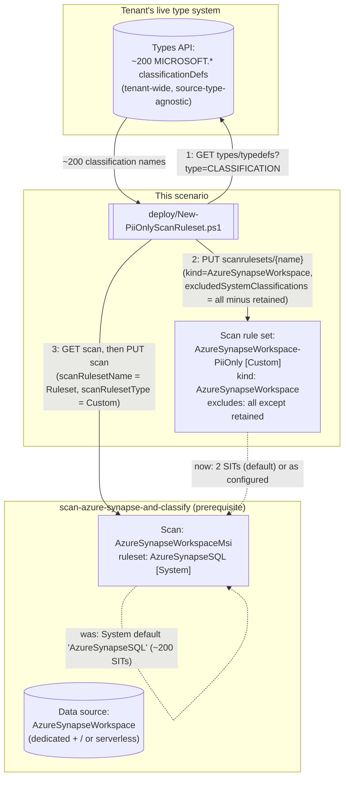

## 1. Problem statement

`scenarios/data-map/scan-azure-synapse-and-classify/` scans an Azure Synapse Analytics workspace's
dedicated and/or serverless SQL pools against Microsoft's **system default** scan rule set
(`AzureSynapseSQL`): every built-in classification Purview ships for this source type, roughly 200
sensitive information types (SITs). That is the right default for a first, exploratory scan — you
don't yet know what's in the workspace, so cast the widest net. It is the wrong steady-state
configuration for a buyer who already knows their compliance driver is narrow (PCI cardholder data,
or a PII-only privacy program) and does not want a catalog cluttered with ~198 classification types
they will never act on, nor a scan that spends time comparing every column against patterns for
currencies, credentials, and national ID formats that will never apply to their program — a real
cost on a Synapse workspace, where the base scenario's own operational notes already flag that a
first full scan of a nontrivial workspace "can take from minutes to hours."

This is the second of this repo's Data Map PII-only scan rule set scenarios, tracked as a follow-up
in `PROGRESS.md` from the first (`scan-azure-sql-and-classify-pii-ruleset`): "the same PII-only
custom scan rule set pattern for this repo's three sibling Data Map source types, each with its own
`*ScanRuleset` `kind`... not built this round to keep the fragment scoped to one source type." This
build applies that proven pattern to Azure Synapse Analytics.

## 2. Design goals

Goals 1, 2, 4, and 5 below are carried over unchanged from the Azure SQL Database sibling's own
design (same underlying REST surface, same failure modes). Goal 3 restates the sibling's
account-wide-object goal with Synapse-specific evidence. Goal 6 is new to this scenario: the
sibling's system-name-equals-kind-name shortcut does not hold here.

1. **Never hand-type the ~200-entry exclusion list.** Same reasoning as the sibling: the Data Map
   classification-supported-list page has no exact `MICROSOFT.*` identifier strings, only
   human-readable names. This scenario's deploy script calls the Data Map **Types API**
   (`GET .../types/typedefs?type=CLASSIFICATION`) at run time — a tenant-wide, source-type-agnostic
   surface, so no new grounding was needed here beyond what the sibling already confirmed.
2. **Reconcile, don't reconstruct.** The scan object being modified already exists with an
   authentication kind (Msi or Credential), one or two SQL pool endpoints, a collection reference,
   and possibly the base scenario's own deliberately-omitted `resourceTypes` field left absent.
   This script's deploy step `GET`s the existing scan and copies its properties forward unchanged
   except the two ruleset fields, so it neither disturbs the dedicated/serverless endpoint
   configuration nor makes a new, uninformed decision about `resourceTypes` — it just preserves
   whatever the base scenario already established.
3. **The ruleset is account-wide, not scan-scoped — design for reuse.** Confirmed via the
   `New-AzPurviewAzureSynapseWorkspaceScanRulesetObject` constructor cmdlet, whose parameter list
   (`-Description`/`-ExcludedSystemClassification`/`-IncludedCustomClassificationRuleName`/`-Type`)
   has no collection- or scan-scoping parameter — the same absence-of-evidence pattern the Azure SQL
   Database sibling used to establish its own ruleset's account-wide scope. One
   `AzureSynapseWorkspace-PiiOnly` ruleset, created once, can be referenced by every Azure Synapse
   Analytics scan in the account that wants this same narrower scope.
4. **Fail loudly on an implausible result, rather than silently deploying a near-no-op ruleset.**
   Same guard as the sibling: hard-fail if the discovered system-classification count is smaller
   than the number of classifications the buyer asked to retain.
5. **Detach before delete.** Same as the sibling — no Microsoft documentation found confirms
   whether deleting an in-use scan rule set succeeds, is rejected, or orphans the scan's reference.
   `deploy/Remove-PiiOnlyScanRuleset.ps1` always reverts the scan first.
6. **Do not let the sibling's system-name-equals-kind-name shortcut leak into this scenario.** For
   Azure SQL Database, the System default ruleset name and the custom ruleset `kind` are the
   identical string (`AzureSqlDatabase`) — an easy pattern to over-generalize into "the revert
   target is always the ruleset kind." For Azure Synapse Analytics this is false: the System default
   ruleset the base scenario's scan starts on is **named** `AzureSynapseSQL`
   (`scan-azure-synapse-and-classify`'s own `-ScanRulesetName` default, and independently confirmed
   via `New-AzPurviewAzureSynapseWorkspaceCredentialScanObject`'s worked example, which shows
   `ScanRulesetName: AzureSynapseSQL` / `ScanRulesetType: System`), while a *custom* ruleset for this
   source type must be created with `kind: AzureSynapseWorkspace` (confirmed via
   `New-AzPurviewAzureSynapseWorkspaceScanRulesetObject`'s own worked example, `Kind:
   AzureSynapseWorkspace`). `deploy/Remove-PiiOnlyScanRuleset.ps1`'s `-RevertToRulesetName` default
   is hard-coded to the correct, independently-confirmed string (`'AzureSynapseSQL'`) rather than
   derived from the ruleset `kind` constant used elsewhere in the same script — see `README.md`
   §11 for the buyer-facing callout of this trap.

## 3. Architecture

## 4. Configuration model

| Element | Value | Why |
|---|---|---|
| Ruleset `kind` | `AzureSynapseWorkspace` | Confirmed via `New-AzPurviewAzureSynapseWorkspaceScanRulesetObject`'s worked example (`Kind: AzureSynapseWorkspace`) — **not** the same string as the System default ruleset's name (goal 6) |
| Ruleset `scanRulesetType` | `Custom` | The only type that supports `excludedSystemClassifications`/`includedCustomClassificationRuleNames` — `System` rulesets are Microsoft-managed and read-only |
| System default ruleset name (revert target) | `AzureSynapseSQL` | Confirmed via the base scenario's own default and independently via `New-AzPurviewAzureSynapseWorkspaceCredentialScanObject`'s worked example |
| Compatible scan `kind`s | `AzureSynapseWorkspaceMsi`, `AzureSynapseWorkspaceCredential` | Both confirmed via their respective Az.Purview constructor cmdlets; the base scenario in this repo only builds the Msi variant, but the guard accepts either so a future Credential-authenticated scan (e.g. the firewall-fallback path the base scenario's `README.md` §11 documents) is not spuriously rejected |
| Retained classifications (default) | `MICROSOFT.GOVERNMENT.US.SOCIAL_SECURITY_NUMBER`, `MICROSOFT.FINANCIAL.CREDIT_CARD_NUMBER` | Same pair as every Data Map PII-ruleset scenario in this repo |
| Exclusion-list source | Live `GET .../types/typedefs?type=CLASSIFICATION`, filtered to the `MICROSOFT.` namespace | Never a hard-coded snapshot — tenant-wide, not source-type-specific, so this scenario reuses the sibling's own confirmed call shape unchanged |
| Ruleset scope | Account-wide (no collection-scoping parameter on the constructor cmdlet) | See Design goal 3 |
| Reconciliation strategy | `GET` scan, copy all properties (including whatever `resourceTypes` state exists or is absent), overwrite only the two ruleset fields, `PUT` | See Design goal 2 |

## 5. What this scenario does not do

- **Author custom classification rules.** Same scope boundary as every Data Map sibling scenario —
  `-IncludedCustomClassificationRuleNames` only references pre-existing, portal-authored rules.
- **Re-scan automatically.** Narrowing the ruleset does not retroactively reclassify assets from
  prior scan runs. `-RunNow` (optional) starts an immediate re-scan of whichever pools the base
  scenario's scan targets; without it, the narrower ruleset only takes effect on the *next* run.
- **Decide between dedicated and serverless pool scope.** This scenario reconciles the ruleset onto
  whichever pools the base scenario's scan object already targets (one or both) — it does not add,
  remove, or otherwise change which endpoints are scanned. That remains
  `scan-azure-synapse-and-classify`'s own responsibility.
- **Resolve the base scenario's own open `resourceTypes` VERIFY.** That property remains
  unauthenticated territory (`README.md` §11); this scenario's reconcile step is deliberately
  neutral toward it (goal 2), not a decision one way or the other.
- **Apply the ruleset to any other source type.** `AzureSynapseWorkspaceScanRuleset` is source-type
  specific; the two remaining sibling scenarios (`scan-azure-sql-managed-instance-and-classify-pii-
  ruleset`, `scan-on-premises-sql-server-and-classify-pii-ruleset`) are tracked separately in
  `PROGRESS.md`.

## 6. References

Full citation list in `README.md` §12.
