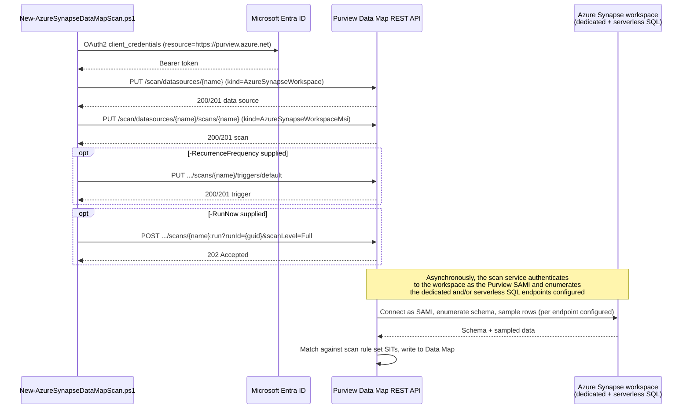

## 1. Problem statement

A tenant that has already stood up Microsoft Purview Data Map against Azure SQL Database
([`data-map/scan-azure-sql-and-classify`](/scenarios/data-map/scan-azure-sql-and-classify/)) and, separately, Azure SQL Managed Instance
([`data-map/scan-azure-sql-managed-instance-and-classify`](/scenarios/data-map/scan-azure-sql-managed-instance-and-classify/)) frequently also runs **Azure
Synapse Analytics** — a workspace that can host both a **dedicated SQL pool** (the modern name for
SQL Data Warehouse) and one or more **serverless SQL pools**, each with its own enumeration and
scan-authentication story. Registering a Synapse workspace is not a variant of either sibling
scenario's data source `kind` — it is Purview's own `AzureSynapseWorkspace` data source, registered
once per **workspace** (not per pool), with the dedicated and serverless SQL endpoints as two
optional properties on the same object. This scenario automates discovery and classification for one
Azure Synapse Analytics workspace's dedicated and/or serverless SQL pools, following the same proven
pattern the two sibling scenarios already established, and diverging from it explicitly and only
where Microsoft's own documentation says Synapse genuinely differs.

## 2. Design goals

1. **Reuse the proven shape a third time, don't fork it.** Same object model (data source + scan,
   both create-or-replace), same credential-free-by-default posture (SAMI/MSI), same idempotency
   mechanism, same four-lens review structure, same generic Data Sources/Scans/Triggers/Scan Result
   REST call shapes both siblings already confirmed by direct fetch. A buyer who has deployed either
   sibling scenario should find this one immediately familiar.
2. **Model the workspace, not a pool.** Unlike the two sibling scenarios (one data source = one
   database), a single `AzureSynapseWorkspace` data source object can carry **both** a
   `dedicatedSqlEndpoint` and a `serverlessSqlEndpoint`. §4 explains why this scenario registers the
   whole workspace rather than branching into two data-source objects.
3. **Name every genuine difference explicitly, in one place.** §4 is the single source of truth for
   "what's different about Synapse" so neither this design doc, the README, nor the scripts
   re-derive it inconsistently.
4. **Don't fabricate what isn't confirmed.** This build independently grounded the `kind` names and
   top-level properties for both the data source and scan objects (Az.Purview PowerShell module's own
   worked examples — see `README.md` §12), and the full portal registration/scan/permissions workflow
   (Microsoft's own `register-scan-synapse-workspace` article, fetched via a verified mirror after
   direct `learn.microsoft.com` fetches were blocked in this build environment — see §8's Grounding
   note). One property — the scan object's optional `resourceTypes` field — could not be independently
   confirmed to an exact JSON shape; this scenario's script omits it rather than guess, per
   `AGENTS.md` §4. See `README.md` §11.
5. **Don't re-litigate what the siblings already decided correctly.** SAMI-first authentication,
   system-default scan rule set (not a fabricated custom PII-only set), create-or-replace-native
   idempotency, and the "register + scan, don't act on results" scope boundary all carry over
   unchanged from both sibling scenarios' own `design.md` §2–3.

## 3. Why a separate scenario, not a `-SourceKind` parameter on either sibling script

`AzureSynapseWorkspace` is a distinct Purview data source `kind` from both `AzureSqlDatabase` and
`AzureSqlDatabaseManagedInstance` — a different property shape (two optional SQL endpoints on one
object, not a single required server/endpoint), a different scan `kind`
(`AzureSynapseWorkspaceMsi`), a different system scan rule set name (`AzureSynapseSQL`), and a
three-part enumeration-authentication story unique to the serverless half (workspace + storage
account + serverless database, vs. the sibling scenarios' single-database grant). Branching one script
on `-SourceKind` across three genuinely different object shapes would obscure more than it would
save. This continues the branching precedent the Managed Instance sibling scenario already set
relative to the logical-server scenario (`scan-azure-sql-managed-instance-and-classify/design.md` §3),
which itself continued a precedent from `scenarios/ediscovery/`.

## 4. What's actually different from the two sibling scenarios

| Dimension | Azure SQL Database (1st sibling) | Azure SQL Managed Instance (2nd sibling) | Azure Synapse Analytics workspace (this scenario) |
|---|---|---|---|
| Data source `kind` | `AzureSqlDatabase` | `AzureSqlDatabaseManagedInstance` | `AzureSynapseWorkspace` |
| Registration granularity | one database | one database | one **workspace** — carries both the dedicated and serverless SQL endpoints as two optional properties on a single data source object |
| Scan `kind` (MSI/SAMI) | `AzureSqlDatabaseMsi` | `AzureSqlDatabaseManagedInstanceMsi` | `AzureSynapseWorkspaceMsi` |
| System scan rule set name | `AzureSqlDatabase` | `AzureSqlDatabaseManagedInstance` | `AzureSynapseSQL` |
| Endpoint property name(s) | `serverEndpoint` (bare hostname) | `serverEndpoint` (`tcp:<fqdn>,<port>`) | `dedicatedSqlEndpoint` (`<workspace>.sql.azuresynapse.net`) and/or `serverlessSqlEndpoint` (`<workspace>-ondemand.sql.azuresynapse.net`) — confirmed via the `New-AzPurviewAzureSynapseWorkspaceDataSourceObject` cmdlet's own worked example |
| Enumeration-authentication grant (Purview MSI as an *Azure IAM* principal) | Reader on the logical server | Reader on the managed instance resource | Reader on the **Synapse workspace** resource for dedicated; the **same** Reader grant on the workspace **plus** Storage Blob Data Reader on the resource group/subscription holding the workspace's associated storage account for serverless — a three-part grant the sibling scenarios don't have |
| Enumeration-authentication grant (database-level, for serverless only) | n/a | n/a | `CREATE LOGIN [<PurviewAccountName>] FROM EXTERNAL PROVIDER;` run against **each serverless SQL database** before the `db_datareader` grant below — a step neither sibling scenario needs |
| Database-level read grant | `CREATE USER ... FROM EXTERNAL PROVIDER` + `db_datareader`, once per database | same T-SQL, once per database | same T-SQL pattern, but **per SQL pool type**: `CREATE USER [<PurviewAccountName>] FROM EXTERNAL PROVIDER` + `sp_addrolemember 'db_datareader'` for each **dedicated** SQL database; `CREATE USER [<PurviewAccountName>] FOR LOGIN [<PurviewAccountName>]` + `ALTER ROLE db_datareader ADD MEMBER` for each **serverless** SQL database — two distinct T-SQL forms, not one |
| External-table credential grant | not documented for this source type | not documented for this source type | `GRANT REFERENCES ON DATABASE SCOPED CREDENTIAL::[scoped_credential] TO [<PurviewAccountName>];` — Synapse-specific, needed only if the workspace has external tables |
| Network prerequisite | logical server firewall / private endpoint | public endpoint + NSG, or private endpoint (SAMI unsupported) | workspace **Firewalls** pane → "Allow Azure services and resources to access this workspace" = **On**. If this cannot be enabled (e.g. a locked-down workspace), **the portal does not support configuring a Synapse scan at all** — Microsoft's own documentation directs operators to the REST API instead, and requires **SQL Auth** (not MSI) in that case — a materially different fallback story from either sibling scenario, which both keep an MSI path available even when network-restricted |
| Scan wizard "Type" selection | n/a (single-purpose source) | n/a (single-purpose source) | **SQL Database** is documented as "the only type we currently support within an Azure Synapse workspace" — i.e. there is no separate dedicated-vs-serverless resource-type toggle exposed in the portal wizard; both endpoints registered on the data source are scanned together as one logical "SQL Database" resource type |
| Lake databases | n/a | n/a | **explicitly not supported** by this data source as of Microsoft's own current documentation — out of scope for this scenario regardless |
| Access-policy support | Data Owner + DevOps policies | DevOps policies confirmed; Data Owner documented but not exercised | not documented either way for this source type in the pages fetched during this build — not exercised by this scenario, consistent with both siblings |

Everything **not** in this table (credential-free-by-default posture, create-or-replace idempotency,
system-default-not-custom scan rule set, dry-run design, staged rollback, generic Data
Sources/Scans/Triggers/Scan Result REST call shapes) is unchanged from the sibling scenarios by
deliberate design choice, not oversight.

## 5. Grounding method for this build

`learn.microsoft.com` returned `EGRESS_BLOCKED` for every direct fetch attempted during this build
(consistent with prior Data Map scenarios' own build notes — the sibling `scan-azure-sql-and-classify`
scenario records the same class of failure for `techcommunity.microsoft.com`). Rather than reconstruct
the Synapse-specific workflow from search-result snippets alone, this build:

1. Located a byte-for-byte mirror of Microsoft's own `register-scan-synapse-workspace` article
   (identical section structure, image references, and Microsoft Learn `[!NOTE]`/`[!TIP]`/`[!IMPORTANT]`
   admonition syntax to every other Microsoft Learn page already grounded elsewhere in this repo) and
   fetched its full text directly — this is the primary source for §3's registration/scan/permissions
   workflow and the account of every IAM role, T-SQL statement, and firewall setting in this scenario's
   `README.md` §3 and §5.
2. Independently confirmed the `AzureSynapseWorkspace`/`AzureSynapseWorkspaceMsi` object `kind` names
   and their top-level property names (`dedicatedSqlEndpoint`, `serverlessSqlEndpoint`, `resourceName`,
   `resourceGroup`, `subscriptionId`, `location`, `collection`, `scanRulesetName`, `scanRulesetType`,
   `credential`, `connectedVia`, `resourceType`, `workers`) via the Az.Purview PowerShell module's own
   `New-AzPurviewAzureSynapseWorkspaceDataSourceObject` and `New-AzPurviewAzureSynapseWorkspaceMsiScanObject`
   cmdlet reference pages (fetched via GitHub raw source, since the same pages on `learn.microsoft.com`
   were blocked) — the same cross-check method the first sibling scenario used for three of its four
   object shapes.
3. Did **not** find an authoritative worked example of the scan object's `resourceTypes` property's
   exact JSON shape (dictionary keys/enum values distinguishing "dedicated" from "serverless" — if
   such a distinction is even needed given the portal's single "SQL Database" Type option, §4). This
   scenario's deploy script omits the property entirely rather than fabricate a shape — see
   `README.md` §11.
4. Reused, unchanged, the four generic REST call shapes (Data Sources / Scans / Triggers / Scan Result
   - Run Scan, all API version `2023-09-01`) the Managed Instance sibling scenario already confirmed by
   direct fetch of Microsoft's own canonical REST reference pages during its own build — these are
   generic to every data source `kind` and don't need re-confirming per source type.

## 6. Object model and REST call sequence

Every mutating call is a create-or-replace or action-style REST call at API version `2023-09-01`. The
Data Sources/Scans/Triggers/Scan Result call shapes are the same ones the Managed Instance sibling
scenario confirmed by direct fetch; only the `kind` and body properties inside the Data Sources/Scans
payloads are Synapse-specific, confirmed per §5.

## 7. Key decisions

| Decision | Choice | Rationale |
|---|---|---|
| Deploy surface | Purview Data Map REST API (`Invoke-RestMethod`), per `docs/automation-surface.md` surface 4 | Same as both sibling scenarios — no PowerShell module or Graph equivalent exists for data source/scan objects themselves |
| Registration granularity | One data source object per **workspace**, with both `-DedicatedSqlEndpoint` and `-ServerlessSqlEndpoint` as optional parameters (at least one required) | Matches Microsoft's own object model — Synapse is registered as a workspace, not per pool, and the portal wizard's endpoint fields "automatically fill in based on your workspace selection" rather than being separate registrations |
| Scan authentication (default) | System-assigned managed identity (`AzureSynapseWorkspaceMsi`) | Microsoft's own documented default option (the "Managed identity" tab is listed first), and the credential-free default both sibling scenarios standardize on |
| `resourceTypes` scan property | Omitted from the request body by default | Not independently confirmed to an exact JSON shape during this build (§5.3); the portal wizard exposes only a single "SQL Database" Type with no dedicated/serverless split to encode, which is weak evidence the property may not be required for the common case — omitting it is safer than guessing a shape that could silently mis-scope the scan. Flagged as an explicit VERIFY in `README.md` §11 |
| SIT set | Microsoft's system default scan rule set (`scanRulesetName: AzureSynapseSQL`, `scanRulesetType: System`) | Same rationale as both sibling scenarios — includes the SSN + Credit Card Number pair this repo standardizes on |
| Network path (default) | Public/firewall-open ("Allow Azure services and resources to access this workspace" = On) | Matches Microsoft's own documented default path and both sibling scenarios' "credential-free, network-simple by default" posture; the fallback (REST API + SQL Auth, no MSI) for a locked-down workspace is documented but not scripted — see §8 Non-goals |
| Idempotency mechanism | Rely on the API's native create-or-replace semantics, same as both sibling scenarios | Consistency with this repo's established Data Map pattern |
| Default policy mode | Register + scan-object creation only; **no** trigger and **no** run unless `-RecurrenceFrequency`/`-RunNow` are explicitly passed | Matches `AGENTS.md` §4's dry-run-by-default code standard, same as every other scenario in this repo |

## 8. Non-goals

- This scenario does not script the **REST-API-plus-SQL-Auth fallback** for a workspace where "Allow
  Azure services and resources to access this workspace" cannot be enabled. Microsoft's own
  documentation states the portal does not support configuring a Synapse scan at all in that case and
  requires SQL Auth instead of MSI — a materially different authentication and credential-management
  story (a Key Vault-backed SQL credential object, same open portal-only credential-object gap both
  sibling scenarios already carry) that is out of scope for this fragment. See `README.md` §11.
- This scenario does not script the **service-principal** authentication alternative Microsoft
  documents alongside managed identity (its own credential-object creation, and per-database
  `CREATE USER [ServicePrincipalID] FROM EXTERNAL PROVIDER` grants) — carried over as a non-goal for
  the same reason both sibling scenarios leave their own service-principal/SQL-auth alternatives
  unscripted.
- This scenario does not script the **external-table scoped-credential grant**
  (`GRANT REFERENCES ON DATABASE SCOPED CREDENTIAL::...`) — a conditional, per-external-table step
  that only applies if the workspace already has external tables defined, and whose scoped-credential
  names are workspace-specific and cannot be generically parameterized. Documented as a manual T-SQL
  step in `README.md` §5.
- This scenario does not create a custom, PII-only scan rule set, or address the Key Vault-backed
  credential object needed for `AzureSynapseWorkspaceCredentialScan` — both non-goals carried over
  unchanged from the sibling scenarios' own non-goals.
- This scenario does not act on the classification results it produces — same scope boundary as both
  sibling scenarios and every other Data Map scenario in this repo.
- This scenario does not stand up the Purview account, the collection hierarchy, or the Synapse
  workspace/pools themselves — prerequisites, not deliverables, of this fragment.
- This scenario does not script Synapse pipeline **lineage** (Microsoft documents this as a separate,
  already-supported capability via Synapse pipeline runs, not the Data Map scan this fragment
  automates) — a candidate for a future `scenarios/data-lineage/` follow-up, not duplicated here.
- This scenario does not register the older, **standalone** "dedicated SQL pool (formerly SQL DW)"
  Purview data source — a separate `kind` Microsoft documents for a dedicated SQL pool that has not
  enabled Azure Synapse workspace features, registered independently of any workspace. This scenario
  deliberately targets the `AzureSynapseWorkspace` path instead: it is Microsoft's currently documented
  workspace-based source, it is the only one of the two that also covers serverless SQL pools, and a
  dedicated pool without workspace features enabled is decreasingly common in a current Synapse
  deployment. Flagged as a Product Owner finding in `reviews.md` and called out explicitly in
  `README.md` §1 so a buyer with existing standalone-source registrations doesn't assume this scenario
  is a drop-in replacement for them.
