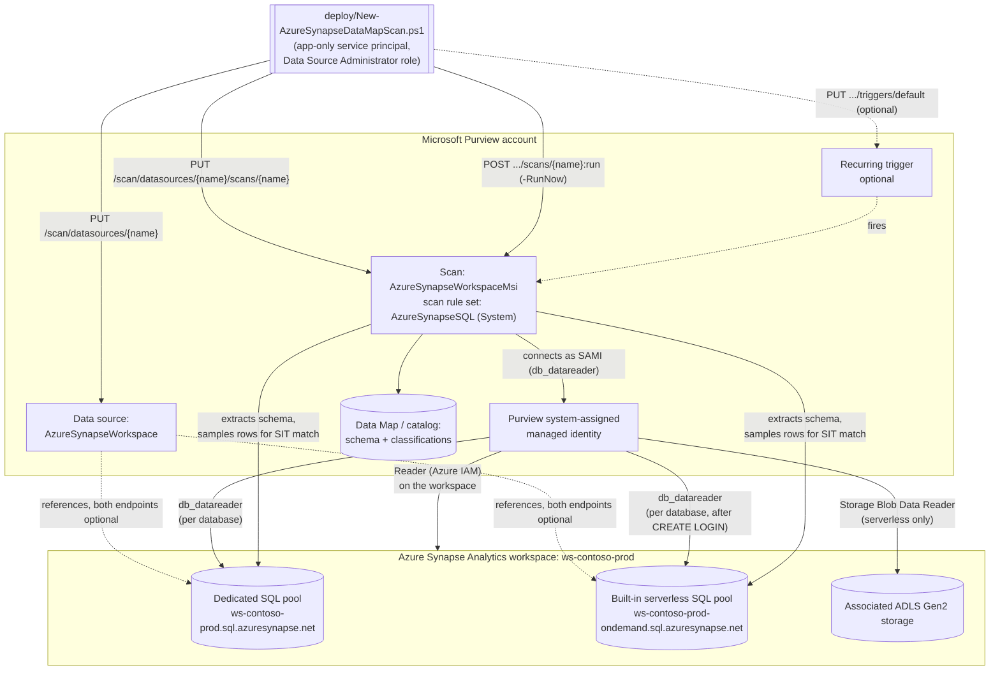

## 1. Scenario summary

Registers an Azure Synapse Analytics workspace as a Microsoft Purview Data Map source, configures a
scan that authenticates as the Purview account's own system-assigned managed identity (SAMI —
credential-free, no Key Vault link to manage), and runs that scan with Microsoft's system default scan
rule set for this source type (`AzureSynapseSQL`) — which includes the SSN and Credit Card Number
sensitive information types (SITs) this repo already uses elsewhere — against the workspace's
dedicated and/or serverless SQL pools, so sensitive columns are automatically classified and surfaced
in the catalog. This is the third scenario in this repo's Azure-SQL-family Data Map series, alongside
[`data-map/scan-azure-sql-and-classify`](/scenarios/data-map/scan-azure-sql-and-classify/) (logical-server Azure SQL Database) and
[`data-map/scan-azure-sql-managed-instance-and-classify`](/scenarios/data-map/scan-azure-sql-managed-instance-and-classify/) (Azure SQL Managed Instance) —
following the same proven pattern but adapted for the genuine registration, authentication, and
network differences a Synapse **workspace** has as its own Purview data source `kind` — see
`design.md` §4 for the full diff.

**Who it's for:** a data governance or security team that has already deployed (or is deploying
alongside) either or both sibling scenarios and also runs Azure Synapse Analytics — a common landing
zone for enterprise data warehousing and large-scale analytics — and needs the same discovery-and-
classification coverage for its dedicated and/or serverless SQL pools, without treating a Synapse
workspace as if it were just another Azure SQL Database.

> **Not the same as the legacy "dedicated SQL pool (formerly SQL DW)" data source.** Microsoft
> Purview documents **two separate** data sources for dedicated SQL pools: an older, standalone one
> (registered independently of any workspace — Microsoft's own docs describe it as for a dedicated
> SQL pool that has not enabled Azure Synapse workspace features) and the `AzureSynapseWorkspace`
> source this scenario uses, which registers the whole workspace and covers **both** dedicated and
> serverless pools. If your dedicated pool already has Azure Synapse workspace features enabled (the
> common case for anything provisioned in the last several years), this scenario's workspace-based
> path is Microsoft's currently documented one to use — not the standalone legacy source. Confirm
> which of the two your existing registrations use before assuming this scenario is a drop-in
> replacement (flagged as a Product Owner finding in `reviews.md`).

## 2. Business/regulatory driver

Same underlying drivers as both sibling scenarios — GDPR Art. 30 records of processing, CCPA/CPRA data
inventory obligations, PCI DSS Requirement 3.2/12.5.2 cardholder data discovery, HIPAA §164.308 risk
analysis all require an accurate, current inventory of where regulated data lives
[[1]](#references). Azure Synapse Analytics is frequently the landing zone for an enterprise's
integrated analytics estate — dedicated SQL pools hosting curated, governed data marts and serverless
SQL pools querying data lake files on demand — which means it is disproportionately likely to
aggregate sensitive data copied or transformed from many upstream source systems into one place.
Scanning it with the same automated, recurring discovery this repo already applies to Azure SQL
Database and Managed Instance keeps that aggregation point from becoming a classification blind spot.

## 3. Prerequisites

Full licensing detail and citations: `docs/licensing-matrix.md`. Summary for this scenario (deltas
from the sibling scenarios' tables are called out explicitly):

| Requirement | Minimum | Notes |
|---|---|---|
| Microsoft Purview account + Data Map | Active **Azure subscription** with the M365 tenant, resource group for the Purview account | PAYG-billed Azure consumption, not a per-user M365 entitlement — see `docs/licensing-matrix.md` §1–2 |
| Register + configure the source/scan | **Data Source Administrator** role on the target collection | Classic Data Map role — see `docs/rbac-model.md` §5 |
| Call the Data Map REST API at all (any role) | **Collection Admin** role at root collection assigns data-plane roles to the automation service principal | Only a Collection Admin can grant Purview roles to a service principal — see `docs/rbac-model.md` §5 |
| Read scan results / browse classified assets (validation) | **Data Reader** role on the target collection | Least-privilege for the read-only `validate/` script |
| **Azure IAM Reader** on the Synapse workspace | Grants the Purview account's SAMI enough visibility to enumerate workspace resources | Required for **both** dedicated and serverless scanning — an *owner* or *user access administrator* must assign it [[2]](#references) |
| **Azure IAM Storage Blob Data Reader** on the workspace's associated storage account | For the Purview SAMI | **Serverless-only, new prerequisite neither sibling scenario has.** Microsoft's own documented steps assign this at the **resource group or subscription** scope containing the storage account — prefer assigning it directly on the **storage account resource itself** where your Azure RBAC delegation model allows it, so the Purview SAMI doesn't gain blob-read access to every other storage account in the same resource group/subscription (flagged as a Red Team finding in `reviews.md`) [[2]](#references) |
| Per-database enumeration login (**serverless only**) | `CREATE LOGIN [<PurviewAccountName>] FROM EXTERNAL PROVIDER;` run once per serverless SQL database in Synapse Studio | **New prerequisite neither sibling scenario has** — see §5 step 3 [[2]](#references) |
| Per-database `db_datareader` grant | Two distinct T-SQL forms — one for dedicated pools, one for serverless pools (§5 step 4) | Same underlying idea as both sibling scenarios, but Synapse needs the operator to pick the right form per pool type [[2]](#references) |
| Workspace **firewall**: "Allow Azure services and resources to access this workspace" = **On** | Azure portal → the workspace → **Firewalls** | If this cannot be enabled, the **portal cannot configure a Synapse scan at all** — Microsoft directs operators to the REST API with **SQL Auth** instead of MSI in that case [[2]](#references) |
| Automation identity for the REST calls themselves | App registration with **Data Source Administrator** (and, for the validate script, **Data Reader**) Purview role on the collection | Client-secret app-only OAuth2 — see `docs/automation-surface.md` §3 and §5 below |

> Verify current entitlement names and the PAYG meter against `docs/licensing-matrix.md` before a
> sales commitment — SKU names and billing meters change.

> **Cost/effort note distinct from both sibling scenarios:** the per-database enumeration login
> (serverless) and `db_datareader` grants above are **not** a fixed, one-time cost the way both
> sibling scenarios' single-database prerequisites are — they scale with the number of databases in
> the workspace. A workspace with dozens of serverless databases means dozens of manual T-SQL grant
> operations before this scenario's scan can classify any of them (flagged as a CISO finding in
> `reviews.md`; a bulk-grant helper script is recorded as a follow-up in `PROGRESS.md` rather than
> built speculatively for this fragment).

## 4. Architecture



Same two-object model as both sibling scenarios (a data source + a scan, both create-or-replace), with
one data source object carrying up to **two** SQL endpoints instead of one, and the SAMI's access
requiring an extra, serverless-only Azure IAM grant (**Storage Blob Data Reader**) neither sibling
scenario needs. Full design rationale and the complete diff table: `design.md` §4.

## 5. Step-by-step implementation

### Portal path (for a first manual walkthrough / to validate intent before scripting)

1. Sign in to the [Microsoft Purview portal](https://purview.microsoft.com) → **Sources** →
   **Register** → **Azure Synapse Analytics (multiple)** → **Continue**. Enter a name, optionally
   filter by subscription, select the **workspace**, confirm the auto-populated dedicated/serverless
   SQL endpoints, choose a collection, and select **Register** [[2]](#references).
2. **Grant the Purview MSI Reader on the workspace.** Azure portal → the Synapse workspace →
   **Access control (IAM)** → **Add** → role **Reader** → assign to the Purview account's name
   (representing its MSI). Requires **Owner** or **User Access Administrator** on the resource
   [[2]](#references). Required for both dedicated and serverless scanning; assign at a resource
   group/subscription scope instead if registering multiple workspaces.
3. **Serverless only — three-part enumeration setup:**
   a. (already done in step 2 — the workspace-level Reader grant applies here too.)
   b. **Storage account:** in the resource group/subscription containing the workspace's associated
      ADLS Gen2 storage account, **Access control (IAM)** → **Add** → role **Storage Blob Data
      Reader** → assign to the Purview account's name.
   c. **Per serverless database:** in Synapse Studio → **Data** → the database's **...** menu → new
      SQL script:
      ```sql
      CREATE LOGIN [<PurviewAccountName>] FROM EXTERNAL PROVIDER;
      ```
      Repeat for every serverless database to be scanned [[2]](#references).
4. **Grant database read access.** Different T-SQL per pool type — run against **each** database:
   - **Dedicated SQL pool:**
     ```sql
     CREATE USER [<PurviewAccountName>] FROM EXTERNAL PROVIDER
     GO
     EXEC sp_addrolemember 'db_datareader', [<PurviewAccountName>]
     GO
     ```
   - **Serverless SQL pool** (after step 3c's `CREATE LOGIN`):
     ```sql
     CREATE USER [<PurviewAccountName>] FOR LOGIN [<PurviewAccountName>];
     ALTER ROLE db_datareader ADD MEMBER [<PurviewAccountName>];
     ```
   - **If the workspace has external tables**, also run (once per scoped credential):
     ```sql
     GRANT REFERENCES ON DATABASE SCOPED CREDENTIAL::[scoped_credential] TO [<PurviewAccountName>];
     ```
     **This step is easy to miss because skipping it fails silently, not loudly:** the scan still
     completes and still classifies every ordinary table/column, so a workspace with external tables
     backed by a scoped credential this grant wasn't applied to will show a "successful" scan that
     quietly under-covers exactly the tables most likely to reference sensitive data sitting outside
     the database itself (flagged as a Red Team finding in `reviews.md`). Confirm which databases have
     external tables and scoped credentials (`SELECT * FROM sys.database_scoped_credentials;`) before
     treating a clean scan run as complete coverage.
   [[2]](#references)
5. **Confirm the workspace firewall.** Azure portal → the workspace → **Firewalls** → **Allow Azure
   services and resources to access this workspace** = **On** → **Save**. If this control cannot be
   enabled for this workspace, stop here and use the REST-API + SQL-Auth fallback instead — see
   §11 [[2]](#references).
6. Back in the Purview portal, select **New scan** under the registered source. In the **Type**
   dropdown, **SQL Database** is the only supported type for this source — select it. Choose the
   credential (the Purview account's MSI, this scenario's default), **Test connection**, then
   **Continue** [[2]](#references).
7. Choose **Azure Synapse SQL** as the scan rule set, choose a scan trigger, and **Save and run**
   [[2]](#references).
8. After the scan completes, browse the classified assets in **Unified Catalog** to confirm columns
   matching your target SITs are tagged.

### Script path (idempotent, parameterized, dry-run capable)

```powershell
# 1. Deploy (dry run first — reports every REST call that would be made, changes nothing)
./deploy/New-AzureSynapseDataMapScan.ps1 `
    -PurviewAccountName 'contoso-purview' `
    -TenantId $TenantId -AppId $AppId -ClientSecret $ClientSecret `
    -SubscriptionId $SubscriptionId -ResourceGroupName 'rg-contoso-data' `
    -WorkspaceName 'ws-contoso-prod' `
    -DedicatedSqlEndpoint 'ws-contoso-prod.sql.azuresynapse.net' `
    -ServerlessSqlEndpoint 'ws-contoso-prod-ondemand.sql.azuresynapse.net' `
    -Location 'eastus' -CollectionReferenceName 'a1b2c' `
    -WhatIf

# 2. Deploy for real — registers the source and the scan, does not run it yet
./deploy/New-AzureSynapseDataMapScan.ps1 `
    -PurviewAccountName 'contoso-purview' `
    -TenantId $TenantId -AppId $AppId -ClientSecret $ClientSecret `
    -SubscriptionId $SubscriptionId -ResourceGroupName 'rg-contoso-data' `
    -WorkspaceName 'ws-contoso-prod' `
    -DedicatedSqlEndpoint 'ws-contoso-prod.sql.azuresynapse.net' `
    -ServerlessSqlEndpoint 'ws-contoso-prod-ondemand.sql.azuresynapse.net' `
    -Location 'eastus' -CollectionReferenceName 'a1b2c'

# 3. Deploy, add a weekly recurring trigger, and kick off an immediate full scan
./deploy/New-AzureSynapseDataMapScan.ps1 `
    -PurviewAccountName 'contoso-purview' `
    -TenantId $TenantId -AppId $AppId -ClientSecret $ClientSecret `
    -SubscriptionId $SubscriptionId -ResourceGroupName 'rg-contoso-data' `
    -WorkspaceName 'ws-contoso-prod' `
    -DedicatedSqlEndpoint 'ws-contoso-prod.sql.azuresynapse.net' `
    -ServerlessSqlEndpoint 'ws-contoso-prod-ondemand.sql.azuresynapse.net' `
    -Location 'eastus' -CollectionReferenceName 'a1b2c' `
    -RecurrenceFrequency Week -RunNow

# 4. Validate
./validate/Test-AzureSynapseDataMapScan.ps1 `
    -PurviewAccountName 'contoso-purview' -TenantId $TenantId -AppId $AppId -ClientSecret $ClientSecret `
    -DataSourceName 'ws-contoso-prod'
```

The deploy script uses the **Microsoft Purview Data Map / Data Governance REST API** — automation
surface 4 per `docs/automation-surface.md` §1. Steps 2–5 above (Reader grant, Storage Blob Data Reader,
per-database logins/grants, firewall) are one-time, out-of-band prerequisites this script does not
perform — see `design.md` §8.

## 6. Configuration reference

| Setting | Value this scenario uses | Notes |
|---|---|---|
| Data source `kind` | `AzureSynapseWorkspace` | Distinct from both sibling scenarios — one object per **workspace**, not per database [[3]](#references) |
| Scan `kind` (default) | `AzureSynapseWorkspaceMsi` | SAMI-authenticated — no credential object to create or rotate [[4]](#references) |
| Scan `kind` (alternative) | `AzureSynapseWorkspaceCredentialScan` | SQL authentication or service principal, requiring a Key Vault-backed credential object created **via the Purview portal** — same open gap as both sibling scenarios; see §11 |
| `dedicatedSqlEndpoint` format | bare hostname, e.g. `ws-contoso-prod.sql.azuresynapse.net` | Optional — confirmed via Microsoft's own worked PowerShell example [[3]](#references) |
| `serverlessSqlEndpoint` format | bare hostname, e.g. `ws-contoso-prod-ondemand.sql.azuresynapse.net` | Optional — at least one of the two endpoints is required; confirmed via the same worked example [[3]](#references) |
| Collection reference | `{ "referenceName": "<5-char collection ID>", "type": "CollectionReference" }` | Same shape as both sibling scenarios — read the ID from the collection's URL in the portal, not its friendly name |
| Scan rule set (this scenario's default) | `scanRulesetName: "AzureSynapseSQL"`, `scanRulesetType: "System"` | A **different system rule set name** from both sibling scenarios — confirmed via Microsoft's own worked PowerShell example and the portal's own scan-setup documentation; includes the same SSN + Credit Card Number pair [[4]](#references)[[2]](#references) |
| Scan object `resourceTypes` property | **Omitted** by this scenario's deploy script | Not independently confirmed to an exact JSON shape during this build; the portal's own scan wizard exposes only a single "SQL Database" Type for this source — see §11 (VERIFY) |
| Scan level | `Full` (first run) → `Incremental` (subsequent scheduled runs) | Same pattern as both sibling scenarios |
| Recurring trigger | Optional; `RecurrenceFrequency`/`RecurrenceInterval` parameters | Trigger resource name is always `default` — same generic shape both sibling scenarios confirmed |
| Run-scan call shape | `POST .../scans/{name}:run?runId={guid}&scanLevel={level}` | Action-style POST — the same generic shape confirmed by direct fetch during the Managed Instance sibling scenario's build; reused unchanged here since it does not vary by data source `kind` |
| API version pinned by this script | `2023-09-01` | Same version both sibling scenarios pin, for the same generic Data Sources/Scans/Triggers/Scan Result operations |

Full cmdlet/REST-body grounding: `deploy/New-AzureSynapseDataMapScan.ps1` inline comments and its
`.NOTES` block cite the exact Microsoft Learn reference pages.

## 7. Validation / how to prove it works

1. **Automated config check** — `./validate/Test-AzureSynapseDataMapScan.ps1` confirms the data
   source and scan objects exist with the expected `kind` and at least one configured SQL endpoint,
   and reports the most recent scan run's status. Exits non-zero on any hard failure (safe for a
   CI-style pre-flight).
2. **Scan run status** — Purview portal → **Data Map** → **Data sources** → select the source →
   **Recent scans** → the run shows **Queued → In progress → Completed**, with assets
   discovered/classified counts. Scan run history is retained for **90 days**.
3. **Classification evidence** — browse or search the **Unified Catalog** for the scanned dedicated
   and/or serverless database assets; confirm the target columns carry the **U.S. Social Security
   Number** or **Credit Card Number** classification badges.
4. **Enumeration-grant evidence (serverless only)** — in the serverless database, confirm the Purview
   account's login exists (`SELECT * FROM sys.server_principals WHERE name = '<PurviewAccountName>'`,
   run from Synapse Studio) before troubleshooting scan failures further — a missing `CREATE LOGIN` is
   the single most common serverless-specific failure this scenario's own config check cannot see.
   **Deliberately manual, not part of `validate/Test-AzureSynapseDataMapScan.ps1`:** that script
   authenticates against the Purview Data Map data-plane resource (`https://purview.azure.net`) with a
   Data Reader-scoped Purview role; confirming a serverless SQL login exists needs a separate SQL
   connection to the serverless endpoint itself — a different auth surface this scenario's automation
   identity has no other reason to hold. A dedicated SQL-permissioned checker script covering this
   (and the parallel `db_datareader` check in §7 check 5) is recorded as a follow-up in `PROGRESS.md`
   rather than silently left unautomated (flagged as a Blue Team finding in `reviews.md`).
5. **Access-path evidence** — confirm in each scanned database
   (`SELECT * FROM sys.database_principals WHERE type = 'E'`) that the Purview account's SAMI appears
   as an external-provider database user with `db_datareader`.

## 8. Operations & tuning

Same KPIs, alert-routing model (no `GenerateAlert`-style alerting for Data Map scans — poll instead),
and incident-response runbook shape as both sibling scenarios — see `scan-azure-sql-and-classify/
README.md` §8 for the full text, not repeated here. Two Synapse-specific additions to the triage step,
alongside the sibling scenarios' own causes:

**Incident-response addition — Synapse-specific failure causes:** (e) the **serverless enumeration
login** (`CREATE LOGIN [<PurviewAccountName>] FROM EXTERNAL PROVIDER`) was never created, or was
dropped during a database restore/recreate — the scan authenticates successfully against the workspace
but silently returns zero serverless assets, since the workspace-level Reader grant alone is not
sufficient for serverless enumeration; (f) the workspace's **Storage Blob Data Reader** grant on the
associated storage account was revoked (e.g. during a storage-account access review that didn't know
this scenario's serverless scan depended on it) — serverless enumeration fails even though the
dedicated pool (if also scanned) continues to work, since only serverless enumeration depends on this
grant.

**Review cadence:** same as both sibling scenarios, plus one Synapse-specific check: after any
database restore, recreate, or migration within the workspace, re-run
`validate/Test-AzureSynapseDataMapScan.ps1` and re-confirm the per-database `CREATE LOGIN`/`CREATE
USER`/`db_datareader` grants (§7 checks 4–5) — a database-level rebuild silently drops these grants
even though the workspace-level IAM roles (Reader, Storage Blob Data Reader) are unaffected.

**Downstream use:** same as both sibling scenarios — this scenario stops at "classify and make
visible," feeding `scenarios/information-protection/`, `scenarios/dlp/`, and any future Data Estate
Insights reporting fragment.

## 9. Rollback / decommission

See `rollback.md` for the full staged procedure (disable trigger → delete scan → delete data source) —
structurally identical to both sibling scenarios'. Quick reference:
`./deploy/Remove-AzureSynapseDataMapScan.ps1` removes the scan and its trigger (reversible by
re-running the deploy script); add `-RemoveDataSource` to also delete the data source registration.
Rolling back the scan/data source objects does **not** revert the out-of-band prerequisites (Reader
grant, Storage Blob Data Reader, per-database logins/grants, firewall setting) — see `rollback.md`.

## 10. Cost & licensing notes

Same PAYG/Azure-consumption billing model as both sibling scenarios — see `docs/licensing-matrix.md`
§1–2 and `scan-azure-sql-and-classify/README.md` §10 for the full text (cost governance, sizing, no
M365 license consumed). No Synapse-specific billing delta from Purview's side: Data Map scanning
meters the same way regardless of the underlying Azure SQL family source type. (Azure Synapse Analytics
itself — dedicated pool DWU/vCore compute, serverless data-processed pricing — bills separately and is
out of scope for this scenario's cost notes, same as the compute layer of both sibling scenarios.)

## 11. Known limitations & gotchas

- **VERIFY — scan object `resourceTypes` property.** This scenario's deploy script omits the optional
  `resourceTypes` property from the scan request body entirely rather than guess its exact JSON shape
  (dictionary keys/enum values that might distinguish dedicated from serverless resources within the
  scan). No authoritative worked example of this shape was found during this build; the Purview portal
  scan wizard exposes only a single "SQL Database" Type for this source with no visible
  dedicated/serverless split, which is weak evidence the property may not be required for the common
  case, but this has not been confirmed against a pilot tenant. If a scan silently covers only one pool
  type when both endpoints are registered, this property is the first place to check.
- **SAMI cannot be used if the workspace firewall's "Allow Azure services and resources to access this
  workspace" control cannot be enabled.** Microsoft's own documentation states the Purview portal
  cannot configure a Synapse scan at all in that case, and directs operators to the Scans REST API with
  **SQL Auth** instead of MSI — a materially different authentication and credential-management story
  (a Key Vault-backed SQL credential object, same open portal-only credential-object gap both sibling
  scenarios already carry) not scripted by this scenario.
- **Existing classifications are not retroactively removed** when a scan rule set is narrowed — same
  behavior as both sibling scenarios.
- **Azure Synapse lake databases are explicitly not supported** by this data source, per Microsoft's
  own current documentation — out of scope for this scenario regardless of authentication method.
- **U.S.-centric SIT starter set** — same caveat as every other scenario in this repo using the SSN +
  Credit Card Number pair; not GDPR-complete for a non-U.S. tenant.
- **VERIFY — credential-object REST creation.** Same open gap as both sibling scenarios: no documented
  REST endpoint for creating the Key Vault-backed credential object needed for
  `AzureSynapseWorkspaceCredentialScan` scanning.
- **Grounding method note.** `learn.microsoft.com` returned `EGRESS_BLOCKED` for every direct fetch
  attempted during this build. The portal registration/scan/permissions workflow in §3 and §5 is
  grounded via a verified byte-for-byte mirror of Microsoft's own `register-scan-synapse-workspace`
  article rather than a direct fetch of the canonical URL; the data source/scan object `kind` and
  property names in §6 are independently confirmed via the Az.Purview PowerShell module's own worked
  examples (fetched via GitHub raw source). See `design.md` §5 for the full grounding method.

## 12. References

1. Discover and govern Azure SQL Database in Microsoft Purview (shared regulatory-driver framing) — <https://learn.microsoft.com/purview/register-scan-azure-sql-database>
2. Connect to and manage Azure Synapse Analytics workspaces in Microsoft Purview (registration, enumeration/scan authentication for dedicated and serverless SQL, firewall requirement, scan wizard "Type" behavior, lake-database non-support) — <https://learn.microsoft.com/purview/register-scan-synapse-workspace>
3. New-AzPurviewAzureSynapseWorkspaceDataSourceObject (Az.Purview PowerShell module — confirms `dedicatedSqlEndpoint`/`serverlessSqlEndpoint` property names and format via its own worked example) — <https://learn.microsoft.com/powershell/module/az.purview/new-azpurviewazuresynapseworkspacedatasourceobject>
4. New-AzPurviewAzureSynapseWorkspaceMsiScanObject (Az.Purview PowerShell module — confirms `ScanRulesetName 'AzureSynapseSQL'` via its own worked example) — <https://learn.microsoft.com/powershell/module/az.purview/new-azpurviewazuresynapseworkspacemsiscanobject>
5. Data Sources - Create Or Replace REST API reference (API version 2023-09-01; generic shape confirmed by direct fetch during the `scan-azure-sql-managed-instance-and-classify` sibling scenario's build) — <https://learn.microsoft.com/rest/api/purview/scanningdataplane/data-sources/create-or-replace>
6. Scans - Create Or Replace REST API reference (API version 2023-09-01; same generic-shape confirmation) — <https://learn.microsoft.com/rest/api/purview/scanningdataplane/scans/create-or-replace>
7. Triggers - Create Or Replace REST API reference (API version 2023-09-01; same generic-shape confirmation) — <https://learn.microsoft.com/rest/api/purview/scanningdataplane/triggers/create-or-replace>
8. Scan Result - Run Scan / List Scan History REST API reference (API version 2023-09-01; confirms the `POST .../scans/{name}:run?runId=...` action-style shape and the nested `discoveryExecutionDetails.statistics.assets` shape) — <https://learn.microsoft.com/rest/api/purview/scanningdataplane/scan-result/run-scan> and <https://learn.microsoft.com/rest/api/purview/scanningdataplane/scan-result/list-scan-history>
9. Az.Purview PowerShell module reference (`Remove-AzPurviewDataSource`, `Remove-AzPurviewScan`) — <https://learn.microsoft.com/powershell/module/az.purview/>
10. Data governance roles and permissions in Microsoft Purview (classic Data Map role vocabulary) — <https://learn.microsoft.com/purview/data-gov-classic-permissions>
11. Managed virtual networks and private endpoints in Microsoft Purview (confirms Azure Synapse Analytics is among the data sources Microsoft documents as reachable via a Purview-managed private endpoint, distinct from the flat SAMI-over-private-endpoint restriction the Managed Instance sibling scenario documents — not exercised by this scenario's default public/firewall-open path) — <https://learn.microsoft.com/purview/data-governance-private-endpoints-managed-virtual-network>
12. [`data-map/scan-azure-sql-and-classify`](/scenarios/data-map/scan-azure-sql-and-classify/) and [`data-map/scan-azure-sql-managed-instance-and-classify`](/scenarios/data-map/scan-azure-sql-managed-instance-and-classify/) — the sibling scenarios this fragment extends; see their README.md and design.md for shared reasoning not repeated here.
13. Connect to and manage dedicated SQL pools (formerly SQL DW) in Microsoft Purview — the older, standalone data source this scenario deliberately does **not** use; cited here so a reader who lands on this page while researching Synapse scanning understands it documents a different, separate Purview data source `kind` from the workspace-based one this scenario automates — <https://learn.microsoft.com/purview/register-scan-azure-synapse-analytics>

> Re-verify all links, API versions, and the `resourceTypes` VERIFY item against current Microsoft
> Learn before a customer-facing deployment — the Data Map REST surface is explicitly called out by
> Microsoft as evolving, and `learn.microsoft.com` was unreachable for direct verification throughout
> this build (see §11's grounding-method note).
