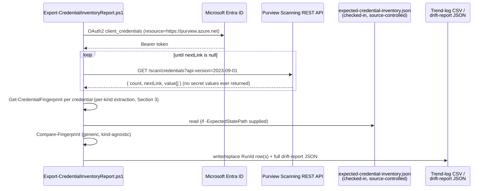

## 1. Problem statement

`scenarios/data-map/scan-credential-key-vault-backed/README.md` §11 (Red Team finding, carried from
its own `reviews.md`) names a real, undocumented gap: a Purview credential is a **create-or-replace**
object, so anyone (or anything) holding **Data Source Administrator** on the collection can rewrite an
existing credential — same name, different Key Vault secret, different service principal, different
identity fields entirely — and Microsoft's own enumerated Purview audit-event category table does not
list credentials at all. No scan breaks. No new object appears. Every scan that referenced the
credential keeps running, now authenticating as something else. That scenario's own `validate/`
script can prove a **single named** credential still matches expected values, but only if you already
know which one to check and pass every `-Expected*` parameter by hand.

That is a real, named, open control gap in this repo — not a hypothetical one — and this fragment is
the detective control that gap needed: an **estate-wide**, checked-in-file-driven inventory of every
credential, run on a schedule, that turns "did anything get silently re-pointed" from a manual,
per-credential question into an automated, diffable one.

## 2. Design goals

1. **Generalize, don't duplicate.** `scan-credential-key-vault-backed/validate/
   Test-PurviewScanCredential.ps1` already proves this pattern works for one credential with
   hand-supplied `-Expected*` parameters. This scenario lifts the same idea — compare observed
   fields against expected ones — to every credential in the account, driven by a single checked-in
   file instead of per-run command-line parameters. It does not replace the sibling scenario's
   script (which remains the right tool for "did the credential I just deployed come out right");
   it answers a different, complementary question ("has anything in the whole inventory drifted
   since I last checked").
2. **Handle all eight documented kinds correctly, not just the three this repo creates.**
   `scan-credential-key-vault-backed` deliberately scripts creation for only three kinds (`SqlAuth`,
   `BasicAuth`, `ServicePrincipal`) — but `GET /scan/credentials` returns **whatever exists**,
   including any of the other five kinds an operator created through the portal or a different
   pipeline. A report that silently mis-parses or skips `AccountKey`/`AmazonARN`/`ConsumerKeyAuth`/
   `DelegatedAuth`/`ManagedIdentity` credentials would give false confidence. Each kind's
   `typeProperties` shape is structurally different — three have no `KeyVaultSecret` reference at
   all (`AmazonARN`'s `roleARN` is a plain string; `ManagedIdentity` carries only
   `principalId`/`resourceId`/`tenantId`) — so the extraction has to be a genuine per-kind table, not
   a single assumed shape. See §3.
3. **Never touch, log, or expose a secret value.** Every field this scenario extracts and writes is
   either a plaintext identity property (`user`, `servicePrincipalId`, `tenant`, `roleARN`,
   `clientId`, `principalId`, `resourceId`, `tenantId`) or a Key Vault **secret reference**
   (`secretName`, `store.referenceName`, `secretVersion`) — never a password, key, or token. This is
   not a design choice this scenario had to make carefully; it is structurally guaranteed, because
   `GET /scan/credentials` **never returns secret values in the first place** — the same
   reference-only property the create path relies on (`scan-credential-key-vault-backed/design.md`
   §3) holds symmetrically for the read path.
4. **Idempotent trend log, same replace-by-RunId pattern already established.** Matches
   `scenarios/data-estate-insights/classification-coverage-report/design.md` §5 exactly — no new
   idempotency model to design or review.
5. **The comparison engine is generic, not a per-kind if/else chain.** Once a credential's fields are
   flattened into a named field set (the "fingerprint"), comparing it against an expected-state file
   is one small, kind-agnostic function (`Compare-Fingerprint`). Adding a ninth credential kind in
   the future (if Microsoft ever adds one) means adding one `switch` arm to
   `Get-CredentialFingerprint`, not touching the comparison or reporting logic at all.
6. **Be one fragment.** This scenario reads credentials and reports drift. It does not create,
   modify, or delete any credential (that remains `scan-credential-key-vault-backed`'s job), and it
   does not attempt to build the other five credential kinds' **creation** scripts — that is a
   separate, still-open `PROGRESS.md` follow-up. Read-only reporting on a kind and scripted creation
   of that same kind are different scopes, and conflating them would have made this fragment too
   large to review properly (`AGENTS.md` §6).

## 3. The per-kind fingerprint table

| `kind` | `typeProperties` shape | Fingerprint fields extracted |
|---|---|---|
| `SqlAuth`, `BasicAuth` | `{ user, password: KeyVaultSecret }` | `User`, `Password.SecretName`, `Password.KeyVaultConnectionName`, `Password.SecretVersion` |
| `ServicePrincipal` | `{ servicePrincipalId, servicePrincipalKey: KeyVaultSecret, tenant }` | `ServicePrincipalId`, `Tenant`, `ServicePrincipalKey.SecretName`, `ServicePrincipalKey.KeyVaultConnectionName`, `ServicePrincipalKey.SecretVersion` |
| `AccountKey` | `{ accountKey: KeyVaultSecret }` | `AccountKey.SecretName`, `AccountKey.KeyVaultConnectionName`, `AccountKey.SecretVersion` |
| `AmazonARN` | `{ roleARN }` — plain string, **no** `KeyVaultSecret` | `RoleARN` |
| `ConsumerKeyAuth` | `{ consumerKey, consumerSecret: KeyVaultSecret, password: KeyVaultSecret, user }` | `User`, `ConsumerKey`, `ConsumerSecret.*`, `Password.*` (two independent secret references) |
| `DelegatedAuth` | `{ clientId, password: KeyVaultSecret, user }` | `ClientId`, `User`, `Password.*` |
| `ManagedIdentity` | `{ principalId, resourceId, tenantId }` — **no** `KeyVaultSecret` at all | `PrincipalId`, `ResourceId`, `TenantId` |

Every row is grounded verbatim against the Credential - List REST reference's per-kind definitions
(`README.md` reference 1), fetched in full during this fragment's build — not inferred from the three
kinds `scan-credential-key-vault-backed` already covers. `AmazonARN` and `ManagedIdentity` are the two
structurally distinct cases worth calling out explicitly: a credential of either kind has **nothing**
resembling a Key Vault secret reference to fingerprint, which is a real, documented property of those
kinds, not a gap in this script's extraction logic.

## 4. Object model and REST call sequence

## 5. Idempotency model (same as the Data Estate Insights coverage reports)

Re-running for the same `-RunId` (default: current UTC date) **replaces** that RunId's rows in the
trend log rather than appending duplicates — identical to
`classification-coverage-report/design.md` §5 and `sensitivity-label-coverage-report`'s own pattern.
No new idempotency design was needed; reusing an already-reviewed pattern is deliberate, not
incidental (`AGENTS.md` §6 — keep fragments small by reusing what the repo already established).

## 6. Key decisions

| Decision | Choice | Rationale |
|---|---|---|
| Deploy surface | Purview Scanning data-plane REST (`Invoke-RestMethod`), surface 4 | Same as `scan-credential-key-vault-backed` — no PowerShell or Graph equivalent exists for credential objects |
| Fingerprint scope | Identity properties + secret **references** only, never values | §2 goal 3 — structurally guaranteed by the API, not a self-imposed restriction that could be relaxed later |
| Comparison model | Field-name-driven generic diff (`Compare-Fingerprint`), not per-kind assertions | §2 goal 5 — keeps the engine kind-agnostic and small |
| Expected-state source | A checked-in JSON file (`-ExpectedStatePath`), optional | Mirrors this scenario's stated purpose — generalizing the sibling scenario's per-run `-Expected*` parameters into a durable, diffable, source-controlled artifact, not another set of command-line flags |
| Missing-credential handling | A name present in the expected file but absent from the live tenant is reported as `Status = Missing`, distinct from `Drift` | A deleted (or never-deployed) credential is a different failure mode from a re-pointed one, and a pipeline may want to alert on them differently |
| Untracked-credential handling | A live credential with no matching entry in the expected file is reported as `Status = NotTracked`, not a failure by default | An estate legitimately grows; a new, not-yet-added-to-expected-state credential is informational, not itself evidence of tampering, by default. `-FailOnDrift` intentionally does **not** gate on `NotTracked` — but a wholly new *unauthorized* credential also only ever shows as `NotTracked` (it isn't a re-point of a tracked one), so leaving this ungated entirely would be a real detection gap in tighter environments. Resolved with a second, independent switch — `validate/`'s `-FailOnUntracked` — rather than folding it into `-FailOnDrift`, because the two answer different questions and a tenant with frequent legitimate onboarding needs to turn off the second without losing the first (`reviews.md`, Red Team finding 1) |
| Idempotency | Replace-by-RunId, reused from `classification-coverage-report` | §5 |
| Pagination | Follow `nextLink` until null | Same generic list-pagination pattern as every other Purview List operation in this repo; flagged as a VERIFY only because no worked *populated* `nextLink` example exists for this specific endpoint — `README.md` §11 |

## 7. Non-goals

- **Creating, modifying, or deleting any credential.** Purely a read/report layer, same posture as
  `classification-coverage-report`. `scan-credential-key-vault-backed` remains the only scenario in
  this repo that writes credential objects.
- **Scripting creation of the five credential kinds this repo doesn't already build**
  (`AccountKey`, `AmazonARN`, `ConsumerKeyAuth`, `DelegatedAuth`, `ManagedIdentity`). This scenario
  can **report on** any of them if they exist (§2 goal 2, §3) — reading and writing are different
  scopes, and the still-open `PROGRESS.md` follow-up for scripting their *creation* is unaffected by
  this fragment shipping.
- **Resolving whether the observed secret-reference literals (`type`/`store.type`) match Microsoft's
  actual schema.** That VERIFY belongs to `scan-credential-key-vault-backed` (the scenario that
  writes those literals); this scenario reads back whatever is already there and reports it as
  observed, without re-litigating that open question.
- **A Purview-native alert or Sentinel/Log Analytics sink.** Same posture as
  `classification-coverage-report/design.md` §7 — flat trend-log/drift-report files are the
  deliverable; SIEM ingestion is the buyer's own integration.
- **Reconciling which scan(s) consume a drifted credential.** `scan-credential-key-vault-backed`'s
  own `design.md` §7 already names "no credential-to-scan reverse index" as a Purview API gap this
  repo cannot script around; this scenario inherits that same limitation rather than re-solving it.
