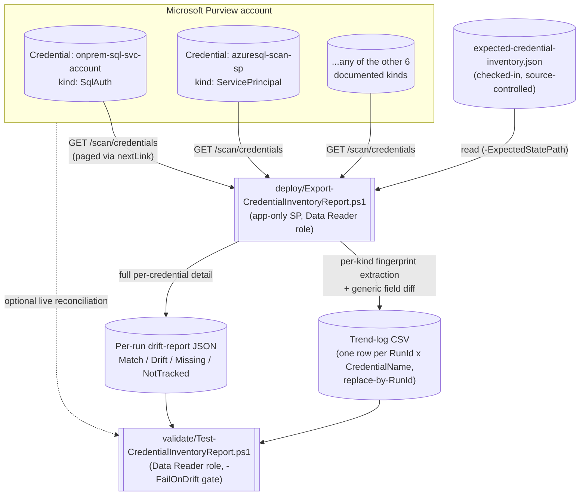

## 1. Scenario summary

Scripts an estate-wide, historical inventory of every Microsoft Purview Data Map **scan credential**
(`GET /scan/credentials`, all eight documented `CredentialType` kinds) and diffs each one against a
checked-in expected-state file, flagging any credential whose secret reference or identity fields no
longer match what was deployed. This closes the one open detective-control gap
`scenarios/data-map/scan-credential-key-vault-backed/README.md` §11 names and does not resolve: a
Purview credential is a create-or-replace object with **no documented audit-event category**, so a
silent re-point (same name, different Key Vault secret or identity, under whichever role can write
credentials) leaves no native trail.

**Who it's for:** the same data governance/platform team that owns
`scan-credential-key-vault-backed`, once it has more than a small handful of credentials to keep
track of, a security/compliance reviewer who needs to answer "has our scan-authentication
configuration changed since we last checked" without hand-inspecting every credential one at a time.

## 2. Business/regulatory driver

`scan-credential-key-vault-backed/README.md` §2 already makes the case for scripting credential
*creation* against SOC 2 CC6.1/CC6.3 and ISO 27001 A.5.15/A.8.2 privileged-access expectations. This
scenario completes that control's other half, **detection**, not just prevention:

- **A preventive control without a matching detective control is an incomplete control.**
  Least-privilege at creation time (Data Source Administrator, never the secret itself) does not
  stop a Data Source Administrator, or anyone who compromises that identity, from later rewriting
  an existing credential to point somewhere else. Without an inventory that is diffed on a schedule,
  that re-point is invisible until something downstream breaks, or worse, until it doesn't (because
  the credential now happily authenticates as something the attacker controls).
- **Change-management evidence for an auditor.** "Show me that your scan-authentication
  configuration hasn't drifted from what was approved" is exactly the kind of evidence a SOC 2 or
  ISO 27001 auditor evaluating change-management controls over privileged automation configuration
  will ask for. A trend log with a `Match`/`Drift`/`Missing`/`NotTracked` status per credential, per
  run, is that evidence in a form that doesn't require re-explaining Purview's object model each
  time.
- **This is a compensating control for a documented absence, not a nice-to-have.**
  `scan-credential-key-vault-backed/README.md` §11 states plainly that Microsoft's own enumerated
  Purview audit-event category table does not list credentials or Key Vault connections at all. This
  scenario is one of the three compensating controls that same section names, the one that turns a
  scheduled review from "hope someone notices" into "a script tells you."

## 3. Prerequisites

Full licensing detail and citations: `docs/licensing-matrix.md`. Summary for this scenario:

| Requirement | Minimum | Notes |
|---|---|---|
| Microsoft Purview account + Data Map | Active Azure subscription; Data Map is PAYG-billed Azure consumption | `docs/licensing-matrix.md` §1-2. This scenario is read-only and adds no metered consumption beyond the `Credential - List` calls themselves, see §10 |
| At least one credential already created | e.g. via `scenarios/data-map/scan-credential-key-vault-backed/` | This scenario does not create any credential, see §6/`design.md` §6 |
| Run this scenario's report script | **Data Reader** role on the collection(s) whose credentials should be visible | **VERIFY, by analogy, same open question `scan-credential-key-vault-backed/README.md` §3 already carries**: Microsoft's role reference never names *credentials* in any Data Map collection role's description. Credential is a Scanning-plane object alongside data sources and scans (which Data Reader *is* documented to read), so this scenario assumes the same role as its sibling's own read path. Confirm on a pilot tenant before designing least-privilege around it |
| Grant the automation identity a Purview role at all | **Collection Admin** at root (or the relevant sub-collection) | Only a Collection Admin can assign Data Map data-plane roles, `docs/rbac-model.md` §5 |
| Automation identity for the REST calls | App registration with the Data Reader role above; client-secret app-only OAuth2 | `docs/automation-surface.md` §3 and surface 4 |
| Somewhere to persist the trend-log CSV and drift-report JSON between runs | A repo path, mounted file share, or blob storage | Not provisioned by this scenario, see §6/§9. **Treat this storage as sensitive**, see §11 |
| A checked-in expected-state file (optional but strongly recommended) | `deploy/policy/expected-credential-inventory.json` is a worked starting point | Without it, this scenario still produces a full inventory, it just cannot flag drift, only enumerate what exists (`Status = NotTracked` for everything) |
| Review governance on changes to that file | An approver **distinct from** whoever can deploy `scan-credential-key-vault-backed`'s scripts (e.g. a `CODEOWNERS` entry or branch protection rule) | Not a Purview or Azure control, a source-control policy. See §11's Red Team finding: without this separation, the same actor who re-points a credential could also silently update the "expected" record to match |

> Verify current entitlement names against `docs/licensing-matrix.md` (dated 2026-09-02) before a
> sales commitment, SKU names and billing meters change.

## 4. Architecture



The report script never modifies, creates, or deletes any credential, every call it makes is a
read-only `GET`, and no field it extracts or writes is ever a secret value (only identity properties
and Key Vault secret **references**). Full design rationale: `design.md`.

## 5. Step-by-step implementation

### Portal path (for a first manual walkthrough / to validate intent before scripting)

1. In the [Microsoft Purview portal](https://purview.microsoft.com) → **Data Map** → **Source
   management** → **Credentials**, review the current credential list, name, authentication
   method, and Key Vault connection per row.
2. There is no native export or historical trend for this list, this is exactly the gap this
   scenario's script closes.
3. Assign the automation identity's service principal the **Data Reader** role on the collection(s)
   in scope: **Data Map** → **Collections** → select the collection → **Role assignments** → add
   under **Data readers**.
4. Copy `deploy/policy/expected-credential-inventory.json`, rename it, and fill in the credentials
   you expect to exist, kind, and the fingerprint fields from §6's table for that kind.

### Script path (idempotent by RunId, parameterized, dry-run capable)

```powershell
# 1. Dry run - lists every credential, computes fingerprints, prints a summary, writes nothing to disk
./deploy/Export-CredentialInventoryReport.ps1 `
    -PurviewAccountName 'contoso-purview' -TenantId $TenantId -AppId $AppId -ClientSecret $ClientSecret `
    -ExpectedStatePath './deploy/policy/expected-credential-inventory.json' `
    -TrendLogPath './deploy/out/credential-inventory-trend.csv' `
    -DriftReportDirectory './deploy/out/drift-reports' -WhatIf

# 2. Run for real - writes/replaces today's trend-log row(s) and this run's drift-report JSON
./deploy/Export-CredentialInventoryReport.ps1 `
    -PurviewAccountName 'contoso-purview' -TenantId $TenantId -AppId $AppId -ClientSecret $ClientSecret `
    -ExpectedStatePath './deploy/policy/expected-credential-inventory.json' `
    -TrendLogPath './deploy/out/credential-inventory-trend.csv' `
    -DriftReportDirectory './deploy/out/drift-reports'

# 3. Validate - file-integrity checks, the drift gate, and an optional live reconciliation
./validate/Test-CredentialInventoryReport.ps1 `
    -TrendLogPath './deploy/out/credential-inventory-trend.csv' `
    -DriftReportDirectory './deploy/out/drift-reports' -FailOnDrift `
    -PurviewAccountName 'contoso-purview' -TenantId $TenantId -AppId $AppId -ClientSecret $ClientSecret
```

Both scripts use the **Microsoft Purview Scanning data-plane REST API**, automation surface 4 per
`docs/automation-surface.md` §1, the same surface `scan-credential-key-vault-backed`'s own scripts
use. Token acquisition follows the identical client-credentials pattern.

**Scheduling:** this scenario ships no scheduler-specific code, wire
`deploy/Export-CredentialInventoryReport.ps1` into whatever recurring-execution mechanism the buyer
already runs other PowerShell automation on, then gate on `validate/
Test-CredentialInventoryReport.ps1 -FailOnDrift`'s exit code. A daily run is the right default
cadence for a control this repo positions as a change-management/audit-evidence mechanism; a tenant
with frequent, legitimate credential churn (many onboarding pipelines) may prefer a lower-frequency
review cadence instead to reduce `NotTracked` noise, see §8.

## 6. Configuration reference

### Fingerprint fields extracted per `kind`

| `kind` | Fields (all are identity properties or Key Vault secret **references**, never secret values) |
|---|---|
| `SqlAuth`, `BasicAuth` | `User`, `Password.SecretName`, `Password.KeyVaultConnectionName`, `Password.SecretVersion` |
| `ServicePrincipal` | `ServicePrincipalId`, `Tenant`, `ServicePrincipalKey.SecretName`, `ServicePrincipalKey.KeyVaultConnectionName`, `ServicePrincipalKey.SecretVersion` |
| `AccountKey` | `AccountKey.SecretName`, `AccountKey.KeyVaultConnectionName`, `AccountKey.SecretVersion` |
| `AmazonARN` | `RoleARN` (plain string, this kind has no Key Vault reference at all) |
| `ConsumerKeyAuth` | `User`, `ConsumerKey`, `ConsumerSecret.SecretName`/`.KeyVaultConnectionName`/`.SecretVersion`, `Password.SecretName`/`.KeyVaultConnectionName`/`.SecretVersion` (two independent secret references) |
| `DelegatedAuth` | `ClientId`, `User`, `Password.SecretName`/`.KeyVaultConnectionName`/`.SecretVersion` |
| `ManagedIdentity` | `PrincipalId`, `ResourceId`, `TenantId` (no Key Vault reference at all) |

Full per-kind grounding and the REST shapes behind this table: `design.md` §3, and
`deploy/Export-CredentialInventoryReport.ps1`'s `Get-CredentialFingerprint` function.

### Report status values

| `Status` | Meaning |
|---|---|
| `Match` | The credential exists live, is named in the expected-state file, and every expected field matches |
| `Drift` | The credential exists live, is named in the expected-state file, but one or more fields (or its `kind`) no longer match |
| `Missing` | The credential is named in the expected-state file but does **not** exist live, deleted, or never deployed |
| `NotTracked` | The credential exists live but has no matching entry in the expected-state file (or no `-ExpectedStatePath` was supplied at all) |

### Deploy script parameters (selected)

| Parameter | Default | Notes |
|---|---|---|
| `-ExpectedStatePath` | *(none)* | Optional, omit for an inventory-only report (every credential reported as `NotTracked`) |
| `-RunId` | Current UTC date (`yyyy-MM-dd`) | Re-running for the same RunId replaces that RunId's rows rather than duplicating |
| `-ApiVersion` | `2023-09-01` | Same version `scan-credential-key-vault-backed` was grounded against |

### Validate script parameters (selected)

| Parameter | Default | Notes |
|---|---|---|
| `-FailOnDrift` | Off | When set, any `Drift`/`Missing` credential in the most recent run is a hard `[FAIL]` rather than an informational `[WARN]`, the parameter a CI/scheduled-pipeline gate should pass |
| `-FailOnUntracked` | Off | When set, **also** fails on any `NotTracked` credential, a wholly new, never-approved credential (not a re-point of a tracked one) otherwise only ever shows as `NotTracked` and `-FailOnDrift` alone will not catch it. See §11's Red Team finding. Recommended in any tenant where new-credential creation is rare/tightly controlled; leave off where legitimate onboarding regularly adds credentials faster than the expected-state file is updated |
| `-DriftReportDirectory` | *(none)* | Required for the drift gate and to inspect the most recent run's full per-field mismatch detail |

## 7. Validation / how to prove it works

1. **Automated file-integrity check**, `./validate/Test-CredentialInventoryReport.ps1` confirms the
   trend log's schema, that no `(RunId, Name)` row is duplicated (proof the replace-by-RunId
   idempotency design is holding), and that every row's `Status`/`MismatchCount` pair is internally
   consistent. Runs without any tenant credentials.
2. **Drift gate**, with `-FailOnDrift` and `-DriftReportDirectory` supplied, fails non-zero if the
   most recent run recorded any `Drift` or `Missing` credential, and prints the exact field(s) that
   didn't match. This is the check a scheduled pipeline should gate alerting or deployment approval
   on.
3. **Live reconciliation (optional)**, supplying tenant credentials adds a check that the most
   recent run's reported credential count still matches the *current* live count, flagging any
   credential added since the last export as a `[WARN]` (informational, a legitimately new
   credential, not evidence of drift on its own).
4. **Idempotency proof**, re-run `deploy/Export-CredentialInventoryReport.ps1` a second time with
   the same `-RunId` and confirm the trend log still has exactly one row per `(RunId, Name)`, never
   two.
5. **Manual spot-check of the drift detector itself**, in a pilot tenant, deliberately re-run
   `scan-credential-key-vault-backed/deploy/New-PurviewScanCredential.ps1` with a different
   `-SecretName` against an existing credential (simulating the exact re-point Red Team finding this
   scenario exists to detect), then re-run this scenario's deploy script and confirm the credential
   now reports `Status = Drift` with `Password.SecretName` (or the equivalent field for the kind
   used) as the flagged mismatch.

## 8. Operations & tuning

**KPIs / what to watch**

| Signal | Where | Healthy | Act when |
|---|---|---|---|
| `Drift` or `Missing` status count, per run | Trend-log CSV, or `validate/ -FailOnDrift` exit code | Zero | Any non-zero count, investigate immediately, not on the next scheduled review (§11's runbook) |
| `NotTracked` count trend | Trend-log CSV | Roughly stable, or trending toward zero as the expected-state file is kept current | A sustained rise means the expected-state file has fallen behind real onboarding, add the new credentials to it deliberately, don't just ignore the noise |
| Live-reconciliation `[WARN]` frequency | `validate/` console output | Clears on the next scheduled run | Persists across two or more runs, investigate as a possible stale report or a scope mismatch |

**Alert routing:** same posture as `classification-coverage-report/README.md` §8, this scenario
produces flat files and a non-zero exit code, not a native Purview alert. Route
`validate/Test-CredentialInventoryReport.ps1 -FailOnDrift`'s exit code into whatever CI/ops alerting
the buyer already uses for scheduled scripts.

**Runbook, a `Drift` or `Missing` status appears**

1. **Do not assume malice first, but do not assume benign either, the runbook is what tells them
   apart, not a guess.** Pull the mismatch detail from the drift-report JSON (`validate/` prints it,
   or open `<RunId>-credential-inventory-drift.json` directly).
2. **Cross-check with change records.** Was there a legitimate, recent deploy of `scan-credential-
   key-vault-backed/deploy/New-PurviewScanCredential.ps1` against this credential name, a planned
   secret rotation with a new `-SecretVersion`, or an intentional re-point? If yes and it matches
   what was approved, update the expected-state file to reflect the new values (a deliberate,
   reviewed commit, not a silent edit) and re-run.
3. **If no legitimate change explains it**, treat this as the Red Team finding
   `scan-credential-key-vault-backed/README.md` §11 describes made concrete: escalate as a possible
   unauthorized credential modification. Check who currently holds Data Source Administrator on the
   affected collection, check Key Vault `AuditEvent` diagnostic logs for reads against the *new*
   secret reference the drift report shows (a re-point at a secret outside the expected set is
   visible from the vault side even though Purview's own audit trail is silent, the same
   compensating control named in that section), and treat this the same as any other
   privileged-configuration-tampering incident until proven otherwise.
4. **`Missing` status specifically**, confirm whether the credential was deliberately decommissioned
   (via `scan-credential-key-vault-backed/deploy/Remove-PurviewScanCredential.ps1`, per its own
   `rollback.md`) before assuming this is a problem. If it was, remove that entry from the
   expected-state file in the same commit that records the decommission.

**Review cadence:** daily is the default `-RunId` grain; review the trend log itself (not just react
to `[FAIL]`s) at least monthly to catch a `NotTracked` count that's quietly grown because the
expected-state file wasn't kept current.

## 9. Rollback / decommission

See `rollback.md`. Summary: this scenario creates **no Purview object**, there is nothing in the
Purview account itself to roll back. Decommissioning means stopping the scheduled execution,
removing the reporting service principal's Data Reader role assignment, and deciding what to do with
the already-produced trend-log/drift-report files and the checked-in expected-state file.

## 10. Cost & licensing notes

- **This scenario adds no metered consumption beyond the `Credential - List` calls themselves.**
  Purview Data Map's PAYG billing is driven by scanning (vCore-hours) and Data Map capacity units,
  neither of which a read-only credential-listing call touches, see `docs/licensing-matrix.md`
  §1-2.
- **No new per-user M365 licensing.** Same PAYG/Azure-consumption model as
  `scan-credential-key-vault-backed`.
- **Negligible call volume.** Even a large estate's credential count (tens to low hundreds) is
  trivial next to the `Discovery - Query` call volumes `classification-coverage-report` already
  documents as immaterial at that scenario's own scale.
- **The real cost is process, not Azure spend:** keeping the expected-state file current as
  credentials are legitimately added or rotated. An expected-state file that isn't maintained
  produces `NotTracked` noise that erodes trust in the control, see §8.

## 11. Known limitations & gotchas

- **The expected-state file and drift-report output are themselves sensitive artifacts.** While no
  field this scenario extracts is ever a secret *value*, a drift-report JSON does reveal which Key
  Vault, which secret *names*, and which service-principal/user identities back each scan credential
, reconnaissance value for an attacker planning where to target next. Store `-ExpectedStatePath`,
  `-TrendLogPath`, and `-DriftReportDirectory` output in access-controlled storage, the same
  discipline `classification-coverage-report/README.md` §11 states for its own report artifacts.
- **VERIFY (pilot tenant): the Data Reader role assumption for reading credentials**, carried
  unchanged from `scan-credential-key-vault-backed/README.md` §3, Microsoft's Data Map collection
  role reference never names *credentials* specifically in any role's description.
- **VERIFY: `nextLink` pagination is followed as a directly-callable URL, not confirmed against a
  populated worked example for this endpoint.** Microsoft's Credential - List reference's own worked
  example returns exactly 2 credentials with `nextLink: null`, there is no multi-page worked example
  to confirm the field's exact contract (relative vs. fully-qualified URL) for *this specific*
  endpoint, though this is the standard Azure REST list-pagination convention followed elsewhere in
  this repo. If a tenant with enough credentials to trigger a second page behaves differently, this
  is the first thing to check.
- **This scenario cannot detect a re-point to a *different secret version of the same secret name*
  when no version was pinned at creation time.** If `scan-credential-key-vault-backed` was deployed
  without `-SecretVersion` (its own recommended default, README.md §8), the credential's
  `Password.SecretVersion` fingerprint field is always `(latest - unpinned)`, both before and after a
  vault-side rotation, which is by design (that is what "unpinned" means), but it also means an
  attacker who can write a new Key Vault secret *version* under the same name, without ever touching
  the Purview credential object at all, produces **zero drift** in this report. This is not a gap in
  this scenario's extraction, the Purview credential object genuinely doesn't change, but a reader
  relying on this report as the *only* detective control needs to know it does not cover that
  specific attack path. Key Vault's own `AuditEvent` diagnostic logging (already named as a
  compensating control in `scan-credential-key-vault-backed/README.md` §11) is what covers it.
- **`ConsumerKeyAuth`'s `consumerKey` field, and `AmazonARN`'s `roleARN` field, are extracted and
  reported in plaintext in this scenario's drift-report JSON.** Per Microsoft's own schema, these are
  typed as plain strings, not `KeyVaultSecret` references, they are not secret *values* by
  Microsoft's own object model (a role ARN is an AWS resource identifier, not a credential; a
  "consumer key" in this API's own naming is paired with a separate `consumerSecret` reference that
  *is* the sensitive half), but treat this scenario's output as sensitive regardless, per the first
  bullet above.
- **This is a detective control, not a preventive one.** It cannot stop a re-point from happening, it
  can only report one that already did, on whatever cadence it's scheduled. See §8's runbook for what
  to do when it fires.
- **Red Team finding, resolved: default `-FailOnDrift` alone does not catch a wholly new,
  unauthorized credential.** A credential that is entirely new, not a re-point of one already in the
  expected-state file, is reported as `Status = NotTracked`, and `validate/`'s default behavior
  treats `NotTracked` as informational, not a failure (§6/§8), because legitimate onboarding
  routinely creates credentials faster than a human updates the expected-state file. That default is
  correct for most tenants, but it means an attacker who creates a **brand-new** rogue credential
  (rather than re-pointing an existing tracked one) passes `-FailOnDrift`'s gate silently. **Resolved
  by** the `-FailOnUntracked` switch (§6), set it in any environment where credential creation is
  rare and tightly controlled enough that every new credential should require a reviewed,
  deliberate addition to the expected-state file before being accepted as legitimate.
- **Red Team finding, mitigated by process, not by code: the expected-state file itself is only as
  trustworthy as the review process around changes to it.** If the same actor (human or pipeline)
  who can re-point a live credential can also edit the checked-in expected-state file without
  independent review, a malicious re-point plus a matching expected-state edit in the same commit
  defeats this entire control, the drift report would show `Match` because the "expected" state was
  updated to agree with the tampering. This scenario cannot detect that from inside Purview or from
  the file alone; the mitigation is organizational: require a **separate approver** (e.g. a
  `CODEOWNERS` entry, or branch protection) on changes to the expected-state file path, distinct from
  whoever can deploy `scan-credential-key-vault-backed`'s scripts, so no single identity can both make
  the change and approve the record of what's expected. The file's own **git history** is then the
  actual audit trail Purview itself doesn't provide, see §8 step 2's runbook guidance to update it
  only via "a deliberate, reviewed commit."

## 12. References

1. [Credential - List (Purview Scanning data plane, 2023-09-01)](https://learn.microsoft.com/rest/api/purview/scanningdataplane/credential/list), `GET /scan/credentials`, `{ count, nextLink, value[] }` envelope, worked 2-credential example, all eight kind-specific `properties`/`typeProperties` definitions used to build §6's fingerprint table.
2. [Credential - Create Or Replace](https://learn.microsoft.com/rest/api/purview/scanningdataplane/credential/create-or-replace), the same eight kind definitions from the write side, cross-checked for consistency with reference 1.
3. [Tutorial: Use REST APIs to authenticate for Microsoft Purview data-plane APIs](https://learn.microsoft.com/purview/data-gov-api-rest-data-plane), token acquisition and data-plane role assignment.
4. [Manage domains and collections in Microsoft Purview Data Map](https://learn.microsoft.com/purview/data-map-domains-collections-manage), Data Reader role definition (credentials not named specifically, see the VERIFY in §3/§11).
5. [Audit logs, diagnostics, and activity history](https://learn.microsoft.com/purview/data-gov-classic-audit-logs-diagnostics), the enumerated Management audit-event categories that do **not** include credentials or Key Vault connections, the documented absence this scenario's drift detection compensates for.

Related scenarios in this library:
- `scenarios/data-map/scan-credential-key-vault-backed/`, creates the credentials this scenario
  reports on; its `README.md` §11 names the silent-re-point gap this scenario closes.
- `scenarios/data-map/scan-credential-remaining-kinds/`, creates the other five credential kinds
  (`AccountKey`, `AmazonARN`, `ConsumerKeyAuth`, `DelegatedAuth`, `ManagedIdentity`) this scenario's
  fingerprint table already covers; no change was needed here to support them.
- `scenarios/data-estate-insights/classification-coverage-report/`, the sibling reporting scenario
  this fragment's trend-log/replace-by-RunId idempotency pattern is reused from verbatim.
- `docs/rbac-model.md` §5, Data Map collection roles.
- `docs/automation-surface.md`, surface 4 (Purview data-plane REST).

> Re-verify all links against current Microsoft Learn before a customer-facing deployment, this
> repo's Data Map REST surface is explicitly called out elsewhere
> (`scenarios/data-map/scan-azure-sql-and-classify/README.md` §11) as evolving.
