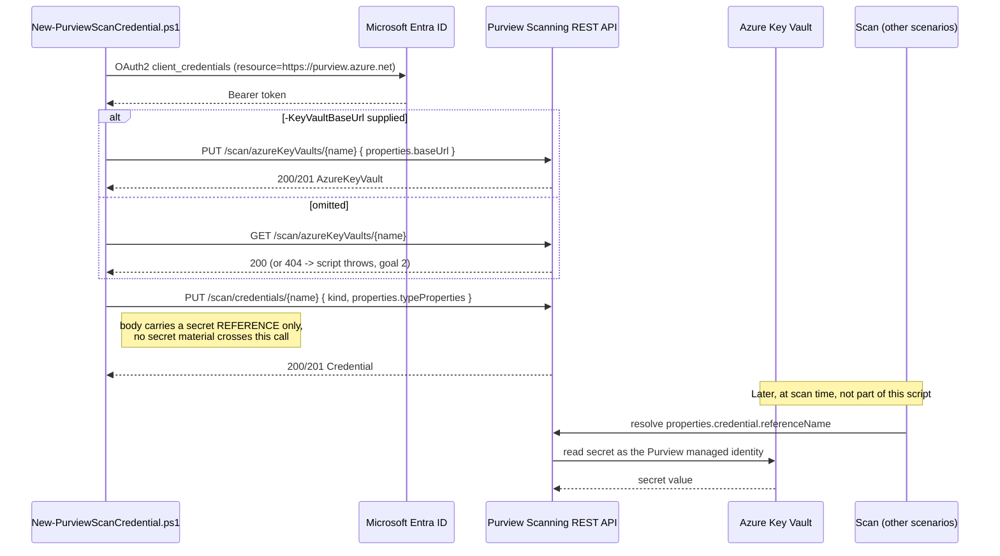

## 1. Problem statement

Two Data Map scenarios already in this library stop at the same wall. `scan-on-premises-sql-server-
and-classify` requires a `-CredentialReferenceName` that "must already exist"; `scan-azure-sql-and-
classify` lists credential-based scanning as a non-goal because "no documented REST endpoint for
credential creation was found." Both conclusions were correct for the sources available to those
builds, and both are now wrong: the Purview **Scanning data plane** exposes **Credential** and
**Key Vault Connections** as first-class, fully documented operation groups at
`api-version=2023-09-01` (`README.md` references 1, 4, 5).

The consequence of that wall was concrete, not cosmetic. A buyer automating Data Map onboarding for
an estate that cannot use the Purview system-assigned managed identity, on-premises SQL Server, or
anything reached over a **self-hosted integration runtime**, which does not support managed-identity
authentication, had a pipeline with a mandatory human portal step in the middle of it. This
fragment removes that step, and only that step.

## 2. Design goals

1. **Never handle secret material.** The deploy script must be structurally incapable of leaking a
   scan password, not merely careful with one. It takes no secret parameter for the target data
   source at all, only the Key Vault *coordinates*. See §3.
2. **Fail fast on a dangling reference.** A credential pointing at a non-existent Key Vault
   connection is accepted as metadata and fails later, at scan time, with a confusing error. The
   script refuses to create one: without `-KeyVaultBaseUrl` it `GET`s the named connection and
   throws if it is absent.
3. **Make the one genuine unknown adjustable, not hard-coded.** Exactly two field values in this
   scenario are unconfirmed by any Purview-specific source (§5). They ship as parameters with
   researched defaults, and `validate/` surfaces the observed values so a single pilot-tenant read
   closes the question permanently. Guessing silently would have violated `AGENTS.md` §4; refusing
   to build would have left the wall in place.
4. **Idempotent by construction, not by extra logic.** Both mutating calls are `PUT`s against
   documented create-or-replace endpoints, matching the pattern the sibling Data Map scenarios
   already established.
5. **Be one fragment.** Create the credential and its Key Vault connection. Do not create vaults,
   write secrets, grant vault access, register data sources, or create scans, every one of those
   is either an existing scenario or a deliberate out-of-band step (§3, §7).

## 3. Why the deploy script does not write the secret or grant vault access

This is the central design decision, and it is a security decision before it is a scoping one.

A Purview credential object stores a **reference**, connection name, secret name, optional
version, and nothing else. The secret is read at scan time by the Purview account's own managed
identity, directly from Key Vault. That means a fully automated "create the secret, grant access,
create the credential" script would need to be *given* the plaintext password and hold
vault-write plus IAM-write privileges. It would collapse three separate trust boundaries into one
service principal, for no gain: the reference-only object is exactly as useful either way.

Keeping steps 1-2 (`README.md` §5) out of band therefore buys a real control:

| Actor | Privilege | Can do | Cannot do |
|---|---|---|---|
| Deploy automation SP | Data Source Administrator (Purview collection) | Create/replace the credential and Key Vault connection objects | Read, write, or infer any secret value; grant itself vault access |
| Key Vault Secrets Officer | Write secrets in the vault | Set and rotate the scan password | Configure Purview scanning |
| Purview account managed identity | Get/List on the vault's secrets | Resolve the secret at scan time | Anything in Purview's control plane |

No one of these three can, alone, both set a credential's value and point a scan at it. That
property is what makes this scenario defensible against SOC 2 CC6.1/CC6.3 and ISO 27001
A.5.15/A.8.2 privileged-access expectations (`README.md` §2), and it would be destroyed by a
"convenient" one-script version. The cost, two roles must coordinate, is acknowledged in
`reviews.md` under the CISO lens rather than hidden.

## 4. Two service principals that must not be the same one

The `ServicePrincipal` credential kind introduces a confusion this design explicitly guards
against, because the two identities look identical in a parameter file:

| Parameter | Identity | Authenticates | Needs |
|---|---|---|---|
| `-AppId` | The **caller** | This script → Purview Scanning REST API | Data Source Administrator on the collection |
| `-ServicePrincipalId` | The **scan** | Purview scan → the target data source | Source-side access (e.g. `db_datareader`), and its client secret in Key Vault |

Merging them produces a single principal that can both configure scanning *and* read the scanned
database, precisely the separation §3 exists to preserve. The deploy script warns when
`-ServicePrincipalId` equals `-AppId`, and `validate/` re-checks it on every run. It is a warning
rather than a hard error because a small tenant may legitimately accept the tradeoff; it should
still be a deliberate choice, not an accident of copy-paste.

This mirrors the "two identities, two grants" table in
`scan-azure-sql-and-classify/design.md` §4, the same distinction, one layer further in.

## 5. Object model and REST call sequence

The credential body is a discriminated union on `kind` (`README.md` §6). The script builds
`typeProperties` per kind and shares one `KeyVaultSecret` sub-object across all three, which is why
adding a fourth kind later is a small change rather than a rewrite.

**The one open question, and why it is a parameter.** `KeyVaultSecret` has two `type`-style
discriminators, `type` and `store.type`, that Microsoft's Purview reference types as bare
`string` with no enumerated values, and the reference's only worked example is a `BasicAuth`
credential with a `description` and no `typeProperties` at all. So the Purview documentation set
contains **no populated secret reference anywhere**. Three candidate sources were checked and
eliminated: the `@azure-rest/purview-scanning` SDK types both as `string`; `Az.Purview` has no
credential-object cmdlet (only scan objects); no Learn article shows the JSON. The defaults
(`AzureKeyVaultSecret`, `LinkedServiceReference`) come from Data Factory's identically-shaped
`AzureKeyVaultSecretReference`, corroborated by Purview's own Key Vault connection response `id`
ending in `/linkedservices/AzureKeyVault1`, Purview *does* model the connection as a linked
service. Strong, converging, and still indirect. Hard-coding would have dressed an inference as a
fact; the parameterized form states the uncertainty in the interface itself and lets one
pilot-tenant `GET` settle it. See `README.md` §11.

## 6. Key decisions

| Decision | Choice | Rationale |
|---|---|---|
| Deploy surface | Purview Scanning data-plane REST (`Invoke-RestMethod`), surface 4 | No PowerShell or Graph equivalent exists, `Az.Purview` covers scan objects only, not credentials |
| Secret handling | Reference only; script takes no data-source secret parameter | §3, the trust-boundary split is the control, not a limitation |
| Key Vault connection | Created only when `-KeyVaultBaseUrl` is passed; otherwise verified | Goal 2, the connection is commonly shared across many credentials, so silently replacing it on every credential deploy would be wrong |
| Credential kinds scripted | `SqlAuth`, `BasicAuth`, `ServicePrincipal` | The three the SQL-family scan kinds in this repo consume. The other five are documented but structurally different (notably `ManagedIdentity`, which has no Key Vault reference at all), `README.md` §11 |
| `secretVersion` | Optional, omitted by default | Omitting it is expected to track the latest version, making rotation a vault-only operation (itself a VERIFY). Pinning is available for change-controlled environments |
| The two discriminator literals | Parameters with researched defaults | §5 |
| Deletion safety | `-RemoveKeyVaultConnection` blocked while other credentials reference the connection | A shared connection is the realistic case; an unguarded delete breaks unrelated scans. `-Force` exists for a genuine bulk teardown |
| Idempotency | Native create-or-replace, no Get-then-branch | Matches the sibling scan scenarios; a re-run always reconciles rather than masking drift |
| Validation severity | Discriminator mismatch is `[WARN]`, never `[FAIL]` | A mismatch may mean *this scenario's default is wrong*, not that the tenant is. Failing would train operators to ignore the one check that can close the VERIFY |

## 7. Non-goals

- **Creating the Azure Key Vault, or writing the secret into it.** Deliberate, §3.
- **Granting the Purview managed identity access to the vault.** Also deliberate, §3. It is an
  Azure IAM/access-policy action, documented step-by-step in `README.md` §5 step 2.
- **Registering data sources or creating scan objects.** Those are
  `scenarios/data-map/scan-on-premises-sql-server-and-classify/` and
  `scenarios/data-map/scan-azure-sql-and-classify/`. This fragment hands them a credential name.
- **The other five credential kinds** (`AccountKey`, `AmazonARN`, `ConsumerKeyAuth`,
  `DelegatedAuth`, `ManagedIdentity`), `README.md` §11 and `PROGRESS.md` follow-ups.
- **A credential-to-scan reverse index.** The API documents no such lookup, so
  `Remove-PurviewScanCredential.ps1` cannot warn that a live scan still references the credential
  it is deleting. Disclosed in `README.md` §11 and the script's `.NOTES` rather than faked with a
  brute-force enumeration this build could not verify the shape of.
- **Rotating secrets.** This scenario makes rotation cheap (`README.md` §8) but does not perform
  it; secret rotation is a Key Vault lifecycle concern with its own tooling.
- **Replacing managed identity where it works.** Microsoft recommends managed identity "whenever
  possible," and so does this repo. This scenario serves the cases where it is genuinely
  unavailable, see `README.md` §11.
