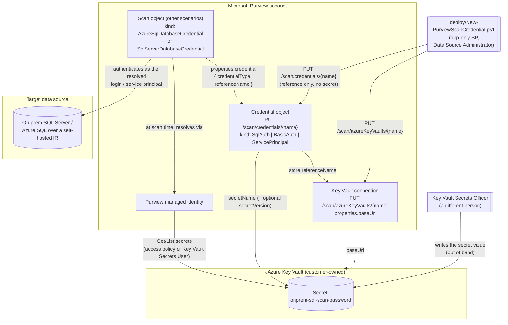

## 1. Scenario summary

Creates the two Microsoft Purview objects that let a Data Map scan authenticate to a data source
with a **stored credential** instead of the Purview account's own managed identity: an **Azure Key
Vault connection** (`PUT /scan/azureKeyVaults/{name}`) and a **credential object**
(`PUT /scan/credentials/{name}`) of kind `SqlAuth`, `BasicAuth`, or `ServicePrincipal`. The
credential stores only a *reference* to a Key Vault secret, vault connection, secret name,
optional secret version, never the secret itself.

This is the missing upstream prerequisite for every credential-authenticated scan in this library.
`scenarios/data-map/scan-on-premises-sql-server-and-classify/` requires a
`-CredentialReferenceName` that must "already exist," and
`scenarios/data-map/scan-azure-sql-and-classify/` documents the credential path as portal-only.
Both were built when no REST endpoint for credential creation had been located. One is documented,
at `api-version=2023-09-01`, this scenario closes that gap
and corrects those two scenarios' notes in place.

**Who it's for:** a data governance or platform team automating Purview Data Map onboarding end to
end, whose target sources **cannot** use the Purview system-assigned managed identity (SAMI), 
most commonly because the scan runs over a **self-hosted integration runtime**, which does not
support managed-identity authentication, or because the source is an on-premises SQL Server that
only accepts a SQL login.

## 2. Business/regulatory driver

The driver here is **completing an automated control, not adding a new one**. The regulatory case
for Data Map scanning itself (GDPR Art. 30 records of processing, PCI DSS cardholder-data
discovery, HIPAA §164.308 risk analysis) is made in
`scenarios/data-map/scan-azure-sql-and-classify/` §2. This fragment removes the one manual,
un-auditable step that kept that control from being fully reproducible:

- **Reproducibility / infrastructure-as-code.** A portal-clicked credential is undocumented state.
 If a Purview account is rebuilt in DR, or a second collection is onboarded, or an auditor asks
 "how is scan authentication configured," a hand-created credential has no artifact to point at.
 This scenario makes that object a scripted, diffable, re-runnable deployment.
- **Separation of duties as an enforceable boundary, not a convention.** Because a Purview
 credential holds only a reference, the person who *configures scanning* (Data Source
 Administrator on a Purview collection) and the person who *holds the secret* (Key Vault Secrets
 Officer) can be genuinely different people, and the deploy script in this scenario provably
 never touches secret material. That is a control a portal workflow cannot demonstrate as
 cleanly, and it maps directly to SOC 2 CC6.1/CC6.3 and ISO 27001 A.5.15/A.8.2 least-privilege
 and privileged-access expectations.
- **Credential rotation becomes a routine operation.** Rotating a scan password in Key Vault is a
 vault-side action; if no version is pinned, no Purview change is needed at all. Where a version
 *is* pinned, re-running one idempotent script updates it. See §8.

## 3. Prerequisites

Full licensing detail and citations: [Licensing matrix](/docs/licensing-matrix/). Summary for this scenario:

| Requirement | Minimum | Notes |
|---|---|---|
| Microsoft Purview account + Data Map | Active **Azure subscription**; Data Map is **PAYG-billed Azure consumption**, not a per-user M365 entitlement | [Licensing matrix §1](/docs/licensing-matrix/#1-the-two-billing-models-read-this-first), 2. This scenario creates configuration objects only and adds **no** metered consumption by itself, see §10 |
| Create/replace credential and Key Vault connection objects | **Data Source Administrator** on the target collection (or a parent, by inheritance) | [RBAC model §5](/docs/rbac-model/#5-data-governance-roles-data-map--unified-catalog-a-separate-model). **VERIFY:** Microsoft defines this role as managing "data sources and scans" and never names *credentials* in any role description, Data Source Administrator is this repo's by-analogy assumption (credentials are Scanning-plane objects alongside data sources and scans), not a documented requirement. Confirm on a pilot tenant before designing least-privilege around it; if it proves insufficient, Collection Admin is the fallback |
| Assign that role to the automation service principal | **Collection Admin** at the root collection | Only a Collection Admin can grant Data Map data-plane roles, [RBAC model §5](/docs/rbac-model/#5-data-governance-roles-data-map--unified-catalog-a-separate-model), |
| Read back the objects (the `validate/` script) | **Data Reader** on the target collection | Least-privilege for the read-only path |
| An **Azure Key Vault**, and the secret inside it | Vault exists; the password / service-principal key is already stored as a secret | Azure-side prerequisite. This scenario never creates a vault or writes a secret, §5 step 1,. **Use a Key Vault dedicated to Purview scan credentials**, see the next row for why |
| Purview's access to that vault | The Purview account's managed identity needs **Get** + **List** on **secrets** (access-policy model), **or** the **Key Vault Secrets User** role (Azure RBAC permission model) | Grant exactly one, matching the vault's permission model. This is the single most common cause of a credential that validates structurally but fails at scan time, . **Note the blast radius:** both grants are **vault-wide over secrets**, neither can be scoped to individual secrets, so the Purview managed identity gains read access to *every* secret in that vault. Point Purview at a dedicated scan-credential vault rather than a shared application vault |
| Azure IAM to *make* that grant | Key Vault **access policy** edit rights, or **User Access Administrator**/**Owner** on the vault for the RBAC path | A different privilege from any Purview role, see §5 |
| (ServicePrincipal kind only) the scan's service principal | App registration with a client secret in the vault, plus source-side access (e.g. `db_datareader`) | A **different** principal from the one calling the Purview API, see `design.md` §4, |
| Automation identity for the REST calls | App registration with the Purview roles above; client-secret app-only OAuth2 | [Automation surface §3](/docs/automation-surface/#3-authentication-patterns-interactive-vs-unattended) and surface 4 |

> Verify current entitlement names and the PAYG meter against [Licensing matrix](/docs/licensing-matrix/) (dated
> 2026-09-02) before a sales commitment, SKU names and billing meters change.

## 4. Architecture



The deploy script's path (solid arrows from `Deployer`) carries **no secret material at all**, it
writes two small metadata objects. The secret travels exactly one path, at scan time, between
Azure Key Vault and Purview's own managed identity. Full rationale: `design.md`.

## 5. Step-by-step implementation

### Portal path (for a first manual walkthrough / to validate intent before scripting)

1. **Store the secret.** In the Azure portal, open your **Key Vault → Settings → Secrets →
 + Generate/Import**. Enter a **Name** (this becomes `secretName`) and the **Value** (the SQL
 login's password, or the service principal's client secret). Select **Create**
.
2. **Grant Purview access to the vault.** Match your vault's permission model, granting the wrong
 one silently does nothing:
 - *Access policy model:* **Key Vault → Access policies → Create**, **Secret permissions** =
 **Get** and **List**, principal = your **Purview account** (searchable by account name or
 managed-identity application ID). Compound identities, managed identity name *plus*
 application ID, are not supported.
 - *Azure RBAC model:* **Key Vault → Access control (IAM) → + Add**, role = **Key Vault Secrets
 User**, assignee = your Purview account.

 Either grant is **vault-wide over secrets**, Microsoft documents no per-secret scoping for
 this. Whichever model you use, prefer a Key Vault dedicated to Purview scan credentials so that
 granting Purview read access does not also expose unrelated application secrets (§3, §11).
3. **Register the Key Vault connection in Purview.** In the [Microsoft Purview
 portal](https://purview.microsoft.com) → **Data Map** → **Source management** → **Credentials**
 → **Manage Key Vault connections** → **+ New**. Supply the connection name and the vault, then
 **Create**, and confirm it appears in the list.
4. **Create the credential.** On the **Credentials** page, select **+ New**. Provide a **Name**,
 choose the **Authentication method** (SQL authentication, Basic authentication, or Service
 principal), pick the **Key Vault connection** from step 3 and the **Secret name** from step 1,
 plus the username or service-principal ID, and select **Create**. Verify it shows in the list
 view as ready to use.
5. **Reference it from a scan.** When creating a scan on a registered source, select this
 credential instead of the managed identity, then **Test connection**.

> Steps 3-5 are what this scenario automates. Steps 1-2 stay deliberately manual/out-of-band, 
> see `design.md` §3 for why the deploy script does not write secrets or grant vault access.

### Script path

```powershell
# Dry run first - prints both REST calls, sends nothing.
./deploy/New-PurviewScanCredential.ps1 `
    -PurviewAccountName 'contoso-purview' -TenantId $TenantId `
    -AppId $AppId -ClientSecret $ClientSecret `
    -CredentialName 'onprem-sql-svc-account' `
    -CredentialType SqlAuth `
    -KeyVaultConnectionName 'kv-contoso-purview' `
    -KeyVaultBaseUrl 'https://kv-contoso-purview.vault.azure.net/' `
    -SecretName 'onprem-sql-scan-password' `
    -UserName 'purview_scanner' `
    -WhatIf

# Apply (drop -WhatIf).
./deploy/New-PurviewScanCredential.ps1 ... # same parameters, no -WhatIf

# Verify, including that the referenced Key Vault secret actually exists and is enabled.
./validate/Test-PurviewScanCredential.ps1 `
    -PurviewAccountName 'contoso-purview' -TenantId $TenantId `
    -AppId $AppId -ClientSecret $ClientSecret `
    -CredentialName 'onprem-sql-svc-account' `
    -KeyVaultConnectionName 'kv-contoso-purview' `
    -ExpectedSecretName 'onprem-sql-scan-password' `
    -ExpectedCredentialType SqlAuth `
    -CheckKeyVaultSecret
```

Service-principal variant (for an Entra-authenticated source reached over a self-hosted IR, where
SAMI is not an option):

```powershell
./deploy/New-PurviewScanCredential.ps1 `
    -PurviewAccountName 'contoso-purview' -TenantId $TenantId `
    -AppId $AppId -ClientSecret $ClientSecret `
    -CredentialName 'azuresql-scan-sp' -CredentialType ServicePrincipal `
    -KeyVaultConnectionName 'kv-contoso-purview' `
    -SecretName 'purview-scan-sp-secret' `
    -ServicePrincipalId $ScanSpAppId
```

Omitting `-KeyVaultBaseUrl` makes the script **require** that the named connection already exists
(it issues a `GET` and fails fast otherwise) rather than creating a credential whose store
reference dangles.

> **Run this against a pilot/non-production Purview account first.** Two field values in the
> credential body are corroborated structurally but not confirmed by any Purview-specific worked
> example (§11). The cheapest way to settle them is to create one credential in the **portal**,
> `GET /scan/credentials/{name}`, and compare the `type` / `store.type` values against this
> scenario's defaults, then deploy with confidence (or with the two override parameters). Doing
> that once, in a pilot, converts this scenario's only open risk into a known value.

Then hand the credential name to a scan, e.g. in
`scenarios/data-map/scan-on-premises-sql-server-and-classify/`:

```powershell
./deploy/New-OnPremisesSqlServerDataMapScan.ps1 ... `
    -CredentialReferenceName 'onprem-sql-svc-account' -CredentialType 'SqlAuth'
```

## 6. Configuration reference

### Objects created

| Object | Endpoint (`api-version=2023-09-01`) | Idempotency | Source |
|---|---|---|---|
| Key Vault connection | `PUT {endpoint}/scan/azureKeyVaults/{azureKeyVaultName}` | Create-or-replace | |
| Credential | `PUT {endpoint}/scan/credentials/{credentialName}` | Create-or-replace | |

`{endpoint}` is `https://<PurviewAccountName>.purview.azure.com`. Both names are constrained to
**3-63 characters** matching `^[A-Za-z0-9]+(?:-[A-Za-z0-9]+)*$`, alphanumerics separated by
single hyphens; no underscores, no leading/trailing hyphen.

### Key Vault connection body

| Property | Type | Required | Value |
|---|---|---|---|
| `properties.baseUrl` | string | Effectively yes | Vault DNS name, e.g. `https://kv-contoso-purview.vault.azure.net/` |
| `properties.description` | string | No | Free text |

### Credential body, kind → `typeProperties` shape

| `kind` | Portal name | `properties` type | `typeProperties` |
|---|---|---|---|
| `SqlAuth` | SQL authentication | `UserPassCredentialProperties` | `{ user, password: KeyVaultSecret }` |
| `BasicAuth` | Basic authentication | `UserPassCredentialProperties` | `{ user, password: KeyVaultSecret }` |
| `ServicePrincipal` | Service Principal | `ServicePrincipalAzureKeyVaultCredentialProperties` | `{ servicePrincipalId, servicePrincipalKey: KeyVaultSecret, tenant }` |

Microsoft's full `CredentialType` enum also includes `AccountKey`, `AmazonARN`, `ConsumerKeyAuth`,
`DelegatedAuth`, and `ManagedIdentity`. This scenario scripts the three that
the SQL-family scan kinds in this repo actually consume; see §11.

### `KeyVaultSecret` (the secret reference)

| Property | Type | Value written by this scenario |
|---|---|---|
| `secretName` | string | `-SecretName`, the secret's name in the vault |
| `secretVersion` | string | `-SecretVersion` if supplied; omitted otherwise |
| `store.referenceName` | string | `-KeyVaultConnectionName` |
| `store.type` | string | `LinkedServiceReference`, **VERIFY, see §11** |
| `type` | string | `AzureKeyVaultSecret`, **VERIFY, see §11** |

### Deploy script parameters (selected)

| Parameter | Default | Notes |
|---|---|---|
| `-CredentialType` | `SqlAuth` | `SqlAuth` \| `BasicAuth` \| `ServicePrincipal` |
| `-KeyVaultBaseUrl` | *(none)* | Supply to create/reconcile the connection; omit to require it already exists |
| `-SecretVersion` | *(none)* | Omit so rotations need no Purview change, see §8 |
| `-UserName` | *(none)* | Required for `SqlAuth`/`BasicAuth` |
| `-ServicePrincipalId` | *(none)* | Required for `ServicePrincipal`; must **not** equal `-AppId` |
| `-ServicePrincipalTenantId` | `-TenantId` | Override for a cross-tenant service principal |
| `-SecretReferenceType` | `AzureKeyVaultSecret` | Parameterized because it is a VERIFY (§11) |
| `-SecretStoreReferenceType` | `LinkedServiceReference` | Same |
| `-ApiVersion` | `2023-09-01` | Version under which every endpoint here was grounded |

Worked request bodies for all three kinds: `deploy/policy/scan-credential-definitions.json`.

### Consuming scan kinds

| Scan kind | Used by | Typical credential |
|---|---|---|
| `AzureSqlDatabaseCredential` | Azure SQL where SAMI is unavailable (e.g. self-hosted IR) | `SqlAuth` or `ServicePrincipal` |
| `SqlServerDatabaseCredential` | `scenarios/data-map/scan-on-premises-sql-server-and-classify/` | `SqlAuth` (or `BasicAuth` for Windows auth, VERIFY, §11) |

The scan references the credential as
`properties.credential = { credentialType = '<kind>'; referenceName = '<CredentialName>' }`.

## 7. Validation / how to prove it works

`validate/Test-PurviewScanCredential.ps1` is read-only and idempotent, prints a
`[PASS]`/`[WARN]`/`[FAIL]` line per check, and exits non-zero on any `FAIL` so it can gate a
pipeline:

1. Key Vault connection exists and exposes a `baseUrl`.
2. Credential object exists.
3. Credential `kind` matches `-ExpectedCredentialType`.
4. Secret reference points at the expected connection (`store.referenceName`) and secret
 (`secretName`); reports whether a version is pinned.
5. The two discriminator literals (`type`, `store.type`) match this scenario's defaults, 
 **`[WARN]`, never `[FAIL]`**, because they are the open VERIFY in §11. The script prints the
 *observed* values, which is exactly the evidence needed to close that VERIFY from a
 portal-created credential.
6. Kind-specific completeness (`user`, or `servicePrincipalId` + `tenant`).
7. `-CheckKeyVaultSecret`: the referenced secret exists and is enabled in the vault, with a warning
 if it expires within 30 days. Metadata only, `Get-AzKeyVaultSecret` is called **without**
 `-AsPlainText`, so the value is never retrieved.

**What no script in this scenario can prove, stated plainly:** Purview exposes no "test
credential" API. Check 7 proves the secret exists *from your identity's perspective*; it does not
prove the **Purview managed identity** can read it, and nothing here proves the stored password is
still valid at the data source. The only end-to-end proof is a scan run reaching `Succeeded`, 
use the sibling scenarios' own validate scripts (for example
`scenarios/data-map/scan-on-premises-sql-server-and-classify/validate/`) after wiring the
credential into a scan. In the portal, the equivalent is **Test connection** on the scan.

Manual spot-check:

```powershell
# Expect the credential's kind and a populated typeProperties block.
Invoke-RestMethod -Method Get -Headers @{ Authorization = "Bearer $token" } `
  -Uri "https://contoso-purview.purview.azure.com/scan/credentials/onprem-sql-svc-account?api-version=2023-09-01"
```

## 8. Operations & tuning

**Rotation is the main recurring operation.** Which path applies depends on one choice made at
deploy time:

| Deployed with | Rotating the secret in Key Vault | Purview change needed | Tradeoff |
|---|---|---|---|
| No `-SecretVersion` (default) | Add a new version of the secret | **None**, re-run `validate/` to confirm | Convenient, but it means **anyone who can write a new version of that secret can silently change what a scan authenticates as**, with no Purview-side change and no Purview-side record |
| `-SecretVersion` pinned | Add a new version | Re-run `deploy/New-PurviewScanCredential.ps1` with the new `-SecretVersion` | A vault-side change alone cannot take effect; the swap requires a Purview deploy that is visible in your pipeline's history |

This is a genuine security/operability tradeoff, not just a convenience setting. Omit the version
when the vault's own access control and audit logging are the intended boundary; **pin it when
Purview's configuration should be the change-control point**, for example when the vault is
administered by a different team from the one that owns scanning. (That the omitted case resolves
to "latest" is itself a VERIFY, §11.)

**KPIs / what to watch**

| Signal | Where | Healthy | Act when |
|---|---|---|---|
| Scan runs using this credential | Purview portal → **Data Map → Monitoring** | `Succeeded` | Any authentication-class failure, go to the runbook below |
| Secret expiry | `validate/... -CheckKeyVaultSecret` | No expiry, or > 30 days out | Warned at ≤ 30 days; rotate before it lapses |
| Credential inventory drift, estate-wide | `scenarios/data-map/scan-credential-inventory-report/`, scripted, scheduled, diffed against a checked-in expected-state file, all eight documented credential kinds | `Match` (or `NotTracked` for legitimate new onboarding) for every credential | Any `Drift`/`Missing` status, the estate-wide version of the single-credential check below, built specifically to close this section's compensating-control gap |
| Credential **re-point** (same name, different target) | `validate/...` run with **all** `-Expected*` parameters supplied, from a checked-in parameter file, or the estate-wide report above | All `[PASS]` | Any `[FAIL]` on secret name, connection, or kind, the object was re-pointed without being renamed; see §11 |
| Key Vault secret reads by Purview | Key Vault **diagnostic logs** (`AuditEvent`) | Reads correlate with scan schedule | Reads outside scan windows, or from an unexpected identity |

Run `validate/` on a schedule (weekly, or in the same pipeline that deploys scans) rather than
only at deploy time, it is the cheapest way to catch a secret that was deleted, disabled, or
allowed to expire before a scan fails on it.

**Runbook, a scan that was working starts failing to authenticate**

1. Run `validate/Test-PurviewScanCredential.ps1... -CheckKeyVaultSecret`. It distinguishes the
 four common causes immediately.
2. If the **secret is missing/disabled/expired**, restore or rotate it in Key Vault. No Purview
 change unless a version is pinned.
3. If the **credential object is gone or re-pointed**, someone re-ran deploy with different
 parameters, or deleted it. Re-deploy from your parameter file.
4. If **everything validates but the scan still fails**, the failure is on one of the two legs
 this scenario cannot inspect:
 - *Purview → Key Vault:* confirm the Purview managed identity still has **Get** + **List** on
 secrets (or **Key Vault Secrets User**), and that a vault firewall/private-endpoint change
 hasn't blocked it. Verify the secret **name and version**
 are exactly the ones the credential references.
 - *Credential → data source:* the stored password expired at the source, the SQL login was
 disabled, or its `db_datareader` grant was dropped.
5. Escalate if the credential and the vault both validate and the source login is confirmed good, 
 that points at the scan object or the integration runtime, not this scenario's objects.

**Naming.** Name credentials after *what they authenticate to*, not the secret
(`onprem-sql-svc-account`, not `kv-secret-3`). The name is what appears in every scan object's
`referenceName` and is the only handle an operator sees when triaging.

## 9. Rollback / decommission

See `rollback.md`. Summary: `deploy/Remove-PurviewScanCredential.ps1` deletes the credential, and
with `-RemoveKeyVaultConnection` the connection too, refusing that second delete while any other
credential still references the same connection (override with `-Force`). Both deletes return
`204 No Content` on success, and a `404` (already gone) is treated as success so
the script is safe to re-run. **Order matters:** re-point or remove any scan that references the
credential *first*, or that scan silently starts failing at its next run, `rollback.md`'s
**Stage 0** enumerates those consumers, since no reverse lookup exists (§11).

## 10. Cost & licensing notes

- **This scenario adds no metered consumption.** It creates two small configuration objects.
 Purview Data Map's PAYG billing is driven by scanning (vCore-hours) and Data Map capacity units,
 neither of which a credential object touches, see [Licensing matrix §1](/docs/licensing-matrix/#1-the-two-billing-models-read-this-first), 2.
- **Azure Key Vault** costs apply: secret **operations** are billed per 10,000 transactions, and a
 scan resolves the secret on each run. At realistic scan frequencies this is immaterial
 (well under a cent per month), but the vault itself must exist and be in scope for whoever owns
 the Azure bill. This scenario assumes an existing vault, the same one this repo's DLP/labeling
 scenarios already assume.
- **No new per-user M365 licensing.** Nothing here consumes an E5/E5 Compliance entitlement.
- **Hidden cost worth naming in a business case:** the *organizational* cost of the separation of
 duties this design enables. Two roles (Purview Data Source Administrator, Key Vault Secrets
 Officer) must coordinate for onboarding and rotation. That is the control working as intended,
 but it is a process change, not a free one, see `reviews.md` (CISO lens).

## 11. Known limitations & gotchas

- **VERIFY (pilot tenant): the two `KeyVaultSecret` discriminator literals.** Microsoft's Purview
 Credential reference defines `KeyVaultSecret` as
 `{ secretName, secretVersion, store: { referenceName, type }, type }` but types **both** `type`
 fields as an open `string` with no enumerated values, and its **only** worked request example is
 a `BasicAuth` credential carrying `description` alone, no `typeProperties`, so **no populated
 secret reference appears anywhere in the Purview documentation set**. The
 `@azure-rest/purview-scanning` SDK types them as plain `string` too, and `Az.Purview` ships no
 credential-object cmdlet at all (only *scan* objects), so no Purview-specific source pins the
 literals. This scenario's defaults, `AzureKeyVaultSecret` and `LinkedServiceReference`, come
 from two converging **indirect** sources: (a) Azure Data Factory/Synapse model an
 identically-shaped `AzureKeyVaultSecretReference` with `type` as a **required**
 `'AzureKeyVaultSecret'` literal and `store` as a `LinkedServiceReference`
; and (b) Purview's **own** Key Vault Connections worked *response* returns an
 `id` ending in `/linkedservices/AzureKeyVault1`, Purview does model a Key Vault connection as a
 linked service internally, which makes that store discriminator coherent.
 That is strong structural corroboration, **not** a Purview worked example. Both are therefore
 **parameters, not constants** (`-SecretReferenceType`, `-SecretStoreReferenceType`), and
 `validate/` reports a mismatch as `[WARN]` while printing the observed values. *To close this:*
 create one credential in the portal, `GET /scan/credentials/{name}`, and record what the two
 fields actually contain.
- **VERIFY (pilot tenant): omitted `secretVersion` semantics.** Microsoft's Purview reference
 documents the property but never states what omitting it does. Data Factory's equivalent is
 documented as defaulting to the latest version, and Purview's own
 troubleshooting guidance tells you to "use the right secret name **and version**"
 without saying whether the version is optional. §8's rotation guidance
 assumes latest-on-omit; confirm before relying on rotation being a Purview-free operation.
- **VERIFY (carried, not introduced here): `BasicAuth` ↔ "Windows Authentication".** Microsoft
 documents Windows authentication as a supported method for on-premises SQL Server and lists
 `BasicAuth` in the `CredentialType` enum, but never states that they are the same thing.
 `BasicAuth` remains this repo's best-effort mapping, inherited from
 `scenarios/data-map/scan-on-premises-sql-server-and-classify/`, not a confirmed equivalence.
- **No "test credential" API.** Purview offers no endpoint equivalent to the portal's **Test
 connection**. A structurally perfect credential can still fail at scan time, see §7.
- **No reverse lookup from credential to scans.** The Scanning API documents no way to ask "which
 scans reference credential X." `Remove-PurviewScanCredential.ps1` therefore checks only whether
 *other credentials* share the Key Vault connection; it cannot warn that a live scan still points
 at the credential being deleted. Enumerate scans per data source first.
- **The deploy script cannot verify Purview's own vault access.** Granting the Purview managed
 identity **Get** + **List** on secrets (or **Key Vault Secrets User**) is an Azure-side action
 outside the Purview API. `-CheckKeyVaultSecret` proves the secret exists from *your* identity's
 perspective only.
- **A credential can be silently re-pointed, and Purview does not appear to record it.**
 Create-or-replace means an operator (or an attacker) holding Data Source Administrator can
 rewrite an existing credential to reference a *different* Key Vault secret, or a different
 service principal, under the **same name**. No new object appears, every scan that references
 it keeps running, and the scans now authenticate as something else. **Microsoft's own enumerated
 audit-event category table does not list credentials at all**, it covers Collections, Role
 assignments, Scan rule sets, Classification rules, Scans, and Data sources, and nothing else
, and the `Security` diagnostic-log category's own description is scoped to
 "role assignments to a collection or creation or deletion of a collection"
. Neither `ScanStatusLogEvent` nor `DataSensitivityLogEvent`, the other two
 categories, is about configuration changes. So there is no documented detective control for this
 on the Purview side. Two honest caveats: that category table sits on a page written for the
 *classic* governance portal, and it says more categories "will be added", so this is a
 documented **absence**, not a documented **impossibility**. **VERIFY (pilot tenant):** whether
 `PurviewSecurityLogs` in practice emits an event for a credential create/replace/delete despite
 not being documented to. Until that is settled, the compensating controls are (a) run
 `validate/` on a schedule with **all** `-Expected*` parameters supplied from a checked-in
 parameter file, a re-point then surfaces as a `[FAIL]` (§8), now built as a scheduled,
 estate-wide control rather than a single-credential manual invocation:
 `scenarios/data-map/scan-credential-inventory-report/`; (b) enable Key Vault **`AuditEvent`**
 diagnostic logging, which does record which identity read which secret, so a re-point at a
 secret *outside* the expected set is visible from the vault side; and (c) treat Data Source
 Administrator as a privileged role in your access reviews.
- **Vault-wide secret access is the real blast radius.** Neither Key Vault grant Purview supports
 (access-policy Get/List on secrets, or **Key Vault Secrets User**) can be scoped to individual
 secrets, so the Purview managed identity can read **every** secret in whichever vault you
 connect. Use a Key Vault dedicated to scan credentials, §3, §5 step 2.
- **Create-or-replace means replace.** A re-run with a missing optional parameter rewrites the
 object without it, e.g. re-running without `-SecretVersion` **unpins** a previously pinned
 version. This is the documented API contract, and the same behavior the
 sibling scan scenarios rely on, but it makes a parameter file (not ad-hoc command lines) the
 right way to operate this script.
- **RESOLVED, the other five credential kinds are now scripted.** This fragment was originally
 scoped to the three kinds the SQL-family scans in this repo consume, leaving `AccountKey`,
 `AmazonARN`, `ConsumerKeyAuth`, `DelegatedAuth`, and `ManagedIdentity` (user-assigned) out of
 scope. `scenarios/data-map/scan-credential-remaining-kinds/` now creates all
 five, closing this gap, see that scenario for the (structurally different, not a parameter
 tweak) request bodies each one uses.
- **Purview's own definition name is misspelled.** `KeyVaultSecretServicePrinipalCredentialTypeProperties`
 (missing the second `c`) is Microsoft's spelling of the definition; the wire
 property names (`servicePrincipalId`, `servicePrincipalKey`) are correct. Noted so a reader
 diffing against the reference doesn't assume a typo in this repo.
- **Prefer managed identity when you can.** Microsoft's own guidance is to use a managed identity
 "whenever possible" because it removes credential storage and rotation entirely
, and its data-governance security best-practices guidance gives an explicit
 priority order: **(1) Purview managed identity → (2) user-assigned managed identity → (3) service
 principal → (4) account key / SQL authentication**. This scenario serves
 tiers 3 and 4, which are the *last* two choices by Microsoft's own ranking, it exists for the
 cases where the higher tiers are genuinely unavailable, and is not a recommendation to move off
 SAMI. `scenarios/data-map/scan-azure-sql-and-classify/` remains the default path for Azure SQL.
 Where you must use a stored credential, note that the same guidance ranks **service principal
 above SQL authentication**, so prefer `-CredentialType ServicePrincipal` over `SqlAuth` when the
 source supports Entra authentication at all.

## 12. References

1. [Credential - Create Or Replace (Purview Scanning data plane, 2023-09-01)](https://learn.microsoft.com/rest/api/purview/scanningdataplane/credential/create-or-replace), `PUT /scan/credentials/{credentialName}`, all eight credential kinds, `KeyVaultSecret`/`Store`/`UserPassCredentialProperties`/`KeyVaultSecretServicePrinipalCredentialTypeProperties` definitions, name pattern, `CredentialType` enum.
2. [Credential - List](https://learn.microsoft.com/rest/api/purview/scanningdataplane/credential/list), `GET /scan/credentials`, `{ count, nextLink, value[] }` envelope.
3. [Credential - Delete](https://learn.microsoft.com/rest/api/purview/scanningdataplane/credential/delete), `DELETE /scan/credentials/{credentialName}` → 204.
4. [Key Vault Connections - Create Or Replace](https://learn.microsoft.com/rest/api/purview/scanningdataplane/key-vault-connections/create-or-replace), `PUT /scan/azureKeyVaults/{azureKeyVaultName}`, `AzureKeyVaultProperties { baseUrl, description }`, worked example (whose response `id` ends in `/linkedservices/...`).
5. [Scanning Data Plane, REST operation groups](https://learn.microsoft.com/rest/api/purview/scanningdataplane/operation-groups), confirms Credential and Key Vault Connections are first-class documented operation groups.
6. [Credentials for source authentication in Microsoft Purview Data Map](https://learn.microsoft.com/purview/data-map-data-scan-credentials), supported credential types, Key Vault connection prerequisite, portal steps, and the Purview managed identity's **Get** + **List** secret permissions / **Key Vault Secrets User** role.
7. [Tutorial: Use REST APIs to authenticate for Microsoft Purview data-plane APIs](https://learn.microsoft.com/purview/data-gov-api-rest-data-plane), token acquisition and data-plane role assignment.
8. [Microsoft.DataFactory linkedservices, `AzureKeyVaultSecretReference`](https://learn.microsoft.com/azure/templates/microsoft.datafactory/2017-09-01-preview/factories/linkedservices), the structural analog behind this scenario's two VERIFY literal defaults: `type` is a required `'AzureKeyVaultSecret'`, `store` is a `LinkedServiceReference`, `secretVersion` defaults to the latest version.
9. [Troubleshoot your scans and connections in the Microsoft Purview Data Map](https://learn.microsoft.com/purview/troubleshoot-connections), verifying the right secret name and version, and the Purview managed identity's Get/List permissions on the vault.
10. [Create a service principal for use with Microsoft Purview](https://learn.microsoft.com/purview/data-map-service-principal), storing the service-principal secret in Key Vault and creating the matching credential.
11. [Get-AzKeyVaultSecret](https://learn.microsoft.com/powershell/module/az.keyvault/get-azkeyvaultsecret), metadata read; the value is only returned with `-AsPlainText`, which `validate/` never passes.
12. [Scans and ingestion in Data Map](https://learn.microsoft.com/purview/data-map-scan-ingestion), the supported authentication methods and Microsoft's "use a Managed Identity whenever possible" guidance.
13. [Audit logs, diagnostics, and activity history](https://learn.microsoft.com/purview/data-gov-classic-audit-logs-diagnostics), the enumerated Management audit-event categories (Collections, Role assignments, Scan rule set, Classification rule, Scan, Data source). **Credentials and Key Vault connections do not appear.** Note this page is written for the classic governance portal and states more categories will be added, see §11.
14. [Supported logs for microsoft.purview/accounts](https://learn.microsoft.com/azure/azure-monitor/reference/supported-logs/microsoft-purview-accounts-logs), the three diagnostic-setting log categories (`DataSensitivityLogEvent`, `ScanStatusLogEvent`, `Security`) and the `PurviewSecurityLogs` table's documented scope.
15. [Manage domains and collections in Microsoft Purview Data Map](https://learn.microsoft.com/purview/data-map-domains-collections-manage), the Data Map collection roles. **Data source administrator** is defined as managing "data sources and scans"; credentials are not named in any role description, see the VERIFY in §3.
16. [Data governance best practices for security, Credential management](https://learn.microsoft.com/purview/data-gov-classic-security-best-practices), Microsoft's explicit credential priority order (Purview managed identity → user-assigned managed identity → service principal → account key/SQL auth) and the requirement that Purview have get/list access to secrets on the Key Vault resource.

Related scenarios in this library:
- `scenarios/data-map/scan-on-premises-sql-server-and-classify/`, the primary consumer
 (`SqlServerDatabaseCredential`); its `-CredentialReferenceName` prerequisite is what this
 scenario creates.
- `scenarios/data-map/scan-azure-sql-and-classify/`, the SAMI-based default path; use that unless
 you specifically cannot.
- `scenarios/data-map/scan-credential-inventory-report/`, the estate-wide, scheduled drift-detection
 companion that closes this section's "no documented detective control" gap.
- `scenarios/data-map/scan-credential-remaining-kinds/`, scripts the five credential kinds this
 scenario leaves out (`AccountKey`, `AmazonARN`, `ConsumerKeyAuth`, `DelegatedAuth`,
 `ManagedIdentity`), reusing this scenario's `Remove-PurviewScanCredential.ps1` for deletion.
- [RBAC model §5](/docs/rbac-model/#5-data-governance-roles-data-map--unified-catalog-a-separate-model), Data Map collection roles.
- [Automation surface](/docs/automation-surface/), surface 4 (Purview data-plane REST).
