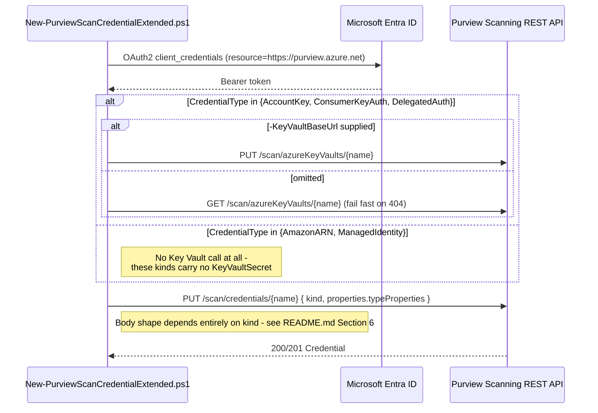

## 1. Problem statement

`scenarios/data-map/scan-credential-key-vault-backed/README.md` §11 named its own scope boundary
plainly: three of Microsoft Purview's eight documented `CredentialType` kinds are scripted there,
and "the other five are documented but structurally different (notably `ManagedIdentity`, which has
no Key Vault reference at all, making it a structurally different build, not a parameter tweak)."
`PROGRESS.md` carried that as an open follow-up. This fragment closes it: all eight kinds are now
creatable through a scripted, idempotent, parameterized path somewhere in this library.

This is not busywork. Two of the five kinds here (`AmazonARN`, `ConsumerKeyAuth`) are the **only**
Purview-native authentication method for an entire source category (Amazon S3, Salesforce) — there
is no managed-identity or service-principal alternative to fall back to. A third
(`ManagedIdentity`) sits **above** `ServicePrincipal` in Microsoft's own documented credential
priority order, meaning the parent scenario's three kinds don't just lack these five as options —
they omit Microsoft's actual second-choice authentication method entirely.

## 2. Design goals

1. **One script, five kinds — same shape as the parent's one script, three kinds.** A `-CredentialType`
   switch dispatches to kind-specific parameter validation and body construction, exactly mirroring
   `New-PurviewScanCredential.ps1`'s structure so a reader of one script recognizes the other
   immediately.
2. **Don't force a Key Vault connection onto kinds that don't have one.** `AmazonARN` and
   `ManagedIdentity` carry no `KeyVaultSecret` reference anywhere in their schema. Requiring
   `-KeyVaultConnectionName` for them the way the parent scenario requires it universally would be
   asking for state the credential object never uses — the script instead **rejects** Key
   Vault-related parameters for those two kinds rather than silently ignoring them.
3. **Treat `ConsumerKeyAuth`'s two independent secret references as two, not one.** A naive port of
   the parent script's single-`KeyVaultSecret` assumption would either drop the second reference or
   conflate the two. This fragment's parameter surface (`-SecretName` for the password,
   `-ConsumerSecretName` for the consumer secret, independently versionable) keeps them distinct
   because Microsoft's schema keeps them distinct.
4. **Disclose preview status where it exists, and a documentation quirk where it doesn't clarify
   itself.** `ManagedIdentity` is labeled preview on the product page but not on the REST reference;
   `RoleARNCredential`'s own description overstates its schema. Both are stated plainly rather than
   smoothed over — `AGENTS.md` §4.
5. **Do not build a consuming scan scenario for any of these five kinds.** That would be five new
   fragments (Amazon S3, Salesforce, Fabric, Power BI, plus a UAMI variant of an existing Azure SQL
   scenario), each with its own source-side prerequisites this fragment's grounding pass did not
   verify to that depth. This fragment's job is "make the credential object creatable and
   verifiable"; §7 lists the natural next fragments explicitly rather than silently implying they
   don't matter.

## 3. Why Key Vault involvement is kind-conditional, not universal

The parent scenario's script always takes a `-KeyVaultConnectionName`. This fragment's script
branches on `-CredentialType` before touching that parameter at all:

| Kind | Key Vault connection required? | Reason |
|---|---|---|
| `AccountKey` | Yes | `typeProperties.accountKey` is a `KeyVaultSecret` |
| `ConsumerKeyAuth` | Yes (references it twice, independently) | `consumerSecret` and `password` are each a `KeyVaultSecret` |
| `DelegatedAuth` | Yes | `typeProperties.password` is a `KeyVaultSecret` |
| `AmazonARN` | **No — rejected if supplied** | `typeProperties` is `{ roleARN: string }` only |
| `ManagedIdentity` | **No — rejected if supplied** | `typeProperties` is three plain strings only |

Silently ignoring a `-KeyVaultConnectionName` passed for `AmazonARN`/`ManagedIdentity` would let an
operator believe it did something. Throwing tells them immediately that the parameter doesn't apply
to this kind — the same "fail fast on a mismatch between intent and object model" instinct the
parent scenario applied to a dangling Key Vault reference (its own goal 2).

## 4. The `AmazonARN` credential's missing half

Microsoft's Amazon S3 connector walkthrough describes creating a Role ARN credential as step 4 of a
larger sequence: Purview's "New credential" pane, when you select **Role ARN**, **displays** a
Microsoft account ID and an external ID, which you then paste into the **AWS** side (a new IAM
role's trust policy) before the role can be created at all. Only once that AWS role exists does its
Role ARN go back into Purview as this credential's one field.

That means a fully scripted Amazon S3 onboarding needs the Microsoft account ID and external ID
*before* the AWS role can be created, and this fragment's grounding pass found no REST endpoint that
returns them — they appear to be generated per-account (not per-credential) and surfaced only in the
portal pane. Two honest choices were available: guess that they're derivable from the tenant/account
ID Purview is already configured with (unconfirmed, and getting it wrong would produce an AWS trust
policy that silently never grants access), or state plainly that at least one portal visit is
required upstream of this script for `AmazonARN` specifically. This fragment takes the second
choice — README.md §3/§11 — consistent with `AGENTS.md` §4 rather than inventing a derivation.

## 5. Object model and REST call sequence

Identical token-acquisition and `Invoke-PurviewPut`/`Get-PurviewObjectOrNull` helper functions to the
parent script, copied rather than shared via a module — this repo has no shared-module convention
across scenario folders, and each scenario's `deploy/` is meant to be a self-contained, copy-paste
unit for a buyer who takes only one folder.

## 6. Key decisions

| Decision | Choice | Rationale |
|---|---|---|
| One script vs. five | One script, `-CredentialType`-dispatched | Matches the parent scenario's own precedent; five near-identical scripts would multiply maintenance for no reader benefit |
| Key Vault parameters | Kind-conditional, rejected (not ignored) when inapplicable | §3 |
| `ConsumerKeyAuth`'s two secrets | Two independent parameter pairs (`-SecretName`/`-SecretVersion` for password, `-ConsumerSecretName`/`-ConsumerSecretVersion` for consumer secret) | Mirrors the schema; a single shared parameter would force both secrets into the same name, which Salesforce's own model doesn't require |
| `AmazonARN`'s missing account ID/external ID | Documented as a disclosed gap, not derived | §4 |
| `ManagedIdentity` preview status | Surfaced in README §3/§10/§11 and the script's own `.NOTES`/`Write-Warning` at run time | A buyer should see this before deploying, not only in a document they may not open |
| Deletion | Reuse the parent's `Remove-PurviewScanCredential.ps1` unmodified | It is already kind-agnostic (deletes by name, never inspects `typeProperties`) — writing a second delete script would duplicate working code for no reason |
| Validation severity | Same `[WARN]`-not-`[FAIL]` pattern for the two discriminator literals; new `[INFO]`-only preview reminder for `ManagedIdentity` | Consistency with the parent scenario's established severity model |

## 7. Non-goals

- **Creating the Azure Key Vault, secret, AWS IAM role, or user-assigned managed identity.** All
  four are out-of-band prerequisites, the same posture the parent scenario takes toward the Key
  Vault and its secret.
- **A consuming scan scenario for any of these five kinds.** Explicitly deferred, tracked as
  follow-ups in `PROGRESS.md`:
  - Amazon S3 scan scenario (would consume `AmazonARN`)
  - Salesforce scan scenario (would consume `ConsumerKeyAuth`)
  - Microsoft Fabric / Power BI scan scenario (would consume `DelegatedAuth`)
  - A `ManagedIdentity`(UAMI) variant of `scan-azure-sql-and-classify`,
    `scan-azure-sql-managed-instance-and-classify`, or `scan-azure-synapse-and-classify`, swapping
    their current SAMI-based credential-less path for an explicit UAMI credential — the most
    directly actionable of the four, since the target scan scenarios already exist
  - `AccountKey`-based scan scenarios for Azure Blob Storage / ADLS Gen1 / ADLS Gen2 / Azure Files /
    Azure Cosmos DB — none of these source types has a scan scenario in this library yet at all,
    with any credential kind
- **Confirming the `AmazonARN` account ID/external ID's source.** §4 — tracked as a `PROGRESS.md`
  VERIFY rather than resolved by inference.
- **Re-litigating the parent scenario's open VERIFYs.** The two `KeyVaultSecret` discriminator
  literals, omitted-`secretVersion` semantics, and the credential re-point detection gap are
  inherited, not rediscovered — see parent `design.md` §5 and `reviews.md`.
