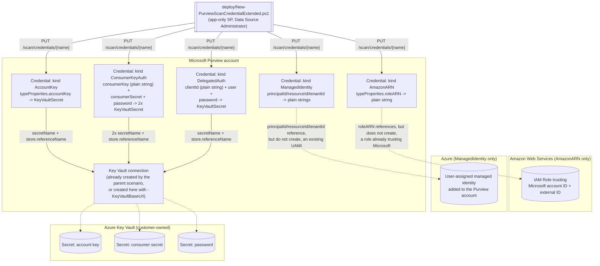

## 1. Scenario summary

Extends [`data-map/scan-credential-key-vault-backed`](/scenarios/data-map/scan-credential-key-vault-backed/) to the **five** Microsoft Purview
Scanning-data-plane `CredentialType` kinds that scenario deliberately left out —
`AccountKey`, `AmazonARN`, `ConsumerKeyAuth`, `DelegatedAuth`, and `ManagedIdentity`
(user-assigned) — completing coverage of all **eight** documented kinds
[[1]](#references). Each is a genuinely different request-body shape, not a parameter tweak: three
carry no `KeyVaultSecret` reference at all, and `ConsumerKeyAuth` carries **two** independent ones.

**Who it's for:** a data governance team onboarding source types the parent scenario's three kinds
(`SqlAuth`, `BasicAuth`, `ServicePrincipal`) don't reach — Azure Storage/Cosmos DB (`AccountKey`),
Amazon S3 (`AmazonARN`), Salesforce (`ConsumerKeyAuth`), Microsoft Fabric/Power BI cross-tenant
(`DelegatedAuth`), or any of the six source types that support a **user-assigned managed identity**
(`ManagedIdentity`) as an alternative to Purview's own system-assigned identity.

## 2. Business/regulatory driver

Identical to the parent scenario's §2 — reproducibility, separation of duties, and routine
rotation for a **credential-authenticated** scan. This fragment exists so that driver isn't limited
to the three kinds the SQL-family scenarios in this repo happen to consume. Two of the five kinds
here matter enough to call out specifically:

- **`ManagedIdentity` (user-assigned) is not a fallback tier — it's a *preferred* one.**
  Microsoft's own credential priority order is **(1) Purview system-assigned managed identity →
  (2) user-assigned managed identity → (3) service principal → (4) account key/SQL
  authentication/other** [[9]](#references). The parent scenario's `ServicePrincipal`/`SqlAuth`/
  `BasicAuth` kinds serve tiers 3–4 — "the cases where the higher tiers are genuinely unavailable,"
  by its own README §11. `ManagedIdentity` fills the gap directly below system-assigned identity:
  wherever a source supports it, it is Microsoft's **second-choice** authentication method, not a
  last resort — see §11 for the licensing/preview caveat that tempers this.
- **`AccountKey`, `AmazonARN`, and `ConsumerKeyAuth` are the only paths for whole source
  categories.** Amazon S3 and Salesforce have **no** managed-identity or service-principal option
  in Microsoft's own documentation — `AmazonARN`/`ConsumerKeyAuth` are those sources' *only*
  Purview-native authentication method [[6]](#references)[[7]](#references). Without this
  fragment, onboarding either source through this library meant a portal-only credential step with
  no scripted, diffable artifact — the same gap the parent scenario closed for SQL-family sources.

## 3. Prerequisites

Full licensing detail: `docs/licensing-matrix.md`. RBAC: `docs/rbac-model.md` §5. This scenario's
prerequisites are **identical** to the parent scenario's (§3) — same collection roles, same Key
Vault access model, same automation identity — with two kind-specific additions:

| Requirement | Minimum | Notes |
|---|---|---|
| Everything in `scan-credential-key-vault-backed/README.md` §3 | — | Data Source Administrator to create, Data Reader to validate, Purview MSI Get+List (or Key Vault Secrets User) on the vault, a dedicated scan-credential Key Vault. Unchanged by this fragment |
| (`AmazonARN` only) An AWS IAM role trusting Microsoft's account | Role created in the AWS console, trusting the **Microsoft account ID** and **external ID** Purview's portal displays when you start creating a Role ARN credential | These two values are **not** properties of the credential object (§6) — Microsoft's own worked walkthrough shows them appearing only in the **portal's** "New credential" pane, and this build found no REST endpoint that returns them [[6]](#references). **VERIFY (pilot tenant):** confirm no such endpoint exists before assuming a fully portal-free Role ARN onboarding is possible — see §11 |
| (`ManagedIdentity` only) A user-assigned managed identity already added to the Purview account | Created via the Purview account's **Managed identities** blade in the Azure portal (a separate Azure-side step, not a Scanning-API call) | [[8]](#references). This fragment's script references that UAMI's `principalId`/`resourceId`/`tenantId` by value — it does not create the UAMI itself, the same "credential is downstream of an out-of-band identity" pattern the parent scenario established for the Key Vault and its secret |
| (`ManagedIdentity` only) Feature stage | **Preview** | Microsoft's own documentation labels "User-assigned managed identity" as "(preview)" as of this writing [[8]](#references) — see §11 before committing to it in a production design |

> Verify current entitlement names against `docs/licensing-matrix.md` (dated 2026-09-02) before a
> sales commitment.

## 4. Architecture



Three of the five arrows into `KVConn` carry a secret reference exactly like the parent scenario's
two arrows do — same trust boundary, same script that never touches secret material. The two
arrows into `Role` and `UAMI` are dotted because those objects are **not** created, or even
provisioned access for, by this fragment; the credential merely names them. Full rationale:
`design.md` §3.

## 5. Step-by-step implementation

### Portal path (for a first manual walkthrough / to validate intent before scripting)

Steps 1–2 (store the secret, grant Purview vault access) are the parent scenario's §5 steps 1–2 and
apply unchanged to `AccountKey`, `ConsumerKeyAuth`, and `DelegatedAuth` (skip them entirely for
`AmazonARN` and `ManagedIdentity` — neither uses a Key Vault secret). Then, on the Purview
**Credentials** page → **+ New** [[6]](#references):

| Kind | Authentication method (portal) | Fields |
|---|---|---|
| `AccountKey` | **Account Key** | Key Vault connection, secret name |
| `AmazonARN` | **Role ARN** | Role ARN (paste after creating the AWS-side role — see §3) |
| `ConsumerKeyAuth` | **Consumer Key** | User name, consumer key (plain text field), Key Vault connection + secret name for the consumer secret, Key Vault connection + secret name for the password |
| `DelegatedAuth` | **Delegated auth** | Client ID, user name, Key Vault connection + secret name for the password |
| `ManagedIdentity` | **Managed identity** | Select from the **User assigned managed identities** dropdown (populated from the Purview account's own **Managed identities** blade — this build found no free-text principal/resource/tenant ID entry in the portal path) [[8]](#references) |

> The portal's `ManagedIdentity` path is a dropdown selection, not a form of raw IDs — but the REST
> body it produces underneath is the same `principalId`/`resourceId`/`tenantId` shape §6 documents,
> confirmed by the Scanning-data-plane reference [[1]](#references) independent of the portal UI.

### Script path

```powershell
# AccountKey - Azure Storage / ADLS Gen1+2 / Azure Files / Cosmos DB account key.
./deploy/New-PurviewScanCredentialExtended.ps1 `
    -PurviewAccountName 'contoso-purview' -TenantId $TenantId -AppId $AppId -ClientSecret $ClientSecret `
    -CredentialName 'adls-account-key' -CredentialType AccountKey `
    -KeyVaultConnectionName 'kv-contoso-purview' -SecretName 'adls-storage-account-key' -WhatIf

# AmazonARN - Amazon S3. No Key Vault connection at all; the role must already trust Microsoft
# (README.md Section 3 - the Microsoft account ID / external ID come from the PORTAL, not this script).
./deploy/New-PurviewScanCredentialExtended.ps1 `
    -PurviewAccountName 'contoso-purview' -TenantId $TenantId -AppId $AppId -ClientSecret $ClientSecret `
    -CredentialName 's3-role-arn' -CredentialType AmazonARN `
    -RoleArn 'arn:aws:iam::181328463391:role/PurviewS3ScanRole'

# ConsumerKeyAuth - Salesforce. Two independent Key Vault secrets; ConsumerKey itself is NOT a
# secret reference (Microsoft's schema types it as a plain string - see Section 6).
./deploy/New-PurviewScanCredentialExtended.ps1 `
    -PurviewAccountName 'contoso-purview' -TenantId $TenantId -AppId $AppId -ClientSecret $ClientSecret `
    -CredentialName 'salesforce-consumer-key' -CredentialType ConsumerKeyAuth `
    -KeyVaultConnectionName 'kv-contoso-purview' -UserName 'purview-integration@contoso.com' `
    -ConsumerKey '3MVG9...' -ConsumerSecretName 'salesforce-consumer-secret' -SecretName 'salesforce-password'

# DelegatedAuth - Microsoft Fabric / Power BI (cross-tenant, or same-tenant over a self-hosted IR).
./deploy/New-PurviewScanCredentialExtended.ps1 `
    -PurviewAccountName 'contoso-purview' -TenantId $TenantId -AppId $AppId -ClientSecret $ClientSecret `
    -CredentialName 'fabric-delegated-auth' -CredentialType DelegatedAuth `
    -KeyVaultConnectionName 'kv-contoso-purview' -ClientId $FabricAppRegistrationAppId `
    -UserName 'fabric-admin@contoso.com' -SecretName 'fabric-admin-password'

# ManagedIdentity - a user-assigned managed identity already added to the Purview account and
# supported by the target source (Azure Data Lake Gen1/Gen2, Azure SQL Database, Azure SQL Managed
# Instance, Azure Synapse dedicated SQL pools, Azure Blob Storage - Section 6). PREVIEW - Section 11.
./deploy/New-PurviewScanCredentialExtended.ps1 `
    -PurviewAccountName 'contoso-purview' -TenantId $TenantId -AppId $AppId -ClientSecret $ClientSecret `
    -CredentialName 'adls-uami' -CredentialType ManagedIdentity `
    -PrincipalId $UamiPrincipalId -ResourceId $UamiResourceId

# Verify any of the above (kind-aware).
./validate/Test-PurviewScanCredentialExtended.ps1 `
    -PurviewAccountName 'contoso-purview' -TenantId $TenantId -AppId $AppId -ClientSecret $ClientSecret `
    -CredentialName 'adls-account-key' -ExpectedCredentialType AccountKey -CheckKeyVaultSecret
```

Omitting `-KeyVaultBaseUrl` on a kind that needs a Key Vault connection (`AccountKey`,
`ConsumerKeyAuth`, `DelegatedAuth`) makes the script **require** that `-KeyVaultConnectionName`
already exists, exactly like the parent scenario — most deployments reuse the connection the parent
scenario already created rather than making a new one per credential kind.

## 6. Configuration reference

### Credential body — kind → `typeProperties` shape

All five confirmed directly against the Scanning-data-plane **Credential - Create Or Replace**
reference [[1]](#references), the same source the parent scenario used for its three kinds, and
cross-checked against [`data-map/scan-credential-inventory-report`](/scenarios/data-map/scan-credential-inventory-report/)'s independently-built
per-kind fingerprint table (§6 there), which reached the identical shapes from the read side.

| `kind` | `properties` type | `typeProperties` type | Fields |
|---|---|---|---|
| `AccountKey` | `AccountKeyCredentialProperties` | `KeyVaultSecretAccountKeyCredentialTypeProperties` | `{ accountKey: KeyVaultSecret }` |
| `AmazonARN` | `RoleARNCredentialProperties` | `RoleARNCredentialTypeProperties` | `{ roleARN: string }` — **no** `KeyVaultSecret` anywhere in this kind |
| `ConsumerKeyAuth` | `ConsumerKeyCredentialProperties` | `KeyVaultSecretConsumerKeyCredentialTypeProperties` | `{ user: string, consumerKey: string, consumerSecret: KeyVaultSecret, password: KeyVaultSecret }` — **two** independent secret references; `consumerKey` itself is a plain string, not a secret reference |
| `DelegatedAuth` | `DelegatedAuthCredentialProperties` | `KeyVaultSecretDelegatedAuthCredentialTypeProperties` | `{ clientId: string, user: string, password: KeyVaultSecret }` |
| `ManagedIdentity` | `ManagedIdentityAzureKeyVaultCredentialProperties` | `KeyVaultSecretManagedIdentityAzureKeyVaultCredentialTypeProperties` | `{ principalId: string, resourceId: string, tenantId: string }` — **no** `KeyVaultSecret` anywhere in this kind, the same structural absence as `AmazonARN` |

The `KeyVaultSecret`/`Store` sub-object and its two open-VERIFY discriminator literals (`type`,
`store.type`) are identical to the parent scenario — this fragment's script reuses the same
`-SecretReferenceType`/`-SecretStoreReferenceType` parameters and defaults. See parent `README.md`
§6/§11 and `design.md` §5; not re-derived here.

### Consuming scan kinds / source types (Microsoft's own documented pairing)

| Kind | Confirmed for | Source |
|---|---|---|
| `AccountKey` | Azure Blob Storage, ADLS Gen1, ADLS Gen2, Azure Files, Azure Cosmos DB (SQL API) | [[2]](#references)[[3]](#references)[[4]](#references) |
| `AmazonARN` | Amazon S3 (the **only** documented auth method for this source — no managed identity or service principal option exists for S3) | [[6]](#references) |
| `ConsumerKeyAuth` | Salesforce (the **only** documented auth method for this source) | [[7]](#references) |
| `DelegatedAuth` | Microsoft Fabric (same-tenant and cross-tenant), Power BI tenant (same-tenant and cross-tenant) | [[10]](#references)[[11]](#references) |
| `ManagedIdentity` | Azure Data Lake Gen1, Azure Data Lake Gen2, Azure SQL Database, Azure SQL Managed Instance, Azure Synapse dedicated SQL pools, Azure Blob Storage | [[8]](#references) |

No scenario in this library scans Amazon S3, Salesforce, Microsoft Fabric, or Power BI yet — those
are natural future fragments this one hands a working credential to (§11, `design.md` §7). The
`ManagedIdentity` row **does** overlap this repo's existing scan scenarios
(`scan-azure-sql-and-classify`, `scan-azure-sql-managed-instance-and-classify`,
`scan-azure-synapse-and-classify`) — wiring a UAMI credential into one of those as an alternative to
SAMI is the most immediately actionable follow-up from this fragment; not built here (`design.md` §7).

### Deploy script parameters (selected)

| Parameter | Applies to | Notes |
|---|---|---|
| `-CredentialType` | All | `AccountKey` \| `AmazonARN` \| `ConsumerKeyAuth` \| `DelegatedAuth` \| `ManagedIdentity` |
| `-KeyVaultConnectionName` / `-KeyVaultBaseUrl` | `AccountKey`, `ConsumerKeyAuth`, `DelegatedAuth` | Same semantics as the parent scenario; **rejected** (script throws) if supplied for `AmazonARN`/`ManagedIdentity`, which reference no Key Vault connection at all |
| `-SecretName` / `-SecretVersion` | `AccountKey` (the account key), `DelegatedAuth` (the password), `ConsumerKeyAuth` (the password only — see `-ConsumerSecretName`) | |
| `-ConsumerSecretName` / `-ConsumerSecretVersion` | `ConsumerKeyAuth` only | The **second**, independent secret reference (`consumerSecret`) |
| `-UserName` | `ConsumerKeyAuth`, `DelegatedAuth` | |
| `-ConsumerKey` | `ConsumerKeyAuth` only | Plain string, written verbatim into the credential's metadata — not a Key Vault reference (§6) |
| `-ClientId` | `DelegatedAuth` only | The scanning app registration's Application (client) ID — see the Microsoft Fabric/Power BI worked examples [[10]](#references)[[11]](#references) |
| `-RoleArn` | `AmazonARN` only | e.g. `arn:aws:iam::<account>:role/<role-name>` |
| `-PrincipalId` / `-ResourceId` / `-ManagedIdentityTenantId` | `ManagedIdentity` only | Identify an **existing** UAMI already added to the Purview account (§3); `-ManagedIdentityTenantId` defaults to `-TenantId` |
| `-SecretReferenceType` / `-SecretStoreReferenceType` | Any secret-bearing kind | Same VERIFY-driven parameters as the parent scenario, same defaults |
| `-ApiVersion` | All | Defaults to `2023-09-01`, matching the parent scenario |

Worked request bodies for all five kinds: `deploy/policy/scan-credential-extended-definitions.json`.

## 7. Validation / how to prove it works

`validate/Test-PurviewScanCredentialExtended.ps1` mirrors the parent scenario's validate script —
read-only, idempotent, `[PASS]`/`[WARN]`/`[FAIL]` per check, non-zero exit on any `FAIL` — extended
with a per-kind completeness table instead of the parent's single three-kind `switch`:

1. Credential exists; kind matches `-ExpectedCredentialType` if supplied.
2. Kind-specific field completeness (the right-hand column of §6's table, checked field by field).
3. For every `KeyVaultSecret`-shaped field the kind carries (one for `AccountKey`/`DelegatedAuth`,
   **two** for `ConsumerKeyAuth`, zero for `AmazonARN`/`ManagedIdentity`): the two discriminator
   literals are compared the same `[WARN]`-only way as the parent scenario.
4. `-CheckKeyVaultSecret`: resolves every secret the kind carries (both, for `ConsumerKeyAuth`) via
   `Get-AzKeyVaultSecret` without `-AsPlainText`. The Azure Key Vault name is derived the same
   authoritative way as the parent scenario's check 1 — a `GET` against the Key Vault connection
   object, then reading the real vault name out of its `baseUrl` — never assumed to equal the
   Purview connection name.
5. `AmazonARN`-specific: warns (never fails — this is a format sanity check, not an AWS-side call)
   if `-RoleArn`'s value doesn't match the `arn:aws:iam::\d{12}:role/.+` shape Microsoft's own worked
   example uses [[6]](#references).
6. `ManagedIdentity`-specific: prints an `[INFO]` reminder that this is a **preview** capability
   (§11) and that nothing in this script can confirm the referenced UAMI is actually attached to the
   Purview account — only that the credential object carries those three ID strings.

**What no script here can prove**, beyond the parent scenario's own §7 disclaimer: for `AmazonARN`,
that the AWS-side IAM role trust policy is configured correctly (that is an AWS-console fact, not a
Purview one); for `ManagedIdentity`, that the referenced UAMI is attached to the Purview account and
granted access at the target source. The only end-to-end proof for any of these five kinds remains a
scan run reaching `Succeeded`.

## 8. Operations & tuning

All of the parent scenario's §8 guidance applies unchanged — rotation tradeoffs for the
secret-bearing kinds, the credential re-point risk, and the estate-wide drift report in
[`data-map/scan-credential-inventory-report`](/scenarios/data-map/scan-credential-inventory-report/), which **already** fingerprints all eight
kinds including these five — this fragment's credentials are covered by that report with no changes
needed there.

**`AmazonARN`/`ManagedIdentity` have a strictly smaller detection surface than every other kind in
this library, and that is worth stating plainly rather than folding into a general note.** The
parent scenario's compensating control for a silent credential re-point is *two* independent
signals: the estate-wide inventory report, **and** Key Vault `AuditEvent` diagnostic logs (which
record which identity read which secret, catching a re-point at the *vault* side even when Purview's
own audit log stays silent — parent `README.md` §11). `AmazonARN` and `ManagedIdentity` credentials
have no Key Vault secret at all, so that second signal **does not exist** for them — the estate-wide
inventory report is the *only* detective control, full stop. Run it on at least a daily cadence for
any tenant relying on either kind, not the weekly-or-pipeline cadence the parent scenario treats as
sufficient when a Key Vault-side backstop is also in play.

**A short runbook for the two kinds that don't fit the parent scenario's Key Vault-centric triage:**

| Kind | First check | If that passes but the scan still fails |
|---|---|---|
| `AmazonARN` | `validate/... -ExpectedCredentialType AmazonARN` — confirms the ARN's string shape only | The failure is entirely on the AWS side: the IAM role's trust policy, its `AmazonS3ReadOnlyAccess`-equivalent permissions, a bucket policy, or an SCP policy blocking the connection [[6]](#references). This scenario's validate script cannot reach into AWS at all — escalate straight to an AWS console check |
| `ManagedIdentity` | `validate/... -ExpectedCredentialType ManagedIdentity` — confirms the three ID strings are present, non-empty, and internally consistent | Confirm the referenced UAMI is still listed under the Purview account's **Managed identities** blade (it can be deleted there independently of this credential object, per §9), then confirm it still holds the access grant the source-specific registration steps describe (§6 references). Also re-confirm current Preview status — a preview-stage capability changing behavior without a corresponding REST reference update is a real possibility, not a hypothetical one (§11) |

**Kind-specific operational notes:**

| Kind | What changes operationally vs. the parent's three kinds |
|---|---|
| `AccountKey` | Rotating the storage account key is an **Azure Storage/Cosmos DB** operation, not a Key Vault one — the new key must be written into the *same* secret name/version pattern this scenario's credential already references |
| `AmazonARN` | No secret to rotate. The only "credential rotation" concept is replacing the Role ARN itself (e.g. after an AWS-side role rename) — re-run this scenario's deploy script with the new `-RoleArn` |
| `ConsumerKeyAuth` | **Two** secrets to track, not one — a Salesforce connected-app secret rotation and a Salesforce user password rotation are independent events, each requiring its own Key Vault write (and, if versions are pinned, its own re-deploy) |
| `DelegatedAuth` | The Fabric/Power BI admin account's password expiring is a common, easy-to-miss failure mode for this kind specifically — Microsoft's own troubleshooting guidance for Fabric/Power BI scans distinguishes an "Access - Failed" test-connection result (user authentication) from an "Assets - Failed" result (Purview-Fabric authorization), which maps directly to "check this credential" vs. "check the Purview managed identity's Fabric security-group membership" [[10]](#references) |
| `ManagedIdentity` | No secret at all — monitor instead via the estate-wide inventory report (drift on `PrincipalId`/`ResourceId`/`TenantId`) and via the **preview** status itself: re-check Microsoft's documentation periodically for GA changes that could alter behavior (§11) |

## 9. Rollback / decommission

See `rollback.md`. Summary: this fragment adds **no new script** for deletion — the parent
scenario's `deploy/Remove-PurviewScanCredential.ps1` is a plain `DELETE /scan/credentials/{name}`
call that is already fully kind-agnostic (it never inspects `typeProperties` to delete), so it
deletes credentials created by this scenario exactly as it deletes the parent's three kinds. One
disclosed nuance: its `-RemoveKeyVaultConnection` safety check (which lists *other* credentials
still referencing a connection before allowing the connection's own deletion) only ever finds
`AccountKey`/`ConsumerKeyAuth`/`DelegatedAuth` credentials that way, by construction —
`AmazonARN`/`ManagedIdentity` credentials never reference a Key Vault connection, so they are
correctly invisible to that check, not missed by it.

## 10. Cost & licensing notes

Identical to the parent scenario's §10 — no new metered Purview consumption, Key Vault
per-transaction costs apply only to the three secret-bearing kinds here, no new per-user M365
licensing. Two additions:

- **The `ManagedIdentity` kind's preview status (§11) means Microsoft's standard preview terms** (no
  SLA, subject to change) apply to that kind specifically — a buyer building a business case around
  it should treat it as pre-GA, not as a bounded, stable cost line the way the parent scenario's
  three GA kinds can be treated.
- **`AmazonARN` and `ManagedIdentity` each pull in a coordination cost the parent scenario's three
  kinds never did**, worth naming for the same reason the parent scenario named the Key Vault
  Secrets Officer coordination cost (its own §10/`design.md` §3): `AmazonARN` requires an **AWS IAM
  role**, which in most enterprises is owned by a cloud infrastructure or AWS platform team entirely
  outside the Purview governance team's normal Azure-only scope — a genuinely cross-cloud dependency,
  not just a cross-team one. `ManagedIdentity` requires an Azure identity administrator to create and
  assign the user-assigned managed identity via the Purview account's own **Managed identities**
  blade — an Azure-portal action outside the Scanning REST API this scenario otherwise stays within.
  Neither is expensive, but both are process dependencies a CISO's rollout timeline should account
  for explicitly rather than discover during onboarding.

## 11. Known limitations & gotchas

- **`ManagedIdentity` is a Microsoft-labeled Preview capability.** Microsoft's own
  "Credentials for source authentication" reference lists "User-assigned managed identity
  (preview)" explicitly [[8]](#references), current as of this fragment's grounding pass. The
  Scanning-data-plane REST reference documents the `ManagedIdentity` kind and its `typeProperties`
  shape without a preview annotation of its own [[1]](#references) — the preview label lives on the
  *product* page, not the API reference, so this fragment treats the capability as preview-status
  overall and flags it rather than picking whichever source is silent. **VERIFY (pilot tenant):**
  confirm current GA/preview status before a production commitment; re-check Microsoft's
  documentation periodically, since preview features can reach GA (or be retired) without a
  corresponding REST reference change.
- **The `AmazonARN` kind's Microsoft account ID / external ID have no confirmed REST source.**
  Microsoft's Amazon S3 connector walkthrough shows these two values appearing in the **portal's**
  "New credential" pane before the AWS-side role is created, but neither this scenario's grounding
  pass nor the Scanning-data-plane reference identifies a REST endpoint that returns them
  [[1]](#references)[[6]](#references) — they do not appear anywhere in `RoleARNCredential`'s
  documented shape (only `roleARN` does). **VERIFY (pilot tenant or a future Microsoft Learn pass):**
  whether any documented endpoint exposes these two values, which would be required to fully
  script Role ARN onboarding end to end (today, at least one portal visit is required to read them,
  even though creating the credential *object* itself is fully scripted by this fragment).
- **`RoleARNCredential`'s own description overstates its `typeProperties`.** Microsoft's REST
  reference describes the `RoleARNCredential` **object** as "Credential type that uses Account ID,
  External ID and Role ARN for authentication," but `RoleARNCredentialTypeProperties` — the actual
  field list — contains only `roleARN` [[1]](#references). This is consistent with the previous
  bullet (account ID/external ID are Microsoft-generated values used to configure the *AWS* side of
  the trust, not customer-supplied fields Purview stores) rather than a contradiction, but a reader
  diffing the description against the schema could reasonably expect two more fields. Noted so this
  fragment isn't mistaken for having missed them.
- **A second Microsoft documentation copy-paste artifact, noted for the same reason the parent
  scenario noted `KeyVaultSecretServicePrinipalCredentialTypeProperties`'s missing "c."**
  `KeyVaultSecretDelegatedAuthCredentialTypeProperties.clientId`'s documented description reads
  "Credential type that uses Account ID, External ID and Role ARN for authentication" — verbatim
  `RoleARNCredential`'s own description, evidently copy-pasted and not updated
  [[1]](#references). The field itself is unambiguous from its name, type, and the Fabric/Power BI
  worked examples that populate it with an app registration's Client ID [[10]](#references)
  [[11]](#references); only the reference table's prose description is wrong.
- **`ConsumerKeyAuth`'s `consumerKey` is stored as plain text, not a secret reference.** Confirmed
  directly from the schema — `typeProperties.consumerKey` is typed `string`, unlike `consumerSecret`
  and `password`, which are both `KeyVaultSecret` [[1]](#references). This matches Salesforce's own
  OAuth model, where a Connected App's Consumer Key (client ID) is not treated as sensitive the way
  its Consumer Secret is — but it does mean this scenario's credential object itself carries that
  value in the clear inside Purview's metadata store, not inside Key Vault. Not a defect in this
  fragment; a property of the kind as Microsoft defined it.
- **Everything the parent scenario's own §11 discloses still applies, unmodified, to the
  secret-bearing kinds here**: the two `KeyVaultSecret` discriminator-literal VERIFYs, the
  undocumented `secretVersion`-omitted behavior, the absence of a "test credential" API, the absence
  of a credential-to-scan reverse lookup, the vault-wide (never per-secret) blast radius of the Key
  Vault grant, create-or-replace's silent-re-point risk with no enumerated Purview audit-event
  category for credentials, and create-or-replace's "a re-run without an optional parameter unpins
  it" behavior. Not re-derived here — see parent `README.md` §11 for the full text and citations.
- **No consuming scan scenario exists yet in this library** for `AccountKey`'s four source types,
  `AmazonARN`, `ConsumerKeyAuth`, or `DelegatedAuth`. This fragment produces a correctly-shaped,
  validated credential object with nothing in this repo to hand it to yet — see §6 and `design.md`
  §7 for the natural future pairings.

## 12. References

1. [Credential - Create Or Replace (Purview Scanning data plane, 2023-09-01)](https://learn.microsoft.com/rest/api/purview/scanningdataplane/credential/create-or-replace) — all eight `CredentialType` kinds, every `typeProperties` definition used in §6's table, the `RoleARNCredential`/`DelegatedAuthCredentialTypeProperties` description text quoted in §11, `credentialName` pattern.
2. [Connect to Azure Data Lake Storage in Microsoft Purview](https://learn.microsoft.com/purview/register-scan-adls-gen2#scan) — the Account Key authentication path for ADLS Gen2.
3. [Connect to and manage Azure Files in Microsoft Purview](https://learn.microsoft.com/purview/register-scan-azure-files-storage-source#register) — Account Key as the only registration auth method for Azure Files.
4. [Connect to Azure Cosmos DB for SQL API in Microsoft Purview](https://learn.microsoft.com/purview/register-scan-azure-cosmos-database#scan) — Account Key as the only scan auth method for Cosmos DB.
5. [Connect to Azure Blob storage in Microsoft Purview](https://learn.microsoft.com/purview/register-scan-azure-blob-storage-source#scan) — Account Key alongside managed identity/service principal for Blob Storage.
6. [Amazon S3 Multicloud Scanning Connector for Microsoft Purview](https://learn.microsoft.com/purview/register-scan-amazon-s3) — Role ARN as the only auth method for S3; the portal-displayed Microsoft account ID/external ID (§3, §11); the AWS IAM role trust setup.
7. [Credentials for source authentication in Microsoft Purview Data Map](https://learn.microsoft.com/purview/data-map-data-scan-credentials) — the enumerated credential-type list including Consumer Key ("For Salesforce data sources"), Account Key, Role ARN, and User-assigned managed identity (preview); the UAMI creation/deletion procedure and its six supported source types (§6, §11).
8. [Data governance best practices for security — Credential management](https://learn.microsoft.com/purview/data-gov-classic-security-best-practices) — Microsoft's explicit credential priority order (Purview managed identity → user-assigned managed identity → service principal → account key/SQL auth/other), cited in §2.
9. [Connect to your Microsoft Fabric tenant in the same tenant as Microsoft Purview](https://learn.microsoft.com/purview/register-scan-fabric-tenant#authentication-to-scan) — the Delegated Auth credential fields (Client ID, User name, Password) worked example and the Access-vs-Assets test-connection failure distinction (§8).
10. [Connect to and manage a Power BI tenant in Microsoft Purview (cross-tenant)](https://learn.microsoft.com/purview/register-scan-power-bi-tenant-cross-tenant#scan-cross-tenant-power-bi) — the cross-tenant Delegated Auth worked example.
11. [Get-AzKeyVaultSecret](https://learn.microsoft.com/powershell/module/az.keyvault/get-azkeyvaultsecret) — metadata-only read used by `-CheckKeyVaultSecret`, same as the parent scenario.

Related scenarios in this library:
- [`data-map/scan-credential-key-vault-backed`](/scenarios/data-map/scan-credential-key-vault-backed/) — the parent scenario (`SqlAuth`,
  `BasicAuth`, `ServicePrincipal`); this fragment shares its deletion script, Key Vault connection
  model, and open VERIFYs.
- [`data-map/scan-credential-inventory-report`](/scenarios/data-map/scan-credential-inventory-report/) — already fingerprints all eight
  `CredentialType` kinds, including the five this fragment creates; no change needed there.
- [`data-map/scan-azure-sql-and-classify`](/scenarios/data-map/scan-azure-sql-and-classify/), `scan-azure-sql-managed-instance-and-classify/`,
  `scan-azure-synapse-and-classify/` — the three existing scan scenarios whose source types also
  support a `ManagedIdentity` (UAMI) credential as an alternative to SAMI (§6); not wired together
  here — see `design.md` §7.
- `docs/rbac-model.md` §5 — Data Map collection roles.
- `docs/automation-surface.md` — surface 4 (Purview data-plane REST).
