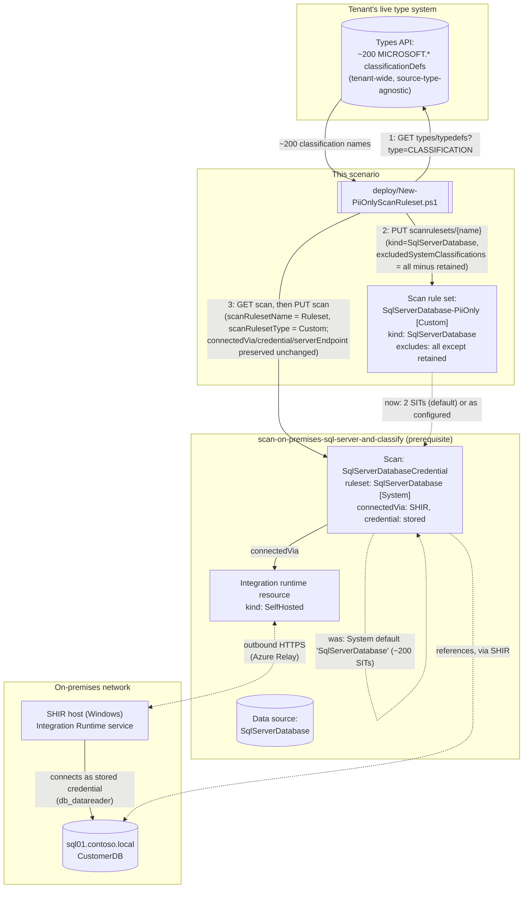

## 1. Problem statement

`scenarios/data-map/scan-on-premises-sql-server-and-classify/` scans an on-premises SQL Server
instance (via a self-hosted integration runtime) against Microsoft's **system default** scan rule
set, inferred by that scenario's own build as `SqlServerDatabase`, roughly 200 built-in sensitive
information types (SITs), but left as an explicit, not-fully-confirmed `VERIFY` in that scenario's
own `README.md` §11 because no worked example was found pairing `scanRulesetName: "SqlServerDatabase"`
with `scanRulesetType: "System"` the way every Azure sibling's own build confirmed for its own source
type. A broad system default is the right choice for a first, exploratory scan of an instance whose
contents aren't yet known. It is the wrong steady-state configuration for a buyer who already knows
their compliance driver is narrow (PCI cardholder data, or a PII-only privacy program), and the base
scenario's own `design.md` §1 makes the stakes of that choice unusually high for this specific source
type: on-premises SQL Server is "disproportionately likely to be where an organization's oldest,
least-documented regulated data lives."

This is the fourth and last of this repo's Data Map PII-only scan rule set scenarios, tracked as a
follow-up in `PROGRESS.md` from the first (`scan-azure-sql-and-classify-pii-ruleset`) and repeated,
with an explicit warning against assuming either prior sibling's pattern, by both the Azure Synapse
Analytics and Azure SQL Managed Instance siblings' own builds. This build applies the proven pattern
to on-premises SQL Server (`kind: SqlServerDatabase`) and, per that repeated instruction, independently
grounds this source type's own name-vs-kind relationship rather than inheriting either prior
conclusion, see Goal 6 and §5.

## 2. Design goals

Goals 1, 2, 4, and 5 below are carried over unchanged from all three sibling PII-ruleset scenarios'
own design (same underlying REST surface, same failure modes). Goal 3 restates the account-wide-object
goal with on-premises-specific evidence. Goal 6 is this scenario's own independent finding, and the
one every prior sibling's own build explicitly instructed this build to make from scratch rather than
assume.

1. **Never hand-type the ~200-entry exclusion list.** Same reasoning as every sibling: the Data Map
 classification-supported-list page has no exact `MICROSOFT.*` identifier strings, only
 human-readable names. This scenario's deploy script calls the Data Map **Types API**
 (`GET.../types/typedefs?type=CLASSIFICATION`) at run time, a tenant-wide, source-type-agnostic
 surface, so no new grounding was needed here beyond what the first sibling already confirmed.
2. **Reconcile, don't reconstruct.** The scan object being modified already exists with a stored
 credential (`SqlServerDatabaseCredential`, the only scan kind for this source type, no
 managed-identity variant exists), a `connectedVia` reference to a self-hosted integration runtime,
 a server endpoint, a database name, and a collection reference. This script's deploy step `GET`s
 the existing scan and copies its properties forward unchanged except the two ruleset fields, so it
 neither disturbs the SHIR/credential configuration the base scenario established nor makes a new,
 uninformed decision about any other scan property.
3. **The ruleset is account-wide, not scan-scoped, design for reuse.** Confirmed via the
 `New-AzPurviewSqlServerDatabaseScanRulesetObject` constructor cmdlet, whose parameter list
 (`-Description`/`-ExcludedSystemClassification`/`-IncludedCustomClassificationRuleName`/`-Type`)
 has no collection- or scan-scoping parameter, the same absence-of-evidence pattern every sibling
 scenario used to establish its own ruleset's account-wide scope. One `SqlServerDatabase-PiiOnly`
 ruleset, created once, can be referenced by every on-premises SQL Server scan in the account that
 wants this same narrower scope.
4. **Fail loudly on an implausible result, rather than silently deploying a near-no-op ruleset.**
 Same guard as every sibling: hard-fail if the discovered system-classification count is smaller
 than the number of classifications the buyer asked to retain.
5. **Detach before delete.** Same as every sibling, no Microsoft documentation found confirms
 whether deleting an in-use scan rule set succeeds, is rejected, or orphans the scan's reference.
 `deploy/Remove-PiiOnlyScanRuleset.ps1` always reverts the scan first.
6. **Independently confirm this source type's own name-vs-kind relationship, do not inherit either
 prior sibling's pattern by assumption.** The Azure SQL Database and Azure SQL Managed Instance
 siblings each have a custom ruleset `kind` identical to their own System default ruleset's NAME
 (`AzureSqlDatabase`, `AzureSqlDatabaseManagedInstance`); the Azure Synapse Analytics sibling does
 **not** (`AzureSynapseSQL` name vs. `AzureSynapseWorkspace` kind, the naming trap that sibling's
 own build specifically warned every future source type not to assume away). This build
 independently direct-fetched three separate Microsoft-maintained sources, the
 `New-AzPurviewSqlServerDatabaseScanRulesetObject` PowerShell reference, the Scan Rulesets - Get
 REST API reference (`SqlServerDatabaseScanRuleset` object definition), and the
 `@azure-rest/purview-scanning` JavaScript SDK's `SqlServerDatabaseScanRuleset`/
 `SqlServerDatabaseSystemScanRuleset` TypeScript interface definitions, and all three independently
 agree: the custom scan ruleset's `kind` for this source type is the literal string
 `"SqlServerDatabase"`. Unlike either prior build, this build reached `learn.microsoft.com` directly
 in its execution environment (no `EGRESS_BLOCKED` restriction was hit, see §5), so this
 confirmation rests on three converging first-party Microsoft references rather than one. That
 `"SqlServerDatabase"` string is the SAME string as the base scenario's own already-shipped (but
 still `VERIFY`-flagged) `-ScanRulesetName` default for the System ruleset, and the same string as
 the data source `kind` itself, consistent with, and further strengthening the case for, the
 simpler Azure SQL Database/Managed Instance name-equals-kind pattern rather than the Synapse
 naming trap. **What this build did NOT close:** no worked example was found anywhere pairing a
 literal `scanRulesetName: "SqlServerDatabase"` with `scanRulesetType: "System"` in a live scan
 object (the one worked `New-AzPurviewSqlServerDatabaseCredentialScanObject` example this build
 found uses an arbitrary custom ruleset name, `'SqlServer'`, not the System default), so the base
 scenario's own inherited `VERIFY` on the System ruleset's literal resource *name* stays open,
 repeated here rather than silently treated as resolved. `README.md` §11 states this distinction
 precisely: the ruleset **`kind`** is confirmed; the System ruleset's **`name`** is still inferred,
 not confirmed by a worked example.

## 3. Architecture

## 4. Configuration model

| Element | Value | Why |
|---|---|---|
| Ruleset `kind` | `SqlServerDatabase` | Confirmed via three independent Microsoft sources: `New-AzPurviewSqlServerDatabaseScanRulesetObject`'s worked example (`Kind: SqlServerDatabase`), the Scan Rulesets - Get REST reference's `SqlServerDatabaseScanRuleset` object definition, and the `@azure-rest/purview-scanning` JS SDK's `SqlServerDatabaseScanRuleset` interface (`kind: "SqlServerDatabase"`), the SAME string as the base scenario's own `-ScanRulesetName` default (goal 6) |
| Ruleset `scanRulesetType` | `Custom` | The only type that supports `excludedSystemClassifications`/`includedCustomClassificationRuleNames`, `System` rulesets are Microsoft-managed and read-only |
| System default ruleset name (revert target) | `SqlServerDatabase` (inherited from the base scenario's own default, **still an open `VERIFY`, not independently confirmed by a worked example in this build either**, see goal 6) | The base scenario's own `-ScanRulesetName` default; this build could not find a worked scan example pairing this literal name with `scanRulesetType: System` |
| Compatible scan `kind` | `SqlServerDatabaseCredential` (the only scan kind for this source type, no managed-identity variant exists) | Confirmed on the base scenario's own README §6/design.md §4; the guard rejects anything else |
| Retained classifications (default) | `MICROSOFT.GOVERNMENT.US.SOCIAL_SECURITY_NUMBER`, `MICROSOFT.FINANCIAL.CREDIT_CARD_NUMBER` | Same pair as every Data Map PII-ruleset scenario in this repo |
| Exclusion-list source | Live `GET.../types/typedefs?type=CLASSIFICATION`, filtered to the `MICROSOFT.` namespace | Never a hard-coded snapshot, tenant-wide, not source-type-specific, so this scenario reuses every sibling's confirmed call shape unchanged |
| Ruleset scope | Account-wide (no collection-scoping parameter on the constructor cmdlet) | See Design goal 3 |
| Reconciliation strategy | `GET` scan, copy all properties (server endpoint, database name, collection, `connectedVia`, `credential`), overwrite only the two ruleset fields, `PUT` | See Design goal 2 |

## 5. Grounding method note (this build had direct Microsoft Learn access)

Unlike the Azure Synapse Analytics and Azure SQL Managed Instance sibling builds, both of which hit
`EGRESS_BLOCKED` against `learn.microsoft.com` and had to fall back to `raw.githubusercontent.com`
fetches of the Az.Purview PowerShell module's own GitHub source, this build's execution environment
reached `learn.microsoft.com` directly via the Microsoft Learn MCP tool
(`mcp__Microsoft_Learn__microsoft_docs_search` / `_fetch`), with no egress restriction encountered.
This build therefore grounds the `kind` finding (goal 6) against three converging first-party sources
fetched directly from `learn.microsoft.com` in this session:

1. **`New-AzPurviewSqlServerDatabaseScanRulesetObject`** (Az.Purview PowerShell module reference), 
 worked example: `New-AzPurviewSqlServerDatabaseScanRulesetObject -Description 'desc'
 -ExcludedSystemClassification @('MICROSOFT.FINANCIAL.CREDIT_CARD_NUMBER',...) -Type 'Custom'`
 returns `Kind: SqlServerDatabase`.
2. **Scan Rulesets - Get** (REST API reference, API version 2023-09-01, the same version this
 scenario and the base scenario pin), the `SqlServerDatabaseScanRuleset` object definition lists
 `kind: string: SqlServerDatabase` as a fixed literal, alongside every sibling source type's own
 analogous object (`AzureSqlDatabaseScanRuleset: AzureSqlDatabase`,
 `AzureSqlDatabaseManagedInstanceScanRuleset: AzureSqlDatabaseManagedInstance`,
 `AzureSynapseWorkspaceScanRuleset: AzureSynapseWorkspace`), directly corroborating every prior
 sibling's own already-confirmed `kind` value in the same authoritative table this build used for
 its own source type.
3. **`@azure-rest/purview-scanning` JS SDK**, both the `SqlServerDatabaseScanRuleset` interface
 (custom) and the `SqlServerDatabaseSystemScanRuleset` interface (system) independently document
 `kind: "SqlServerDatabase"`, the same literal string for both the Custom and System ruleset
 variants of this source type.

None of the three sources, nor any additional search for a worked scan-creation example, produced a
literal `scanRulesetName: "SqlServerDatabase"` paired with `scanRulesetType: "System"`, the one gap
this build could not close (see goal 6's last paragraph and `README.md` §11). The Types API
(`GET.../types/typedefs?type=CLASSIFICATION`) call shape and the Scan Rulesets - Create Or Replace /
Scans - Create Or Replace body shapes are reused unchanged from the already-confirmed sibling
scenarios (source-type-agnostic surfaces); this build did not need to, and did not, re-fetch them
independently.

## 6. What this scenario does not do

- **Author custom classification rules.** Same scope boundary as every Data Map sibling scenario, 
 `-IncludedCustomClassificationRuleNames` only references pre-existing, portal-authored rules.
- **Re-scan automatically.** Narrowing the ruleset does not retroactively reclassify assets from
 prior scan runs. `-RunNow` (optional) starts an immediate re-scan of the database the base
 scenario's scan targets; without it, the narrower ruleset only takes effect on the *next* run.
- **Provision, verify, or troubleshoot the self-hosted integration runtime, the stored credential, or
 any of the base scenario's own extra on-premises prerequisites** (SHIR resource + software install
 + node registration, SQL/Windows login + `db_datareader` grant, Key Vault secret, Purview credential
 object). This scenario assumes the base scenario's own scan already runs successfully, it only
 ever touches the scan's `scanRulesetName`/`scanRulesetType` properties.
- **Apply the ruleset to any other source type.** `SqlServerDatabaseScanRuleset` is source-type
 specific; this is the fourth and last of this repo's Data Map source types to receive a PII-only
 scan rule set companion scenario, no further siblings remain in `PROGRESS.md`'s follow-up chain.

## 7. References

Full citation list in `README.md` §12.
