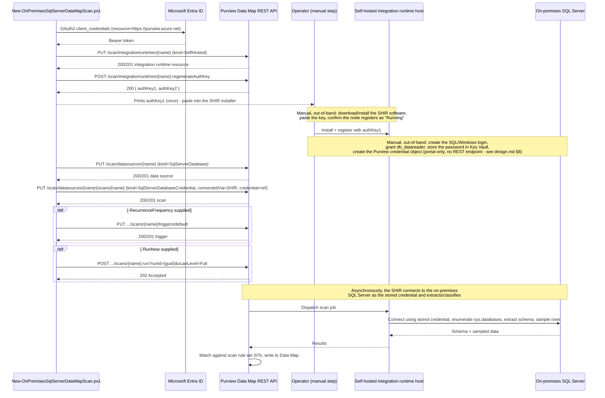

## 1. Problem statement

A tenant that has already stood up Microsoft Purview Data Map against Azure SQL Database, Azure SQL
Managed Instance, and/or Azure Synapse Analytics (this repo's three existing `scenarios/data-map/`
siblings) almost always also has **on-premises SQL Server instances** that haven't been lift-and-
shifted yet, the third sibling all three of those scenarios' own `design.md` §7/§8 non-goals
explicitly deferred. On-premises SQL Server is a **materially different registration and
authentication story**, not a copy-paste extension of the Azure siblings: there is no Azure resource
behind it (no subscription/resource group/managed identity to reference), so Microsoft Purview cannot
reach it directly at all, every on-premises SQL Server scan requires a **self-hosted integration
runtime (SHIR)** running inside the same network as the SQL Server instance, and authentication is
**always** a stored credential (SQL Authentication or Windows Authentication), there is no
managed-identity path for this source type at all, unlike every one of the three Azure siblings whose
default is credential-free SAMI authentication. This scenario automates discovery and classification
for one on-premises SQL Server instance, reusing the proven data-source + scan object model everywhere
the siblings' pattern still applies, and diverging from it explicitly where Microsoft's own
documentation says on-premises SQL Server genuinely differs, including scripting a step none of the
three Azure siblings could: **provisioning the SHIR resource itself and retrieving its registration
key via REST**, closing part of the "credential/SHIR setup is portal-only" gap those siblings each
carried forward as an open non-goal.

## 2. Design goals

1. **Reuse the sibling scenarios' proven shape, don't fork it.** Same two-object model (data source +
   scan, both create-or-replace), same idempotency mechanism (native REST create-or-replace
   semantics), same dry-run design, same four-lens review structure. A buyer who has already deployed
   any of the three Azure siblings should find this scenario immediately familiar, with the diffs
   confined to what Microsoft's own docs say is actually different about on-premises SQL Server.
2. **Name every genuine difference explicitly, in one place.** §4 below is the single source of truth
   for "what's different about on-premises SQL Server" so neither this design doc, the README, nor the
   scripts re-derive it inconsistently.
3. **Close a real gap the three Azure siblings left open, don't just repeat it.** Every prior Data Map
   scenario in this repo left credential/SHIR provisioning as a manual portal step because no
   documented REST endpoint was found for it during those builds. This build independently confirmed
   (by direct fetch of Microsoft's own canonical REST reference pages) that **two** of the three
   on-premises prerequisites this scenario needs, the SHIR *resource* and its auth key, do have
   documented REST operations (`Integration Runtimes - Create Or Replace` and
   `Integration Runtimes - Regenerate Auth Key`), even though the credential-object step (storing the
   SQL/Windows login's password and turning it into a Purview `credential`) still has none, matching
   the siblings' own carried-forward gap. This scenario's deploy script therefore automates SHIR
   provisioning end-to-end at the Purview-resource layer, installing the SHIR *software* on a host and
   pasting in the key it retrieves remains a manual, physical step no REST API can perform.
4. **Don't re-litigate what the siblings already decided correctly.** Create-or-replace-native
   idempotency, system-default-not-fabricated-custom scan rule set, the "register + scan, don't act on
   results" scope boundary, and the dry-run-by-default code standard all carry over unchanged, see
   `scan-azure-sql-and-classify/design.md` §2-3 for that reasoning, not repeated here.

## 3. Why a separate scenario, not a `-SourceKind` parameter on a sibling script

On-premises SQL Server is a distinct Purview data source `kind` (`SqlServerDatabase`, vs.
`AzureSqlDatabase`/`AzureSqlDatabaseManagedInstance`/`AzureSynapseWorkspace`) with its own scan `kind`
(`SqlServerDatabaseCredential`, there is no `...Msi` variant at all for this source type), and it
introduces two prerequisites none of the three Azure siblings have: a **self-hosted integration
runtime** (mandatory, Microsoft's own documentation states on-premises source types "are currently
supported only via self-hosted IR-based scans") and a **stored credential** (mandatory, no
managed-identity option exists for this source type). Branching a single script on `-SourceKind` would
either silently hide these two mandatory extra objects behind a flag the operator might not read, or
force the script to detect and warn about them dynamically, more complexity than a fourth, explicit
scenario that documents the real workflow difference up front. This matches the precedent the three
existing Data Map sibling scenarios already set for each other (each is its own scenario, not a
parameter on the first).

## 4. What's actually different from the three Azure siblings

| Dimension | Azure siblings (SQL DB / MI / Synapse) | On-premises SQL Server (this scenario) |
|---|---|---|
| Data source `kind` | `AzureSqlDatabase` / `AzureSqlDatabaseManagedInstance` / `AzureSynapseWorkspace` | `SqlServerDatabase` |
| Scan `kind` | `...Msi` (default, credential-free) or `...Credential` (fallback) | `SqlServerDatabaseCredential` **only**, no managed-identity variant exists for this source type at all |
| Data source `properties` | `resourceGroup`/`resourceName`/`subscriptionId`/`location` required (an Azure resource backs the source) | All four fields optional and left unset, confirmed by Microsoft's own `New-AzPurviewSqlServerDatabaseDataSourceObject` worked example, which populates only `serverEndpoint` and the collection reference; there is no Azure resource behind an on-premises instance |
| Network path | Azure-managed integration runtime by default (Azure sources are directly reachable), or an *optional* self-hosted IR for private-endpoint isolation | A **self-hosted integration runtime is mandatory**, Microsoft's own documentation states on-premises source types are "currently supported only via self-hosted IR-based scans" |
| Authentication | System-assigned managed identity (SAMI) by default, credential-free | **No managed-identity path exists for this source type at all.** SQL Authentication or Windows Authentication only, both requiring a Key Vault-backed credential object |
| `connectedVia` (integration runtime reference) on the scan object | Omitted by default (implicit Azure-managed IR) | **Required**, `{ "integrationRuntimeType": "SelfHosted", "referenceName": "<SHIR name>" }`, confirmed directly from the `ConnectedVia` REST definition |
| `serverEndpoint` format | Bare hostname (SQL DB) or `tcp:<fqdn>,<port>` (MI) or workspace-specific (Synapse) | Bare hostname, IP address, or `<host>\<namedInstance>`, confirmed by Microsoft's own worked PowerShell example (`'10.1.2.1'`); this scenario does not construct or validate the string, it passes through whatever `-ServerEndpoint` the operator supplies |
| SHIR provisioning | Not needed by default | **This scenario scripts what it can**: the SHIR *resource* object and its auth key retrieval, both via directly-confirmed REST operations (§5), a first for this repo's Data Map scenarios. Installing the SHIR *software* on a host and pasting in the key stays manual (§8) |
| Credential object | Portal-only (same open gap all three siblings carry) | Same open gap, no documented REST endpoint for creating the Key Vault-backed credential object was found in this build either (§8) |
| System scan rule set name | Confirmed via worked PowerShell examples in each sibling (`AzureSqlDatabase` / `AzureSqlDatabaseManagedInstance` / `AzureSynapseSQL`) | **Not confirmed via a worked example in this build**, inferred from the existence of a distinct `SqlServerDatabaseSystemScanRuleset` SDK type (matching the "system ruleset name == data source kind" pattern every sibling confirmed), but no worked PowerShell/REST example showing `scanRulesetName: "SqlServerDatabase"` paired with `scanRulesetType: "System"` was found, flagged as an explicit VERIFY, not silently assumed (`README.md` §11) |
| Supported SQL Server versions | N/A (PaaS, always current) | SQL Server 2005 and above; **SQL Server Express LocalDB isn't supported**, confirmed directly from Microsoft's on-premises SQL Server reference page |

Everything **not** in this table (create-or-replace idempotency, dry-run design, the "register + scan,
don't act on results" scope boundary, staged rollback) is unchanged from the siblings by deliberate
design choice, not oversight.

## 5. Grounding, REST operations this scenario's scripts use, and how each was confirmed

All five mutating operations below were directly fetched from Microsoft's own canonical REST reference
during this build (not reconstructed from SDK types alone, except where noted):

1. **`Integration Runtimes - Create Or Replace`**, `PUT {endpoint}/scan/integrationruntimes/{name}?
   api-version=2023-09-01`, body `{ "kind": "SelfHosted", "properties": { "description": "..." } }`.
   Directly fetched, including a full worked HTTP request/response example.
2. **`Integration Runtimes - Regenerate Auth Key`**, `POST {endpoint}/scan/integrationruntimes/
   {name}:regenerateAuthKey?api-version=2023-09-01`, body `{ "keyName": "authKey1" }`, response
   `{ "authKey1": "...", "authKey2": null }`. Directly fetched, including a full worked HTTP
   request/response example. This is the key the operator pastes into the SHIR installer's "Register
   Integration Runtime (Self-hosted)" screen (§8), Microsoft's own disaster-recovery/migration
   best-practices article independently corroborates that SHIR auth keys are retrievable this way
   ("Get a list of SHIR and get updated keys from the new account"), while also confirming the
   physical registration step itself "must be done manually inside the SHIRs' hosts."
3. **`Data Sources - Create Or Replace`** (`SqlServerDatabaseDataSource`/`SqlServerDatabaseProperties`
   shapes), directly fetched from the same canonical Data Sources reference page the three sibling
   scenarios already ground, confirming the on-premises-specific property set (§4).
4. **`Scans - Create Or Replace`** (`SqlServerDatabaseCredentialScan`/
   `SqlServerDatabaseCredentialScanProperties`, `ConnectedVia`, `CredentialReference` shapes), 
   property names directly fetched from Microsoft's REST definitions; the full worked
   parameter-to-JSON mapping is independently corroborated by Microsoft's own
   `New-AzPurviewSqlServerDatabaseCredentialScanObject` worked PowerShell example, which exercises
   every field this script's JSON body sets (`CollectionReferenceName`, `CredentialReferenceName`,
   `CredentialType 'SqlAuth'`, `DatabaseName`, `ScanRulesetName`, `ScanRulesetType`, `ServerEndpoint`,
   `ConnectedViaReferenceName`) with real example values.
5. **Triggers and Scan Result (Run Scan / List Scan History)**, reused unchanged from
   `scan-azure-sql-managed-instance-and-classify`'s already-corrected shapes (that scenario's own
   `design.md` §5 documents the two discrepancies it found and fixed relative to the first sibling
   scenario), the action-style `POST .../scans/{name}:run?runId=...` shape and the nested
   `discoveryExecutionDetails.statistics.assets.discovered`/`.classified` scan-history shape. Not
   re-fetched independently in this build since they're source-type-agnostic (the same Scan Result
   operations serve every data source `kind`), and re-confirming an already-directly-confirmed shape
   would add no grounding value.

One item this build could **not** confirm despite trying: the literal system scan rule set name for
`SqlServerDatabase` (§4's last row), no worked PowerShell/REST example pairs `scanRulesetName` with
`scanRulesetType: 'System'` for this source type the way each Azure sibling's own build confirmed for
its own source type. Recorded as an explicit VERIFY rather than guessed silently, per `AGENTS.md` §4.

## 6. Object model and REST call sequence

Every mutating call this script makes (integration runtime create, auth-key regenerate, data source
create-or-replace, scan create-or-replace, optional trigger, optional run) is directly confirmed
against Microsoft's own canonical REST reference (§5), the credential-object step and the SHIR
software installation itself are the only two remaining manual, out-of-band steps, both because no
REST surface exists for either (confirmed by Microsoft's own DR/migration best-practices article for
credentials, and by the physical nature of installing Windows service software for the SHIR).

## 7. Key decisions

| Decision | Choice | Rationale |
|---|---|---|
| Deploy surface | Purview Data Map REST API (`Invoke-RestMethod`), per `docs/automation-surface.md` surface 4 | Same as every Data Map sibling scenario, no PowerShell module or Graph equivalent exists for data source/scan/integration-runtime objects |
| Scan authentication | Stored credential only (`SqlServerDatabaseCredential`) | The only authentication path Microsoft documents for this source type, no managed-identity option exists |
| SHIR provisioning scope | Script the Purview-side resource + auth key retrieval; leave the physical software install manual | Matches exactly what a REST API can and cannot do, installing a Windows service on a host and pasting in a key is not scriptable from a Purview data-plane token, but retrieving that key is, and no prior scenario in this repo had scripted even that much |
| Default `-CredentialType` | `SqlAuth` | Matches Microsoft's own confirmed worked PowerShell example exactly; Windows Authentication is documented as a supported alternative but the REST `CredentialType` enum has no distinct value confirmed for it (§4/`README.md` §11 VERIFY) |
| SIT set | Microsoft's system default scan rule set (inferred name `SqlServerDatabase`, `scanRulesetType: System`), same rationale as every sibling, but this specific name is an explicit VERIFY (§5) | Consistency with this repo's established Data Map pattern; a wrong ruleset name fails loudly (404/400) rather than silently under-classifying, so the risk of shipping an unconfirmed name is bounded |
| Idempotency mechanism | Rely on the API's native create-or-replace semantics for every object (integration runtime, data source, scan, trigger) | Consistency with this repo's established Data Map pattern; no reason to diverge |
| Default policy mode | Register (integration runtime + data source + scan) only; **no** trigger and **no** run unless `-RecurrenceFrequency`/`-RunNow` are explicitly passed | Matches `AGENTS.md` §4's dry-run-by-default code standard, same as every sibling scenario |

## 8. Non-goals

- This scenario does not install the self-hosted integration runtime software, register a node with
  the retrieved auth key, or manage SHIR high-availability/multi-node setups. Microsoft's own
  documentation describes this as a manual download-and-install step on a Windows host (or a
  Kubernetes-based SHIR for the containerized alternative, SQL-authentication-only); this script's job
  ends at handing the operator a valid registration key.
- This scenario does not create the Key Vault-backed credential object (the SQL/Windows login's
  password), the SQL/Windows login and `db_datareader` grant on the target instance, or the Key
  Vault-to-Purview connection. Same open gap every Data Map sibling scenario in this repo already
  carries, no documented REST endpoint for credential-object creation was found in this build either,
  consistent with those siblings' own findings.
- This scenario does not script the Kubernetes-based self-hosted data integration runtime alternative
  (SQL-authentication-only, containerized, a *different* Purview capability announced separately from
  the classic Windows-host SHIR this scenario uses), out of scope, a materially different deployment
  model worth its own fragment if a buyer specifically needs it.
- This scenario does not create a custom, PII-only scan rule set, same non-goal every sibling carries
  forward (`scan-azure-sql-and-classify/design.md` §7).
- This scenario does not act on the classification results it produces, same scope boundary as every
  other Data Map scenario in this repo.
- This scenario does not stand up the Purview account, the collection hierarchy, or the on-premises SQL
  Server instance itself, prerequisites, not deliverables, of this fragment.
