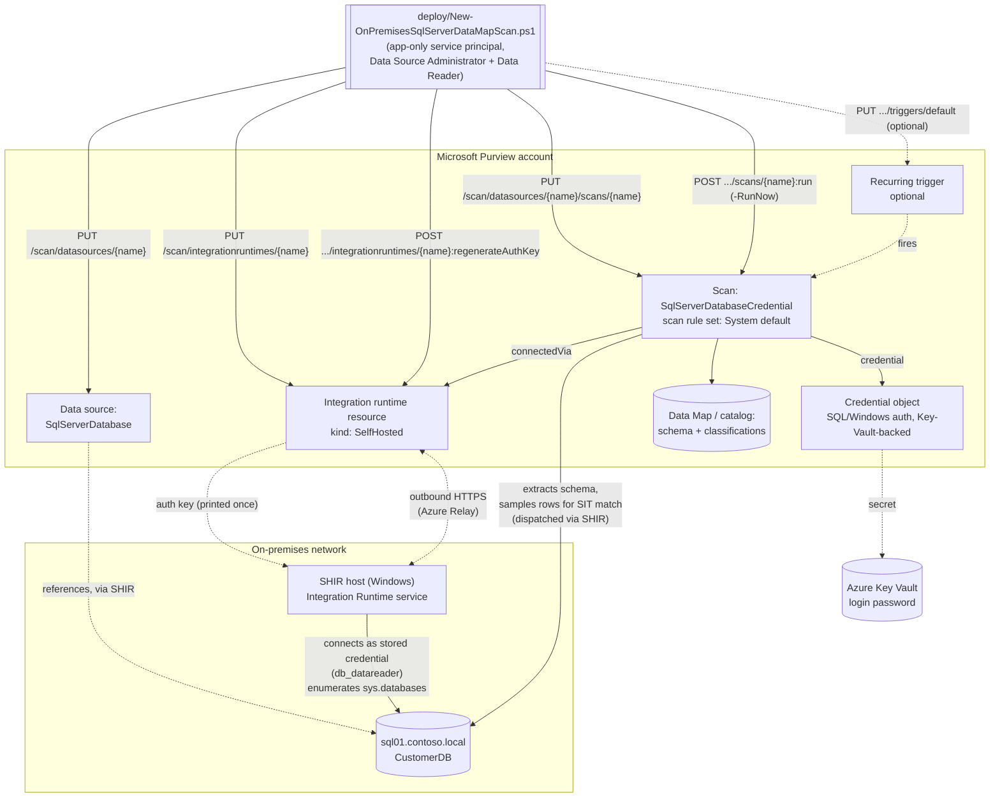

## 1. Scenario summary

Provisions a self-hosted integration runtime (SHIR) resource in Microsoft Purview and retrieves its
registration key, registers an on-premises SQL Server instance as a Data Map source, and configures a
credential-authenticated scan against it using Microsoft's system default scan rule set — which
includes the SSN and Credit Card Number sensitive information types (SITs) this repo already uses
elsewhere — so sensitive columns are automatically classified and surfaced in the catalog. This is the
fourth Data Map scan scenario in this repo and the first covering a **non-Azure** source: it follows
the same proven data-source-plus-scan pattern as [`data-map/scan-azure-sql-and-classify`](/scenarios/data-map/scan-azure-sql-and-classify/),
`scan-azure-sql-managed-instance-and-classify/`, and `scan-azure-synapse-and-classify/`, adapted for
the genuine registration, network, and authentication differences on-premises SQL Server has — see
`design.md` §4 for the full diff.

**Who it's for:** a data governance or security team that has already deployed one or more of the
three Azure SQL sibling scenarios and also has on-premises SQL Server instances — a lift-and-shift
source, not (yet) a target — and needs the same discovery-and-classification coverage for them without
silently reusing a script built for a directly-reachable PaaS data source.

## 2. Business/regulatory driver

Same underlying drivers as the three Azure siblings — GDPR Art. 30 records of processing, CCPA/CPRA
data inventory obligations, PCI DSS Requirement 3.2/12.5.2 cardholder data discovery, HIPAA §164.308
risk analysis all require an accurate, current inventory of where regulated data lives
[[1]](#references). On-premises SQL Server is disproportionately likely to be where an organization's
**oldest, least-documented** regulated data lives — instances that predate a cloud migration program,
were never in scope for it, or are deliberately kept on-premises for latency, licensing, or regulatory
reasons. An automated, recurring discovery-and-classification pass over these instances closes exactly
the blind spot a cloud-only Data Map deployment would otherwise leave: the assumption that "we migrated
everything that matters" is rarely fully true, and this scenario is how a buyer finds out.

## 3. Prerequisites

Full licensing detail and citations: `docs/licensing-matrix.md`. Summary for this scenario (deltas
from the Azure sibling scenarios' tables are called out explicitly):

| Requirement | Minimum | Notes |
|---|---|---|
| Microsoft Purview account + Data Map | Active **Azure subscription** with the M365 tenant, resource group for the Purview account, and (per Microsoft's own prerequisite) **the enterprise version of Microsoft Purview** or an active account using the classic governance portal | PAYG-billed Azure consumption, not a per-user M365 entitlement — see `docs/licensing-matrix.md` §1–2 [[2]](#references) |
| Register + configure the source/scan | **Data Source Administrator** *and* **Data Reader** on the target collection | Microsoft's own prerequisite for this source type names both roles explicitly, not just Data Source Administrator alone as the Azure siblings' pages state — see `docs/rbac-model.md` §5 [[2]](#references) |
| Call the Data Map REST API at all (any role) | **Collection Admin** role at root collection assigns data-plane roles to the automation service principal | Only a Collection Admin can grant Purview roles to a service principal — see `docs/rbac-model.md` §5 |
| Read scan results / browse classified assets (validation) | **Data Reader** role on the target collection | Least-privilege for the read-only `validate/` script |
| **A self-hosted integration runtime (SHIR)** | A Windows host (or Kubernetes cluster, SQL-auth-only) with network reachability to both the target SQL Server and the Purview service | **Mandatory, not optional** — Microsoft's own documentation states on-premises source types are "currently supported only via self-hosted IR-based scans." This scenario's deploy script provisions the Purview-side *resource* and its auth key; installing the SHIR software and registering the node is a manual step — see §5 [[3]](#references). **The host itself is almost always owned by an infrastructure/on-prem-ops team, not the data governance/security team standing up this scenario** — budget for that as a coordination dependency, not just a technical prerequisite, the same way `scan-azure-sql-managed-instance-and-classify`'s Directory Readers grant needed IAM sign-off from a different team |
| **A stored credential (SQL or Windows Authentication)** | A SQL/Windows login with `db_datareader` on the target database(s), its password in an Azure Key Vault secret, and a Purview credential object created from it | **No managed-identity path exists for this source type at all** — every Azure sibling defaults to credential-free SAMI; this scenario cannot. Build the credential object with [`data-map/scan-credential-key-vault-backed`](/scenarios/data-map/scan-credential-key-vault-backed/) (scripted; the "portal-only, no REST endpoint" note this row originally carried was incorrect — see §11) [[4]](#references) |
| SQL Server version | SQL Server 2005 and above | **SQL Server Express LocalDB isn't supported** — confirmed directly from Microsoft's on-premises SQL Server reference page [[3]](#references) |
| Network path (SHIR host → SQL Server) | The account used to scan must have access to the `master` database (`sys.databases` lives there) | Confirmed directly from Microsoft's own documentation — see §5 step 3 [[3]](#references) |
| Automation identity for the REST calls themselves | App registration with **Data Source Administrator** and **Data Reader** (and, for the validate script, at minimum **Data Reader**) Purview role on the collection | Client-secret app-only OAuth2 — see `docs/automation-surface.md` §3 and §5 below |

> Verify current entitlement names and the PAYG meter against `docs/licensing-matrix.md` before a
> sales commitment — SKU names and billing meters change.

## 4. Architecture



Same two-object model as the three Azure siblings (a data source + a scan, both create-or-replace),
plus a third object type none of them needed: the **integration runtime resource** itself, which this
scenario's deploy script also provisions via REST — a genuine automation improvement over the Azure
siblings' portal-only credential/SHIR setup steps, even though the SHIR *software* installation and the
credential object still require a manual step (§5, §11). Full design rationale and the complete
on-premises-vs-Azure diff: `design.md` §4.

## 5. Step-by-step implementation

### Portal path (for a first manual walkthrough / to validate intent before scripting)

1. **Set up the self-hosted integration runtime.** In the Microsoft Purview portal (or the classic
   governance portal) → **Data Map** → **Integration runtimes** → **+ New** → **Self-Hosted** → name
   it → **Create**. Copy the authentication key shown, then download and install the [self-hosted
   integration runtime](https://go.microsoft.com/fwlink/?linkid=2246619) on a Windows host with
   network access to the target SQL Server, and paste the key into the installer's "Register
   Integration Runtime (Self-hosted)" screen. Confirm the node shows **Running** [[5]](#references).
2. **Configure authentication.** In SQL Server Management Studio (SSMS), confirm **Server
   Properties → Security → Server authentication** allows the method you intend (SQL Server and
   Windows Authentication mode for SQL Authentication; either mode works for Windows Authentication).
   A change here requires restarting the SQL Server instance and Agent [[3]](#references).
3. **Create a login and user.** In SSMS, create a new login (Windows or SQL) with **public** server
   role, then under **User mapping** select every database to scan and grant the **db\_datareader**
   database role. This account needs access to the `master` database because `sys.databases` lives
   there [[3]](#references). Microsoft publishes a ready-made T-SQL script for this exact step
   [[6]](#references). If SQL Authentication, set a permanent password on the new login (the initial
   password must be changed immediately per SQL Server's policy).
4. **Store the password and create the Purview credential.** In Azure Key Vault → **Secrets** → **+
   Generate/Import**, store the login's password. Connect that Key Vault to Purview if not already
   connected, then in Purview → **Credentials** → **+ New**, select **SQL authentication** (or
   **Windows authentication**), and reference the Key Vault secret [[4]](#references).
5. Back in the Purview portal, **Data Map** → **Data sources** → **Register** → **SQL Server** →
   **Continue**. Provide a friendly name and the server endpoint (hostname, IP, or
   `<host>\<namedInstance>`) → **Finish** [[3]](#references).
6. Select the registered source → **New scan** → choose the self-hosted integration runtime you
   registered in step 1 → select the credential from step 4 → **Test connection** → **Continue**
   [[3]](#references).
7. Enter the database name to scope the scan (or leave blank to scan the whole instance), choose a
   scan rule set (system default, this scenario's default), choose a scan trigger, and **Save and
   run** [[3]](#references).
8. After the scan completes, browse the classified assets in **Unified Catalog** to confirm columns
   matching your target SITs are tagged.

### Script path (idempotent, parameterized, dry-run capable)

```powershell
# 1. Deploy (dry run first — reports every REST call that would be made, changes nothing)
./deploy/New-OnPremisesSqlServerDataMapScan.ps1 `
    -PurviewAccountName 'contoso-purview' `
    -TenantId $TenantId -AppId $AppId -ClientSecret $ClientSecret `
    -IntegrationRuntimeName 'shir-onprem-sql' `
    -ServerEndpoint 'sql01.contoso.local' -DatabaseName 'CustomerDB' `
    -CollectionReferenceName 'a1b2c' -CredentialReferenceName 'onprem-sql-svc-account' `
    -WhatIf

# 2. Deploy for real — creates the integration runtime resource (prints its auth key ONCE),
#    registers the source and the scan. Does not run it yet.
./deploy/New-OnPremisesSqlServerDataMapScan.ps1 `
    -PurviewAccountName 'contoso-purview' `
    -TenantId $TenantId -AppId $AppId -ClientSecret $ClientSecret `
    -IntegrationRuntimeName 'shir-onprem-sql' `
    -ServerEndpoint 'sql01.contoso.local' -DatabaseName 'CustomerDB' `
    -CollectionReferenceName 'a1b2c' -CredentialReferenceName 'onprem-sql-svc-account'

# --- Manual, out-of-band, between steps 2 and 3 ---
#   a. Install the SHIR software on a Windows host with network access to sql01.contoso.local,
#      pasting in the auth key step 2 printed. Confirm the node shows "Running" in the portal.
#   b. Create the SQL/Windows login + db_datareader grant, store its password in Key Vault, and
#      create the 'onprem-sql-svc-account' credential object in Purview (README.md Section 5,
#      steps 2-4). None of this is scriptable from this repo's automation identity — see Section 11.

# 3. Once (a) and (b) above are confirmed done, add a weekly recurring trigger and kick off an
#    immediate full scan. -SkipIntegrationRuntimeAuthKey avoids rotating the key the SHIR node
#    already registered with.
./deploy/New-OnPremisesSqlServerDataMapScan.ps1 `
    -PurviewAccountName 'contoso-purview' `
    -TenantId $TenantId -AppId $AppId -ClientSecret $ClientSecret `
    -IntegrationRuntimeName 'shir-onprem-sql' -SkipIntegrationRuntimeAuthKey `
    -ServerEndpoint 'sql01.contoso.local' -DatabaseName 'CustomerDB' `
    -CollectionReferenceName 'a1b2c' -CredentialReferenceName 'onprem-sql-svc-account' `
    -RecurrenceFrequency Week -RunNow

# 4. Validate
./validate/Test-OnPremisesSqlServerDataMapScan.ps1 `
    -PurviewAccountName 'contoso-purview' -TenantId $TenantId -AppId $AppId -ClientSecret $ClientSecret `
    -DataSourceName 'sql01-contoso-local' -IntegrationRuntimeName 'shir-onprem-sql'
```

The deploy script uses the **Microsoft Purview Data Map / Data Governance REST API** — automation
surface 4 per `docs/automation-surface.md` §1. Unlike the three Azure sibling scenarios, step 2 above
*does* script one genuine out-of-band prerequisite (the integration runtime resource + auth key) —
only the physical software install (a) and the credential object (b) remain manual; see `design.md`
§8.

## 6. Configuration reference

| Setting | Value this scenario uses | Notes |
|---|---|---|
| Data source `kind` | `SqlServerDatabase` | Distinct from all three Azure siblings' `kind` values [[7]](#references) |
| Data source `properties` | Only `serverEndpoint` + `collection` set | `resourceGroup`/`resourceName`/`subscriptionId`/`location` deliberately omitted — confirmed via Microsoft's own `New-AzPurviewSqlServerDatabaseDataSourceObject` worked example, which leaves them blank because no Azure resource backs an on-premises instance [[8]](#references) |
| Scan `kind` | `SqlServerDatabaseCredential` | The **only** scan kind for this source type — no `...Msi` managed-identity variant exists [[9]](#references) |
| `serverEndpoint` format | Hostname, IP address, or `<host>\<namedInstance>` | Confirmed via Microsoft's own worked PowerShell example (a bare IP address, `'10.1.2.1'`); this script passes the value through unmodified [[9]](#references) |
| `connectedVia` | `{ "integrationRuntimeType": "SelfHosted", "referenceName": "<IntegrationRuntimeName>" }` | **Required** for this source type — confirmed directly from the `ConnectedVia` REST definition [[10]](#references) |
| `credential` | `{ "credentialType": "SqlAuth", "referenceName": "<CredentialReferenceName>" }` | `credentialType` confirmed via Microsoft's own worked PowerShell example for this exact scan kind; `SqlAuth` is this script's default (see §11 for the Windows-Authentication VERIFY) [[9]](#references)[[10]](#references) |
| Integration runtime `kind` | `SelfHosted` | The only kind this scenario creates — `Managed` (Azure-autoresolved) needs no resource object at all and is irrelevant here [[11]](#references) |
| Collection reference | `{ "referenceName": "<5-char collection ID>", "type": "CollectionReference" }` | Same shape as every Data Map sibling scenario — read the ID from the collection's URL in the portal, not its friendly name |
| Scan rule set (this scenario's default) | `scanRulesetName: "SqlServerDatabase"`, `scanRulesetType: "System"` | **VERIFY** — inferred from the "system ruleset name == data source kind" pattern every sibling confirmed via a worked example, but not independently confirmed for this specific source type in this build. See §11 |
| Scan level | `Full` (first run) → `Incremental` (subsequent scheduled runs) | Same pattern as every sibling scenario [[12]](#references) |
| Recurring trigger | Optional; `RecurrenceFrequency`/`RecurrenceInterval` parameters | Trigger resource name is always `default` — same confirmed shape every sibling scenario uses |
| Run-scan call shape | `POST .../scans/{name}:run?runId={guid}&scanLevel={level}` | Reused unchanged from `scan-azure-sql-managed-instance-and-classify`'s directly-confirmed shape (source-type-agnostic Scan Result operation) |
| API version pinned by this script | `2023-09-01` | Confirmed current for the Integration Runtimes (Create Or Replace, Regenerate Auth Key), Data Sources, and Scans REST operations this script uses, via direct fetch of each operation's own canonical reference page — see §11 |

Full cmdlet/REST-body grounding: `deploy/New-OnPremisesSqlServerDataMapScan.ps1` inline comments and
its `.NOTES` block cite the exact Microsoft Learn reference pages.

## 7. Validation / how to prove it works

1. **Automated config check** — `./validate/Test-OnPremisesSqlServerDataMapScan.ps1` confirms the
   integration runtime, data source, and scan objects exist with the expected `kind`, server
   endpoint, `connectedVia`, and credential reference, and reports the most recent scan run's status.
   Exits non-zero on any hard failure (safe for a CI-style pre-flight).
2. **SHIR node health (manual, not automatable by this script)** — Purview portal → **Data Map** →
   **Integration runtimes** → the runtime → **Nodes** tab → confirm the node shows **Running**, not
   *Disconnected* or *Offline*. The Data Map REST API's Integration Runtimes - Get operation returns
   the resource definition, not live node health, so `validate/Test-OnPremisesSqlServerDataMapScan.ps1`
   cannot check this — a scan can pass every automated check and still fail at run time if no node has
   registered yet.
3. **Scan run status** — Purview portal → **Data Map** → **Data sources** → select the source →
   **Recent scans** → the run shows **Queued → In progress → Completed**, with assets
   discovered/classified counts [[12]](#references). Scan run history is retained for **90 days**.
4. **Classification evidence** — browse or search the **Unified Catalog** for the scanned database
   asset; confirm the target columns carry the **U.S. Social Security Number** or **Credit Card
   Number** classification badges.
5. **Credential evidence** — confirm in the database (e.g. `SELECT name, type_desc FROM
   sys.server_principals WHERE name = '<login>'`) that the login used by the credential object exists
   and, via `sys.database_role_members`, holds `db_datareader` on the target database(s).

## 8. Operations & tuning

Same core KPIs and no-alerting-for-Data-Map-scans posture as the three Azure sibling scenarios — see
`scan-azure-sql-and-classify/README.md` §8 for the full text, not repeated here. Two
on-premises-specific additions:

**Incident-response addition — on-premises-specific failure causes**, in order of likelihood, ahead of
any cause shared with the Azure siblings: (a) the **SHIR node isn't running** — the single most common
cause of an on-premises scan failing when the Azure siblings' equivalent scan would have succeeded;
check the Nodes tab first, every time (§7 check 2); (b) the **stored credential's password rotated**
without the Purview credential object being updated — SQL/Windows login password rotation policies
rarely know Purview depends on them; (c) a **network/firewall change** blocked the SHIR host from
reaching either the SQL Server instance or the Purview service endpoints (both directions matter — the
SHIR calls out to Purview over HTTPS/Azure Relay, and separately connects inbound-from-the-SHIR's-
perspective to the SQL Server); (d) the SHIR software **expired** — each version expires one year after
release, with warnings starting 90 days out, and auto-update requires the node to be online to receive
it.

**Review cadence:** same monthly/quarterly rhythm as the Azure siblings (§8 there), plus: (a) confirm
the SHIR node's **Version** tab isn't approaching its one-year expiration; (b) if multiple SHIR nodes
share this integration runtime for high availability, confirm all are healthy, not just one (a single
healthy node keeps the scan running and can mask a partial outage); (c) re-run
`validate/Test-OnPremisesSqlServerDataMapScan.ps1` after any credential-object update; (d) confirm the
SHIR host's owning team (infrastructure/on-prem-ops, per §3) still has this dependency on their own
patching/decommissioning checklist — a host repurposed or retired without anyone remembering Purview
depends on it silently breaks every scan wired to it, with no alert from Purview itself.

**Blast-radius note:** every data source whose scan names the same `-IntegrationRuntimeName` is only as
trustworthy as that one SHIR host. If the host is compromised, an attacker with access to it can see
(or interfere with) every scan job Purview dispatches to it — not just this scenario's. For a tenant
running multiple on-premises sources at different sensitivity tiers, consider dedicating separate SHIR
hosts per tier rather than sharing one runtime across all of them, the same way network segmentation
would apply to any other shared administrative chokepoint.

**Downstream use:** same as every sibling scenario — this scenario stops at "classify and make
visible," feeding `scenarios/information-protection/`, `scenarios/dlp/`, and any future Data Estate
Insights reporting fragment.

## 9. Rollback / decommission

See `rollback.md` for the full staged procedure (disable trigger → delete scan → delete data source →
optionally delete the integration runtime resource → optionally decommission the SHIR host) —
structurally an extension of the Azure siblings' rollback with one extra stage. Quick reference:
`./deploy/Remove-OnPremisesSqlServerDataMapScan.ps1` removes the scan and its trigger (reversible by
re-running the deploy script); add `-RemoveDataSource` to also delete the data source registration,
and `-RemoveIntegrationRuntime -IntegrationRuntimeName <name>` to also delete the integration runtime
resource (only if no other scan still uses it). Rolling back the Purview-side objects does **not**
uninstall the SHIR software from its host, revert the SQL/Windows login and grant, delete the Key Vault
secret, or remove the Purview credential object — see `rollback.md`.

## 10. Cost & licensing notes

Same PAYG/Azure-consumption billing model as every sibling scenario — see `docs/licensing-matrix.md`
§1–2 and `scan-azure-sql-and-classify/README.md` §10 for the full text. Two on-premises-specific
additions: (a) the SHIR host itself is a cost this scenario's licensing table doesn't cover — a
dedicated VM or on-premises server sized per Microsoft's SHIR guidance, plus its own OS/patching
overhead; (b) no Data Map scanning meter changes based on source type (Azure vs. on-premises) — the
same consumption-based billing applies regardless of where the SHIR runs.

## 11. Known limitations & gotchas

- **VERIFY — system scan rule set name.** This scenario defaults `-ScanRulesetName` to
  `'SqlServerDatabase'`, inferred from the "system ruleset name == data source kind" pattern every
  Azure sibling scenario confirmed via its own worked PowerShell/REST example. This build found a
  distinct `SqlServerDatabaseSystemScanRuleset` SDK type confirming a system ruleset *exists* for this
  source type, but no worked example pairing `scanRulesetName: "SqlServerDatabase"` with
  `scanRulesetType: "System"` the way each sibling's build confirmed for its own source type. Confirm
  the real name (Purview portal → **Management Center** → **Scan rule sets** → **System** tab →
  filter by source type) before relying on the default in an unattended pipeline — a wrong name fails
  the scan loudly (400/404) rather than silently under-classifying, so the blast radius of shipping
  this unconfirmed default is bounded, but should still be closed.
- **VERIFY — Windows Authentication's `CredentialType` value.** Microsoft's portal documents both "SQL
  Authentication" and "Windows Authentication" as supported methods for this source type, but the REST
  `CredentialType` enum (`AccountKey` / `ServicePrincipal` / `BasicAuth` / `SqlAuth` / `AmazonARN` /
  `ConsumerKeyAuth` / `DelegatedAuth` / `ManagedIdentity`) has no value confirmed in this build to map
  specifically to Windows Authentication. This script's `-CredentialType` parameter accepts `'SqlAuth'`
  (default, and the value Microsoft's own worked example for this scan kind uses) or `'BasicAuth'`
  (this repo's best-effort mapping, unconfirmed) — do not rely on `'BasicAuth'` for a Windows
  Authentication deployment without confirming against a pilot tenant first.
- **~~The credential object and~~ the SHIR software install remain portal-only. CORRECTED
  2026-09-16 — the credential half of this claim was wrong.** This build concluded that no
  documented REST endpoint existed for creating a Purview credential object. It does: **Credential**
  (`PUT /scan/credentials/{credentialName}`) and **Key Vault Connections**
  (`PUT /scan/azureKeyVaults/{azureKeyVaultName}`) are first-class documented operation groups at
  `api-version=2023-09-01`, now scripted by [`data-map/scan-credential-key-vault-backed`](/scenarios/data-map/scan-credential-key-vault-backed/).
  Build this scenario's `-CredentialReferenceName` there instead of clicking it in the portal. The
  Microsoft disaster-recovery statement that "there's no API to extract credentials" was
  over-read here: it is about **exporting existing secret material** (which is true, and by
  design — a credential object only ever holds a *reference*), not about creating the object.
  Installing/registering SHIR software on a host does remain inherently a physical action on that
  host, not a REST call. With the credential gap closed, the only manual step left in this scenario
  is the SHIR install itself.
- **The printed auth key is shown once and not stored anywhere by this script — treat its console
  output as sensitive.** Anyone who registers a host with a leaked key becomes a trusted SHIR node
  that receives real scan jobs (see the "Blast-radius note" in §8). Never run the initial provisioning
  call (without `-SkipIntegrationRuntimeAuthKey`) inside a CI/CD pipeline step that persists stdout to
  durable logs, a chat/ticketing integration, or any artifact store — run it interactively, copy the
  key immediately into the SHIR installer, and pass `-SkipIntegrationRuntimeAuthKey` on every
  subsequent reconciliation run. If lost, re-run without that switch to issue a new key — this
  invalidates the old one for any node still using it, so re-registration of every existing node is
  required after a rotation.
- **A single self-hosted integration runtime can serve multiple data sources and scans.** If you
  already have a SHIR registered for another purpose, point `-IntegrationRuntimeName` at it instead of
  creating a new one — `New-OnPremisesSqlServerDataMapScan.ps1`'s create-or-replace call against an
  existing runtime is a benign no-op (it only updates the `description` field).
- **Existing classifications are not retroactively removed** when a scan rule set is narrowed — same
  behavior as every sibling scenario.
- **U.S.-centric SIT starter set** — same caveat as every other scenario in this repo using the SSN +
  Credit Card Number pair; not GDPR-complete for a non-U.S. tenant.
- **Kubernetes-based self-hosted data integration runtime is a different, newer capability** —
  Microsoft's own documentation describes a separate, container-based self-hosted *data* integration
  runtime (SQL Server and Oracle only, SQL-authentication-only) distinct from the classic Windows-host
  SHIR this scenario scripts. Not covered here — see `design.md` §8.

## 12. References

1. Discover and govern Azure SQL Database in Microsoft Purview (shared regulatory-driver framing) — <https://learn.microsoft.com/purview/register-scan-azure-sql-database>
2. Connect to and manage an on-premises SQL server instance in Microsoft Purview — "Prerequisites" (enterprise version requirement, Data Source Administrator + Data Reader roles) — <https://learn.microsoft.com/purview/register-scan-on-premises-sql-server#prerequisites>
3. Connect to and manage an on-premises SQL server instance in Microsoft Purview — "Register" and "Scan" (mandatory SHIR, SQL Server 2005+/no Express LocalDB, authentication configuration, login/user creation, master database access requirement) — <https://learn.microsoft.com/purview/register-scan-on-premises-sql-server>
4. Credentials for source authentication in Microsoft Purview Data Map — "Create a new credential" (SQL/Windows authentication, Key Vault-backed secrets) — <https://learn.microsoft.com/purview/data-map-data-scan-credentials#create-a-new-credential>
5. Create and manage a self-hosted integration runtime — "Setting up a self-hosted integration runtime" (portal creation flow, auth key, download/install/register steps, node status) — <https://learn.microsoft.com/purview/data-map-integration-runtime-self-hosted#setting-up-a-self-hosted-integration-runtime>
6. Connect to and manage an on-premises SQL server instance in Microsoft Purview — "Creating a new login and user" (T-SQL grant script reference) — <https://learn.microsoft.com/purview/register-scan-on-premises-sql-server#scan> ; T-SQL sample: <https://github.com/Azure/Purview-Samples/blob/master/TSQL-Code-Permissions/grant-access-to-on-prem-sql-databases.sql>
7. SqlServerDatabaseDataSource / SqlServerDatabaseProperties (Data Sources - Create Or Replace REST reference, API version 2023-09-01) — <https://learn.microsoft.com/rest/api/purview/scanningdataplane/data-sources/create-or-replace>
8. New-AzPurviewSqlServerDatabaseDataSourceObject (Az.Purview PowerShell module — worked example confirms resourceGroup/resourceName/subscriptionId/location are left unset) — <https://learn.microsoft.com/powershell/module/az.purview/new-azpurviewsqlserverdatabasedatasourceobject>
9. New-AzPurviewSqlServerDatabaseCredentialScanObject (Az.Purview PowerShell module — worked example confirms Kind, CredentialType 'SqlAuth', ServerEndpoint, ConnectedViaReferenceName) — <https://learn.microsoft.com/powershell/module/az.purview/new-azpurviewsqlserverdatabasecredentialscanobject>
10. ConnectedVia / CredentialReference / CredentialType definitions (Data Sources - Create Or Replace REST reference, shared data-plane definitions, API version 2023-09-01) — <https://learn.microsoft.com/rest/api/purview/scanningdataplane/data-sources/create-or-replace>
11. Integration Runtimes - Create Or Replace and Integration Runtimes - Regenerate Auth Key (REST reference, API version 2023-09-01, full worked HTTP examples) — <https://learn.microsoft.com/rest/api/purview/scanningdataplane/integration-runtimes/create-or-replace> and <https://learn.microsoft.com/rest/api/purview/scanningdataplane/integration-runtimes/regenerate-auth-key>
12. Monitor Data Map population in Microsoft Purview (scan run statuses, 90-day run-history retention) — <https://learn.microsoft.com/purview/data-map-scan-run-monitor-population>
13. Disaster recovery and migration best practices for Microsoft Purview data governance (classic) — confirms no REST API exists to extract/create credentials, and that SHIR physical registration "must be done manually inside the SHIRs' hosts" — <https://learn.microsoft.com/purview/data-gov-best-practices-disaster-recovery-migration>
14. Kubernetes supported self-hosted data integration runtime for on-premises data sources (preview) — the distinct, containerized alternative this scenario does not cover — <https://learn.microsoft.com/purview/unified-catalog-data-integration-runtime-kubernetes>
15. Data governance roles and permissions in Microsoft Purview (classic Data Map role vocabulary) — <https://learn.microsoft.com/purview/data-gov-classic-permissions>
16. [`data-map/scan-azure-sql-and-classify`](/scenarios/data-map/scan-azure-sql-and-classify/), `scan-azure-sql-managed-instance-and-classify/`, `scan-azure-synapse-and-classify/` — the three sibling scenarios this fragment extends; see their README.md/design.md for shared reasoning not repeated here.

> Re-verify all links and the two VERIFY items in §11 against current Microsoft Learn before a
> customer-facing deployment — the Data Map REST surface is explicitly called out by Microsoft as
> evolving.
