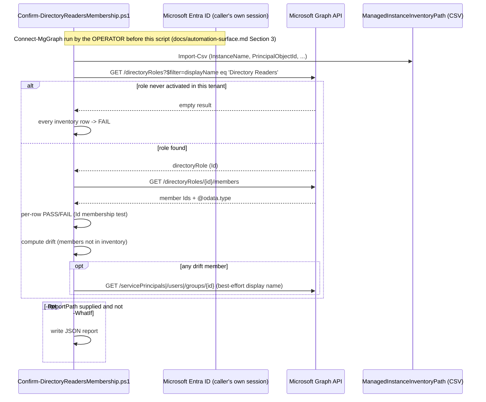

## 1. Problem statement

`scenarios/data-map/scan-azure-sql-managed-instance-and-classify/` documents a Microsoft Entra
prerequisite unique to that data source `kind`: before Microsoft Entra authentication works **at
all** for an Azure SQL Managed Instance, including the Purview scan that scenario configures, the
instance's own system-assigned managed identity must be a current member of the Microsoft Entra ID
**Directory Readers** role. That scenario's own `validate/Test-AzureSqlManagedInstanceDataMapScan.ps1`
cannot check it: that script authenticates against the Purview Data Map data-plane resource
(`https://purview.azure.net`) with a Data Reader-scoped Purview role, which has no reason to also
hold a directory-read Microsoft Graph permission. Its `reviews.md` (Blue Team finding 1) flagged
this as a real, undetected gap and recorded a follow-up in `PROGRESS.md` rather than silently
leaving it unautomated. This scenario is that follow-up: a small, separate, Graph-permissioned
checker, scoped to run across **every** Managed-Instance-backed Purview data source in a tenant, not
just one.

The risk this closes is concrete, not theoretical: Microsoft documents Directory Readers as needed
by multiple, independent Azure SQL workload types (Database, Managed Instance, and Synapse Analytics
can each need it for their own Microsoft Entra authentication), so a real tenant's Directory Readers
membership is typically shared across more than just this one instance's identity, it can be, and
in practice is, revoked or reassigned by an identity team that has no visibility into which Data Map
scans depend on it. When that happens, the affected instance's Purview scan starts failing
authentication silently, with no Data Map-side alert (Data Map scans have no `GenerateAlert`-style
mechanism, `docs/automation-surface.md` §4), and no signal at all until someone notices stale scan
results or checks the run history.

## 2. Design goals

1. **A genuinely separate auth surface, not a bolt-on to the sibling scenario's script.** This
   scenario uses only the Microsoft Graph PowerShell SDK (`RoleManagement.Read.Directory`), it
   never touches the Purview Data Map REST API and needs no Purview role at all. That separation is
   the entire point: an operator can run this scenario's checker with an identity that has zero
   Purview access, and run the sibling scenario's validate script with an identity that has zero
   Graph access, and each still gets a complete answer for its own concern.
2. **Scale to "every instance," not one.** The gap this closes was discovered against a single
   instance, but Directory Readers is a single, shared, tenant-wide-flavored role, the natural unit
   of work is "confirm the whole inventory of Managed-Instance-backed sources at once," which also
   makes the drift check (§4) possible in the first place. A CSV inventory, not per-instance
   parameters, is the shape that scales.
3. **Detect drift, not just absence.** `scan-azure-sql-managed-instance-and-classify/reviews.md`
   (Red Team finding 2) separately flagged that nothing detects a *different* identity being added
   to (or removed from) the same tenant-wide role after this scenario's own grant. A single query
   already returns the full current membership list, so reporting members outside the expected set
   costs nothing extra and directly closes that second finding too.
4. **Read-only, always.** Consistent with this repo's established convention (carried over
   verbatim from the sibling scenario's own `design.md` §8) of not automating rare, high-privilege,
   one-time directory grants: fixing a FAIL here is a deliberate action by a human **Privileged Role
   Administrator**, never something this script does on the operator's behalf. See §10 Non-goals.

## 3. Why a standalone scenario, not a parameter on the sibling scenario's validate script

The sibling scenario's `validate/Test-AzureSqlManagedInstanceDataMapScan.ps1` is deliberately scoped
to the Purview Data Map data-plane API and the single instance/source pair its other parameters
already describe. Folding a Microsoft Graph directory-role check into it would force every run of
that script, including ones where the operator's automation identity has no Graph permission at
all, to either fail outright or silently skip the check, neither of which is better than a second,
explicitly-scoped script that only runs when a Graph-permissioned identity is actually available.
This mirrors the branching precedent `scan-azure-sql-managed-instance-and-classify/design.md` §3
already set for "adjacent but distinct" concerns needing distinct scripts rather than a shared one
branching on a flag.

## 4. Why a CSV inventory, not `-InstanceName`/`-ResourceGroupName` parameters

Directory Readers membership is checked with exactly one Graph query pair (`Get-MgDirectoryRole` +
`Get-MgDirectoryRoleMember`) regardless of how many instances are being verified, the per-instance
cost is a local, in-memory set-membership test against that one result. An inventory file lets an
operator check an arbitrary number of instances in one run, at the same Graph-call cost as checking
one, and is what makes the drift computation (§2 goal 3) meaningful: drift is defined relative to
"every instance this operator expects," which only a multi-row inventory can express. This also
matches this repo's existing precedent for multi-entity checker scripts taking a CSV/config-file
input rather than a flat parameter list (e.g. `scenarios/ediscovery/roster-to-hold-locations/`).

## 5. Why the script does not call `Get-AzSqlInstance` itself

`Get-AzSqlInstance -ResourceGroupName <rg> -Name <instance>` (`Az.Sql` module) is the documented way
to obtain a managed instance's `Identity.PrincipalId`, the value this scenario's inventory rows
need. The deploy script deliberately does **not** call it, for two reasons:

1. **Auth-surface minimalism (design goal 1).** Adding an `Az.Sql`/Azure Resource Manager dependency
   would mean this script needs *two* separate credentials (Graph **and** Azure RM) to run at all,
   defeating the point of a checker an operator can hand to a Graph-only identity.
2. **The object ID is already known at registration time.** Whoever ran
   `scan-azure-sql-managed-instance-and-classify/deploy/New-AzureSqlManagedInstanceDataMapScan.ps1`
   for a given instance already resolved (or can trivially resolve) that instance's identity object
   ID during the same session, capturing it into the inventory CSV once, at registration time, costs
   less than re-deriving it on every check-run.

`README.md` §5 documents the one-line `Get-AzSqlInstance` command to populate the CSV's
`PrincipalObjectId` column; it is a documented prerequisite for building the inventory, not part of
this scenario's own script.

## 6. Object model and call sequence

Both Graph calls are read-only `GET`s; this scenario makes zero mutating Graph calls under any
parameter combination.

## 7. Key decisions

| Decision | Choice | Rationale |
|---|---|---|
| Deploy surface | Microsoft Graph PowerShell SDK (`Get-MgDirectoryRole`/`Get-MgDirectoryRoleMember`), per `docs/automation-surface.md` §1 surface 3 | The only surface that can read directory-role membership; no Purview or Az.Sql equivalent exists |
| Least-privilege Graph permission | `RoleManagement.Read.Directory` (application) | Confirmed least-privileged option for both `Get-MgDirectoryRole` and `Get-MgDirectoryRoleMember` over the broader `Directory.Read.All`/`*.ReadWrite.*` alternatives, see README.md §12 |
| Input shape | CSV inventory (`-ManagedInstanceInventoryPath`), not per-instance parameters | §4 above, scales to "every instance" at the same Graph-call cost as one, and is what makes drift detection meaningful |
| Identity resolution | Caller supplies `PrincipalObjectId` (from `Get-AzSqlInstance...Identity.PrincipalId`, captured once at registration time) | §5 above, keeps this script's own auth surface to Microsoft Graph alone |
| Role-not-yet-activated handling | Hard FAIL for every row, with an explicit warning naming the cause, not a silent "0 members" pass | Microsoft's own "List directoryRoles" reference documents that operation as returning only *activated* roles, treating "role not found" as "0 members, nothing wrong" would be a false negative for the exact failure mode this scenario exists to catch |
| Drift detection | Report every current Directory Readers member not present in the inventory, as WARN (never FAIL) | Design goal 3; WARN not FAIL because Directory Readers is legitimately shared by other workloads Microsoft's own docs describe, an extra member is not inherently wrong, just worth a human look |
| Mutating side effect | Writing `-ReportPath` only, gated by `$PSCmdlet.ShouldProcess()` | `AGENTS.md` §4's dry-run requirement, the script has no other side effect to gate, since it never modifies directory state |
| Remediation | Out of scope, read-only always | See Non-goals below |

## 8. Reinventing-a-native-capability check

Microsoft publishes its own broader Purview data-source readiness checklist
(`data-map-data-sources-check-azure-readiness`, README.md §12 reference 11), including an automated
script covering the **Purview account's own managed identity**: Reader role, `db_datareader`,
network/firewall reachability, and whether Microsoft Entra authentication is enabled at all on the
target SQL resource. This scenario's own grounding pass confirmed that script's documented scope
does **not** include a Directory Readers membership check for the **managed instance's own**
identity, a different identity, checked for a different, narrower purpose (whether Entra auth
*works at all* for the instance, versus whether Purview's own identity can *use* it once it does).
The two are complementary, run at different cadences (Microsoft's script: one-time, pre-registration
readiness; this scenario: ongoing, scheduled drift/regression detection), and this scenario does not
duplicate any check Microsoft's own script already performs. `README.md` §3 and §12 cross-reference
both explicitly so a buyer runs both rather than assuming either alone is sufficient.

## 9. Report and inventory-file integrity (Red Team findings, resolved)

Two findings from this scenario's own four-lens review (`reviews.md`) shaped decisions not otherwise
obvious from the object model above:

1. **The JSON report discloses the full current membership of a tenant-wide, security-sensitive
   role.** This is inherent to what the report needs to say (§2 goal 3's drift list), not a bug, 
   the mitigation is access control on `-ReportPath`'s output location, not a design change, and is
   documented as an operational requirement in `README.md` §11 rather than solved in code (this
   script has no way to enforce filesystem ACLs on its caller's behalf).
2. **The inventory CSV is a trust boundary.** Because drift is computed as "current members minus
   inventory rows," the inventory file itself must be treated as change-controlled, an attacker or
   malicious insider who can edit it before a run can suppress the one detection mechanism this
   scenario provides for an unauthorized role addition. This script does not (and cannot, without an
   external signing/attestation mechanism out of scope for this fragment) verify the inventory
   file's provenance itself; `README.md` §11 documents the operational mitigation (source-controlled,
   reviewed inventory file) instead.

## 10. Non-goals

- **This scenario does not grant, revoke, or otherwise modify Directory Readers membership.**
  Fixing a FAIL (or investigating a WARN) is left to a human with the **Privileged Role
  Administrator** role, consistent with `scan-azure-sql-managed-instance-and-classify/design.md` §8's
  established convention of not automating rare, high-privilege, one-time directory grants. Adding a
  `-Remediate` switch that calls `New-MgRoleManagementDirectoryRoleAssignment` was considered and
  rejected for this reason.
- **This scenario does not call `Get-AzSqlInstance` or otherwise resolve `PrincipalObjectId`
  automatically.** See §5.
- **This scenario does not cover Privileged Identity Management (PIM)-eligible or time-bound
  Directory Readers assignments.** `Get-MgDirectoryRoleMember` returns only the role's *active*
  (non-eligible) member set, a principal with only a PIM-eligible assignment that has not been
  activated would correctly show as not-yet-a-member (a real FAIL, since Managed Instance's Entra
  authentication needs the *active* grant, not an eligible-but-inactive one), but this scenario does
  not separately report "eligible but not activated" as a distinct, softer finding. Flagged as a
  known limitation in `README.md` §11 rather than silently conflated with "never granted."
- **This scenario does not monitor other tenant-wide-flavored roles** (e.g. Privileged Role
  Administrator itself, or Global Reader). It is scoped to the one role the sibling Data Map scenario
  documents as its own prerequisite. `scenarios/compliance-manager/entra-privileged-role-monitoring/`
  already covers a *different* set of four Entra roles for a different purpose (implicit Compliance
  Manager access), this scenario is not a duplicate of that one and does not attempt to generalize
  into it.
- **This scenario does not alert or schedule itself.** Like every other Data Map scenario in this
  repo, it is designed to be invoked from an external scheduler (`README.md` §8); it has no built-in
  recurrence.
