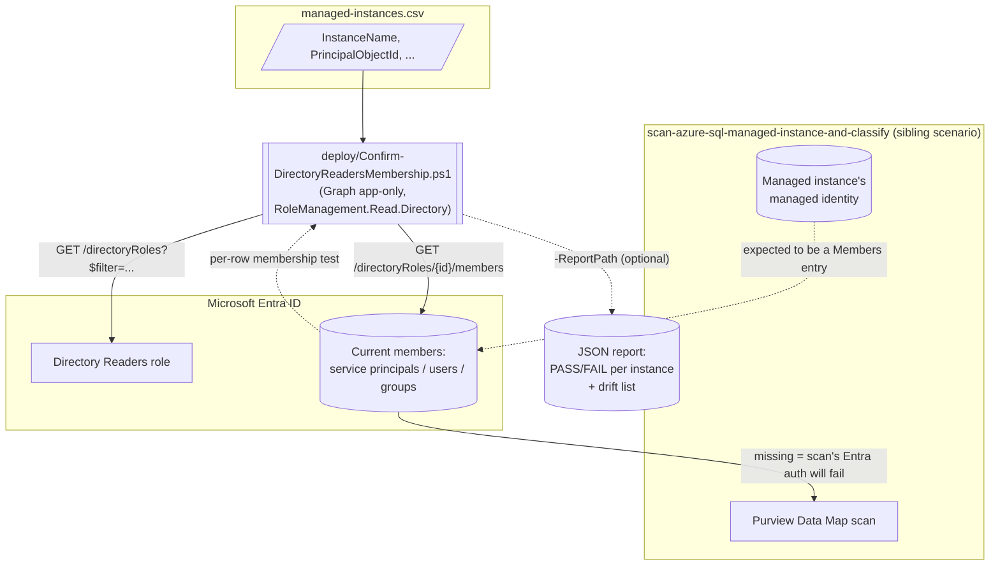

## 1. Scenario summary

A read-only Microsoft Graph checker that confirms every Azure SQL Managed Instance backing a
Microsoft Purview Data Map source ([`data-map/scan-azure-sql-managed-instance-and-classify`](/scenarios/data-map/scan-azure-sql-managed-instance-and-classify/))
still has its system-assigned managed identity as a current member of the Microsoft Entra ID
**Directory Readers** role — the prerequisite Managed Instance requires before Microsoft Entra
authentication works at all — and flags any *other*, unexpected member of that same tenant-wide role
as membership drift. Closes the Blue Team gap that scenario's own `reviews.md` flagged: its Purview
Data Map-scoped validate script has no reason to also hold a Graph directory-read permission.

**Who it's for:** a data governance or security team already running
`scan-azure-sql-managed-instance-and-classify` for one or more instances, who wants a scheduled,
unattended way to know — before a scan silently starts failing — that the Entra prerequisite it
depends on is still in place.

## 2. Business/regulatory driver

This scenario doesn't itself discover or classify data — it protects the *availability* of a
control that does. GDPR Art. 30, PCI DSS Requirement 3.2/12.5.2, and HIPAA §164.308 (cited by the
sibling scenario's own README.md §2) all depend on an accurate, *current* data inventory; a Data Map
scan that has silently stopped authenticating produces stale classification results that look
identical, in the Unified Catalog, to a scan that is still running correctly. Detecting the loss of
this one prerequisite before it causes an unnoticed classification-coverage regression is itself a
control-effectiveness/monitoring requirement most of the same frameworks expect (e.g. PCI DSS
Requirement 10's logging/monitoring intent, HIPAA's ongoing risk-analysis expectation) — this
scenario is the monitoring half of a control the sibling scenario only stands up once.

## 3. Prerequisites

Full licensing detail: `docs/licensing-matrix.md`. This scenario has **no licensing delta** —
reading a built-in Microsoft Entra ID directory role's membership is a Microsoft Entra ID Free-tier
capability, not a P1/P2 feature (`docs/licensing-matrix.md` §8–9 cover the *paid* Entra add-ons this
repo uses elsewhere; neither applies here).

| Requirement | Minimum | Notes |
|---|---|---|
| Run the checker itself (read Directory Readers membership) | Microsoft Graph application permission **`RoleManagement.Read.Directory`**, consented by a Global Administrator/Privileged Role Administrator once | Least-privileged option confirmed for both `Get-MgDirectoryRole` and `Get-MgDirectoryRoleMember` — see §12 |
| Resolve a member's friendly name in the drift report (optional, best-effort) | The same app registration additionally benefits from `User.Read.All`/`Group.Read.All`/application-level service-principal read access if drift members of those types appear | Falls back to a raw object ID + `(could not resolve)` label if not granted — never fails the run |
| Populate the inventory CSV's `PrincipalObjectId` column | **Reader** (or any role that can read resource properties) on each managed instance, to run `Get-AzSqlInstance` once per instance | One-time, per-instance; not needed again unless the instance is redeployed — see §5 |
| **Fix** a FAIL finding (grant Directory Readers) | **Privileged Role Administrator** | This scenario never performs the grant itself — see `design.md` §10 Non-goals and the sibling scenario's own README.md §3, which documents the same requirement for the *initial* grant |
| Automation identity for the Graph calls | App registration with the `RoleManagement.Read.Directory` application permission, admin-consented | Client-secret or certificate app-only OAuth2 — see `docs/automation-surface.md` §3 |

> **For the approval conversation:** `RoleManagement.Read.Directory` sounds higher-privilege than it
> is because of the word "RoleManagement" — it is a **read-only** permission (Microsoft's own
> reference confirms it as the *least*-privileged of the four alternatives for both cmdlets this
> scenario uses; the broader options are `RoleManagement.ReadWrite.Directory`, `Directory.Read.All`,
> `Directory.ReadWrite.All`) and grants no ability to assign, remove, or otherwise modify any role
> membership — see §12 reference 3/4. Lead an approval request with that distinction.

> Verify current role/permission names against `docs/rbac-model.md` and
> `docs/licensing-matrix.md` before a sales commitment.

> **Not a duplicate of Microsoft's own Purview data-source readiness checklist.** Microsoft
> publishes a separate, broader `data-map-data-sources-check-azure-readiness` script that validates
> the **Purview account's own managed identity** (Reader + `db_datareader` roles, network/firewall
> reachability, whether Microsoft Entra authentication is enabled on the SQL resource at all) —
> see §12 reference 11. It does not check Directory Readers membership for the **managed
> instance's own** identity specifically, which is the one, narrower prerequisite this scenario
> exists to monitor on an ongoing (not one-time-readiness) basis. Run both — they check different
> identities for different purposes.

## 4. Architecture



This scenario is intentionally decoupled from the sibling scenario's own object model — it reads
Microsoft Entra ID directly, never the Purview Data Map REST API. Full rationale:
`design.md` §3.

## 5. Step-by-step implementation

### Portal path (for a first manual walkthrough / to validate intent before scripting)

1. Microsoft Entra admin center → **Identity** → **Roles & administrators** → **Directory Readers**
   → **Assignments**. Confirm each Managed-Instance-backed Purview source's managed identity is
   listed. This is the same view the sibling scenario's README.md §7 check 4 already points at for
   a single instance — this scenario's script automates checking it across every instance in the
   inventory at once, plus the drift check the portal view doesn't do for you.
2. For each managed instance, obtain its managed identity's object ID (needed for step 4's CSV):
   ```powershell
   (Get-AzSqlInstance -ResourceGroupName 'rg-contoso-data' -Name 'mi-contoso-prod').Identity.PrincipalId
   ```
3. If a FAIL is found (an instance's identity is missing), remediate per the sibling scenario's own
   README.md §5 step 3 — either the Entra ID pane banner on the instance, or Microsoft's own
   published PowerShell script for this grant (cited in that scenario's README.md §12 reference 3) —
   both require a **Privileged Role Administrator**.

### Script path (idempotent, parameterized, dry-run capable)

```powershell
# 0. One-time: Connect to Microsoft Graph with the least-privileged permission
Connect-MgGraph -ClientId $AppId -TenantId $TenantId -CertificateThumbprint $Thumbprint
# App registration must hold the RoleManagement.Read.Directory application permission, admin-consented.

# 1. Build (or update) the inventory CSV — one row per Managed-Instance-backed Purview source
@'
InstanceName,ResourceGroupName,PurviewDataSourceName,PrincipalObjectId
mi-contoso-prod,rg-contoso-data,mi-contoso-prod-customerdb,<paste from step 5.2>
mi-contoso-eu,rg-contoso-data-eu,mi-contoso-eu-customerdb,<paste from step 5.2>
'@ | Set-Content -Path './managed-instances.csv'

# 2. Dry run — reports every finding, writes nothing
./deploy/Confirm-DirectoryReadersMembership.ps1 `
    -ManagedInstanceInventoryPath './managed-instances.csv' `
    -ReportPath './out/directory-readers-membership-report.json' `
    -WhatIf

# 3. Run for real — same findings, plus writes the JSON report
./deploy/Confirm-DirectoryReadersMembership.ps1 `
    -ManagedInstanceInventoryPath './managed-instances.csv' `
    -ReportPath './out/directory-readers-membership-report.json'

# 4. Validate the inputs/outputs (offline, no tenant connection needed)
./validate/Test-DirectoryReadersMembershipInputs.ps1 `
    -ManagedInstanceInventoryPath './managed-instances.csv' `
    -ReportPath './out/directory-readers-membership-report.json'
```

The deploy script uses the **Microsoft Graph PowerShell SDK** — automation surface 3 per
`docs/automation-surface.md` §1. Step 1 (building the CSV) is a one-time, out-of-band step this
script does not perform — see `design.md` §5.

## 6. Configuration reference

| Setting | Value this scenario uses | Notes |
|---|---|---|
| Directory role monitored | `Directory Readers` (built-in Entra role) | The specific role `scan-azure-sql-managed-instance-and-classify/README.md` §3 documents as required |
| Role lookup call | `Get-MgDirectoryRole -Filter "displayName eq 'Directory Readers'"` | Only returns roles *activated* at least once in the tenant — see §11 |
| Membership lookup call | `Get-MgDirectoryRoleMember -DirectoryRoleId <id> -All` | Returns member `Id` + `@odata.type` only; no display name — resolved best-effort for the drift report only |
| Least-privileged Graph permission | `RoleManagement.Read.Directory` (application) | Confirmed for both cmdlets above — §12 |
| Inventory CSV required columns | `InstanceName`, `PrincipalObjectId` | `ResourceGroupName`, `PurviewDataSourceName` optional, carried through into the report for readability only |
| Per-row verdict | `PASS` (current member) / `FAIL` (not a current member) | `FAIL` also raised for every row if the role has never been activated in the tenant — see §11 |
| Drift verdict | `WARN` per current member not present in the inventory | Never fails the run — a shared, tenant-wide-flavored role legitimately has members this inventory doesn't know about |
| Report format | JSON (`-ReportPath`), gated by `ShouldProcess`/`-WhatIf` | Only mutating side effect this script has — see `design.md` §7 |
| Exit code | Non-zero if any inventory row is `FAIL` | Drift (`WARN`) alone does not affect exit code — safe for a CI-style pre-flight gate |

Full cmdlet/permission grounding: `deploy/Confirm-DirectoryReadersMembership.ps1`'s inline comments
and its `.NOTES` block cite the exact Microsoft Learn reference pages.

## 7. Validation / how to prove it works

1. **Automated input/output check** — `./validate/Test-DirectoryReadersMembershipInputs.ps1`
   confirms the inventory CSV's shape (required columns, no empty/duplicate/non-GUID
   `PrincipalObjectId` values) and, if a report was already produced, that it parses and matches the
   inventory it should have been run against. Exits non-zero on any hard failure; needs no tenant
   connection — live-exercised during this scenario's build against both a clean and a deliberately
   malformed CSV (see `reviews.md`).
2. **Live run status** — the deploy script's own console output and exit code (§6) are the primary
   evidence; a `0` exit with `0 FAIL` findings means every inventoried instance's managed identity is
   currently a Directory Readers member.
3. **Cross-check against the portal** — Microsoft Entra admin center → **Identity** → **Roles &
   administrators** → **Directory Readers** → **Assignments** should list exactly the set this
   scenario's report shows as current members (inventory `PASS` rows + drift `WARN` entries
   combined).
4. **Negative-path evidence** — temporarily remove a test instance's identity from Directory
   Readers (in a non-production tenant) and confirm the next run reports it as `FAIL` with a
   non-zero exit code, then re-add it and confirm the next run returns to `PASS`.

## 8. Operations & tuning

**Recommended cadence:** daily or weekly, scheduled alongside (or just before) the sibling
scenario's own recurring scan trigger — catching a revoked Directory Readers grant *before* the next
scheduled scan run is strictly more useful than discovering it from a failed scan afterward.
Directory Readers membership changes far less often than, say, a DLP policy, so a daily/weekly
cadence (not hourly) is proportionate.

**KPIs / signal to watch:**
- **FAIL count trend.** Should be `0` in steady state. A new, unexpected `FAIL` is a near-immediate
  actionable signal — the affected instance's Purview scan (and any other Entra-authenticated
  connection to it) is now broken tenant-wide, not just for this scenario.
- **Drift (`WARN`) list membership.** Review each new entry once, confirm it's an authorized
  workload, and either add it to the inventory (if it's expected to be there going forward) or
  escalate to the identity/IAM team (if it isn't) — same Blue Team finding this scenario exists to
  close for the sibling scenario, generalized.

**Alerting note — exit code alone under-reports.** The script's exit code is non-zero only for a
`FAIL` (a missing expected member); a new `WARN` drift entry — someone else being added to a
tenant-wide, security-sensitive role — does **not** flip the exit code, by design (§6: drift is
informational, not fatal). A pipeline that gates only on exit code will silently miss new drift.
Wire your scheduler to also inspect the JSON report's `DriftMemberCount` (or diff the `DriftMembers`
array against the previous run) and alert a human on any increase, not just on a non-zero exit.

**Report history — timestamp `-ReportPath` per run.** Unlike this repo's rolling audit-trail export
scripts (e.g. [`compliance-manager/entra-privileged-role-monitoring`](/scenarios/compliance-manager/entra-privileged-role-monitoring/)), this script's
report is a **point-in-time snapshot** that overwrites whatever is at `-ReportPath` — it does not
merge or accumulate history itself (`design.md` §7). To trend the FAIL-count KPI above over time,
have the calling scheduler pass a date-stamped path each run (e.g.
`./out/directory-readers-membership-report-$(Get-Date -Format 'yyyy-MM-dd').json`) and retain the
series, rather than relying on a single overwritten file to answer "since when."

**Incident-response runbook:**
1. A new `FAIL` appears → confirm via the portal cross-check (§7.3) that it's real, not a stale
   inventory row (wrong `PrincipalObjectId`).
2. If real, escalate to a **Privileged Role Administrator** to re-grant Directory Readers to the
   affected instance's managed identity (sibling scenario's README.md §5 step 3).
3. Re-run this scenario's deploy script to confirm `PASS`, then independently re-run the sibling
   scenario's own `validate/Test-AzureSqlManagedInstanceDataMapScan.ps1` and trigger a fresh scan run
   to confirm end-to-end recovery — a Directory Readers `PASS` alone does not, by itself, prove the
   scan is healthy again (e.g. `db_datareader` or network-path prerequisites could independently be
   broken at the same time).

**Downstream use:** purely a health/pre-flight signal for `scan-azure-sql-managed-instance-and-classify`
and any future Managed-Instance-backed Purview source this repo adds — this scenario does not feed
classification, labeling, or DLP scenarios directly.

## 9. Rollback / decommission

This scenario creates no tenant state — see `rollback.md` for the full (short) procedure: stop the
schedule, decide the fate of any retained `-ReportPath` JSON files, and revoke the
`RoleManagement.Read.Directory` Graph permission grant from the automation app registration.

## 10. Cost & licensing notes

No licensing delta (§3). Reading a built-in Entra ID directory role's membership via Microsoft
Graph is available on every Entra ID tier, including Free. The only cost is the automation
identity's own hosting (e.g. a scheduled pipeline runner) — no Purview, Azure SQL, or Microsoft
Graph API call in this scenario is separately metered.

## 11. Known limitations & gotchas

- **The JSON report is itself sensitive — treat it like the privileged-role reconnaissance data it
  is.** Every report lists the **current full membership** of a tenant-wide, security-sensitive
  Entra role, by object ID and (best-effort) display name — exactly the information an attacker
  attempting privilege escalation would want. Do not write `-ReportPath` to a broadly-readable
  location (a public share, an unrestricted CI artifact bucket); restrict it the same way you would
  restrict output from [`compliance-manager/entra-privileged-role-monitoring`](/scenarios/compliance-manager/entra-privileged-role-monitoring/)'s own
  privileged-role audit trail. Flagged as a Red Team finding in `reviews.md`.
- **The inventory CSV's integrity determines the drift check's integrity.** Because drift is
  computed as "current members minus inventory rows," anyone who can edit
  `-ManagedInstanceInventoryPath` before a run can add an arbitrary object ID to it and make that
  principal's Directory Readers membership stop being reported as drift — silently defeating the one
  detection this scenario provides for an unauthorized addition to the role. Treat the inventory CSV
  as a change-controlled artifact (checked into source control with required review, not a freely
  editable local file) — same discipline as any other allowlist this repo's DLP scenarios already
  apply to their own approved-device lists. Flagged as a Red Team finding in `reviews.md`.
- **Role-not-yet-activated is indistinguishable from "definitely not a member" in this script's
  output — by design, not oversight.** `Get-MgDirectoryRole -Filter "displayName eq 'Directory
  Readers'"` only returns roles *activated* at least once in the tenant (Microsoft's own "List
  directoryRoles" reference). A brand-new tenant that has never granted Directory Readers to anyone
  reports every inventory row as `FAIL` with an explicit warning naming the cause — see `design.md`
  §7 — rather than a misleading "0 members, nothing wrong."
- **Does not distinguish an active grant from a PIM-eligible-but-not-activated one.**
  `Get-MgDirectoryRoleMember` returns only the role's active member set; a principal with only an
  eligible (not yet activated) Privileged Identity Management assignment correctly shows as `FAIL`
  here (Managed Instance's Entra authentication needs the active grant), but this scenario does not
  separately label that case as "eligible" versus "never granted" — see `design.md` §10 Non-goals.
- **Drift resolution is best-effort.** A drift member whose underlying object was since deleted (a
  stale directory reference) is reported with a `(could not resolve - possibly deleted)` label
  rather than a real display name — see the deploy script's `.NOTES`.
- **This scenario reports, it does not remediate.** See `design.md` §10 — consistent with this
  repo's established convention for high-privilege, one-time directory grants.
- **VERIFY (pilot tenant): `Get-MgDirectoryRoleMember`'s member-type coverage for this specific
  role.** Microsoft's reference documents the cmdlet as returning users, service principals, or
  groups generically; this scenario's own grounding pass found no worked example specific to
  Directory Readers confirming all three types can simultaneously appear as members of *this* role
  in practice (as opposed to being merely permitted by the general schema). The drift-resolution
  logic handles all three regardless, so this is a documentation/expectation gap, not a functional
  one.
- **Inherits the sibling scenario's own open VERIFY items** where relevant (e.g. the exact Case ID/
  object-ID format conventions Microsoft uses) — this scenario does not re-state them; see
  `scan-azure-sql-managed-instance-and-classify/README.md` §11.

## 12. References

1. [`data-map/scan-azure-sql-managed-instance-and-classify`](/scenarios/data-map/scan-azure-sql-managed-instance-and-classify/) — the sibling scenario this
   fragment protects; see its README.md §3/§7/§8 and `reviews.md` (Blue Team finding 1) for the
   original gap this scenario closes.
2. Get-MgDirectoryRole (Microsoft.Graph.Identity.DirectoryManagement module, `-Filter` parameter) — <https://learn.microsoft.com/powershell/module/microsoft.graph.identity.directorymanagement/get-mgdirectoryrole>
3. Get-MgDirectoryRoleMember (Microsoft.Graph.Identity.DirectoryManagement module, `-DirectoryRoleId`/`-All` parameters; `RoleManagement.Read.Directory` least-privileged application permission) — <https://learn.microsoft.com/powershell/module/microsoft.graph.identity.directorymanagement/get-mgdirectoryrolemember>
4. List directoryRoles (Microsoft Graph REST reference — confirms the operation "lists the directory roles that are activated in the tenant," the basis for this scenario's role-not-found handling) — <https://learn.microsoft.com/graph/api/directoryrole-list>
5. List members of a directory role (Microsoft Graph REST reference, `RoleManagement.Read.Directory` least-privileged permission) — <https://learn.microsoft.com/graph/api/directoryrole-list-members>
6. directoryRole resource type (`id`, `displayName`, `roleTemplateId` properties) — <https://learn.microsoft.com/graph/api/resources/directoryrole>
7. Directory Readers role in Microsoft Entra ID for Azure SQL (why Managed Instance needs it) — <https://learn.microsoft.com/azure/azure-sql/database/authentication-aad-directory-readers-role>
8. Assign Directory Readers role to a Microsoft Entra group and manage role assignments (the Managed-Instance-specific grant tutorial, same page the sibling scenario's own README.md §12 reference 3 cites) — <https://learn.microsoft.com/azure/azure-sql/database/authentication-aad-directory-readers-role-tutorial>
9. Managed Identity in Microsoft Entra for Azure SQL (`Get-AzSqlInstance`/`Identity.PrincipalId` pattern this scenario's inventory-building step uses) — <https://learn.microsoft.com/azure/azure-sql/database/authentication-azure-ad-user-assigned-managed-identity>
10. Microsoft Graph PowerShell SDK authentication and throttling guidance — `docs/automation-surface.md` §3/§5.
11. Check Azure data sources to register and scan in Microsoft Purview — Microsoft's own broader, one-time readiness checklist for the Purview account's managed identity (Reader/`db_datareader`/network/firewall/Entra-authentication-enabled checks); complementary to, not overlapping with, this scenario's Directory Readers-specific, ongoing check — see the §3 callout above — <https://learn.microsoft.com/purview/data-map-data-sources-check-azure-readiness>

> Re-verify all links and the least-privilege permission claim against current Microsoft Learn
> before a customer-facing deployment. **Grounding note:** this scenario's environment could not
> directly fetch `learn.microsoft.com` pages (egress-blocked in this build — see `PROGRESS.md`
> "Blocked / needs user"); all citations above are grounded via Microsoft Learn-hosted search
> results (URL + synthesized excerpt), corroborated across at least two independent queries per
> fact, not a verbatim page fetch. Re-verify with a direct fetch or the Microsoft Learn MCP tool
> when either is available before a customer-facing deployment.
