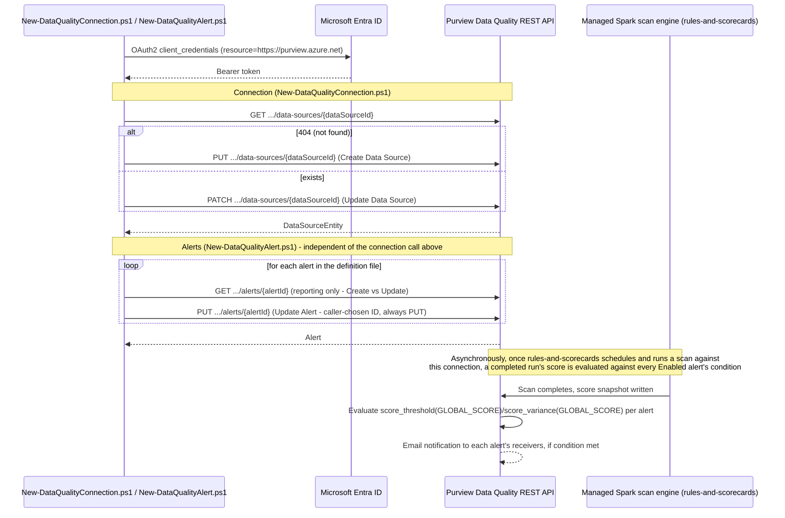

## 1. Problem statement

The sibling scenario `scenarios/data-quality/rules-and-scorecards/` scripts the rules and the
one-time scan schedule that turn a governed data asset into a scored one, but explicitly declines
to script two prerequisites it found insufficiently grounded at the time: the data-source
**connection** the scan authenticates through (blocked on an unconfirmed `computeId` provisioning
mechanism), and the score-threshold **alerts** that turn a score regression into a notification
(blocked on `Get Alerts`/`Update Alert` not having been independently fetched). Both are load-
bearing: without a connection, no scan can ever run; without an alert, a score regression produces
no notification at all — `rules-and-scorecards/README.md` Section 8 states plainly that the
scenario "should not be considered monitored" until an alert exists. This fragment closes both
gaps directly, following the same `PROGRESS.md` follow-up that scoped it.

## 2. Design goals

1. **Resolve the `computeId` blocker by grounding it, not by working around it.** This build fetched
   Create/Get/Update Data Source's own REST reference pages directly rather than re-stating the
   prior build's "no documented endpoint" finding as still-open. The finding held for the **VNet**
   path specifically, but a plain-language reading of the confirmed schema and worked examples
   narrows the actual gap — see Section 3 below.
2. **Script the common case fully; keep the narrow case honest.** A managed-identity connection to
   a public-network Microsoft-native source (the case every other Data Map/Data Quality scenario
   in this repo already assumes) is fully scriptable end to end with no unconfirmed fields. The
   managed-VNet path still has a genuine, disclosed gap (compute/private-endpoint provisioning is
   portal-only) — this scenario supports it via pass-through parameters rather than pretending the
   gap doesn't exist or silently dropping VNet support altogether.
3. **Alerts as a caller-addressed object, not a name-matched one.** Unlike Rules (whose REST
   surface only exposes a system-generated ID discoverable via `Get Rules`, forcing the sibling
   scenario's name-match-then-target-the-found-ID pattern), `Update Alert`'s own reference
   confirms the alert ID is caller-supplied and PUT-addressed directly. This is simpler and this
   scenario's script reflects that simplicity rather than importing the Rules script's
   existence-check machinery where it isn't needed.
4. **Compose with, don't duplicate, this repo's existing Data Quality scenario.** Same governance
   domain ("Customer Experience"), same data product ("Customer 360"), same data asset ("Customer"
   / Azure SQL `customerdb.dbo.Customers`) as `rules-and-scorecards` — a buyer evaluating this repo
   end to end sees one asset connected, ruled, scheduled, scored, *and* alerted, not four
   disconnected demos.
5. **Stay inside confirmed API surface.** Every request-body field this scenario's scripts send
   matches a field name and shape from a Microsoft-published worked example. Where a field's
   requiredness or a verb's exact create-vs-replace semantics could not be independently confirmed,
   the script's own idempotency is designed not to depend on the answer (Sections 4/5), and the gap
   is flagged inline rather than guessed past.

## 3. Resolving the `computeId` gap — what this build found

`rules-and-scorecards/README.md` Section 11 states: *"Creating the managed-identity connection
object (`Create Data Source` in the REST operation groups) requires a `computeId` field whose
provisioning mechanism this build could not independently confirm."* This build re-fetched Create
Data Source, Get Data Source, and Update Data Source directly and found:

- **Create Data Source's own worked example** is a **managed-VNet** connection
  (`isVNetEnabled: true`, resource names containing `vnet...`) and includes `computeId` alongside
  `managePrivateEndPointId`/`targetResourceId`.
- **Get Data Source's and Update Data Source's own worked examples** are **non-VNet** connections
  (an ADLS Gen2 connection with no `isVNetEnabled` field at all) and both **omit `computeId`
  entirely** from the returned/sent object — not present, not `null`, simply absent.
- A separate conceptual article, **"Set up managed virtual networks for data quality scans"**,
  independently confirms `computeId` names a **regional VNet compute location** that a **Governance
  Domain Administrator** provisions once per Azure region via **Settings > Unified Catalog >
  Virtual network** in the portal — a shared, per-region, per-Purview-account resource, not a
  per-connection or per-scan value. No REST "Get Compute"/"List Compute" operation appears in the
  Data Quality REST operation-group index (confirmed by fetching the full index directly) — the
  portal remains the only way to provision or read this ID back.

**Conclusion:** `computeId` is real, but it is a **managed-VNet-only** field, not a universal
requirement of `Create Data Source`. The prior build's gap was correctly identified but scoped too
broadly — it blocked the *entire* connection-scripting effort when it only blocks the VNet
sub-case. This scenario's `New-DataQualityConnection.ps1` scripts the non-VNet path (the common
case for every other Microsoft-native-source scenario in this repo) with no unconfirmed fields,
and supports the VNet path via `-EnableManagedVNet -ComputeId <pre-provisioned ID>` — the script
never tries to provision the compute location or private endpoint itself, since no REST path for
either was found. This is documented as a disclosed non-goal (Section 7), not silently dropped.

## 4. Object model and REST call sequence

The connection and alert calls are independent of each other — either script can run first, and
neither depends on the other having run. Both depend on the governance domain (and, for alerts,
the data product/data asset) already existing, matching every other Data Quality/Unified Catalog
scenario in this repo.

## 5. Key decisions

| Decision | Choice | Rationale |
|---|---|---|
| Deploy surface | Purview Data Quality REST API (`Invoke-RestMethod`), automation surface 4 | Same surface as `rules-and-scorecards` - no PowerShell module or Graph equivalent exists for these objects |
| Connection idempotency mechanism | Explicit `Get Data Source` existence check, then `PUT` (create) or `PATCH` (update) depending on the result | Unlike Rules' single-PUT idiom, Create Data Source and Update Data Source are two separately documented operations with different HTTP verbs - the script picks the one the existence check confirms is correct, rather than guessing which verb tolerates reuse |
| Connection scope shipped by default | Non-VNet, managed-identity, public-endpoint Azure SQL | Fully confirmed by Microsoft's own non-VNet worked examples (Get/Update Data Source) with no unconfirmed fields - see Section 3 |
| Managed-VNet support | Opt-in via `-EnableManagedVNet -ComputeId <id>`, never provisioned by the script | The compute location and managed private endpoint are Governance Domain Administrator-only portal actions with no discovered REST provisioning path - scripting a fabricated one would violate this repo's grounding rule |
| Alert idempotency mechanism | Direct `PUT .../alerts/{alertId}` with a caller-chosen ID from the definition file; `GET` first only for Created/Updated console reporting | `Update Alert`'s own reference confirms the ID is caller-supplied and PUT-addressed - no discovery step is needed to know which ID to target, unlike Rules |
| Alert `condition` functions shipped in the example definition file | `score_threshold(GLOBAL_SCORE)` and `score_variance(GLOBAL_SCORE)` | The only two functions present in Microsoft's own Update Alert/Get Alerts worked examples - no other function name is invented |
| Alert `receivers` value | Microsoft Entra object ID (GUID) | Every worked example in Microsoft's Alert REST reference pages uses a GUID, never a raw SMTP address/UPN - flagged as a VERIFY rather than assumed, since the portal's own conceptual doc calls the field a "recipient alias" without stating the resolved type |
| Alert scope granularity shipped in the example files | Both: asset-level (`customer-master-score-alerts.json`) and product-level (`customer-360-product-score-alert.json`, `dataAssetId` omitted) | `New-DataQualityAlert.ps1`'s scope-construction logic already treated `dataProductId`/`dataAssetId` as independently optional - no script change needed, only a second definition file. The `dataAsset`-omitted shape is inferred from the `AlertScope` schema reference (both fields independently optional) and corroborated by the portal's own Scope-tab wording, not confirmed by a Microsoft REST worked example - see README.md §11 |
| Alert pause/resume | Separate `-SetStatus Enabled|Disabled` path using `Update Alert Status` (PATCH) | A lighter-weight, purpose-built operation exists for exactly this - reusing the full `Update Alert` PUT to flip only `status` would be needlessly heavy and risk overwriting `condition`/`receivers`/`scopes` from a stale local definition file |
| Rollback default | Remove alerts only; connection removal is opt-in (`-RemoveConnection`) | The connection (especially on the managed-VNet path) is comparatively expensive to reprovision (compute location + private-endpoint approval workflow) - matching this repo's general staged-rollback pattern of removing the cheaper, faster-to-recreate object first |

## 6. What this scenario assumes already exists

- A Microsoft Purview account with Unified Catalog and Data Quality enabled (PAYG/DGPU metering
  active) — same prerequisite as `rules-and-scorecards`.
- A governance domain (this scenario's example reuses "Customer Experience", created by
  `scenarios/unified-catalog/curate-business-glossary/`).
- For the alert scopes: a data product and data asset already added to that domain, matching
  `rules-and-scorecards`' own "Customer 360" / "Customer" example (this scenario does not create
  either).
- For the managed-VNet path only: a VNet compute location already provisioned for the connection's
  Azure region (Settings > Unified Catalog > Virtual network in the portal, Governance Domain
  Administrator role) and, if the source requires it, an approved managed private endpoint.
- The automation identity (service principal) already holds Data Quality Steward (deploy) or Data
  Quality Reader (validate) on the target governance domain — same role model as
  `rules-and-scorecards`.

## 7. Non-goals

- This scenario does not create the governance domain, data product, or data asset it targets —
  see Section 6.
- This scenario does not provision a managed-VNet compute location or a managed private endpoint —
  both are Governance Domain Administrator-only portal actions with no REST endpoint this build
  could find; see Section 3.
- This scenario does not grant the Purview managed identity read access to the underlying source
  (e.g. `db_datareader` on the Azure SQL database) — a source-side action already documented by
  `scenarios/data-map/scan-azure-sql-and-classify/README.md` Section 8 for the same source.
- This scenario does not test the connection (the portal's own "Test connection" action) — no REST
  equivalent was found in this build's grounding pass; use the portal, or treat a successful scan
  run from `rules-and-scorecards` as the practical end-to-end proof.
- This scenario does not resolve a user's UPN/email into the Entra object ID `receivers` expects —
  the caller supplies the object ID directly in the definition file.
- This scenario does not attempt AI-assisted alert-threshold recommendations or any other
  portal-only, model-driven feature with no documented REST equivalent.
- **This scenario does not ship an audit-trail export script for connection/alert changes — not a
  deferred non-goal, a closed one.** A dedicated follow-up (tracked in `PROGRESS.md`, resolved and
  moved to `DONE`) set out to ground `Search-UnifiedAuditLog` coverage for these object lifecycles
  and add a companion script matching this repo's eDiscovery/Communication Compliance audit-trail
  scripts. It found, from three independent angles, that no such coverage exists yet for Unified
  Catalog governance-domain objects: Microsoft's own "Audit log activities" reference has no
  Unified Catalog section (Purview's only listed record type, `PurviewDataMapOperation`, is the
  classic Data Map API's own); the classic Data Map's data-plane Audit - Query REST API covers
  Atlas-model Data Map entities, which a Data Quality connection is not (§3); and an independent
  third-party analysis (March 2026) states plainly that comprehensive Unified Catalog audit logging
  "does not exist today." `README.md` §11 carries the full citation trail and the grounding-method
  caveat (this build's environment blocked a direct Microsoft Learn fetch; findings rest on
  `WebSearch` snippets of the cited pages, corroborated three ways). Re-open if Microsoft ships
  either a `RecordType`/`Operations` pair for these objects or a dedicated Data Quality audit
  endpoint.
