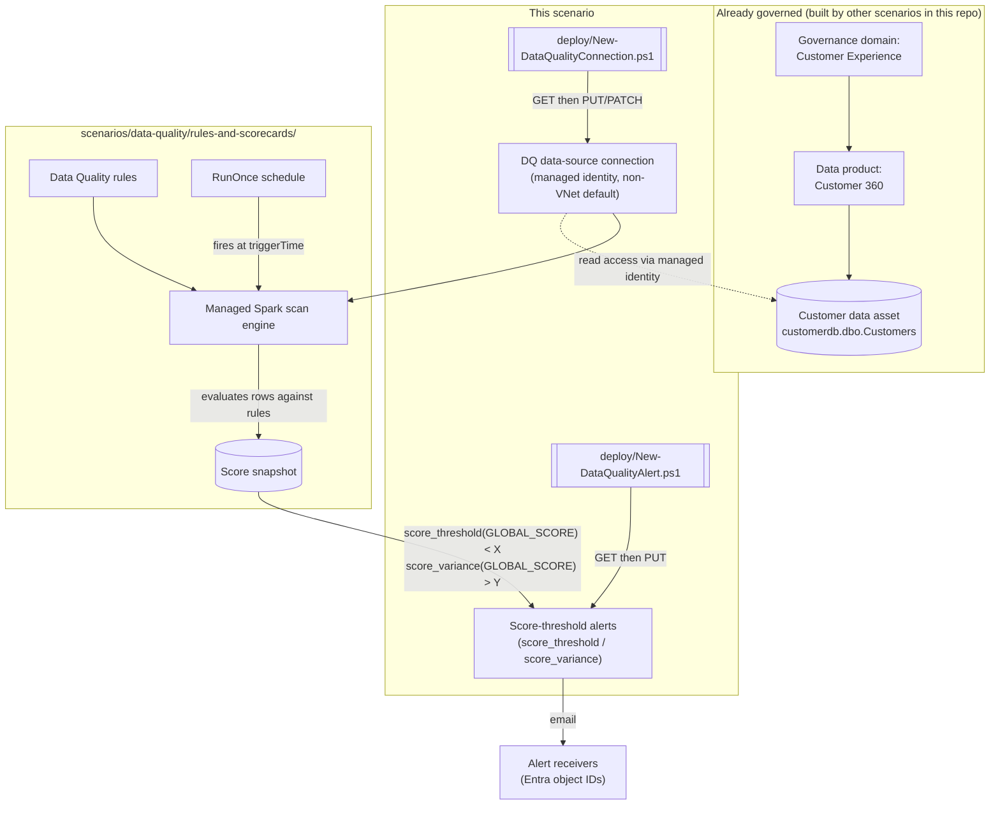

## 1. Scenario summary

> **Public Preview.** The Data Quality REST API for Unified Catalog this scenario automates is a
> Microsoft **Public Preview** surface as of this build — the portal experience is GA, but this
> scenario's *automation* rides on a preview API that can change without the notice a GA surface
> gets. Pilot before relying on it for a compliance commitment.

Scripts the two prerequisites the sibling scenario [`data-quality/rules-and-scorecards`](/scenarios/data-quality/rules-and-scorecards/)
deliberately left as portal-only steps: the **data-source connection** a Data Quality scan
authenticates through, and the **score-threshold alerts** that turn a score regression into an
email notification. Without a connection, no scan can run at all. Without an alert, a score
regression produces zero automatic notification — the sibling scenario's own operations guidance
states plainly it "should not be considered monitored" until one exists. This scenario closes both
gaps for the same "Customer" (Azure SQL `customerdb.dbo.Customers`) asset the sibling scenario
already scores, completing the connect → rule → schedule → score → **alert** chain end to end.

**Who it's for:** a data governance team that has already deployed `rules-and-scorecards` (or is
deploying it alongside this scenario) and needs the connection and alerting halves scripted and
code-reviewable, instead of the portal-only "Connections" and "Alerts" wizards under **Health
management > Data quality > Manage**.

## 2. Business/regulatory driver

Same driver as `rules-and-scorecards/README.md` Section 2 (BCBS 239 risk-data-aggregation
accuracy, GDPR Art. 5(1)(d) accuracy, SOX data-integrity controls) — a data quality score is only
evidence of a *monitored* control if a regression actually reaches a human. An unmonitored score is
indistinguishable, from a regulator's or auditor's perspective, from no scoring at all: nobody can
show they would have noticed a drop. This scenario is what turns "we compute a score" into "we are
notified when the score says something is wrong" — the operational half of the same compliance
claim, and the piece an auditor is most likely to test directly ("show me the alert that fired the
last time this dropped below threshold").

## 3. Prerequisites

Full licensing detail and citations: `docs/licensing-matrix.md`. Summary for this scenario (same
licensing/role family as `rules-and-scorecards/README.md` Section 3 — not repeated in full here):

| Requirement | Minimum | Notes |
|---|---|---|
| Microsoft Purview Data Quality | **PAYG only** — DGPU-metered, Basic/Standard/Advanced SKUs | No per-user M365 entitlement covers this feature — `docs/licensing-matrix.md` §2 [[1]](#references) |
| Deploy/manage the connection and alerts | **Data Quality Steward** role on the target governance domain | Same governance-domain-wide, sub-role composition (also requires Governance Domain Reader + Data Product Owner) as `rules-and-scorecards/README.md` §3 documents — [[2]](#references). Concretely for **this** scenario: that role lets its holder retarget an alert's `receivers` to any mailbox, or point a connection at any source, for **any** asset in the domain, not just "Customer" — a compromised or malicious holder of this role could silently redirect (not delete) a monitoring alert, which passes an existence check but defeats the control. §8 wires the validate script's receivers check into a recurring pipeline specifically to catch this. |
| Read the connection and alerts only (validation) | **Data Quality Reader** role on the target governance domain | Least-privilege for `validate/` — [[2]](#references) |
| The target governance domain, data product, and data asset already exist | Created by [`unified-catalog/curate-business-glossary`](/scenarios/unified-catalog/curate-business-glossary/) (domain) and assumed by [`data-quality/rules-and-scorecards`](/scenarios/data-quality/rules-and-scorecards/) (product/asset) | This scenario does not create any of the three — see `design.md` §6/§7 |
| The source database's own read grant | e.g. `db_datareader` on `customerdb` for the Purview managed identity | Source-side action, not scripted here — same grant `scenarios/data-map/scan-azure-sql-and-classify/README.md` §8 already documents for the same source |
| (Managed-VNet path only) A VNet compute location provisioned for the connection's Azure region | **Governance Domain Administrator** role, portal-only (**Settings > Unified Catalog > Virtual network**) | No REST provisioning endpoint found — see §11 and `design.md` §3 |
| Automation identity for the REST calls | App registration with **Data Quality Steward** (deploy) or **Data Quality Reader** (validate) Purview role on the governance domain | Client-secret app-only OAuth2, same token endpoint as `rules-and-scorecards` — `docs/automation-surface.md` §3 |

> Verify current entitlement names, DGPU pricing, and role names against `docs/licensing-matrix.md`
> and `docs/rbac-model.md` before a sales commitment — this is a **Public Preview** feature and its
> API surface, roles, and metering are explicitly subject to change [[3]](#references).

## 4. Architecture



The connection and alerts this scenario deploys are consumed by the sibling scenario's schedule and
rules — this scenario itself never triggers a scan. Full design rationale, including how the
`computeId` blocker the sibling scenario disclosed was narrowed to the managed-VNet case only:
`design.md`.

## 5. Step-by-step implementation

### Portal path (for a first manual walkthrough / to validate intent before scripting)

1. **Connection:** **Health management** → **Data quality** → select the governance domain →
   **Manage** → **Connections** → **New**. Choose **Data Map** or enter the Azure SQL server/
   database directly, test the connection, and **Submit** [[4]](#references). Grant the Purview
   managed identity `db_datareader` on the source database.
2. **(Managed-VNet only)** Before step 1, provision the region under **Settings** → **Unified
   Catalog** → **Virtual network**, then select **Enable managed V-Net** during connection setup
   and complete the private-endpoint approval flow on the storage/SQL resource's **Networking**
   blade [[5]](#references).
3. **Alerts:** same governance domain → **Manage** → **Alerts** → **New**. Enter a display name,
   choose **Score less than** or **Score decreased by more than** and a threshold, add a
   **Recipient**, define the **Scope** (data products/assets), and **Submit**
   [[6]](#references).
4. Confirm both objects independently: **Manage** → **Connections** shows the connection's status;
   **Manage** → **Alerts** lists the alert with its **Notifications** toggle.

### Script path (idempotent, parameterized, dry-run capable)

```powershell
# 1. Connection - dry run first (reports the exact REST call, changes nothing)
./deploy/New-DataQualityConnection.ps1 `
    -PurviewAccountEndpoint 'https://api.purview-service.microsoft.com' `
    -TenantId $TenantId -AppId $AppId -ClientSecret $ClientSecret `
    -ConnectionDefinitionPath './deploy/connection/customer-sql-connection.json' `
    -WhatIf

# 2. Connection - deploy for real (non-VNet, managed-identity, public-endpoint path)
./deploy/New-DataQualityConnection.ps1 `
    -PurviewAccountEndpoint 'https://api.purview-service.microsoft.com' `
    -TenantId $TenantId -AppId $AppId -ClientSecret $ClientSecret `
    -ConnectionDefinitionPath './deploy/connection/customer-sql-connection.json'

# 3. Alerts - deploy both asset-level example alerts (score threshold + score regression)
./deploy/New-DataQualityAlert.ps1 `
    -PurviewAccountEndpoint 'https://api.purview-service.microsoft.com' `
    -TenantId $TenantId -AppId $AppId -ClientSecret $ClientSecret `
    -AlertDefinitionPath './deploy/alerts/customer-master-score-alerts.json'

# 3b. (Optional) Alerts - deploy the product-level companion example instead of/alongside 3
#     One alert covers every asset in the 'Customer 360' data product (dataAssetId omitted) -
#     see the Configuration reference (Section 6) and Section 11 for the scope trade-off.
./deploy/New-DataQualityAlert.ps1 `
    -PurviewAccountEndpoint 'https://api.purview-service.microsoft.com' `
    -TenantId $TenantId -AppId $AppId -ClientSecret $ClientSecret `
    -AlertDefinitionPath './deploy/alerts/customer-360-product-score-alert.json'

# 4. Validate (connection + alerts together, or pass only one -*DefinitionPath to check just that half)
./validate/Test-DataQualityConnectionAndAlerts.ps1 `
    -PurviewAccountEndpoint 'https://api.purview-service.microsoft.com' `
    -TenantId $TenantId -AppId $AppId -ClientSecret $ClientSecret `
    -ConnectionDefinitionPath './deploy/connection/customer-sql-connection.json' `
    -AlertDefinitionPath './deploy/alerts/customer-master-score-alerts.json'
```

Both deploy scripts use the **Microsoft Purview Data Quality REST API for Unified Catalog** (Public
Preview) — automation surface 4 per `docs/automation-surface.md` §1, same surface as
`rules-and-scorecards`. Token acquisition follows the same client-credentials pattern.

## 6. Configuration reference

| Setting | Value this scenario uses | Notes |
|---|---|---|
| Connection type | `AzureSqlDatabase`, `ManagedServiceIdentity` credential, `Sql` scope | Matches the sibling scenario's Azure SQL "Customer" asset; managed identity is the only supported authentication for Microsoft-native sources [[4]](#references) |
| `isVNetEnabled` default | `false` | The scripted default targets the common, non-VNet case — see §11 and `design.md` §3 for why `computeId` is not required here |
| Managed-VNet opt-in | `-EnableManagedVNet -ComputeId <pre-provisioned id>` | Never provisions the compute location itself — portal/Governance Domain Administrator-only, see §11 |
| Alert `condition` functions | `score_threshold(GLOBAL_SCORE)`, `score_variance(GLOBAL_SCORE)` | The only two functions confirmed in Microsoft's own REST worked examples — `design.md` §5 |
| Alert `receivers` value | Microsoft Entra object ID (GUID) of a user or mail-enabled security group | Every REST worked example uses a GUID, never a raw SMTP address/UPN — see §11 VERIFY |
| Alert `enabledForFailedJobs` | `true` (example definition file default) | Also notifies receivers when the scan job itself fails (distinct from "scan succeeded, score is low") — matches the portal's "Turn on notifications for failed quality scan" option [[6]](#references) |
| Alert scope granularity | Asset-level (`customer-master-score-alerts.json`, both `dataProductId` + `dataAssetId`) **or** product-level (`customer-360-product-score-alert.json`, `dataProductId` only) | Same `New-DataQualityAlert.ps1` script deploys either shape — product-level scope is built automatically whenever `dataAssetId` is absent from a definition-file entry; see §11 for the grounding status of the product-only shape and the operational trade-off |
| API version pinned by both scripts | `2026-01-12-preview` | Confirmed current via direct fetch of Microsoft's REST reference at build time; **Public Preview** |

Full REST-body grounding: each deploy/validate script's inline comments and `.NOTES` block cite the
exact Microsoft Learn reference pages.

## 7. Validation / how to prove it works

1. **Automated config check** — `./validate/Test-DataQualityConnectionAndAlerts.ps1` confirms the
   connection exists with the expected type/region/VNet setting, and every alert exists with the
   expected condition/status/receivers. Exits non-zero on any hard failure.
2. **Connection reachability** — portal: **Manage** → **Connections** → select the connection →
   confirm status; or run/schedule a scan via `rules-and-scorecards` and confirm it completes
   rather than failing on a connection error (the sibling scenario's own runbook, `README.md` §8
   item (a), covers diagnosing a connection-side scan failure).
3. **Alert-fires proof** — after a scan completes with a score the alert's condition should trip
   (e.g. temporarily lower the `score_threshold` value above the asset's current score, or insert a
   bad row per `rules-and-scorecards/README.md` §7 negative test), confirm the configured
   `receivers` actually receive the notification email, then restore the original threshold.
4. **Alert-status proof** — run `New-DataQualityAlert.ps1 -SetStatus Disabled`, confirm via the
   validate script that the alert's `status` is now `Disabled`, then `-SetStatus Enabled` to
   restore it — proof the pause/resume path works independently of the full reconcile path.

## 8. Operations & tuning

**Choosing asset-level vs. product-level alert scope:** deploy `customer-master-score-alerts.json`
(asset-level) when an operator needs to know *which* asset regressed without an extra lookup step;
deploy `customer-360-product-score-alert.json` (product-level) when the data product has too many
assets for one alert each to stay manageable, and a first-triage "something in this product
regressed" notification is enough to start an investigation. The two are not mutually exclusive —
run both, or scope several product-level alerts to different asset subsets, per §11's grounding
caveat and trade-off note.

**KPIs to watch (first 30 days):**
- **Alert fire rate.** Zero fires in 30 days on a freshly deployed alert is ambiguous — it could
  mean the data is genuinely healthy, or that the threshold is set too loosely, or that no scan has
  run at all (check `rules-and-scorecards`' own schedule health first). A monthly review of "has
  this alert ever fired since deployment" is a minimum sanity check.
- **Connection health.** A Data Quality scan failure most commonly traces back to the connection
  (revoked managed-identity grant, source firewall change, or an expired/rotated credential on the
  source side) — `rules-and-scorecards/README.md` §8's incident-response runbook item (a) is this
  scenario's connection, made concrete.
- **Receivers list drift — accidental or adversarial.** This scenario's alert `receivers` are
  static Entra object IDs in a definition file — a person who leaves the data-product-owner role
  stops receiving alerts silently unless the definition file (and a re-run of
  `New-DataQualityAlert.ps1`) is updated. The same mechanism is also a stealth bypass: because
  **Data Quality Steward** is domain-wide (§3), anyone holding it can call `Update Alert` directly
  and repoint `receivers` away from the real distribution list without deleting the alert — it
  still exists, still shows `Enabled`, and still passes a naive "does the alert exist" check.
  **Do not treat a one-time post-deploy validate run as sufficient.** Wire
  `validate/Test-DataQualityConnectionAndAlerts.ps1` into a recurring pipeline (daily or per
  change), diffed against the source-controlled definition file under normal PR review — the same
  "declarative file, reviewed like any other policy change" discipline this repo already applies to
  DLP rules and label policies — so an out-of-band `receivers` change is caught as a validation
  failure, not discovered only when nobody was notified of a real regression.

**Alert routing:** route the alert's notification email into existing incident tooling (a shared
mailbox monitored by the data governance team, or a rule forwarding into a ticketing system) rather
than an individual's inbox — the same guidance `rules-and-scorecards/README.md` §8 already gives.

**Incident-response runbook (connection failure, distinct from "the alert fired because the score
is genuinely low"):**
1. **Triage** — check the connection's status under **Manage** → **Connections**, or via
   `Get Data Source`; a scan failure's error detail (portal **Monitoring** tab, or
   `rules-and-scorecards`' `Get Run Status`) usually names the specific cause.
2. **Classify the cause**, in order of likelihood: (a) the managed-identity read grant on the source
   was revoked or the source firewall/network rule changed; (b) for the managed-VNet path, the
   private endpoint's approval was revoked or the region's compute location was deleted (deleting a
   region removes every connection linked to it — [[5]](#references)); (c) the source schema
   changed and needs **Import schema** re-run (same as `rules-and-scorecards/README.md` §8 item
   (b)); (d) **someone recently ran this scenario's own rollback** (`rollback.md` Stage 2) and the
   sibling scenario's schedule wasn't repointed or paused first — ask whether a teardown happened
   recently before spending time on (a)-(c). **This has to stay a human question, not a query, for
   now** — a dedicated grounding pass (see §11) confirmed no programmatic audit trail exists yet for
   this action.
3. **Remediate** — re-apply the grant, re-approve the private endpoint, or re-import the schema,
   then re-run `validate/Test-DataQualityConnectionAndAlerts.ps1` before assuming the fix worked.
4. **Escalate** if failures recur after confirming the connection, grant, and (if applicable)
   private-endpoint state are all healthy.

**Review cadence:** review alert thresholds and receivers quarterly alongside the sibling
scenario's rule pass/fail/miscast review — a threshold set once at deployment and never revisited
tends to drift from what "acceptable" actually means for the asset as its data volume and use
change.

## 9. Rollback / decommission

See `rollback.md` for the full staged procedure. Quick reference:
`./deploy/Remove-DataQualityConnectionAndAlerts.ps1` removes the alerts only by default; add
`-RemoveConnection` (with `-ConnectionDefinitionPath`) to also delete the data-source connection.

## 10. Cost & licensing notes

- **PAYG, DGPU-metered, not per-user** — same billing family as `rules-and-scorecards/README.md`
  §10 and `docs/licensing-matrix.md` §2 [[1]](#references). Neither the connection object nor an
  alert definition itself is separately metered; cost is driven by the scans the connection
  authenticates, not by how many alerts watch the resulting scores.
- **The managed-VNet path has its own cost dimension** — a provisioned virtual-network compute
  location and any private endpoints are Azure networking resources with their own cost, separate
  from Data Quality's DGPU metering. Budget for this before enabling `-EnableManagedVNet` at scale
  across multiple regions.
- **Alert emails have no metering cost** beyond the DGPU cost of the scans that produce the scores
  they evaluate — but an alert with an overly broad scope (many data products/assets) or an overly
  sensitive threshold generates operational cost in the form of alert fatigue, not billing cost.

## 11. Known limitations & gotchas

- **`computeId` — narrowed, not eliminated.** This build confirmed `computeId` is required only for
  the managed-VNet connection path (Create Data Source's own worked example is VNet-enabled; Get/
  Update Data Source's own non-VNet worked example omits the field entirely) and is provisioned
  exclusively via the portal's **Settings > Unified Catalog > Virtual network** page by a
  Governance Domain Administrator — no REST "Get Compute"/"List Compute" operation exists in the
  current Data Quality REST operation-group index. `New-DataQualityConnection.ps1` scripts the
  non-VNet path fully; the managed-VNet path requires a pre-provisioned `-ComputeId` supplied by
  the caller. See `design.md` §3 for the full grounding trail.
- **VERIFY — whether `computeId` is truly optional (not merely absent) for a non-VNet connection.**
  Create Data Source's request-body property table does not mark any field required/optional
  explicitly (unlike its URI-parameter table, which does) — this build infers optionality from the
  shape of the confirmed non-VNet examples, not from an explicit requiredness statement. Confirm
  against a pilot tenant before assuming a non-VNet `Create Data Source` call can never fail for
  omitting it.
- **VERIFY — Create Data Source's create-vs-replace semantics against an already-existing
  `dataSourceId`, and Update Data Source's PATCH partial-merge-vs-full-replace semantics.** This
  scenario's script never depends on the answer (it always `GET`s first and picks the verb the
  result implies — `design.md` §5), but a production integration bypassing this script's existence
  check should confirm both.
- **VERIFY — `receivers`' accepted value type.** Every worked example in Microsoft's Alert REST
  reference pages shows a Microsoft Entra object ID (GUID), never a raw SMTP address or UPN, even
  though the portal's own conceptual documentation calls the equivalent field a "recipient alias."
  This scenario's scripts send whatever string the definition file supplies unmodified and do not
  attempt UPN-to-object-ID resolution.
- **VERIFY — `Update Alert`'s PUT semantics against an already-existing `alertId`.** Its own
  reference page states only "Creates an alert scoped to the specified business domain," with no
  explicit statement about reuse against an existing ID. Does not affect this scenario's
  idempotency (the ID is always caller-chosen and stable), but a direct caller of the raw API
  should confirm the behavior.
- **This scenario does not test the connection or grant source-side read access.** Both are
  documented manual/portal prerequisites (§3/§5) with no independently confirmed REST equivalent
  found in this build's grounding pass.
- **This scenario does not create the governance domain, data product, or data asset it targets.**
  Same non-goal as `rules-and-scorecards` — see `design.md` §6/§7.
- **No audit trail for connection/alert changes exists today — grounded and closed, not a
  remaining VERIFY.** A dedicated follow-up pass (tracked in `PROGRESS.md`) set out to ground
  `Search-UnifiedAuditLog`'s `RecordType`/`Operations` coverage for Data Quality connection/alert
  `Create`/`Update`/`Delete` actions and add a companion `Export-*AuditTrail.ps1` script matching
  this repo's eDiscovery scenarios' own pattern (see e.g.
  `scenarios/ediscovery/premium-legal-hold-and-export/deploy/Export-EdiscoveryAuditTrail.ps1`). That
  pass found the opposite of a grounding gap: **no such coverage exists to ground.** Three
  independent findings, none from a single source alone:
  1. Microsoft's own "Audit log activities" reference (the same page this repo's eDiscovery/
     Communication Compliance/Compliance Manager audit-trail scripts cite for their confirmed
     `RecordType`/`Operations` values) has no Unified Catalog, Data Quality, or governance-domain
     section — its Purview-related coverage is `PurviewDataMapOperation` (classic Data Map API
     calls: search, entity CRUD, classification) [[11]](#references), a different object model from
     the governance-domain-scoped Data Quality connection/alert objects this scenario's scripts
     call.
  2. The classic Data Map's own data-plane **Audit - Query** REST API (`POST
     .../datamap/api/audit/query`, `category`/`operationType` values like `Asset`/`EntityUpdated`)
     [[12]](#references) covers Atlas-model Data Map entities specifically — and Microsoft's own
     connection-setup documentation confirms a Data Quality connection is its own Unified Catalog
     object (optionally *pointing at* a Data Map-registered source) rather than a Data Map Atlas
     entity itself [[4]](#references), so this API's coverage doesn't reach it either.
  3. An independent, dated (March 2026) third-party analysis concludes plainly that comprehensive
     audit logging for Purview Unified Catalog "does not exist today" [[13]](#references) —
     corroborating (1) and (2) rather than standing alone.

  > **VERIFY (grounding caveat specific to this build):** this cloud execution environment's
  > egress policy blocks direct `WebFetch` access to `learn.microsoft.com` (same limitation
  > `PROGRESS.md`'s "Blocked / needs user" log recorded on 2026-09-09) and the Microsoft Learn MCP
  > tool was not present in this session's tool list either — findings 1 and 2 above are grounded
  > through `WebSearch`'s synthesized snippets of the cited Microsoft Learn pages (titles and URLs
  > confirmed real and on-topic), not a verbatim direct fetch. All three findings independently
  > point the same direction, which is why this is written as a confirmed conclusion rather than a
  > VERIFY — but re-confirm findings 1 and 2 with a direct fetch or the Microsoft Learn MCP tool
  > when either is available, before treating "no coverage exists" as final.
  No fourth, Unified-Catalog-specific audit mechanism was found. §8's incident-response runbook
  item (d) is phrased as a question to ask, not a query to run, because of this — not because the
  grounding was left incomplete. **Re-open this item** (in `PROGRESS.md`, not silently) if Microsoft
  ever documents a `RecordType`/`Operations` pair for Unified Catalog/Data Quality objects, or a
  dedicated Data Quality audit REST endpoint.
- **Alert scope granularity — asset-level and product-level example files both ship.**
  `customer-master-score-alerts.json` scopes both example alerts to the single "Customer" data
  asset (matching the sibling scenario's single-asset focus). `customer-360-product-score-alert.json`
  is the product-level companion: one alert covering every asset in the "Customer 360" data product,
  built by omitting `dataAssetId` from the alert entry — `New-DataQualityAlert.ps1` needed no code
  change to support this, since its scope-construction logic already treats `dataProductId` and
  `dataAssetId` as independently optional. **Grounding status:** Microsoft's own `Update Alert` REST
  worked example sets `dataProduct` and `dataAsset` together (asset-level scope); no worked example
  with `dataAsset` omitted was found. The `AlertScope` object's schema reference lists `dataAsset`
  and `dataProduct` as two separately optional `Reference` fields (neither documented as requiring
  the other), and the portal's own "Set up data quality alerts" conceptual doc describes the
  Scope tab as choosing "data products and data assets that the alert will monitor" as distinct
  selections — both corroborate but do not independently confirm the product-only shape a live
  `PUT` would need to accept it. Treat as inferred-from-schema, not pilot-tenant-confirmed, the same
  VERIFY class as the `receivers` UPN gap below.
  **Operational trade-off (Blue Team finding, `reviews.md` round 2):** a product-level alert tells
  an operator that *something* in "Customer 360" regressed, not *which* asset — for a product with
  more than a handful of assets, pair it with the portal's own per-asset score view (or scope
  additional product-level alerts more narrowly) rather than relying on it alone to localize a
  regression during incident response.
- **Public Preview.** The entire Data Quality REST API for Unified Catalog is Public Preview as of
  this build. Re-verify the operation set before a customer-facing deployment.

## 12. References

1. Microsoft Purview billing models / Data governance billing (DGPU) — <https://learn.microsoft.com/purview/purview-billing-models> and <https://learn.microsoft.com/purview/data-governance-billing>
2. Data governance roles and permissions in Microsoft Purview — <https://learn.microsoft.com/purview/data-governance-roles-permissions>
3. Data Quality API for Unified Catalog (Public Preview) — scope, GA-only coverage, lifecycle — <https://learn.microsoft.com/rest/api/purview/unified-catalog-data-quality>
4. Set up data source connection for data quality in Unified Catalog — <https://learn.microsoft.com/purview/unified-catalog-data-quality-supported-sources-connection>
5. Set up managed virtual networks for data quality scans in virtual network storage (compute provisioning, Governance Domain Administrator role, region-deletion cascade) — <https://learn.microsoft.com/purview/unified-catalog-data-quality-managed-virtual-networks>
6. Set up data quality alerts (portal workflow, Score less than / Score decreased by more than, required role, recipient/threshold concepts) — <https://learn.microsoft.com/purview/unified-catalog-data-quality-alerts>
7. Purview Data Quality REST reference — Create Data Source, Get Data Source, Update Data Source — <https://learn.microsoft.com/rest/api/purview/purviewdataquality/create-data-source/create-data-source?view=rest-purview-purviewdataquality-2026-01-12-preview>, <https://learn.microsoft.com/rest/api/purview/purviewdataquality/get-data-source/get-data-source?view=rest-purview-purviewdataquality-2026-01-12-preview>, <https://learn.microsoft.com/rest/api/purview/purviewdataquality/update-data-source/update-data-source?view=rest-purview-purviewdataquality-2026-01-12-preview>
8. Purview Data Quality REST reference — Update Alert, Get Alert, Get Alerts, Update Alert Status, Delete Alert — <https://learn.microsoft.com/rest/api/purview/purviewdataquality/update-alert/update-alert?view=rest-purview-purviewdataquality-2026-01-12-preview>, <https://learn.microsoft.com/rest/api/purview/purviewdataquality/get-alert/get-alert?view=rest-purview-purviewdataquality-2026-01-12-preview>, <https://learn.microsoft.com/rest/api/purview/purviewdataquality/get-alerts/get-alerts?view=rest-purview-purviewdataquality-2026-01-12-preview>, <https://learn.microsoft.com/rest/api/purview/purviewdataquality/update-alert-status/update-alert-status?view=rest-purview-purviewdataquality-2026-01-12-preview>, <https://learn.microsoft.com/rest/api/purview/purviewdataquality/delete-alert/delete-alert?view=rest-purview-purviewdataquality-2026-01-12-preview>
9. Purview Data Quality REST operation-groups index (2026-01-12-preview) — confirms no Get/List Compute operation exists — <https://learn.microsoft.com/rest/api/purview/purviewdataquality/operation-groups?view=rest-purview-purviewdataquality-2026-01-12-preview>
10. Purview Data Quality REST reference — Delete Data Source — <https://learn.microsoft.com/rest/api/purview/purviewdataquality/delete-data-source/delete-data-source?view=rest-purview-purviewdataquality-2026-01-12-preview>
11. Audit log activities (Microsoft Purview's confirmed `RecordType`/`Operations` reference; no Unified Catalog/Data Quality/governance-domain section — Purview coverage is `PurviewDataMapOperation`, the classic Data Map API's own record type) — <https://learn.microsoft.com/purview/audit-log-activities>
12. Audit - Query - REST API (Azure Purview) — the classic Data Map's own data-plane audit-history endpoint (`category`/`operationType`, e.g. `Asset`/`EntityUpdated`), covering Atlas-model Data Map entities, not Unified Catalog governance-domain objects — <https://learn.microsoft.com/rest/api/purview/datamapdataplane/audit/query>
13. "Microsoft Purview Unified Catalog Needs Audit Logs. Here's Why." (independent third-party analysis, March 2026; corroborates references 11/12 rather than standing alone) — <https://medium.com/@marcoOesterlin/microsoft-purview-unified-catalog-needs-audit-logs-heres-why-b208e83e1b94>

> Re-verify all links, API versions, and REST body shapes against current Microsoft Learn before a
> customer-facing deployment — this entire feature is **Public Preview**, and the VERIFY items in
> §11 should be closed against a pilot tenant first. References 11–12 could not be directly
> fetched in this build's execution environment (`learn.microsoft.com` egress was blocked) — see
> the VERIFY callout in §11 before treating the audit-coverage finding as pilot-tenant-confirmed.
