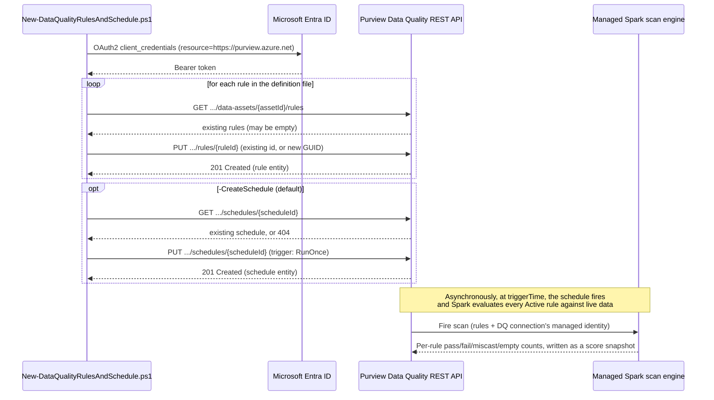

## 1. Problem statement

A data governance team has already located sensitive/important data (`scenarios/data-map/
scan-azure-sql-and-classify/`) and named/governed it (`scenarios/unified-catalog/
curate-business-glossary/`), but has no repeatable, code-reviewable way to answer "is this data any
good?" Hand-authoring rules through the Data Quality portal UI per asset doesn't scale, isn't
versioned, and can't be reviewed in a pull request the way a DLP or labeling policy in this repo can.
This scenario closes that gap for one governed data asset: a declarative JSON file defines the rules,
a script reconciles them against the asset via the (Public Preview) Data Quality REST API, and a
schedule turns them into an actual, dated score.

## 2. Design goals

1. **Declarative, versionable rule definitions.** Rules live in a JSON file under source control
   (`deploy/rules/*.json`), matching this repo's established pattern from `curate-business-glossary`'s
   glossary definition file — a rule change is a diff, not a portal click nobody can review.
2. **Idempotent without depending on unconfirmed API semantics.** Unlike Data Map's Scans object
   (explicitly documented as create-or-replace) or the Unified Catalog Terms API (POST create / PUT
   update, explicitly split), this build's grounding pass could not confirm whether Data Quality's
   `Create Rules` PUT is create-only or create-or-replace when reused against an existing `ruleId`.
   Rather than assume either way, this scenario's idempotency comes from the *existence check itself*:
   always look up any existing rule with the same `name` first (`Get Rules`), and always target that
   rule's own `id` if found. The PUT verb's exact semantics on a reused ID then don't matter — the
   script is correct either way.
3. **Type-agnostic rule engine, not a rule-type modeler.** Each of the six Purview-documented rule
   types (Freshness, Unique values, String format match, Data type match, Duplicate rows,
   Empty/blank fields, Table lookup, Custom) has its own `typeProperties` shape, and this build's
   grounding pass only directly confirmed four of them (`NotNull`, `Unique`, `TypeMatch`, `Duplicate`,
   `CustomTruth`) via Microsoft's own worked examples. Rather than build a PowerShell parameter set
   per rule type (risking a fabricated shape for a type this build didn't confirm), the deploy script
   passes each rule definition's `typeProperties` through to the API unmodified — the JSON file is the
   single source of truth for what each rule actually validates, and the script's job is only
   existence-reconciliation and the surrounding envelope (`id`/`name`/`status`/`businessDomain`/
   `dataProduct`/`dataAsset`).
4. **Stay inside GA-covered, confirmed API surface.** The Data Quality API for Unified Catalog is
   Public Preview and explicitly documents that it covers **GA features only** — no alerting,
   schema-import, or preview-feature coverage (`README.md` reference 12). This scenario's scope (rules
   + a one-time schedule + score read-back) stays inside that boundary; alert configuration and
   recurring schedules are documented as portal-only rather than scripted with a guessed shape.
5. **Compose with, don't duplicate, this repo's existing Data Governance scenarios.** This scenario
   targets the same "Customer" asset/domain narrative already established by
   `scan-azure-sql-and-classify` (the Azure SQL source) and `curate-business-glossary` (the
   "Customer Experience" governance domain and "Customer"/"Customer ID" terms) — a buyer evaluating
   this repo end-to-end sees one coherent data asset governed, cataloged, and scored, not three
   disconnected demos.

## 3. Why Unified Catalog Data Quality (not a custom Great Expectations/dbt-test pipeline)

- **A custom data-quality pipeline** (Great Expectations, dbt tests, a hand-rolled Spark job) can
  express arbitrary checks, but produces scores and dashboards that live *outside* Purview — a
  reviewer checking this data asset's governance posture in Unified Catalog sees nothing. It also
  duplicates infrastructure (compute, scheduling, alerting) Microsoft already operates for this
  purpose.
- **Purview Data Quality** scores are visible exactly where the asset, its glossary terms, its
  classification, and its lineage already live — the same governance domain / data product a data
  consumer is already browsing. This is the product-idiomatic choice for a Purview-centered
  governance program, and it's the one Microsoft's own roadmap (AI-assisted rule generation, health
  reporting, observability) is investing in.
- A buyer with an existing dbt-test/Great Expectations investment isn't forced to abandon it — Custom
  (SQL or ADF-expression) rules in this scenario can encode the same logical checks a dbt test would,
  so the *checks* can be ported even if the *execution engine* changes.

## 4. Object model and REST call sequence

Every rule PUT and the schedule PUT are, by this design, always targeted at a caller-known ID (an
existing rule/schedule's own ID, or a freshly generated GUID) — see Design goal 2 for why this makes
the script's idempotency independent of whichever create/replace semantics the API actually
implements.

## 5. Key decisions

| Decision | Choice | Rationale |
|---|---|---|
| Deploy surface | Purview Data Quality REST API (`Invoke-RestMethod`), automation surface 4 | No PowerShell module or Graph equivalent exists for rule/schedule objects — same surface-4 idiom as Data Map and Unified Catalog Terms in this repo |
| Idempotency mechanism | Explicit `Get Rules`/`Get Schedule` existence check before every PUT, always targeting a known ID | Doesn't depend on unconfirmed create-vs-replace semantics for `Create Rules`'s PUT verb — see Design goal 2 |
| Rule body construction | Pass-through `typeProperties` from the JSON definition file | Avoids fabricating a shape for any rule type this build's grounding didn't directly confirm — Design goal 3 |
| Rule types shipped in the example definition file | `NotNull`, `Unique`, `TypeMatch`, `Duplicate`, `CustomTruth` — omitting `Freshness` | The four (plus Custom) directly confirmed via Microsoft's own REST examples; Freshness is explicitly unsupported for Azure SQL, this scenario's target source type |
| Default rule status | `Active` | Matches the portal's default for a newly authored rule; `-RuleStatus Draft` is available for a review-before-activation workflow, matching this repo's dry-run-first ethos |
| Schedule trigger type | `RunOnce` only | The only trigger shape this build's grounding independently confirmed in the REST schema — see `README.md` §11 VERIFY rather than guessing a `Recurrence` shape |
| Data-source connection | Not scripted — portal prerequisite | `Create Data Source`'s body requires a `computeId` this build found no documented provisioning endpoint for — see `README.md` §11 |
| Alert configuration | Not scripted — portal prerequisite | `Get Alerts`/`Update Alert` REST operations exist per the operation-group index but weren't independently fetched/grounded in this build — flagged as a follow-up, not guessed |

## 6. What this scenario assumes already exists

- A Microsoft Purview account with Unified Catalog and Data Quality enabled (PAYG/DGPU metering
  active).
- A governance domain, data product, and data asset already created and populated — this repo's
  `curate-business-glossary` scenario creates the governance domain and glossary terms for the
  "Customer Experience" domain this scenario's example targets, but does **not** create a data
  product or add a data asset to one (see that scenario's own `design.md` §7 non-goals) — a data
  products scenario is a tracked follow-up in `PROGRESS.md`.
- The target data asset's source already registered and scanned in Data Map
  (`scenarios/data-map/scan-azure-sql-and-classify/` for the Azure SQL example this scenario reuses).
- A Data Quality connection to that source already configured via the portal, with the Purview
  managed identity granted read access (§7 below covers why this isn't scripted).

## 7. Non-goals

- This scenario does not create the governance domain, data product, or data asset it targets — see
  §6.
- This scenario does not create the Data Quality data-source connection (managed-identity credential)
  the scan authenticates with — the `Create Data Source` REST operation's `computeId` field has no
  documented provisioning path this build could confirm; see `README.md` §11.
- This scenario does not configure score-threshold alerts — `README.md` §8/§11 documents this as a
  portal-only step pending independent REST grounding of the `Get Alerts`/`Update Alert` operations.
- This scenario does not implement a recurring (daily/weekly/monthly) scan schedule via the REST API —
  only the confirmed `RunOnce` trigger type is scripted; see `README.md` §11.
- This scenario does not attempt AI-assisted/autogenerated rule suggestions (`Suggest rules` in the
  portal) — that is an interactive, model-driven portal feature with no documented REST equivalent in
  this build's grounding pass.
- This scenario does not create data profiling jobs (a separate, earlier lifecycle step — "Profile"
  operation group) — the example rules are authored directly, as a buyer with existing knowledge of
  their schema would, rather than derived from a profiling pass this scenario doesn't run.
