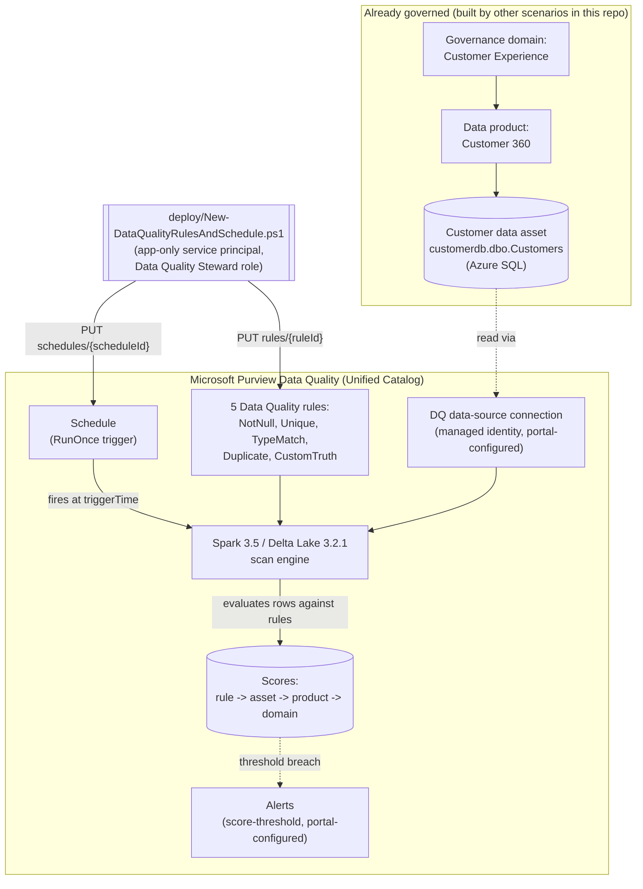

## 1. Scenario summary

> **Public Preview.** The Data Quality REST API for Unified Catalog this scenario automates is a
> Microsoft **Public Preview** surface as of this build (December 2025 GA-only API coverage, see
> §11), the portal experience is GA, but this scenario's *automation* rides on a preview API that
> can change without the notice a GA surface gets. Pilot before relying on it for a compliance
> commitment.

Deploys a set of Microsoft Purview Unified Catalog **Data Quality** rules, covering completeness,
uniqueness, conformity, and accuracy, against an already-governed data asset (a data asset already
registered in Data Map, scanned, and added to a Unified Catalog data product), then schedules a
one-time scan so those rules produce a **data quality score**: at the rule level, rolled up to the
asset, the data product, and the governance domain. This is the scenario that turns "we scanned and
classified the data" (`scenarios/data-map/scan-azure-sql-and-classify/`) and "we named and governed
the data" (`scenarios/unified-catalog/curate-business-glossary/`) into "we can prove, with a number,
whether the data is actually trustworthy", the third leg of this repo's Data Governance stack.

**Who it's for:** a data governance team or data product owner who has a data asset already onboarded
to Unified Catalog and needs a repeatable, code-reviewable way to define its data quality rules and
scoring cadence, instead of hand-clicking through the **Health management > Data quality** portal UI
per asset.

## 2. Business/regulatory driver

Regulators and internal risk functions increasingly require organizations to be able to *demonstrate*
data quality, not just claim it. BCBS 239 (risk data aggregation and risk reporting) requires banks to
maintain "accuracy and integrity" of risk data with automated reconciliation, not manual spot checks.
GDPR Art. 5(1)(d)'s accuracy principle requires personal data to be "accurate and, where necessary,
kept up to date." SOX financial-reporting controls depend on the integrity of the data feeding them.
And in the AI era, Microsoft's own product framing for this feature is explicit: "the reliability of
data directly impacts the accuracy of AI-driven insights... without trustworthy data, there's a risk
of eroding trust in AI systems and hindering their adoption", directly relevant to
any buyer already running `scenarios/dspm-for-ai/copilot-sensitive-data-exposure/` in this repo, since
a Copilot answer is only as trustworthy as the governed data it's grounded in.

This scenario gives that claim a number: a **Customer** data asset's data quality score, computed from
named, versioned, code-reviewed rules, auditable evidence for a risk committee, a regulator, or an
internal data-trust program, instead of "we believe the customer data is generally fine."

## 3. Prerequisites

Full licensing detail and citations: [Licensing matrix](/docs/licensing-matrix/). Summary for this scenario:

| Requirement | Minimum | Notes |
|---|---|---|
| Microsoft Purview Data Quality | **PAYG only**, metered in **Data Governance Processing Units (DGPU)**, Basic/Standard/Advanced SKUs | No per-user M365 entitlement covers this feature, see [Licensing matrix §2](/docs/licensing-matrix/#2-master-capability--license-matrix) |
| Deploy/manage rules, schedules, and alerts | **Data Quality Steward** role on the target governance domain | A *sub-role*: requires the user/service principal to **also** hold **Governance Domain Reader** and **Data Product Owner** on that domain, see §5 and. **This role is granted at the governance-domain level, not per data product or per asset**, a service principal holding it for "Customer Experience" can create, edit, or delete Data Quality rules on *any* asset in *any* data product inside that domain, not just the one this scenario targets. There is no narrower, asset-scoped role documented for this action; treat the automation identity's credential with the same care as any domain-wide write credential, and review governance-domain role membership periodically ([RBAC model §9](/docs/rbac-model/#9-microsoft-intune-rbac-a-fifth-system-for-intune-deployed-scenarios)) |
| Read rules and scores only (validation) | **Data Quality Reader** role on the target governance domain | Least-privilege for the read-only `validate/` script; same sub-role composition as above |
| The target data asset already exists in Unified Catalog | Registered + scanned in Data Map (`scenarios/data-map/scan-azure-sql-and-classify/`), then added to a data product in a governance domain | This scenario does **not** create the governance domain, data product, or data asset, see §7/`design.md` §7 |
| A Data Quality **connection** to the source is configured | Portal-only in this build (§5), managed identity is the **only** supported authentication option for DQ scans on Microsoft-native sources (Azure SQL, ADLS Gen2, Fabric, Synapse, Azure SQL Managed Instance) | See §11 for why this scenario doesn't script the connection object |
| Automation identity for the REST calls themselves | App registration with **Data Quality Steward** (deploy) or **Data Quality Reader** (validate) Purview role on the governance domain | Client-secret app-only OAuth2, same token endpoint as Data Map/Unified Catalog, [Automation surface §3](/docs/automation-surface/#3-authentication-patterns-interactive-vs-unattended) |

> Verify current entitlement names, DGPU pricing, and role names against [Licensing matrix](/docs/licensing-matrix/)
> and [RBAC model](/docs/rbac-model/) (dated 2026-09-03) before a sales commitment, this is a **Public Preview**
> feature and its API surface, roles, and metering are explicitly subject to change.

## 4. Architecture



Rules and the schedule are both created against **existing** governance-domain/data-product/data-asset
IDs, this scenario's deploy script never creates or discovers those IDs, it only takes them as input
(from the JSON definition file). The scan itself runs on Microsoft-managed Apache Spark, authenticating
to the source via the DQ connection's managed identity, the same "no credential to manage" pattern
this repo already uses for Data Map scanning. Full design rationale: `design.md`.

## 5. Step-by-step implementation

### Portal path (for a first manual walkthrough / to validate intent before scripting)

1. Confirm the target asset is already in Unified Catalog: **Data Map** → source registered and
 scanned; then **Unified Catalog** → the asset added to a **data product** inside a **governance
 domain**.
2. Assign the automation identity's *human* counterpart (or, for this walkthrough, yourself) the
 **Data Quality Steward** role: in the governance domain, select **Roles** → add the user under
 **Data Quality Steward**. This role requires **Governance Domain Reader** and
 **Data Product Owner** to already be held on the same domain, assign those first if not already
 present.
3. Set up the **Data Quality connection**: **Health management** → **Data quality** → select the
 governance domain → **Manage** → **Connections** → **New**. Choose **Data Map** as the source type
 (simplest, reuses the already-scanned Data Map registration), test the connection, and **Submit**
. Grant the Purview managed identity the source-appropriate read role (e.g.
 `db_datareader` for Azure SQL, the same grant `scenarios/data-map/scan-azure-sql-and-classify/`
 already documents).
4. Navigate to the asset's **Data quality** page (**Health management** → **Data quality** → domain →
 data product → asset) and select **Rules** → **New rule** to author each rule interactively, this
 is the portal equivalent of what the script in §5's script path does in bulk from a JSON file
.
5. Select **Run quality scan** for an immediate ad hoc run, or **Manage** → **Scheduled scans** → **New**
 for a recurring cadence (the portal supports daily/weekly/monthly recurrence, see §11 for why this
 scenario's script only schedules a one-time run).
6. After the scan completes, review the score on the asset's **Overview** tab, and the roll-up report
 at **Health management** → **Reports** → **Data quality** for the product/domain view
.

### Script path (idempotent, parameterized, dry-run capable)

```powershell
# 1. Deploy (dry run first - reports every REST call that would be made, changes nothing)
./deploy/New-DataQualityRulesAndSchedule.ps1 `
    -PurviewAccountEndpoint 'https://api.purview-service.microsoft.com' `
    -TenantId $TenantId -AppId $AppId -ClientSecret $ClientSecret `
    -RulesDefinitionPath './deploy/rules/customer-master-data-quality-rules.json' `
    -WhatIf

# 2. Deploy for real - rules land Active, a one-time scan is scheduled 5 minutes out
./deploy/New-DataQualityRulesAndSchedule.ps1 `
    -PurviewAccountEndpoint 'https://api.purview-service.microsoft.com' `
    -TenantId $TenantId -AppId $AppId -ClientSecret $ClientSecret `
    -RulesDefinitionPath './deploy/rules/customer-master-data-quality-rules.json'

# 3. Land rules in Draft for review first, without triggering a scan
./deploy/New-DataQualityRulesAndSchedule.ps1 `
    -PurviewAccountEndpoint 'https://api.purview-service.microsoft.com' `
    -TenantId $TenantId -AppId $AppId -ClientSecret $ClientSecret `
    -RulesDefinitionPath './deploy/rules/customer-master-data-quality-rules.json' `
    -RuleStatus Draft -CreateSchedule:$false

# 4. Validate (after the scheduled scan has had time to complete)
./validate/Test-DataQualityRulesAndScorecard.ps1 `
    -PurviewAccountEndpoint 'https://api.purview-service.microsoft.com' `
    -TenantId $TenantId -AppId $AppId -ClientSecret $ClientSecret `
    -RulesDefinitionPath './deploy/rules/customer-master-data-quality-rules.json'
```

The deploy script uses the **Microsoft Purview Data Quality REST API for Unified Catalog** (Public
Preview), automation surface 4 per [Automation surface §1](/docs/automation-surface/#1-five-automation-surfaces-not-one-read-this-first), because rule and schedule
objects have no Security & Compliance PowerShell or Graph equivalent. Token acquisition follows the
same client-credentials pattern already used by this repo's other surface-4 scripts.

## 6. Configuration reference

| Setting | Value this scenario uses | Notes |
|---|---|---|
| Rule types deployed | `NotNull`, `Unique`, `TypeMatch`, `Duplicate`, `CustomTruth` | Confirmed API `type` values, taken directly from Microsoft's own Get Rules / Create Rules reference examples |
| Rule dimensions | Completeness, Uniqueness, Conformity, Accuracy (×2) | Matches the six-dimension model (Accuracy/Completeness/Conformity/Consistency/Timeliness/Uniqueness) Microsoft documents for Data Quality reporting, this scenario deliberately omits **Freshness**, which isn't supported for Azure SQL sources |
| Rule `status` on create | `Active` (default), or `Draft` via `-RuleStatus` | Draft rules don't run during a scan and don't contribute to the global score, a safe landing state for review |
| Rule cap per asset | 200 active rules | Product-enforced; a scan fails outright above this, see §11 |
| Schedule trigger type | `RunOnce` only | The only trigger type this build's grounding confirmed in the REST schema, see §11 |
| Scan authentication | Managed identity only (Microsoft-native sources) | Portal-configured DQ connection prerequisite, not scripted, see §11 |
| API version pinned by this script | `2026-01-12-preview` | Confirmed current via direct fetch of Microsoft's REST reference at build time; **Public Preview**, covers GA Data Quality features only, not alerting/schema-import/preview features |

Full REST-body grounding: `deploy/New-DataQualityRulesAndSchedule.ps1` inline comments and its
`.NOTES` block cite the exact Microsoft Learn reference pages.

## 7. Validation / how to prove it works

1. **Automated config check**, `./validate/Test-DataQualityRulesAndScorecard.ps1` confirms every
 rule in the definition file exists with the expected status, the schedule exists, and (once a scan
 has run) reports the asset's current score. Exits non-zero on any hard failure.
2. **Scan run status**, portal: **Health management** → **Data quality** → domain → data product →
 asset → **Monitoring** shows the run's status (queued/running/completed/failed) and pass/fail row
 counts per rule.
3. **Score evidence**, the asset's **Overview** tab shows the rolled-up global score and per-rule
 history (last 50 runs); the `Get Asset Scores For Asset DQ` call the validate
 script makes returns the same number programmatically.
4. **Negative test**, temporarily insert (in a non-production copy of the source data) a row with a
 duplicated `CustomerId`, re-run the scan, and confirm the `Unique_values_CustomerId` rule's pass
 count drops and the asset's global score decreases proportionally, this is the concrete proof the
 rule is actually evaluating live data, not a static portal toggle.
5. **Draft-vs-Active proof**, deploy with `-RuleStatus Draft`, confirm via the validate script that
 the rules exist but the asset score is unaffected (still whatever it was before, or unavailable if
 no `Active` rule has ever run), then re-deploy with the default `Active` and confirm the score
 changes on the next run.

## 8. Operations & tuning

**KPIs to watch (first 30 days):**
- **Asset/data-product/domain global score trend**, a steady score near 100% with sudden drops
 flags an upstream data-pipeline regression faster than a downstream report catching the symptom.
- **Passed vs. failed vs. miscast vs. empty row counts per rule** (from `Get Runs For Asset`/the
 portal's rule-level **History** tab), a rule with a persistently high **miscast** count usually
 means the rule's target type or format doesn't match the real data shape and needs tuning, not that
 the data itself is bad.
- **Scan failure rate**, a Data Quality scan failure (distinct from a low *score*, which means the
 scan succeeded and found bad data) usually points at the DQ connection, not the rules, see the
 runbook below.

**Alert routing:** configure score-threshold alerts (**Score less than X%**, or **Score decreased by
more than X%**) per governance domain via **Manage** → **Alerts** in the portal, this is a
**Data Quality Steward**-only action with no independently confirmed REST endpoint in this build's
grounding pass (`Update Alert`/`Get Alerts` operation groups exist per the REST index, but were not
independently fetched and verified for this fragment; see §11). Alerts email a
configured recipient/distribution list on every scan, not just failures, route that mailbox into
existing incident tooling rather than leaving it as an unmonitored inbox.

**Do not treat this scenario as "monitored" until at least one alert is configured.** This
scenario's deploy script creates rules and a schedule but, per the VERIFY above, does **not**
configure alerting. Without it, a score regression (or a rule silently left in `Draft` after a
review that never happened, see §11) produces **no notification at all**; the only way to notice
is someone manually opening the portal or re-running `validate/Test-DataQualityRulesAndScorecard.ps1`.
Treat portal alert configuration as a go-live gate for this scenario, not an optional enhancement,
and additionally wire `validate/Test-DataQualityRulesAndScorecard.ps1` (with `-ExpectedRuleStatus
Active`) into an existing CI/ops pipeline on a recurring cadence so an unintentional Draft/removed
rule is caught even if the portal alert channel is missed or muted.

**Incident-response runbook (a scan fails outright, distinct from "the score is just low"):**
1. **Triage**, check the run status in **Health management** → **Data quality** → **Monitoring**
 for the specific error, or via `Get Run Status`/`Get Runs For Asset`.
2. **Classify the cause**, in order of likelihood: (a) the DQ connection's managed-identity grant on
 the source was revoked or the source's firewall changed (same failure class as the Data Map
 scenario's runbook, see `scenarios/data-map/scan-azure-sql-and-classify/README.md` §8); (b) the
 source schema changed and needs **Import schema** re-run before the next scan;
 (c) more than 200 active rules are on the asset (product-enforced cap, see §11);
 (d) a transient Spark/service-side issue, safe to let the next scheduled run retry.
3. **Remediate**, re-apply the specific broken grant, re-import the schema, or deactivate the
 lowest-priority rules to get under the 200-rule cap, then re-run
 `validate/Test-DataQualityRulesAndScorecard.ps1` before assuming the fix worked.
4. **Escalate** if failures recur after confirming the connection, schema, and rule count are all
 healthy, a Purview-service-side issue worth a support case.

**Review cadence:** review rule pass/fail/miscast trends monthly with the data product owner; a rule
that has passed 100% for months may be a candidate to retire (or tighten) rather than keep running at
cost, and a rule with a persistent miscast rate needs its `typeProperties` corrected, not more scans.

## 9. Rollback / decommission

See `rollback.md` for the full staged procedure (remove schedule → optionally remove rules). Quick
reference: `./deploy/Remove-DataQualityRulesAndSchedule.ps1` removes the schedule only by default; add
`-RemoveRules` to also delete the rules from the asset.

## 10. Cost & licensing notes

- **PAYG, DGPU-metered, not per-user.** Data Quality is **PAYG only**, no per-user M365 entitlement
 covers it. Cost is metered in **Data Governance Processing Units (DGPU)** across Basic/Standard/
 Advanced SKUs, the same billing family as Unified Catalog's governed-assets/day meter, see
 [Licensing matrix §2](/docs/licensing-matrix/#2-master-capability--license-matrix).
- **Cost scales with scan frequency and data volume**, not with the number of rules configured in
 isolation, a rule evaluates against the rows the scan actually reads, so a `Full`-equivalent scan
 of a large table costs more per run than a scan scoped with the incremental (time-based) filter
 option. Prefer incremental scans for steady-state monitoring once a baseline
 score exists, matching this repo's established Data Map guidance to reserve full scans for the
 first run and periodic re-baselines.
- **This scenario's own default (a single `RunOnce` schedule) does not itself create a recurring
 cost**, re-running `deploy/New-DataQualityRulesAndSchedule.ps1` (or the portal's recurring
 schedule) is what turns this into an ongoing metered cost; budget for that before rolling out
 beyond a pilot asset.
- **Cost governance.** As with the Data Map PAYG scenario in this repo, set an Azure Cost Management
 budget/alert before scaling this pattern to many assets or a daily/weekly recurring cadence, DGPU
 consumption has no natural ceiling once a schedule is running unattended.

## 11. Known limitations & gotchas

- **This scenario does not script the DQ data-source connection.** Creating the managed-identity
 connection object (`Create Data Source` in the REST operation groups) requires a `computeId` field
 whose provisioning mechanism this build could not independently confirm, Microsoft's own worked
 example shows it as a pre-existing GUID with no documented endpoint to obtain one. Set up the
 connection once via the portal (§5 step 3); it persists and does not need to be recreated per rule
 deployment. Flagged as VERIFY/follow-up rather than fabricated, see `PROGRESS.md`.
- **VERIFY, recurring (non-`RunOnce`) schedule trigger type.** The portal's own **Scheduled scans**
 wizard visibly supports daily/weekly/monthly recurrence, but this build's grounding pass found only
 the `RunOnce` trigger shape (`timezone`/`isScheduled`/`triggerTime`) in Microsoft's published REST
 examples for the Schedule object, no `Recurrence` type or frequency/interval fields were
 independently confirmed, unlike Data Map's Scans trigger, which documents `Hour`/`Day`/`Week`/`Month`
 explicitly. This scenario's script schedules a single one-time run; for an ongoing cadence, either
 re-invoke the script periodically (e.g. from a pipeline's own scheduler) or use the portal wizard
 until Microsoft documents the recurring shape.
- **VERIFY, `TypeMatch` rule's target-type selection mechanism.** See the deploy script's `.NOTES`:
 the confirmed `TypeProperties` schema has no field name for "the type this column is expected to
 be," despite Microsoft's conceptual documentation describing exactly that behavior. Shipped with
 `column` only, per Microsoft's own example; confirm against a pilot tenant.
- **VERIFY, Create Rules' create-vs-replace semantics when reused against an existing `ruleId`.**
 This script's idempotency does not depend on the answer (see the deploy script's `.DESCRIPTION`),
 but a production integration bypassing this script's existence check should confirm it.
- **VERIFY, Alerts REST operations not independently exercised.** `Get Alerts`/`Update Alert` appear
 in the REST operation-group index (confirming the API surface exists) but were not fetched and
 grounded in this build; alert configuration is documented as portal-only in §8 pending that follow-up.
- **200-active-rule cap per asset is product-enforced**, not something this script checks for you, 
 a scan fails outright above the cap, per §6/§8.
- **The example `Custom_Email_format_valid` rule is a starter validator, not a compliance-grade
 one.** Its regex (`^[^@\s]+@[^@\s]+\.[^@\s]+$`) accepts most real addresses and rejects most
 garbage, but is not RFC 5322-complete and will both false-positive and false-negative on edge
 cases (quoted local parts, IP-literal domains, etc.). Passing this scenario's validation is proof
 the *rule infrastructure* works end-to-end, not proof the *rule content* is production-ready, 
 replace the expression with the organization's actual email-validation standard before trusting
 the resulting score in a compliance narrative.
- **This scenario does not create the governance domain, data product, or data asset it targets.**
 It assumes the Data Governance path (`scenarios/data-map/scan-azure-sql-and-classify/` →
 `scenarios/unified-catalog/curate-business-glossary/` or a future data-products scenario) has
 already run, see `design.md` §7.
- **Public Preview.** The entire Data Quality REST API for Unified Catalog is Public Preview as of
 this build and covers GA Data Quality features only, no alerting, schema-import, or preview-feature
 API coverage yet. Re-verify the operation set before a customer-facing
 deployment; preview APIs can change without the same notice as GA surfaces.

## 12. References

1. Overview of data quality in Microsoft Purview Unified Catalog, <https://learn.microsoft.com/purview/unified-catalog-data-quality>
2. Microsoft Purview billing models / Data governance billing (DGPU), <https://learn.microsoft.com/purview/purview-billing-models> and <https://learn.microsoft.com/purview/data-governance-billing>
3. Data governance roles and permissions in Microsoft Purview, governance domain role table (Data Quality Steward, Data Quality Reader, Data Quality Metadata Reader, Data Profile Steward/Reader), <https://learn.microsoft.com/purview/data-governance-roles-permissions>
4. Set up data source connection for data quality in Unified Catalog (managed-identity-only authentication for Microsoft-native sources, required read grants), <https://learn.microsoft.com/purview/unified-catalog-data-quality-supported-sources-connection>
5. Data Quality API for Unified Catalog (Public Preview), scope, GA-only coverage, lifecycle, <https://learn.microsoft.com/rest/api/purview/unified-catalog-data-quality>
6. Get started with Microsoft Purview data governance, data quality action steps, <https://learn.microsoft.com/purview/data-governance-get-started#improve-data-quality-and-remove-data-issues>
7. Create data quality rules (rule types, dimensions, custom-rule expression language, 200-rule cap, required-roles note), <https://learn.microsoft.com/purview/unified-catalog-data-quality-rules>
8. Configure a data quality scan for a data product (schedule wizard, schema import, prerequisites), <https://learn.microsoft.com/purview/unified-catalog-data-quality-scan>
9. Review data quality scores of data assets (score formula, 50-run trend history, Power BI report), <https://learn.microsoft.com/purview/unified-catalog-data-quality-scores>
10. Purview Data Quality REST reference, Create Rules and Get Rules operations (confirmed `type` values NotNull/Unique/TypeMatch/Duplicate/CustomTruth), <https://learn.microsoft.com/rest/api/purview/purviewdataquality/create-rules/create-rules?view=rest-purview-purviewdataquality-2026-01-12-preview> and <https://learn.microsoft.com/rest/api/purview/purviewdataquality/get-rules/get-rules?view=rest-purview-purviewdataquality-2026-01-12-preview>
11. Understand the quality report in Unified Catalog (six-dimension model), <https://learn.microsoft.com/purview/unified-catalog-reports-data-quality-health>
12. Purview Data Quality REST operation groups index (2026-01-12-preview), <https://learn.microsoft.com/rest/api/purview/purviewdataquality/operation-groups?view=rest-purview-purviewdataquality-2026-01-12-preview>
13. Monitor data quality jobs in Unified Catalog, <https://learn.microsoft.com/purview/unified-catalog-data-quality-job-monitor>
14. Review data quality scores of data assets, rule-level pass/fail/miscast/empty detail and history, <https://learn.microsoft.com/purview/unified-catalog-data-quality-scores#rule-details-and-history>
15. Set up data quality alerts (score-threshold configuration, required role), <https://learn.microsoft.com/purview/unified-catalog-data-quality-alerts>
16. Configure an incremental data quality scan (time-based filtering, cost/performance rationale), <https://learn.microsoft.com/purview/unified-catalog-data-quality-scan-incremental>
17. Purview Data Quality REST reference, Create Schedule and Get Schedule operations (confirmed `RunOnce` trigger shape), <https://learn.microsoft.com/rest/api/purview/purviewdataquality/create-schedule/create-schedule?view=rest-purview-purviewdataquality-2026-01-12-preview> and <https://learn.microsoft.com/rest/api/purview/purviewdataquality/get-schedule/get-schedule?view=rest-purview-purviewdataquality-2026-01-12-preview>
18. Purview Data Quality REST reference, Get Asset Scores For Asset DQ and Create Data Source operations, <https://learn.microsoft.com/rest/api/purview/purviewdataquality/get-asset-scores-for-asset-dq/get-asset-scores-for-asset-dq?view=rest-purview-purviewdataquality-2026-01-12-preview> and <https://learn.microsoft.com/rest/api/purview/purviewdataquality/create-data-source/create-data-source?view=rest-purview-purviewdataquality-2026-01-12-preview>

> Re-verify all links, API versions, and REST body shapes against current Microsoft Learn before a
> customer-facing deployment, this entire feature is **Public Preview**, and the four VERIFY items in
> §11 should be closed against a pilot tenant first.
