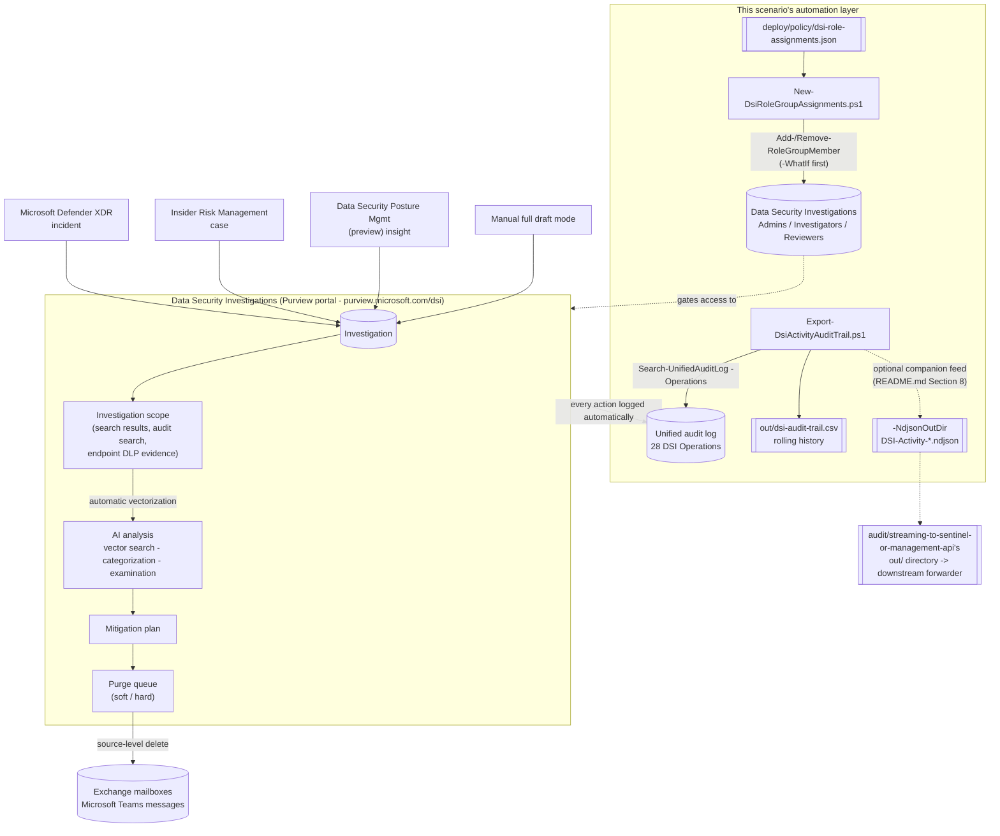

## 1. Scenario summary

Stands up **Microsoft Purview Data Security Investigations (DSI)** — an AI-enabled investigation
workspace that triages a data breach or insider-leak incident down to the specific sensitive items
exposed, then executes an audited, source-level purge (Exchange mailbox and/or Microsoft Teams) — as
a governed capability: least-privilege RBAC for the three dedicated DSI role groups, and a continuous,
exportable audit trail with the single highest-risk action (purge) flagged on sight.

**Who it's for:** a SOC/incident-response team that already runs Defender XDR and/or Insider Risk
Management and needs to answer "what did this actually expose?" across a large, unknown set of files/
emails/messages faster than manual review allows — and a compliance/security admin who needs that
capability rolled out with proper separation of duties and an audit trail from day one, not
discovered ad hoc during a live incident.

## 2. Business/regulatory driver

Breach-notification regimes (GDPR's 72-hour regulator notification, most U.S. state breach laws, SEC
cyber-disclosure rules) all hinge on the same bottleneck: knowing **what data was actually exposed**,
fast, across volumes too large for manual file-by-file review. DSI's AI-assisted categorization and
examination compress that triage step — Microsoft's own worked examples describe exactly this: a
breach-response investigator using DSI to identify which downloaded document contained unfiled
patents, or an investigator confirming what a departing employee actually exfiltrated before deciding
on notification scope [[1]](#references). Getting from "we think this was exposed" to "here is the
confirmed, prioritized list" faster is the difference between a defensible notification timeline and
a missed regulatory deadline. Grounding the *governance* layer (RBAC, audit trail) before a live
incident — rather than improvising it during one — is this scenario's specific contribution.

## 3. Prerequisites

Full licensing detail: `docs/licensing-matrix.md`. RBAC: `docs/rbac-model.md` §4. Summary:

| Requirement | Detail |
|---|---|
| License | **No dedicated enterprise plan/license required** — DSI is pay-as-you-go only (data storage meter + AI compute units); a Defender XDR or Insider Risk Management license unlocks those specific investigation-creation entry points, not DSI itself [[1]](#references)[[5]](#references) |
| Privacy terms | First access to DSI in the Purview portal requires accepting Microsoft's Privacy Statement — a one-time, portal-only step [[3]](#references) |
| Role groups (this scenario provisions) | **Data Security Investigations Admins**, **Data Security Investigations Investigators**, **Data Security Investigations Reviewers** — see §6 for the exact permission matrix [[4]](#references) |
| Role groups with implicit DSI access (not provisioned here — pre-existing) | **Compliance Administrator** (Admin access), **Organization Management** (Admin + Contributor access), **Data Security Management** (Contributor access), **Insider Risk Management** (Contributor access) [[4]](#references) |
| Automation identity (RBAC script) | A Security & Compliance PowerShell session (`Connect-IPPSSession`) held by an identity with the **Role Management** role (default: Organization Management / Data Security Investigations Admins) [[4]](#references)[[15]](#references) |
| Automation identity (audit-trail script) | An Exchange Online PowerShell session (`Connect-ExchangeOnline`) held by an identity with the **View-Only Audit Logs** or **Audit Logs** role — `docs/rbac-model.md` §6 |
| Billing/AI capacity | Configured once, in the portal, before first use — pay-as-you-go, requires the Data Security Investigations Admins role group [[3]](#references)[[5]](#references) |
| Global Administrator note | Global admins must still be assigned to one of the DSI role groups for DSI to grant them investigation access — being Global Administrator alone is not sufficient [[4]](#references) |

> Verify current entitlement names and role requirements against `docs/licensing-matrix.md` and
> `docs/rbac-model.md` (dated 2026-09-02) before a sales commitment.

## 4. Architecture



The DSI workflow itself (top box) is entirely Microsoft-portal-driven — no write API exists for any
step inside it (`design.md` §3). This scenario's own deliverable is the automation layer around it:
declarative RBAC for who can do what inside DSI, and a continuous, exportable record of what they did.

## 5. Step-by-step implementation

### One-time setup (portal, all identities)

1. In the [Microsoft Purview portal](https://purview.microsoft.com/dsi), accept the Privacy Statement
   on first access [[3]](#references).
2. Configure billing and AI capacity (Settings → the DSI billing/capacity page) — requires the
   **Data Security Investigations Admins** role group; choose a compute-unit processing location
   (ANZ / EU / UK / US) [[5]](#references).
3. Provision role-group membership with the script below, rather than the portal's per-user setup
   task, for a repeatable, reviewable deployment.

### RBAC provisioning (script path)

```powershell
Connect-IPPSSession -UserPrincipalName admin@contoso.com

# 1. Preview (changes nothing)
./deploy/New-DsiRoleGroupAssignments.ps1 -ConfigPath ./deploy/policy/dsi-role-assignments.json -WhatIf

# 2. Apply (additive-only by default - see design.md Section 5)
./deploy/New-DsiRoleGroupAssignments.ps1 -ConfigPath ./deploy/policy/dsi-role-assignments.json

# 3. Confirm
./validate/Test-DsiRoleGroupAssignments.ps1 -ConfigPath ./deploy/policy/dsi-role-assignments.json
```

**Portal path (equivalent, per-user):** Purview portal → **Data Security Investigations** →
**Overview** → **Assign roles to your team members** setup task (Admin/Investigators only), or
**Settings** → **Roles and groups** → **Role groups** for all three groups including Reviewers
[[4]](#references).

### The investigation workflow itself (portal-only — no script path exists)

1. **Create an investigation** from a Defender XDR incident, an Insider Risk Management case, a DSPM
   (preview) insight, or manually (full draft mode) [[3]](#references).
2. **Build the scope** — add search results (keyword/query search, or audit search against the
   unified audit log for user-activity-driven investigations, e.g. "Downloaded file" + "Sent email"
   for a departing-employee scenario) [[10]](#references).
3. **Run AI analysis** — automatic vectorization on scope-add, then categorization (default/custom/
   AI-suggested categories) and targeted examination (credentials, risk score, personal data)
   [[9]](#references).
4. **Build the mitigation plan** — add the highest-risk items surfaced by examination
   [[7]](#references).
5. **Purge** — save a search as a purge query, review the estimate, then run it choosing **soft
   purge** (recoverable, Exchange mailbox items only) or **hard purge** (permanent, Exchange mailbox
   + Teams messages; SharePoint/OneDrive are excluded from purge entirely) [[7]](#references).

### Continuous audit trail (script path)

```powershell
Connect-ExchangeOnline -AppId $AppId -Certificate $Cert -Organization $TenantDomain

# Dry run
./deploy/Export-DsiActivityAuditTrail.ps1 -OutputCsvPath ./out/dsi-audit-trail.csv -WhatIf

# Schedule this daily (Task Scheduler / cron / Azure Automation)
./deploy/Export-DsiActivityAuditTrail.ps1 -OutputCsvPath ./out/dsi-audit-trail.csv

# Optional: also land this run's new records as NDJSON in the audit streaming scenario's own
# Path B output directory, so the same downstream forwarder picks up DSI activity too (Section 8)
./deploy/Export-DsiActivityAuditTrail.ps1 -OutputCsvPath ./out/dsi-audit-trail.csv `
    -NdjsonOutDir ../../audit/streaming-to-sentinel-or-management-api/out
```

## 6. Configuration reference

**Role group permission matrix** (verbatim from Microsoft's own reference — the authoritative source
for what each dedicated DSI role group can do) [[4]](#references):

| Action | Admins | Investigators | Reviewers |
|---|---|---|---|
| Add/delete/manage mitigation-plan items | Yes | Yes | Yes |
| Create and manage **all** investigations | Yes | No | No |
| Create and manage **assigned** investigations | Yes | Yes | No |
| Create searches, add items to scope | Yes | Yes | No |
| Estimate/preview search results | Yes | Yes | No |
| Manage investigation scope | Yes | Yes | No |
| Run categorization / examination / vector search | Yes | Yes | Yes |
| **Create and run purge queries** | **Yes** | **Yes** | **No** |
| View data risk graphs | Yes | Yes | Yes |
| View Pay-as-you-go usage dashboard | Yes | No | No |

**Purge method comparison** [[7]](#references):

| | Soft purge | Hard purge |
|---|---|---|
| Action | Moves items to Recoverable Items | Permanently deletes from the data source |
| Recoverable | Yes, per retention settings | No — irreversible |
| Supported sources | Exchange mailbox items only | Exchange mailbox items **and** Teams messages |
| SharePoint / OneDrive | Not supported (purge disabled entirely if scope includes these) | Not supported |
| Recommended default | Most investigation-driven purges | Only with high confidence + no compliance retention need |

**Other confirmed limits and behaviors:**

| Setting | Value | Source |
|---|---|---|
| Purge cap | Up to **10,000 items per search** | [[18]](#references) |
| Hold/retention precedence | Both purge methods preserve items under litigation hold, eDiscovery hold, or a retention policy — can't permanently delete until the hold/period lapses | [[7]](#references) |
| Investigation-scope data location | A **copy** of every item added to scope is stored in an Azure storage account associated with DSI, billed via the storage meter | [[1]](#references)[[5]](#references) |
| Purge vs. investigation deletion | Running a purge removes items from their source, **not** from the DSI investigation scope itself — delete the investigation to remove data from DSI's own storage | [[7]](#references) |
| Billing model | Pay-as-you-go: storage meter (GB/month, all investigations) + Data Security Investigations compute units (AI processing) — **not** a pausable feature in the Purview Usage center | [[5]](#references)[[6]](#references)[[14]](#references) |
| Compute-unit processing locations | ANZ, EU, UK, US (operator choice) | [[5]](#references) |
| Audit — Operations logged | 28 distinct `DSI*` Operations covering investigation lifecycle, search, AI jobs, mitigation, and purge (`deploy/Export-DsiActivityAuditTrail.ps1`'s full list) | [[11]](#references) |
| Audit — SIEM companion feed | `-NdjsonOutDir` (optional) writes each run's new records as `DSI-Activity-<runStamp>.ndjson` — same per-run-file convention as `audit/streaming-to-sentinel-or-management-api`'s own Path B exports; point it at that scenario's `-OutDir` to share one downstream forwarder | This repo (§8) |

## 7. Validation / how to prove it works

**RBAC:**
1. Run `./validate/Test-DsiRoleGroupAssignments.ps1` — confirms all three role groups are readable,
   membership matches the declared config, the Admins group is non-empty, and unified audit logging
   is enabled.
2. Confirm in the portal: **Purview portal** → **Settings** → **Roles and groups** → select a DSI
   role group → membership list matches the config.

**Audit trail:**
1. Run `./deploy/Export-DsiActivityAuditTrail.ps1` once; confirm the CSV is created with a header row
   (even if 0 rows matched — that's expected before any DSI activity has occurred in the window).
2. Perform a benign, identifiable DSI action (e.g. view the investigation list — logs
   `DSIInvestigationListViewed`), wait for typical audit-log ingestion latency (~60–90 minutes for
   core services), re-run the script, and confirm the record appears.
3. **There is no documented API to confirm an investigation's AI-analysis job status, or a purge job's
   completion, outside the portal.** The portal's **Activities** tab (per-investigation) is the
   authoritative status source — the audit script confirms an action was *initiated*
   (`DSIPurgeStarted`), not that it *completed successfully*. See §11.

**SIEM companion feed (optional):**
1. Run `./deploy/Export-DsiActivityAuditTrail.ps1` with `-NdjsonOutDir` pointed at a scratch
   directory; confirm a `DSI-Activity-<runStamp>.ndjson` file is created only when `$rowsToAdd` is
   non-empty (a run that merges zero new records writes no NDJSON file — matches Path B's own
   "no records in this window" behavior).
2. Confirm each line is valid, single-line JSON with `CreationDate`/`Operation`/`UserIds`/
   `RecordType`/`AuditData` keys, and that `AuditData` is a nested JSON object (not an escaped
   string) — e.g. `Get-Content <file> | ForEach-Object { $_ | ConvertFrom-Json }` should not throw.
3. Run the script twice in a row over an overlapping window; confirm the second run's NDJSON file
   (a new, later `runStamp`) contains **zero** records for anything already exported by the first
   run — the same `$rowsToAdd` de-duplication the CSV merge already relies on.

## 8. Operations & tuning

- **`DSIPurgeStarted` is this scenario's single highest-priority signal.** It's the one DSI action
  that can permanently, irreversibly delete tenant data (hard purge). `Export-DsiActivityAuditTrail.ps1`
  emits a console warning on every such row; wire the same filter into whatever SIEM ultimately
  ingests the exported CSV, and alert on it in real time, not on the next scheduled review.
- **Landing this feed in a SIEM without building a second forwarder.** `-NdjsonOutDir` writes new
  records as NDJSON using the exact same per-run-file convention `audit/
  streaming-to-sentinel-or-management-api`'s Path B collector already uses for its own output —
  point it at that scenario's `-OutDir` and whatever forwarder already watches that directory
  (Splunk HEC, the Log Analytics Logs Ingestion API, a file-tail agent) picks up DSI activity too,
  with no new pipeline to stand up. This script still does not forward the NDJSON anywhere itself
  (same non-goal as `Invoke-ManagementActivityPoll.ps1` — `design.md` §6) — a downstream forwarder
  is still required either way. The CSV output is unaffected and remains the primary record
  regardless of whether `-NdjsonOutDir` is used.
- **New-investigation creation is the second-priority signal**, especially
  `DSIInvestigationCreatedFromXDR`/`DSIInvestigationCreatedFromIRM` outside expected incident-response
  hours — confirm each is a recognized, in-progress incident, not credential misuse of a DSI
  Investigator's own access.
- **Compute-unit and storage burn rate** — the Pay-as-you-go usage dashboard (Admins-only, §3) shows
  per-investigation storage and compute cost; check it during a reactive investigation surge, since
  costs accrue continuously while investigation data remains in scope and are **not** stoppable by
  pausing the feature (it isn't a pausable capability — §6).
- **Stale saved purge queries are a documented, real risk** — Microsoft's own guidance warns that the
  item count shown during "Review for purge" is an *estimate at that moment*; running a saved purge
  query later can purge substantially more (or different) items than originally reviewed. Operational
  policy: always re-run "Review for purge" immediately before executing a saved query, never rely on
  an old estimate [[7]](#references).
- **Least-privilege discipline for Reviewers.** Reviewers can run categorization/examination/vector
  search and see risk graphs — meaning a Reviewer already has visibility into extracted credentials,
  PII, and risk-ranked sensitive content, even though they cannot purge. Treat Reviewer assignment
  with the same care as any role that can view sensitive data at scale (§11, Red Team finding 1).
- **Ingestion latency is shared** with the rest of the unified audit log (~60–90 minutes typical for
  core services) — `DSIPurgeStarted` will not appear in the audit trail instantaneously; this is not a
  substitute for the portal's own real-time Activities tab during active incident response.
- **KPI suggestions:** mean time from investigation creation to first mitigation-plan item (triage
  speed); purge-queue backlog age (items reviewed-for-purge but not yet run); role-group membership
  drift (validate script §7, run on a schedule alongside the audit export).

## 9. Rollback / decommission

See `rollback.md`.

## 10. Cost & licensing notes

- **No dedicated per-user license required** to use DSI itself — it's pay-as-you-go only
  [[1]](#references)[[5]](#references). A Microsoft 365/Office 365 license already covers the
  underlying Exchange/Teams/SharePoint data DSI investigates; a Defender XDR or Insider Risk
  Management license is needed only to use those specific *entry points* into DSI, not DSI's core
  features.
- **Two independent meters**: the **data storage meter** (GB/month, summed across every investigation
  currently holding scoped data) and **Data Security Investigations compute units** (AI processing for
  vectorization/categorization/examination) [[5]](#references)[[6]](#references).
- **Not pausable.** Unlike several other Purview pay-as-you-go capabilities (Communication Compliance,
  Audit, Information Protection), Data Security Investigations does not appear as a pausable feature
  in the Purview Usage center [[14]](#references) — deleting an investigation (not just idling it) is
  the only way to stop its storage charge, and charges are prorated to the day it's deleted, with a
  full day charged if created and deleted within the same 24-hour period [[5]](#references).
- **Proactive AI insights from DSPM**, if enabled, incurs storage and compute costs continuously on a
  24-hour refresh cycle — configure billing before enabling that toggle, not after [[1]](#references).

## 11. Known limitations & gotchas

- **No write API for the DSI workflow itself.** Investigation creation, search, scope management, AI
  analysis, mitigation-plan changes, and purge are all portal-only (`design.md` §3) — this is not a
  gap this scenario's scripts work around; it's a real, disclosed boundary of what's automatable
  today.
- **Purge is source-scope-limited.** Even though an investigation's *scope* can include SharePoint and
  OneDrive content, **purge itself does not support those sources at all** — selecting them disables
  purge actions entirely [[7]](#references). A buyer expecting DSI to purge an overshared SharePoint
  site needs a different control (sharing/permissions remediation, not DSI purge).
- **VERIFY — RecordType for `Search-UnifiedAuditLog`.** Microsoft's audit-log-activities reference
  lists all 28 DSI Operation names but never states the RecordType enum value that carries them.
  `Export-DsiActivityAuditTrail.ps1` queries by `-Operations` alone rather than guessing a RecordType
  value — see the script's `.NOTES`.
- **No documented job-status API.** Neither an AI-analysis job's completion nor a purge job's outcome
  is checkable through a documented API this build found — the portal's per-investigation Activities
  tab is authoritative. `validate/Test-DsiRoleGroupAssignments.ps1` cannot and does not attempt to
  confirm either.
- **RBAC propagation delay.** Role group membership changes can take up to 30 minutes to propagate to
  a user's actual portal access, even though `Get-RoleGroupMember` reflects the change immediately
  [[4]](#references) — don't treat a user's immediate post-change access failure as this scenario's
  script having failed.
- **Purging does not remove data from DSI's own storage.** A purge removes items from Exchange/Teams;
  the copy already added to the investigation's scope remains in DSI's Azure storage (and keeps
  billing) until the investigation itself is deleted [[7]](#references) — see `rollback.md`.
- **Global Administrator alone is not sufficient** to access DSI — even a Global Admin must be
  explicitly assigned to a DSI role group [[4]](#references).
- **`-NdjsonOutDir`'s "DSI-Activity" label is this repo's own convention, not a real Office 365
  Management Activity API content type.** DSI audit records come from `Search-UnifiedAuditLog`
  directly, not from the Management Activity API `audit/streaming-to-sentinel-or-management-api`
  uses for its own Path B content types (`Audit.Exchange`, `DLP.All`, etc.) — the hyphenated name
  is deliberate, to avoid implying otherwise. Sharing an output directory is a filesystem-level
  convenience, not a claim that DSI events flow through that API.

## 12. References

1. Learn about Data Security Investigations (overview, common scenarios, billing summary, entry
   points, integration with unified audit log/DSPM/IRM/Defender XDR) — <https://learn.microsoft.com/purview/data-security-investigations>
2. Learn about the Data Security Investigations workflow (6-step workflow, notifications) — <https://learn.microsoft.com/purview/data-security-investigations-workflow>
3. Get started with Data Security Investigations (privacy terms, permissions, billing, investigation
   creation methods) — <https://learn.microsoft.com/purview/data-security-investigations-get-started>
4. Assign permissions in Data Security Investigations (role group names, permission matrix, the four
   role groups with implicit access, 30-minute propagation, zero-admin guidance) — <https://learn.microsoft.com/purview/data-security-investigations-permissions>
5. Billing in Data Security Investigations (storage meter, compute units, AI capacity, processing
   locations, Pay-as-you-go usage dashboard) — <https://learn.microsoft.com/purview/data-security-investigations-billing>
6. Learn about Microsoft Purview billing models (pay-as-you-go model, data storage meter definition) — <https://learn.microsoft.com/purview/purview-billing-models>
7. Take mitigation actions in Data Security Investigations (mitigation plan, soft/hard purge mechanics,
   purge queue dashboard, hold/retention precedence, stale-query warning) — <https://learn.microsoft.com/purview/data-security-investigations-mitigation-actions>
8. Manage investigation scopes in Data Security Investigations (scope dashboard, item actions) — <https://learn.microsoft.com/purview/data-security-investigations-scope>
9. Use AI analysis in Data Security Investigations (vectorization, categorization, examination) — <https://learn.microsoft.com/purview/data-security-investigations-ai-analysis>
10. Search, review, and refine results in Data Security Investigations (audit search, supported
    activities) — <https://learn.microsoft.com/purview/data-security-investigations-search>
11. Audit log activities — Data Security Investigations activities (all 28 `DSI*` Operations) — <https://learn.microsoft.com/purview/audit-log-activities#data-security-investigations-activities>
12. `dataSecurityInvestigationAuditRecord` resource type (Graph Security API — read-only audit-record
    schema, no management methods) — <https://learn.microsoft.com/graph/api/resources/security-datasecurityinvestigationauditrecord?view=graph-rest-1.0>
13. Application card: Microsoft Purview Data Security Investigations (RBAC as a named safety
    component, human-in-the-loop design intent) — <https://learn.microsoft.com/purview/data-security-investigations-application-card>
14. Manage pay-as-you-go and per-user licensing usage (Usage center pausable-features table — Data
    Security Investigations listed as not pausable) — <https://learn.microsoft.com/purview/purview-billing-usage>
15. Manage role groups in Exchange Online (`Add-RoleGroupMember`/`Remove-RoleGroupMember`/
    `Update-RoleGroupMember`/`Get-RoleGroupMember` reference) — <https://learn.microsoft.com/exchange/permissions-exo/role-groups>
16. `Search-UnifiedAuditLog` reference — <https://learn.microsoft.com/powershell/module/exchangepowershell/search-unifiedauditlog>
17. Create investigations in Data Security Investigations (preview) from the Microsoft Defender portal — <https://learn.microsoft.com/defender-xdr/create-dsi-in-defender>
18. Data Security Investigations limits reference (purge limits — up to 10,000 items per search) — <https://learn.microsoft.com/purview/data-security-investigations-ref-limits>
19. Manage audit log retention policies (180-day Standard default, 1-year E5 default, up to 10 years
    with Audit Premium) — <https://learn.microsoft.com/purview/audit-log-retention-policies>

> Re-verify all links, the role-group permission matrix, and billing meters against current
> Microsoft Learn before a customer-facing deployment — Data Security Investigations is an actively
> evolving solution (several adjacent features, e.g. the Posture agent and endpoint DLP evidence
> integration, are still in Preview as of this writing).
