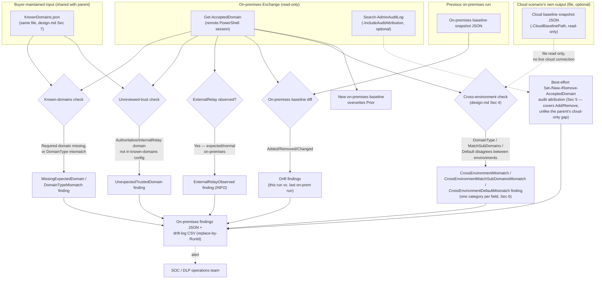

## 1. Scenario summary

A read-only, scheduled control that runs `scenarios/dlp/accepted-domains-hygiene-check`'s same
detection model against an **on-premises Exchange Management Shell** session instead of Exchange
Online PowerShell — closing that scenario's disclosed blind spot for a **hybrid** Exchange Online/
on-premises tenant. Reuses the same buyer-curated `KnownDomains.json` config and optionally
cross-references the cloud scenario's own last-recorded baseline to detect the hybrid-specific risk
neither environment's independent check can see: the two sides silently disagreeing about a domain's
trust status. Creates, modifies, or deletes nothing in Exchange or Purview.

**Who it's for:** any organization already running (or planning to run) the parent
`accepted-domains-hygiene-check` scenario **and** operating a hybrid Exchange deployment (on-premises
Exchange Server coexisting with Exchange Online via the Hybrid Configuration Wizard). Not applicable
to a pure Exchange Online tenant — run the parent scenario alone in that case.

## 2. Business/regulatory driver

The parent scenario's `design.md` §7 disclosed, rather than silently assumed away, that it
authenticates to Exchange Online only — a hybrid tenant's on-premises accepted domains, including the
only place `DomainType ExternalRelay` is actually reachable (parent `design.md` §2), are invisible to
it. This scenario closes that gap and adds a check the parent structurally cannot perform even for a
hybrid tenant running both scenarios independently: whether the two environments' accepted-domains
configuration has **drifted apart from each other**.

Regulatory/business drivers this scenario supports (in addition to the parent's own, `accepted-
domains-hygiene-check/README.md` §2, which apply equally here):
- **Complete hybrid coverage for a DLP-integrity control narrative.** A buyer telling an auditor "we
  monitor our accepted-domains configuration for drift" needs that claim to be true for the whole
  hybrid estate, not just the cloud half.
- **A concrete answer to "what if the on-premises and cloud sides disagree."** Before this scenario,
  neither this repo nor (per this build's grounding pass) any single Microsoft control answered that
  question for a hybrid tenant's accepted domains.
- **On-premises audit attribution the cloud side cannot offer.** `New-AcceptedDomain`/
  `Remove-AcceptedDomain` are on-premises-only cmdlets (§4/§11, `design.md` §2/§5) — this scenario's
  `-IncludeAuditAttribution` switch can attribute a domain add/remove event to a specific admin action
  here, a capability the parent scenario explicitly cannot offer for Exchange Online.

## 3. Prerequisites

Full licensing detail and citations: `docs/licensing-matrix.md`. **This scenario requires no
incremental Purview or Copilot licensing** and no incremental Exchange Online licensing — it targets
an **on-premises Exchange Server** the buyer already operates as part of their hybrid deployment.

| Requirement | Minimum | Notes |
|---|---|---|
| On-premises Exchange Server | Exchange Server 2010/2013/2016/2019/SE with a configured Hybrid Configuration Wizard coexistence | `Get-AcceptedDomain`, `New-AcceptedDomain`, `Remove-AcceptedDomain`, and `Search-AdminAuditLog` are all confirmed applicable to this range (`design.md` §2, §12). |
| RBAC system | On-premises Exchange RBAC (a **separate**, ninth role-group system from `docs/rbac-model.md`'s Purview/Exchange Online/Entra/Intune/Conditional-Access/app-registration/Defender-for-Endpoint models — see `docs/rbac-model.md` §13, and §11 below) | This scenario needs an on-premises role/role group granting `Get-AcceptedDomain`/`Search-AdminAuditLog` read rights at minimum — **Organization Management** (the on-premises Exchange superset administrative role group, same name as its Exchange Online counterpart but a distinct on-premises RBAC object) is confirmed sufficient; no narrower least-privilege role was independently confirmed by this build — see §11 and `docs/rbac-model.md` §13's disclosed **Compliance Management**/**View-Only Organization Management**/**Recipient Management** leads. |
| Connection surface | On-premises Exchange remote PowerShell, **not** any of `docs/automation-surface.md`'s five (all-cloud) surfaces | `New-PSSession -ConfigurationName Microsoft.Exchange -ConnectionUri http://<ServerFQDN>/PowerShell/ -Authentication Kerberos`, then `Import-PSSession` — §5, `design.md` §3/§8. Requires network line-of-sight to the on-premises Client Access/Mailbox server and a Kerberos-capable identity (typically a domain-joined machine or an account authenticating within the corporate network) — this cannot run from an arbitrary cloud-hosted runbook the way the parent scenario's certificate-based unattended auth can (`docs/automation-surface.md` §3), unless that runbook runs on a hybrid/self-hosted runner with that network access. |
| PowerShell version | Windows PowerShell 5.1 (the on-premises Exchange remote-session pattern is confirmed for this and is the conventional platform for on-premises Exchange Management Shell automation) | This script itself has no PowerShell-7-specific syntax and runs under 5.1; see §11 for the platform note. |
| Known-domains config | The **same** `KnownDomains.json` file the parent scenario uses (schema: `../accepted-domains-hygiene-check/deploy/KnownDomains.sample.json`) | Reused, not duplicated — `design.md` §7. |
| `-CloudBaselinePath` (optional) | The parent scenario's own `-BaselinePath` output file, readable from wherever this script runs | A plain file read, not a live cloud connection (`design.md` §3/§4) — copy or share the file if the two scripts run on different machines. |
| Deployment posture note | **On-premises-only check.** This scenario authenticates to the on-premises Exchange organization exclusively | Run the parent `accepted-domains-hygiene-check` scenario separately for the Exchange Online side — §5, `design.md` §3 explains why the two are not combined into one live session by default. |

## 4. Architecture



This scenario introduces **no new Exchange or Purview object** — see `rollback.md`. It never opens a
live connection to Exchange Online; `-CloudBaselinePath` is a plain file read (`design.md` §3).

## 5. Step-by-step implementation

### Portal path (for a first manual walkthrough / to validate intent before scripting)

1. On the on-premises Exchange server (or a management workstation with the Exchange admin tools),
   open the Exchange admin center or run `Get-AcceptedDomain | Format-Table Name, DomainName,
   DomainType, Default` in the on-premises Exchange Management Shell to see the equivalent data this
   scenario automates.
2. Cross-reference each domain against the same `KnownDomains.json` review the parent scenario's
   `README.md` §5 step 2 describes — this is one shared review process across both environments
   (`design.md` §7), not a separate on-premises-specific one.
3. There is no portal equivalent for this scenario's baseline-diff, unreviewed-trust, or
   cross-environment detection — those require the script path below.

### Script path (idempotent, parameterized, dry-run capable)

```powershell
# 1. Connect to the on-premises Exchange organization via remote PowerShell (design.md Sec 3/8).
#    Run this on a domain-joined machine with network line-of-sight to the CAS/Mailbox server.
$OnPremCred = Get-Credential
$OnPremSession = New-PSSession -ConfigurationName Microsoft.Exchange `
    -ConnectionUri "http://$OnPremServerFqdn/PowerShell/" -Authentication Kerberos -Credential $OnPremCred
Import-PSSession $OnPremSession -DisableNameChecking
# Do NOT also import a Connect-ExchangeOnline session into this same process unless you re-import
# one of the two with -Prefix (design.md Sec 3) - both export a cmdlet named Get-AcceptedDomain.

# 2. Reuse the SAME known-domains config the parent scenario uses - do not create a second copy.
#    (If you haven't set up the parent scenario yet, copy and edit its sample first - parent README.md Sec 5.)

# 3. Dry run — reports every on-premises finding, writes nothing
./deploy/Export-OnPremisesAcceptedDomainsHygieneReport.ps1 `
    -KnownDomainsConfigPath '../accepted-domains-hygiene-check/deploy/KnownDomains.json' `
    -BaselinePath './deploy/out/onprem-accepted-domains-baseline.json' `
    -DriftLogPath './deploy/out/onprem-accepted-domains-drift-log.csv' `
    -WhatIf

# 4. First real run — establishes the on-premises baseline
./deploy/Export-OnPremisesAcceptedDomainsHygieneReport.ps1 `
    -KnownDomainsConfigPath '../accepted-domains-hygiene-check/deploy/KnownDomains.json' `
    -BaselinePath './deploy/out/onprem-accepted-domains-baseline.json' `
    -DriftLogPath './deploy/out/onprem-accepted-domains-drift-log.csv'

# 5. (Optional, recommended for a hybrid buyer) Re-run with cross-environment reconciliation, once
#    the parent scenario has produced at least one baseline of its own:
./deploy/Export-OnPremisesAcceptedDomainsHygieneReport.ps1 `
    -KnownDomainsConfigPath '../accepted-domains-hygiene-check/deploy/KnownDomains.json' `
    -BaselinePath './deploy/out/onprem-accepted-domains-baseline.json' `
    -DriftLogPath './deploy/out/onprem-accepted-domains-drift-log.csv' `
    -CloudBaselinePath '../accepted-domains-hygiene-check/deploy/out/accepted-domains-baseline.json' `
    -IncludeAuditAttribution

# 6. Validate the report files (add -CloudBaselinePath to also verify CrossEnvironmentMismatch
#    findings against a live comparison, once the cloud baseline exists)
./validate/Test-OnPremisesAcceptedDomainsHygieneReport.ps1 `
    -BaselinePath './deploy/out/onprem-accepted-domains-baseline.json' `
    -DriftLogPath './deploy/out/onprem-accepted-domains-drift-log.csv' `
    -KnownDomainsConfigPath '../accepted-domains-hygiene-check/deploy/KnownDomains.json' -CheckLive `
    -CloudBaselinePath '../accepted-domains-hygiene-check/deploy/out/accepted-domains-baseline.json'

# 7. Schedule step 4/5 on a recurring cadence, independently of the parent scenario's own schedule
#    (design.md Sec 6 — separate files, no contention). This scenario ships no scheduler-specific
#    code; wire it into a Windows Task Scheduler task or Azure Automation hybrid runbook worker with
#    network access to the on-premises server — see Sec 3's Kerberos/network-reachability note.
```

Every finding category, its severity model, and the baseline/drift mechanics are fully documented in
`design.md` and the deploy script's own `.DESCRIPTION`/`.NOTES` blocks.

## 6. Configuration reference

**`KnownDomains.json`** — same schema as the parent scenario (`../accepted-domains-hygiene-check/
README.md` §6); not repeated here. `expectedDomainType` already supports `ExternalRelay`, which is
fully reachable (and expected, §4/§11) on the on-premises side.

**Finding categories** (deploy script's `Add-Finding` calls, `design.md` §2/§4):

| Category | Default severity | Meaning |
|---|---|---|
| `MissingExpectedDomain` | `FAIL` if `required: true`, else `WARN` | A known-domains entry is absent from on-premises `Get-AcceptedDomain`. |
| `DomainTypeMismatch` | `FAIL` if the trust boundary changes, else `WARN` | A known domain's live on-premises `DomainType` differs from `expectedDomainType`. |
| `UnexpectedTrustedDomain` | `FAIL` | An on-premises accepted domain with `DomainType` `Authoritative`/`InternalRelay` is not in the known-domains config. |
| `ExternalRelayObserved` | `INFO` (differs from the parent's `WARN` — expected here, §4) | Any on-premises accepted domain reports `DomainType ExternalRelay`. |
| `DomainAddedSincePreviousRun` | `FAIL` (trust-conferring type) or `WARN` | A domain present now but absent from the on-premises baseline. |
| `DomainRemovedSincePreviousRun` | `WARN` | A domain present in the on-premises baseline but absent now. |
| `DomainTypeChangedSincePreviousRun` | `WARN` | A domain's `DomainType` differs from the on-premises baseline. |
| `DefaultChangedSincePreviousRun` | `INFO` | The default-domain flag changed on this domain since the on-premises baseline. |
| `MatchSubDomainsChangedSincePreviousRun` | `FAIL` if flipped to `$true` on an in-organization domain, else `WARN` | A domain's `MatchSubDomains` flag changed since the on-premises baseline. |
| `CrossEnvironmentMismatch` (only with `-CloudBaselinePath`) | `FAIL` if the trust boundary disagrees between environments, else `WARN` | A domain's on-premises `DomainType` differs from the cloud baseline's recorded `DomainType` for the same domain, and neither is `ExternalRelay` — `design.md` §4. |
| `CrossEnvironmentMatchSubDomainsMismatch` (only with `-CloudBaselinePath`) | `FAIL` if either side has `MatchSubDomains` `$true`, else `WARN` | A domain's on-premises `MatchSubDomains` differs from the cloud baseline's recorded value, and neither side's `DomainType` is `ExternalRelay` — `design.md` §4. One environment silently accepting mail for every subdomain while the other does not is an asymmetric attack surface. |
| `CrossEnvironmentDefaultMismatch` (only with `-CloudBaselinePath`) | `WARN` | A domain's on-premises `Default` flag differs from the cloud baseline's recorded value, and neither side's `DomainType` is `ExternalRelay` — `design.md` §4. Each environment computes its own default accepted domain independently in a hybrid deployment, so this is unreviewed drift, not automatically a misconfiguration. |

**Why three separate categories, not one `CrossEnvironmentMismatch` covering all three fields:** the
drift-log CSV's uniqueness key is `(RunId, Category, DomainName)` — the same replace-by-`RunId` model
the parent scenario uses. A domain that diverges on more than one field in the same run (e.g. both
`MatchSubDomains` and `Default`) needs one row per divergence, and one row per divergence needs a
distinct category to stay unique under that key — the same reason this scenario's own baseline-diff
block already uses three separate per-field categories (`DomainTypeChangedSincePreviousRun`/
`DefaultChangedSincePreviousRun`/`MatchSubDomainsChangedSincePreviousRun`) rather than one overloaded
`ChangedSincePreviousRun` category. Confirmed by this build's own functional test (§7 below), which
caught the row-collision this design avoids before it shipped.

Exit code: exits `1` if any `FAIL`-severity finding is present in the current run — same contract as
the parent scenario. `WARN`/`INFO`-only findings exit `0`.

## 7. Validation / how to prove it works

1. **Automated file-integrity check** — `./validate/Test-OnPremisesAcceptedDomainsHygieneReport.ps1`
   confirms the on-premises baseline/drift-log files have the expected shape and no duplicate rows for
   the same `RunId`; exits non-zero on any hard failure. Same structure as the parent scenario's
   validate script.
2. **Live reconciliation** — pass `-CheckLive` (with `-KnownDomainsConfigPath` and an active
   on-premises Exchange remote session) to confirm every live untrusted-but-accepted on-premises
   domain is reflected as an `UnexpectedTrustedDomain` finding in the most recent drift-log run.
3. **Functional test — on-premises detection** — in a test/lab on-premises Exchange organization
   (never a production one), add a test accepted domain with `New-AcceptedDomain` without adding it to
   `KnownDomains.json`. Run the deploy script. Expect: an `UnexpectedTrustedDomain` finding, and (with
   `-IncludeAuditAttribution` and confirmed `-AdminAuditLogCmdlets` coverage, §11) an attributable
   `Search-AdminAuditLog` event for the `New-AcceptedDomain` call — the on-premises attribution
   capability the parent scenario structurally lacks (`design.md` §5). Remove the test domain
   afterward with `Remove-AcceptedDomain`.
4. **Functional test — cross-environment mismatch** — in a lab hybrid pairing, deliberately set a
   test domain's on-premises `DomainType` to differ from its recorded cloud-baseline `DomainType`
   (e.g. on-premises `Authoritative`, cloud baseline `ExternalRelay`... note `ExternalRelay` is
   excluded from this check by design, §4/§6 — use two in-organization types that differ instead,
   e.g. on-premises `InternalRelay` vs. cloud `Authoritative`). Run this scenario's deploy script with
   `-CloudBaselinePath` pointed at the (unchanged) cloud baseline. Expect: a `CrossEnvironmentMismatch`
   finding (`WARN`, since both remain in-organization types). Revert afterward.
5. **Functional test — cross-environment `MatchSubDomains`/`Default` mismatch** — same lab pairing as
   step 4, but instead (or in addition) diverge the test domain's `MatchSubDomains` or `Default` flag
   between the two recorded states (`Set-AcceptedDomain -MatchSubDomains`/`-MakeDefault` on whichever
   side). Run the deploy script with `-CloudBaselinePath`. Expect: a
   `CrossEnvironmentMatchSubDomainsMismatch` (`FAIL` if either side is `$true`) and/or
   `CrossEnvironmentDefaultMismatch` (`WARN`) finding, as its own drift-log row distinct from any
   `CrossEnvironmentMismatch` row the same domain also produces — confirmed directly during this
   scenario's own build via a mocked-`Get-AcceptedDomain` PowerShell 7.4.6 run producing all three
   categories for two domains in one pass, then validated with `-CheckLive`'s symmetric reconciliation,
   not just statically reviewed. Revert afterward.
6. **Evidence** — the per-run findings JSON file and the on-premises drift-log CSV are the audit trail
   for this side of the hybrid deployment, same pattern as the parent scenario's own files.

## 8. Operations & tuning

**Recommended cadence:** daily, run independently of the parent scenario's own schedule (`design.md`
§6 — separate files, no contention risk). If both scenarios run daily, schedule the on-premises run
to complete before the cross-environment reconciliation step reads the cloud scenario's baseline, or
accept that `-CloudBaselinePath` may reflect the cloud side's *previous* day's state on some runs —
either is acceptable for a detective control at this cadence; state which convention your scheduler
uses in your own runbook documentation.

**KPIs to watch** (in addition to the parent scenario's own KPIs, `README.md` §8 there, which apply
independently to the on-premises side):
- **`CrossEnvironmentMismatch` count, trending to zero (or to a stable, understood, non-zero baseline
  for domains genuinely mid-migration).** This is this scenario's headline, hybrid-specific signal.
  Unlike the parent's `UnexpectedTrustedDomain`, a non-zero count here is not automatically an
  incident — triage against the known-domains config's `owner` field and the domain's actual
  migration state (`design.md` §4) before escalating.
- **`CrossEnvironmentMatchSubDomainsMismatch` count, especially any `FAIL`-severity row, trending to
  zero.** A `FAIL` here means one environment accepts mail for every subdomain of the domain while the
  other does not — treat this with the same urgency as `UnexpectedTrustedDomain`, since it is an
  asymmetric attack surface, not merely stylistic drift.
- **`CrossEnvironmentDefaultMismatch` count** — lower urgency than the other two (always `WARN`), but
  worth a periodic review to confirm each side's default accepted domain is still the one the buyer
  intends new recipients' primary SMTP address to be generated against.
- **`UnexpectedTrustedDomain` count on the on-premises side, trending to zero** — same interpretation
  as the parent scenario, now covering the environment the parent cannot see.

**Incident-response runbook (`UnexpectedTrustedDomain`, `CrossEnvironmentMismatch`,
`CrossEnvironmentMatchSubDomainsMismatch`, or `CrossEnvironmentDefaultMismatch` finding):**
1. **Confirm intent** — same first step as the parent scenario's runbook (`README.md` §8 there).
2. **If legitimate** — add/correct the domain's entry in the shared `KnownDomains.json`, closing the
   finding on the next run of whichever scenario(s) it affects.
3. **If not legitimate, or intent cannot be confirmed, for an on-premises `UnexpectedTrustedDomain`
   finding** — run with `-IncludeAuditAttribution` (after confirming `-AdminAuditLogCmdlets` coverage,
   §11) to attempt attribution via `Search-AdminAuditLog` — a real chance of success here, unlike the
   parent's equivalent finding (`design.md` §5). Escalate to the identity/security team.
4. **For a `CrossEnvironmentMismatch`/`CrossEnvironmentMatchSubDomainsMismatch` finding that turns out
   to be a genuine misconfiguration** — correct the disagreeing side's `DomainType`/`MatchSubDomains`
   via `Set-AcceptedDomain` on whichever environment is wrong, informed by the known-domains config's
   intended value; re-run both scenarios' deploy scripts to confirm the finding clears.
5. **For a `CrossEnvironmentDefaultMismatch` finding** — confirm with the messaging/identity team which
   domain each environment's default accepted domain is *supposed* to be; if one side is wrong, correct
   it with `Set-AcceptedDomain -MakeDefault $true` on the intended domain. VERIFY (pilot tenant, before
   assuming this is a one-step fix): Microsoft's own `-MakeDefault` reference states it "specifies
   whether the accepted domain is the default domain" but never states outright that setting it `$true`
   on one domain automatically clears the flag from whichever domain previously held it — confirm the
   old default domain's `Default` flag actually flips before treating the finding as closed.
6. **Document** — the on-premises findings JSON and drift-log CSV are the evidentiary record.

## 9. Rollback / decommission

See `rollback.md` for the full procedure. Quick reference: this scenario creates no Exchange or
Purview object, so rollback is limited to closing the on-premises remote PowerShell session, stopping
the schedule, removing the automation identity's on-premises Exchange role assignment, and deciding
what to do with the already-produced report files — nothing tenant-side to undo, same archetype as
the parent scenario.

## 10. Cost & licensing notes

- **No incremental Purview, Copilot, or Exchange Online licensing required.** This scenario targets
  an on-premises Exchange Server the buyer already operates as part of an existing hybrid deployment
  — see §3.
- **On-premises compute cost is whatever already runs the Exchange server and the scheduling
  mechanism** (a Windows Task Scheduler task, or an Azure Automation hybrid runbook worker with
  network access to the on-premises environment) — negligible at this scenario's call volume (one
  `Get-AcceptedDomain` call and, optionally, one `Search-AdminAuditLog` call per scheduled run).
- Running this scenario alongside the parent doubles the buyer's total accepted-domains hygiene
  automation footprint but adds no licensing tier beyond what each half already requires
  independently.

## 11. Known limitations & gotchas

- **On-premises-only visibility, by design (the mirror of the parent's own limitation).** This
  scenario sees only the on-premises side; run the parent scenario for the cloud side. The two are
  not combined into one live session by default — §3, `design.md` §3.
- **Live combined session is unsafe unless `-Prefix` is used — now detected automatically, not just
  documented.** `Connect-ExchangeOnline` and the on-premises `Import-PSSession` pattern both export a
  proxy cmdlet named `Get-AcceptedDomain`; the second one imported into the same PowerShell process
  silently wins the unqualified name — confirmed directly from Microsoft's own `Import-PSSession`
  reference (`design.md` §3, §12). Both `deploy/Export-OnPremisesAcceptedDomainsHygieneReport.ps1` and
  `validate/Test-OnPremisesAcceptedDomainsHygieneReport.ps1` call `Get-Command Get-AcceptedDomain
  -All` at startup and emit a loud warning (not a hard failure — the collision alone doesn't prove
  which environment actually got queried) if more than one is loaded, after this build's own Red Team
  review found the first draft would have silently queried whichever session won and reported a
  clean, false-negative result with no indication anything was wrong (`reviews.md`). If you need both
  sessions in one process, re-import one with `Import-PSSession ... -Prefix OnPrem` (or similar) and
  adjust this script's cmdlet calls accordingly — not done by default.
- **`-AdminAuditLogCmdlets`'s default coverage is a VERIFY, not a confirmed fact.** This build's
  grounding pass confirmed `-AdminAuditLogEnabled` defaults to `$true` and `-AdminAuditLogAgeLimit`
  defaults to 90 days, but did **not** find a confirmed default value for which cmdlets
  `-AdminAuditLogCmdlets` audits out of the box on a fresh install. Run `Get-AdminAuditLogConfig |
  Select-Object AdminAuditLogCmdlets` and confirm `Set-AcceptedDomain`/`New-AcceptedDomain`/
  `Remove-AcceptedDomain` are covered (or `*` is set) before relying on `-IncludeAuditAttribution`'s
  output for an incident investigation — `design.md` §2, deploy script `.NOTES`.
- **90-day audit-log ceiling.** Even with `-AdminAuditLogCmdlets` correctly configured, the
  organization's `-AdminAuditLogAgeLimit` (90 days by default) caps how far back `Search-AdminAuditLog`
  can ever see — `-AuditLookbackDays` values beyond that ceiling silently find nothing, regardless of
  what actually happened, unless the buyer has widened the limit.
- **`CrossEnvironmentMismatch` findings are not automatically misconfigurations.** Which `DomainType`
  is "correct" for a shared-namespace hybrid domain depends on that domain's actual migration/
  coexistence state. Triage against the known-domains config's `owner` field, not against a blanket
  assumption that the two sides must always match — a live tenant can legitimately be mid-migration
  on one side and not the other.
- **Resolved (later build): cross-environment reconciliation now also covers `MatchSubDomains` and
  `Default`, not just `DomainType`.** `design.md` §9 originally deferred this as a non-goal pending a
  concrete buyer need; closed via two new sibling finding categories,
  `CrossEnvironmentMatchSubDomainsMismatch` and `CrossEnvironmentDefaultMismatch` (§6), each its own
  category rather than folded into `CrossEnvironmentMismatch` so a domain diverging on more than one
  field never collides on the drift log's `(RunId, Category, DomainName)` row key — a real bug this
  build's own functional test caught in an earlier single-category draft before it shipped. One VERIFY
  carried forward rather than guessed: whether `Set-AcceptedDomain -MakeDefault $true` on one domain
  automatically clears `Default` from whichever domain previously held it — Microsoft's own reference
  states what `-MakeDefault` does but not this side effect (§8 above, §12).
- **Resolved (later build): the parent scenario's `KnownDomains.sample.json` `hybrid.contoso.com`
  entry (`expectedDomainType: InternalRelay`) is correct as written.** A prior build of this scenario
  flagged this as an open question, having found only community/Microsoft Q&A guidance (not an
  authoritative Microsoft Learn conceptual page) suggesting a shared-namespace hybrid domain is
  commonly left `Authoritative` on both sides to support Directory Based Edge Blocking (DBEB). A later
  `WebSearch` pass (direct `WebFetch` to `learn.microsoft.com` was blocked again, §12) found three
  authoritative Microsoft Learn conceptual pages that resolve it: the "Accepted domains" page defines
  `InternalRelay` as precisely the shared-namespace case; "Manage accepted domains in Exchange Online"
  states a migration-in-progress domain must "remain configured as internal relay rather than
  authoritative" to avoid mail loops for not-yet-migrated recipients; and the DBEB page confirms
  `Authoritative`+DBEB is the state a domain reaches only *after* all recipients have been added to
  Exchange Online and replicated — a later, different state than an active coexistence domain, not a
  contradiction of it. The sample's own "hybrid ... coexistence domain" label already describes the
  pre-migration-complete state `InternalRelay` is correct for. See `design.md` §4 for the full citation
  trail. No code or sample change was needed.
- **On-premises RBAC is now cross-referenced in `docs/rbac-model.md` §13.** That cross-cutting
  reference documents the on-premises Exchange RBAC model (role groups like `Organization
  Management` that share a name, but not an identity, with their Exchange Online counterparts) as a
  ninth system alongside Purview/Exchange Online/Entra/Intune/Conditional-Access/app-registration/
  Defender-for-Endpoint RBAC — closed as a `PROGRESS.md` follow-up in a later build.
- **No independently-confirmed least-privilege on-premises role narrower than Organization
  Management** was found for `Get-AcceptedDomain`/`Search-AdminAuditLog` read access during this
  build's grounding pass — same class of disclosed gap as the parent scenario's own RBAC note
  (parent `README.md` §3). `docs/rbac-model.md` §13 records three unconfirmed narrower leads
  (**Compliance Management**, **View-Only Organization Management**, **Recipient Management**) for
  a future build or pilot tenant to close, rather than guessing which one actually covers both
  `Get-AcceptedDomain` and `Search-AdminAuditLog` together.

## 12. References

1. Get-AcceptedDomain reference — on-premises (Exchange Server 2010/2013/2016/2019/SE) **and**
   Exchange Online applicability, `-DomainController` (on-premises-only parameter) —
   <https://learn.microsoft.com/powershell/module/exchangepowershell/get-accepteddomain>
2. New-AcceptedDomain reference — on-premises-only applicability, confirmed independently this build
   — <https://learn.microsoft.com/powershell/module/exchangepowershell/new-accepteddomain>
3. Remove-AcceptedDomain reference — on-premises-only applicability —
   <https://learn.microsoft.com/powershell/module/exchangepowershell/remove-accepteddomain>
4. Set-AcceptedDomain reference — `-DomainType` values and definitions (`ExternalRelay` "available
   only in on-premises Exchange organizations"); also `-MatchSubDomains` ("enables mail to be sent by
   and received from users on any subdomain of this accepted domain," default `$false`) and
   `-MakeDefault` ("specifies whether the accepted domain is the default domain") — the two fields the
   `CrossEnvironmentMatchSubDomainsMismatch`/`CrossEnvironmentDefaultMismatch` checks (§6) reconcile
   across environments, fetched directly from the canonical MicrosoftDocs GitHub source in the later
   build that added those two checks — <https://learn.microsoft.com/powershell/module/exchangepowershell/set-accepteddomain>
5. Search-AdminAuditLog reference — applicable to Exchange Server 2010/2013/2016/2019/SE only (not
   listed for Exchange Online, which uses `Search-UnifiedAuditLog` instead), `-Cmdlets`,
   `-StartDate`/`-EndDate` parameters — <https://learn.microsoft.com/powershell/module/exchangepowershell/search-adminauditlog>
6. Set-AdminAuditLogConfig reference — `-AdminAuditLogEnabled` default `$true`,
   `-AdminAuditLogAgeLimit` default 90 days, `-AdminAuditLogCmdlets`/`-AdminAuditLogParameters`
   wildcard behavior (default value for `-AdminAuditLogCmdlets` not confirmed by this build, §11) —
   <https://learn.microsoft.com/powershell/module/exchangepowershell/set-adminauditlogconfig>
7. Administrator audit log structure reference — `Caller`, `CmdletName`, `Succeeded`,
   `ObjectModified`, `RunDate` output properties this scenario's findings JSON surfaces —
   <https://learn.microsoft.com/exchange/policy-and-compliance/admin-audit-logging/admin-audit-logging>
8. Connect to Exchange servers using remote PowerShell — the `New-PSSession -ConfigurationName
   Microsoft.Exchange -ConnectionUri http://<ServerFQDN>/PowerShell/ -Authentication Kerberos` /
   `Import-PSSession` pattern this scenario's Prerequisites and Step-by-step sections use verbatim,
   including the documented reason the URI uses `http` not `https` (Kerberos-encrypted payload) —
   <https://learn.microsoft.com/powershell/exchange/connect-to-exchange-servers-using-remote-powershell>
9. Import-PSSession reference — the documented command-name-collision behavior and `-Prefix`
   mitigation this scenario's §3/§11 and `design.md` §3 are built around —
   <https://learn.microsoft.com/powershell/module/microsoft.powershell.utility/import-pssession>
10. `scenarios/dlp/accepted-domains-hygiene-check/` — the parent scenario this fragment is a
    companion to; shares its `KnownDomains.json` config and baseline/drift-log/idempotency model.
11. `docs/automation-surface.md` §1 — the five all-cloud automation surfaces this scenario's
    on-premises connection method deliberately sits outside of (§3, `design.md` §8).
12. Accepted domains (conceptual) — defines `InternalRelay` as the shared-namespace case (domain
    shared with a third-party system, or between Exchange organizations in different AD forests) —
    <https://learn.microsoft.com/exchange/mail-flow/accepted-domains/accepted-domains>
13. Manage accepted domains in Exchange Online — the shared-namespace `InternalRelay` procedure and
    the "remains configured as internal relay rather than authoritative" migration guidance —
    <https://learn.microsoft.com/exchange/mail-flow-best-practices/manage-accepted-domains/manage-accepted-domains>
14. Use Directory-Based Edge Blocking to reject messages sent to invalid recipients — confirms
    `Authoritative`+DBEB is reached only after all recipients are added to Exchange Online and
    replicated, resolving `design.md` §4's now-closed open question —
    <https://learn.microsoft.com/exchange/mail-flow-best-practices/use-directory-based-edge-blocking>

> **Grounding note for this fragment:** `learn.microsoft.com` was unreachable from this build's
> network egress policy. Every citation above was independently verified this build via the
> canonical `MicrosoftDocs` GitHub source repositories that Microsoft Learn itself renders from
> (`office-docs-powershell`, `OfficeDocs-Exchange`) rather than a search-engine summary alone, except
> references 12-14, added in a later build once the original hybrid `Authoritative`-vs-`InternalRelay`
> open question (previously sourced from secondary community/Q&A content only) was resolved via
> `WebSearch` result summaries citing those three Microsoft Learn conceptual pages by name and URL —
> direct `WebFetch` to `learn.microsoft.com` was blocked again in that build's environment, the same
> recurring restriction, not a one-off. Re-verify all citations against live `learn.microsoft.com`
> pages before a customer-facing deployment.
