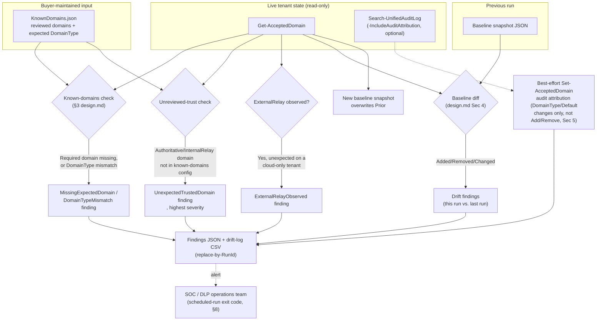

## 1. Scenario summary

A read-only, scheduled control that cross-references the tenant's live Exchange **accepted domains**
configuration (`Get-AcceptedDomain`) against a buyer-curated allowlist of known/reviewed domains and
the previous run's recorded state. It flags both directions of hygiene risk: a legitimate partner or
subsidiary domain silently excluded from "in organization" trust, and an unreviewed domain silently
granted it. Creates, modifies, or deletes nothing in Exchange or Purview, the entire control is
detection, not enforcement.

**Who it's for:** any organization running one or more DLP rules (Exchange, Teams, or Microsoft 365
Copilot location) that condition on sender/user **internal-vs-external** scope, `FromScope`/
`ExceptIfFromScope` in Microsoft's cmdlet model, and wants ongoing assurance that the accepted-domains
configuration those rules silently depend on hasn't drifted out from under them.

## 2. Business/regulatory driver

Every `FromScope`-consuming DLP condition in this tenant, including
`scenarios/dspm-for-ai/copilot-external-email-block`'s Rule 3, which this scenario was scoped as a
follow-up from (that scenario's `reviews.md`, Red Team finding 1), evaluates "internal vs. external"
entirely against the tenant's accepted-domains configuration, specifically each domain's `DomainType`
(§4/§6, `design.md` §2). No DLP rule, alert, or dashboard in Purview surfaces when that underlying
configuration is wrong, incomplete, or has silently changed. This is a **compensating control for an
unmonitored dependency**, not a new DLP capability, the same class of control a mature security
program runs against any allowlist a preventive control's correctness quietly depends on.

Regulatory/business drivers this scenario supports:
- **DLP control integrity**, a buyer relying on `copilot-external-email-block`, `pci-teams-exfil-
 block`, `exchange-pii-exfil-block`, or any other `FromScope`-based rule in this repo for a PCI-DSS,
 GDPR, or SOC 2 control narrative needs assurance that the trust boundary those rules evaluate
 against is itself correct and reviewed, this scenario is that assurance mechanism.
- **Change-management visibility**, a newly-accepted domain or a changed `DomainType` is exactly the
 kind of tenant configuration change an auditor expects to see detected and reviewed, not discovered
 after the fact during an incident.
- **A concrete answer to "how would you know if someone added a rogue accepted domain"**, a
 legitimate question in any DLP/data-boundary control review; before this scenario, the honest answer
 for this repo's other scenarios was "you wouldn't, automatically."

## 3. Prerequisites

Full licensing detail and citations: [Licensing matrix](/docs/licensing-matrix/). **This scenario requires no
incremental Purview or Copilot licensing**, `Get-AcceptedDomain` and `Search-UnifiedAuditLog` are
core Exchange Online PowerShell surfaces available on any Exchange Online plan (`docs/automation-
surface.md` §1, Surface 1), unlike the E5-class Copilot-DLP tier the originating
`copilot-external-email-block` scenario needs. Verify as of the date you deploy against current
Microsoft Learn.

| Requirement | Minimum | Notes |
|---|---|---|
| RBAC system | Exchange Online RBAC ([RBAC model §6](/docs/rbac-model/#6-exchange-online-dependency-the-most-common-permissions-gap)), **not** a Purview role group | `Get-AcceptedDomain`/`Search-UnifiedAuditLog` are pure Exchange Online PowerShell cmdlets, no Purview portal role covers them. |
| Role to run the deploy/validate scripts interactively, or to assign to the app's service principal for unattended use | **Organization Management** (Exchange Online role group) | Confirmed sufficient (it is Exchange Online's superset administrative role group); Microsoft's own `Get-AcceptedDomain` reference page names no narrower least-privilege role, directing instead to the generic "Find the permissions required to run any Exchange cmdlet" article, same disclosed gap as `scenarios/adaptive-protection/exchange-legacy-auth-block/README.md` §11. **View-Only Organization Management** is the conventional least-privilege read-only Exchange Online role group for organization-configuration objects and is expected to cover `Get-AcceptedDomain`, but this is not independently confirmed by a Microsoft-published cmdlet-to-role mapping, see §11. |
| Additional role for `-IncludeAuditAttribution` | An Exchange Online role with audit-log-search rights ([RBAC model §6](/docs/rbac-model/#6-exchange-online-dependency-the-most-common-permissions-gap), Compliance Administrator/Organization Management alone are explicitly **not** sufficient per Microsoft; a dedicated Exchange Online audit role/role group is required in addition) | Only needed if the deploy script's `-IncludeAuditAttribution` switch is used. |
| PowerShell module | `ExchangeOnlineManagement` 3.2.0+ | Same module as every other Exchange Online PowerShell scenario in this repo, [Automation surface §1/§4](/docs/automation-surface/#1-five-automation-surfaces-not-one-read-this-first). |
| Connection surface | `Connect-ExchangeOnline` (Surface 1) | **Not** `Connect-IPPSSession` (Surface 2, Security & Compliance PowerShell), `Get-AcceptedDomain` and `Search-UnifiedAuditLog` are Exchange Online PowerShell cmdlets, a distinction this repo's [Automation surface §1](/docs/automation-surface/#1-five-automation-surfaces-not-one-read-this-first) draws explicitly. |
| Known-domains config | A buyer-maintained JSON file (schema: `deploy/KnownDomains.sample.json`) | No Microsoft-documented source can auto-derive which accepted domains are "reviewed and expected", see §6 and `design.md` §6. Must be created and kept current by the buyer's own change-management process. |
| Deployment posture note | **Cloud-only check.** This scenario authenticates to Exchange Online exclusively | A hybrid Exchange Online/on-premises tenant's on-premises accepted domains (where `DomainType ExternalRelay` is actually reachable, see `design.md` §2) are invisible to this script. See §11. |

## 4. Architecture



This scenario introduces **no new Exchange or Purview object**, see `rollback.md`. Every arrow into
"Live tenant state" is a read-only call; every output is a local file.

## 5. Step-by-step implementation

### Portal path (for a first manual walkthrough / to validate intent before scripting)

1. Sign in to the Exchange admin center (`admin.exchange.microsoft.com`) → **Mail flow** → **Accepted
 domains**, or run `Get-AcceptedDomain | Format-Table Name, DomainName, DomainType, Default` in
 Exchange Online PowerShell to see the equivalent data this scenario automates.
2. For each accepted domain shown, confirm with the domain's business owner whether it's expected and
 correctly typed (`Authoritative` for a domain your organization fully owns mail delivery for,
 `InternalRelay` for a domain still under your organization's authority but relayed elsewhere, see
 `design.md` §2). Record the outcome, this manual review is exactly what §6's `KnownDomains.json`
 config formalizes and makes repeatable.
3. There is no portal equivalent for this scenario's baseline-diff or unreviewed-trust detection, 
 those require the script path below.

### Script path (idempotent, parameterized, dry-run capable)

```powershell
# 1. Connect (certificate app-only, Exchange Online PowerShell, see docs/automation-surface.md Sec 3)
Connect-ExchangeOnline -AppId $AppId -Certificate $Cert -Organization $TenantDomain

# 2. Copy and edit the known-domains config for your tenant
Copy-Item ./deploy/KnownDomains.sample.json ./deploy/KnownDomains.json
# ... edit ./deploy/KnownDomains.json with your reviewed domains and their expected DomainType ...

# 3. Dry run, reports every finding, writes nothing
./deploy/Export-AcceptedDomainsHygieneReport.ps1 `
    -KnownDomainsConfigPath ./deploy/KnownDomains.json `
    -BaselinePath ./deploy/out/accepted-domains-baseline.json `
    -DriftLogPath ./deploy/out/accepted-domains-drift-log.csv `
    -WhatIf

# 4. First real run, establishes the baseline (no Added/Removed/Changed drift is possible yet)
./deploy/Export-AcceptedDomainsHygieneReport.ps1 `
    -KnownDomainsConfigPath ./deploy/KnownDomains.json `
    -BaselinePath ./deploy/out/accepted-domains-baseline.json `
    -DriftLogPath ./deploy/out/accepted-domains-drift-log.csv

# 5. Validate the report files
./validate/Test-AcceptedDomainsHygieneReport.ps1 `
    -BaselinePath ./deploy/out/accepted-domains-baseline.json `
    -DriftLogPath ./deploy/out/accepted-domains-drift-log.csv `
    -KnownDomainsConfigPath ./deploy/KnownDomains.json -CheckLive

# 6. Schedule step 4 to run on a recurring cadence (daily recommended, see Sec 8).
#    This scenario ships no scheduler-specific code; wire it into your own Azure Automation
#    runbook, Azure Function timer trigger, or equivalent (docs/automation-surface.md Sec 6).
```

Every finding category, its severity model, and the baseline/drift mechanics are fully documented in
`design.md` §2, §5 and the deploy script's own `.DESCRIPTION`/`.NOTES` blocks.

## 6. Configuration reference

**`KnownDomains.json` schema** (`deploy/KnownDomains.sample.json`):

| Field | Type | Meaning |
|---|---|---|
| `domainName` | string | The accepted-domain name to check, exactly as it appears in `Get-AcceptedDomain`'s `DomainName`. |
| `expectedDomainType` | string | One of `Authoritative`, `InternalRelay`, `ExternalRelay` (design.md §2), what this domain's `DomainType` is expected to be. |
| `required` | bool | `true` if this domain's absence from `Get-AcceptedDomain` should be a `FAIL`-severity finding; `false` for a `WARN`-severity one (e.g. a domain that's expected but not yet business-critical). |
| `owner` | string | Free-text business owner/justification, surfaced in finding details for triage, not validated by the script. |

**Finding categories** (deploy script's `Add-Finding` calls, `design.md` §3):

| Category | Default severity | Meaning |
|---|---|---|
| `MissingExpectedDomain` | `FAIL` if `required: true`, else `WARN` | A known-domains entry is absent from live `Get-AcceptedDomain`. |
| `DomainTypeMismatch` | `FAIL` if the trust boundary changes, else `WARN` | A known domain's live `DomainType` differs from `expectedDomainType`. |
| `UnexpectedTrustedDomain` | `FAIL` | A live accepted domain with `DomainType` `Authoritative`/`InternalRelay` is not in the known-domains config at all. |
| `ExternalRelayObserved` | `WARN` | Any live accepted domain reports `DomainType ExternalRelay`, surprising on a cloud-only tenant, see §11. |
| `DomainAddedSincePreviousRun` | `FAIL` (trust-conferring type) or `WARN` | A domain present now but absent from the last-recorded baseline. |
| `DomainRemovedSincePreviousRun` | `WARN` | A domain present in the last-recorded baseline but absent now. |
| `DomainTypeChangedSincePreviousRun` | `WARN` | A domain's `DomainType` differs from the last-recorded baseline. |
| `DefaultChangedSincePreviousRun` | `INFO` | The tenant's default-domain flag changed on this domain since the last baseline. |
| `MatchSubDomainsChangedSincePreviousRun` | `FAIL` if flipped to `$true` on an in-organization domain, else `WARN` | A domain's `MatchSubDomains` flag changed since the last baseline. A flip to `$true` silently extends in-organization trust to every subdomain of that domain for `FromScope`-consuming rules, independent of any `DomainType` change, see §11. |

Exit code: `deploy/Export-AcceptedDomainsHygieneReport.ps1` exits `1` if any `FAIL`-severity finding is
present in the current run (`MissingExpectedDomain`/`DomainTypeMismatch`/`UnexpectedTrustedDomain`/
`DomainAddedSincePreviousRun` can each reach `FAIL`), safe to wire directly into a scheduled job's own
failure/alerting path. `WARN`/`INFO`-only findings exit `0`.

## 7. Validation / how to prove it works

1. **Automated file-integrity check**, `./validate/Test-AcceptedDomainsHygieneReport.ps1` confirms
 the baseline and drift-log files have the expected shape and no duplicate rows for the same
 `RunId`; exits non-zero on any hard failure.
2. **Live reconciliation**, pass `-CheckLive` (with `-KnownDomainsConfigPath` and an active
 `Connect-ExchangeOnline` session) to additionally confirm every live untrusted-but-accepted domain
 is actually reflected as an `UnexpectedTrustedDomain` finding in the most recent drift-log run, 
 proof the deploy script's own detection logic isn't silently under-reporting.
3. **Functional test, false-positive-exclusion direction**, in a test tenant, temporarily edit
 `KnownDomains.json` to mark a domain that genuinely IS accepted as `required: true` under a
 *different* `expectedDomainType` than its live value (e.g. expect `Authoritative` for a domain
 actually configured `InternalRelay`). Run the deploy script. Expect: a `DomainTypeMismatch` finding
 for that domain. Revert the config afterward.
4. **Functional test, silent-bypass direction**, in a test tenant, add a new accepted domain (real
 test domain you control, `Authoritative` type) without adding it to `KnownDomains.json`. Run the
 deploy script. Expect: an `UnexpectedTrustedDomain` finding (and, on the next run, a
 `DomainAddedSincePreviousRun` finding once a baseline exists) for that domain. Remove the test
 domain afterward via the Microsoft 365 admin center (§11, not via PowerShell; see the cmdlet
 availability note).
5. **Functional test, `MatchSubDomains` trust-expansion direction**, in a test tenant, flip
 `MatchSubDomains` to `$true` on an already-accepted, already-known test domain (`Set-AcceptedDomain
 -Identity <domain> -MatchSubDomains $true`) without any `DomainType` change. Run the deploy script
 twice (once to record the change in a new baseline, per §8's cadence, the finding fires on the run
 that observes the change relative to the *previous* baseline). Expect: a
 `MatchSubDomainsChangedSincePreviousRun` finding. Revert afterward.
6. **Evidence**, the per-run findings JSON file (`<RunId>-accepted-domains-findings.json`, written
 alongside the drift log) and the drift-log CSV itself are the audit trail; both are ordinary files
 suitable for ingestion into a SIEM or ticketing system.

## 8. Operations & tuning

**Recommended cadence:** daily. Accepted-domains changes are infrequent, deliberate administrative
actions in a healthy tenant, a daily run gives same-day detection without meaningful cost. `RunId`
defaults to the current UTC date, so a daily schedule naturally produces one row per finding per day
in the drift log with no duplicate-row risk from an occasional re-run on the same day. This is a
**detective**, not preventive, control, a domain added between scheduled runs holds unreviewed trust
for up to one full cadence interval before this scenario surfaces it. A higher-assurance environment
(e.g. one already running `copilot-external-email-block` in production `Enable` mode) should shorten
the interval, pass an explicit `-RunId` (e.g. an hourly timestamp instead of the UTC-date default) on
a sub-daily schedule; the replace-by-RunId idempotency model (`design.md` §4) supports any cadence,
not just daily, as long as `-RunId` is set to match it.

**KPIs to watch:**
- **`UnexpectedTrustedDomain` count, trending to zero.** This is the control's headline signal, every
 occurrence means a domain currently holds in-organization trust for every `FromScope`-consuming rule
 in the tenant with no reviewed record. Triage each one: either add it to `KnownDomains.json` (if
 legitimate, after review) or investigate how it was added (see §11's audit-attribution limits).
- **`MissingExpectedDomain` with `required: true`, trending to zero.** Each occurrence is a live gap in
 a `FromScope`-consuming rule's intended coverage, a partner or subsidiary being treated as external
 when it shouldn't be.
- **`DomainAddedSincePreviousRun`/`DomainRemovedSincePreviousRun` volume, as a change-frequency
 baseline.** A sudden spike deserves the same scrutiny any unusual configuration-change volume does.

**Review cadence:** any `FAIL`-severity finding should be triaged same-day, given the daily recommended
run cadence, this is a same-day-actionable signal, not a periodic report to batch-review.

**Incident-response runbook (`UnexpectedTrustedDomain` finding):**
1. **Confirm intent**, check with the domain's likely business owner (a recent partner onboarding, a
 new subsidiary) before assuming malice; most occurrences are legitimate changes missing from
 `KnownDomains.json`, not an attack.
2. **If legitimate**, add the domain to `KnownDomains.json` with the correct `expectedDomainType` and
 an `owner` note, closing the finding on the next run.
3. **If not legitimate or intent cannot be confirmed**, this is a credential-compromise or
 insider-action indicator. Attempt attribution via `-IncludeAuditAttribution` (covers `DomainType`/
 `Default` changes on an already-accepted domain only, see §11's limit on attributing the
 domain-addition event itself) and Microsoft Entra ID's own directory audit log (`Add verified
 domain`/`Add unverified domain` activities, §11) for the actual addition event. Escalate to the
 identity/security team; consider revoking recently-issued admin credentials with domain-management
 rights pending investigation.
4. **Document**, the findings JSON and drift-log CSV are the evidentiary record for both directions of
 this workflow.

## 9. Rollback / decommission

See `rollback.md` for the full procedure. Quick reference: this scenario creates no Exchange or
Purview object, so rollback is limited to stopping the schedule, removing the automation identity's
Exchange Online role assignment, and deciding what to do with the already-produced report files, 
nothing tenant-side to undo.

## 10. Cost & licensing notes

- **No incremental Purview or Copilot licensing required.** `Get-AcceptedDomain` and
 `Search-UnifiedAuditLog` are core Exchange Online PowerShell surfaces on any Exchange Online plan, 
 see §3. This is meaningfully cheaper to run than the `FromScope`-consuming scenarios it protects
 (e.g. `copilot-external-email-block`'s E5-class Copilot-DLP tier requirement).
- **Compute/storage cost is the automation platform's own** (Azure Automation/Functions runtime,
 wherever the recurring schedule runs), negligible at the call volume this scenario generates (one
 `Get-AcceptedDomain` call and, optionally, one `Search-UnifiedAuditLog` call per scheduled run).
- Re-verify no licensing change has occurred for `Get-AcceptedDomain`/`Search-UnifiedAuditLog`
 specifically before a sales commitment, [Licensing matrix §6](/docs/licensing-matrix/#6-how-scenarios-should-cite-licensing).

## 11. Known limitations & gotchas

- **Cloud-only visibility, now closed by a companion scenario.** This scenario authenticates to
 Exchange Online exclusively (`Connect-ExchangeOnline`). A hybrid tenant's on-premises accepted
 domains, including the only place `DomainType ExternalRelay` is actually reachable, see next bullet
, are entirely invisible to it. `scenarios/dlp/accepted-domains-hygiene-check-on-premises/` is the
 on-premises companion that closes this gap, reusing this scenario's own `KnownDomains.json` and
 optionally cross-referencing this scenario's own baseline file to detect the two environments
 drifting apart from each other, see that scenario's `README.md` for the full hybrid-specific
 detection model. See `design.md` §7 (non-goals) for why this scenario itself stays cloud-only.
- **`ExternalRelay` is on-premises Exchange only, a genuinely new finding from this build's
 grounding pass, not previously documented anywhere in this repo.** Microsoft's `Set-AcceptedDomain`
 reference states this explicitly. A pure Exchange Online tenant can never have an `ExternalRelay`
 accepted domain; every accepted domain on such a tenant counts as in-organization for `FromScope`
 purposes (`design.md` §2). If this script's `ExternalRelayObserved` finding ever fires against a
 cloud tenant, that is independently surprising and worth investigating as a possible hybrid
 coexistence artifact, a `PROGRESS.md` follow-up tracks backporting this correction into
 `copilot-external-email-block/design.md` §4, which currently states the general mechanism without
 this cloud-vs-on-premises qualifier.
- **No Exchange Online cmdlet exists to add or remove an accepted domain.** `New-AcceptedDomain` and
 `Remove-AcceptedDomain` are both on-premises-Exchange-only per Microsoft's own applicability
 statements (fetched directly this build). A cloud tenant's accepted domains are managed exclusively
 through the Microsoft 365 admin center's domain-verification/removal flow. Two consequences: (1)
 this scenario's own testing (§7) must add/remove test domains through the admin center, not
 PowerShell; (2) this script **cannot attribute** a `DomainAddedSincePreviousRun`/
 `DomainRemovedSincePreviousRun` finding to a specific admin action via `Search-UnifiedAuditLog`'s
 `ExchangeAdmin` record type, there is no such Exchange admin event for a cloud tenant. The more
 likely attribution source (Microsoft Entra ID's `Add verified domain`/`Remove verified domain`
 `DirectoryManagement` audit activities) is confirmed to exist by name but its exact
 `Search-UnifiedAuditLog`-queryable `Operations` value is not confirmed by this build, see
 `design.md` §5. Tracked as a follow-up in `PROGRESS.md`, not guessed at.
- **`Set-AcceptedDomain` audit-log attribution (`-IncludeAuditAttribution`) is a VERIFY, not a
 confirmed capability.** Exchange Online's default admin-audit-logging behavior generally records
 `Set-`/`New-`/`Remove-` cmdlet executions under `RecordType ExchangeAdmin` by cmdlet name, but no
 Microsoft-published worked example independently confirms `Set-AcceptedDomain` specifically appears
 this way. Confirm against a pilot tenant before relying on this switch's output for an incident
 investigation, see `design.md` §5.
- **`KnownDomains.json` and the baseline file are trusted inputs this script does not protect, 
 restrict write access to both.** An actor able to write either file can suppress a finding
 entirely: adding a malicious domain to `KnownDomains.json` makes it pass as reviewed, and
 pre-seeding the baseline with a domain makes it invisible to `DomainAddedSincePreviousRun`
 detection. Store both under the same access control and change-review discipline as any other
 security-relevant configuration (e.g. a source-controlled path requiring pull-request review for
 `KnownDomains.json` changes, and a baseline path writable only by the automation identity itself).
 This scenario does not enforce or verify either control, it is an operational prerequisite, the
 same class of dependency as `copilot-external-email-block`'s own reliance on correctly-configured
 accepted domains (that scenario's `README.md` §3).
- **The known-domains config has no automated source of truth.** Every entry in `KnownDomains.json`
 is a human decision; this scenario cannot detect that a domain was added to the config
 *incorrectly* (e.g. approved without real review), only that live state diverges from whatever the
 config currently says. Garbage in, garbage out, the same limitation every allowlist-based control has.
- **`DomainTypeMismatch` severity depends on whether the trust boundary actually moves.**
 `Authoritative`↔`InternalRelay` drift is `WARN` (both count as in-organization); a mismatch that
 crosses the in-organization boundary is `FAIL`. Don't read every `DomainTypeMismatch` as
 equally urgent, check the finding's own `Detail` text, which states which case applies.

## 12. References

1. Get-AcceptedDomain reference, full parameter syntax (`-Identity`, `-DomainController`,
 `-ResultSize`; no `-DomainType` filter parameter exists, it is an output-object property only), 
 <https://learn.microsoft.com/powershell/module/exchangepowershell/get-accepteddomain>
2. Set-AcceptedDomain reference, `-DomainType` parameter and its three valid values with Microsoft's
 own verbatim definitions (Authoritative/InternalRelay/ExternalRelay), the explicit statement that
 `ExternalRelay` is "available only in on-premises Exchange organizations," `-MatchSubDomains`,
 `-MakeDefault`, `-AddressBookEnabled`, cloud/on-premises applicability statement ("available in
 on-premises Exchange and in the cloud-based service"), <https://learn.microsoft.com/powershell/module/exchangepowershell/set-accepteddomain>
3. New-AcceptedDomain reference, `-DomainType` definitions (independent phrasing corroborating
 source 2) and the explicit "This cmdlet is available only in on-premises Exchange" applicability
 statement, <https://learn.microsoft.com/powershell/module/exchangepowershell/new-accepteddomain>
4. Remove-AcceptedDomain reference, confirms this cmdlet is also on-premises-Exchange-only, the
 basis for §11's "no cloud cmdlet to add or remove an accepted domain" finding, <https://learn.microsoft.com/powershell/module/exchangepowershell/remove-accepteddomain>
5. Data loss prevention Exchange conditions and actions reference, confirms the portal condition
 "Sender scope" maps to the PowerShell condition `FromScope`/`ExceptIfFromScope`, property type
 `UserScopeFrom`, the trust-boundary mechanism this entire scenario protects, <https://learn.microsoft.com/purview/dlp-exchange-conditions-and-actions>
6. Search-UnifiedAuditLog reference (`-RecordType`, `-Operations`, `-StartDate`/`-EndDate` parameters
 used by `-IncludeAuditAttribution`), <https://learn.microsoft.com/powershell/module/exchangepowershell/search-unifiedauditlog>
7. Audit activity reference (Microsoft Entra ID), confirms `Add verified domain`/`Remove verified
 domain`/`Add unverified domain`/`Remove unverified domain`/`Update domain` exist as named
 `DirectoryManagement`-category audit activities (exact `Search-UnifiedAuditLog` `Operations`
 string not independently confirmed by this build, §11), <https://learn.microsoft.com/entra/identity/monitoring-health/reference-audit-activities>
8. `scenarios/dspm-for-ai/copilot-external-email-block/`, the originating scenario whose Red Team
 review (`reviews.md`, finding 1) scoped this follow-up.
9. `scenarios/data-estate-insights/classification-coverage-report/`, the sibling read-only reporting
 scenario this fragment's baseline/drift-log/idempotency model and `rollback.md` structure follow.
10. [RBAC model §6](/docs/rbac-model/#6-exchange-online-dependency-the-most-common-permissions-gap), Exchange Online RBAC dependency, and §14's citation convention this
 scenario's §3 follows.

> Verify current cmdlet availability (especially the on-premises-vs-cloud applicability statements in
> sources 2-4, which are load-bearing for this scenario's entire design) against current Microsoft
> Learn before a customer-facing deployment.
