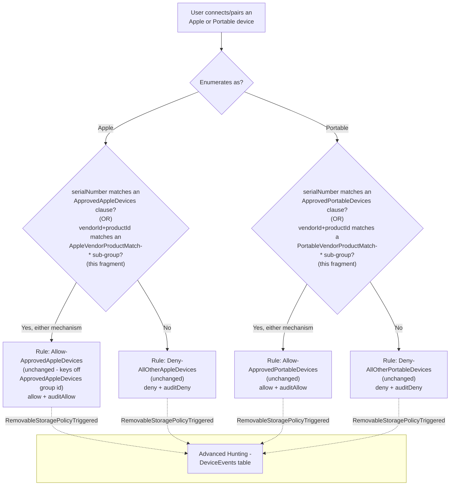

## 1. Scenario summary

Extends `scenarios/dlp/defender-device-control-usb-allowlist-macos-portable-device-coverage/`'s
`serialNumber`-only Apple and Portable device allowlists with a second, independent matching
mechanism, **vendorId+productId compound matching**, for approved iPhones/iPads or
cameras/Android-in-PTP-mode devices that have no readable serial number. Any number of
vendorId/productId-matched devices can be added per family, on top of (never instead of) each
family's existing `serialNumber`-matched devices, with no new Intune profile and no new policy rule.
This is the direct Apple/Portable analog of
`scenarios/dlp/defender-device-control-usb-allowlist-macos-vendor-product-matching/`, which already
closed the identical gap for removable-media (USB mass-storage) devices.

**Who it's for:** a buyer already running the portable-device-coverage scenario with at least one
`serialNumber`-approved device configured for the Apple and/or Portable family, whose fleet also
includes hardware of that family that reports an empty or non-unique `serialNumber`, a real gap for
some bulk-provisioned iPads/iPhones and industrial barcode scanners/cameras, and who would otherwise
have to leave that hardware permanently denied.

## 2. Business/regulatory driver

Identical regulatory framing to the parent and portable-device-coverage scenarios
(`defender-device-control-usb-allowlist-macos/README.md` §2), GDPR Article 32, HIPAA's 45 CFR
§164.312 media controls, PCI DSS Requirement 3, SOC 2 CC6. This fragment closes a specific
operational gap in the Apple/Portable coverage control: a tenant that cannot approve a legitimate
IT-issued iPad or barcode scanner because it lacks a serial number is left choosing between an
unapproved control gap (the device stays denied, prompting shadow-IT workarounds or a support ticket
asking to "just turn off device control for that team") or weakening the control tenant-wide, 
neither of which an auditor accepts as "no unapproved Apple/Portable device, period."

## 3. Prerequisites

Same product family and licensing as the parent and portable-device-coverage scenarios, see
[Licensing matrix §7](/docs/licensing-matrix/#7-adjacent-product-family-microsoft-defender-for-endpoint--intune-device-control-scenarios) and `defender-device-control-usb-allowlist-macos-portable-device-
coverage/README.md` §3, which apply unchanged. The requirements this fragment adds are per family
(Apple, Portable), configure only the family/families you need:

| Requirement | Minimum | Notes |
|---|---|---|
| Portable-device-coverage scenario deployed | `defender-device-control-usb-allowlist-macos-portable-device-coverage/deploy/Add-MacPortableDeviceCoverage.ps1` has been run at least once | This fragment's deploy script refuses to run for a family unless devices are already configured (see next row). |
| At least one `serialNumber` device already configured **for the family you want to extend** | `approvedAppleDevices`/`approvedPortableDevices` on the portable-device-coverage fragment's own `-ConfigPath` has ≥1 entry, so its `ApprovedAppleDevices`/`ApprovedPortableDevices` group and `Allow-Approved*Devices` rule already exist | A deliberate scope boundary, this fragment never creates either object from a zero-`serialNumber` starting state (`design.md` §3). A buyer with zero `serialNumber` devices for a family must first add one via the prerequisite fragment. |
| PowerShell | 7.0 or later | Uses `System.Security.Cryptography.SHA1` for its deterministic per-device group id derivation (`design.md` §4), no additional module beyond the Microsoft Graph PowerShell SDK already required. |
| Automation identity | Same Entra app registration and `DeviceManagementConfiguration.ReadWrite.All` Graph application permission as the parent scenario | No new permission, this fragment PATCHes the same `macOSCustomConfiguration` object. |
| Dependency (not deployed by this scenario) | The approved devices' **vendor ID** and **product ID** (each a four-digit hexadecimal string) | Obtain via `system_profiler SPUSBDataType` on a Mac with the device connected, or the device manufacturer's own documentation. |

## 4. Architecture



This fragment adds `groups[]` entries (one per configured device, per family, plus a `groupId`
clause on each family's existing Approved group) to the **same** `macOSCustomConfiguration` object
the parent scenario created and the portable-device-coverage fragment already widened. Every
Allow/Deny rule is unchanged, both already reference their family's Approved group's id directly,
so a device newly matched through either mechanism is automatically covered. Full rationale:
`design.md` §2-6.

## 5. Step-by-step implementation

### Portal path (for a first manual walkthrough / to validate intent before scripting)

1. Confirm the prerequisites are already deployed: Intune admin center → **Devices** → **macOS** →
 **Configuration profiles** → confirm `Device Control (macOS) - USB Removable Media Default-Deny
 Allowlist` exists, and that its embedded policy JSON already has an `ApprovedAppleDevices` and/or
 `ApprovedPortableDevices` group (from the portable-device-coverage fragment) with at least one
 `serialNumber` clause for the family you want to extend.
2. Obtain the vendor ID and product ID for each device to approve (§3).
3. Edit the profile's `.mobileconfig`: add one `groups[]` entry per device (shape: `design.md` §5
 row 1) and one `groupId` clause per device to the relevant family's existing Approved group's
 `query.clauses` array (shape: `design.md` §5 row 2), preserving every existing `serialNumber`
 clause unchanged.
4. Re-upload the modified `.mobileconfig` as the profile's configuration file, replacing the
 existing one.
5. **Save**. No assignment change is needed.

### Script path (idempotent, parameterized, dry-run capable)

```powershell
# 1. Connect (certificate app-only - see docs/automation-surface.md Section 3)
Connect-MgGraph -ClientId $AppId -TenantId $TenantId -CertificateThumbprint $Thumbprint

# 2. Edit deploy/config/mac-apple-portable-vendor-product-device-allowlist.sample.json (or copy it)
#    with your approved devices' vendorId/productId pairs, per family. Leave either family's array
#    empty (or omitted) if you don't need it.

# 3. Dry run - reports every change, makes none
./deploy/Add-MacApplePortableVendorProductDeviceAllowlist.ps1 `
    -ConfigPath ./deploy/config/mac-apple-portable-vendor-product-device-allowlist.sample.json `
    -WhatIf

# 4. Deploy
./deploy/Add-MacApplePortableVendorProductDeviceAllowlist.ps1 `
    -ConfigPath ./deploy/config/mac-apple-portable-vendor-product-device-allowlist.sample.json

# 5. Validate
./validate/Test-MacApplePortableVendorProductDeviceAllowlist.ps1 `
    -ConfigPath ./deploy/config/mac-apple-portable-vendor-product-device-allowlist.sample.json

# 6. To revoke a device: remove its entry from the config file and re-run step 4 - the deploy
#    script detects and removes the now-orphaned sub-group automatically, no -Force required.
```

The deploy script uses the Microsoft Graph PowerShell SDK (`Invoke-MgGraphRequest` against the same
`macOSCustomConfiguration` resource), automation surface 3 per [Automation surface §1](/docs/automation-surface/#1-five-automation-surfaces-not-one-read-this-first). It
never creates the prerequisite groups/rules and never changes the parent policy's assignment.

## 6. Configuration reference

| Setting | Location in `.mobileconfig` | Value |
|---|---|---|
| Per-device sub-group (Apple) | `deviceControl.policy.groups[]` (inserted immediately before `ApprovedAppleDevices`) | `{"$type":"device","id":"<UUIDv5(namespace, apple/vendorId:productId)>","name":"AppleVendorProductMatch-<label>","query":{"$type":"and","clauses":[{"$type":"primaryId","value":"apple_devices"},{"$type":"vendorId","value":"<hex>"},{"$type":"productId","value":"<hex>"}]}}` |
| Per-device sub-group (Portable) | `deviceControl.policy.groups[]` (inserted immediately before `ApprovedPortableDevices`) | Same shape, `primaryId` value `portable_devices`, name prefix `PortableVendorProductMatch-` |
| `ApprovedAppleDevices`/`ApprovedPortableDevices` clause edit | `deviceControl.policy.groups[].query.clauses[]` | One `{"$type":"groupId","value":"<sub-group id>"}` appended per configured device, alongside the family's pre-existing `serialNumber` clauses (`query.$type` read from the live object and preserved unchanged, see `design.md` §6) |
| Sub-group id derivation | N/A, computed, not stored as a separate object | RFC 4122 §4.3 version-5 UUID: `SHA1(namespace_bytes ++ UTF8("mac-apple-portable-vendor-product-match/v1/<family>/<vendorId>:<productId>"))`, version/variant bits patched. Namespace: `c7e21a4f-9d3b-4e6a-8c1f-2b3d4e5f6071` (fixed, this fragment's own constant, distinct from every other fragment's namespace). See `design.md` §4. |
| Rules | *(unchanged)*, `Allow-ApprovedAppleDevices`/`Allow-ApprovedPortableDevices`, `Deny-AllOtherAppleDevices`/`Deny-AllOtherPortableDevices` | Not modified by this fragment; all already key off their family's Approved group's id. |

All group ids this fragment creates are **deterministic**, not fixed literals, the same
family+vendorId+productId always produces the same id, on any machine, with no state file. Full
cmdlet/REST/schema grounding: the deploy script's `.NOTES` block and §12 below.

## 7. Validation / how to prove it works

1. **Automated config check**, `./validate/Test-MacApplePortableVendorProductDeviceAllowlist.ps1
 -ConfigPath./deploy/config/mac-apple-portable-vendor-product-device-allowlist.sample.json`
 confirms, per family: the prerequisite Approved group/Allow rule are present, every configured
 device's sub-group exists with the expected deterministic id and AND-clauses, the Approved group
 references it via a `groupId` clause, no orphaned sub-group or stale `groupId` clause remains, and
 the sibling fragments' own groups are unaffected; exits non-zero on any hard failure.
2. **Profile sync check**, same as the parent scenario's §7 step 3: Intune admin center → confirm
 pilot Macs show **Succeeded**, not **Pending** or **Error**, after this fragment's PATCH.
3. **Client-side status check**, same as the parent scenario's §7 step 4
 (`mdatp health --details device_control`); this fragment does not change any Full Disk Access or
 engine-enable requirement.
4. **Functional test (vendorId/productId-approved Apple/Portable device)**, connect a device whose
 vendor+product pair is in the relevant family's config list (and whose serial number, if any, is
 **not** separately approved, to isolate this fragment's own mechanism). Expect: the operation
 succeeds, and a `RemovableStoragePolicyTriggered` event with `Verdict = Allow` appears in Advanced
 Hunting.
5. **Functional test (unapproved device)**, connect a device matching neither a `serialNumber`
 clause nor a configured `vendorId`+`productId` pair for its family. Expect: denied, identical to
 the portable-device-coverage scenario's own §7 steps 4/6.
6. **Advanced Hunting query**, identical query shape to the portable-device-coverage scenario's own
 §7 step 8; this fragment adds no new `AdditionalFields` and requires no query change:
   ```kusto
   DeviceEvents
   | where ActionType == "RemovableStoragePolicyTriggered"
   | extend parsed = parse_json(AdditionalFields)
   | project Timestamp, DeviceName,
       Verdict = tostring(parsed.RemovableStoragePolicyVerdict),
       PolicyRule = tostring(parsed.RemovableStoragePolicy),
       SerialNumberId = tostring(parsed.SerialNumber)
   | order by Timestamp desc
   ```

## 8. Operations & tuning

**Deployment sequence:** this fragment ships directly into the prerequisite fragment's existing
assignment scope, there is no separate rollout stage of its own. Add a vendorId/productId device
only after the prerequisite fragment is already assigned to the intended endpoints and has at least
one `serialNumber` device configured for that family.

**KPIs to watch (first 30 days):** identical framing to the parent scenario's §8, with the same
addition the removable-media vendor-product-matching sibling already documents, track
`Allow-Approved{Family}Devices` `auditAllow` event volume **per configured vendorId+productId pair**
against the number of physically-issued units of that model, since this mechanism approves a
*model*, not a unit (§11).

**Alert routing:** unchanged, same Advanced Hunting/`DeviceEvents` and Microsoft Defender Streaming
API/Sentinel connector paths as the parent scenario's §8.

**Review cadence:** quarterly at minimum. Re-run `validate/
Test-MacApplePortableVendorProductDeviceAllowlist.ps1` as part of that review, and cross-check each
family's `vendorProduct*Devices` config list against the current physical inventory of approved
units.

**Incident-response runbook:** identical structure to the parent scenario's §8 runbook, with the
same addition the removable-media sibling documents: if Advanced Hunting shows more distinct
`DeviceName` values presenting an approved vendorId+productId pair than the count of
physically-issued units, treat this as a suspected impersonation, remove the device entry from the
config and re-run the deploy script immediately, then investigate before re-approving.

**Operational reminder specific to this fragment (see §11):** if
`defender-device-control-usb-allowlist-macos-portable-device-coverage`'s own
`Add-MacPortableDeviceCoverage.ps1 -Force` is ever re-run for a family after this fragment, re-run
this fragment's own deploy script immediately afterward to restore the vendorId/productId
exceptions, `validate/Test-MacApplePortableVendorProductDeviceAllowlist.ps1` flags the drift
distinctly if this step is missed.

## 9. Rollback / decommission

See `rollback.md` for the full staged procedure. Quick reference: to revoke one device, remove its
entry from the relevant family's array in the config file and re-run
`deploy/Add-MacApplePortableVendorProductDeviceAllowlist.ps1` (orphan cleanup is automatic, no
`-Force` needed); to remove every Apple/Portable vendorId/productId device exception at once, run
`./deploy/Remove-MacApplePortableVendorProductDeviceAllowlist.ps1`.

## 10. Cost & licensing notes

- **No PAYG component and no incremental licensing cost**, identical to the parent and
 portable-device-coverage scenarios (`defender-device-control-usb-allowlist-macos/README.md` §10).
 This fragment adds no new Microsoft capability, only a different matching mechanism inside the
 same already-licensed policy object.
- **No additional Azure subscription or Intune licensing line** beyond what the prerequisite
 scenarios already require.

## 11. Known limitations & gotchas

- **`vendorId`+`productId` identify a device MODEL, not a unique physical unit, this is a
 materially weaker guarantee than `serialNumber` matching, not an equivalent alternative.** Any
 device sharing the configured pair matches the exception. Approve device models here only for a
 genuine, narrow business need where no serial-numbered alternative exists (`design.md` §4/§8, same
 disclosure the removable-media sibling fragment already carries).
- **This fragment requires at least one `serialNumber` device already configured for a family before
 it can add a vendorId/productId device to that same family** (`design.md` §3), it never creates
 `ApprovedAppleDevices`/`ApprovedPortableDevices` or their Allow rules from a zero-`serialNumber`
 starting state. Tracked as a follow-up in `PROGRESS.md` for a future fragment that would remove
 this restriction.
- **KNOWN CROSS-FRAGMENT ORDERING HAZARD, more severe than the Bluetooth sibling's own disclosed
 equivalent (`design.md` §7):** if `defender-device-control-usb-allowlist-macos-portable-device-
 coverage`'s own `Add-MacPortableDeviceCoverage.ps1 -Force` is re-run after this fragment, it
 unconditionally rebuilds `ApprovedAppleDevices`/`ApprovedPortableDevices` from **its own**
 `serialNumber` list only, silently dropping this fragment's `groupId` clauses, and (if that
 family's `serialNumber` list is emptied) removing the group and its Allow rule entirely, orphaning
 this fragment's sub-groups. Remediation: re-run this fragment's own deploy script afterward.
 `validate/Test-MacApplePortableVendorProductDeviceAllowlist.ps1` detects and flags this specific
 drift condition per family, distinct from "never configured."
- **VERIFY (pilot tenant or a future Microsoft Learn/GitHub-samples pass):** no directly-confirmed
 Microsoft worked example pairs `vendorId`+`productId` AND-clause matching with the `apple_devices`
 or `portable_devices` primaryId families specifically, Microsoft's own published GitHub sample
 policies demonstrate this exact AND-clause shape only for `bluetooth_devices`
 (`deny_all_bluetooth_devices_except_samsung.json`), and a single-clause `vendorId`-only variant for
 `removable_media_devices` (`deny_removable_media_except_kingston.json`). This fragment generalizes
 the shape to two more families on the same basis the removable-media sibling fragment already
 generalized it once (the clause type definitions themselves are documented family-agnostically),
 not on a new, independently confirmed worked example. `audit_all_apple_devices_except_serial_
 numbers.json` and `deny_mobile_devices.json` were both re-fetched during this fragment's build and
 confirmed to use `serialNumber`/`primaryId` matching only for these two families, never
 `vendorId`/`productId`. `deploy/Add-MacApplePortableVendorProductDeviceAllowlist.ps1`'s `.NOTES`
 flags this inline.
- **The deterministic per-device group id (RFC 4122 §4.3 UUIDv5) is this fragment's own namespace
 constant and hash-input format, distinct from every sibling fragment's own scheme.** If a future
 engineer changes the namespace constant, the hash input string, the family tag, or the
 normalization (`ToLowerInvariant()`) applied to `vendorId`/`productId` before hashing, every
 previously-deployed device's computed id changes, and the deploy script will treat every existing
 sub-group as orphaned on the next run.
- **VERIFY (pilot tenant, before production reliance):** the same open `macOSCustomConfiguration`
 `payload` PATCH replace-vs-merge question the parent scenario's own README already flags
 (`defender-device-control-usb-allowlist-macos/README.md` §11) applies identically here.
- **This fragment inherits every non-goal already disclosed by the parent and portable-device-
 coverage scenarios**, no content awareness, the Full Disk Access hard prerequisite, the
 `portable_devices`-`serialNumber` VERIFY that scenario's own README already carries, and the known
 Microsoft-documented Android-PTP-mode-only and Xcode-transfer product limitations.

## 12. References

1. Device Control for macOS (Settings/Clause/Query reference tables, `groupId` "Match if a device
 is a member of another group... The group must be defined within the policy before the clause.";
 `vendorId`/`productId` "Four digit hexadecimal string"; `primaryId` values `apple_devices`/
 `portable_devices`; Query `any`/`or` synonymy; `includeGroups` AND / `excludeGroups` OR
 semantics), re-fetched directly during this fragment's own build, 
 <https://learn.microsoft.com/defender-endpoint/mac-device-control-overview>
2. Sample macOS device control policy, `deny_all_bluetooth_devices_except_samsung.json` (the
 `primaryId`+`vendorId`+`productId` AND-clause exception-group shape this fragment generalizes a
 second time, to `apple_devices`/`portable_devices`), 
 <https://github.com/microsoft/mdatp-devicecontrol/blob/main/macOS/policy/samples/deny_all_bluetooth_devices_except_samsung.json>
3. Sample macOS device control policy, `audit_all_apple_devices_except_serial_numbers.json`
 (re-fetched directly during this fragment's build; confirmed `serialNumber`/`or`/`excludeGroups`
 matching only, no `vendorId`/`productId` usage for `apple_devices`), 
 <https://github.com/microsoft/mdatp-devicecontrol/blob/main/macOS/policy/samples/audit_all_apple_devices_except_serial_numbers.json>
4. Sample macOS device control policy, `deny_mobile_devices.json` (re-fetched directly during this
 fragment's build; confirmed `primaryId`-only catch-all matching for both `apple_devices` and
 `portable_devices`, no `vendorId`/`productId` usage), 
 <https://github.com/microsoft/mdatp-devicecontrol/blob/main/macOS/policy/samples/deny_mobile_devices.json>
5. RFC 4122, Section 4.3, Algorithm for Creating a Name-Based UUID (version 5, SHA-1), 
 <https://www.rfc-editor.org/rfc/rfc4122#section-4.3>
6. `scenarios/dlp/defender-device-control-usb-allowlist-macos-portable-device-coverage/`, the
 prerequisite fragment whose `ApprovedAppleDevices`/`ApprovedPortableDevices` groups and Allow
 rules this fragment extends; see that scenario's own references for the shared macOS
 device-control citations not repeated here.
7. `scenarios/dlp/defender-device-control-usb-allowlist-macos-vendor-product-matching/`, the direct
 precedent this fragment generalizes from `removable_media_devices` to `apple_devices`/
 `portable_devices`; same deterministic-GUID technique, same "extend the group, not the rule"
 reasoning.
8. `scenarios/dlp/defender-device-control-usb-allowlist-macos-bluetooth-allowlist/`, the sibling
 fragment whose own disclosed-and-detected cross-fragment ordering hazard (`design.md` §8 there)
 this fragment's own, more severe variant follows the same resolution pattern for.

> Re-verify all links, and especially the vendorId/productId-for-Apple/Portable VERIFY (§11) and the
> `payload` PATCH replace-vs-merge semantics, against current Microsoft Learn and a pilot tenant
> before a customer-facing assessment or sale.
