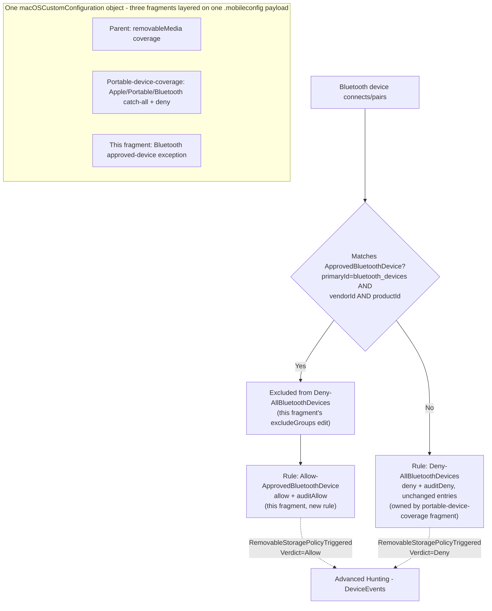

## 1. Scenario summary

Adds a single, vendor+product-matched approved-device exception to the unconditional Bluetooth
deny rule that `scenarios/dlp/defender-device-control-usb-allowlist-macos-portable-device-coverage/`
ships — closing that fragment's deliberately deferred "Bluetooth is always default-deny, no
exceptions" scope boundary using the exact `vendorId`+`productId` AND-match shape Microsoft's own
published sample policy demonstrates. This is a third-layer companion fragment, not a standalone
policy: it widens the same shared `macOSCustomConfiguration` object's `.mobileconfig` payload the
parent and portable-device-coverage fragments already extend, adding one group and one rule, and
modifying one existing rule in place.

**Who it's for:** any buyer who has deployed the macOS USB allowlist scenario and its
Apple/Portable/Bluetooth coverage extension, and has one specific, IT-approved Bluetooth
peripheral (a barcode scanner, an approved audio/file-transfer accessory) that needs a documented,
audited exception instead of an informal "just disable the policy for that team" workaround.

## 2. Business/regulatory driver

The portable-device-coverage fragment's own `README.md` §11 states the trade-off plainly:
Bluetooth ships default-deny-only because Microsoft's own worked exception sample for this family
uses a structurally different, single-device `vendorId`+`productId` match, not the OR'd
multi-device `serialNumber` pattern used for Apple/Portable devices. In practice this means a buyer
with even one legitimate Bluetooth file-transfer use case has exactly two options without this
fragment: block it entirely (a genuine business-disruption cost) or turn off Bluetooth enforcement
for the whole fleet (reopening the exact invisibility gap the parent fragments exist to close).
Neither is acceptable to a security team trying to run a policy pilot without generating support
tickets. This fragment closes that gap the same way the rest of this control's approved-device
model works: a small, named, audited allowlist — not a blanket carve-out.

The same regulatory drivers the parent scenario cites (GDPR Article 32, HIPAA 45 CFR §164.312
media controls, PCI DSS Requirement 3, SOC 2 CC6) apply unchanged; this fragment doesn't introduce
a new compliance citation, it removes an operational blocker to actually running the existing
control's Bluetooth coverage in enforce mode.

## 3. Prerequisites

This scenario extends the shared policy object a second time and inherits every prerequisite from
both fragments below it.

| Requirement | Minimum | Notes |
|---|---|---|
| Parent policy already deployed | `scenarios/dlp/defender-device-control-usb-allowlist-macos/deploy/New-MacDeviceControlUsbAllowlistPolicy.ps1` has been run | Same Defender for Endpoint Plan 1, Intune, Full Disk Access, and minimum client version `101.91.92` prerequisites as the parent (`README.md` §3 there). |
| Portable-device-coverage fragment already deployed | `scenarios/dlp/defender-device-control-usb-allowlist-macos-portable-device-coverage/deploy/Add-MacPortableDeviceCoverage.ps1` has been run at least once | **Hard prerequisite, enforced at runtime.** `deploy/Add-MacBluetoothDeviceAllowlist.ps1` refuses to run if the `AllBluetoothDevices` group and `Deny-AllBluetoothDevices` rule that fragment creates are not both present — this fragment only adds an exception to existing Bluetooth coverage, it never creates Bluetooth coverage itself (§5, §7). |
| Dependency (not deployed by this scenario) | The approved Bluetooth device's `vendorId` and `productId` (four-digit hexadecimal, e.g. `0075`/`0100`) | Obtainable from the device's Bluetooth pairing/product documentation, or from a prior `DeviceEvents` deny event's `AdditionalFields` once the device has attempted (and been denied) a connection at least once — see §7. |

## 4. Architecture



The same one Intune macOS Custom device configuration profile (`Device Control (macOS) - USB
Removable Media Default-Deny Allowlist`) has its embedded `deviceControl.policy` JSON widened a
third time: one new group (`ApprovedBluetoothDevice`), one new rule (`Allow-ApprovedBluetoothDevice`),
and one existing rule modified in place (`Deny-AllBluetoothDevices` gains `excludeGroups`). No new
Intune profile, no new assignment. Full rule-by-rule rationale: `design.md` §3–4.

## 5. Step-by-step implementation

### Portal path (for a first manual walkthrough / to validate intent before scripting)

1. Confirm both prerequisite fragments are already deployed — [Microsoft Intune admin
   center](https://intune.microsoft.com) → **Devices** → **macOS** → **Configuration profiles** →
   the parent policy → Custom configuration → view the current `.mobileconfig`, and confirm its
   `deviceControl.policy` JSON already contains an `AllBluetoothDevices` group and a
   `Deny-AllBluetoothDevices` rule.
2. Add one new group to the same JSON's `groups[]` array — `$type: "and"`, clauses
   `[{"$type":"primaryId","value":"bluetooth_devices"}, {"$type":"vendorId","value":"<4-digit hex>"},
   {"$type":"productId","value":"<4-digit hex>"}]` — the exact shape Microsoft's own
   `deny_all_bluetooth_devices_except_samsung.json` sample uses.
3. Edit the existing `Deny-AllBluetoothDevices` rule to add `"excludeGroups": ["<new group id>"]` —
   leave its `entries` untouched.
4. Add one new rule to `rules[]` — `includeGroups: ["<new group id>"]`, two entries: `allow` and
   `auditAllow` (`send_event`), both `$type: "bluetoothDevice"`, `access: ["download_files_from_device",
   "send_files_to_device"]`.
5. Re-escape the edited JSON, re-embed it as the `<key>policy</key><string>...</string>` value, and
   re-upload the `.mobileconfig` — **replacing**, not creating a second profile.
6. **Review + save.** No new assignment step — this reuses the existing assignment.

### Script path (idempotent, parameterized, dry-run capable)

```powershell
# 1. Connect (certificate app-only - see docs/automation-surface.md Section 3)
Connect-MgGraph -ClientId $AppId -TenantId $TenantId -CertificateThumbprint $Thumbprint

# 2. Edit deploy/config/mac-bluetooth-device-allowlist.sample.json (or copy it) with the approved
#    device's vendorId/productId. Leave approvedBluetoothDevices empty for pure default-deny.

# 3. Dry run - reports the planned PATCH, makes no changes
./deploy/Add-MacBluetoothDeviceAllowlist.ps1 `
    -ConfigPath ./deploy/config/mac-bluetooth-device-allowlist.sample.json `
    -WhatIf

# 4. Add the exception
./deploy/Add-MacBluetoothDeviceAllowlist.ps1 `
    -ConfigPath ./deploy/config/mac-bluetooth-device-allowlist.sample.json

# 5. Validate
./validate/Test-MacBluetoothDeviceAllowlist.ps1 `
    -ConfigPath ./deploy/config/mac-bluetooth-device-allowlist.sample.json
```

The deploy script refuses to run if the portable-device-coverage fragment's Bluetooth coverage
doesn't already exist (§3, §7). Like both fragments beneath it, it uses `Invoke-MgGraphRequest`
against the `macOSCustomConfiguration` resource (automation surface 3 per
`docs/automation-surface.md` §3). It extracts the parent's current embedded policy JSON, merges in
this fragment's group/rule, rebuilds the shared `Deny-AllBluetoothDevices` rule with its original
two entries reproduced unchanged plus the new `excludeGroups`, and PATCHes the whole `.mobileconfig`
payload back — every other plist key and every group/rule this fragment doesn't own is left
untouched — see `design.md` §3–4.

## 6. Configuration reference

| Setting | Location in `deviceControl.policy` JSON | Value |
|---|---|---|
| Group: `ApprovedBluetoothDevice` | `groups[]` | `query: {"$type":"and","clauses":[{"$type":"primaryId","value":"bluetooth_devices"},{"$type":"vendorId","value":"<config>"},{"$type":"productId","value":"<config>"}]}` |
| Rule: `Deny-AllBluetoothDevices` (modified) | `rules[]` | Adds `"excludeGroups": ["<ApprovedBluetoothDevice group id>"]`; `entries` unchanged from the portable-device-coverage fragment (`deny` + `auditDeny(send_event, show_notification)`, `access=[download_files_from_device, send_files_to_device]`) |
| Rule: `Allow-ApprovedBluetoothDevice` (new) | `rules[]` | `includeGroups=[ApprovedBluetoothDevice]`; entries `$type: bluetoothDevice`, `allow` + `auditAllow(send_event)`, `access=[download_files_from_device, send_files_to_device]` |

Every property name, clause `$type`, and access string above is confirmed directly against
Microsoft's official "Device Control for macOS" Query/Clause/Access-policy-rule/Access-Types
reference tables, and matches Microsoft's own published `deny_all_bluetooth_devices_except_samsung.json`
sample byte-for-byte for the exception group's `$type: "and"` shape and clause set — fetched
directly from the GitHub repository during this fragment's build (§12).

**Why this fragment adds an explicit `allow` entry, unlike Microsoft's own sample.** Microsoft's
worked sample only pairs `excludeGroups` with an `auditAllow` entry (no plain `allow`), because that
sample's own `settings.global.defaultEnforcement` is `"allow"` (Microsoft's documented default) — a
device excluded from the one deny rule simply falls through to the permissive default. This
fragment's shared policy inherits `defaultEnforcement = "deny"` (fail-closed) from the parent
scenario (`defender-device-control-usb-allowlist-macos/design.md` §7) and does not change it — under
a fail-closed default, a device excluded from the deny rule but matched by no `allow` entry still
falls through to deny. This fragment therefore adds an explicit `allow` + `auditAllow` entry pair for
the approved device, the same "both paths audited" pattern the parent and portable-device-coverage
fragments already use for their own approved-device rules — not a deviation from Microsoft's
documented behavior, but a deliberate adaptation to this shared policy's own already-established,
stricter default. See `design.md` §4.

**`vendorId`/`productId` identify a device *model*, not a unique physical unit.** Unlike this
control's `serialNumber`-based allowlists (removable media, Apple, Portable), Bluetooth's exception
mechanism has no documented per-unit identifier — see §11.

## 7. Validation / how to prove it works

1. **Automated config check** — `./validate/Test-MacBluetoothDeviceAllowlist.ps1 -ConfigPath
   ./deploy/config/mac-bluetooth-device-allowlist.sample.json` confirms the prerequisite Bluetooth
   coverage exists, the approved-device group/allow rule (if configured) match the current
   `-ConfigPath` definition, the deny rule's `entries` are unchanged, and sibling Apple/Portable/
   removable-media coverage is unaffected. It also specifically distinguishes "never configured"
   from the known ordering-hazard drift condition (§11) rather than reporting both the same way.
2. **Device onboarding/Full Disk Access check** — same as the parent scenario's §7 step 1/4;
   nothing in this fragment enforces without both already being true on the pilot Mac.
3. **Profile sync check** — Intune admin center → **Devices** → **macOS** →
   **Configuration profiles** → the policy → **Device status** → **Succeeded**.
4. **Functional test (unapproved Bluetooth device)** — pair a Bluetooth device not matching the
   configured `vendorId`/`productId` and attempt a file transfer. Expect: denied, with a
   `RemovableStoragePolicyTriggered` event, `Verdict = Deny`.
5. **Functional test (approved Bluetooth device)** — pair the approved device and attempt a file
   transfer. Expect: the operation succeeds, and a `RemovableStoragePolicyTriggered` event with
   `Verdict = Allow` still appears (audited, not silent).
6. **Finding `vendorId`/`productId` for a device that has already been denied at least once** —
   query the deny events (extends the portable-device-coverage fragment's own §7 step 8 query):
   ```kusto
   DeviceEvents
   | where ActionType == "RemovableStoragePolicyTriggered"
   | extend parsed = parse_json(AdditionalFields)
   | where tostring(parsed.RemovableStoragePolicy) == "Deny-AllBluetoothDevices"
   | project Timestamp, DeviceName,
       VendorId = tostring(parsed.VendorId),
       ProductId = tostring(parsed.ProductId)
   | order by Timestamp desc
   ```
   **VERIFY (pilot tenant):** `VendorId`/`ProductId` as literal `AdditionalFields` property names for
   a macOS Bluetooth deny event are not independently confirmed by a Microsoft worked example — this
   query is a reasonable extension of the same cross-platform `DeviceEvents`/`AdditionalFields`
   schema assumption the parent and portable-device-coverage fragments already establish (confirmed
   there for `Verdict`/`SerialNumberId`/`RemovableStoragePolicy`), not a directly confirmed field
   name for these two specifically. If the field names differ, obtain `vendorId`/`productId` from
   the device's own pairing/product documentation instead (§3).

## 8. Operations & tuning

This fragment shares the parent scenario's full operations model (`README.md` §8) and the
portable-device-coverage fragment's own additions (`README.md` §8 there). Two additions specific to
this fragment:

- **Keep the approved-device list to exactly the devices with a documented business need.** Every
  device sharing the same `vendorId`+`productId` pair — not just the one physical unit an approver
  had in mind — is allowed once configured (§11). Treat approval as "this model, for this business
  reason," not "this specific unit."
- **After any change to Apple/Portable coverage via the portable-device-coverage fragment's own
  `-Force` reconcile, re-run this fragment's deploy script and re-validate.** This is the documented
  ordering hazard (§11) — it is a routine operational step for this three-layer policy, not an
  incident, but it needs to be in the standard change-management runbook for this control, not
  discovered the hard way after a Bluetooth exception silently stops working.
- **Review `Allow-ApprovedBluetoothDevice` `auditAllow` event volume and distinct `DeviceName` count
  against the number of physically-issued approved units, on the same review cadence as the parent
  control's other KPIs.** Because `vendorId`+`productId` cannot distinguish the genuine approved
  unit from an impersonating one with a matching model identifier (§11), this comparison — more
  distinct allowed devices than units actually issued, or a volume spike from one `DeviceName` that
  doesn't match known usage — is the practical detection signal available in this schema for the
  residual gap described in §11, not a cryptographic guarantee.

## 9. Rollback / decommission

See `rollback.md`. Quick reference: `./deploy/Remove-MacBluetoothDeviceAllowlist.ps1` strips this
fragment's group and allow rule, and removes `excludeGroups` from the shared
`Deny-AllBluetoothDevices` rule, reverting Bluetooth to the portable-device-coverage fragment's
original unconditional-deny state — not to unrestricted. To remove the entire device control policy
(all four families), use the parent scenario's own
`Remove-MacDeviceControlUsbAllowlistPolicy.ps1 -Purge`.

## 10. Cost & licensing notes

No incremental licensing cost beyond the parent scenario's (`README.md` §10) — this fragment adds
one group and one rule to the same Defender for Endpoint Plan 1 macOS device control capability
already licensed for the parent and portable-device-coverage fragments. The only new cost
consideration is operational: reviewing and maintaining a small, IT-managed approved-Bluetooth-
device list, and the ordering-hazard runbook step (§8).

## 11. Known limitations & gotchas

- **Exactly one approved device in this v1 fragment.** Microsoft's "Access policy rule" reference is
  explicit: "If multiple groups are in the `includeGroups`, it's *AND*" — so two separate
  vendor+product device groups cannot simply both be listed in one allow rule's `includeGroups` (a
  device would need to match both simultaneously, which is impossible for two different devices).
  Supporting more than one approved device would need either a separate allow/exception rule pair
  per device, or the per-device sub-group + `groupId`-clause-nesting technique this repository's
  sibling scenarios already defer as unverified complexity
  (`defender-device-control-usb-allowlist-macos-vendor-product-matching/`,
  `defender-device-control-usb-allowlist-macos-portable-device-coverage/design.md` §5). This
  fragment's deploy script throws a clear error rather than silently accepting (and mis-handling)
  more than one configured device. Multi-device support is tracked as a follow-up in `PROGRESS.md`.
- **`vendorId`+`productId` identify a device *model*, not a unique physical unit — a materially
  weaker allowlist than this control's `serialNumber`-based exceptions elsewhere, not merely the
  same class of risk at a different layer.** A `serialNumber` allowlist (removable media, Apple,
  Portable families) at least requires acquiring or firmware-spoofing the one approved physical
  unit's identity. `vendorId`+`productId` are, by design, identical across **every** unit of a given
  model — no forgery is even needed to get a second, unapproved unit of the same approved
  phone/scanner model through this exception. Deliberate impersonation is also plausible without any
  physical device: Bluetooth HCI/GAP vendor and product identifiers are commonly software-
  configurable on inexpensive BLE development boards and some commodity dongles, putting spoofing a
  specific approved model's identifiers within reach of a moderately capable attacker with no
  physical access to an approved unit at all. This is not a gap in this fragment's design; it is the
  only documented matching mechanism Microsoft provides for the `bluetooth_devices` family (no
  `serialNumber` clause is demonstrated for Bluetooth in any Microsoft-published sample — see
  `design.md` §6 for why this fragment does not attempt one). Approve only device *models* with a
  genuine, narrow business need, size the approved-unit count you expect, and see §8 for the
  operational triage this residual gap needs.
- **Known ordering hazard: re-running the portable-device-coverage fragment's own
  `Add-MacPortableDeviceCoverage.ps1 -Force` after this fragment silently drops the exclusion.**
  That script unconditionally rebuilds the `Deny-AllBluetoothDevices` rule with no `excludeGroups`
  on every `-Force` run (it has no awareness this fragment exists) — the approved device would then
  be denied again, with no error raised by either script at the time. Remediation: re-run this
  fragment's own `deploy/Add-MacBluetoothDeviceAllowlist.ps1` afterward to restore the exclusion.
  `validate/Test-MacBluetoothDeviceAllowlist.ps1` detects this exact drift condition (approved
  group/allow rule present, but `excludeGroups` missing) and reports it as a distinct, actionable
  `[FAIL]` rather than conflating it with "never deployed." See §8 for the operational runbook this
  belongs in.
- **This fragment restricts Bluetooth file transfer only, not all Bluetooth functionality for the
  approved device** — inherited unchanged from the portable-device-coverage fragment's own §11
  disclosure; the `bluetoothDevice` entry type's only documented access operations are
  `download_files_from_device`/`send_files_to_device`.
- **This fragment does not change the parent's assignment** — widening the shared payload takes
  effect for every device already assigned the parent policy.
- **VERIFY (pilot tenant, before relying on it for triage):** the exact `AdditionalFields` property
  names for a Bluetooth device's `vendorId`/`productId` in a `RemovableStoragePolicyTriggered` deny
  event (§7 step 6) are not independently confirmed by a Microsoft worked example.
- **This fragment inherits every prerequisite-fragment limitation** not superseded above — Full Disk
  Access as a hard, silent prerequisite; the open VERIFY on `payload` PATCH replace-vs-merge
  semantics; the possible conflict with an independently-deployed `com.microsoft.wdav` preferences
  profile; and no remote, at-scale check for Full Disk Access grant status (parent `README.md` §11,
  portable-device-coverage `README.md` §11).

## 12. References

1. Device Control for macOS (Query type 1 `$type`/`and`/`or` AND/OR semantics; Clause reference —
   `vendorId`/`productId` "Four digit hexadecimal string"; Access policy rule reference —
   `includeGroups` multiple-groups-is-AND, `excludeGroups` multiple-groups-is-OR; Enforcement
   reference — `allow`/`deny`/`auditAllow`/`auditDeny`; Access Types table for `bluetoothDevice`;
   `settings.global.defaultEnforcement` `"allow"` (default) or `"deny"`) —
   <https://learn.microsoft.com/defender-endpoint/mac-device-control-overview>
2. Sample macOS device control policy — `deny_all_bluetooth_devices_except_samsung.json` (the exact
   `vendorId`+`productId` AND-match exception-group and allow-rule shape this fragment reproduces;
   fetched directly from the raw file during this fragment's build) —
   <https://github.com/microsoft/mdatp-devicecontrol/blob/main/macOS/policy/samples/deny_all_bluetooth_devices_except_samsung.json>
3. `scenarios/dlp/defender-device-control-usb-allowlist-macos-portable-device-coverage/` — the
   prerequisite fragment this scenario extends; owns the `AllBluetoothDevices` group and
   `Deny-AllBluetoothDevices` rule this fragment adds an exception to. See that scenario's own
   references for every citation not repeated here.
4. `scenarios/dlp/defender-device-control-usb-allowlist-macos/` — the root parent scenario; see its
   own references for licensing, onboarding, Full Disk Access, and Graph resource schemas.

> Re-verify all links, and especially the `AdditionalFields` VendorId/ProductId VERIFY (§11) and the
> `payload` PATCH replace-vs-merge semantics inherited from the parent, against current Microsoft
> Learn and a pilot tenant before a customer-facing assessment or sale.
