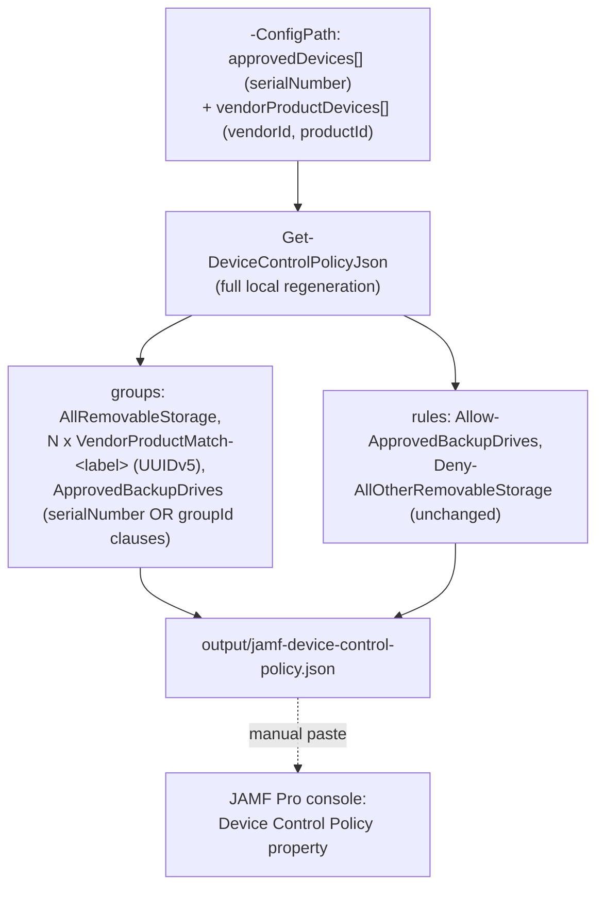

## 1. Problem statement

`scenarios/dlp/defender-device-control-usb-allowlist-macos-jamf/` (the base JAMF scenario) matches
approved removable-storage devices by `serialNumber` only, the same deliberate scope boundary its
Intune-managed counterpart, `defender-device-control-usb-allowlist-macos/`, originally drew, and the
same gap `defender-device-control-usb-allowlist-macos-vendor-product-matching/` (the Intune sibling)
already closes for Intune-managed fleets. A buyer whose approved drives have no readable serial
number, bulk-imaged imaging docks, or third-party enclosures/OEM hardware that report an empty
`serialNumber` field, cannot use the base JAMF scenario's allowlist for those devices at all. This
fragment is the direct JAMF-managed counterpart of the Intune vendor-product-matching sibling,
closing the identical gap for JAMF-managed fleets: `vendorId`+`productId` compound matching, scoped
to `removable_media_devices`.

## 2. Design goals

Identical intent to the Intune sibling's design goals (`defender-device-control-usb-allowlist-macos-
vendor-product-matching/design.md` §2), restated for JAMF's local-regeneration deployment model:

1. **Extend, don't replace the policy content.** `ApprovedBackupDrives` keeps every `serialNumber`
   clause the base scenario's config already carries; this fragment adds vendorId/productId-matched
   devices as additional OR-branches of the *same* group, so a tenant can mix both matching
   mechanisms freely in one allowlist.
2. **No new rule.** `Allow-ApprovedBackupDrives` and `Deny-AllOtherRemovableStorage` both key off
   `ApprovedBackupDrives`' group **id**, not its internal clause contents, adding a device to that
   group's OR-set requires no new or edited rule, identical to the Intune sibling's own reasoning.
3. **Multi-device, not single-device**, any number of vendorId+productId-matched devices, using the
   same deterministic-GUID scheme that lets the Intune sibling support N devices (§4).
4. **One policy identity across a hybrid Intune+JAMF fleet.** This fragment reuses the base JAMF
   scenario's exact fixed group/rule GUIDs *and* the Intune sibling's exact deterministic-UUID
   namespace and hash-input format, so the identical `vendorId`+`productId` pair produces the
   identical sub-group id whether a given Mac is managed through Intune or JAMF (§4).
5. **Idempotent, self-contained artifact generation**, re-running with an unchanged config produces
   byte-identical JSON; an empty `vendorProductDevices` list produces output byte-identical to the
   base scenario's own script for the same `approvedDevices` list (§3).

## 3. Why this is a superset **generator**, not an incremental **patcher** (the JAMF/Intune deployment-model difference)

The Intune sibling's `Add-MacVendorProductDeviceAllowlist.ps1` reads a **live**
`macOSCustomConfiguration` Graph object the base Intune scenario already created, diffs it against
the desired device set, and PATCHes only the changed portion, a genuine incremental *extension* of
an existing, independently-managed object it does not otherwise touch.

JAMF has no equivalent live object this repository's tooling can read or patch: Microsoft documents
no API for the JAMF Pro "Device Control Policy" custom-schema property (confirmed again during this
fragment's own grounding pass against `mac-device-control-jamf`, still explicitly framed as a
third-party, console-only integration with no REST/Classic API guidance), the same gap the base JAMF
scenario's own `design.md` §3 already discloses. Every JAMF deployment of this policy, with or
without vendor/product matching, is "regenerate the complete artifact locally, then paste the whole
thing into the JAMF Pro console by hand" (base scenario `README.md` §5, Steps 3-4). There is no
"live state" for this fragment to read before deciding what to add or remove.

Consequently, this fragment's `deploy/New-JamfVendorProductDeviceAllowlistPolicyJson.ps1` is a
**superset generator**: it accepts one config file carrying *both* `approvedDevices` (serialNumber)
and `vendorProductDevices` (vendorId/productId), and produces the **complete** policy JSON, the same
final shape the Intune sibling's PATCH produces, generated as a single artifact instead of an
incremental diff. Practically, this means:

- **This script supersedes, not supplements, the base JAMF scenario's own deploy script.** A buyer
  who needs vendor/product matching runs *this* script instead of (not in addition to)
  `defender-device-control-usb-allowlist-macos-jamf/deploy/New-JamfDeviceControlPolicyJson.ps1`, and
  re-pastes the resulting artifact into the same JAMF Pro "Device Control Policy" property, replacing
  the base scenario's serialNumber-only content wholesale.
- **No orphan-detection-against-live-state problem exists on this deployment path.** The Intune
  sibling must diff against a live object to detect and remove a device no longer in the config
  (`design.md` §4 there). This fragment has no live state to diff against, every run regenerates the
  complete artifact from the current config, so a removed config entry simply does not appear in the
  next generated file. `validate/Test-JamfVendorProductDeviceAllowlistPolicyJson.ps1` still checks for
  an "orphan" condition (a `VendorProductMatch-` group in the artifact with no matching config entry),
  but that condition can only arise from hand-editing the artifact or validating against a stale
  config, not from this script's own normal operation.
- **This is a materially simpler idempotency model than the Intune sibling's**, precisely because
  JAMF's own deployment mechanism (manual, whole-artifact paste) removes the "incrementally patch a
  live object I don't fully own" problem that motivated the Intune sibling's diff-and-reconcile logic
  in the first place.

This is the same category of disclosed, JAMF-specific automation-shape difference the base scenario's
own `design.md` §3 already establishes for this control family, restated here for the specific case
of extending an already-generated artifact, not newly discovered.

## 4. The deterministic sub-group id (reused verbatim from the Intune sibling, not re-derived)

Same underlying schema constraint as the Intune sibling's `design.md` §3, §4: macOS's device-control
JSON schema keeps `vendorId` and `productId` as two separate clause types, requiring an **AND** of
both inside a per-device `groupId`-referenced sub-group, confirmed against Microsoft's own Clause
reference table (`groupId`: *"Match if a device is a member of another group... The group must be
defined within the policy before the clause."* [[1]](#references)) and against
`deny_all_bluetooth_devices_except_samsung.json`'s worked AND-clause exception-group shape
[[2]](#references).

This fragment reuses the Intune sibling's **exact** solution rather than deriving a JAMF-specific
one: each sub-group's id is `RFC 4122 §4.3` version-5 (name-based, SHA-1) UUID, with namespace
constant `8f3a2b10-8f2e-4c4a-9b8b-2f1a6c9d7e10` (byte-identical to the Intune sibling's) and hash
input `mac-vendor-product-match/v1/<vendorId>:<productId>` (byte-identical format). This is a
deliberate choice, not an implementation convenience: because the hash input is *only* the device's
`vendorId`+`productId` pair (never the deployment mechanism), the identical device approved on both
an Intune-managed Mac and a JAMF-managed Mac gets the identical sub-group id on both policies, the
concrete mechanism behind design goal 4 (§2). A different namespace constant per deployment path
would have made every cross-path id comparison coincidental rather than guaranteed.

Independently verified during the Intune sibling's own build against Python's standard-library
`uuid.uuid5()` reference implementation for the same namespace+name input, reused verbatim in this
fragment's script, not re-verified from scratch (this is a public cryptographic standard, not a
Microsoft product fact requiring separate grounding).

## 5. Policy architecture

No new top-level JAMF profile property, no new `settings` keys, no new rules, identical shape to the
Intune sibling's own §5, generated as a single artifact instead of an incremental PATCH:

| # | Object | Purpose |
|---|---|---|
| 1 | `groups[]`: `AllRemovableStorage` | Unchanged catch-all from the base JAMF scenario. |
| 2 | `groups[]`: one `"VendorProductMatch-<label>"` per `vendorProductDevices` entry | `$type: "device"`, `id` = deterministic UUIDv5, `query: {"$type":"and","clauses":[{"$type":"primaryId","value":"removable_media_devices"},{"$type":"vendorId","value":"<hex>"},{"$type":"productId","value":"<hex>"}]}` |
| 3 | `groups[]`: `ApprovedBackupDrives` | `query.$type` stays `"any"`; `clauses` = every `approvedDevices` `serialNumber` clause, followed by one `{"$type":"groupId","value":"<sub-group id>"}` per `vendorProductDevices` entry. |
| 4 | `rules[]` | Unchanged: `Allow-ApprovedBackupDrives` / `Deny-AllOtherRemovableStorage`, both keyed off `ApprovedBackupDrives`' group id. |

Ordering constraint (`design.md` §4 citation [[1]](#references)): every vendor/product sub-group is
placed in the `groups` array **before** `ApprovedBackupDrives`, satisfying "the group must be defined
within the policy before the clause." `validate/Test-JamfVendorProductDeviceAllowlistPolicyJson.ps1`
checks this ordering explicitly.

## 6. Why this is materially weaker than `serialNumber` matching (disclosed, not glossed over)

Identical caveat and identical resolution to the Intune sibling's own `design.md` §6: `vendorId`/
`productId` identify a **device model**, not a unique physical unit. Any device sharing the
configured pair, a colleague's identical drive model, or a unit with spoofed/reprogrammed USB
descriptor fields, matches the exception, not just the one physically approved unit. Presented as
such in `README.md` §11, not framed as an equivalent alternative to `serialNumber` matching chosen
purely for convenience.

## 7. Key decisions

| Decision | Choice | Rationale |
|---|---|---|
| Deployment shape | Superset **generator** producing the complete artifact, not an incremental patcher | §3, JAMF has no live object to read/patch; every deployment is whole-artifact regeneration + manual paste, the same constraint the base JAMF scenario already established. |
| Relationship to the base JAMF scenario's own script | Supersedes it (run instead of, not alongside) once vendor/product matching is needed | §3, both scripts write to the same default output path; running this one after the base one is the expected "add vendor/product matching" upgrade path, not a parallel artifact. |
| Per-device sub-group id | Deterministic RFC 4122 §4.3 UUIDv5, byte-identical namespace + hash-input format to the Intune sibling | §4, a hybrid Intune+JAMF fleet approving the same device on both paths gets the identical sub-group id on both. |
| Fixed group/rule GUIDs (`AllRemovableStorage`, `ApprovedBackupDrives`, both rules) | Byte-identical to the base JAMF scenario's and the Intune sibling's constants | Preserves this control family's single-policy-identity discipline across all four deployment/matching combinations (Intune×serialNumber, Intune×vendor/product, JAMF×serialNumber, JAMF×vendor/product). |
| Backward-compatible output | An empty `vendorProductDevices` list produces output byte-identical to the base scenario's own script | Lets a buyer already running the base scenario adopt this script as a drop-in without a forced content change until they actually add a vendor/product device. |
| Orphan handling | Not applicable in the same sense as the Intune sibling (§3), a removed config entry simply does not appear in the next regenerated artifact | §3, JAMF's whole-artifact-regeneration model has no live state to leave an orphan behind in; the validate script's orphan check exists only to catch a hand-edited or stale-config artifact. |

## 8. Non-goals

- This scenario does not call the JAMF Pro REST/Classic API, same disclosed gap as the base JAMF
  scenario (`design.md` §3 there), restated here since it applies identically to this fragment's
  output.
- This scenario does not extend vendorId/productId matching to the Apple, Portable, or Bluetooth
  families, those remain each sibling fragment's own scope, matching the Intune sibling's own
  non-goals (its `design.md` §8).
- This scenario does not attempt cryptographic per-unit verification of a vendorId/productId match, 
  no such capability exists in this schema (§6).
- This scenario does not migrate a buyer's existing `serialNumber` clauses to this fragment's
  mechanism, or recommend one over the other beyond the strength disclosure in §6, both remain
  available, buyer's choice per device.
- This scenario does not automate JAMF Pro Steps 2-4 (schema update, `DC_in_dlp` toggle, pasting the
  Device Control Policy property), identical, already-disclosed manual boundary as the base JAMF
  scenario (`README.md` §5 there, referenced unchanged from this scenario's own `README.md` §5).

## References

See `README.md` §12 for the full numbered reference list this design.md's inline citations map to.
