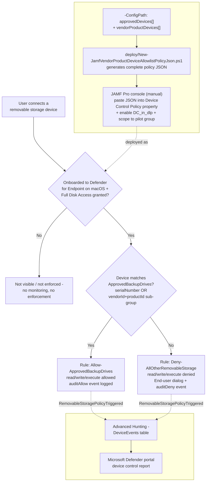

## 1. Scenario summary

Extends `scenarios/dlp/defender-device-control-usb-allowlist-macos-jamf/`'s default-deny USB
allowlist for JAMF-managed macOS endpoints with a second, independent device-matching mechanism:
**vendorId+productId compound matching**, for approved backup/imaging drives that have no readable
`serialNumber` (bulk-imaged imaging docks, some third-party enclosures, certain OEM hardware). This
is the **JAMF-managed sibling** of
`scenarios/dlp/defender-device-control-usb-allowlist-macos-vendor-product-matching/` (Intune-managed)
, the identical policy content, generated as a single local artifact instead of an incremental Graph
PATCH, because JAMF's device control deployment path has no documented API to patch.

**Who it's for:** any organization already running (or planning to run)
`defender-device-control-usb-allowlist-macos-jamf` on a JAMF-managed macOS fleet, whose approved
backup/imaging drives include at least one unit with no readable serial number.

## 2. Business/regulatory driver

Identical framing to both the base JAMF scenario and the Intune vendor-product-matching sibling, 
GDPR Article 32, HIPAA's 45 CFR §164.312 media controls, PCI DSS Requirement 3, and SOC 2 CC6 all
reference media/physical safeguards broadly enough to expect device-identity coverage regardless of
whether a specific approved drive happens to expose a serial number. A tenant that deploys the base
JAMF scenario but has any approved drive with no readable serial number has a real, disclosed gap in
that scenario's own `README.md` §11, this scenario closes it for JAMF-managed fleets, the same way
its Intune sibling closes it for Intune-managed fleets.

A companion assessment-side scenario, `scenarios/compliance-manager/pci-dss-assessment/`, tracks the
same PCI DSS v4.0 improvement actions this technical control and its siblings support.

## 3. Prerequisites

| Requirement | Minimum | Notes |
|---|---|---|
| Base scenario | `scenarios/dlp/defender-device-control-usb-allowlist-macos-jamf/` **prerequisites only** (device control licensing, JAMF Pro, MDE-on-JAMF onboarding, Full Disk Access for `com.microsoft.dlp.daemon`, the existing `com.microsoft.wdav` custom-schema profile) | This scenario adds no new prerequisite beyond the base scenario's own §3, it is a superset artifact, not a separately-deployed object (`design.md` §3). |
| Device control (macOS) | **Microsoft Defender for Endpoint Plan 1** (bundled in Microsoft 365 E3) or higher | Confirmed against Microsoft's JAMF-specific device control deployment guide, same minimum as both siblings [[1]](#references). |
| Device management | **JAMF Pro** (macOS Configuration Profiles, Application & Custom Settings) | Same JAMF Pro tenant already managing the target Macs per the base scenario. |
| Existing base policy JSON (recommended, not required) | The base scenario's `output/jamf-device-control-policy.json`, or its `deploy/config/*.json` config | Useful as a starting point for this scenario's combined config, see §5 Step 1. |
| Approved devices' identifiers | The physical approved drives' serial numbers (if any) and/or their `vendorId`/`productId` (four-digit hex each) | Must be known before running this scenario's deploy script. `vendorId`/`productId` can be read from `system_profiler SPUSBDataType` on a Mac with the device connected, or from the device's own documentation. |
| Automation identity | **None required for this scenario's script** | Same as the base JAMF scenario, reads a local config file and writes a local JSON file only; no Microsoft Graph or JAMF Pro API call (§11, `design.md` §3). |
| Local tooling (optional) | `mdatp` CLI, only if using `-ValidateWithMdatp` | Requires running the deploy or validate script on an already-onboarded Mac's Terminal. |
| Role to author in the JAMF Pro console (human operator) | JAMF Pro role with permission to edit **Configuration Profiles** | Same JAMF-issued RBAC as the base scenario, outside the scope of `docs/rbac-model.md`. |

> Verify current entitlement names and the Product Terms before a sales commitment, SKU names
> change. This scenario's licensing story is identical to the base JAMF scenario's (§10); it adds no
> incremental licensing cost of its own.

## 4. Architecture



Unlike the Intune sibling (which PATCHes a **live** Graph object incrementally), this script has
nothing live to read: JAMF's Device Control Policy property has no documented API, so every
deployment, with or without vendor/product matching, is "regenerate the complete artifact locally,
then paste the whole thing into the JAMF Pro console by hand" (`design.md` §3). This script's output
**supersedes** the base scenario's own output; run it instead of (not alongside) the base scenario's
`New-JamfDeviceControlPolicyJson.ps1` once vendor/product matching is needed. Full rule-by-rule
rationale: `design.md` §5.

## 5. Step-by-step implementation

### Step 0, Prerequisites (one-time, not scripted by this fragment)

Confirm the base scenario's own Step 0 (onboarding + Full Disk Access) and Steps 2 (schema update,
`DC_in_dlp`) and 3 (adding the Device Control property) are already complete, 
`defender-device-control-usb-allowlist-macos-jamf/README.md` §5. This fragment only replaces **what
gets pasted** into the already-added Device Control Policy property; it does not add that property.

### Step 1, Build the combined config (one-time or on every allowlist change)

Copy `deploy/config/mac-jamf-vendor-product-device-allowlist.sample.json`. Populate `approvedDevices`
with any serial-numbered drives (carry these over from the base scenario's own config if you're
upgrading from a serialNumber-only deployment) and `vendorProductDevices` with any devices identified
only by `vendorId`/`productId`. At least one entry across both lists is required.

### Step 2, Generate and validate the policy JSON (scripted)

```powershell
# Dry run - reports what would be written, writes nothing
./deploy/New-JamfVendorProductDeviceAllowlistPolicyJson.ps1 `
    -ConfigPath ./deploy/config/mac-jamf-vendor-product-device-allowlist.sample.json `
    -WhatIf

# Generate the artifact (pass -Force if the base scenario's own output already exists at this path)
./deploy/New-JamfVendorProductDeviceAllowlistPolicyJson.ps1 `
    -ConfigPath ./deploy/config/mac-jamf-vendor-product-device-allowlist.sample.json `
    -Force

# (Optional, run ON an already-onboarded Mac's Terminal) - also locally schema-validate:
./deploy/New-JamfVendorProductDeviceAllowlistPolicyJson.ps1 `
    -ConfigPath ./deploy/config/mac-jamf-vendor-product-device-allowlist.sample.json `
    -Force -ValidateWithMdatp

# Structural re-check at any time
./validate/Test-JamfVendorProductDeviceAllowlistPolicyJson.ps1 `
    -ConfigPath ./deploy/config/mac-jamf-vendor-product-device-allowlist.sample.json
```

This produces `deploy/output/jamf-device-control-policy.json`, the **same default path** the base
scenario's own script writes to, since this artifact supersedes it (§4). Automation surface: local
file generation only, no Graph or JAMF Pro API call (§3, `design.md` §3).

### Step 3, Paste the JSON into JAMF Pro (manual, JAMF Pro console)

Follow `defender-device-control-usb-allowlist-macos-jamf/README.md` §5, Step 3: open the existing
**Device Control Policy** text box on the `com.microsoft.wdav` custom-schema profile, replace its
contents with `deploy/output/jamf-device-control-policy.json`, and **Save**. This is a full
replacement of the prior content, not an append, expected, since this fragment's artifact already
contains everything the prior artifact did (§3, `design.md` §3, backward-compatible-output row).

### Step 4, Confirm scope (manual, JAMF Pro console)

Confirm the profile's **Scope** tab still targets the intended pilot Computer Group (unchanged by
this fragment), see the base scenario's `README.md` §5, Step 4.

## 6. Configuration reference

| Setting | Location in the generated JSON | Value |
|---|---|---|
| Enable Device Control engine | JAMF Pro GUI property, **not** in this JSON | `{"name": "DC_in_dlp", "state": "enabled"}`, unchanged from the base scenario, not re-set by this fragment. |
| Group: `AllRemovableStorage` (catch-all) | `groups[0]` | Unchanged from the base scenario. |
| Group: `VendorProductMatch-<label>` (one per `vendorProductDevices` entry) | `groups[]`, inserted before `ApprovedBackupDrives` | `query: {"$type":"and","clauses":[{"$type":"primaryId","value":"removable_media_devices"},{"$type":"vendorId","value":"<hex>"},{"$type":"productId","value":"<hex>"}]}`; `id` is a deterministic UUIDv5 of `vendorId:productId`. |
| Group: `ApprovedBackupDrives` | `groups[]` | `query: {"$type":"any","clauses":[...serialNumber clauses from approvedDevices..., ...groupId clauses referencing each VendorProductMatch- sub-group...]}` |
| Rule: `Allow-ApprovedBackupDrives` | `rules[0]` | Unchanged from the base scenario, `includeGroups=[ApprovedBackupDrives]`; `allow` + `auditAllow(send_event)`, `access=[read,write,execute]`. |
| Rule: `Deny-AllOtherRemovableStorage` | `rules[1]` | Unchanged from the base scenario. |

All fixed group/rule `id` values are byte-identical to the base JAMF scenario's and the Intune
sibling's own constants; per-device sub-group ids are deterministic and byte-identical across
Intune and JAMF for the same `vendorId`+`productId` pair (`design.md` §4). Full cmdlet/schema
grounding: the deploy script's `.NOTES` block and §12 below.

## 7. Validation / how to prove it works

1. **Device onboarding/Full Disk Access check**, identical to the base scenario's §7 check 1.
2. **Local artifact check**, `./validate/Test-JamfVendorProductDeviceAllowlistPolicyJson.ps1
   -ConfigPath ./deploy/config/mac-jamf-vendor-product-device-allowlist.sample.json` confirms every
   `approvedDevices` serialNumber and every `vendorProductDevices` sub-group (present, correctly
   AND-clause-shaped, referenced from `ApprovedBackupDrives` via `groupId`, and correctly ordered
   before it in the `groups` array) match the config, flags any orphaned `VendorProductMatch-` group,
   and, if `mdatp` is available, re-runs the local schema validator. **This check cannot confirm
   the JSON was actually pasted into JAMF Pro**, see §11.
3. **JAMF Pro console check**, identical to the base scenario's §7 check 3.
4. **Client-side status check** (Terminal on a pilot Mac), identical to the base scenario's §7
   check 4 (`mdatp health --details device_control`).
5. **Functional test (vendor/product-matched drive, no serial number)**, plug in a drive whose
   `vendorId`/`productId` is in the config's `vendorProductDevices` list. Expect: read/write
   succeeds, and a `RemovableStoragePolicyTriggered` event with `Verdict = Allow` appears in Advanced
   Hunting (audited, not silent).
6. **Functional test (unapproved drive)**, identical to the base scenario's §7 check 5.
7. **Advanced Hunting query** (identical to every sibling in this family, `DeviceEvents` is a single,
   OS- and MDM-agnostic table):
   ```kusto
   DeviceEvents
   | where ActionType == "RemovableStoragePolicyTriggered"
   | extend parsed = parse_json(AdditionalFields)
   | project Timestamp, DeviceName, Verdict = tostring(parsed.RemovableStoragePolicyVerdict),
       SerialNumberId = tostring(parsed.SerialNumber)
   | order by Timestamp desc
   ```

## 8. Operations & tuning

**Deployment sequence:** identical staged-rollout discipline to the base scenario's §8, Computer
Group scope is the only rollout lever, set entirely by hand in the JAMF Pro console.

**Change management is manual, identical to the base scenario's §8**, an allowlist change (adding or
removing either a `serialNumber` or a `vendorId`/`productId` entry) means: update `-ConfigPath`,
re-run `deploy/New-JamfVendorProductDeviceAllowlistPolicyJson.ps1 -Force`, then re-paste the full
artifact into the JAMF Pro console (§5 Steps 2-3). Track allowlist changes in whatever
change-management/ticketing process governs JAMF Pro profile edits generally.

**KPIs to watch (first 30 days):** identical framing to every sibling, deny-path volume/distribution
after widening, allow-path volume per approved drive (broken out by matching mechanism, 
`serialNumber` vs. `vendorId`/`productId`, to see which mechanism a given business unit actually
relies on), and `auditDeny` events immediately followed by a new onboarding/exception request.

**Alert routing:** identical to every sibling, Advanced Hunting/`DeviceEvents`, Microsoft Defender
Streaming API, or the Microsoft Defender XDR connector for Microsoft Sentinel.

**Review cadence:** quarterly at minimum; re-run `validate/
Test-JamfVendorProductDeviceAllowlistPolicyJson.ps1` as part of that review, and separately confirm
in the JAMF Pro console that no one has hand-edited the pasted JSON out of band. Review the
vendorId/productId-matched entries with extra scrutiny relative to `serialNumber` entries, a device
model match is a weaker guarantee than a unique physical unit (§11, `design.md` §6).

**Incident-response runbook:** identical structure to the base scenario's §8, with one addition: if
an incident involves a device approved only by `vendorId`/`productId`, treat "is this the actual
physical unit, or just a device of the same model" as an open question the policy itself cannot
answer (§11), corroborate with independent evidence (asset tag, custody log) before concluding the
connection was authorized.

## 9. Rollback / decommission

See `rollback.md` for the full staged procedure. Identical mechanics to the base JAMF scenario's own
rollback (entirely JAMF Pro console actions, there is no API object to delete), with one addition:
reverting to the base scenario's own output (dropping vendor/product matching entirely) is itself a
valid, simpler rollback step, see `rollback.md`.

## 10. Cost & licensing notes

- **No PAYG component and no incremental licensing cost over the base JAMF scenario.** Device control
  for macOS is bundled into Defender for Endpoint Plan 1 (itself bundled into Microsoft 365 E3)
  [[1]](#references), this fragment adds no new licensed capability.
- **JAMF Pro is a separate, third-party licensing line**, entirely outside Microsoft's Product Terms, 
  unchanged from the base scenario.
- **No Microsoft Graph application permission or Entra app registration required**, this fragment's
  script, like the base scenario's, never calls Microsoft Graph or the JAMF Pro API.

## 11. Known limitations & gotchas

- **`vendorId`/`productId` identify a device model, not a unique physical unit.** Any device sharing
  the configured pair, a colleague's identical drive model, or a unit with spoofed/reprogrammed USB
  descriptor fields, matches the exception, not just the one physically approved unit. This is
  **not** a variant of the same risk level as `serialNumber` matching; it is a strictly weaker
  guarantee (`design.md` §6). Presented as such, not as an equivalent alternative for convenience.
- **This scenario's automation stops at generating and locally validating the policy JSON, it does
  not deploy anything**, and pasting the result into JAMF Pro **replaces** the prior content
  wholesale (§5 Step 3), identical, already-disclosed gap and mechanic to the base JAMF scenario
  (`README.md` §11 there).
- **No remote, at-scale way to confirm the pasted JSON matches the intended artifact**, identical gap
  to the base JAMF scenario; the same JAMF-console-only audit trail limitation applies here, now also
  covering vendor/product-matched entries.
- **A device presenting as a Portable Device, Apple (iOS/iPadOS) device, or Bluetooth media is
  completely invisible to this control**, unchanged, disclosed scope boundary inherited from the
  base scenario; this fragment does not extend vendor/product matching to those families (a separate
  follow-up, tracked in `PROGRESS.md`, the same as for the Intune sibling).
- **VERIFY (pilot tenant or a future Microsoft Learn/GitHub-samples grounding pass):** no directly-
  confirmed Microsoft worked example pairs a `groupId` clause with **more than one** sibling sub-group
  inside one `any` query. The `groupId` clause type itself, its "match if a device is a member of
  another group" semantics, and the "group must be defined within the policy before the clause"
  ordering requirement are directly confirmed from Microsoft's own Clause reference table
  [[1]](#references), but the N-sub-groups-in-one-OR-query composition this fragment performs is this
  repository's own application of that documented primitive, inherited unresolved from the Intune
  sibling's own equivalent VERIFY, not independently re-checked or newly resolved by this fragment.
- **VERIFY (`developer.jamf.com`, or a pilot JAMF Pro tenant):** whether a documented JAMF Pro
  REST/Classic API exists for setting the Device Control Policy custom-schema property
  programmatically, the same open item the base JAMF scenario's own `README.md` §11 already tracks.
  If resolved, this fragment's Step 3 (§5) could be automated end-to-end the same way it would close
  the base scenario's equivalent gap.
- **Device control has no content awareness at all**, pair with a future macOS-scoped Endpoint DLP
  control for content inspection on the approved path too, the same complementary-layers framing as
  every sibling in this family.

## 12. References

1. Device Control for macOS (Clause reference table, `groupId` "Match if a device is a member of
   another group. The value represents the UUID of the group to match against. The group must be
   defined within the policy before the clause."; `vendorId`/`productId` "Four digit hexadecimal
   string"; query `any`/`or` OR semantics; Prepare your endpoints, Full Disk Access, `DC_in_dlp`,
   minimum client version `101.91.92`), <https://learn.microsoft.com/defender-endpoint/mac-device-control-overview>
2. Sample macOS device control policies (`deny_all_bluetooth_devices_except_samsung.json`, the
   `vendorId`+`productId` AND-clause exception-group shape this fragment generalizes to N devices and
   to the `removable_media_devices` family), <https://github.com/microsoft/mdatp-devicecontrol/blob/main/macOS/policy/samples/deny_all_bluetooth_devices_except_samsung.json>
3. Deploy and manage Device Control using JAMF (Steps 1-4: author JSON, validate with `mdatp`, update
   the Defender for Endpoint preferences schema, add the Device Control Policy property; states the
   Microsoft 365 E3 / Defender for Endpoint Plan 1 licensing minimum; frames JAMF as a third-party
   tool with no Microsoft-provided API guidance), <https://learn.microsoft.com/defender-endpoint/mac-device-control-jamf>
4. Device control policies in Microsoft Defender for Endpoint ("The rules and policies are combined
   into a single JSON and configured by using JAMF as the device control policy"; shared
   groups/rules/entries concepts across Windows and macOS), <https://learn.microsoft.com/defender-endpoint/device-control-policies>
5. RFC 4122, Section 4.3 (name-based UUID, algorithm for creating a version-5 UUID), <https://www.rfc-editor.org/rfc/rfc4122#section-4.3>
6. `scenarios/dlp/defender-device-control-usb-allowlist-macos-jamf/`, the base JAMF scenario this
   fragment extends; see that scenario's own references for the onboarding, Full Disk Access, and
   JAMF-console-procedure citations.
7. `scenarios/dlp/defender-device-control-usb-allowlist-macos-vendor-product-matching/`, the Intune
   sibling this fragment's group-generation logic and deterministic-UUID scheme are ported from
   verbatim; see that scenario's own references for the Intune/Graph-side citations.

> Re-verify all links, and especially §11's open VERIFYs, against current Microsoft Learn, JAMF's own
> developer documentation, and a pilot tenant before a customer-facing assessment or sale.
