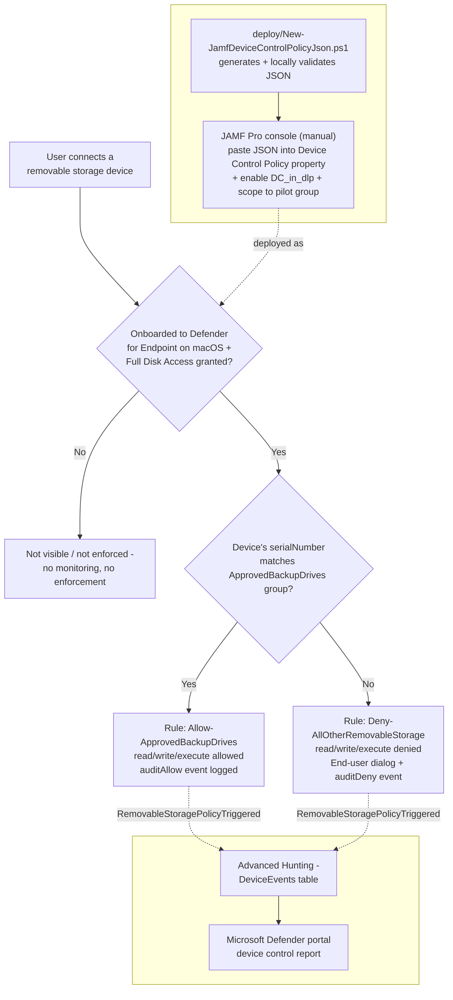

## 1. Problem statement

`scenarios/dlp/defender-device-control-usb-allowlist-macos/` deploys the same default-deny,
named-allowlist removable-storage control for **Intune-managed** Macs. That scenario's own
non-goals (`design.md` §8) explicitly call out JAMF as "Microsoft's other documented macOS
deployment path" and defer it as a candidate follow-up "if a buyer's fleet is JAMF-managed rather
than Intune-managed", flagged again in `PROGRESS.md`'s follow-up backlog. A buyer whose Mac fleet
is managed by JAMF Pro (a large share of the enterprise/education macOS-management market) cannot
use the Intune sibling at all, Microsoft Graph's `macOSCustomConfiguration` resource only applies
to Intune-enrolled devices.

This scenario is that JAMF-managed sibling. It enforces the **identical policy**, same groups,
same rules, same fail-closed settings, because macOS Device Control's JSON policy schema is one
schema regardless of which MDM delivers it [[2]](#references). Only the delivery mechanism differs.

## 2. Design goals

Identical to the Intune sibling's design goals (`defender-device-control-usb-allowlist-macos/
design.md` §2), restated for JAMF:

1. **Default-deny for removable storage**, scoped to `removable_media_devices` only.
2. **A single named allowlist group** (`ApprovedBackupDrives`, matched by `serialNumber`).
3. **Both the allow and the deny paths are audited.**
4. **Idempotent artifact generation.** Re-running the deploy script with an unchanged config
   produces byte-identical output; re-running after an allowlist change overwrites the artifact
   (with `-Force`) rather than silently drifting.
5. **A hybrid Intune+JAMF fleet runs one identical policy identity.** This scenario reuses the
   Intune sibling's exact group/rule GUIDs and names (§4 below) so a buyer managing some Macs
   through Intune and others through JAMF is enforcing the literal same control, not two
   independently-drifting near-duplicates.

## 3. Why this scenario does **not** call the JAMF Pro REST API (and what it does instead)

Microsoft's own documented JAMF procedure for Device Control (`mac-device-control-jamf`
[[1]](#references)) is a four-step, JAMF-console-driven workflow:

| Step | What it is | Scriptable by this repo? |
|---|---|---|
| 1. Create a JSON policy | Author the groups/rules/settings JSON | **Yes**, `deploy/New-JamfDeviceControlPolicyJson.ps1` |
| 2. Validate the JSON | `mdatp device-control policy validate --path <file>`, a local CLI command | **Yes**, when run on an onboarded Mac, same script, `-ValidateWithMdatp` |
| 3. Update the Defender preferences schema | JAMF Pro GUI: re-upload the latest `schema.json` to the existing "MDE Preferences" custom-schema profile, enable `DC_in_dlp` under Data Loss Prevention (DLP) > Features | **No**, JAMF-console-only, no documented API |
| 4. Add the Device Control property | JAMF Pro GUI: **Add/Remove properties** → **Device Control** → **Device Control Policy**, paste the Step 1 JSON | **No**, JAMF-console-only, no documented API |

Steps 3-4 are the crux of this design decision. Microsoft's article explicitly frames JAMF as a
"third-party tool" it does not provide API-level guidance for, and this build's own grounding pass
found no confirmed JAMF Pro REST API request body for populating a **Custom-Schema-sourced**
Application & Custom Settings property (as opposed to a plain uploaded `.plist`, a different,
simpler mechanism JAMF also supports for other Defender for Endpoint preferences [[4]](#references),
but not the one Microsoft's own Device Control article documents). `developer.jamf.com` was
unreachable from this build's network environment, so the exact JAMF Pro API shape for this
specific property type could not be independently confirmed either way.

Consistent with this repo's grounding standard (`AGENTS.md` §4, do not invent cmdlet names, API
bodies, or portal paths) and its own established precedent for exactly this situation (the
"Removable USB device groups" fragment closed as portal-only in `endpoint-dlp-usb-block/README.md`
§11 after its own PowerShell layer proved undocumented), this scenario does **not** fabricate a
JAMF Pro API call for Steps 3-4. Instead, `deploy/New-JamfDeviceControlPolicyJson.ps1` automates
exactly the two steps Microsoft **does** document as scriptable (JSON authoring + local schema
validation), and `README.md` §5 documents Steps 3-4 as precise, numbered manual JAMF-console
instructions, not vague hand-waving, but the literal portal path a buyer's Mac administrator
follows.

This is a materially different automation shape from the Intune sibling (a full create-or-reconcile
Graph API script), disclosed, not hidden, as this scenario's own primary scope boundary
(`README.md` §11, first bullet).

## 4. Policy content (identical to the Intune sibling)

| # | Object | Purpose |
|---|---|---|
| 1 | `settings.features.removableMedia.disable = false` | Enables enforcement for the `removableMedia` feature. |
| 2 | `settings.global.defaultEnforcement = "deny"` | Fail-closed default. |
| 3 | `groups[0]` "AllRemovableStorage" (catch-all) | `query: {"$type":"all","clauses":[{"$type":"primaryId","value":"removable_media_devices"}]}` |
| 4 | `groups[1]` "ApprovedBackupDrives" | `query: {"$type":"any","clauses":[{"$type":"serialNumber","value":"<serial>"}, ...]}` |
| 5 | `rules[0]` "Allow-ApprovedBackupDrives" | `includeGroups=[ApprovedBackupDrives]`; `allow` + `auditAllow(send_event)`, `access=[read,write,execute]` |
| 6 | `rules[1]` "Deny-AllOtherRemovableStorage" | `includeGroups=[AllRemovableStorage]`, `excludeGroups=[ApprovedBackupDrives]`; `deny` + `auditDeny(send_event, show_notification)`, `access=[read,write,execute]` |

Every property name, clause `$type`, and access value is confirmed directly against Microsoft's
"Device Control for macOS" reference [[2]](#references), the same source the Intune sibling's
`design.md` §4 cites, this scenario's script literally reuses that generation logic, minus the
`.mobileconfig`/plist wrapper the Intune path needs and the JAMF path does not (JAMF ingests the
policy as plain JSON pasted into a GUI text box, not a base64-encoded payload
[[1]](#references)).

## 5. Why `serialNumber`-only matching (same rationale as the Intune sibling)

Unchanged from the Intune sibling's `design.md` §5, macOS's JSON schema requires `vendorId`/
`productId` compound matching to go through a per-device `groupId` sub-group, a materially more
complex, dynamic-GUID idempotency model this fragment deliberately defers rather than build
unverified. See that scenario's `design.md` §5 for the full reasoning; it applies identically here
since the policy schema itself is unchanged.

## 6. Key decisions

| Decision | Choice | Rationale |
|---|---|---|
| Authoring mechanism | Same groups/rules/settings JSON as the Intune sibling, generated by a local PowerShell function, no plist/mobileconfig wrapper | JAMF's Device Control property accepts plain JSON pasted into a GUI text box (§3), unlike Intune's base64-`.mobileconfig`-payload requirement. |
| Deploy surface | Local file generation + optional `mdatp` CLI shell-out, **not** the JAMF Pro REST API | §3 above, no confirmed API body for this property type; consistent with `AGENTS.md` §4. |
| Device matching | `serialNumber` only | §5 above, same as the Intune sibling. |
| Group/rule identifiers | The Intune sibling's exact fixed GUIDs, reused verbatim | §2 goal 5, one policy identity across a hybrid Intune+JAMF fleet. |
| Idempotency model | Deterministic JSON generation; unchanged content is a no-op, changed content requires `-Force` to overwrite | Mirrors the Intune sibling's "no silent clobber" discipline, adapted from a Graph PATCH to a local file write. |
| JAMF-console steps | Documented as precise, numbered manual instructions in `README.md` §5, not scripted | §3 above. |

## 7. Data flow / staged rollout

Enforcement runs **locally on the Mac** via the same `mdatp` client and minimum version
(`101.91.92`) as the Intune sibling [[2]](#references), with the same Full Disk Access dependency
for `com.microsoft.dlp.daemon`, deployed via JAMF's own documented mechanism
(`fulldisk.mobileconfig`, uploaded through the JAMF Pro console per `mac-jamfpro-policies` Step 6
[[3]](#references), also referenced directly from the Purview-specific JAMF onboarding guide
[[5]](#references)) rather than Intune's identical `fulldisk.mobileconfig` upload.

There is no policy-level simulation mode on either deployment path. On JAMF, the staged-rollout
lever is the profile's **Scope** tab (a specific Computer Group, never "All Computers" on a first
rollout), set by hand in the JAMF Pro console, since this scenario's script has no API surface to
set it programmatically (§3). `-ConfigPath`'s `jamfComputerGroupName` field is documentation-only,
carried through to the deploy script's console output as a reminder, not an API parameter.

## 8. Non-goals

- This scenario does not onboard Macs to Microsoft Defender for Endpoint via JAMF, deploy the Full
  Disk Access (PPPC) profile for `com.microsoft.dlp.daemon`, or update the JAMF Pro "MDE
  Preferences" custom-schema profile's `schema.json`, all are prerequisites, not deployed
  artifacts, the same boundary the Intune sibling draws for its own onboarding/enrollment
  dependency.
- This scenario does not call the JAMF Pro REST/Classic API, §3 above.
- This scenario does not restrict Apple (iOS/iPadOS) devices, Portable devices, or Bluetooth media
, only `removable_media_devices`. Identical gap to the Intune sibling's own disclosed WPD/
  portable-device boundary (`defender-device-control-usb-allowlist-macos/README.md` §11), called
  out with equal weight in this scenario's own `README.md` §11, not treated as lower-severity
  because it is a "JAMF-only" gap.
- This scenario does not implement `vendorId`/`productId` compound matching, §5 above.
- This scenario does not deploy the general Defender for Endpoint on macOS onboarding package,
  antivirus/EDR settings, notifications, AutoUpdate, system extensions, network extension, or
  background-services profiles `mac-jamfpro-policies` [[3]](#references) documents as separate,
  broader MDE-on-JAMF setup steps, out of scope; this scenario assumes Defender for Endpoint is
  already fully deployed and onboarded via JAMF, and adds only the Device Control policy on top.

## References

See `README.md` §12 for the full numbered reference list this design.md's inline citations map to.
