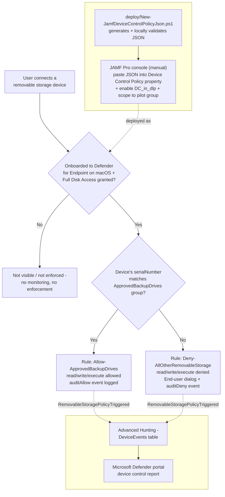

## 1. Scenario summary

Denies **all** removable USB storage devices on JAMF-managed macOS endpoints by default, allowing
only a short, named allowlist of IT-issued, identity-verified backup/imaging drives (matched by
serial number) to read and write. This is the **JAMF-managed sibling** of
[`dlp/defender-device-control-usb-allowlist-macos`](/scenarios/dlp/defender-device-control-usb-allowlist-macos/) (Intune-managed) — the identical
policy content, delivered through JAMF Pro's own device-control mechanism instead of Microsoft
Graph, for organizations whose Mac fleet is managed by JAMF rather than Intune.

**Who it's for:** any organization whose macOS fleet is managed through JAMF Pro (rather than
Intune) that wants the same default-deny USB allowlist posture this repo's Windows and
Intune-managed-macOS scenarios already provide — a common split in enterprises where JAMF is the
long-standing Apple-device MDM and Intune is Windows-only, or where JAMF and Intune are run
side-by-side across a mixed macOS fleet.

## 2. Business/regulatory driver

Identical regulatory framing to both siblings — GDPR Article 32, HIPAA's 45 CFR §164.312 media
controls, PCI DSS Requirement 3, and SOC 2 CC6 all reference media/physical safeguards broadly
enough to expect device-identity coverage regardless of which MDM manages a given endpoint. A
tenant that deploys `defender-device-control-usb-allowlist-macos` (Intune) but has any
JAMF-managed Macs in scope has the same "no unapproved USB storage device, period" overclaim risk
that scenario itself closes for Intune-managed Macs — this scenario closes the JAMF-managed half
of that same gap.

A companion assessment-side scenario, [`compliance-manager/pci-dss-assessment`](/scenarios/compliance-manager/pci-dss-assessment/), tracks
the same PCI DSS v4.0 improvement actions this technical control and its siblings support.

## 3. Prerequisites

| Requirement | Minimum | Notes |
|---|---|---|
| Device control (macOS) | **Microsoft Defender for Endpoint Plan 1** (bundled in Microsoft 365 E3) or higher | Confirmed directly against Microsoft's JAMF-specific device control deployment guide, which states the same Microsoft 365 E3 minimum in language matching the Intune and Windows guides [[1]](#references). |
| Device management | **JAMF Pro** (macOS Configuration Profiles, Application & Custom Settings) | This scenario's manual steps (§5) assume an existing JAMF Pro tenant already managing the target Macs. |
| Device onboarding | Mac already onboarded to **Microsoft Defender for Endpoint via JAMF**, running Defender for Endpoint on macOS client version **101.91.92** or later | Not performed by this scenario — see `mac-jamfpro-policies` for the full JAMF-based MDE onboarding procedure [[3]](#references)[[4]](#references). |
| MDE Preferences profile | An existing JAMF Pro **Custom Schema**-sourced Application & Custom Settings profile, Preference Domain **exactly** `com.microsoft.wdav`, with the current `schema.json` loaded | Confirmed as a strict requirement — Microsoft's JAMF setup guide states "You must use exact `com.microsoft.wdav` as the Preference Domain" [[3]](#references). This scenario's Step 3 (§5) updates this existing profile; it does not create it from scratch. |
| **Full Disk Access for `com.microsoft.dlp.daemon`** | A Privacy Preferences Policy Control (PPPC) profile (JAMF: uploaded `fulldisk.mobileconfig`, or the equivalent GUI-built PPPC payload) granting Full Disk Access to this specific process | **macOS-specific prerequisite with no Windows equivalent**, identical to the Intune sibling. Device control cannot enforce without it [[2]](#references)[[3]](#references)[[5]](#references). Not performed by this scenario — see §5 Step 0 and §11. |
| Supported OS | macOS, versions listed in Microsoft's Defender for Endpoint on macOS system requirements | See `microsoft-defender-endpoint-mac` for the current supported-OS list. |
| Role to author in the JAMF Pro console (human operator) | JAMF Pro role with permission to edit **Configuration Profiles** | JAMF's own RBAC model, not a Microsoft/Purview role — outside the scope of `docs/rbac-model.md`, which covers Microsoft-issued roles only. |
| Automation identity | **None required for this scenario's script** | Unlike the Intune sibling, `deploy/New-JamfDeviceControlPolicyJson.ps1` calls no Microsoft Graph or JAMF Pro API — it only reads a local config file and writes a local JSON file (§11, `design.md` §3). |
| Local tooling (optional) | `mdatp` CLI, only if using `-ValidateWithMdatp` | Requires running the deploy or validate script on an already-onboarded Mac's Terminal — see §5, §7. |
| Dependency (not deployed by this scenario) | The physical **approved backup drives'** serial numbers, and a JAMF Pro **Computer Group** scoping the pilot set of Macs | Must exist/be known before running `deploy/New-JamfDeviceControlPolicyJson.ps1` and before completing §5's manual JAMF-console steps. |

> Verify current entitlement names and the Product Terms before a sales commitment — SKU names
> change. This scenario's licensing story is identical in shape to both siblings' (§10). Unlike
> either, this scenario's own automation makes **no API calls at all** — see §11 for why.

## 4. Architecture



The policy JSON (two groups, two mutually-exclusive rules) is generated locally by
`deploy/New-JamfDeviceControlPolicyJson.ps1`, then pasted by hand into a JAMF Pro **Device Control
Policy** custom-schema property — Microsoft documents no API for that last step (§11,
`design.md` §3). Enforcement happens **locally on the Mac** via the Defender for Endpoint sensor,
identical to the Intune sibling. Full rule-by-rule rationale: `design.md` §4.

## 5. Step-by-step implementation

### Step 0 — Confirm onboarding and Full Disk Access first (one-time, not scripted)

Target Macs must already be onboarded to Microsoft Defender for Endpoint via JAMF and have a PPPC
profile granting **Full Disk Access** to `com.microsoft.dlp.daemon` —
[Microsoft Defender portal](https://security.microsoft.com) → **Assets** → **Devices** to confirm
onboarding; deploy/update `fulldisk.mobileconfig` via the JAMF Pro console if not already present,
following `mac-jamfpro-policies` Step 6 [[3]](#references), also referenced directly from the
Purview-specific JAMF onboarding guide [[5]](#references).

### Step 1 — Generate and validate the policy JSON (scripted)

```powershell
# 1. Edit deploy/config/mac-device-control-usb-allowlist-jamf.sample.json (or copy it) with your
#    approved-device serial numbers.

# 2. Dry run - reports what would be written, writes nothing
./deploy/New-JamfDeviceControlPolicyJson.ps1 `
    -ConfigPath ./deploy/config/mac-device-control-usb-allowlist-jamf.sample.json `
    -WhatIf

# 3. Generate the artifact
./deploy/New-JamfDeviceControlPolicyJson.ps1 `
    -ConfigPath ./deploy/config/mac-device-control-usb-allowlist-jamf.sample.json

# 4. (Optional, run ON an already-onboarded Mac's Terminal) - also locally schema-validate:
./deploy/New-JamfDeviceControlPolicyJson.ps1 `
    -ConfigPath ./deploy/config/mac-device-control-usb-allowlist-jamf.sample.json `
    -ValidateWithMdatp

# 5. Structural re-check at any time
./validate/Test-JamfDeviceControlPolicyJson.ps1 `
    -ConfigPath ./deploy/config/mac-device-control-usb-allowlist-jamf.sample.json
```

This produces `deploy/output/jamf-device-control-policy.json` — plain JSON, ready to paste into the
JAMF Pro console in Step 4 below. Automation surface: local file generation only, no Graph or JAMF
Pro API call (§3, `design.md` §3).

### Step 2 — Update the Defender for Endpoint preferences schema (manual, JAMF Pro console)

1. Download the latest `schema.json` from Microsoft's GitHub repository [[6]](#references).
2. In JAMF Pro, open the existing **Application & Custom Settings** profile whose Preference Domain
   is `com.microsoft.wdav` (§3) and select **Edit schema** to re-upload the downloaded file
   [[3]](#references)[[7]](#references).
3. Under **Preference Domain Properties**, enable **Data Loss Prevention (DLP)** →
   **Features** → set **Feature Name** to `DC_in_dlp`, **State** to `enabled`
   [[2]](#references). This is a separate, easy-to-miss toggle from the Device Control policy
   itself (§6) — without it, the policy in Step 4 is inert.

### Step 3 — Add the Device Control property and paste the JSON (manual, JAMF Pro console)

1. Still on the same profile, select **Add/Remove properties**, select **Device Control**, and
   then select **Apply** [[7]](#references).
2. Scroll to the **Device Control** property, select **Add/Remove properties** again, select
   **Device Control Policy**, and select **Apply** [[7]](#references).
3. Open `deploy/output/jamf-device-control-policy.json` (Step 1) and paste its full contents into
   the **Device Control Policy** text box [[7]](#references).
4. **Save** your changes.

### Step 4 — Scope to a pilot Computer Group (manual, JAMF Pro console)

Select the **Scope** tab and target a **pilot Computer Group** — never "All Computers" on a first
rollout, the same staged-rollout discipline as every scenario in this repo (`AGENTS.md` §4). Select
**Save**.

## 6. Configuration reference

| Setting | Location in the generated JSON | Value |
|---|---|---|
| Enable Device Control engine | JAMF Pro GUI property, **not** in this JSON | Data Loss Prevention (DLP) → Features → `{"name": "DC_in_dlp", "state": "enabled"}` — a separate schema property set in §5 Step 2, not part of `deploy/output/jamf-device-control-policy.json`. |
| Enable removable-media enforcement | `settings.features.removableMedia.disable` | `false` |
| Fail-closed default | `settings.global.defaultEnforcement` | `"deny"` |
| Group: `AllRemovableStorage` (catch-all) | `groups[0]` | `query: {"$type":"all","clauses":[{"$type":"primaryId","value":"removable_media_devices"}]}` |
| Group: `ApprovedBackupDrives` | `groups[1]` | `query: {"$type":"any","clauses":[{"$type":"serialNumber","value":"<serial>"}, ...]}` from config |
| Rule: `Allow-ApprovedBackupDrives` | `rules[0]` | `includeGroups=[ApprovedBackupDrives]`; `allow` + `auditAllow(send_event)`, `access=[read,write,execute]` |
| Rule: `Deny-AllOtherRemovableStorage` | `rules[1]` | `includeGroups=[AllRemovableStorage]`, `excludeGroups=[ApprovedBackupDrives]`; `deny` + `auditDeny(send_event, show_notification)`, `access=[read,write,execute]` |

All group/rule `id` values are fixed constants defined in
`deploy/New-JamfDeviceControlPolicyJson.ps1` — the same values as the Intune sibling's script
(`design.md` §2 goal 5, §6), so a hybrid Intune+JAMF fleet enforces one identical policy identity.
Full cmdlet/CLI/schema grounding: the deploy script's `.NOTES` block and §12 below.

## 7. Validation / how to prove it works

1. **Device onboarding/Full Disk Access check** — confirm pilot Macs show as onboarded in the
   Microsoft Defender portal and have Full Disk Access granted to `com.microsoft.dlp.daemon` before
   assuming any functional test result — device control silently does nothing without both.
2. **Local artifact check** — `./validate/Test-JamfDeviceControlPolicyJson.ps1 -ConfigPath
   ./deploy/config/mac-device-control-usb-allowlist-jamf.sample.json` confirms the generated JSON's
   groups/rules/settings match the intended config and, if `mdatp` is available on the validating
   machine, re-runs the local schema validator. **This check cannot confirm the JSON was actually
   pasted into JAMF Pro** — see §11.
3. **JAMF Pro console check** — open the profile from §5 and visually confirm the **Device Control
   Policy** text box still contains the expected JSON, the **DC_in_dlp** feature is `enabled`, and
   the **Scope** tab targets the intended pilot Computer Group.
4. **Client-side status check** (Terminal on a pilot Mac) —
   ```sh
   mdatp health --details device_control
   ```
   Confirm `v2_configured: true`, `v2_state: "enabled"`, and `v2_full_disk_access: "approved"`
   before running a functional test — identical check to the Intune sibling; this output is the
   same regardless of which MDM delivered the policy [[2]](#references).
5. **Functional test (unapproved drive)** — plug in a removable USB drive **not** on the approved
   list. Expect: read/write denied, an end-user dialog naming the restriction, and a
   `RemovableStoragePolicyTriggered` event with `RemovableStoragePolicyVerdict = Deny` in Advanced
   Hunting.
6. **Functional test (approved drive)** — plug in a drive whose serial number is in the
   `approvedDevices` config list. Expect: read/write succeeds, and a
   `RemovableStoragePolicyTriggered` event with `Verdict = Allow` still appears (audited, not
   silent — §2).
7. **Advanced Hunting query** (identical to both siblings — `DeviceEvents` is a single, OS- and
   MDM-agnostic table):
   ```kusto
   DeviceEvents
   | where ActionType == "RemovableStoragePolicyTriggered"
   | extend parsed = parse_json(AdditionalFields)
   | project Timestamp, DeviceName, Verdict = tostring(parsed.RemovableStoragePolicyVerdict),
       SerialNumberId = tostring(parsed.SerialNumber)
   | order by Timestamp desc
   ```

## 8. Operations & tuning

**Deployment sequence:** Off (not assigned) → assigned to a pilot JAMF Computer Group → tuned →
widened to a broader Computer Group. There is no service-side simulation mode — Computer Group
scope **is** the staged-rollout lever, identical in spirit to both siblings, but set entirely by
hand in the JAMF Pro console (§11).

**Change management is manual for this deployment path.** Unlike the Intune sibling's Graph-based
create-or-reconcile script, an allowlist change here means: re-run
`deploy/New-JamfDeviceControlPolicyJson.ps1` with the updated config, then repeat §5 Steps 3–4 by
hand in the JAMF Pro console. Track this in whatever change-management/ticketing process governs
JAMF Pro profile edits generally — this scenario does not provide its own audit trail beyond JAMF
Pro's own configuration-profile history (`reviews.md`, Blue Team).

**KPIs to watch (first 30 days):** identical framing to both siblings — deny-path volume/
distribution after widening, allow-path volume per approved drive as a usage baseline, and
`auditDeny` events immediately followed by a new onboarding/PPPC-exception request.

**Alert routing:** Advanced Hunting/`DeviceEvents` is queryable directly in the Microsoft Defender
portal; for SIEM integration, route through the **Microsoft Defender Streaming API** or the
**Microsoft Defender XDR connector for Microsoft Sentinel**'s "Connect events" option — see the
Windows sibling's `README.md` §8 for the same citations, which apply identically here since
`DeviceEvents` is a single, OS- and MDM-agnostic Advanced Hunting table.

**Review cadence:** quarterly at minimum; re-run `validate/Test-JamfDeviceControlPolicyJson.ps1` as
part of that review, and separately confirm in the JAMF Pro console that no one has hand-edited the
pasted JSON out of band. Review the approved-device allowlist itself on the same cadence as any
other privileged-access list.

**Incident-response runbook:** identical structure to both siblings' (triage via Advanced Hunting →
classify legitimate-need-vs-unapproved-attempt → remove a lost/decommissioned drive's entry and
re-run Steps 1–4 → document). The one JAMF-specific addition: because Steps 3–4 are manual, confirm
the change was actually applied in the JAMF Pro console (§7 check 3) before assuming a revoked
drive's access has actually been cut off — a re-generated local JSON file with no corresponding
JAMF-console update changes nothing on any Mac.

## 9. Rollback / decommission

See `rollback.md` for the full staged procedure. Unlike both siblings, there is no API object this
scenario's scripts can delete — rollback here is entirely a JAMF Pro console action (remove/blank
the Device Control Policy property, or unscope the profile).

## 10. Cost & licensing notes

- **No PAYG component.** Device control for macOS is bundled into Defender for Endpoint Plan 1
  (itself bundled into Microsoft 365 E3) — identical to both siblings [[1]](#references).
- **JAMF Pro is a separate, third-party licensing line**, entirely outside Microsoft's Product
  Terms — size and budget it against JAMF's own pricing, not Microsoft's.
- **No additional Azure subscription required**, and — unlike the Intune sibling — **no Microsoft
  Graph application permission or Entra app registration is required at all**, since this
  scenario's script never calls Microsoft Graph (§3).
- **Sizing note:** license only the Macs in the Device Control profile's JAMF Computer Group scope
  — staged rollout (§8) limits initial licensing exposure to the pilot group.

## 11. Known limitations & gotchas

- **This scenario's automation stops at generating and locally validating the policy JSON — it does
  not deploy anything.** Unlike both siblings (which call an API end-to-end), Steps 3–4 (§5) are
  manual JAMF Pro console actions because Microsoft documents no API for JAMF's Device Control
  Policy custom-schema property, and this build's own grounding pass could not independently confirm
  a JAMF Pro API shape for it either (`developer.jamf.com` was unreachable in this build's network
  environment — `design.md` §3). This is a genuine, disclosed automation gap, not an oversight: a
  buyer evaluating this scenario against the Intune sibling should expect a materially higher manual
  step count and a JAMF-console-only audit trail for every allowlist change.
- **A device presenting as a Portable Device, Apple (iOS/iPadOS) device, or Bluetooth media is
  completely invisible to this control, not merely unrestricted.** Identical gap to the Intune
  sibling's own disclosed Portable-Device/Apple-device boundary
  (`defender-device-control-usb-allowlist-macos/README.md` §11) — this scenario's policy scopes
  enforcement to `removable_media_devices` only (§6). Not re-scoped here because the underlying
  policy JSON is identical to the Intune sibling's; closing it there (tracked in `PROGRESS.md`)
  closes it here too once this scenario adopts the updated policy shape.
- **This scenario matches approved devices by `serialNumber` only, not `vendorId`/`productId`** —
  identical scope boundary and rationale to the Intune sibling (`design.md` §5 there).
- **Full Disk Access for `com.microsoft.dlp.daemon` is a hard, silent prerequisite.** Identical to
  the Intune sibling — always check `mdatp health --details device_control`'s
  `v2_full_disk_access` value (§7 check 4) before concluding a functional test failure is a policy
  bug.
- **No remote, at-scale way to confirm the pasted JSON matches the intended artifact.** JAMF Pro's
  console shows the pasted text, but this repo found no documented JAMF Pro API to read it back
  programmatically — `validate/Test-JamfDeviceControlPolicyJson.ps1` can only confirm the **local**
  generated file is correct, never that the JAMF-console paste step (§5 Step 3) was performed
  correctly or at all. A silent copy/paste error (partial paste, stale JSON from a previous config)
  is not detectable by anything in this scenario's automation — only by the manual console check
  (§7 check 3) or a functional test (§7 checks 5–6).
- **Device control has no content awareness at all** — pair with a future macOS-scoped Endpoint DLP
  control for content inspection on the approved path too, the same complementary-layers framing as
  both siblings.
- **VERIFY (pilot tenant or a future grounding pass against `developer.jamf.com`):** whether a
  documented JAMF Pro API request body exists for programmatically setting a Custom-Schema-sourced
  Application & Custom Settings property's value (as opposed to uploading a plain `.plist` file, a
  different and simpler mechanism JAMF also supports for other Defender for Endpoint preferences).
  If one is found, Steps 2–4 of §5 could be automated end-to-end, closing this scenario's primary
  disclosed gap above. `developer.jamf.com` was unreachable from this build's network environment.

## 12. References

1. Deploy and manage Device Control using JAMF (JSON policy authoring, `mdatp device-control policy
   validate`, updating the Defender preferences schema, adding the Device Control property; states
   the Microsoft 365 E3 / Defender for Endpoint Plan 1 licensing minimum) — <https://learn.microsoft.com/defender-endpoint/mac-device-control-jamf>
2. Device Control for macOS (policy model: settings/groups/query/clause/rules/entries/enforcement/
   access schema tables; "Prepare your endpoints" — Full Disk Access for `com.microsoft.dlp.daemon`,
   `DC_in_dlp` via Data Loss Prevention (DLP) > Features, minimum client version `101.91.92`,
   `mdatp health`/`mdatp version` status fields) — <https://learn.microsoft.com/defender-endpoint/mac-device-control-overview>
3. Set up the Microsoft Defender for Endpoint on macOS policies in Jamf Pro (Step 3b: Preference
   Domain must be exactly `com.microsoft.wdav`; Step 6: Full Disk Access PPPC profile / `fulldisk.
   mobileconfig` upload procedure; general JAMF-based MDE onboarding) — <https://learn.microsoft.com/defender-endpoint/mac-jamfpro-policies>
4. Deploy Microsoft Defender for Endpoint on macOS with Microsoft Intune (`fulldisk.mobileconfig`
   source location and Full Disk Access rationale, cross-referenced for the same file this
   scenario's JAMF path also uses) — <https://learn.microsoft.com/defender-endpoint/mac-install-with-intune>
5. Onboard and offboard macOS devices into Purview solutions using Jamf Pro for Microsoft Defender
   for Endpoint customers (`fulldisk.mobileconfig`/`schema.json` update procedure specifically
   through the JAMF Pro console, referenced for the Full Disk Access step) — <https://learn.microsoft.com/purview/device-onboarding-offboarding-macos-jamfpro-mde>
6. Microsoft Defender for Endpoint macOS preferences schema (`schema.json`, source of truth for the
   Defender for Endpoint preferences profile's available settings, including Device Control) — <https://github.com/microsoft/mdatp-xplat/tree/master/macos/schema>
7. Deploy and manage Device Control using JAMF — Steps 3–4 (Edit schema; Add/Remove properties →
   Device Control → Device Control Policy; paste JSON) — <https://learn.microsoft.com/defender-endpoint/mac-device-control-jamf>
8. Device control policies in Microsoft Defender for Endpoint (shared Groups/Rules/Entries concepts
   across Windows and macOS; the Mac JSON entry syntax and access-type table) — <https://learn.microsoft.com/defender-endpoint/device-control-policies>
9. Microsoft Defender for Endpoint on macOS (system requirements, Device Control capability
   summary) — <https://learn.microsoft.com/defender-endpoint/microsoft-defender-endpoint-mac>
10. [`dlp/defender-device-control-usb-allowlist-macos`](/scenarios/dlp/defender-device-control-usb-allowlist-macos/) — the Intune-managed sibling
    scenario this control is functionally identical to; see that scenario's own references for the
    Intune/Graph-side citations (`macOSCustomConfiguration`, demo `.mobileconfig`, JSON policy
    schema).
11. [`dlp/defender-device-control-usb-allowlist`](/scenarios/dlp/defender-device-control-usb-allowlist/) — the Windows sibling scenario (Intune
    OMA-URI/XML mechanism); see that scenario's own references for the Windows-side citations.

> Re-verify all links, and especially §11's open VERIFY on the JAMF Pro API, against current
> Microsoft Learn, JAMF's own developer documentation, and a pilot tenant before a customer-facing
> assessment or sale.
