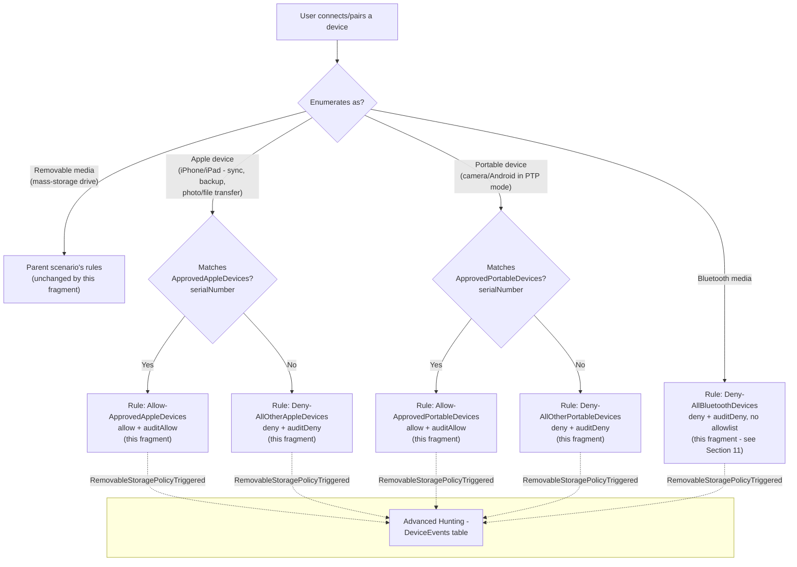

## 1. Scenario summary

Extends [`dlp/defender-device-control-usb-allowlist-macos`](/scenarios/dlp/defender-device-control-usb-allowlist-macos/)'s default-deny USB allowlist
to also cover **Apple (iOS/iPadOS) devices**, **Portable devices** (cameras, Android phones in
PTP-analogous modes), and **Bluetooth media** — three device families that scenario's own Red Team
review confirmed are **completely invisible** to a policy scoped to `removable_media_devices` only.
This is a companion fragment, not a standalone policy: it widens the parent's existing
`macOSCustomConfiguration` object's `.mobileconfig` payload in place, adding three new feature
enables, three new catch-all groups, two optional named allowlists, and five new rules.

**Who it's for:** any buyer who has already deployed (or is deploying) the macOS USB allowlist
scenario and wants the same "no unapproved device, period" posture to also close the
iPhone-in-sync-mode, camera-in-PTP-mode, and Bluetooth-file-transfer gaps — typically after a Red
Team finding, a DLP audit, or an incident where data left over a device that never enumerated as
removable media and so was never subject to the parent policy at all. This is the **direct macOS
analog** of [`dlp/defender-device-control-usb-allowlist-wpd-coverage`](/scenarios/dlp/defender-device-control-usb-allowlist-wpd-coverage/) (the Windows WPD
sibling), translated to macOS's own `primaryId` family model.

## 2. Business/regulatory driver

The parent scenario's `README.md` §11 documents the gap directly: a policy scoped to
`removable_media_devices` enforces nothing against a device that instead enumerates as
`apple_devices`, `portable_devices`, or `bluetooth_devices` — no block, no notification, no
Advanced Hunting event. A user who syncs data to a personal iPhone, downloads photos from a camera
in PTP mode, or transfers a file over Bluetooth bypasses the parent policy's entire
"default-deny, named allowlist" model with zero signal. That is a materially worse gap than "this
activity type isn't restricted": it is a silent, undetected bypass of a control whose stated
purpose is "no unapproved USB storage device, period" (parent `README.md` §1).

The same regulatory drivers the parent scenario cites — GDPR Article 32, HIPAA 45 CFR §164.312
media controls, PCI DSS Requirement 3, SOC 2 CC6 — reference "media controls"/"physical
safeguards" broadly enough that an auditor who learns the control has a phone-shaped (or
Bluetooth-shaped) hole in it will treat that as an open finding, not a footnote. Closing it
converts the parent scenario's narrative from "we control removable storage" to "we control
removable, portable, Apple, and Bluetooth media," the platform-complete claim most of those
frameworks actually expect — and brings macOS to parity with the Windows fleet once the Windows
WPD-coverage sibling is also deployed there.

## 3. Prerequisites

This scenario extends the parent policy object and inherits every prerequisite in
`scenarios/dlp/defender-device-control-usb-allowlist-macos/README.md` §3 (Defender for Endpoint
Plan 1, Intune, Full Disk Access for `com.microsoft.dlp.daemon`, minimum client version
`101.91.92`, the parent policy already deployed). No additional client-version threshold is
documented for these three families specifically (unlike the Windows WPD-coverage sibling, which
needs a later client than its own parent's baseline) — Microsoft's "Device Control for macOS"
reference lists `appleDevice`/`portableDevice`/`bluetoothDevice` alongside `removableMedia` in the
same, single Settings/Features table with no separate version callout [[1]](#references).

| Requirement | Minimum | Notes |
|---|---|---|
| Parent policy already deployed | `scenarios/dlp/defender-device-control-usb-allowlist-macos/deploy/New-MacDeviceControlUsbAllowlistPolicy.ps1` has been run at least once | `deploy/Add-MacPortableDeviceCoverage.ps1` refuses to run if the parent policy doesn't exist — this fragment only extends an existing object, it never creates one from scratch (§5, §7). |
| Dependency (not deployed by this scenario) | Approved Apple/Portable devices' serial numbers, if an allowlist is wanted for either family | Must be known before running `deploy/Add-MacPortableDeviceCoverage.ps1` — see §5, §6. Bluetooth has no allowlist option in this fragment (§11). |

## 4. Architecture



One existing Intune macOS Custom device configuration profile (the parent scenario's
`Device Control (macOS) - USB Removable Media Default-Deny Allowlist`) has its embedded
`deviceControl.policy` JSON widened: three new `settings.features` entries enable enforcement for
`appleDevice`/`portableDevice`/`bluetoothDevice` (each disabled by default per Microsoft's own
documentation), three new catch-all groups scope each family by `primaryId`, and up to five new
rules mirror the parent's audited-allow/audited-deny pattern per family. Full rule-by-rule
rationale: `design.md` §3–4.

## 5. Step-by-step implementation

### Portal path (for a first manual walkthrough / to validate intent before scripting)

1. Confirm the parent policy (`Device Control (macOS) - USB Removable Media Default-Deny
   Allowlist`) already exists and is assigned to at least a pilot group — [Microsoft Intune admin
   center](https://intune.microsoft.com) → **Devices** → **macOS** → **Configuration profiles**.
2. Open the policy → its Custom configuration → download/view the current `.mobileconfig`.
3. Enable the three new families: unlike the top-level `dlp.features` engine switch
   (`DC_in_dlp`, already enabled by the parent), per-family enablement lives **inside** the
   `deviceControl.policy` JSON string itself. Edit that embedded JSON to add
   `"appleDevice": {"disable": false}`, `"portableDevice": {"disable": false}`,
   `"bluetoothDevice": {"disable": false}` under `settings.features`, alongside the parent's
   existing `removableMedia` entry.
4. Add the three catch-all groups and up to five rules from `design.md` §4's table to the same
   JSON's `groups`/`rules` arrays.
5. Re-escape the edited JSON, re-embed it as the `<key>policy</key><string>...</string>` value, and
   re-upload the `.mobileconfig` to the same Custom configuration profile — **replacing**, not
   creating a second profile.
6. **Review + save.** No new assignment step — this reuses the parent policy's existing assignment.

### Script path (idempotent, parameterized, dry-run capable)

```powershell
# 1. Connect (certificate app-only - see docs/automation-surface.md Section 3)
Connect-MgGraph -ClientId $AppId -TenantId $TenantId -CertificateThumbprint $Thumbprint

# 2. Edit deploy/config/mac-portable-device-coverage.sample.json (or copy it). Leave
#    approvedAppleDevices/approvedPortableDevices empty for pure default-deny, or add entries to
#    allowlist specific IT-issued devices by serial number.

# 3. Dry run - reports the planned PATCH, makes no changes
./deploy/Add-MacPortableDeviceCoverage.ps1 `
    -ConfigPath ./deploy/config/mac-portable-device-coverage.sample.json `
    -WhatIf

# 4. Add coverage to the parent policy
./deploy/Add-MacPortableDeviceCoverage.ps1 `
    -ConfigPath ./deploy/config/mac-portable-device-coverage.sample.json

# 5. Validate
./validate/Test-MacPortableDeviceCoverage.ps1 `
    -ConfigPath ./deploy/config/mac-portable-device-coverage.sample.json
```

The deploy script refuses to run if the parent policy doesn't already exist (§3, §7) — it never
creates a standalone policy. Like the parent, it uses `Invoke-MgGraphRequest` against the
`macOSCustomConfiguration` resource (automation surface 3 per `docs/automation-surface.md` §1). It
extracts the parent's current embedded policy JSON, merges in this fragment's additions, and
PATCHes the whole `.mobileconfig` payload back — every other plist key (`PayloadUUID`,
`PayloadIdentifier`, `PayloadDisplayName`, etc.) and every group/rule this fragment doesn't own is
left untouched — see `design.md` §3.

## 6. Configuration reference

| Setting | Location in `deviceControl.policy` JSON | Value |
|---|---|---|
| Enable Apple device enforcement | `settings.features.appleDevice.disable` | `false` (new) |
| Enable Portable device enforcement | `settings.features.portableDevice.disable` | `false` (new) |
| Enable Bluetooth device enforcement | `settings.features.bluetoothDevice.disable` | `false` (new) |
| Group: `AllAppleDevices` (catch-all) | `groups[]` | `query: {"$type":"all","clauses":[{"$type":"primaryId","value":"apple_devices"}]}` |
| Group: `ApprovedAppleDevices` (optional) | `groups[]` | `query: {"$type":"or","clauses":[{"$type":"serialNumber","value":"<serial>"}, ...]}` from `-ConfigPath`'s `approvedAppleDevices` |
| Group: `AllPortableDevices` (catch-all) | `groups[]` | `query: {"$type":"all","clauses":[{"$type":"primaryId","value":"portable_devices"}]}` |
| Group: `ApprovedPortableDevices` (optional) | `groups[]` | Same `serialNumber`/`or` shape, from `approvedPortableDevices` |
| Group: `AllBluetoothDevices` (catch-all) | `groups[]` | `query: {"$type":"all","clauses":[{"$type":"primaryId","value":"bluetooth_devices"}]}` — **no approved-devices sibling group in this fragment** (§11) |
| Rule: `Allow-ApprovedAppleDevices` (if configured) | `rules[]` | `includeGroups=[ApprovedAppleDevices]`; entries `$type: appleDevice`, `allow` + `auditAllow(send_event)`, `access=[download_files_from_device, sync_content_to_device, backup_device, update_device, download_photos_from_device]` |
| Rule: `Deny-All(Other)AppleDevices` | `rules[]` | `includeGroups=[AllAppleDevices]`, `excludeGroups=[ApprovedAppleDevices]` if configured; entries `$type: appleDevice`, `deny` + `auditDeny(send_event, show_notification)`, same access list |
| Rule: `Allow-ApprovedPortableDevices` (if configured) | `rules[]` | `includeGroups=[ApprovedPortableDevices]`; entries `$type: portableDevice`, `allow` + `auditAllow`, `access=[download_files_from_device, send_files_to_device, download_photos_from_device, debug]` |
| Rule: `Deny-All(Other)PortableDevices` | `rules[]` | `includeGroups=[AllPortableDevices]`, `excludeGroups=[ApprovedPortableDevices]` if configured; same entry shape, deny+auditDeny |
| Rule: `Deny-AllBluetoothDevices` | `rules[]` | `includeGroups=[AllBluetoothDevices]`, no `excludeGroups`; entries `$type: bluetoothDevice`, `deny` + `auditDeny`, `access=[download_files_from_device, send_files_to_device]` |

Every property name, clause `$type`, entry `$type`, and `access` string above is confirmed directly
against Microsoft's official "Device Control for macOS" Settings/Clause/Access-Types tables and
cross-checked against three of Microsoft's own published GitHub sample policies
(`audit_all_apple_devices.json`, `deny_mobile_devices.json`,
`deny_all_bluetooth_devices_except_samsung.json`) — see §12 and the deploy script's `.NOTES`.
Notably, this closes a capitalization ambiguity the Windows WPD-coverage sibling's own grounding
pass had to flag as unresolved: the Learn page's entry-`$type` property table shows `PortableDevice`
(capital P) in one cell, inconsistent with every other row in the same table and with the page's
own Access Types table below it (`portableDevice`, lowercase) — three independently-published
worked samples all use the lowercase form, resolved here as a documentation table rendering
inconsistency, not a second valid casing.

All eight new GUIDs (five groups, five rules) are fixed constants defined in
`deploy/Add-MacPortableDeviceCoverage.ps1` (not freshly generated per run), matching the parent
scenario's own idempotency rationale (`design.md` §7 there).

**Matching a device to `serialNumber`:** Microsoft's clause reference states `serialNumber`
"[m]atches a device's serial number. Doesn't match if the device doesn't have a serial number."
[[1]](#references) — confirmed directly for the `apple_devices` family via Microsoft's own worked
sample [[2]](#references); not independently confirmed via a worked example for `portable_devices`
specifically (§11 VERIFY). There is no `serialNumber`-based allowlist option for `bluetooth_devices`
in this fragment (§11) — Microsoft's own worked sample for that family uses `vendorId`+`productId`
compound matching instead [[2]](#references).

## 7. Validation / how to prove it works

1. **Automated config check** — `./validate/Test-MacPortableDeviceCoverage.ps1 -ConfigPath
   ./deploy/config/mac-portable-device-coverage.sample.json` confirms the three feature flags, the
   three catch-all groups, the mandatory deny rules, the optional approved-device groups/allow
   rules (matching `-ConfigPath`'s current definition), and that the parent's original
   `removableMedia` coverage is untouched; exits non-zero on any hard failure.
2. **Device onboarding/Full Disk Access check** — same as the parent scenario's §7 step 1/4;
   nothing in this fragment enforces without both already being true on the pilot Mac.
3. **Profile sync check** — Intune admin center → **Devices** → **macOS** →
   **Configuration profiles** → the policy → **Device status** → **Succeeded**.
4. **Functional test (unapproved Apple device)** — connect an iPhone/iPad not on
   `approvedAppleDevices` and attempt a sync/backup/photo transfer. Expect: denied, an end-user
   dialog, and a `RemovableStoragePolicyTriggered` event with `Verdict = Deny` in Advanced Hunting.
5. **Functional test (approved Apple device, if configured)** — connect a device whose serial
   number is in `approvedAppleDevices`. Expect: the operation succeeds, and a
   `RemovableStoragePolicyTriggered` event with `Verdict = Allow` still appears (audited, not
   silent).
6. **Functional test (portable device)** — connect a camera or Android phone in PTP mode; repeat
   steps 4–5 for the `approvedPortableDevices` list.
7. **Functional test (Bluetooth)** — pair a Bluetooth device and attempt a file transfer. Expect:
   denied unconditionally, with an `auditDeny` event — there is no approved-device path to test for
   this family in this fragment (§11).
8. **Advanced Hunting query** — the parent scenario's own `DeviceEvents`/
   `RemovableStoragePolicyTriggered` query (README.md §7) works unchanged; extend it with the
   `RemovableStoragePolicy` field (the rule name, confirmed directly against Microsoft's own worked
   Advanced Hunting example [[1]](#references)) to distinguish which family/rule triggered:
   ```kusto
   DeviceEvents
   | where ActionType == "RemovableStoragePolicyTriggered"
   | extend parsed = parse_json(AdditionalFields)
   | project Timestamp, DeviceName,
       Verdict = tostring(parsed.RemovableStoragePolicyVerdict),
       PolicyRule = tostring(parsed.RemovableStoragePolicy),
       SerialNumberId = tostring(parsed.SerialNumber)
   | order by Timestamp desc
   ```
   `PolicyRule` is expected to read `Allow-ApprovedAppleDevices`/`Deny-AllOtherPortableDevices`/
   `Deny-AllBluetoothDevices`/etc. for events this fragment's rules generate, letting an analyst
   distinguish them from the parent's own `removableMedia`-family rule names without needing a
   separate query per device family. This field is directly confirmed only via Microsoft's
   Windows-side worked example; the macOS parent scenario's own README.md §7 already establishes
   the working assumption that `DeviceEvents`/`AdditionalFields` is one OS-agnostic schema shared
   across both platforms (confirmed there for `Verdict`/`SerialNumberId`), which this step extends
   to `RemovableStoragePolicy` on the same basis rather than an independent macOS-side worked
   example.

## 8. Operations & tuning

This fragment shares the parent scenario's full operations model (`README.md` §8) — deployment
sequence, KPI categories, alert routing, review cadence, and incident-response runbook all apply
unchanged, extended to the three new families. Two additions specific to this fragment:

- **A spike in Apple/Portable/Bluetooth deny events right after this fragment ships** is the
  expected signal of previously-invisible device usage becoming visible for the first time —
  investigate for legitimate business use (e.g. a team that routinely backs up iPads) before
  assuming misuse, the same caution the parent scenario documents for its own initial rollout and
  the Windows WPD-coverage sibling documents for phones/cameras.
- **Bluetooth deny events have no "was this an approved device" triage step** — every Bluetooth
  deny is, by this fragment's design, either a genuine policy hit or a legitimate use case that
  needs a scope decision (widen a future allowlist follow-up, or accept the block) rather than a
  simple "add it to the allowlist and move on" response available for the other two families.

## 9. Rollback / decommission

See `rollback.md`. Quick reference: `./deploy/Remove-MacPortableDeviceCoverage.ps1` strips this
fragment's three feature flags, catch-all groups, optional approved-device groups, and five rules
back out of the parent's `.mobileconfig` payload, leaving the parent's original `removableMedia`
coverage, assignment, and object identity untouched. To remove the entire device control policy
(all four families), use the parent scenario's own `Remove-MacDeviceControlUsbAllowlistPolicy.ps1`.

## 10. Cost & licensing notes

No incremental licensing cost beyond the parent scenario's (`README.md` §10) — Apple/Portable/
Bluetooth device control is part of the same Defender for Endpoint Plan 1 macOS device control
capability, not a separately licensed feature [[1]](#references). The only new cost consideration
is operational: reviewing and maintaining up to two additional approved-device lists.

## 11. Known limitations & gotchas

- **Bluetooth devices have no approved-device allowlist in this fragment — always default-deny, no
  exceptions.** Microsoft's own worked sample for this family
  (`deny_all_bluetooth_devices_except_samsung.json`) demonstrates an exception group matched by
  `vendorId`+`productId` (AND'd within a single group query for one specific device), a
  structurally different, single-device matching model from the OR'd multi-device `serialNumber`
  pattern this fragment uses for Apple/Portable devices [[2]](#references). Rather than introduce a
  second, differently-shaped config schema for one family, this fragment ships Bluetooth as
  default-deny-only; a `vendorId`+`productId`-matched Bluetooth allowlist is tracked as a follow-up
  in `PROGRESS.md` rather than guessed into an unverified shape.
- **VERIFY (pilot tenant, before relying on it for a true allowlist):** `serialNumber` matching for
  the `portable_devices` family has no directly-confirmed Microsoft worked example — only
  `removable_media_devices` (parent scenario) and `apple_devices` (this fragment, via
  `audit_all_apple_devices_except_serial_numbers.json` [[2]](#references)) are confirmed by a
  published sample. Microsoft's Clause reference table is presented as one flat, family-unscoped
  list (a materially stronger starting position than the ambiguity the Windows WPD-coverage
  sibling had to flag for `SerialNumberId`/`VID_PID`), but this is not the same as a direct worked
  example. `validate/Test-MacPortableDeviceCoverage.ps1` checks `approvedPortableDevices` entries
  as `[WARN]`, not `[PASS]`/`[FAIL]`, pending confirmation.
- **A device without a readable serial number cannot be allowlisted for the Apple or Portable
  families** — same scope boundary the parent scenario already carries for removable media
  (`README.md` §11 there), and the same reason this fragment doesn't attempt `vendorId`/`productId`
  compound matching for those two families (it would need the same per-device, dynamic-sub-group
  idempotency model the parent scenario already deferred as a follow-up — `design.md` §5).
- **`serialNumber` is spoofable, not just a coarse identifier.** The same class of risk the parent
  scenario's own `reviews.md` (Red Team finding 2) already accepts for `removable_media_devices`
  applies identically to an `ApprovedAppleDevices`/`ApprovedPortableDevices` allowlist entry: a
  reported serial number is firmware-level metadata, and commodity USB-controller/device-property
  spoofing tooling that rewrites it exists. `serialNumber` is still the *strongest* standalone
  identifier this schema documents for these families (it "doesn't match if the device doesn't have
  a serial number" — a hard match, not a probabilistic one), but an approved-device allowlist here
  is a compensating control, not a cryptographic identity boundary. Keep either allowlist small and
  IT-managed, the same mitigation the parent scenario and the Windows WPD-coverage sibling already
  recommend for their own analogous identifiers.
- **Bluetooth device control here restricts file transfer only, not all Bluetooth functionality.**
  The `bluetoothDevice` entry type's only documented access operations are
  `download_files_from_device` and `send_files_to_device` [[1]](#references) — this fragment's
  `Deny-AllBluetoothDevices` rule blocks those two operations for every Bluetooth device, but has no
  effect on Bluetooth audio, HID (keyboard/mouse), tethering, or pairing itself. Do not describe
  this control to a buyer as "Bluetooth is disabled" — it is scoped to data exfiltration via file
  transfer specifically, the same operation-scoped framing Microsoft's own product design uses
  (compare `portableDevice`'s equally narrow, enumerated access-type list rather than a blanket
  "block the device class" switch).
- **This fragment does not change the parent's assignment.** Widening the shared
  `.mobileconfig` payload takes effect for every device already assigned the parent policy — there
  is no separate pilot-then-widen step for these three families specifically. If a more cautious
  rollout is wanted, stage it against a pilot-scoped **copy** of the parent policy in a lower
  environment first, since the deploy script always targets the policy by
  `parentPolicyDisplayName` and there is exactly one such object per tenant in this design.
- **This fragment inherits every parent-scenario limitation** not superseded above — Full Disk
  Access as a hard, silent prerequisite; the open VERIFY on `payload` PATCH replace-vs-merge
  semantics (this fragment's own PATCH calls carry the identical, not a new, risk); the possible
  conflict with an independently-deployed `com.microsoft.wdav` preferences profile; and no remote,
  at-scale check for Full Disk Access grant status (parent `README.md` §11).
- **Known Microsoft-documented product limitation (not specific to this scenario's design):**
  device control on macOS restricts Android devices connected in PTP mode **only** — File Transfer,
  USB Tethering, and MIDI modes are not restricted, the same limitation the parent scenario already
  documents [[1]](#references).

## 12. References

1. Device Control for macOS (Settings/Features table — `appleDevice`/`portableDevice`/
   `bluetoothDevice`/`removableMedia`, each disabled by default; Clause reference including
   `primaryId` values `apple_devices`/`portable_devices`/`bluetooth_devices`/
   `removable_media_devices`, `serialNumber`, `vendorId`, `productId`; Access Types table for
   `appleDevice`/`portableDevice`/`bluetoothDevice`/`removableMedia`/`generic`; best-practice
   guidance on generic access types; known Android-PTP-mode-only limitation) —
   <https://learn.microsoft.com/defender-endpoint/mac-device-control-overview>
2. Sample macOS device control policies (Microsoft-published GitHub worked examples independently
   confirming entry `$type` casing — `appleDevice`/`portableDevice`/`bluetoothDevice`, all
   lowercase-first-letter — access-string lists per family, the `serialNumber`/`or`/`excludeGroups`
   approved-device pattern for `apple_devices`, and the `vendorId`+`productId` compound-match
   pattern for `bluetooth_devices`) —
   <https://github.com/microsoft/mdatp-devicecontrol/tree/main/macOS/policy/samples>
   - `audit_all_apple_devices.json`, `audit_all_apple_devices_except_serial_numbers.json`,
     `deny_mobile_devices.json`, `deny_all_bluetooth_devices_except_samsung.json`
3. Device control policies in Microsoft Defender for Endpoint (shared Groups/Rules/Entries concepts
   across Windows and macOS) — <https://learn.microsoft.com/defender-endpoint/device-control-policies>
4. Device control in Microsoft Defender for Endpoint (Windows-side worked Advanced Hunting example
   confirming the `RemovableStoragePolicy`/`RemovableStorageAccess`/`RemovableStoragePolicyVerdict`
   `AdditionalFields` shape for `RemovableStoragePolicyTriggered` events, cited in §7 step 8 — used
   here on the strength of the parent macOS scenario's own established, cross-platform
   `DeviceEvents` schema assumption, not an independent macOS-side worked example) —
   <https://learn.microsoft.com/defender-endpoint/device-control-overview>
5. [`dlp/defender-device-control-usb-allowlist-macos`](/scenarios/dlp/defender-device-control-usb-allowlist-macos/) — the parent scenario this fragment
   extends; see that scenario's own references for every citation not repeated here (licensing,
   onboarding, Full Disk Access, Graph resource schemas, Advanced Hunting/Sentinel alert routing).
6. [`dlp/defender-device-control-usb-allowlist-wpd-coverage`](/scenarios/dlp/defender-device-control-usb-allowlist-wpd-coverage/) — the Windows sibling
   fragment this scenario is the direct macOS analog of.

> Re-verify all links, and especially the `portable_devices`-`serialNumber` VERIFY (§11) and the
> `payload` PATCH replace-vs-merge semantics inherited from the parent, against current Microsoft
> Learn and a pilot tenant before a customer-facing assessment or sale.
