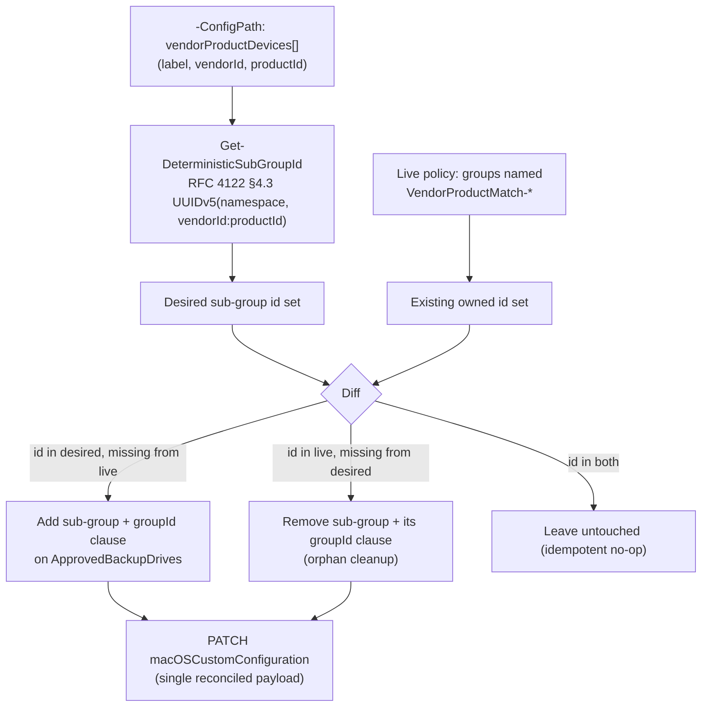

## 1. Problem statement

[`dlp/defender-device-control-usb-allowlist-macos`](/scenarios/dlp/defender-device-control-usb-allowlist-macos/) matches approved removable-storage
devices by `serialNumber` only. That scenario's own design (`design.md` §5 there) and this repo's
`PROGRESS.md` backlog both flag the deliberately deferred gap this fragment closes: **a buyer whose
approved drives have no readable serial number** — a real, common case for bulk-imaged imaging
docks, some third-party enclosures, and OEM hardware that reports an empty `serialNumber` field —
cannot use the parent scenario's allowlist at all. This fragment adds a second, independent matching
mechanism to the same shared policy: **vendorId+productId compound matching**, scoped to the
`removable_media_devices` family, for exactly the devices the parent scenario's own README already
names as its known limitation (`defender-device-control-usb-allowlist-macos/README.md` §11).

## 2. Design goals

1. **Extend, don't replace.** The parent's `serialNumber`-based `ApprovedBackupDrives` group stays
   fully intact; this fragment adds vendorId/productId-matched devices as additional OR-branches of
   the *same* group, so a tenant can mix both matching mechanisms freely in one allowlist.
2. **No new rule.** Because the parent's `Allow-ApprovedBackupDrives` and
   `Deny-AllOtherRemovableStorage` rules both key off `ApprovedBackupDrives`' group **id** (not its
   internal clause contents), adding a device to that group's OR-set is sufficient — no rule is
   created or edited by this fragment. This is a materially smaller blast radius than the Bluetooth
   sibling fragment, which needed a brand-new allow rule because Bluetooth's own approved-device
   exception lives in a group referenced only by `excludeGroups`, not by `includeGroups` directly.
3. **Multi-device, not single-device.** Unlike the Bluetooth sibling fragment (capped at exactly one
   approved device in v1, `defender-device-control-usb-allowlist-macos-bluetooth-allowlist/design.md`
   §3), this fragment supports any number of vendorId+productId-matched devices — see §4 below for
   how the per-device dynamic-GUID idempotency problem the parent scenario deferred is solved.
4. **Idempotent and re-runnable**, including self-healing drift and clean removal of a device no
   longer in the config file (not merely additive) — orphaned sub-groups and their `groupId` clauses
   are detected and removed, not left behind.
5. **Ships as an extension of an already-piloted policy** — this fragment does not touch the parent
   policy's assignment; the parent scenario's own staged-rollout discipline already governs which
   endpoints receive any change to the shared object.

## 3. Why `groupId`-referenced sub-groups (confirming, not re-deriving, the parent's own §5 analysis)

macOS's device-control JSON schema keeps `vendorId` and `productId` as two separate clause types
[[1]](#references). Matching one device by vendor+product pair requires an **AND** of both clauses,
but `ApprovedBackupDrives`' top-level `query` is a single `any` (OR) object — a group's `query` can
be exactly one `all`/`any`/`not` object, never a mix of AND'd and OR'd clauses in one list. The
schema's own documented mechanism for combining an AND-pair with other, independently-OR'd
membership tests is the `groupId` clause type: *"Match if a device is a member of another group. The
value represents the UUID of the group to match against. The group must be defined within the policy
before the clause."* [[1]](#references) — i.e., one small AND-group per device, referenced from the
umbrella group via a `groupId` clause. This exact shape (`primaryId` + `vendorId` + `productId`,
AND'd inside a per-device sub-group) is confirmed directly against Microsoft's own
`deny_all_bluetooth_devices_except_samsung.json` sample [[2]](#references) (fetched raw during this
fragment's build; also already used by the Bluetooth sibling fragment for its own, single-device
case) and against `deny_removable_media_except_kingston.json` [[3]](#references), which demonstrates
the same `removable_media_devices` family with a single-clause `vendorId`-only exception group (no
`groupId` nesting needed there because that sample has only one exception group referenced directly
by `excludeGroups`, not combined with other OR'd devices inside a shared group). Neither sample
demonstrates **more than one** sub-group referenced via `groupId` inside a single `any` query — this
fragment's N-device composition is this repository's own application of the documented `groupId`
primitive, not itself a directly worked Microsoft example. Flagged as VERIFY in `README.md` §11
rather than assumed identical to the single-device case without qualification.

## 4. The deferred problem: a stable, deterministic id per config-file device entry

The parent scenario's `design.md` §5 explicitly named the blocker: *"a fresh sub-group per
config-file device entry needs its own stable GUID across re-runs, and removing a device from the
config needs the script to also identify and remove — not orphan — that device's now-stale
sub-group."* Every other fragment in this device-control family owns a **fixed, small** number of
groups/rules and uses literal, source-controlled GUID constants (`defender-device-control-usb-
allowlist-macos/design.md` §7). That approach does not extend to a **variable-length list** of
buyer-supplied devices.

This fragment resolves it with a **deterministic** id, not a **fixed** one: each sub-group's GUID is
derived from its `vendorId`+`productId` pair using **RFC 4122 §4.3's version-5 (name-based, SHA-1)
UUID algorithm** [[4]](#references), with a namespace constant unique to this fragment
(`8f3a2b10-8f2e-4c4a-9b8b-2f1a6c9d7e10`, hard-coded in `deploy/
Add-MacVendorProductDeviceAllowlist.ps1`). Properties this gives, all essential to the idempotency
requirement the parent scenario declined to build unverified:

- **Same input → same id, always**, with no state file, no live Graph read-before-generate race, and
  no dependency on script-run order — the id is a pure function of the device's own
  vendorId+productId pair.
- **A cosmetic label rename never orphans a group** — only `vendorId`/`productId` feed the hash, so
  editing a device's human-readable `label` in the config file reconciles the *existing* group (same
  id, new `name` only) rather than creating a duplicate and abandoning the original.
- **Removing a device is now detectable, not merely omittable** — the deploy and validate scripts
  both independently recompute the desired id set from the current config file and diff it against
  every group whose `name` carries this fragment's `VendorProductMatch-` prefix; any such group not
  in the desired set is a genuine orphan, identified and removed by the deploy script (`-Force` not
  required — see §7), and flagged as a `[FAIL]` by the validate script if left in place.
- **This is a public, non-Microsoft-specific cryptographic standard**, not a product fact requiring
  Microsoft Learn grounding — no different in kind from this repository's other fragments' use of
  literal GUID constants, just generated instead of hand-picked. It was independently verified during
  this fragment's build against Python's standard-library `uuid.uuid5()` reference implementation for
  the same namespace+name input, producing an identical output GUID byte-for-byte — see the deploy
  script's `.NOTES`.

This is a materially different trade-off than the "fixed GUID" discipline the rest of this control
family uses, and is called out explicitly here rather than presented as the same pattern under a new
name.

## 5. Policy architecture

No new top-level Intune profile, no new `settings` keys, no new rules. Per `-ConfigPath` device
entry, this fragment adds:

| # | Object | Purpose |
|---|---|---|
| 1 | `groups[]` entry, `"VendorProductMatch-<label>"` | `$type: "device"`, `id` = deterministic UUIDv5(namespace, `vendorId:productId`), `query: {"$type":"and","clauses":[{"$type":"primaryId","value":"removable_media_devices"},{"$type":"vendorId","value":"<hex>"},{"$type":"productId","value":"<hex>"}]}` |
| 2 | `ApprovedBackupDrives.query.clauses[]` entry | One `{"$type":"groupId","value":"<sub-group id>"}` clause appended alongside the parent's existing `serialNumber` clauses — the `any` (OR) semantics mean a device matching **either** mechanism is approved. |

Ordering constraint (`design.md` §3 citation [[1]](#references)): every sub-group this fragment adds
is inserted into the `groups` array **immediately before** `ApprovedBackupDrives`, satisfying "the
group must be defined within the policy before the clause" while leaving every other fragment's
groups at their original relative position.

## 6. Why this is materially weaker than `serialNumber` matching (disclosed, not glossed over)

Identical caveat, and identical resolution, to the Bluetooth sibling fragment's own Red-Team-driven
correction (`defender-device-control-usb-allowlist-macos-bluetooth-allowlist/reviews.md`, Red Team
finding 1): `vendorId`/`productId` identify a **device model**, not a unique physical unit. Any
device sharing the configured pair — a colleague's identical drive model, or a cheap unit with
spoofed/reprogrammed USB descriptor fields — matches the exception, not just the one physically
approved unit. This is **not** a variant of the same risk level as `serialNumber` matching (which is
at least unique per physical unit and typically requires controller-firmware-level forgery); it is a
strictly weaker guarantee, and is presented as such in `README.md` §11, not framed as an equivalent
alternative a buyer can choose for convenience.

## 7. Key decisions

| Decision | Choice | Rationale |
|---|---|---|
| Extend `ApprovedBackupDrives` in place vs. a parallel group+new rule | Extend the existing group | §2 — zero new rules, smallest possible blast radius; both parent rules already key off this group's id. |
| Per-device sub-group id | Deterministic RFC 4122 §4.3 UUIDv5(fixed namespace, `vendorId:productId`) | §4 — resolves the parent scenario's own deferred "stable GUID per config entry" blocker without a state file or fixed-literal-per-device scheme that can't scale to N devices. |
| Hash input | `vendorId:productId` only, not `label` | §4 — a cosmetic rename must not orphan and recreate a group; only the device's actual matching identity should change its id. |
| Own-group identification | `name` prefix `VendorProductMatch-`, checked in addition to (never instead of) the deterministic id | Lets the deploy/validate scripts distinguish this fragment's own groups from every sibling fragment's groups (including any that might also reference `removable_media_devices`) without relying on id ranges alone. |
| Orphan handling | Detected and removed automatically on every reconcile, no `-Force` required | §4 — matches this control family's existing "self-heal drift without requiring `-Force`" discipline (Bluetooth sibling fragment), extended here to cover deletions, not just additions/edits. |
| Multi-device support | Unbounded (any array length), unlike the Bluetooth sibling's v1 single-device cap | §4 resolves the exact blocker (dynamic GUID scheme) that forced the Bluetooth fragment's own single-device limitation — no equivalent constraint remains here. |
| Update strategy | Whole-payload replacement on every reconcile (PATCH with the freshly rebuilt `.mobileconfig`) | Mirrors every other fragment in this family; same open VERIFY on PATCH replace-vs-merge semantics inherited from the parent scenario. |

## 8. Non-goals

- This scenario does not create the parent `macOSCustomConfiguration` object, the
  `AllRemovableStorage` catch-all group, `ApprovedBackupDrives` itself, or either of the parent's two
  rules — all are prerequisites, not deployed artifacts (§3, `README.md` §3).
- This scenario does not extend vendorId/productId matching to the Apple, Portable, or Bluetooth
  families — those are each sibling fragments' own scope (Apple/Portable:
  `defender-device-control-usb-allowlist-macos-portable-device-coverage`; Bluetooth already has its
  own single-device vendorId/productId exception:
  `defender-device-control-usb-allowlist-macos-bluetooth-allowlist`).
- This scenario does not attempt cryptographic per-unit verification of a vendorId/productId match —
  no such capability exists in this schema (§6).
- This scenario does not migrate the parent's `serialNumber` clauses to this fragment's mechanism, or
  recommend one over the other beyond the strength disclosure in §6 — both remain available, buyer's
  choice per device.

## References

See `README.md` §12 for the full numbered reference list this design.md's inline citations map to.
