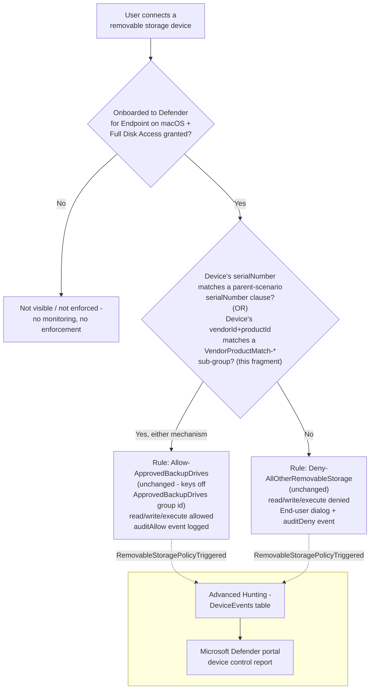

## 1. Scenario summary

Extends `scenarios/dlp/defender-device-control-usb-allowlist-macos/`'s `serialNumber`-only approved
backup-drive allowlist with a second, independent matching mechanism — **vendorId+productId compound
matching** — for approved removable-storage devices that have no readable serial number. Any number
of vendorId/productId-matched devices can be added, on top of (never instead of) the parent
scenario's existing serialNumber-matched devices, with no new Intune profile and no new policy rule.

**Who it's for:** a buyer already running the parent macOS device-control scenario whose approved
backup/imaging drives include hardware that reports an empty or non-unique `serialNumber` field — a
real, common gap for bulk-imaged imaging docks and some third-party USB enclosures — and who would
otherwise have to leave that hardware permanently denied or disable device control for it entirely.

## 2. Business/regulatory driver

Identical regulatory framing to the parent scenario (`defender-device-control-usb-allowlist-macos/
README.md` §2) — GDPR Article 32, HIPAA's 45 CFR §164.312 media controls, PCI DSS Requirement 3, and
SOC 2 CC6. This fragment closes a specific operational gap in that control's own coverage: a tenant
that cannot approve a legitimate IT-issued drive because it has no serial number is left choosing
between an unapproved control gap (leaving the drive functionally denied, prompting shadow-IT
workarounds) or weakening the control tenant-wide — neither of which an auditor would accept as
"no unapproved USB storage device, period."

## 3. Prerequisites

Same product family and licensing as the parent scenario — see `docs/licensing-matrix.md` §7 and
`defender-device-control-usb-allowlist-macos/README.md` §3, which apply unchanged. The only new
requirement this fragment adds:

| Requirement | Minimum | Notes |
|---|---|---|
| Parent policy already deployed | `scenarios/dlp/defender-device-control-usb-allowlist-macos/deploy/New-MacDeviceControlUsbAllowlistPolicy.ps1` has been run at least once | This fragment's deploy script refuses to run if the parent's `ApprovedBackupDrives` group is not found — see §5. |
| PowerShell | 7.0 or later | `deploy/Add-MacVendorProductDeviceAllowlist.ps1` uses `System.Security.Cryptography.SHA1` for its deterministic per-device group id derivation (§6) — no additional module beyond the Microsoft Graph PowerShell SDK already required by the parent scenario. |
| Automation identity | Same Entra app registration and `DeviceManagementConfiguration.ReadWrite.All` application permission as the parent scenario | No new permission — this fragment PATCHes the same `macOSCustomConfiguration` object. |
| Dependency (not deployed by this scenario) | The approved devices' **vendor ID** and **product ID** (each a four-digit hexadecimal string) | Obtain via `system_profiler SPUSBDataType` on a Mac with the device connected (look for `Vendor ID` / `Product ID`), or the device manufacturer's own documentation. Not performed by this scenario. |

## 4. Architecture



This fragment adds `groups[]` entries (one per configured device, plus a `groupId` clause on the
existing `ApprovedBackupDrives` group) to the **same** `macOSCustomConfiguration` object the parent
scenario created. `Allow-ApprovedBackupDrives` and `Deny-AllOtherRemovableStorage` are unchanged —
both already reference `ApprovedBackupDrives`' group id directly, so a device newly matched through
either mechanism is automatically covered. Full rationale: `design.md` §2–5.

## 5. Step-by-step implementation

### Portal path (for a first manual walkthrough / to validate intent before scripting)

1. Confirm the parent scenario is already deployed: Intune admin center → **Devices** → **macOS** →
   **Configuration profiles** → confirm `Device Control (macOS) - USB Removable Media Default-Deny
   Allowlist` exists.
2. Obtain the vendor ID and product ID for each device to approve (§3) — on a Mac with the device
   connected: **Apple menu → About This Mac → More Info → System Report → USB**, or
   `system_profiler SPUSBDataType` in Terminal; note the `Vendor ID` and `Product ID` hex values.
3. Edit the profile's `.mobileconfig`: add one `groups[]` entry per device (shape: `design.md` §5
   row 1) and one `groupId` clause per device to `ApprovedBackupDrives`' existing `query.clauses`
   array (shape: `design.md` §5 row 2), preserving every existing `serialNumber` clause unchanged.
4. Re-upload the modified `.mobileconfig` as the profile's configuration file, replacing the
   existing one.
5. **Save**. No assignment change is needed — the profile's existing assignment already governs
   which endpoints receive this update.

### Script path (idempotent, parameterized, dry-run capable)

```powershell
# 1. Connect (certificate app-only - see docs/automation-surface.md Section 3)
Connect-MgGraph -ClientId $AppId -TenantId $TenantId -CertificateThumbprint $Thumbprint

# 2. Edit deploy/config/mac-vendor-product-device-allowlist.sample.json (or copy it) with your
#    approved devices' vendorId/productId pairs.

# 3. Dry run - reports every change, makes none
./deploy/Add-MacVendorProductDeviceAllowlist.ps1 `
    -ConfigPath ./deploy/config/mac-vendor-product-device-allowlist.sample.json `
    -WhatIf

# 4. Deploy
./deploy/Add-MacVendorProductDeviceAllowlist.ps1 `
    -ConfigPath ./deploy/config/mac-vendor-product-device-allowlist.sample.json

# 5. Validate
./validate/Test-MacVendorProductDeviceAllowlist.ps1 `
    -ConfigPath ./deploy/config/mac-vendor-product-device-allowlist.sample.json

# 6. To revoke a device: remove its entry from the config file and re-run step 4 - the deploy
#    script detects and removes the now-orphaned sub-group automatically, no -Force required.
```

The deploy script uses the Microsoft Graph PowerShell SDK (`Invoke-MgGraphRequest` against the same
`macOSCustomConfiguration` resource the parent scenario created) — automation surface 3 per
`docs/automation-surface.md` §1. It never creates the parent policy and never changes its assignment.

## 6. Configuration reference

| Setting | Location in `.mobileconfig` | Value |
|---|---|---|
| Per-device sub-group | `deviceControl.policy.groups[]` (inserted immediately before `ApprovedBackupDrives`) | `{"$type":"device","id":"<UUIDv5(namespace, vendorId:productId)>","name":"VendorProductMatch-<label>","query":{"$type":"and","clauses":[{"$type":"primaryId","value":"removable_media_devices"},{"$type":"vendorId","value":"<hex>"},{"$type":"productId","value":"<hex>"}]}}` |
| `ApprovedBackupDrives` group edit | `deviceControl.policy.groups[].query.clauses[]` (existing `ApprovedBackupDrives` entry) | One `{"$type":"groupId","value":"<sub-group id>"}` appended per configured device, alongside the parent's pre-existing `serialNumber` clauses (`query.$type` stays `"any"`) |
| Sub-group id derivation | N/A — computed, not stored as a separate object | RFC 4122 §4.3 version-5 UUID: `SHA1(namespace_bytes ++ UTF8("mac-vendor-product-match/v1/<vendorId>:<productId>"))`, version/variant bits patched. Namespace: `8f3a2b10-8f2e-4c4a-9b8b-2f1a6c9d7e10` (fixed, this fragment's own constant). See `design.md` §4. |
| Rules | *(unchanged)* — `Allow-ApprovedBackupDrives` and `Deny-AllOtherRemovableStorage` | Not modified by this fragment; both already key off `ApprovedBackupDrives`' group id. |

All group ids this fragment creates are **deterministic**, not fixed literals — the same
`vendorId`+`productId` pair always produces the same id, on any machine, with no state file. Full
cmdlet/REST/schema grounding: the deploy script's `.NOTES` block and §12 below.

## 7. Validation / how to prove it works

1. **Automated config check** — `./validate/Test-MacVendorProductDeviceAllowlist.ps1 -ConfigPath
   ./deploy/config/mac-vendor-product-device-allowlist.sample.json` confirms every configured
   device's sub-group exists with the expected deterministic id and AND-clauses, `ApprovedBackupDrives`
   references it via a `groupId` clause, no orphaned `VendorProductMatch-*` group or stale `groupId`
   clause remains, and the parent's own groups/rules are unaffected; exits non-zero on any hard
   failure.
2. **Profile sync check** — same as the parent scenario's §7 step 3: Intune admin center → confirm
   pilot Macs show **Succeeded**, not **Pending** or **Error**, after this fragment's PATCH.
3. **Client-side status check** — same as the parent scenario's §7 step 4
   (`mdatp health --details device_control`); this fragment does not change any Full Disk Access or
   engine-enable requirement, so a device that already worked for `serialNumber`-matched drives needs
   no additional client-side check.
4. **Functional test (vendorId/productId-approved drive)** — plug in a drive whose vendor+product
   pair is in the `vendorProductDevices` config list (and whose serial number, if any, is **not**
   separately approved — to isolate this fragment's own mechanism). Expect: read/write succeeds, and
   a `RemovableStoragePolicyTriggered` event with `Verdict = Allow` appears in Advanced Hunting.
5. **Functional test (unapproved drive)** — plug in a drive matching neither a `serialNumber` clause
   nor a configured `vendorId`+`productId` pair. Expect: denied, identical to the parent scenario's
   own §7 step 5.
6. **Advanced Hunting query** — identical query shape to the parent scenario's §7 step 7; this
   fragment adds no new `AdditionalFields` and requires no query change:
   ```kusto
   DeviceEvents
   | where ActionType == "RemovableStoragePolicyTriggered"
   | extend parsed = parse_json(AdditionalFields)
   | project Timestamp, DeviceName, Verdict = tostring(parsed.RemovableStoragePolicyVerdict),
       SerialNumberId = tostring(parsed.SerialNumber)
   | order by Timestamp desc
   ```

## 8. Operations & tuning

**Deployment sequence:** this fragment ships directly into the parent policy's existing assignment
scope — there is no separate rollout stage of its own. Add a vendorId/productId device only after the
parent policy is already assigned to the intended endpoints.

**KPIs to watch (first 30 days):** identical framing to the parent scenario's §8, with one addition —
track `Allow-ApprovedBackupDrives` `auditAllow` event volume **per configured vendorId+productId
pair** against the number of physically-issued units of that model. Because this mechanism approves a
*model*, not a unit (§11), a materially higher distinct-device count than issued units for one pair is
the practical detection signal for an unauthorized unit of the same model, the same operational
pattern already established for the Bluetooth sibling fragment's own model-level exception.

**Alert routing:** unchanged — same Advanced Hunting/`DeviceEvents` and Microsoft Defender Streaming
API/Sentinel connector paths as the parent scenario's §8.

**Review cadence:** quarterly at minimum, same as the parent scenario; re-run
`validate/Test-MacVendorProductDeviceAllowlist.ps1` as part of that review, and cross-check the
`vendorProductDevices` config list against the current physical inventory of approved units — a
device model approved here but decommissioned needs its config entry removed (§9), not merely
forgotten.

**Incident-response runbook:** identical structure to the parent scenario's §8 runbook, with one
addition specific to this mechanism's weaker guarantee (§11): if Advanced Hunting shows more distinct
`DeviceName` values presenting an approved vendorId+productId pair than the count of physically-issued
units, treat this as a suspected impersonation, not a false positive — remove the device entry from
the config and re-run the deploy script immediately, then investigate before re-approving.

## 9. Rollback / decommission

See `rollback.md` for the full staged procedure. Quick reference: to revoke one device, remove its
entry from the config file and re-run `deploy/Add-MacVendorProductDeviceAllowlist.ps1` (orphan
cleanup is automatic, no `-Force` needed); to remove every vendorId/productId device exception at
once, run `./deploy/Remove-MacVendorProductDeviceAllowlist.ps1`.

## 10. Cost & licensing notes

- **No PAYG component and no incremental licensing cost** — identical to the parent scenario
  (`defender-device-control-usb-allowlist-macos/README.md` §10). This fragment adds no new Microsoft
  capability, only a different matching mechanism inside the same already-licensed policy object.
- **No additional Azure subscription or Intune licensing line** beyond what the parent scenario
  already requires.

## 11. Known limitations & gotchas

- **`vendorId`+`productId` identify a device MODEL, not a unique physical unit — this is a materially
  weaker guarantee than the parent scenario's `serialNumber` matching, not an equivalent alternative.**
  Any device sharing the configured pair — a colleague's identical drive model, or a unit with a
  reprogrammed USB descriptor — matches the exception. Approve device models here only for a genuine,
  narrow business need where no serial-numbered alternative exists, not as a convenience shortcut for
  hardware that does have a readable serial number (`design.md` §6).
- **VERIFY (pilot tenant or a future Microsoft Learn/GitHub-samples pass):** no directly-confirmed
  Microsoft worked example pairs a `groupId` clause with **more than one** sibling sub-group inside a
  single `any` query — Microsoft's own samples only ever demonstrate a single vendorId+productId
  exception device per policy. The `groupId` clause type itself and its "member of another group"
  semantics are directly documented (`design.md` §3); this fragment's N-devices-in-one-OR-query
  composition is this repository's own application of that documented primitive, not itself a worked
  example. `deploy/Add-MacVendorProductDeviceAllowlist.ps1`'s `.NOTES` flags this inline.
- **The deterministic per-device group id (RFC 4122 §4.3 UUIDv5) is a design choice unique to this
  fragment, not a pattern used by any sibling fragment in this repository.** If a future engineer
  changes the namespace constant, the hash input string, or the normalization (`ToLowerInvariant()`)
  applied to `vendorId`/`productId` before hashing, every previously-deployed device's computed id
  changes, and the deploy script will treat every existing sub-group as orphaned on the next run —
  the namespace constant and hash-input format in `deploy/Add-MacVendorProductDeviceAllowlist.ps1`
  and `validate/Test-MacVendorProductDeviceAllowlist.ps1` must never drift apart from each other.
- **VERIFY (pilot tenant, before production reliance):** the same open `macOSCustomConfiguration`
  `payload` PATCH replace-vs-merge question the parent scenario's own README already flags
  (`defender-device-control-usb-allowlist-macos/README.md` §11) applies identically here — this
  fragment's reconcile path assumes full replacement.
- **This fragment inherits every non-goal already disclosed by the parent scenario** — no content
  awareness, no Apple/Portable/Bluetooth coverage, the Full Disk Access hard prerequisite, and the
  known Microsoft-documented Android-PTP-mode-only and Xcode-transfer product limitations
  (`defender-device-control-usb-allowlist-macos/README.md` §11).

## 12. References

1. Device Control for macOS (Clause reference table — `groupId` "Match if a device is a member of
   another group... The group must be defined within the policy before the clause."; `vendorId`/
   `productId` "Four digit hexadecimal string"; Query `all`/`any`/`not` types; Access policy rule
   `includeGroups` AND / `excludeGroups` OR semantics) — <https://learn.microsoft.com/defender-endpoint/mac-device-control-overview>
2. Sample macOS device control policy — `deny_all_bluetooth_devices_except_samsung.json` (the
   `primaryId`+`vendorId`+`productId` AND-clause exception-group shape this fragment generalizes to
   the `removable_media_devices` family and to N devices; confirmed by direct fetch of the raw file
   during this fragment's build) — <https://github.com/microsoft/mdatp-devicecontrol/blob/main/macOS/policy/samples/deny_all_bluetooth_devices_except_samsung.json>
3. Sample macOS device control policy — `deny_removable_media_except_kingston.json` (single-`vendorId`
   exception group scoped to `removable_media_devices`, confirmed by direct fetch of the raw file
   during this fragment's build) — <https://github.com/microsoft/mdatp-devicecontrol/blob/main/macOS/policy/samples/deny_removable_media_except_kingston.json>
4. RFC 4122, Section 4.3 — Algorithm for Creating a Name-Based UUID (version 5, SHA-1) — <https://www.rfc-editor.org/rfc/rfc4122#section-4.3>
5. `scenarios/dlp/defender-device-control-usb-allowlist-macos/` — the parent scenario this fragment
   extends; see that scenario's own references for the shared macOS device-control citations
   (`macOSCustomConfiguration` Graph resource, Full Disk Access/`DC_in_dlp` prerequisites, Advanced
   Hunting query, licensing).
6. `scenarios/dlp/defender-device-control-usb-allowlist-macos-bluetooth-allowlist/` — the sibling
   fragment whose single-device vendorId+productId exception this fragment's own AND-clause shape
   directly follows, and whose "model, not unit" disclosure this fragment's §11 mirrors.

> Re-verify all links, and especially the multi-sub-group `groupId` composition VERIFY (§11), against
> current Microsoft Learn and a pilot tenant before a customer-facing assessment or sale.
