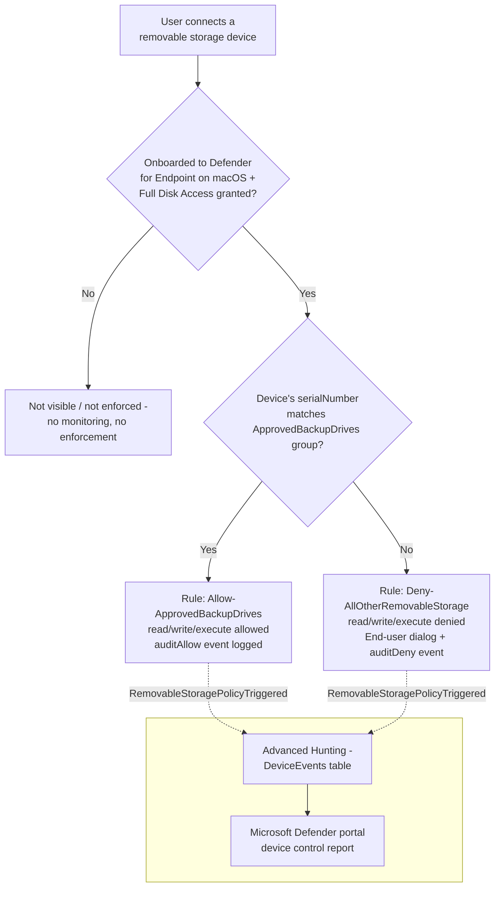

## 1. Problem statement

`scenarios/dlp/defender-device-control-usb-allowlist/` deploys a default-deny, named-allowlist
removable-storage control for **Windows** endpoints via Microsoft Defender for Endpoint device
control. That scenario's own non-goals (`design.md` §8) and `PROGRESS.md`'s follow-up backlog
both flag the same gap this fragment closes: **macOS device control uses a separate JSON/
`mobileconfig` authoring path**, Windows' Custom OMA-URI/XML mechanism has no equivalent on
macOS, and a mixed Windows/Mac fleet with only the Windows sibling deployed has zero
device-identity control on every Mac in it. A buyer who wants "no unapproved USB storage device,
period" across a mixed fleet needs both.

This scenario is the macOS sibling: same default-deny-with-one-named-allowlist shape, same
"both allow and deny paths are audited" discipline, translated to macOS's own device control
policy model (JSON `groups`/`rules`/`settings`, deployed as a `.mobileconfig` payload) and the
`macOSCustomConfiguration` Microsoft Graph resource.

## 2. Design goals

Identical to the Windows sibling's design goals (`defender-device-control-usb-allowlist/design.md`
§2), restated for macOS:

1. **Default-deny for removable storage**, scoped to the `removable_media_devices` `primaryId`
   family only, Apple (iOS/iPadOS) devices, Portable devices (cameras, Android in PTP mode), and
   Bluetooth media are explicitly out of scope (§8 below), the direct macOS analog of the Windows
   scenario's `RemovableMediaDevices`-only scope and its own documented Windows Portable Device
   (WPD) gap.
2. **A single named allowlist group** (`ApprovedBackupDrives`) matched by `serialNumber` gets full
   read/write/execute access; every other removable-storage device is denied, with an audited,
   user-notified block.
3. **Both the allow and the deny paths are audited**, the allow rule carries an `auditAllow` entry
   (`send_event`) alongside its `allow` entry, not a silent trust, matching the Windows sibling's
   identical design decision.
4. **Idempotent and re-runnable.** Re-running the deploy script with an unchanged config makes no
   API calls beyond the read used to detect no drift; re-running after an allowlist change
   reconciles the existing `macOSCustomConfiguration` object's payload in place.
5. **Ships scoped to a pilot group by default**, never tenant-wide on a first run, same staged-
   rollout discipline as every scenario in this repo (`AGENTS.md` §4).

## 3. Why `macOSCustomConfiguration` (not a Windows-style OMA-URI translation, not a native
   "Device Control profile" workaround)

Unlike Windows, where this repo's sibling scenario had to choose between an unconfirmed native
"Device Control profile" template and the fully-documented Custom OMA-URI mechanism
(`defender-device-control-usb-allowlist/design.md` §4), **macOS device control has exactly one
documented Intune authoring path**: build a `.mobileconfig` payload containing the JSON `groups`/
`rules`/`settings` policy under `PayloadContent[0].deviceControl.policy`, then deploy it as a
**Custom** profile (Devices → macOS → Custom) [[1]](#references). Microsoft Graph's
`macOSCustomConfiguration` resource is the exact, confirmed v1.0 type this maps to, `payload`
(binary/UTF8 byte array of the raw `.mobileconfig` XML), `payloadFileName`, `payloadName`, all
independently confirmed against the official Graph reference [[2]](#references). There is no
"which authoring surface" decision to make here the way there was for Windows, this is the only
path Microsoft documents, and it is fully specified at both the plist layer (confirmed directly
against Microsoft's own published demo `.mobileconfig` [[3]](#references)) and the Graph layer.

## 4. Policy architecture

One `macOSCustomConfiguration` device configuration object
(`Device Control (macOS) - USB Removable Media Default-Deny Allowlist`) whose `payload` is a
`.mobileconfig` with a single `PayloadContent` entry of `PayloadType` `com.microsoft.wdav`
[[3]](#references), carrying two sibling dictionaries:

| Key | Purpose |
|---|---|
| `dlp.features` | One entry `{"name": "DC_in_dlp", "state": "enabled"}`, enables the Device Control **engine** itself on the endpoint. Without this, the `deviceControl.policy` below is inert regardless of its own contents [[1]](#references). |
| `deviceControl.policy` | A JSON **string** (not native plist structure) containing the `groups`/`rules`/`settings` policy itself [[3]](#references). |

The embedded policy JSON:

| # | Object | Purpose |
|---|---|---|
| 1 | `settings.features.removableMedia.disable = false` | Enables enforcement specifically for the `removableMedia` feature (distinct, second enable switch from `DC_in_dlp` above, `removableMedia` is disabled by default even with the engine on) [[4]](#references). |
| 2 | `settings.global.defaultEnforcement = "deny"` | Fail-closed default, the same defense-in-depth reasoning as the Windows sibling's `DefaultEnforcement = 2` (`design.md` §7 there). |
| 3 | `groups[0]` "AllRemovableStorage" (catch-all) | `query: {"$type":"all","clauses":[{"$type":"primaryId","value":"removable_media_devices"}]}` |
| 4 | `groups[1]` "ApprovedBackupDrives" | `query: {"$type":"any","clauses":[{"$type":"serialNumber","value":"<serial>"}, ...]}`, one `serialNumber` clause per `-ConfigPath` entry, OR'd together. |
| 5 | `rules[0]` "Allow-ApprovedBackupDrives" | `includeGroups=[ApprovedBackupDrives]`; entries: `allow` + `auditAllow(send_event)`, `access=[read,write,execute]`. |
| 6 | `rules[1]` "Deny-AllOtherRemovableStorage" | `includeGroups=[AllRemovableStorage]`, `excludeGroups=[ApprovedBackupDrives]`; entries: `deny` + `auditDeny(send_event, show_notification)`, `access=[read,write,execute]`. |

Every property name, clause `$type`, enforcement `$type`, and `access` value above is confirmed
directly against Microsoft's "Device Control for macOS" reference's Settings/Group/Query/Clause/
Access-policy-rule/Entry/Enforcement/Access-type tables [[4]](#references), cross-checked against
the shared "Device control policies" reference's Mac JSON entry syntax [[5]](#references), and
matched structurally against Microsoft's own published `demo.mobileconfig` worked example
[[3]](#references), not invented.

## 5. Why `serialNumber`-only matching (not `vendorId`/`productId`, deferred as a follow-up)

The Windows sibling scenario supports both `SerialNumberId` (per-unit) and `VID_PID` (per-product-
line) matching within a **single** allowlist group, because the Windows CSP represents vendor+
product as one already-conjoined descriptor string (`design.md` §7 there), a group's
`DescriptorIdList` can mix heterogeneous entry types freely under one `MatchAny`.

macOS's JSON schema is different in a way that matters for this fragment's scope: `vendorId` and
`productId` are **two separate clause types** [[4]](#references). Matching one specific device by
vendor+product pair requires an **AND** of both clauses, but a group's top-level `query` can only
be one `all`/`any` object (or a `not`-negated subquery), not a mix of AND'd and OR'd clauses in one
list. The schema's own documented way to combine an AND-pair with other, independently-OR'd
devices is the `groupId` clause type ("Match if a device is a member of another group")
[[4]](#references), i.e., a **separate sub-group per vendorId+productId pair**, referenced from
the umbrella `ApprovedBackupDrives` group via `groupId` clauses alongside any direct `serialNumber`
clauses.

That is a materially more complex idempotency model than this fragment's four-fixed-GUID design
(a fresh sub-group per config-file device entry needs its own **stable** GUID across re-runs, and
removing a device from the config needs the script to also identify and remove, not orphan, that
device's now-stale sub-group; the Windows sibling's fixed-GUID model never faced this because it
never needed per-device sub-grouping). Rather than introduce a dynamic, per-entry GUID-generation
scheme unverified against a pilot tenant, this fragment scopes to **`serialNumber`-only** matching
, which is also the **stronger** of the Windows sibling's two options (that scenario's own README
recommends `SerialNumberId` over `VID_PID` for a true "these exact drives" allowlist). Adding
`vendorId`/`productId` (sub-group) support is tracked as a follow-up in `PROGRESS.md`, not silently
dropped.

## 6. Data flow / staged rollout

Enforcement runs **locally on the Mac** via the Defender for Endpoint sensor (`mdatp` client,
minimum version `101.91.92` [[4]](#references)), which must already be onboarded and have Full
Disk Access granted to `com.microsoft.dlp.daemon` via a separate Privacy Preferences Policy Control
(PPPC) profile [[4]](#references), neither onboarding nor the PPPC profile is deployed by this
scenario (§8, non-goals), the same "prerequisite, not a deployed artifact" boundary the Windows
sibling draws for its own Defender onboarding/Intune enrollment dependency.

**There is no policy-level simulation mode**, identical to the Windows sibling (`design.md` §6
there), assignment scope is the staged-rollout lever. The deploy script defaults to a required
pilot Entra ID group (`-ConfigPath`'s `assignment.groupId`) and only assigns tenant-wide with an
explicit `-AssignAllDevices` flag.

## 7. Key decisions

| Decision | Choice | Rationale |
|---|---|---|
| Deploy surface | Microsoft Graph (`Connect-MgGraph`, app-only certificate), `Invoke-MgGraphRequest` against `v1.0` | Same automation surface 3 pattern as every other Graph-based scenario in this repo (`docs/automation-surface.md` §1), including the Windows sibling. |
| Authoring mechanism | `macOSCustomConfiguration` (`.mobileconfig` payload) | §3 above, the only documented path; no alternative to weigh. |
| Device matching | `serialNumber` only | §5 above, avoids an unstable per-device dynamic-GUID sub-group scheme; matches the Windows sibling's own *recommended* (stronger) default. |
| Group/rule/PayloadUUID identifiers | Six fixed, source-controlled GUIDs, not freshly generated per run | Same "stable identifiers across re-runs" discipline as the Windows sibling's four fixed GUIDs (`defender-device-control-usb-allowlist/design.md` §7), extended here to also cover the outer/inner `PayloadUUID` values, which have no Windows-side equivalent. |
| Update strategy | Whole-payload replacement on every reconcile (PATCH with the freshly rebuilt `.mobileconfig`) | Mirrors the Windows sibling's whole-`omaSettings`-array-replacement strategy; same open VERIFY on PATCH replace-vs-merge semantics (README.md §11) since `macOSCustomConfiguration`'s `Update` reference is equally silent on it. |
| Default enforcement | `defaultEnforcement = "deny"`, even though the explicit deny rule already covers the catch-all group | Fail-closed defense in depth, same reasoning as the Windows sibling's `DefaultEnforcementDeny` default (`design.md` §7 there). |
| Assignment default | A named pilot group (required), never "All devices" without an explicit `-AssignAllDevices` flag | §6 above. |

## 8. Non-goals

- This scenario does not onboard Macs to Microsoft Defender for Endpoint, enroll them in Intune, or
  deploy the Full Disk Access (PPPC) profile `com.microsoft.dlp.daemon` needs to enforce at all, 
  all are dependencies, not deployed artifacts, the same boundary the Windows sibling draws.
- This scenario does not restrict Apple (iOS/iPadOS) devices (`primaryId: apple_devices`), Portable
  devices (cameras, Android phones in PTP mode; `primaryId: portable_devices`), or Bluetooth media
  (`primaryId: bluetooth_devices`), only `removable_media_devices`. This is the direct macOS
  analog of the Windows sibling's undetected Windows Portable Device (WPD) gap
  (`defender-device-control-usb-allowlist/README.md` §11) and is called out with equal weight in
  this scenario's own `README.md` §11, not glossed over as "less severe because it's a different
  platform."
- This scenario does not implement `vendorId`/`productId` compound matching (the macOS analog of
  Windows' `VID_PID`), §5 above; tracked as a follow-up in `PROGRESS.md`.
- This scenario does not use the `encryption: apfs` clause (matching by APFS-encrypted state,
  Microsoft's macOS analog of Windows' still-Preview BitLocker-encryption-state device control
  option), a materially different, encryption-state-based trust model, deliberately out of scope
  here for the same reason the Windows sibling excludes its own BitLocker variant.
- This scenario does not deploy via JAMF, Intune only, matching the rest of this repo's Intune-
  based Windows device-control scenario. JAMF is Microsoft's other documented macOS deployment path
  [[6]](#references) and is a candidate for a separate, explicitly-scoped follow-up if a buyer's
  fleet is JAMF-managed rather than Intune-managed.
- This scenario does not manage `mediaSerialNumber`/`mediaProductName`/`mediaApplicationId`
  clauses (Secure Digital card matching inside a built-in card reader, a materially different
  media type from a USB mass-storage drive, version-gated to `mdatp` `101.2601.*`+
  [[4]](#references)).

## References

See `README.md` §12 for the full numbered reference list this design.md's inline citations map to.
