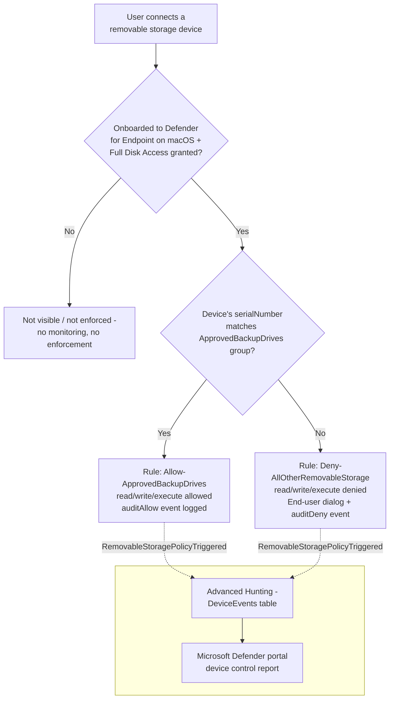

## 1. Scenario summary

Denies **all** removable USB storage devices on onboarded macOS endpoints by default, allowing
only a short, named allowlist of IT-issued, identity-verified backup/imaging drives (matched by
serial number) to read and write. This is the **macOS sibling** of
[`dlp/defender-device-control-usb-allowlist`](/scenarios/dlp/defender-device-control-usb-allowlist/) (Windows) — same device-identity control,
same content-blind scope boundary, translated to macOS's own device control policy model
(JSON `groups`/`rules`/`settings` deployed as a `.mobileconfig` payload) instead of Windows'
OMA-URI/XML mechanism.

**Who it's for:** any organization already deploying the Windows sibling scenario across a mixed
Windows/Mac fleet that would otherwise have **zero** device-identity USB control on every Mac in
it — a real, common gap once a buyer has macOS-using engineering, design, or executive staff
alongside a Windows-majority estate.

## 2. Business/regulatory driver

Identical regulatory framing to the Windows sibling (`defender-device-control-usb-allowlist/
README.md` §2) — GDPR Article 32, HIPAA's 45 CFR §164.312 media controls, PCI DSS Requirement 3,
and SOC 2 CC6 all reference media/physical safeguards broadly enough to expect device-identity
coverage regardless of endpoint operating system. A tenant that deploys the Windows sibling alone
and tells an auditor "no unapproved USB storage device, period" is materially overclaiming if any
Mac in scope has no equivalent control — this scenario closes that specific, platform-shaped gap.

A companion assessment-side scenario, [`compliance-manager/pci-dss-assessment`](/scenarios/compliance-manager/pci-dss-assessment/), tracks
the same PCI DSS v4.0 improvement actions this technical control and its Windows sibling support.

## 3. Prerequisites

Same product family as the Windows sibling — see `docs/licensing-matrix.md` §7 for the
cross-cutting Defender for Endpoint + Intune entitlement summary (that section's licensing
guidance applies identically to macOS; Microsoft's own macOS-specific documentation independently
confirms the same Microsoft 365 E3 / Defender for Endpoint Plan 1 minimum [[1]](#references)).

| Requirement | Minimum | Notes |
|---|---|---|
| Device control (macOS) | **Microsoft Defender for Endpoint Plan 1** (bundled in Microsoft 365 E3) or higher | Confirmed directly against Microsoft's Intune/JAMF deployment guides for macOS device control, both of which state the Microsoft 365 E3 minimum in identical terms to the Windows product [[1]](#references)[[7]](#references). |
| Device management | **Microsoft Intune** (device configuration profiles) | This scenario deploys via an Intune macOS Custom configuration profile — same separate-licensing-line caveat as the Windows sibling (§10). |
| Device onboarding | Mac onboarded to **Microsoft Defender for Endpoint**, enrolled in **Intune**, running Defender for Endpoint on macOS client version **101.91.92** or later | Not performed by this scenario's deploy script [[4]](#references). |
| **Full Disk Access for `com.microsoft.dlp.daemon`** | A Privacy Preferences Policy Control (PPPC) configuration profile granting Full Disk Access to this specific process | **macOS-specific prerequisite with no Windows equivalent.** Device control cannot enforce without it — Microsoft documents deploying `fulldisk.mobileconfig` (or an equivalent PPPC profile) as a prerequisite step, separate from the device-control policy this scenario deploys [[4]](#references). Not performed by this scenario — see §5 step 1 and §11. |
| Supported OS | macOS, versions listed in Microsoft's Defender for Endpoint on macOS system requirements | See `microsoft-defender-endpoint-mac` for the current supported-OS list [[8]](#references). |
| Role to author via the Intune portal (human operator) | **Policy and Profile manager** Intune role, at minimum | Same built-in role as the Windows sibling — Intune's device-configuration RBAC category is not OS-specific; see `docs/rbac-model.md` §9 [[9]](#references). |
| Automation identity | Entra app registration granted the Microsoft Graph **application** permission `DeviceManagementConfiguration.ReadWrite.All`, admin-consented | Confirmed identically for `macOSCustomConfiguration` as for the Windows `windows10CustomConfiguration` type — same permission, same admin-consent requirement [[2]](#references). |
| Dependency (not deployed by this scenario) | An Entra ID group scoping the **pilot** set of Mac endpoints (device group recommended), and the physical **approved backup drives'** serial numbers | Must exist/be known before running `deploy/New-MacDeviceControlUsbAllowlistPolicy.ps1` — see §5. |

> Verify current entitlement names and the Product Terms before a sales commitment — SKU names
> change. This scenario's licensing story is identical in shape to the Windows sibling's (§10);
> the one genuinely new prerequisite line is the Full Disk Access PPPC profile above, which has no
> licensing cost but is a real deployment dependency this scenario does not create.

## 4. Architecture



One Intune macOS **Custom** device configuration profile
(`Device Control (macOS) - USB Removable Media Default-Deny Allowlist`) whose payload is a single
`.mobileconfig`, carrying the `DC_in_dlp` engine-enable feature flag plus an embedded JSON device
control policy (two groups, two mutually-exclusive rules). Full rule-by-rule rationale:
`design.md` §4–5. Enforcement happens **locally on the Mac** via the Defender for Endpoint sensor,
driven by policy synced from Intune.

## 5. Step-by-step implementation

### Portal path (for a first manual walkthrough / to validate intent before scripting)

1. **Confirm onboarding and Full Disk Access first** (one-time, not part of this scenario's deploy
   script). Target Macs must already be onboarded to Microsoft Defender for Endpoint, enrolled in
   Intune, and have a PPPC profile granting **Full Disk Access** to `com.microsoft.dlp.daemon` —
   [Microsoft Defender portal](https://security.microsoft.com) → **Assets** → **Devices** to
   confirm onboarding; deploy Microsoft's own `fulldisk.mobileconfig` (or your organization's
   equivalent PPPC profile) via Intune if not already present [[4]](#references).
2. Sign in to the [Microsoft Intune admin center](https://intune.microsoft.com) →
   **Devices** → **macOS** → **Configuration profiles** → **+ Create profile**.
3. Platform: **macOS**. Profile type: **Templates** → **Custom** [[7]](#references).
4. Name: `Device Control (macOS) - USB Removable Media Default-Deny Allowlist`.
5. Build the `.mobileconfig` file: start from Microsoft's own demo file [[3]](#references), replace
   its `groups`/`rules`/`settings` with the values in `design.md` §4's table, and validate it
   against Microsoft's published JSON schema before uploading [[10]](#references).
6. Upload the `.mobileconfig` as the profile's configuration file.
7. **Assignments**: select the pilot Entra ID group, **not** "All devices," for a first rollout.
8. **Review + create**.

### Script path (idempotent, parameterized, dry-run capable)

```powershell
# 1. Connect (certificate app-only - see docs/automation-surface.md Section 3)
Connect-MgGraph -ClientId $AppId -TenantId $TenantId -CertificateThumbprint $Thumbprint

# 2. Edit deploy/config/mac-device-control-usb-allowlist.sample.json (or copy it) with your
#    approved-device serial numbers and pilot Entra group ID.

# 3. Dry run - reports every change, makes none
./deploy/New-MacDeviceControlUsbAllowlistPolicy.ps1 `
    -ConfigPath ./deploy/config/mac-device-control-usb-allowlist.sample.json `
    -WhatIf

# 4. Deploy, scoped to the pilot group from the config file
./deploy/New-MacDeviceControlUsbAllowlistPolicy.ps1 `
    -ConfigPath ./deploy/config/mac-device-control-usb-allowlist.sample.json

# 5. After a pilot tuning window, widen the assignment tenant-wide (deliberate, explicit)
./deploy/New-MacDeviceControlUsbAllowlistPolicy.ps1 `
    -ConfigPath ./deploy/config/mac-device-control-usb-allowlist.sample.json `
    -AssignAllDevices -Force

# 6. Validate
./validate/Test-MacDeviceControlUsbAllowlistPolicy.ps1 `
    -ConfigPath ./deploy/config/mac-device-control-usb-allowlist.sample.json
```

The deploy script uses the Microsoft Graph PowerShell SDK (`Invoke-MgGraphRequest` against the
`macOSCustomConfiguration` resource) — automation surface 3 per `docs/automation-surface.md` §1.
Device onboarding, Intune enrollment, and the Full Disk Access PPPC profile have no equivalent step
in this script and must be completed first, as in §5 step 1 above.

## 6. Configuration reference

| Setting | Location in `.mobileconfig` | Value |
|---|---|---|
| Enable Device Control engine | `PayloadContent[0].dlp.features[0]` | `{"name": "DC_in_dlp", "state": "enabled"}` |
| Enable removable-media enforcement | `deviceControl.policy.settings.features.removableMedia.disable` | `false` |
| Fail-closed default | `deviceControl.policy.settings.global.defaultEnforcement` | `"deny"` |
| Group: `AllRemovableStorage` (catch-all) | `deviceControl.policy.groups[0]` | `query: {"$type":"all","clauses":[{"$type":"primaryId","value":"removable_media_devices"}]}` |
| Group: `ApprovedBackupDrives` | `deviceControl.policy.groups[1]` | `query: {"$type":"any","clauses":[{"$type":"serialNumber","value":"<serial>"}, ...]}` from config |
| Rule: `Allow-ApprovedBackupDrives` | `deviceControl.policy.rules[0]` | `includeGroups=[ApprovedBackupDrives]`; `allow` + `auditAllow(send_event)`, `access=[read,write,execute]` |
| Rule: `Deny-AllOtherRemovableStorage` | `deviceControl.policy.rules[1]` | `includeGroups=[AllRemovableStorage]`, `excludeGroups=[ApprovedBackupDrives]`; `deny` + `auditDeny(send_event, show_notification)`, `access=[read,write,execute]` |

All group/rule/`PayloadUUID` identifiers are fixed constants defined in
`deploy/New-MacDeviceControlUsbAllowlistPolicy.ps1` (not freshly generated per run), the same
"stable identifiers, not fresh-per-run" discipline as the Windows sibling — see `design.md` §7 for
why. Full cmdlet/REST/schema grounding: the deploy script's `.NOTES` block and §12 below.

## 7. Validation / how to prove it works

1. **Device onboarding/Full Disk Access check** — confirm pilot Macs show as onboarded in the
   Microsoft Defender portal and have Full Disk Access granted to `com.microsoft.dlp.daemon` before
   assuming any functional test result — device control silently does nothing without both.
2. **Automated config check** — `./validate/Test-MacDeviceControlUsbAllowlistPolicy.ps1
   -ConfigPath ./deploy/config/mac-device-control-usb-allowlist.sample.json` confirms the device
   configuration object exists, its `.mobileconfig` payload decodes and contains the expected
   groups/rules/settings, and the pilot group assignment is present; exits non-zero on any hard
   failure.
3. **Profile sync check** — Intune admin center → **Devices** → **macOS** →
   **Configuration profiles** → the policy → **Device status**; confirm pilot Macs show
   **Succeeded**, not **Pending** or **Error**.
4. **Client-side status check** (Terminal on a pilot Mac) —
   ```sh
   mdatp health --details device_control
   ```
   Confirm `v2_configured: true`, `v2_state: "enabled"`, and `v2_full_disk_access: "approved"`
   before running a functional test — if `v2_full_disk_access` is not `approved`, device control
   cannot enforce regardless of what the Graph-side policy object contains [[4]](#references).
5. **Functional test (unapproved drive)** — plug in a removable USB drive **not** on the approved
   list. Expect: read/write denied, an end-user dialog naming the restriction, and a
   `RemovableStoragePolicyTriggered` event with `RemovableStoragePolicyVerdict = Deny` in Advanced
   Hunting.
6. **Functional test (approved drive)** — plug in a drive whose serial number is in the
   `approvedDevices` config list. Expect: read/write succeeds, and a
   `RemovableStoragePolicyTriggered` event with `Verdict = Allow` still appears (audited, not
   silent — §2, `design.md` §2).
7. **Advanced Hunting query** (same query shape as the Windows sibling, `Verdict`/`SerialNumberId`
   fields populated identically across both platforms per Microsoft's own worked example
   [[4]](#references)):
   ```kusto
   DeviceEvents
   | where ActionType == "RemovableStoragePolicyTriggered"
   | extend parsed = parse_json(AdditionalFields)
   | project Timestamp, DeviceName, Verdict = tostring(parsed.RemovableStoragePolicyVerdict),
       SerialNumberId = tostring(parsed.SerialNumber)
   | order by Timestamp desc
   ```

## 8. Operations & tuning

**Deployment sequence:** Off (not assigned) → assigned to a small pilot Entra group → tuned →
assigned tenant-wide (`-AssignAllDevices -Force`). No service-side simulation mode exists
(`design.md` §6) — assignment scope **is** the staged-rollout lever, identical to the Windows
sibling.

**KPIs to watch (first 30 days):** identical framing to the Windows sibling's §8 — deny-path
volume/distribution after widening, allow-path volume per approved drive as a usage baseline, and
`auditDeny` events immediately followed by a new onboarding/PPPC-exception request.

**Alert routing:** Advanced Hunting/`DeviceEvents` is queryable directly in the Microsoft Defender
portal for both platforms; for SIEM integration, route through the **Microsoft Defender Streaming
API** or the **Microsoft Defender XDR connector for Microsoft Sentinel**'s "Connect events" option
— see the Windows sibling's README.md §8 (references 16–17) for the same citations, which apply
identically here since `DeviceEvents` is a single, OS-agnostic Advanced Hunting table.

**Review cadence:** quarterly at minimum; re-run `validate/Test-MacDeviceControlUsbAllowlistPolicy.ps1`
as part of that review. Review the approved-device allowlist itself on the same cadence as any
other privileged-access list.

**Incident-response runbook:** identical structure to the Windows sibling's §8 runbook (triage via
Advanced Hunting → classify legitimate-need-vs-unapproved-attempt → remove a lost/decommissioned
drive's entry and re-run the deploy script `-Force` immediately → document). The one macOS-specific
triage addition: if a pilot Mac shows unexpected allow/deny behavior, check
`mdatp health --details device_control`'s `v2_full_disk_access` value **before** assuming the
policy itself is misconfigured (§7 step 4) — a revoked or never-granted Full Disk Access grant is
indistinguishable from "not onboarded" without this check.

## 9. Rollback / decommission

See `rollback.md` for the full staged procedure (unassign → permanent purge). Quick reference:
`./deploy/Remove-MacDeviceControlUsbAllowlistPolicy.ps1` removes the group assignment (reversible,
the policy definition remains); add `-Purge` to permanently delete the device configuration object.

## 10. Cost & licensing notes

- **No PAYG component.** Device control for macOS is bundled into Defender for Endpoint Plan 1
  (itself bundled into Microsoft 365 E3) — confirmed identically to the Windows product
  [[1]](#references)[[7]](#references). No incremental per-seat cost for a tenant already licensed
  at E3 or above.
- **Intune is a separate licensing line if not already present** — same caveat as the Windows
  sibling.
- **No additional Azure subscription required.**
- **Sizing note:** license only the Macs in the device control assignment scope — staged rollout
  (§8) limits initial licensing exposure to the pilot group.

## 11. Known limitations & gotchas

- **A device presenting as a Portable Device (`portable_devices` — many phones and cameras in
  PTP/MTP-analogous modes) or an Apple (iOS/iPadOS) device is completely invisible to this
  control, not merely unrestricted.** This scenario's policy scopes enforcement to
  `removable_media_devices` only (§6); Microsoft documents `apple_devices`, `portable_devices`, and
  `bluetooth_devices` as distinct `primaryId` families [[4]](#references). This is the **direct
  macOS analog of the Windows sibling's Windows Portable Device (WPD) gap**
  (`defender-device-control-usb-allowlist/README.md` §11) — a user who exfiltrates data via a
  phone or camera connected in one of these other modes bypasses this scenario's deny-by-default
  posture entirely, with no audit event. Closing this requires explicitly adding
  `portableDevice`/`appleDevice` entries and groups to the policy — deliberately out of this
  scenario's initial scope (`design.md` §8), tracked as a follow-up in `PROGRESS.md`.
- **This scenario matches approved devices by `serialNumber` only, not `vendorId`/`productId`.**
  Unlike the Windows sibling (which can mix `SerialNumberId` and `VID_PID` freely in one group),
  macOS's schema requires a separate per-device sub-group to AND a vendor+product pair together —
  a materially more complex, dynamic-GUID idempotency model this fragment deliberately defers
  rather than build unverified (`design.md` §5). A buyer whose approved drives lack a readable
  serial number cannot use this scenario as-is; that gap is tracked as a follow-up, not silently
  dropped.
- **Full Disk Access for `com.microsoft.dlp.daemon` is a hard, silent prerequisite.** A Mac
  onboarded to Defender for Endpoint but missing this PPPC grant enforces nothing and reports
  `v2_full_disk_access` as not `approved` — always check this (§7 step 4) before concluding a
  functional test failure is a policy bug.
- **Device control has no content awareness at all** — pair with a future macOS-scoped Endpoint DLP
  control for content inspection on the approved path too, the same complementary-layers framing
  as the Windows sibling (§2).
- **VERIFY (pilot tenant, before production reliance):** whether `macOSCustomConfiguration`'s
  `payload` PATCH semantics fully replace the prior `.mobileconfig` or merge/append at the plist
  level — Microsoft's `Update macOSCustomConfiguration` reference documents `payload` as an
  updatable property but does not state replace-vs-merge semantics explicitly, the same open
  question the Windows sibling's `omaSettings` PATCH carries. This scenario's `-Force` reconcile
  path assumes full replacement (rebuilds and sends the complete `.mobileconfig` on every PATCH).
  Flagged inline in the deploy script's `.NOTES`.
- **VERIFY (pilot tenant):** whether a tenant that already runs a separate `com.microsoft.wdav`
  preferences profile for other Defender for Endpoint on macOS settings (e.g. cloud-delivered
  protection configuration) experiences a conflict, silent overwrite, or a documented merge when
  this scenario's own `com.microsoft.wdav`-typed profile is also assigned to the same Mac — Apple's
  MDM profile-merge behavior for two profiles sharing a `PayloadIdentifier` from different sources
  is not addressed by Microsoft's device control documentation. Not resolved by guessing; confirm
  against a pilot tenant that already has other MDE-for-macOS configuration profiles deployed
  before assuming this scenario's profile coexists cleanly.
- **Known Microsoft-documented product limitations (not specific to this scenario's design):**
  device control on macOS restricts Android devices connected in PTP mode **only** — File Transfer,
  USB Tethering, and MIDI modes are not restricted; and device control does not prevent software
  built with Xcode from being transferred to an external device [[4]](#references).

## 12. References

1. Deploy and manage Device Control using Intune (macOS) — licensing requirement (Microsoft 365 E3), mobileconfig build/deploy steps — <https://learn.microsoft.com/defender-endpoint/mac-device-control-intune>
2. macOSCustomConfiguration resource type / Create macOSCustomConfiguration (Microsoft Graph v1.0 — `payload`/`payloadFileName`/`payloadName`, `DeviceManagementConfiguration.ReadWrite.All`) — <https://learn.microsoft.com/graph/api/resources/intune-deviceconfig-macoscustomconfiguration>, <https://learn.microsoft.com/graph/api/intune-deviceconfig-macoscustomconfiguration-create>
3. Demo `.mobileconfig` (exact plist key path: `PayloadContent[0].dlp.features` / `PayloadContent[0].deviceControl.policy`, `PayloadType`/`PayloadIdentifier` = `com.microsoft.wdav`) — <https://github.com/microsoft/mdatp-devicecontrol/blob/main/macOS/mobileconfig/demo.mobileconfig>
4. Device Control for macOS (policy model: settings/groups/query/clause/rules/entries/enforcement/access schema tables, Full Disk Access + `DC_in_dlp` prerequisites, minimum client version `101.91.92`, `mdatp health` status fields, Advanced Hunting query, known issues) — <https://learn.microsoft.com/defender-endpoint/mac-device-control-overview>
5. Device control policies in Microsoft Defender for Endpoint (shared Groups/Rules/Entries concepts across Windows and macOS; Mac JSON entry syntax and access-type table) — <https://learn.microsoft.com/defender-endpoint/device-control-policies>
6. Deploy and manage Device Control using JAMF (macOS) — the alternative, non-Intune macOS deployment path this scenario does not cover — <https://learn.microsoft.com/defender-endpoint/mac-device-control-jamf>
7. Deploy and manage Device Control using Intune (macOS) — Devices > macOS > Create profile > Templates > Custom portal path — <https://learn.microsoft.com/defender-endpoint/mac-device-control-intune>
8. Microsoft Defender for Endpoint on macOS (system requirements, Device Control capability summary) — <https://learn.microsoft.com/defender-endpoint/microsoft-defender-endpoint-mac>
9. Create a device configuration profile in Microsoft Intune (Policy and Profile manager role prerequisite; not OS-specific) — <https://learn.microsoft.com/intune/device-configuration/create-device-profile>
10. Device control policy JSON schema for macOS — <https://github.com/microsoft/mdatp-devicecontrol/blob/main/macOS/policy/device_control_policy_schema.json>
11. [`dlp/defender-device-control-usb-allowlist`](/scenarios/dlp/defender-device-control-usb-allowlist/) — the Windows sibling scenario this control complements; see that scenario's own references for the Windows-side citations (Graph `windows10CustomConfiguration`, `EndpointDlpRestrictions`, Intune RBAC).
12. Deploy and manage Device Control manually (macOS) — preproduction-only `mdatp config device-control policy set`/`reset` path, referenced for context only; not used by this scenario's Intune-based deployment — <https://learn.microsoft.com/defender-endpoint/mac-device-control-manual>

> Re-verify all links, and especially the `payload` PATCH replace-vs-merge semantics and the
> multi-profile-conflict question (§11 VERIFYs), against current Microsoft Learn and a pilot
> tenant before a customer-facing assessment or sale.
