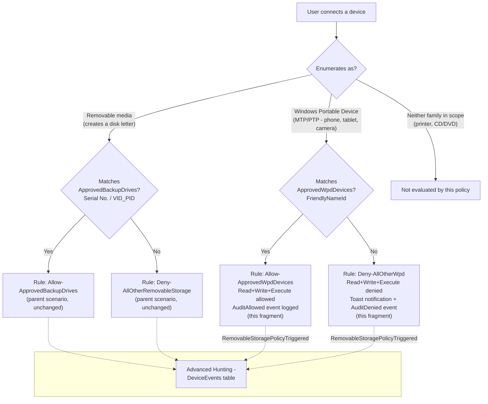

## 1. Scenario summary

Extends [`dlp/defender-device-control-usb-allowlist`](/scenarios/dlp/defender-device-control-usb-allowlist/)'s default-deny USB allowlist to
also cover **Windows Portable Devices (WPD)** — phones, tablets, and cameras connected in MTP/PTP
mode — which that scenario's own Red Team review confirmed are **completely invisible** to a
policy scoped to `RemovableMediaDevices` only. This is a companion fragment, not a standalone
policy: it widens the parent's existing Intune device configuration object in place, adding one
new approved-device group, one new catch-all group, and one new allow/deny rule pair for the WPD
device family.

**Who it's for:** any buyer who has already deployed (or is deploying) the parent USB allowlist
scenario and wants the same "no unapproved removable device, period" posture to also close the
phone-in-MTP-mode gap — typically after a Red Team finding, a DLP audit, or an incident where data
left over a device that never created a drive letter and so was never subject to the parent
policy at all.

## 2. Business/regulatory driver

The parent scenario's `README.md` §11 documents the gap directly: `SecuredDevicesConfiguration`
scoped to `RemovableMediaDevices` enforces nothing against a device that instead enumerates as a
Windows Portable Device — no block, no notification, no Advanced Hunting event. A user who
connects a personal phone in MTP mode rather than a USB mass-storage drive bypasses the parent
policy's entire "default-deny, named allowlist" model with zero signal. That is a materially worse
gap than "this activity type isn't restricted": it is a silent, undetected bypass of a control
whose stated purpose is "no unapproved USB storage device, period" (parent `README.md` §1).

The same regulatory drivers the parent scenario cites — GDPR Article 32, HIPAA 45 CFR §164.312
media controls, PCI DSS Requirement 3, SOC 2 CC6 — reference "media controls"/"physical
safeguards" broadly enough that an auditor who learns the control has a phone-shaped hole in it
will treat that as an open finding, not a footnote. Closing it converts the parent scenario's
narrative from "we control USB drives" to "we control removable and portable storage devices,"
which is the claim most of those frameworks actually expect.

## 3. Prerequisites

This scenario extends the parent policy object and inherits every prerequisite in
`scenarios/dlp/defender-device-control-usb-allowlist/README.md` §3 (Defender for Endpoint Plan 1,
Intune, `DeviceManagementConfiguration.ReadWrite.All`, the parent policy already deployed). One
additional, WPD-specific prerequisite:

| Requirement | Minimum | Notes |
|---|---|---|
| Anti-malware client version (WPD support specifically) | `4.18.2107` or later | The parent scenario's base prerequisite is `4.18.2103.3`+; WPD support was added in a later client release. A pilot device on an older client in that range enforces `RemovableMediaDevices` correctly but silently ignores this fragment's WPD coverage — confirm the client version before assuming a functional test failure is a policy bug [[1]](#references). |
| Parent policy already deployed | `scenarios/dlp/defender-device-control-usb-allowlist/deploy/New-DeviceControlUsbAllowlistPolicy.ps1` has been run at least once | `deploy/Add-WpdDeviceControlCoverage.ps1` refuses to run if the parent policy doesn't exist — this fragment only extends an existing object, it never creates one from scratch (§5, §7). |
| Dependency (not deployed by this scenario) | The approved WPD devices' Device-Manager friendly names (and, optionally, serial numbers/VID_PIDs — see §11 VERIFY) | Must be known before running `deploy/Add-WpdDeviceControlCoverage.ps1` — see §5. |

## 4. Architecture



One existing Intune Windows Custom device configuration profile (the parent scenario's
`Device Control - USB Removable Media Default-Deny Allowlist`) is widened from 7 to 11 OMA-URI
settings: `SecuredDevicesConfiguration` changes from `RemovableMediaDevices` to the documented
pipe-separated multi-value string `RemovableMediaDevices|WpdDevices`
[[2]](#references), and four new settings mirror the parent's group/rule pattern exactly, scoped
to the `WpdDevices` `PrimaryId` family instead. Full rule-by-rule rationale: `design.md` §3–§4.

## 5. Step-by-step implementation

### Portal path (for a first manual walkthrough / to validate intent before scripting)

1. Confirm the parent policy (`Device Control - USB Removable Media Default-Deny Allowlist`)
   already exists and is assigned to at least a pilot group — [Microsoft Intune admin
   center](https://intune.microsoft.com) → **Devices** → **Configuration profiles**.
2. Open the policy → edit its OMA-URI rows.
3. Change the `SecuredDevicesConfiguration` row's value from `RemovableMediaDevices` to
   `RemovableMediaDevices|WpdDevices` (single word, pipe-separated, no spaces — Microsoft
   explicitly warns a string that doesn't follow this syntax "will cause unexpected behavior"
   [[2]](#references)).
4. Add four new OMA-URI rows — one per setting in `design.md` §3's table (two Group XML rows, two
   Rule XML rows), each **Data type: String (XML file), Custom XML** — using the friendly names
   from Windows Device Manager for each approved WPD device (§6, §11).
5. **Review + save.** No new assignment step — this reuses the parent policy's existing
   assignment.

### Script path (idempotent, parameterized, dry-run capable)

```powershell
# 1. Connect (certificate app-only - see docs/automation-surface.md Section 3)
Connect-MgGraph -ClientId $AppId -TenantId $TenantId -CertificateThumbprint $Thumbprint

# 2. Edit deploy/config/wpd-device-control-coverage.sample.json (or copy it) with your approved
#    WPD devices' Device Manager friendly names (see Section 6, Section 11).

# 3. Dry run - reports the planned PATCH, makes no changes
./deploy/Add-WpdDeviceControlCoverage.ps1 `
    -ConfigPath ./deploy/config/wpd-device-control-coverage.sample.json `
    -WhatIf

# 4. Add WPD coverage to the parent policy
./deploy/Add-WpdDeviceControlCoverage.ps1 `
    -ConfigPath ./deploy/config/wpd-device-control-coverage.sample.json

# 5. Validate
./validate/Test-WpdDeviceControlCoverage.ps1 `
    -ConfigPath ./deploy/config/wpd-device-control-coverage.sample.json
```

The deploy script refuses to run if the parent policy doesn't already exist (§3, §7) — it never
creates a standalone WPD-only policy. Like the parent, it uses `Invoke-MgGraphRequest` against the
`windows10CustomConfiguration` resource (automation surface 3 per `docs/automation-surface.md`
§1).

## 6. Configuration reference

| Setting | OMA-URI suffix | Type | Value |
|---|---|---|---|
| Scope (widened) | `SecuredDevicesConfiguration` | `omaSettingString` | `RemovableMediaDevices|WpdDevices` (changed from the parent's original `RemovableMediaDevices`) |
| Group: `ApprovedWpdDevices` (new) | `DeviceControl/PolicyGroups/{GUID}/GroupData` | `omaSettingStringXml` | `MatchAny` over `FriendlyNameId` (confirmed) and, optionally, `SerialNumberId`/`VID_PID` (unconfirmed for WPD — §11) entries from config |
| Group: `AllWpdDevices` (new, catch-all) | `DeviceControl/PolicyGroups/{GUID}/GroupData` | `omaSettingStringXml` | `MatchAny` over `PrimaryId = WpdDevices` |
| Rule: `Allow-ApprovedWpdDevices` (new) | `DeviceControl/PolicyRules/{GUID}/RuleData` | `omaSettingStringXml` | Included = approved WPD group; `Allow`(AccessMask 63) + `AuditAllowed`(send event) |
| Rule: `Deny-AllOtherWpd` (new) | `DeviceControl/PolicyRules/{GUID}/RuleData` | `omaSettingStringXml` | Included = catch-all WPD group, Excluded = approved WPD group; `Deny`(AccessMask 63) + `AuditDenied`(notify + send event) |

The parent's original seven settings (`DeviceControlEnabled`, `DefaultEnforcement`,
`ApprovedBackupDrives` group, `AllRemovableStorage` catch-all group, and the two
`RemovableMediaDevices` rules) are preserved byte-for-byte — this fragment's deploy script rebuilds
the full `omaSettings` array by keeping every non-scope, non-WPD setting from the live object and
only replacing the scope string and (re)adding the four WPD entries (`deploy/
Add-WpdDeviceControlCoverage.ps1`'s `.DESCRIPTION`).

**Matching a device to `FriendlyNameId`:** open **Device Manager** on a machine the device is
connected to → locate the device (usually under "Portable Devices" or "Cameras") → right-click →
**Properties** → **Details** tab → **Device description** shows the friendly name (the same value
Device Control matches against as `FriendlyNameId`) [[3]](#references). This is the one group
property Microsoft's Device-Manager-mapping guidance directly confirms is populated for
portable-device-class hardware; `SerialNumberId`/`VID_PID` are accepted by this scenario's config
schema too but are unconfirmed for the WPD family specifically — see §11.

All four new GUIDs are fixed constants defined in `deploy/Add-WpdDeviceControlCoverage.ps1` (not
freshly generated per run), matching the parent scenario's same idempotency rationale
(`design.md` §5 there).

## 7. Validation / how to prove it works

1. **Automated config check** — `./validate/Test-WpdDeviceControlCoverage.ps1 -ConfigPath
   ./deploy/config/wpd-device-control-coverage.sample.json` confirms the widened
   `SecuredDevicesConfiguration` value, the four new WPD omaSettings, and that the parent's
   original seven settings are untouched; exits non-zero on any hard failure.
2. **Client version check** — confirm the pilot device's anti-malware client is `4.18.2107` or
   later (§3) before any functional test — an older client silently ignores WPD coverage with no
   error.
3. **Profile sync check** — same as the parent scenario's §7 step 2 (Intune admin center →
   **Devices** → **Configuration profiles** → the policy → **Device status** → **Succeeded**).
4. **Functional test (unapproved WPD device)** — connect a phone or camera **not** on the approved
   list in MTP/PTP mode. Expect: read/write denied, a toast notification, and a
   `RemovableStoragePolicyTriggered` event with `RemovableStoragePolicyVerdict = Deny` in Advanced
   Hunting.
5. **Functional test (approved WPD device)** — connect a device whose Device Manager friendly name
   matches a config entry. Expect: read/write succeeds, and a `RemovableStoragePolicyTriggered`
   event with `RemovableStoragePolicyVerdict = Allow` still appears (audited, not silent — same
   design principle as the parent scenario's §2).
6. **Dual-enumeration check** — if the same physical device also creates a disk-letter entry
   (some devices register both a removable-media entry and a WPD entry), confirm it is present in
   **both** the parent's `ApprovedBackupDrives` group and this fragment's `ApprovedWpdDevices`
   group — Microsoft's own guidance is to "grant access for all entries associated with the
   physical device" [[1]](#references); an approval in only one group leaves the other entry
   denied and can present as a partially-working device.
7. **Advanced Hunting query** — the parent scenario's §7 step 5 query works unchanged for
   `ActionType == "RemovableStoragePolicyTriggered"` events, but a WPD-matched event is expected to
   leave `SerialNumber`/`VendorId`/`ProductId` empty (this fragment's `ApprovedWpdDevices` group
   matches by `FriendlyNameId`, not those properties) — do not mistake a blank `SerialNumberId`/
   `VID_PID` column for a query bug when triaging a WPD hit. Project the device's name field too so
   WPD events remain identifiable:
   ```kusto
   DeviceEvents
   | where ActionType == "RemovableStoragePolicyTriggered"
   | extend parsed = parse_json(AdditionalFields)
   | project Timestamp, DeviceName, Verdict = tostring(parsed.RemovableStoragePolicyVerdict),
       MediaName = tostring(parsed.MediaName),
       SerialNumberId = tostring(parsed.SerialNumber), VID_PID = strcat(tostring(parsed.VendorId), "_", tostring(parsed.ProductId))
   | order by Timestamp desc
   ```
   (Extends the parent scenario's own worked query with `MediaName` — the Advanced Hunting field
   Microsoft's own property-mapping table [[3]](#references) maps to `FriendlyNameId` — so a WPD
   event with empty `SerialNumberId`/`VID_PID` is still identifiable by device name.) The event
   schema does not otherwise distinguish device family in `ActionType` — only in which
   `AdditionalFields` properties come back populated.

## 8. Operations & tuning

This fragment shares the parent scenario's full operations model (`README.md` §8) — deployment
sequence, KPI categories, alert routing, review cadence, and incident-response runbook all apply
unchanged, extended to WPD events. Two WPD-specific additions:

- **Reviewing the approved-WPD-device list** carries the same privileged-access review cadence as
  the parent's `approvedDevices` list (quarterly at minimum) — a friendly name is a weaker
  identifier than a serial number (§11), so this list warrants closer scrutiny at each review, not
  looser.
- **A spike in WPD deny events right after this fragment ships** is the expected signal of
  previously-invisible phone/camera usage becoming visible for the first time — investigate for
  legitimate business use before assuming misuse, the same caution the parent scenario documents
  for its own initial rollout.

## 9. Rollback / decommission

See `rollback.md`. Quick reference: `./deploy/Remove-WpdDeviceControlCoverage.ps1` reverts
`SecuredDevicesConfiguration` to `RemovableMediaDevices` only and removes the four WPD-specific
`omaSettings` entries, leaving the parent policy's original USB coverage, assignment, and object
identity untouched. To remove the entire device control policy (both families), use the parent
scenario's own `Remove-DeviceControlUsbAllowlistPolicy.ps1`.

## 10. Cost & licensing notes

No incremental licensing cost beyond the parent scenario's (`README.md` §10) — WPD coverage is
part of the same Defender for Endpoint Plan 1 device control capability, not a separately licensed
feature. The only new cost consideration is operational: reviewing and maintaining a second
approved-device list.

## 11. Known limitations & gotchas

- **`FriendlyNameId` is a materially weaker identifier than `SerialNumberId`/`VID_PID`, in two
  distinct ways.** First, it is often a manufacturer/model default (e.g. "Apple iPhone") shared
  identically across every unit of that model, giving this allowlist the same product-line-not-
  physical-unit coarseness as the parent scenario's `VID_PID` option (parent `README.md` §11) —
  except here there is no confirmed per-unit alternative to fall back on (below). Second, and more
  seriously, on many platforms the device's advertised name is **user-editable** — a phone or
  tablet's Bluetooth/MTP display name is typically a setting the device owner controls, not a
  manufacturer-fixed value. An attacker who learns (or guesses) an approved device's exact display
  string can rename their own unapproved device to match it and be allowed through, with an
  `AuditAllowed` event that reads as legitimate. This is a stronger, more concrete bypass than "the
  identifier is coarse" — it is a spoofable identifier. Mitigations: keep the approved-WPD-device
  population small and IT-managed (not general end-user BYOD), assign a distinctive, non-obvious
  device name to each approved unit rather than its default, and treat this control as a
  compensating layer alongside content-aware DLP and MDM compliance policies, not as a strong
  standalone identity boundary, until the VERIFY below is resolved.
- **VERIFY (pilot tenant, before relying on it for a true per-unit allowlist):** whether
  `SerialNumberId`/`VID_PID` group-matching properties are honored for `WpdDevices`-classified
  hardware. Microsoft's "Device control policies" reference lists both as supported "Windows
  devices" properties in its general properties table without breaking the table down per
  `PrimaryId` family, and this build found no worked example pairing either property with a
  `WpdDevices`-scoped group specifically [[4]](#references). This deliberately corrects an
  earlier, unsubstantiated note in this repo's `PROGRESS.md` follow-up backlog that had asserted
  WPD groups support *only* `FriendlyNameId`/`PrimaryId` — that stronger claim (a documented
  exclusion) could not be confirmed either during this build's grounding pass, so this scenario
  states the gap as genuinely open in both directions rather than repeating the earlier,
  unconfirmed exclusion. `deploy/Add-WpdDeviceControlCoverage.ps1` accepts `serialNumberId`/
  `vidPid` config entries and `validate/Test-WpdDeviceControlCoverage.ps1` checks them, but flags
  both as `[WARN]`, not `[PASS]`/`[FAIL]`, pending pilot-tenant confirmation.
- **No Intune reusable-settings-groups authoring surface exists for WPD groups at all.** The
  Intune portal's reusable-settings UI (`device-control-policies#groups`, "Configure groups in
  Intune" tab) exposes exactly two device group *types* — Printer device and Removable storage —
  neither of which is `WpdDevices`. Unlike the parent scenario's choice of raw OMA-URI over the
  native Device Control profile template (a decision between two available surfaces,
  parent `design.md` §4), for WPD coverage the Custom OMA-URI mechanism this fragment uses is not
  one option among several — it is confirmed to be the **only** Intune-based authoring path,
  alongside Group Policy, for this device family [[4]](#references).
- **A device that dual-enumerates as both a removable-media entry and a WPD entry must be approved
  in both groups** — see §7 step 6. This is not a limitation of this fragment specifically, but a
  documented Microsoft behavior easy to miss when tuning either allowlist independently.
- **Client-version gap.** The parent scenario's base prerequisite (`4.18.2103.3`+) does not
  guarantee WPD support — that requires `4.18.2107` or later (§3). A pilot device between those
  two versions enforces the parent's `RemovableMediaDevices` rules correctly while silently
  ignoring this fragment's WPD rules.
- **This fragment does not change the parent's assignment.** Widening `SecuredDevicesConfiguration`
  on the shared object takes effect for every device already assigned the parent policy — there is
  no separate pilot-then-widen step for WPD coverage specifically. If a more cautious rollout is
  wanted, stage it by first running `deploy/Add-WpdDeviceControlCoverage.ps1` against a
  pilot-scoped **copy** of the parent policy in a lower environment, since the deploy script always
  targets the policy by `parentPolicyDisplayName` and there is exactly one such object per tenant
  in this design.
- **This fragment inherits every parent-scenario limitation** not superseded above — Group
  Policy/Intune precedence conflicts, PATCH replace-vs-merge semantics for `omaSettings` (this
  fragment's own PATCH calls carry the identical open VERIFY), lack of per-device sync-status
  visibility, and the still-open BitLocker-encryption-state and macOS follow-ups (parent
  `README.md` §11).

## 12. References

1. Device control in Microsoft Defender for Endpoint (WPD added in anti-malware client
   `4.18.2107`+; "grant access for all entries associated with the physical device"; disk-letter
   definition distinguishing removable media from WPD) — <https://learn.microsoft.com/defender-endpoint/device-control-overview>
2. Deploy and manage device control in Microsoft Defender for Endpoint with Microsoft Intune
   (`SecuredDevicesConfiguration` OMA-URI, pipe-separated multi-value syntax and "must be all one
   word with no spaces" warning) — <https://learn.microsoft.com/defender-endpoint/device-control-deploy-manage-intune>
3. Device control policies in Microsoft Defender for Endpoint (`PrimaryId` family list including
   `WpdDevices`, `DescriptorIdList` properties, AccessMask parity confirmed across
   `CdRomDevices`/`RemovableMediaDevices`/`WpdDevices`, Windows-Device-Manager-to-`FriendlyNameId`
   mapping, Intune reusable-settings-groups device-group types) — <https://learn.microsoft.com/defender-endpoint/device-control-policies>
4. Device control policies in Microsoft Defender for Endpoint — Groups section (general Windows-
   devices property-support table for `FriendlyNameId`/`VID_PID`/`SerialNumberId`, not broken down
   by `PrimaryId` family; Intune reusable-settings-groups device-group type table showing only
   Printer device / Removable storage, not WPD) — <https://learn.microsoft.com/defender-endpoint/device-control-policies#groups>
5. [`dlp/defender-device-control-usb-allowlist`](/scenarios/dlp/defender-device-control-usb-allowlist/) — the parent scenario this fragment
   extends; see that scenario's own references for every citation not repeated here (licensing,
   onboarding, Graph resource schemas, PowerShell cmdlet references, Advanced Hunting/Sentinel
   alert routing).

> Re-verify all links, and especially the `SerialNumberId`/`VID_PID`-for-WPD VERIFY (§11), against
> current Microsoft Learn and a pilot tenant before a customer-facing assessment or sale.
