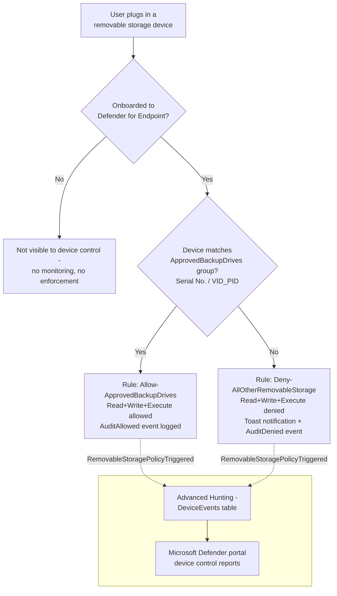

## 1. Problem statement

`scenarios/dlp/endpoint-dlp-usb-block/` stops **regulated content** (SSN/Credit Card Number
matches) from being copied to a USB drive, but it is deliberately **content-aware, not
device-identity-aware**: a non-sensitive file, malware staged on a personal thumb drive, an
unapproved consumer external disk used for a large unauthorized bulk copy, a compromised
"clean" file used to bridge an air-gapped segment, copies freely, because nothing in that
scenario's design inspects *which physical device* is plugged in, only *what content* crosses it.
A buyer who wants **"no unapproved USB storage device, period"**, regardless of what is or isn't
on the file being copied, needs a device-identity control underneath the content-aware one, not
instead of it (`endpoint-dlp-usb-block/README.md` §11; `PROGRESS.md` follow-up backlog).

This scenario closes that gap using **Microsoft Defender for Endpoint device control**: deny all
removable-storage access by default, and allow only a short, named allowlist of IT-issued,
identity-verified backup/imaging drives (matched by serial number and/or USB vendor/product ID), 
mirroring the same "everyone blocked, one named exception audited" shape the sibling Endpoint DLP
scenario and `pci-teams-exfil-block`'s Card Operations override both already use, applied here at
the device layer instead of the content layer.

## 2. Design goals

1. **Default-deny for removable storage**, scoped narrowly to the `RemovableMediaDevices` device
 family only, printers, CD/DVD drives, and Windows Portable Devices are explicitly out of scope
 (`README.md` §7, non-goals), matching the sibling Endpoint DLP scenario's identical "USB copy
 only" scope boundary so the two controls compose predictably rather than one silently widening
 the other's blast radius.
2. **A single named allowlist group** (`ApprovedBackupDrives`) of IT-issued, identity-verified
 drives gets full read/write/execute access; every other removable-storage device is denied,
 with a logged, notified block, not a silent one.
3. **Both the allow and the deny paths are audited**, not just the deny path: an approved drive's
 use generates a queryable Advanced Hunting event on every access, the same "watched, not
 invisible" design the IT Data Custodians exception uses in the sibling scenario, so an approved
 drive's usage pattern is itself a monitorable signal, not a blind trust.
4. **Idempotent and re-runnable.** Re-running the deploy script with an unchanged config makes no
 API calls beyond the read used to detect no drift; re-running after an allowlist change
 reconciles the existing Intune device configuration object in place rather than creating a
 duplicate.
5. **Ships scoped to a pilot group by default**, never tenant-wide on a first run, the same
 staged-rollout discipline as every other scenario in this repo (`AGENTS.md` §4), adapted to
 Intune assignment targeting since device control has no policy-level "simulation mode"
 equivalent to Security & Compliance PowerShell's `TestWithNotifications` (§6, below).

## 3. Why Defender for Endpoint device control (not Endpoint DLP, not Windows device installation restrictions)

- **Endpoint DLP** (the sibling scenario) is **content-aware but device-identity-blind**: it
 inspects what's *in* the file, not *what device* it's going to. It cannot express "deny this
 specific unapproved drive regardless of content", that's not a dimension its policy model has.
- **Windows device installation restrictions** (`policy-csp-deviceinstallation`, configurable via
 Intune ADMX or Group Policy) block a device from installing/enumerating in Windows at all, based
 on device ID / setup class. This is coarser and blunter than device control: it cannot express
 "read-only for everyone, but full access for this one named drive", device installation
 restrictions are a binary install/don't-install gate per device class, not a graduated
 read/write/execute access-control model with named exceptions
 (`device-control-overview#control-access-to-usb-devices`).
- **Device control in Defender for Endpoint** is the only Microsoft control that is simultaneously
 (a) **device-identity-aware** (matches on serial number, vendor/product ID, or device instance
 path, not content) and (b) **graduated** (Allow/Deny/AuditAllow/AuditDeny per access type, Read,
 Write, Execute, not just install/don't-install), which is exactly the "default-deny, named
 allowlist" shape this scenario needs. It is explicitly cross-platform (Windows and macOS) and
 ships as part of Defender for Endpoint Plan 1, which most of this repo's E3+ enterprise buyers
 already hold (`README.md` §3, §10).
- This scenario **does not replace** `endpoint-dlp-usb-block`, the two are complementary layers
 (device identity here, content awareness there), exactly as that scenario's own §11 already
 states. A buyer who deploys only this scenario still has no control over *what* an approved
 drive carries; a buyer who deploys only the sibling still has no control over *which* unapproved
 drive a user plugs in for non-sensitive-looking content. Both together is the intended posture.

## 4. Why Intune Custom OMA-URI (`windows10CustomConfiguration`), not the Intune "Device Control" profile template

Intune offers **two** authoring surfaces for device control, per Microsoft's own documentation
(`device-control-policies#policies`, `device-control-deploy-manage-intune`):

| Surface | What it is | Why not used here |
|---|---|---|
| **Device Control profile** (Endpoint security → Attack Surface Reduction → Device Control, with reusable-settings groups) | A purpose-built portal UI over the same underlying engine, with named "Included/Excluded Devices" rows | No independently-grounded Microsoft Graph resource schema for this profile *type* (as distinct from the generic `deviceConfiguration` family) was found during this build. Microsoft's own docs describe it purely as a portal experience layered over reusable settings; scripting it as raw REST risked guessing an unconfirmed JSON shape, which `AGENTS.md` §4 rules out. |
| **Custom OMA-URI** (`windows10CustomConfiguration`, `omaSettings`) | The direct, low-level MDM CSP passthrough, the same mechanism Microsoft's own docs present as the API-equivalent path ("Creating policies/groups with OMA-URI") | **Used by this scenario.** Fully documented at both the CSP layer (exact OMA-URI paths, integer/string values) and the Microsoft Graph layer (`windows10CustomConfiguration` resource, `omaSetting`/`omaSettingInteger`/`omaSettingString`/`omaSettingStringXml` types, all confirmed against Microsoft's official Graph API reference, see `README.md` §12) and against the typed `New-/Update-/Remove-/Get-MgDeviceManagementDeviceConfiguration` PowerShell cmdlets (`Microsoft.Graph.DeviceManagement` module, v1.0, not beta). |

This is the same category of decision as the sibling scenario's choice of `Audit` over the
unconfirmed `Block with override` `EndpointDlpRestrictions` value: pick the path Microsoft has
fully and currently documented, and flag the richer-but-unconfirmed alternative as a future
upgrade rather than guess its shape. **Follow-up:** if Microsoft publishes a confirmed Graph
resource/schema for the native Device Control profile type, re-evaluate migrating to it, it would
let a future revision use the portal's own "Included/Excluded Devices" reusable-settings model
instead of hand-built XML strings.

## 5. Policy architecture

One `windows10CustomConfiguration` device configuration object
(`Device Control - USB Removable Media Default-Deny Allowlist`) carrying seven OMA settings, all
under the `./Vendor/MSFT/Defender/Configuration/` CSP tree
(`policy-csp-defender`; `device-control-deploy-manage-intune#defining-settings-with-oma-uri`):

| # | Setting | OMA-URI suffix | Type | Value |
|---|---|---|---|---|
| 1 | Enable device control | `DeviceControlEnabled` | Integer | `1` |
| 2 | Scope to removable storage only | `SecuredDevicesConfiguration` | String | `RemovableMediaDevices` |
| 3 | Fail-closed default | `DefaultEnforcement` | Integer | `2` (`DefaultEnforcementDeny`) |
| 4 | Group: approved drives | `DeviceControl/PolicyGroups/{ApprovedGroupId}/GroupData` | XML | `<Group>` matched by `SerialNumberId`/`VID_PID` (parameterized) |
| 5 | Group: all removable storage (catch-all) | `DeviceControl/PolicyGroups/{AllGroupId}/GroupData` | XML | `<Group>` matched by `PrimaryId = RemovableMediaDevices` |
| 6 | Rule: allow approved drives | `DeviceControl/PolicyRules/{AllowRuleId}/RuleData` | XML | Included = approved group; `Allow` + `AuditAllowed` entries, `AccessMask=63` |
| 7 | Rule: deny everything else | `DeviceControl/PolicyRules/{DenyRuleId}/RuleData` | XML | Included = catch-all group, Excluded = approved group; `Deny` + `AuditDenied` entries, `AccessMask=63` |

Settings 6-7 are constructed so a device matches **exactly one** rule, by construction (mutually
exclusive `Included`/`Excluded` group references), mirroring the two-rule, mutually-exclusive
design of the sibling Endpoint DLP scenario and `pci-teams-exfil-block`'s Card Ops override:

`AccessMask = 63` = Device Read (1) + Device Write (2) + Device Execute (4) + File Read (8) +
File Write (16) + File Execute (32), full disk- and file-level access for the approved group;
denied entirely (all six bits) for everything else. Printing (mask bit 64) is a different device
family (`PrinterDevices`) and is untouched by this scenario (`SecuredDevicesConfiguration` scopes
enforcement to `RemovableMediaDevices` only).

## 6. Data flow / where enforcement happens, and the staged-rollout equivalent

Like Endpoint DLP, device control evaluation runs **locally on the device** via the Defender for
Endpoint sensor (anti-malware client `4.18.2103.3`+; `device-control-overview#prerequisites-for-device-control`)
, the device must already be onboarded to Defender for Endpoint (the same onboarding this
scenario's sibling depends on, Purview device onboarding is documented as sharing its onboarding
package with Defender for Endpoint) and receiving Intune device configuration profiles.

**There is no policy-level simulation mode** analogous to Security & Compliance PowerShell's
`TestWithNotifications`, a device control policy is either assigned (and enforcing +
auditing) or not assigned at all. This scenario's staged-rollout equivalent is **assignment
scope**: the deploy script defaults to requiring an explicit Entra ID group ID
(`-ConfigPath`'s `assignment.groupId`, ideally a dynamic device group scoped to a handful of pilot
Windows endpoints) rather than "All Devices," and only assigns tenant-wide when the operator
explicitly passes `-AssignAllDevices`, the same "off by default, deliberate flag to widen" pattern
as `-Mode Enable -Force` elsewhere in this repo (`AGENTS.md` §4). Both the allow and deny entries
carry audit options (`AuditAllowed`/`AuditDenied` with `send event`), so even a pilot-scoped
rollout produces real Advanced Hunting telemetry to validate against before widening.

## 7. Key decisions

| Decision | Choice | Rationale |
|---|---|---|
| Deploy surface | Microsoft Graph (`Connect-MgGraph`, app-only certificate), `Invoke-MgGraphRequest` against `v1.0` | Automation surface 3 per [Automation surface §1](/docs/automation-surface/#1-five-automation-surfaces-not-one-read-this-first); matches the raw-REST-via-Graph-SDK pattern already established by `scenarios/records-management/graph-event-automation/` for Graph endpoints with no simple single-purpose typed cmdlet wrapper convenient for this object shape. |
| Authoring mechanism | Custom OMA-URI (`windows10CustomConfiguration`), not the native Device Control profile template | §4 above, the only mechanism with a confirmed, current Graph schema. |
| Group/rule identifiers | Four **fixed, source-controlled GUIDs** (one per group, one per rule), not freshly generated per run | Microsoft's own guidance is only that GUIDs "must be generated" for non-Intune-portal deployment paths (`device-control-policies#policies`), it does not require a fresh GUID per invocation. Fixed constants checked into `deploy/New-DeviceControlUsbAllowlistPolicy.ps1` guarantee every re-run targets the same four OMA-URI nodes (idempotent reconcile via PATCH), rather than a fresh `New-Guid` per run silently accumulating orphaned groups/rules inside the same `omaSettings` collection. |
| Update strategy | Whole-object `omaSettings` array replacement on every reconcile (PATCH with the full, freshly-built array) | Simpler and less error-prone than patching individual OMA-URI nodes independently, and matches this scenario's declarative, config-file-driven model (the sibling `graph-event-automation` script uses the equivalent "GET, compare, POST/PATCH the full desired state" shape). |
| Approved-device matching | `SerialNumberId` and/or `VID_PID` (both optional per entry, at least one required) | Both are confirmed group-matching properties for Windows removable-storage groups (`device-control-policies#groups`); `VID_PID` alone (e.g. `0781_5591` for a specific make/model) is coarser, it approves an entire product line, not one physical unit, so the README recommends `SerialNumberId` for a true "these exact drives" allowlist and documents the `VID_PID` tradeoff explicitly (`README.md` §6, §11). |
| Default enforcement | `DefaultEnforcementDeny` (`2`), even though the explicit `Deny-AllOtherRemovableStorage` rule (matched against the `PrimaryId = RemovableMediaDevices` catch-all group) already covers every in-scope device | Fail-closed defense in depth: if some future removable-storage sub-class isn't captured by the `RemovableMediaDevices` `PrimaryId` grouping, the tenant-wide default still denies rather than silently allowing, deliberately over-cautious for a control whose stated goal is "no unapproved USB devices, period" (`design.md` §2, `README.md` §2). |
| Assignment default | A named pilot group (required), never "All Devices" without an explicit `-AssignAllDevices` flag | §6 above, the staged-rollout equivalent for a policy type with no service-side simulation mode. |

## 8. Non-goals

- This scenario does not onboard devices to Defender for Endpoint, create the Entra pilot/target
 group, or provision the approved backup drives themselves, all are dependencies, not deployed
 artifacts, the same boundary the sibling Endpoint DLP scenario draws for its own prerequisites.
- This scenario does not configure BitLocker-encryption-required device control (the
 `DeviceEncryptionStateId` **Preview** group property), a real, documented extension
 (`device-control-overview#control-access-to-bitlocker-encrypted-removable-media-preview`) that
 would let "approved" mean "any BitLocker-encrypted drive" instead of "this specific serial
 number list," but it is still Microsoft-labeled Preview as of this build and is a materially
 different trust model (encryption-state-based, not identity-based), a candidate follow-up, not
 bundled here.
- This scenario does not restrict printers, CD/DVD drives, or Windows Portable Devices, only the
 `RemovableMediaDevices` family, matching `endpoint-dlp-usb-block`'s identical USB-only scope so
 the two controls stack predictably.
- This scenario does not configure macOS device control (a separate JSON/`mobileconfig` authoring
 path, `mac-device-control-overview`), Windows only, consistent with this scenario's XML-based
 OMA-URI settings. Built as its own sibling scenario:
 `scenarios/dlp/defender-device-control-usb-allowlist-macos/`.
- This scenario does not use Network, VPN Connection, File, or Print Job **advanced conditions**
 (e.g. "deny removable storage unless on the corporate VPN"), the two-rule allow/deny-by-identity
 model is the full scope; advanced conditions are a documented extension point
 (`device-control-policies#advanced-conditions`) left for a future, explicitly-scoped fragment.
