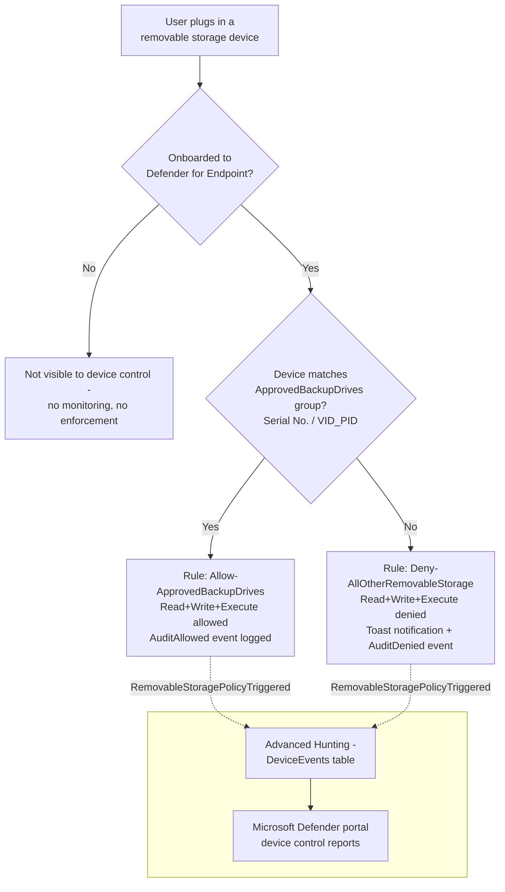

## 1. Scenario summary

Denies **all** removable USB storage devices on onboarded Windows endpoints by default, allowing
only a short, named allowlist of IT-issued, identity-verified backup/imaging drives (matched by
serial number or USB vendor/product ID) to read and write. This is a **device-identity** control —
it does not inspect file content at all — and is the direct companion to
[`dlp/endpoint-dlp-usb-block`](/scenarios/dlp/endpoint-dlp-usb-block/)'s **content-aware** control: that scenario stops regulated
data leaving on *any* USB drive; this one stops *any* USB drive that isn't on the approved list,
regardless of what is or isn't on the file being copied.

**Who it's for:** any organization that has concluded "audit and block by content" isn't enough —
a buyer that wants "no unapproved USB storage device, period," typically after a security incident
involving an unmanaged drive, a compliance requirement to enumerate every device with physical
write access to regulated systems, or a Red Team finding that a non-sensitive-looking file (or a
drive used for something other than a text-pattern-matchable file) bypassed a content-only
control.

## 2. Business/regulatory driver

Content-based DLP (this repo's `endpoint-dlp-usb-block`) cannot see *which device* a file moves
to — only whether the file's content matches a sensitive-information-type pattern. That leaves a
real gap: malware staged from an unmanaged drive, a bulk copy of files that individually don't
match any SIT pattern, or content in a format Endpoint DLP can't scan (encrypted archives,
unsupported file types — see that scenario's own §11) all cross a USB port unimpeded by a
content-only control. Device-identity control closes that gap by asking a different question
entirely: not "is this content sensitive?" but "is this physical device one we've approved?" —
the same two-layer posture (content-aware + device-identity-aware) that regulators and auditors
increasingly expect for removable-media handling under GDPR Article 32, HIPAA's 45 CFR §164.312
media controls, PCI DSS Requirement 3, and SOC 2 CC6, none of which name this exact control but
all of which reference "media controls"/"physical safeguards" broadly enough to expect both
dimensions covered, not just one.

Two secondary drivers:
- **A defensible, closed allowlist for audit.** "Here is the exact list of drives with write
  access to any endpoint in scope, by serial number, and here is the log of every time each one
  was used" is a materially stronger answer to an auditor than "we block drives if the files on
  them look sensitive."
- **Coherence with the sibling scenario's exception model.** Both scenarios use the same "default
  block, one named group, audited not silently trusted" shape — a buyer running both has one
  consistent mental model for removable-media controls, not two independently designed ones.

## 3. Prerequisites

This is the first scenario in this library built on **Microsoft Defender for Endpoint device
control + Microsoft Intune**, not a Purview policy object — see `docs/licensing-matrix.md` §7 for
the cross-cutting entitlement summary for this product family. Prerequisites below are grounded
directly against Microsoft Learn.

| Requirement | Minimum | Notes |
|---|---|---|
| Device control (Windows) | **Microsoft Defender for Endpoint Plan 1** (bundled in **Microsoft 365 E3**, or standalone) or higher | Device control is listed as a Plan 1 attack-surface-reduction capability [[1]](#references); Plan 2 (bundled in Microsoft 365 E5) also includes it. |
| Device management | **Microsoft Intune** (any plan that includes device configuration profiles — bundled in Microsoft 365 E3/E5, or standalone Intune Plan 1) | This scenario deploys via an Intune Custom device configuration profile; Intune device enrollment/management is a separate prerequisite from Defender for Endpoint licensing [[2]](#references). |
| Device onboarding | Devices onboarded to **Microsoft Defender for Endpoint** and enrolled in **Intune**, running anti-malware client `4.18.2103.3` or later | Not performed by this scenario's deploy script — same onboarding dependency the sibling `endpoint-dlp-usb-block` scenario documents (shared onboarding package) [[3]](#references) |
| Supported OS | Windows 10/11 (client only — **device control is not supported on Windows Server**) | macOS device control uses a separate JSON/`mobileconfig` authoring path not covered by this scenario — see `design.md` §8 and the sibling scenario [`dlp/defender-device-control-usb-allowlist-macos`](/scenarios/dlp/defender-device-control-usb-allowlist-macos/) [[3]](#references) |
| Role to author via the Intune portal (human operator, not this scenario's automation) | **Policy and Profile manager** Intune role, at minimum | Built-in Intune RBAC role; see `docs/rbac-model.md` §9 [[4]](#references) |
| Automation identity | Entra app registration granted the Microsoft Graph **application** permission `DeviceManagementConfiguration.ReadWrite.All`, admin-consented | This is what actually authorizes this scenario's app-only Graph calls — the Intune RBAC role above governs human/portal access, not app-only Graph calls made with an admin-consented application permission [[5]](#references) |
| Dependency (not deployed by this scenario) | An Entra ID group scoping the **pilot** set of Windows endpoints (device group recommended), and the physical **approved backup drives'** serial numbers or VID/PID values | Must exist/be known before running `deploy/New-DeviceControlUsbAllowlistPolicy.ps1` — see §5 |

> Verify current entitlement names and the Product Terms before a sales commitment — SKU names
> change. This scenario's licensing story (Defender for Endpoint + Intune) is intentionally kept
> in its own table above rather than folded into `docs/licensing-matrix.md`'s Purview-module
> table (§2), since it isn't a Purview policy object — see that doc's §7 for the cross-cutting
> summary, including the CISO-relevant cost note that Microsoft 365 E3 alone (no Purview E5
> add-on) already covers both this scenario and its WPD-coverage sibling.

## 4. Architecture



One Intune Windows Custom device configuration profile
(`Device Control - USB Removable Media Default-Deny Allowlist`), carrying seven OMA-URI settings
under `./Vendor/MSFT/Defender/Configuration/` — device control enable, scope-to-removable-storage,
fail-closed default, one approved-devices group, one catch-all group, and two mutually-exclusive
rules (allow/deny). Full rule-by-rule rationale: `design.md` §5. Enforcement happens **locally on
the device** via the Defender for Endpoint sensor, driven by policy synced from Intune.

## 5. Step-by-step implementation

### Portal path (for a first manual walkthrough / to validate intent before scripting)

1. **Confirm onboarding first** (one-time, not part of this scenario's deploy script). Target
   devices must already be onboarded to Microsoft Defender for Endpoint and enrolled in Intune —
   [Microsoft Defender portal](https://security.microsoft.com) → **Assets** → **Devices**, confirm
   the pilot devices show as onboarded and reporting.
2. Sign in to the [Microsoft Intune admin center](https://intune.microsoft.com) →
   **Devices** → **Configuration profiles** → **+ Create** → **+ New policy**.
3. Platform: **Windows 10 and later**. Profile type: **Templates** → **Custom**.
4. Name: `Device Control - USB Removable Media Default-Deny Allowlist`.
5. Add one **OMA-URI** row per setting in `design.md` §5's table — `DeviceControlEnabled` (Integer,
   `1`), `SecuredDevicesConfiguration` (String, `RemovableMediaDevices`), `DefaultEnforcement`
   (Integer, `2`), then the two group XML rows and two rule XML rows (Data type **String (XML
   file)**, Custom XML) — see [[6]](#references) for the exact OMA-URI path syntax and
   [[7]](#references) for the Group/Rule/Entry XML schema.
6. **Assignments**: select the pilot Entra ID group, **not** "All devices," for a first rollout.
7. **Review + create**.

### Script path (idempotent, parameterized, dry-run capable)

```powershell
# 1. Connect (certificate app-only — see docs/automation-surface.md §3)
Connect-MgGraph -ClientId $AppId -TenantId $TenantId -CertificateThumbprint $Thumbprint

# 2. Edit deploy/config/device-control-usb-allowlist.sample.json (or copy it) with your
#    approved-device serial numbers/VID_PIDs and pilot Entra group ID.

# 3. Dry run — reports every change, makes none
./deploy/New-DeviceControlUsbAllowlistPolicy.ps1 `
    -ConfigPath ./deploy/config/device-control-usb-allowlist.sample.json `
    -WhatIf

# 4. Deploy, scoped to the pilot group from the config file
./deploy/New-DeviceControlUsbAllowlistPolicy.ps1 `
    -ConfigPath ./deploy/config/device-control-usb-allowlist.sample.json

# 5. After a pilot tuning window, widen the assignment tenant-wide (deliberate, explicit)
./deploy/New-DeviceControlUsbAllowlistPolicy.ps1 `
    -ConfigPath ./deploy/config/device-control-usb-allowlist.sample.json `
    -AssignAllDevices -Force

# 6. Validate
./validate/Test-DeviceControlUsbAllowlistPolicy.ps1 `
    -ConfigPath ./deploy/config/device-control-usb-allowlist.sample.json
```

The deploy script uses the Microsoft Graph PowerShell SDK (`Invoke-MgGraphRequest` against the
`windows10CustomConfiguration` resource) — automation surface 3 per `docs/automation-surface.md`
§1. Device onboarding and Intune enrollment have no equivalent step in this script and must be
completed first, as in §5 step 1 above.

## 6. Configuration reference

| Setting | OMA-URI suffix | Type | Value |
|---|---|---|---|
| Enable device control | `DeviceControlEnabled` | `omaSettingInteger` | `1` |
| Scope to removable storage | `SecuredDevicesConfiguration` | `omaSettingString` | `RemovableMediaDevices` |
| Fail-closed default | `DefaultEnforcement` | `omaSettingInteger` | `2` (Deny) |
| Group: `ApprovedBackupDrives` | `DeviceControl/PolicyGroups/{GUID}/GroupData` | `omaSettingStringXml` | `MatchAny` over `SerialNumberId`/`VID_PID` entries from config |
| Group: `AllRemovableStorage` (catch-all) | `DeviceControl/PolicyGroups/{GUID}/GroupData` | `omaSettingStringXml` | `MatchAny` over `PrimaryId = RemovableMediaDevices` |
| Rule: `Allow-ApprovedBackupDrives` | `DeviceControl/PolicyRules/{GUID}/RuleData` | `omaSettingStringXml` | Included = approved group; `Allow`(AccessMask 63) + `AuditAllowed`(send event) |
| Rule: `Deny-AllOtherRemovableStorage` | `DeviceControl/PolicyRules/{GUID}/RuleData` | `omaSettingStringXml` | Included = catch-all, Excluded = approved group; `Deny`(AccessMask 63) + `AuditDenied`(notify + send event) |

All four GUIDs are fixed constants defined in `deploy/New-DeviceControlUsbAllowlistPolicy.ps1` (not
freshly generated per run) so that re-running the script updates the same four OMA-URI nodes —
see `design.md` §7 for why. Full cmdlet/REST grounding: the deploy script's `.NOTES` block and
§12 below.

## 7. Validation / how to prove it works

1. **Device onboarding/enrollment check** — confirm pilot devices show as onboarded in the
   Microsoft Defender portal and enrolled in Intune before assuming any functional test result —
   an unenrolled or unonboarded device silently ignores this policy entirely, the same
   "check enrollment before blaming the policy" caution the sibling scenario's §7 documents.
1. **Automated config check** — `./validate/Test-DeviceControlUsbAllowlistPolicy.ps1
   -ConfigPath ./deploy/config/device-control-usb-allowlist.sample.json` confirms the device
   configuration object and its seven OMA settings exist with the expected values, and that the
   pilot group assignment is present; exits non-zero on any hard failure (safe for a CI-style
   pre-flight).
2. **Profile sync check** — Intune admin center → **Devices** → **Configuration profiles** → the
   policy → **Device status**; confirm pilot devices show **Succeeded**, not **Pending** or
   **Error**, before running a functional test.
3. **Functional test (unapproved drive)** — from a pilot device, plug in a removable USB drive
   **not** on the approved list. Expect: read/write denied, a toast notification within the hour
   (device control's documented notification cadence [[7]](#references)), and a
   `RemovableStoragePolicyTriggered` event with `RemovableStoragePolicyVerdict = Deny` in Advanced
   Hunting.
4. **Functional test (approved drive)** — plug in a drive whose serial number/VID_PID is in the
   `approvedDevices` config list. Expect: read/write succeeds, and a `RemovableStoragePolicyTriggered`
   event with `RemovableStoragePolicyVerdict = Allow` still appears (the allow path is audited, not
   silent — §2, `design.md` §2).
5. **Advanced Hunting query** (Microsoft Defender portal → **Advanced hunting**):
   ```kusto
   DeviceEvents
   | where ActionType == "RemovableStoragePolicyTriggered"
   | extend parsed = parse_json(AdditionalFields)
   | project Timestamp, DeviceName, Verdict = tostring(parsed.RemovableStoragePolicyVerdict),
       SerialNumberId = tostring(parsed.SerialNumber), VID_PID = strcat(tostring(parsed.VendorId), "_", tostring(parsed.ProductId))
   | order by Timestamp desc
   ```
   (Query pattern grounded directly from Microsoft's own worked example [[3]](#references).)

   **Do not confuse this with `ActionType == "PnPDeviceBlocked"`** — that `ActionType` is emitted
   by a *different* Microsoft control (Windows device installation restrictions, `design.md` §3),
   not this scenario's device control policy. An analyst querying the wrong `ActionType` will see
   zero results and may incorrectly conclude the policy isn't firing.

## 8. Operations & tuning

**Deployment sequence:** Off (not assigned) → assigned to a small pilot Entra group → tuned →
assigned tenant-wide (`-AssignAllDevices -Force`). There is no service-side simulation mode for
device control (`design.md` §6) — assignment scope **is** the staged-rollout lever.

**KPIs to watch (first 30 days):**
- **Deny-path volume and per-user distribution** — a spike right after widening assignment usually
  means a legitimate, previously-unknown workflow was using an unapproved drive, not a wave of
  exfiltration attempts. Investigate before assuming malice, the same caution `endpoint-dlp-usb-block`
  documents for its own Rule 0.
- **Allow-path volume per approved drive** — this is the baseline of how often each IT-issued drive
  is actually used. A drive with unusually high volume, or used from a device/user pattern that
  doesn't match its known custodian, is the signal worth investigating first — the audited-allow
  design exists specifically so this baseline is visible.
- **`AuditDenied` events immediately followed by a new device onboarding/enrollment request** — can
  indicate a user working around the control by requesting an exception rather than reporting a
  genuine business need; route these to the same review as any DLP exception request.

**Alert routing:** Advanced Hunting/`DeviceEvents` is queryable directly in the Microsoft Defender
portal; for SIEM integration, route through the **Microsoft Defender Streaming API**
[[16]](#references) or the **Microsoft Defender XDR connector for Microsoft Sentinel**'s "Connect
events" option, which ingests the `DeviceEvents` table (among others) into a Sentinel workspace
[[17]](#references) — see `docs/automation-surface.md` §4 for this repo's general alert-routing
guidance.

**Review cadence:** quarterly at minimum; re-run `validate/Test-DeviceControlUsbAllowlistPolicy.ps1`
as part of that review to catch configuration or assignment drift. Review the **approved-device
allowlist itself** (§6) on the same cadence as any other privileged-access list — a stale entry for
a decommissioned or lost drive is a live gap, not a paperwork issue.

**Incident-response runbook (an `AuditDenied` event that looks anomalous, or a report of a blocked
legitimate drive):**
1. **Triage** — Advanced Hunting query (§7 step 5) for the device/user/timestamp; confirm the
   `RemovableStoragePolicyVerdict` and whether the device's serial number/VID_PID is genuinely
   absent from the approved list (misconfiguration) or genuinely unapproved (policy working as
   intended).
2. **Classify** — legitimate business need for a new approved drive vs. a user attempting to use
   an unapproved device. The former routes to the standard change-request process for adding a new
   `approvedDevices` entry (with its serial number, not just its VID_PID, for a true single-drive
   allowlist — §11); the latter routes to the org's standard security-awareness or HR process.
3. **If a lost or decommissioned approved drive is reported** — remove its entry from the config
   and re-run the deploy script (`-Force`) **immediately**; a lost drive still on the allowlist is
   an active gap, not a historical one.
4. **Document** — every allow-path audit event and every escalated deny-path event is retained as
   incident-response evidence; do not delete or edit Advanced Hunting data (subject to its own
   retention window).

## 9. Rollback / decommission

See `rollback.md` for the full staged procedure (unassign → permanent purge). Quick reference:
`./deploy/Remove-DeviceControlUsbAllowlistPolicy.ps1` removes the group assignment (reversible,
the policy definition remains); add `-Purge` to permanently delete the device configuration object.

## 10. Cost & licensing notes

- **No PAYG component.** Device control is bundled into Defender for Endpoint Plan 1 (itself
  bundled into Microsoft 365 E3) — see §3. No incremental per-seat cost for a tenant already
  licensed at E3 or above for other reasons.
- **Intune is a separate licensing line if not already present.** Unlike the sibling
  `endpoint-dlp-usb-block` scenario (pure Purview/Exchange licensing), this scenario's deployment
  mechanism requires Intune device management specifically — confirm the target tenant already has
  Intune (bundled in Microsoft 365 E3/E5, or standalone) before selling this as a zero-incremental-
  cost add-on.
- **No additional Azure subscription required.**
- **Sizing note:** license only the users/devices in the device control assignment scope — this
  scenario's staged rollout (§8) means initial licensing exposure is limited to the pilot group,
  widening only after tuning.

## 11. Known limitations & gotchas

- **`VID_PID` approves a product line, not one physical drive.** A `VID_PID` entry like
  `0781_5591` matches *every* drive of that make/model, not the specific unit issued to IT — for a
  true "these exact drives and nothing else" allowlist, use `SerialNumberId` per drive instead (or
  in addition). The sample config defaults to `SerialNumberId`; `design.md` §7 documents this
  tradeoff explicitly.
- **Device control has no content awareness at all.** This scenario says nothing about *what* an
  approved drive carries on or off the network — pair it with `endpoint-dlp-usb-block` for content
  inspection on the approved path too; the two scenarios are complementary layers, not
  alternatives (§2, `design.md` §3).
- **Group Policy and Intune device control cannot coexist on the same machine.** Microsoft's own
  FAQ states that if a device is covered by both, only the Group Policy setting applies
  [[8]](#references) — confirm no conflicting GPO-based device control policy exists on pilot
  devices before troubleshooting an apparently-ignored Intune assignment.
- **No native Graph resource for the portal's "Device Control profile" template was found and
  independently confirmed during this build** — this scenario deliberately uses the lower-level,
  fully-documented Custom OMA-URI mechanism instead (`design.md` §4). If Microsoft later publishes
  a confirmed schema for the native profile type, migrating to it would let a future revision
  reuse Intune's own reusable-settings groups instead of hand-built XML.
- **A device presenting as a Windows Portable Device (WPD) — many phones, tablets, and cameras in
  MTP/PTP mode — is completely invisible to this control, not merely unrestricted.** This
  scenario's `SecuredDevicesConfiguration` value scopes device control enforcement to the
  `RemovableMediaDevices` family only (§6); Microsoft treats `WpdDevices` as a distinct device
  family with its own `PrimaryId` [[7]](#references). A user who exfiltrates data by connecting a
  phone in MTP mode rather than a USB mass-storage drive bypasses this scenario's deny-by-default
  posture entirely — no audit event, no notification. Closing this requires explicitly adding
  `WpdDevices` to `SecuredDevicesConfiguration` (a multi-value, pipe-separated string per the CSP
  reference [[6]](#references)) and extending both the catch-all and approved-device groups to
  cover WPD-classified hardware — deliberately out of this scenario's initial scope (`design.md`
  §8) because it changes the device-matching properties available (`FriendlyNameId`/`PrimaryId`
  only for WPD, not `SerialNumberId`/`VID_PID`), and is tracked as a follow-up in `PROGRESS.md`
  rather than bundled in here unverified.
- **This scenario does not restrict Bluetooth, network shares, printing, or CD/DVD drives** —
  only `RemovableMediaDevices` (USB drives that create a disk letter) and, as just noted, not
  WPD-classified devices either. See `design.md` §8 for the full non-goals list, including the
  still-Preview BitLocker-encryption-state device control option.
- **A device not onboarded to Defender for Endpoint, or not Intune-enrolled, is invisible to this
  control entirely** — no error, no block, no audit event. Always confirm onboarding/enrollment
  status (§7 step 1–2) before concluding a functional test failure is a policy bug.
- **VERIFY (pilot tenant, before production reliance):** whether Intune's Custom OMA-URI profile
  PATCH semantics fully replace the `omaSettings` collection on an update, or merge/append —
  Microsoft's `Update windows10CustomConfiguration` reference documents `omaSettings` as an
  updatable property but does not state replace-vs-merge semantics explicitly. This scenario's
  `-Force` reconcile path assumes full replacement (sends the complete, freshly-built array on
  every PATCH); confirm this against a pilot tenant before relying on `-Force` to *remove* a
  previously-approved device from the allowlist, since a merge-not-replace behavior would leave a
  removed device's group entry stranded rather than deleted. Flagged inline in the deploy script's
  `.NOTES`.

## 12. References

1. Overview of Microsoft Defender for Endpoint Plan 1 (device control listed as a Plan 1 attack-surface-reduction capability) — <https://learn.microsoft.com/defender-endpoint/defender-endpoint-plan-1>
2. What is Microsoft Intune (licensing overview) — <https://learn.microsoft.com/intune/intune-service/fundamentals/what-is-intune>
3. Device control in Microsoft Defender for Endpoint (overview, prerequisites, Advanced Hunting query examples, `RemovableStoragePolicyTriggered`) — <https://learn.microsoft.com/defender-endpoint/device-control-overview>
4. Create a device configuration profile in Microsoft Intune (Policy and Profile manager role prerequisite) — <https://learn.microsoft.com/intune/device-configuration/create-device-profile>
5. How to use Microsoft Entra ID to access the Intune APIs in Microsoft Graph (`DeviceManagementConfiguration.ReadWrite.All` application permission scope) — <https://learn.microsoft.com/intune/developer/configure-graph-api-access>
6. Deploy and manage device control in Microsoft Defender for Endpoint with Microsoft Intune (OMA-URI paths and data types for `DeviceControlEnabled`/`SecuredDevicesConfiguration`/`DefaultEnforcement`/`PolicyGroups`/`PolicyRules`) — <https://learn.microsoft.com/defender-endpoint/device-control-deploy-manage-intune>
7. Device control policies in Microsoft Defender for Endpoint (Groups/Rules/Entries schema, `AccessMask`, `MatchType`, notification cadence) — <https://learn.microsoft.com/defender-endpoint/device-control-policies>
8. Microsoft Defender for Endpoint Device Control frequently asked questions (Group Policy vs. Intune precedence when both target the same device) — <https://learn.microsoft.com/defender-endpoint/device-control-faq>
9. windows10CustomConfiguration resource type (Microsoft Graph v1.0 — `omaSettings` property) — <https://learn.microsoft.com/graph/api/resources/intune-deviceconfig-windows10customconfiguration>
10. Create windows10CustomConfiguration (`POST /deviceManagement/deviceConfigurations`) — <https://learn.microsoft.com/graph/api/intune-deviceconfig-windows10customconfiguration-create>
11. omaSetting / omaSettingInteger / omaSettingString / omaSettingStringXml resource types (Microsoft Graph v1.0) — <https://learn.microsoft.com/graph/api/resources/intune-deviceconfig-omasetting>, <https://learn.microsoft.com/graph/api/resources/intune-deviceconfig-omasettinginteger>, <https://learn.microsoft.com/graph/api/resources/intune-deviceconfig-omasettingstring>, <https://learn.microsoft.com/graph/api/resources/intune-deviceconfig-omasettingstringxml>
12. groupAssignmentTarget / deviceConfigurationAssignment resource types (Microsoft Graph v1.0) — <https://learn.microsoft.com/graph/api/resources/intune-shared-groupassignmenttarget>, <https://learn.microsoft.com/graph/api/resources/intune-deviceconfig-deviceconfigurationassignment>
13. New-MgDeviceManagementDeviceConfiguration / Update-MgDeviceManagementDeviceConfiguration / Remove-MgDeviceManagementDeviceConfiguration (Microsoft.Graph.DeviceManagement PowerShell module, v1.0) — <https://learn.microsoft.com/powershell/module/microsoft.graph.devicemanagement/new-mgdevicemanagementdeviceconfiguration>
14. Device control in Microsoft Defender for Endpoint — control access to USB devices (device installation restrictions vs. device control vs. Endpoint DLP comparison) — <https://learn.microsoft.com/defender-endpoint/device-control-overview#control-access-to-usb-devices>
15. [`dlp/endpoint-dlp-usb-block`](/scenarios/dlp/endpoint-dlp-usb-block/) — the content-aware sibling scenario this control complements; see that scenario's own references for the Endpoint DLP-side citations.
16. Microsoft Defender Streaming API (raw event export for long-term retention / external SIEM ingestion) — <https://learn.microsoft.com/defender-xdr/streaming-api>
17. Microsoft Defender XDR integration with Microsoft Sentinel ("Connect events" — `DeviceEvents` and other advanced hunting tables streamed into a Sentinel workspace) — <https://learn.microsoft.com/azure/sentinel/microsoft-365-defender-sentinel-integration>

> Re-verify all links, and especially the OMA-URI PATCH replace-vs-merge semantics (§11 VERIFY),
> against current Microsoft Learn and a pilot tenant before a customer-facing assessment or sale.
