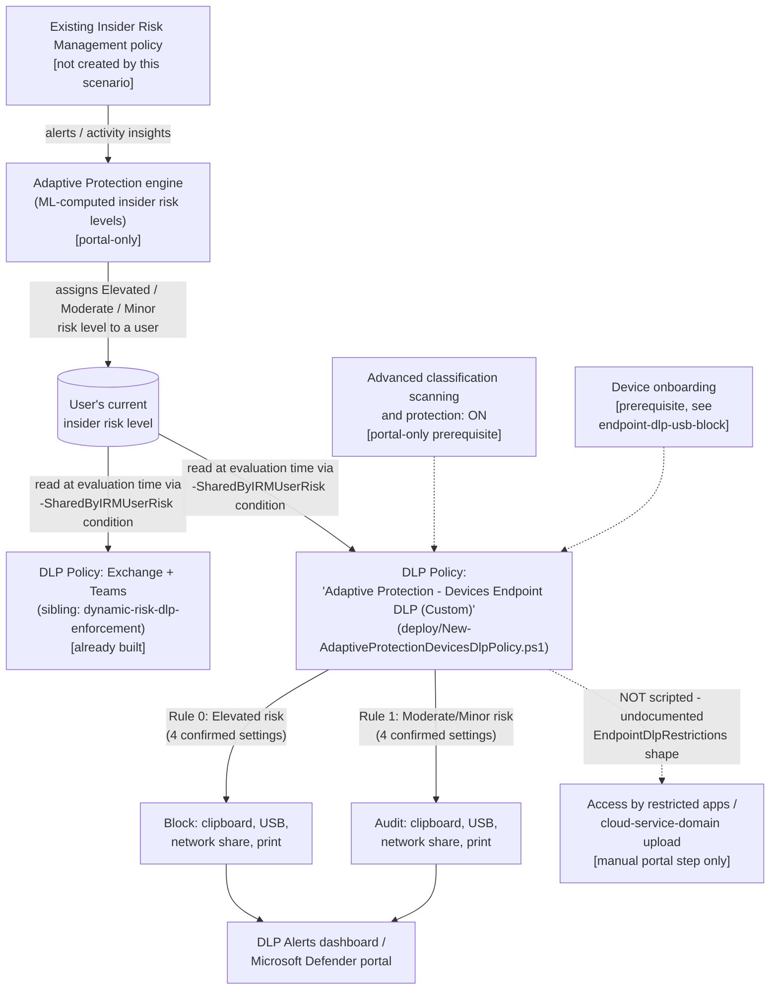

## 1. Problem statement

`scenarios/adaptive-protection/dynamic-risk-dlp-enforcement/README.md` §11 named this exact gap
explicitly, and its own `deploy/New-AdaptiveProtectionDlpPolicy.ps1` diagram marks it "out of
scope this fragment": an Elevated-risk user blocked from emailing or Teams-sharing a file
externally can, with only that sibling scenario deployed, still exfiltrate the identical file via
a direct USB copy, a clipboard paste, a network-share copy, or printing on an onboarded endpoint
device, none of which the Exchange/Teams-only policy inspects. This scenario closes that specific
channel: the **Devices** half of Adaptive Protection, deferred from the sibling scenario because
its `-EndpointDlpRestrictions` restriction-action parameter carried an open **VERIFY** at the time
that scenario was built (`scenarios/dlp/endpoint-dlp-usb-block/README.md` §11). That VERIFY has
since been independently grounded and closed (that scenario's own DONE-entry: both
`New-DlpComplianceRule` and `Set-DlpComplianceRule`'s official Learn reference pages, fetched in
full, confirm the exact `Setting`/`Value` shape directly), this scenario is the fragment that
follow-up unblocked.

## 2. Design goals

1. **Reuse the same Adaptive Protection signal the sibling scenario already consumes, don't
   duplicate it.** This scenario does not create a new Insider Risk Management policy or
   re-implement risk-level computation. It is a second DLP policy, scoped to a different location
   (Devices instead of Exchange/Teams), reading the exact same `-SharedByIRMUserRisk` condition
   and the exact same three fixed GUID values as the sibling scenario.
2. **Script only what's independently grounded, name what isn't, precisely.** Microsoft's own
   documented Devices Quick Setup rule table lists six restricted activities per rule: Copy to
   clipboard, Copy to removable USB device, Copy to network share, Print, Access by restricted
   apps, and Upload to a restricted cloud service domain/unallowed browsers
   [[1]](#references). This build independently confirmed the exact `-EndpointDlpRestrictions`
   `Setting`/`Value` shape for the first four (`CopyPaste`, `RemovableMedia`, `NetworkShare`,
   `Print`, all Audit/Block/Ignore/Warn) against both `New-DlpComplianceRule` and
   `Set-DlpComplianceRule`'s official reference pages [[6]](#references)[[7]](#references). The
   remaining two do **not** have a documented rule-level action shape: the reference's own
   `UnallowedApps` example (`@{"Setting"="UnallowedApps"; "Value"="notepad";
   "value2"="Microsoft Notepad"}`) declares which app is restricted, not what action to take when
   it's accessed, and no `Setting` name for the cloud/browser restriction is documented anywhere
   this build found. §6 documents this precisely rather than guessing a plausible-looking
   hashtable shape, per `AGENTS.md` §4.
3. **Match Microsoft's own documented rule shape for the part that IS scriptable, exactly.** Same
   discipline as the sibling scenario: reproduce Microsoft's published Quick Setup values
   (Elevated → block; Moderate/Minor → audit; Low severity; simulation-mode default) for the four
   confirmed settings, rather than inventing a different threshold scheme.
4. **Resolve the Devices-specific prerequisite without fabricating an undocumented condition.**
   Microsoft states Adaptive Protection on Devices requires either **Advanced classification
   scanning and protection** enabled, or an explicit **File Type is** condition
   [[1]](#references). This scenario uses the former: `-ContentFileTypeMatches` (the parameter
   that would carry a File Type condition) is unpublished placeholder text on both
   `New-DlpComplianceRule`'s and `Set-DlpComplianceRule`'s official reference pages, this repo
   does not fabricate its value syntax. Advanced classification scanning and protection has no
   documented PowerShell/Graph toggle either (portal-only, `dlp-configure-endpoint-settings`), so
   this scenario's prerequisite is a documented manual portal step, not silently assumed.
5. **Start in simulation, exactly like Microsoft's own default and the sibling scenario.**
   `-Mode TestWithNotifications` by default; `-Mode Enable -Force` required to go live.

## 3. Why a second policy, not one combined policy

Microsoft's own Quick Setup creates **two separate policies** when configuring Adaptive
Protection, one for Teams/Exchange, one for Devices [[1]](#references), not one combined
policy. `New-DlpCompliancePolicy` accepts only one location type per rule condition set in
practice for this pattern (Exchange/Teams share one workload family; Devices is a materially
different enforcement surface with its own settings, onboarding, and restriction model). This
scenario follows Microsoft's own documented two-policy shape rather than inventing a combined
one, keeping each policy's blast radius and rollback independent, a buyer can disable the
Devices policy without touching the Exchange/Teams one, or vice versa.

## 4. Policy architecture (what's deployed where)

**What this scenario's code deploys vs. what stays portal-only or undocumented:**

| Component | Mechanism | Scriptable? |
|---|---|---|
| Feeder IRM policy, Adaptive Protection enablement/risk levels | Same as sibling scenario | No, see sibling scenario, not repeated here |
| Device onboarding | Purview portal / MDM package deployment | No, see `scenarios/dlp/endpoint-dlp-usb-block/README.md` §3, reused not repeated |
| Advanced classification scanning and protection | Purview portal → Endpoint DLP settings | No, portal-only toggle, no Graph/PowerShell surface found |
| DLP policy + rules: clipboard/USB/network-share/print restrictions | `deploy/New-AdaptiveProtectionDevicesDlpPolicy.ps1` → `New-/Set-DlpCompliancePolicy`, `New-/Set-DlpComplianceRule -SharedByIRMUserRisk -EndpointDlpRestrictions` | **Yes**, independently grounded [[6]](#references)[[7]](#references) |
| "Access by restricted apps" rule-level action | Portal only, no documented `-EndpointDlpRestrictions` Setting/Value shape for the action (only for declaring which app) | **No**, undocumented; not fabricated, see §2 point 2 |
| "Upload to a restricted cloud service domain / unallowed browsers" rule-level action | Portal only, no documented Setting name found | **No**, undocumented; not fabricated |
| Global restricted-apps/browsers/domains **list definitions** (tenant-wide, not this rule's action) | `Set-PolicyConfig -EndpointDlpGlobalSettings`, genuinely documented with worked examples (`UnallowedApp`, `UnallowedBrowser`, `CloudAppRestrictions`, `CloudAppRestrictionList`) [[8]](#references) | Yes, but out of scope, this defines the tenant-wide **lists**, not this rule's per-tier action, and is shared across every Devices policy in the tenant, not specific to Adaptive Protection; see §7 |

## 5. Data flow

Identical mechanism to the sibling scenario (`dynamic-risk-dlp-enforcement/design.md` §5): insider
risk *level* computation happens entirely inside the Adaptive Protection/Insider Risk Management
service. This scenario's deploy script never reads or writes that attribute directly, it creates
a DLP rule whose condition references it by GUID. At evaluation time, when a user on an onboarded
device attempts a restricted activity, the Endpoint DLP agent looks up the user's current
insider risk level (synced from the cloud service) and matches (or doesn't match) the rule
accordingly. The same **up to 36 hours** propagation delay after first enabling Adaptive
Protection applies here identically [[2]](#references).

## 6. Key decisions

| Decision | Choice | Rationale |
|---|---|---|
| Settings scripted | `RemovableMedia`, `CopyPaste`, `NetworkShare`, `Print` only | The only four `-EndpointDlpRestrictions` Setting names with a confirmed, documented Block/Audit/Ignore/Warn action shape [[6]](#references)[[7]](#references), matches four of the six activities in Microsoft's own Devices Quick Setup rule table [[1]](#references). |
| Settings NOT scripted | "Access by restricted apps," "Upload to a restricted cloud service domain or access from unallowed browsers" | No documented rule-level action shape for either, see §2 point 2 and README.md §11. Fabricating a plausible-looking hashtable would violate `AGENTS.md` §4. Left as a disclosed, precisely-scoped gap with a manual portal completion step, not silently omitted. |
| `ScreenCapture` setting | Not included, even though it's a documented `-EndpointDlpRestrictions` Setting name | Microsoft's own Devices Quick Setup rule table for *this specific policy* does not list "Screen capture" among its restricted activities [[1]](#references), this scenario matches that reference table exactly rather than adding an extra restriction Microsoft's own configuration doesn't include. |
| Devices-prerequisite path | Advanced classification scanning and protection (portal toggle), not a "File Type is" condition | `-ContentFileTypeMatches`'s value syntax is undocumented (`{{ Fill ... Description }}` placeholder on both cmdlet reference pages), this repo does not fabricate an undocumented condition's value shape. Advanced classification is the alternative Microsoft's own documentation names for satisfying the same prerequisite [[1]](#references). |
| File-type scope of the rule | No File Type condition added, the rule applies to **any** file type, not limited to Word processing/Spreadsheet/Presentation/Archive/Mail | Direct consequence of the prerequisite-path decision above: Microsoft's own Quick Setup rule adds a "File Type is" condition scoped to those five types (as the *condition* satisfying the Devices prerequisite), but this scenario satisfies that same prerequisite via the Advanced-classification-scanning toggle instead, so no File Type condition is added at all. Net effect: this scenario's rule is **broader** than Quick Setup's own reference configuration in file-type scope, while being **narrower** in activity scope (4 of 6 actions, §2/§6 above). Both divergences are disclosed in README.md §11 rather than left implicit, a buyer who wants Quick Setup's exact file-type-scoped behavior should add a File Type condition manually via the portal instead of relying on this script's broader-by-default rule. |
| Two separate policies (this scenario + the Exchange/Teams sibling) | Not merged into one | Matches Microsoft's own two-policy Quick Setup output exactly [[1]](#references), see §3. |
| `NotifyUser` on the Block rule | Supplied (`@('LastModifier')`), despite Quick Setup showing "User Notification: Off" for this exact rule | Microsoft's cmdlet reference states Block/Warn values require `NotifyUser` to be supplied; Quick Setup's own displayed "Off" is in direct tension with that statement. Disclosed, not silently resolved either way, see `deploy/New-AdaptiveProtectionDevicesDlpPolicy.ps1`'s `.NOTES` and README.md §11 for the full tension and the pilot-tenant VERIFY this creates. |
| Initial policy mode | `TestWithNotifications` (simulation), matching Quick Setup's own default | Same rationale as the sibling scenario, a wrongly-tuned Elevated-risk block rule has direct, immediate business impact. |
| Policy naming | `Adaptive Protection - Devices Endpoint DLP (Custom)` | Deliberately distinct from Microsoft's auto-generated Quick Setup name (`Adaptive Protection policy for Endpoint DLP`), same collision-avoidance rationale as the sibling scenario. |

## 7. Non-goals

- **This scenario does not create or configure an Insider Risk Management policy, or enable
  Adaptive Protection / define insider risk levels.** Identical non-goal to the sibling scenario
, see that scenario's `design.md` §7, not repeated here.
- **This scenario does not perform device onboarding.** See
  `scenarios/dlp/endpoint-dlp-usb-block/README.md` §3 for that prerequisite's own detail.
- **This scenario does not script the tenant-wide restricted-apps/browsers/domains list
  definitions** (`Set-PolicyConfig -EndpointDlpGlobalSettings` with `UnallowedApp`/
  `UnallowedBrowser`/`CloudAppRestrictions`/`CloudAppRestrictionList`, genuinely documented with
  worked examples [[8]](#references)), even though that mechanism is real and scriptable. Two
  reasons: (1) these lists are tenant-wide Endpoint DLP settings shared across *every* Devices
  policy in the tenant, not specific to this Adaptive Protection scenario, scripting them here
  would silently mutate global state a buyer may already manage through a different process; (2)
  even with the list defined, this scenario still could not wire the corresponding **rule-level**
  Block/Audit action into `-EndpointDlpRestrictions` for "Access by restricted apps" or the
  cloud/browser restriction, see §2 point 2. Scripting only the list, not the enforcement, would
  create a false impression of completeness. Tracked as a follow-up in `PROGRESS.md` in case
  Microsoft documents the missing rule-action shape later.
- **This scenario does not configure Conditional Access or the Data Lifecycle Management
  preservation policy.** Both are Adaptive-Protection-integrated but out of scope here, already
  built as siblings (`scenarios/adaptive-protection/conditional-access-insider-risk-block/`,
  `scenarios/data-lifecycle-management/adaptive-protection-deleted-content-preservation/`).
- **This scenario does not modify or manage the feeder IRM policy's alert/case workflow**, or the
  Exchange/Teams sibling policy. Each of this library's Adaptive-Protection-consuming scenarios
  rolls back and operates independently.

## References

1. Learn about Adaptive Protection in Data Loss Prevention (documented Devices Quick Setup rule
   table, six-activity action list, Advanced classification/File Type prerequisite, "most
   restrictive policy" interaction rule), <https://learn.microsoft.com/purview/dlp-adaptive-protection-learn>
2. Help dynamically mitigate risks with Adaptive Protection (36-hour propagation delay, custom
   setup, permissions), <https://learn.microsoft.com/purview/insider-risk-management-adaptive-protection>
3. Configure endpoint data loss prevention settings (Advanced classification scanning and
   protection, Restricted apps and app groups, Browser and domain restrictions), <https://learn.microsoft.com/purview/dlp-configure-endpoint-settings>
4. Learn about Endpoint data loss prevention (endpoint activities you can monitor and act on), <https://learn.microsoft.com/purview/endpoint-dlp-learn-about>
5. Data Loss Prevention policy reference (Devices location rule actions), <https://learn.microsoft.com/purview/dlp-policy-reference>
6. New-DlpComplianceRule reference (`-EndpointDlpRestrictions`, `-SharedByIRMUserRisk`; confirmed
   Setting names Print/CopyPaste/ScreenCapture/RemovableMedia/NetworkShare/UnallowedApps and Value
   enum Audit/Block/Ignore/Warn; NotifyUser requirement; UnallowedApps app-declaration-only
   example), <https://learn.microsoft.com/powershell/module/exchangepowershell/new-dlpcompliancerule>
7. Set-DlpComplianceRule reference (identical `-EndpointDlpRestrictions`/`-SharedByIRMUserRisk`
   text, confirmed independently), <https://learn.microsoft.com/powershell/module/exchangepowershell/set-dlpcompliancerule>
8. Set-PolicyConfig reference (`-EndpointDlpGlobalSettings`, documented with worked examples for
   `UnallowedApp`/`UnallowedBrowser`/`CloudAppRestrictions`/`CloudAppRestrictionList`/
   `PathExclusion`; distinguish from the per-rule, undocumented action shape in §2/§6), <https://learn.microsoft.com/powershell/module/exchangepowershell/set-policyconfig>
9. New-DlpCompliancePolicy reference (`-EndpointDlpLocation` parameter), <https://learn.microsoft.com/powershell/module/exchangepowershell/new-dlpcompliancepolicy>
10. `scenarios/adaptive-protection/dynamic-risk-dlp-enforcement/`, the Exchange/Teams sibling
    this scenario complements; shares the same feeder-policy and Adaptive-Protection-enablement
    prerequisites, not repeated here.
11. `scenarios/dlp/endpoint-dlp-usb-block/`, the always-on (non-Adaptive-Protection) Devices DLP
    policy this scenario's README.md §11 documents an interaction with ("most restrictive policy
    wins").
