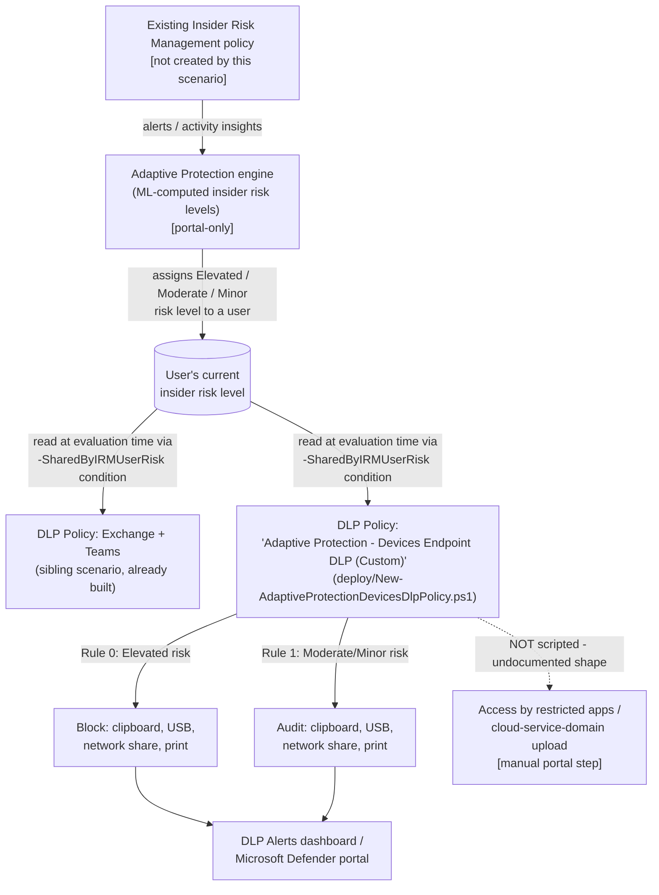

## 1. Scenario summary

Deploys the **Devices** half of Adaptive Protection: a Microsoft Purview Endpoint DLP policy that
automatically blocks clipboard copy, USB removable-media copy, network-share copy, and printing
for users Insider Risk Management currently assigns **Elevated** risk, and audits the same four
activities for **Moderate**/**Minor** risk — on any device already onboarded to Microsoft Purview
device management. As a user's insider risk level changes, this policy's evaluation of them
changes on the next matching activity, with no analyst action required for the first response.

**Scope, stated plainly up front:** Microsoft's own Quick Setup for this same policy type
restricts **six** activities; this scenario scripts the **four** with an independently-grounded
`-EndpointDlpRestrictions` action shape (clipboard, USB, network share, print) and deliberately
does not fabricate the remaining two ("Access by restricted apps," cloud/browser upload
restriction), whose rule-level action syntax is undocumented — see §5 Step 6 and §11 before
representing this scenario as full Quick Setup parity to a buyer.

**Who it's for:** any tenant that has already deployed (or is deploying via this library)
[`adaptive-protection/dynamic-risk-dlp-enforcement`](/scenarios/adaptive-protection/dynamic-risk-dlp-enforcement/) — the Exchange/Teams half of the
same control — and wants to close the device-channel bypass that scenario's own README explicitly
names as an open gap: an Elevated-risk user blocked from emailing a file externally could, with
only the Exchange/Teams policy deployed, still walk out with the identical file via a USB copy, a
clipboard paste, a network-share copy, or a print job.

## 2. Business/regulatory driver

Same underlying driver as the Exchange/Teams sibling scenario (faster incident containment,
SOC 2/ISO 27001 control-automation evidence, analyst workload reduction via targeted rather than
blanket restrictions, cyber-insurance underwriting questions) — not repeated here. This scenario's
specific, additional contribution:

- **Closes a named, real bypass, not a theoretical one.** The sibling scenario's own Red Team
  review flagged the device channel as an active exfiltration path for a user already blocked from
  the network channel. Deploying both scenarios together removes that specific bypass rather than
  leaving it as an accepted residual risk.
- **Matches Microsoft's own documented reference architecture.** Microsoft's Quick Setup for
  Adaptive Protection creates a Devices policy alongside the Exchange/Teams one specifically
  because a single-location control is known to be incomplete for this use case — this scenario
  reproduces that same two-policy shape via the custom-setup path (§5).

## 3. Prerequisites

Full licensing detail and citations: `docs/licensing-matrix.md` §2. Summary for this scenario
(identical Adaptive Protection/IRM/role prerequisites to the Exchange/Teams sibling — see that
scenario's `README.md` §3 for the same rows, not repeated in full here):

| Requirement | Minimum | Notes |
|---|---|---|
| Adaptive Protection | **Microsoft 365 E5**, **Purview Suite**, or the underlying IRM + DLP add-ons | Same entitlement as the Exchange/Teams sibling scenario — no incremental license for this Devices policy specifically |
| Endpoint DLP (Devices) | **E5** | `docs/licensing-matrix.md` §2, DLP row |
| Feeder Insider Risk Management policy | Already deployed and generating alerts/insights | Not created by this scenario — see the Exchange/Teams sibling's own `README.md` §3/§5 |
| Adaptive Protection enabled, insider risk levels defined | Portal-only | Same one-time setup as the sibling scenario — do this once, both Devices and Exchange/Teams policies consume it |
| **Device onboarding** (Devices-specific, not needed by the Exchange/Teams sibling) | Target Windows/macOS devices already onboarded to Microsoft Purview device management | See `scenarios/dlp/endpoint-dlp-usb-block/README.md` §3 for the full onboarding prerequisite — reused here, not repeated |
| **Advanced classification scanning and protection** (Devices-specific) | Turned ON in Endpoint DLP settings | Required for Adaptive Protection to work on Devices at all [[1]](#references) — portal-only, no PowerShell/Graph toggle found during this build (see §5 Step 2 and §11) |
| Role to configure Adaptive Protection settings/insider risk levels | **Insider Risk Management** or **Insider Risk Management Admins** role group | [[2]](#references) |
| Role to create/manage the DLP policy in this scenario | One of: **Compliance Administrator**, **Compliance Data Administrator**, **DLP Compliance Management**, **Global Administrator** | [[2]](#references) — see `docs/rbac-model.md` |
| Automation identity for the deploy script | App-only certificate authentication to Security & Compliance PowerShell | `docs/automation-surface.md` §3 |

> Verify current entitlement names against `docs/licensing-matrix.md` and the Product Terms
> before a sales commitment — SKU names change.

## 4. Architecture



Full rule-by-rule rationale, including exactly what this scenario can and cannot script, is in
`design.md` §4–6.

## 5. Step-by-step implementation

This scenario assumes the Exchange/Teams sibling scenario's Steps 1–3 (feeder IRM policy,
permissions, insider risk level definitions) are already complete — do those once; both policies
consume the same Adaptive Protection configuration.

### Step 1 — Onboard target devices (portal/MDM, not scriptable here)

Devices must already be onboarded to Microsoft Purview device management before this policy can
match any activity on them. See `scenarios/dlp/endpoint-dlp-usb-block/README.md` §3/§5 for the
full onboarding procedure — not repeated here.

### Step 2 — Turn on Advanced classification scanning and protection (portal, not scriptable)

Purview portal → **Data loss prevention** → **Overview** → settings gear icon → **Endpoint DLP
settings** → **Advanced classification scanning and protection** → toggle **On**. Microsoft
documents this (or an explicit **File Type is** condition) as required for Adaptive Protection to
work on Devices at all [[1]](#references); this scenario uses this path rather than a File Type
condition because the corresponding PowerShell parameter's value syntax is undocumented (see §11).

### Step 3 — Deploy the DLP policy (scripted, dry-run capable)

```powershell
Connect-IPPSSession -AppId $AppId -Certificate $Cert -Organization $TenantDomain

# Dry run - shows exactly what would be created, changes nothing
./deploy/New-AdaptiveProtectionDevicesDlpPolicy.ps1 -AdminNotificationEmail 'soc@contoso.com' -WhatIf

# Deploy in simulation mode (Microsoft's own Quick Setup default posture)
./deploy/New-AdaptiveProtectionDevicesDlpPolicy.ps1 -AdminNotificationEmail 'soc@contoso.com' -Mode TestWithNotifications
```

This creates one Endpoint DLP policy scoped to the Devices location, with two rules keyed off the
`SharedByIRMUserRisk` condition and the four confirmed `EndpointDlpRestrictions` settings (§6).

### Step 4 — Pilot, then enforce

Same guidance as the Exchange/Teams sibling scenario: confirm the feeder IRM policy has completed
at least one full baseline/tuning cycle before promoting to enforcement. Pilot on non-production
test accounts/devices while the policy is in `TestWithNotifications` mode. Once satisfied:

```powershell
./deploy/New-AdaptiveProtectionDevicesDlpPolicy.ps1 -AdminNotificationEmail 'soc@contoso.com' -Mode Enable -Force
```

### Step 5 — Validate

```powershell
./validate/Test-AdaptiveProtectionDevicesDlpPolicy.ps1
```

### Step 6 — (Optional) Complete the remaining two Quick Setup actions manually

Microsoft's own Quick Setup Devices rule also includes **Access by restricted apps** and
**Upload to a restricted cloud service domain or access from unallowed browsers**
[[1]](#references). This scenario's script does not create either action because no documented
`-EndpointDlpRestrictions` Setting/Value shape exists for them at the rule level (§11, `design.md`
§2/§6). If a buyer wants full parity with Microsoft's Quick Setup output, add both actions to
**both** rules manually via the portal (Purview portal → **Data loss prevention** → open this
policy → edit each rule's **Audit or restrict activities on devices** action) rather than assuming
this script's four-setting subset is the complete picture.

## 6. Configuration reference

| Setting | Value this scenario uses | Notes |
|---|---|---|
| DLP policy name | `Adaptive Protection - Devices Endpoint DLP (Custom)` | Deliberately distinct from Microsoft's Quick-Setup-generated name (`Adaptive Protection policy for Endpoint DLP`) — see §11 |
| Policy location | Devices (`-EndpointDlpLocation All`) | Endpoint DLP only — Exchange/Teams covered by the sibling scenario |
| Rule 0: `AdaptiveProtection-Devices-Block-Elevated` | `SharedByIRMUserRisk = FCB9FA93-6269-4ACF-A756-832E79B36A2A` (Elevated) → `EndpointDlpRestrictions`: `RemovableMedia`/`CopyPaste`/`NetworkShare`/`Print` all set to `Block` | Reproduces 4 of Microsoft's documented 6 Quick Setup actions for this rule — see §11 for the 2 not scripted |
| Rule 1: `AdaptiveProtection-Devices-Audit-ModerateMinor` | `SharedByIRMUserRisk = 797C4446-5C73-484F-8E58-0CCA08D6DF6C, 75A4318B-94A2-4323-BA42-2CA6DB29AAFE` (Moderate, Minor) → same 4 settings, all `Audit` | Same 2-action gap as Rule 0 |
| `NotifyUser` (Rule 0 only) | `@('LastModifier')` | Required by Microsoft's documented cmdlet reference for a Block value — in tension with Quick Setup's own displayed "User Notification: Off" for this rule; disclosed, not silently resolved — see §11 |
| Initial policy mode | `TestWithNotifications` (simulation) | Matches Microsoft's own Quick Setup default [[1]](#references) |
| Incident report severity | `Low` for both rules | Matches Microsoft's documented values [[1]](#references) |
| User override | Not enabled (default off) | Matches Microsoft's documented values |
| `ScreenCapture` | Not configured | Not part of Microsoft's documented Devices Quick Setup rule table for this policy — see `design.md` §6 |
| Advanced classification scanning and protection | Must be ON (portal, §5 Step 2) | Devices-specific Adaptive Protection prerequisite, distinct from the Exchange/Teams sibling's prerequisites |
| File Type condition | Not added — rule applies to **any** file type | Microsoft's own Quick Setup rule scopes its version of this rule to Word processing/Spreadsheet/Presentation/Archive/Mail via a "File Type is" condition; this scenario instead satisfies the same prerequisite via Advanced classification scanning and protection (above), so no File Type condition is added. Net effect: **broader** file-type coverage than Quick Setup, **narrower** activity coverage (4 of 6 actions) — see §11 |

## 7. Validation / how to prove it works

1. **Automated checks** — `./validate/Test-AdaptiveProtectionDevicesDlpPolicy.ps1` confirms the
   policy and both rules exist with the correct location, `SharedByIRMUserRisk` GUIDs, and
   Block/Audit values on all four scripted settings. Exits non-zero on a hard failure.
2. **Manual checklist** — the same script prints a checklist for device onboarding, Advanced
   classification scanning and protection, Adaptive Protection enablement, insider risk levels,
   the feeder IRM policy, the two unscripted Quick Setup actions (§5 Step 6), and the interaction
   with [`dlp/endpoint-dlp-usb-block`](/scenarios/dlp/endpoint-dlp-usb-block/) if also deployed (§11) — none of which has an API
   this script can query.
3. **End-to-end functional test (non-production accounts/devices only)** — assign a test account
   a confirmed insider risk level, then attempt to copy a file to a USB drive, copy to a network
   share, copy to clipboard, or print it from an onboarded device. Confirm the expected rule fires:
   a block + notification for Elevated, or an audit-only entry for Moderate/Minor. Wait the full
   36-hour propagation window (§11) before concluding a test failed.
4. **Cross-check against the portal's own Adaptive Protection view** — Purview portal → **Insider
   Risk Management** → **Adaptive protection** → **Data Loss Prevention** tab should list this
   policy alongside the Exchange/Teams sibling.

## 8. Operations & tuning

Same KPI framework, tuning guidance, and incident-response runbook shape as the Exchange/Teams
sibling scenario (`dynamic-risk-dlp-enforcement/README.md` §8) — not repeated in full here. Two
Devices-specific additions:

- **Track the split between the two policies.** Because Elevated-risk enforcement now spans two
  independent DLP policies (Exchange/Teams and Devices), review both policies' incident volume
  together, not in isolation — a user blocked on one channel and immediately active on the other
  is a signal the combined control is working as intended (contained on the attempted channel),
  not that one policy "missed" something the other caught.
- **Watch for interaction with [`dlp/endpoint-dlp-usb-block`](/scenarios/dlp/endpoint-dlp-usb-block/), if also deployed.**
  Microsoft's documented "most restrictive policy wins" rule (§11) means a user matched by both
  this policy and that one gets the stricter of the two outcomes automatically — but confirm this
  composes as expected for your specific rule configurations in a pilot tenant rather than
  assuming it always resolves the way you'd want.
- **Coordinate with HR/Legal before broad enforcement-mode rollout** — identical residual
  consideration to the Exchange/Teams sibling scenario (an Elevated-risk block is driven by an
  opaque ML-computed risk score, not a human decision); see that scenario's `README.md` §8 and
  `reviews.md` CISO lens.

## 9. Rollback / decommission

See `rollback.md` for the full staged procedure (disable → simulation → permanent removal).
Quick reference: `./deploy/Remove-AdaptiveProtectionDevicesDlpPolicy.ps1` disables the policy
(reversible in seconds); `-Purge` permanently deletes it. Rolling back this scenario has no effect
on the Exchange/Teams sibling policy, Adaptive Protection itself, device onboarding, or Advanced
classification scanning and protection — each is independently owned.

## 10. Cost & licensing notes

- **No incremental license cost for a tenant already at E5/Suite for the feeder IRM policy and
  the Exchange/Teams sibling scenario** — this Devices policy consumes the same Adaptive
  Protection/Endpoint DLP entitlement, not a separate SKU (`docs/licensing-matrix.md` §2).
- **Endpoint DLP requires per-device onboarding effort** (not a licensing cost, but a deployment
  cost) distinct from the Exchange/Teams sibling, which needs none — see
  `scenarios/dlp/endpoint-dlp-usb-block/README.md` §10 for that scenario's own device-onboarding
  cost discussion, reused here.
- **No PAYG component for this scenario specifically.**
- **No additional infrastructure cost** beyond the one-time deploy and periodic validate runs.

## 11. Known limitations & gotchas

- **Two of Microsoft's six documented Quick Setup Devices actions are NOT scripted by this
  scenario: "Access by restricted apps" and "Upload to a restricted cloud service domain or
  access from unallowed browsers."** Microsoft's `New-DlpComplianceRule`/`Set-DlpComplianceRule`
  reference documents the `-EndpointDlpRestrictions` `UnallowedApps` `Setting` only as a mechanism
  to declare *which app* is restricted (`Value` = executable name, `value2` = friendly name) —
  never how to attach a Block/Audit *action* to that declaration at the rule level, and no
  `Setting` name for the cloud/browser restriction is documented anywhere this build found.
  Fabricating either shape would violate this repo's grounding standard (`AGENTS.md` §4). This
  scenario's policy is therefore a **4-of-6-action subset** of Microsoft's full Quick Setup
  reference configuration — real, useful, and independently grounded for what it does cover, but
  not a complete substitute for Quick Setup's own output. §5 Step 6 documents the manual portal
  completion step for a buyer who wants full parity.
- **`NotifyUser`/Block tension, disclosed not resolved.** Microsoft's cmdlet reference states
  Block or Warn values require the `NotifyUser` parameter to be supplied, yet the same documented
  Quick Setup rule table shows "User Notification: Off" for this exact Devices Block rule. This
  script supplies `-NotifyUser` on the Block rule to satisfy the documented cmdlet requirement.
  **VERIFY** the resulting end-user experience (does a visible toast/notification actually appear,
  despite Quick Setup's own table showing "Off"?) against a pilot tenant before describing this
  rule's user-facing behavior to a customer.
- **This scenario's rule is broader than Microsoft's Quick Setup output in file-type scope, but
  narrower in activity scope.** Quick Setup's own Devices rule adds a "File Type is" condition
  (Word processing, Spreadsheet, Presentation, Archive, Mail) alongside the risk-level condition;
  this scenario satisfies the same underlying prerequisite via Advanced classification scanning
  and protection instead (§3, §5 Step 2), so its rule has **no file-type restriction at all** — it
  evaluates every file type on the four scripted activities, not just the five Quick Setup names.
  A buyer who specifically wants Quick Setup's narrower, file-type-scoped behavior should add a
  File Type condition manually via the portal rather than assume this script already matches it.
- **Advanced classification scanning and protection has its own file-size and file-type limits**
  that indirectly bound how well this policy's underlying content classification works: a 64-MB
  limit on text files, a 50-MB limit on image files when OCR is enabled, and full support limited
  to Office (Word, Excel, PowerPoint) and PDF file types [[8]](#references). A sensitive file
  outside these bounds may not benefit from cloud-based advanced classification even though this
  scenario's four scripted restrictions (which key off the risk-level condition, not content
  classification) still apply to it regardless — but any *content-based* condition a buyer later
  layers on top of this rule (e.g. a sensitive-information-type condition) would inherit this
  limit.
- **`ContentFileTypeMatches`'s value syntax is undocumented** — both `New-DlpComplianceRule` and
  `Set-DlpComplianceRule`'s official reference pages carry unpublished placeholder text for this
  parameter. This scenario avoids it entirely by using the Advanced-classification-scanning
  prerequisite path instead (§3, §5 Step 2) rather than fabricating a File Type condition value.
- **Up to 36 hours before Adaptive Protection actions apply after first enabling** — identical,
  shared backend delay to the Exchange/Teams sibling scenario; not a property of this scenario's
  policy.
- **Interaction with [`dlp/endpoint-dlp-usb-block`](/scenarios/dlp/endpoint-dlp-usb-block/), if deployed in the same tenant.**
  Microsoft documents: "If a user is targeted by a default Adaptive Protection Device DLP policy
  and is targeted by an independent Device DLP policy, only the actions of the *most restrictive*
  policy will be applied" [[1]](#references). This is safe-by-default behavior (the stricter
  outcome always wins), not a silent downgrade — but **VERIFY** the combined behavior in a pilot
  tenant rather than assuming two independently-reviewed policies compose exactly as expected once
  layered on the same user.
- **This policy alone still does not cover every exfiltration channel.** It closes the four
  device-level channels Microsoft's reference configuration names, but a user could still, for
  example, photograph a screen, or exfiltrate through a channel neither this policy nor the
  Exchange/Teams sibling inspects (e.g. a personal mobile hotspot on an unmanaged network path).
  Communicate this plainly: layered controls narrow the gap, they do not eliminate every possible
  exfiltration path.
- **This scenario does not configure Endpoint DLP device onboarding, Advanced classification
  scanning and protection, Adaptive Protection enablement, insider risk level definitions, or the
  feeder IRM policy** — all five are prerequisites this scenario's script assumes are already met
  and cannot verify are correctly configured beyond the manual checklist in
  `validate/Test-AdaptiveProtectionDevicesDlpPolicy.ps1`.

## 12. References

1. Learn about Adaptive Protection in Data Loss Prevention (documented Devices Quick Setup rule
   table — six-activity action list including the two this scenario doesn't script; Advanced
   classification/File Type prerequisite; "most restrictive policy" interaction rule) — <https://learn.microsoft.com/purview/dlp-adaptive-protection-learn>
2. Permissions for Adaptive Protection — <https://learn.microsoft.com/purview/insider-risk-management-adaptive-protection#permissions-for-adaptive-protection>
3. Help dynamically mitigate risks with Adaptive Protection (36-hour propagation delay) — <https://learn.microsoft.com/purview/insider-risk-management-adaptive-protection>
4. New-DlpComplianceRule reference (`-EndpointDlpRestrictions`, `-SharedByIRMUserRisk`,
   `-ContentFileTypeMatches` placeholder text, `NotifyUser` requirement) — <https://learn.microsoft.com/powershell/module/exchangepowershell/new-dlpcompliancerule>
5. Set-DlpComplianceRule reference (identical text, confirmed independently) — <https://learn.microsoft.com/powershell/module/exchangepowershell/set-dlpcompliancerule>
6. New-DlpCompliancePolicy reference (`-EndpointDlpLocation` parameter) — <https://learn.microsoft.com/powershell/module/exchangepowershell/new-dlpcompliancepolicy>
7. Set-DlpCompliancePolicy / Remove-DlpCompliancePolicy reference — <https://learn.microsoft.com/powershell/module/exchangepowershell/set-dlpcompliancepolicy>, <https://learn.microsoft.com/powershell/module/exchangepowershell/remove-dlpcompliancepolicy>
8. Configure endpoint data loss prevention settings (Advanced classification scanning and
   protection, Restricted apps and app groups, Browser and domain restrictions) — <https://learn.microsoft.com/purview/dlp-configure-endpoint-settings>
9. Set-PolicyConfig reference (`-EndpointDlpGlobalSettings` — documented tenant-wide list
   mechanism, distinct from this scenario's per-rule action gap; see `design.md` §7) — <https://learn.microsoft.com/powershell/module/exchangepowershell/set-policyconfig>
10. `docs/licensing-matrix.md` §2 — Adaptive Protection and Endpoint DLP rows.
11. [`adaptive-protection/dynamic-risk-dlp-enforcement`](/scenarios/adaptive-protection/dynamic-risk-dlp-enforcement/) — the Exchange/Teams sibling
    scenario this one complements.
12. [`dlp/endpoint-dlp-usb-block`](/scenarios/dlp/endpoint-dlp-usb-block/) — the always-on Devices DLP policy this scenario's
    §11 documents an interaction with.

> Re-verify all links, cmdlet/API behavior, and licensing terms against current Microsoft Learn
> before a customer-facing assessment or sale — Adaptive Protection and Endpoint DLP are both
> comparatively fast-moving areas of the Purview portfolio.
