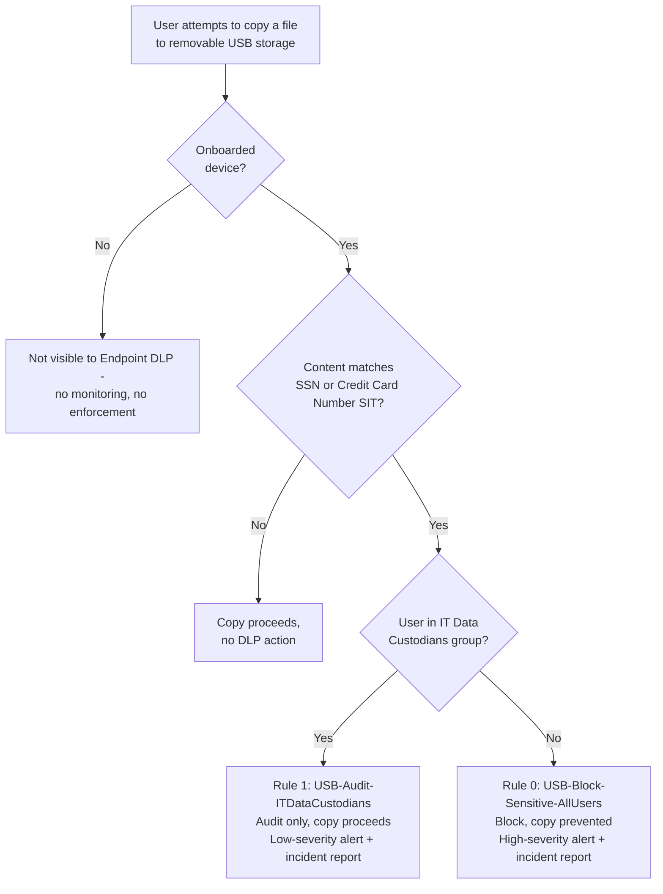

## 1. Problem statement

An enterprise or SMB tenant has employees working on Windows/macOS endpoints who can plug in a
USB flash drive or external hard disk and copy files off the corporate network entirely outside
any cloud-inspectable channel (email, Teams, SharePoint). Files already carrying regulated data, 
in this scenario, content matching the same U.S. Social Security Number / Credit Card Number
sensitive information types (SITs) that `scenarios/information-protection/
auto-label-confidential-sharepoint/` auto-labels **Confidential**, need to be stopped from
leaving via removable media by default, while a small, named IT/backup-operations group that
performs legitimate offline backups to company-issued drives is not locked out of its job, only
watched more closely than everyone else.

## 2. Design goals

1. Block, don't just audit, copying of SSN/Credit-Card-Number content to removable USB storage
 from any onboarded Windows or macOS device, this is the exfiltration channel Endpoint DLP
 exists to close (`README.md` §2).
2. Give a single named security group (IT Data Custodians) a narrower path: audited, not blocked,
 because backup/imaging operations are a legitimate, already-approved workflow that a hard
 block would break, same shape as the Card Operations override in
 `scenarios/dlp/pci-teams-exfil-block/`, adapted to a device-control action instead of a
 Teams-message action.
3. Reuse the exact SIT pair (`U.S. Social Security Number (SSN)`, `Credit Card Number`, minimum
 count 1) already deployed by `auto-label-confidential-sharepoint`, so the two scenarios form a
 single coherent control: content gets classified/labeled Confidential in one scenario and is
 then blocked from leaving via USB in this one, without redefining what "sensitive" means twice.
4. Everything is idempotent and re-runnable: running `New-EndpointDlpUsbBlockPolicy.ps1` twice
 must not create duplicate policies/rules or error out.
5. Ship "off" by default (`-Mode TestWithNotifications`), matching the staged-rollout default used
 by every other scenario in this repo (`AGENTS.md` §4, `pci-teams-exfil-block/design.md` §2).

## 3. Why Endpoint DLP (not Defender for Endpoint device control, not DLP for SharePoint/OneDrive)

- **Microsoft Defender for Endpoint device control** (`device-control-overview`,
 <https://learn.microsoft.com/defender-endpoint/device-control-overview>) can deny a USB device
 outright at the driver/PnP level, allow, block, or audit a *device*, regardless of what's on
 it. That's the right tool for "no unapproved USB drives, period." It is **content-blind**: it
 cannot distinguish a spreadsheet of card numbers from a screenshot of a cat. This scenario needs
 a content-aware decision (let non-sensitive files copy freely; stop only the regulated content),
 which is Endpoint DLP's job, not device control's. The two are complementary, not competing, 
 see `README.md` §11 for how a buyer combines them.
- **DLP for SharePoint/OneDrive** protects content only while it's *inside* Microsoft 365 cloud
 storage/sync locations. Once a file is already resident on a laptop's local disk (downloaded,
 created locally, synced then taken offline), SharePoint/OneDrive DLP has no visibility into a
 local copy-to-USB action, only Endpoint DLP, which requires the device to be **onboarded**, can
 see and act on that local file-system activity (`endpoint-dlp-learn-about`, "Learn about
 Endpoint data loss prevention").
- **Endpoint DLP** is the only Purview control that (a) inspects file content for the same SITs
 used elsewhere in the tenant, in real time, at the point of the copy attempt, and (b) can take a
 content-aware action (audit/block/block-with-override) scoped to the **removable media**
 activity specifically, leaving every other file activity on the device unaffected.

## 4. Policy architecture

One DLP policy (`Endpoint DLP - Block USB Removable Media Exfiltration`), scoped to the
**Devices** (Endpoint DLP) location, containing two priority-ordered rules. Rule 0 excludes the
IT Data Custodians group; rule 1 is scoped to it, mutually exclusive by construction, so a given
copy attempt matches exactly one of the two rules, never both.

| Priority | Rule | Scope | Condition | Action |
|---|---|---|---|---|
| 0 | `USB-Block-Sensitive-AllUsers` | Everyone **except** IT Data Custodians (`ExceptIfFromMemberOf`) | Content contains **U.S. Social Security Number (SSN)** OR **Credit Card Number** (min count 1) | `EndpointDlpRestrictions`: copy-to-removable-media → **Block**; alert (High); incident report to admins |
| 1 | `USB-Audit-ITDataCustodians` | IT Data Custodians (`FromMemberOf`) | Same SIT condition | `EndpointDlpRestrictions`: copy-to-removable-media → **Audit**; alert (Low); incident report to admins |

## 5. Data flow / where enforcement happens

Endpoint DLP evaluation runs **on the device itself** (the local DLP agent that ships as part of
the anti-malware/Defender client on an onboarded Windows or macOS endpoint), not in the cloud path
, the device must already be onboarded into device management (shared onboarding with Microsoft
Defender for Endpoint) and must be reporting into Activity explorer before any policy scoped to
**Devices** takes effect (`device-onboarding-overview`). Content is scanned locally at
creation/modification/read time and re-evaluated against current policy on each access; the block
or audit decision is enforced locally, with the resulting event synced back to the Purview
compliance portal for Activity explorer, the DLP Alerts dashboard, and incident reports.

**Important dependency this scenario does not automate:** device onboarding. Onboarding is
performed by deploying a Microsoft-provided package (local script, Group Policy, Configuration
Manager, or Intune) to each endpoint, it is not a Security & Compliance PowerShell object and has
no `New-`/`Set-DlpCompliance*` equivalent. This scenario's deploy script assumes devices are
already onboarded (see `README.md` §3) and only authors the DLP policy/rules that act on those
already-onboarded devices, mirroring how `pci-teams-exfil-block` assumes the Card Ops group
already exists rather than creating it.

## 6. Key decisions

| Decision | Choice | Rationale |
|---|---|---|
| Deploy surface | Security & Compliance PowerShell (`Connect-IPPSSession`), per [Automation surface](/docs/automation-surface/) surface 2 | Same as every other DLP scenario in this repo, DLP policy/rule objects have no Graph authoring equivalent today. |
| Sensitive content condition | Same SIT pair as `auto-label-confidential-sharepoint` (SSN, Credit Card Number; min count 1) | Keeps "what counts as sensitive" consistent across the two scenarios that together form one classify-then-control chain; avoids a buyer having two different, drifting definitions of "sensitive" for the same data. |
| Restricted activity | **Copy to a removable device** only (`EndpointDlpRestrictions` Setting `RemovableMedia`) | Matches the scenario's stated scope (USB exfiltration). Print, clipboard, network share, Bluetooth, and RDP are separate `EndpointDlpRestrictions` activities this scenario deliberately leaves untouched, see `README.md` §7, non-goals. |
| IT exception mechanism | `FromMemberOf` / `ExceptIfFromMemberOf` on a security group, not a device-based Removable USB device group allowlist | Consistent with the Card Ops precedent in `pci-teams-exfil-block` (auditable, survives staff turnover, no script edits on membership change) and avoids depending on the **Removable USB device groups** portal feature. A dedicated grounding pass confirmed this is portal-only end-to-end, not just the device-registration step: `Set-PolicyConfig -DlpRemovableMediaGroups` exists but its hashtable shape is undocumented (placeholder text in Microsoft's own reference), and `New-DlpComplianceRule`/`Set-DlpComplianceRule` expose no parameter for referencing a device group as a rule condition/exception at all (`README.md` §11). |
| IT exception action | **Audit** by default; **Warn** available as an opt-in (`-ITExceptionAction`) | Microsoft's official `New-DlpComplianceRule`/`Set-DlpComplianceRule` reference now confirms the full `-Value` enum (`Audit`, `Block`, `Ignore`, `Warn`) and states that `Block` or `Warn` both require `-NotifyUser`, strong, though not literal, evidence `Warn` is the enum value behind the portal's "Block with override" option (`README.md` §11). This design keeps `Audit` as the default (no behavior change from the prior revision, and no interruption to the custodian team's legitimate workflow), but exposes `-ITExceptionAction Warn` for a buyer who wants that path justification-gated rather than silently logged. The prompt-text-vs-portal-name mapping is still a pilot-tenant VERIFY, not a hard block on shipping the option. |
| Default policy mode | `TestWithNotifications` | Matches `AGENTS.md` §4 (dry-run path) and every prior scenario in this repo: nothing here enforces by default against a live tenant without an explicit, deliberate flag. |

## 7. Non-goals

- This scenario does not configure **Microsoft Defender for Endpoint device control** (device-ID/
 vendor-ID allow/deny lists, BitLocker-encryption-required policies). That's a complementary,
 device-identity-based control, see `README.md` §11 for how the two combine.
- This scenario does not restrict **Print, clipboard, network share, Bluetooth, or RDP** file
 activities, only **copy to removable media**. A buyer wanting those covered too extends the
 `EndpointDlpRestrictions` array in `deploy/New-EndpointDlpUsbBlockPolicy.ps1` (each additional
 activity is one more `@{Setting=...; Value=...}` hashtable in the same array), using Microsoft's
 now-confirmed `Setting` names for four of them, `Print`, `CopyPaste`, `ScreenCapture`,
 `NetworkShare`, plus `UnallowedApps`. Bluetooth and RDP `Setting` names remain unconfirmed
 (`README.md` §11).
- This scenario does not create or manage the `ITCustodiansGroupEmail` security group, or perform
 device onboarding, both are dependencies, not deployed artifacts (§5 above).
- This scenario does not configure **Removable USB device groups** (per-physical-device
 allowlisting of, e.g., specific IT-issued encrypted backup drives), a dedicated grounding pass
 (`PROGRESS.md`) confirmed this stays portal-only in full: the group is created in Endpoint DLP
 settings and referenced back in a rule's actions/exceptions entirely through the portal UI;
 `Set-PolicyConfig -DlpRemovableMediaGroups` exists but Microsoft's own reference leaves its
 hashtable shape (and that of every sibling device-group parameter) undocumented, and no
 rule-authoring cmdlet exposes a matching parameter, see `README.md` §11.
