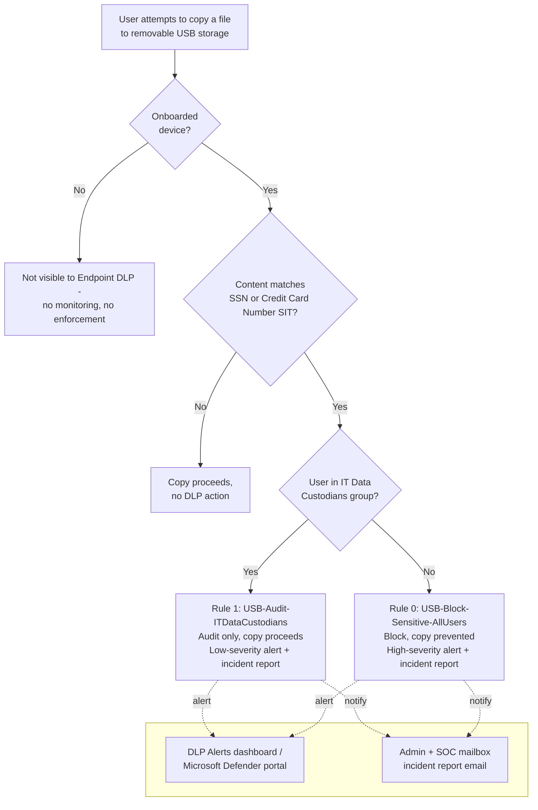

## 1. Scenario summary

Blocks copying of files containing U.S. Social Security Numbers or credit card numbers from
onboarded Windows/macOS endpoints to USB removable storage, using Microsoft Purview Endpoint Data
Loss Prevention (Endpoint DLP). A named exception path (audit-only, not blocked) is carved out for
the IT Data Custodians group, who perform legitimate offline backup/imaging work that a hard block
would otherwise break. This is the same classify-then-control pattern as
`scenarios/information-protection/auto-label-confidential-sharepoint/`, extended from "label it
Confidential" to "stop it leaving via USB" using the same sensitive-content definition.

**Who it's for:** any organization with Windows or macOS laptops/desktops in scope for data-loss
prevention that needs a real-time, content-aware control against regulated data being copied to a
USB flash drive or external disk, a channel that email-, SharePoint-, or Teams-scoped DLP cannot
see because the file has already left the cloud-inspectable path.

## 2. Business/regulatory driver

Removable media is one of the oldest and least monitored data-exfiltration channels: a departing
or malicious employee, or simply careless handling, can move gigabytes of regulated data off a
managed endpoint in seconds, with no email, chat, or cloud-sharing trail at all. This is a control
area referenced across nearly every regulatory framework this repo's buyers face, GDPR Article 32
("appropriate technical measures" against unauthorized disclosure), HIPAA Security Rule technical
safeguards (45 CFR §164.312, media controls), PCI DSS Requirement 3 (protect stored cardholder
data) and SOC 2 CC6 (logical access controls), without any one of them mandating this specific
technical control by name. Buyers typically deploy this as a baseline data-loss-prevention control
alongside, not instead of, the classification work in `auto-label-confidential-sharepoint` and the
external-sharing controls in `pci-teams-exfil-block`.

Two secondary drivers this control also supports:
- **Audit/incident-response evidence**, every block and every IT Data Custodian copy is logged
  (alert, incident report, Activity explorer event), giving an investigator or auditor a record of
  what left the organization via removable media and when.
- **Consistency with the tenant's existing "sensitive" definition**, this scenario deliberately
  reuses the exact SIT pair `auto-label-confidential-sharepoint` uses to apply the Confidential
  label, so a buyer running both scenarios has one coherent definition of "sensitive," not two
  independently tuned ones that can drift apart.

## 3. Prerequisites

Full licensing detail and citations: `docs/licensing-matrix.md`. Summary for this scenario:

| Requirement | Minimum | Notes |
|---|---|---|
| Endpoint Data Loss Prevention (DLP) | **Microsoft 365 E5/A5/G5**, **Microsoft Purview Suite/EDU/GOV/FLW**, **Microsoft Defender + Purview Suite FLW**, or **Microsoft 365 E5/A5/F5/G5 Information Protection & Governance** | Confirmed per-user for every endpoint user covered by the policy [[1]](#references) |
| Device onboarding | Devices must be onboarded to Microsoft Purview device management (shared onboarding with Microsoft Defender for Endpoint) and actively reporting into Activity explorer | Onboarding is a package deployment (local script up to 10 machines, Group Policy, Configuration Manager, or Intune), **not** something this scenario's deploy script performs. See §5 and `design.md` §5 [[2]](#references) |
| Supported OS | Windows 10/11 (specific builds per KB), Windows Server 2019+ (opt-in), or macOS (three latest released major versions) | Full current build matrix: `device-onboarding-overview` [[2]](#references) |
| Role to onboard devices / manage device monitoring | **Security Administrator**, **Compliance Administrator**, or **Global Administrator** (Microsoft Entra role) | Device management currently supports **only** Entra roles, Purview role groups (including DLP Compliance Management) do **not** grant onboarding or device-monitoring rights, even though they do grant policy-authoring rights (next row) [[2]](#references) |
| Role to author/edit DLP policies | **DLP Compliance Management** role (built into the *Compliance Administrator* / custom S&C role group) | See `docs/rbac-model.md` §3 (Purview role groups). Note this is a **separate** permission from device onboarding above, a buyer's DLP author may not be able to onboard devices, and vice versa |
| Automation identity | App registration with **Exchange Online Protection → `Exchange.ManageAsApp`** application permission, granted the DLP-authoring role group | Certificate-based app-only auth, see `docs/automation-surface.md` §3. Does not cover device onboarding, which has no PowerShell/Graph automation surface documented as of this writing (VERIFY at deploy time) |
| Dependency (not deployed by this scenario) | A mail-enabled security group or Microsoft 365 group for **IT Data Custodians** | Must exist before running `deploy/New-EndpointDlpUsbBlockPolicy.ps1` |

> Verify current entitlement names against `docs/licensing-matrix.md` (dated 2026-09-02) and the
> Product Terms before a sales commitment, SKU names change.

## 4. Architecture



One DLP policy (`Endpoint DLP - Block USB Removable Media Exfiltration`), scoped to the
**Devices** (Endpoint DLP) location, containing two priority-ordered rules. Full rule-by-rule
rationale is in `design.md` §4-6. Enforcement happens **locally on the device**, via the
Purview/Defender client, driven by policy synced from Security & Compliance PowerShell.

## 5. Step-by-step implementation

### Portal path (for a first manual walkthrough / to validate intent before scripting)

1. **Onboard devices first** (one-time, not part of this scenario's deploy script). Sign in to the
   [Microsoft Purview portal](https://purview.microsoft.com) → **Settings** → **Device
   onboarding** → **Devices** → **Turn on device onboarding** → **Onboarding**, choose a
   deployment method (local script, Group Policy, Configuration Manager, or Intune), and deploy
   the downloaded package to target endpoints. If devices are already onboarded to Microsoft
   Defender for Endpoint, they already appear in this list, only **Turn on device monitoring** is
   needed [[2]](#references).
2. Go to **Data loss prevention** → **Policies** → **Create policy**.
3. Category: **Custom** → template: **Custom policy** → **Next**.
4. Name: `Endpoint DLP - Block USB Removable Media Exfiltration`. **Policies can't be renamed
   after creation**, confirm the name before continuing [[3]](#references).
5. **Assign admin units**: accept **Full directory** (unless the tenant uses administrative units
, see `docs/rbac-model.md` §4).
6. **Choose locations**: select **Devices** only; deselect all other locations.
7. **Define policy settings**: choose **Create or customize advanced DLP rules**.
8. Create rule **USB-Block-Sensitive-AllUsers** (priority 0):
   - Conditions: **Content contains** → **Sensitive info types** → **U.S. Social Security Number
     (SSN)** OR **Credit Card Number** (min count 1 each); add **Sender is a member of** with
     **Except if** toggled → the IT Data Custodians group.
   - Actions: **Audit or restrict activities on devices** → **File activities for all apps** →
     **Apply restrictions to specific activity** → set **Copy to a removable USB device** =
     **Block** [[4]](#references).
   - Incident reports: alert **High** severity, send to the SOC/admin mailbox.
9. Create rule **USB-Audit-ITDataCustodians** (priority 1): same content condition, scoped
   (**not** excepted) to the IT Data Custodians group; same activity restriction but set **Copy to
   a removable USB device** = **Audit only**; alert **Low** severity.
10. **Policy mode**: choose **Run the policy in simulation mode** first. Do not turn it on
    immediately, follow the staged rollout in §8 below.
11. **Submit**, then **Done**.

### Script path (idempotent, parameterized, dry-run capable)

```powershell
# 1. Connect (certificate app-only, see docs/automation-surface.md §3)
Connect-IPPSSession -AppId $AppId -Certificate $Cert -Organization $TenantDomain

# 2. Dry run, reports every change, makes none
./deploy/New-EndpointDlpUsbBlockPolicy.ps1 `
    -ITCustodiansGroupEmail 'it-custodians@contoso.com' `
    -AdminNotificationEmail 'soc@contoso.com' `
    -WhatIf

# 3. Deploy in simulation mode (default) to observe real activity first
./deploy/New-EndpointDlpUsbBlockPolicy.ps1 `
    -ITCustodiansGroupEmail 'it-custodians@contoso.com' `
    -AdminNotificationEmail 'soc@contoso.com'

# 4. After a tuning window and a pilot-tenant functional test (see §7, step 1), enforce
./deploy/New-EndpointDlpUsbBlockPolicy.ps1 `
    -ITCustodiansGroupEmail 'it-custodians@contoso.com' `
    -AdminNotificationEmail 'soc@contoso.com' `
    -Mode Enable -Force

# 5. Validate
./validate/Test-EndpointDlpUsbBlockPolicy.ps1 -ITCustodiansGroupEmail 'it-custodians@contoso.com'

# Optional: justification-gate the IT Data Custodians path instead of silently logging it
./deploy/New-EndpointDlpUsbBlockPolicy.ps1 `
    -ITCustodiansGroupEmail 'it-custodians@contoso.com' `
    -AdminNotificationEmail 'soc@contoso.com' `
    -ITExceptionAction Warn -Mode Enable -Force
./validate/Test-EndpointDlpUsbBlockPolicy.ps1 -ITCustodiansGroupEmail 'it-custodians@contoso.com' `
    -ExpectedITExceptionAction Warn
```

The deploy script uses Security & Compliance PowerShell (`New-DlpCompliancePolicy`,
`New-DlpComplianceRule`), automation surface 2 per `docs/automation-surface.md` §1. Device
onboarding itself has no equivalent PowerShell/Graph cmdlet documented as of this writing and must
be performed as in §5 step 1 above, once, before this policy has any effect.

## 6. Configuration reference

| Setting | Rule 0: `USB-Block-Sensitive-AllUsers` | Rule 1: `USB-Audit-ITDataCustodians` |
|---|---|---|
| Priority | 0 | 1 |
| Sender scope | `ExceptIfFromMemberOf` = IT Data Custodians group | `FromMemberOf` = IT Data Custodians group |
| Sensitive content | SSN OR Credit Card Number (min count 1 each) | SSN OR Credit Card Number (min count 1 each) |
| `EndpointDlpRestrictions` | `@{Setting='RemovableMedia'; Value='Block'}`, confirmed, see §11 | `@{Setting='RemovableMedia'; Value=$ITExceptionAction}`, `Audit` (default) or `Warn`, confirmed, see §11 |
| `ReportSeverityLevel` | High | Low |
| `GenerateAlert` / `GenerateIncidentReport` | Admin + SOC mailbox | Admin + SOC mailbox |
| `StopPolicyProcessing` | `$true` | `$false` |
| Policy location | `EndpointDlpLocation = "All"` (both rules share the one policy) | |
| Policy `Mode` | `TestWithNotifications` (deploy default) → `Enable` after tuning | |

Full cmdlet parameter grounding: `deploy/New-EndpointDlpUsbBlockPolicy.ps1` inline comments and
its `.NOTES` block cite the exact Microsoft Learn PowerShell reference pages.

## 7. Validation / how to prove it works

1. **Pilot-tenant first deploy (do this before §7.2-4 in any tenant)**, the `-EndpointDlpRestrictions`
   `Setting`/`Value` strings this script uses are confirmed against Microsoft's official cmdlet
   reference (§11), but run `deploy/New-EndpointDlpUsbBlockPolicy.ps1` once against a
   non-production/pilot tenant and confirm it completes without a parameter-validation error
   before relying on it elsewhere, as a routine first-deploy sanity check.
2. **Automated config check**, `./validate/Test-EndpointDlpUsbBlockPolicy.ps1
   -ITCustodiansGroupEmail 'it-custodians@contoso.com'` confirms the policy and both rules exist
   with the expected scoping, exits non-zero on any hard failure (safe for a CI-style pre-flight).
3. **Device onboarding check**, Purview portal → **Settings** → **Device onboarding** →
   **Devices**; confirm the target test device shows **Configuration status: Updated** and
   **Policy Sync status: Updated** before running a functional test, an unsynced device will not
   enforce the policy regardless of how correct the policy configuration is [[5]](#references).
4. **Functional test (non-Custodian user)**, from a test account **not** in the IT Data
   Custodians group, on an onboarded device, attempt to copy a test file containing a documented
   test SSN or card-brand-issued test card number (never a real person's SSN or a real
   cardholder's PAN) to a USB drive. Expect: copy blocked, a toast notification on the endpoint,
   and a high-severity alert in the DLP Alerts dashboard.
5. **Functional test (IT Data Custodian)**, same test, from an account in the IT Data Custodians
   group. Expect: copy succeeds (not blocked), but a low-severity alert appears in the DLP Alerts
   dashboard.
6. **Functional test (non-sensitive content)**, copy a file with no SSN/card-number content to a
   USB drive from either account. Expect: copy succeeds, no DLP alert.
7. **Activity explorer**, Purview portal → Data loss prevention → Activity explorer → filter by
   policy name to confirm ongoing match volume once in `Enable` mode.

## 8. Operations & tuning

**Deployment sequence** (mirrors Microsoft's documented staged rollout used across every DLP
scenario in this repo): Off → Run in simulation mode → Run in simulation mode + show policy tips
(pilot group) → Turn it on. The deploy script's default `-Mode TestWithNotifications` corresponds
to the simulation stage; pass `-Mode Enable` deliberately once tuning and the §7 functional tests
are complete.

**KPIs to watch (first 30 days):**
- **Rule 0 (all-users block) match count**, a sudden spike after enabling usually means a
  legitimate business process was missed by the IT Data Custodians exception, not a wave of
  attempted exfiltration. Investigate before assuming malice.
- **Rule 1 (IT Data Custodians audit) volume and per-user distribution**, this is the baseline of
  how much sensitive content the custodian team actually copies to removable media as part of its
  job. An unusually high volume from a single custodian account relative to peers is the signal
  worth investigating first.
- **False-positive rate**, SIT false positives (test data, employee IDs that happen to be
  9 digits) show up as user complaints; tune by adjusting the SIT's confidence level or minimum
  count only after confirming the pattern in Activity explorer, not from a single report.

**Alert routing:** both rules generate alerts and incident reports to the SOC/admin mailbox
parameter. Route the DLP alert source into the SIEM (Microsoft Sentinel connector, or the
Microsoft Defender XDR incident queue export) so it lands in existing on-call rotation rather than
living only in the Purview portal, see `docs/automation-surface.md` §4.

**Review cadence:** quarterly at minimum for the overall control; re-run
`validate/Test-EndpointDlpUsbBlockPolicy.ps1` as part of that review to catch configuration drift.
Review **Rule 1 (IT Data Custodians) audit volume** on a **weekly** cadence, not quarterly, this
audit-only group is the one path in this design that can move real regulated data onto removable
media with no block at all, so it is the highest-value target for a compromised or malicious
insider and deserves the same weekly-review discipline as the Card Operations override in
`scenarios/dlp/pci-teams-exfil-block/`.

**Incident-response runbook (Rule 0 block alert, or a Rule 1 audit event that looks anomalous):**
1. **Triage**, open the alert in the DLP Alerts dashboard or Microsoft Defender portal incident
   queue; confirm which rule matched, the user, the device, and that the "Sensitive info types"
   tab shows an actual SSN/PAN-shaped match rather than a false positive.
2. **Classify**, true positive vs. false positive. False positive: no further action beyond
   noting the pattern for a future SIT confidence-threshold tuning pass.
3. **True positive, Rule 0 (block, non-Custodian user)**, the copy never completed; contact the
   user's manager and initiate the org's standard data-handling incident process. Determine
   whether the user needs a legitimate exception path or security-awareness follow-up.
4. **True positive, Rule 1 (IT Data Custodian audit)**, the copy already completed. Confirm the
   activity matches the custodian's known backup/imaging schedule and device. If it doesn't
   (unscheduled, unusual volume, unfamiliar device), escalate as a potential insider-risk event
   and consider temporary removal from the IT Data Custodians group pending investigation.
5. **Document**, every true positive and every custodian audit-event review is retained as
   incident-response evidence; do not delete or edit alert records.

## 9. Rollback / decommission

See `rollback.md` for the full staged procedure (disable → simulation → permanent purge). Quick
reference: `./deploy/Remove-EndpointDlpUsbBlockPolicy.ps1` disables (reversible); add `-Purge` to
permanently delete the policy and its rules.

## 10. Cost & licensing notes

- **No PAYG component.** Endpoint DLP is a per-user entitlement feature, not billed through
  Purview's Azure consumption model, see `docs/licensing-matrix.md` §1-2. Cost is the marginal
  cost of moving any currently-sub-E5 endpoint users up to a qualifying SKU (§3 above).
- **No additional Azure subscription required** for this control specifically.
- **Device onboarding has no separate license fee** beyond the qualifying per-user SKU, but it
  does carry an operational cost: package deployment to every in-scope endpoint via existing
  device-management tooling (Intune/Configuration Manager/Group Policy), which is real deployment
  effort a buyer should budget for separately from the DLP policy authoring this scenario covers.
- **Sizing note:** license only the users in scope, typically all knowledge-worker endpoints
  handling regulated data, which in the enterprises this repo targets is often already covered by
  an existing E5 estate.

## 11. Known limitations & gotchas

- **`EndpointDlpRestrictions` `Setting`/`Value` strings are confirmed against Microsoft's official
  cmdlet reference.** Both the `New-DlpComplianceRule` and `Set-DlpComplianceRule` Learn reference
  pages state directly: "The available values for `<Value>` are: Audit, Block, Ignore, or Warn,"
  with a worked example `@{"Setting"="RemovableMedia"; "Value"="Block";}` matching this scenario's
  Rule 0 exactly [[9]](#references)/[[10]](#references). The same pages confirm `Setting` names
  beyond `RemovableMedia`, `Print`, `CopyPaste`, `ScreenCapture`, `NetworkShare`, and
  `UnallowedApps`, none deployed by this scenario (see the non-restricted-activities bullet
  below). The Microsoft Security Blog Tech Community walkthrough previously cited as the primary
  source for this shape [[15]](#references) is retained only as a secondary, corroborating
  citation now that the official reference confirms the same shape directly.
- **`Warn` is a real, documented action, and is now available as an opt-in for the IT Data
  Custodians exception.** Both Learn pages state: "When you use the values Block or Warn in this
  parameter, you also need to use the NotifyUser parameter", grouping `Warn` with the user-facing
  `Block` action rather than the silent `Audit`/`Ignore` pair. That is strong, but not literal,
  evidence that `Warn` is the enum value behind the portal's "Block with override" activity option
  (a user-facing justification prompt, not a hard block), Microsoft's reference does not spell
  out that exact portal-name mapping. `deploy/New-EndpointDlpUsbBlockPolicy.ps1` now accepts
  `-ITExceptionAction Audit|Warn` (default `Audit`, unchanged prior behavior); choosing `Warn`
  justification-gates the IT Data Custodians path instead of silently logging it, at the cost of
  interrupting that team's legitimate workflow with a prompt on every matching copy. VERIFY (pilot
  tenant) the actual on-screen prompt behavior before describing it to a customer as "Block with
  override" by name.
- **Switching `-ITExceptionAction` from `Warn` back to `Audit` with `-Force` may leave stale
  `NotifyUser`/`NotifyPolicyTipCustomText` values on the live rule.** `Set-DlpComplianceRule` is
  not documented to clear a property simply because a later call omits it. Confirm those
  properties with `Get-DlpComplianceRule` after switching away from `Warn` rather than assuming
  `-Force` fully reverts every `Warn`-only property.
- **Device onboarding is a separate, non-scripted prerequisite.** This scenario's deploy script
  authors the DLP policy only; it assumes devices are already onboarded (§3, §5 step 1). A policy
  deployed against un-onboarded devices has no effect and generates no error, always confirm
  device onboarding/policy-sync status (§7 step 3) before concluding a functional test failure is
  a policy bug.
- **Encrypted or password-protected files are not scanned.** Endpoint DLP inspects file content;
  a password-protected archive or an encrypted container cannot be opened and classified, so a
  user who zips-with-password a sensitive file before copying it to USB will not trigger either
  rule. Microsoft documents dedicated policies for files it cannot scan
  (`dlp-create-policy-files-edlp-doesnt-scan`), pair this scenario with that guidance if
  encrypted-archive exfiltration is a realistic threat in the target environment
  [[6]](#references).
- **Unsupported/unscanned file types and photographs of screens are not covered.** As with every
  content-pattern DLP control in this repo (see `pci-teams-exfil-block/README.md` §11), a file
  type Endpoint DLP doesn't parse, or a photo taken of a screen with a phone, bypasses text-pattern
  matching entirely, this is an inherent limitation of content inspection, not a configuration
  gap this scenario can close.
- **This scenario does not restrict Print, clipboard, network share, Bluetooth, or RDP.** Only
  **copy to removable media** is restricted. Microsoft's official cmdlet reference now confirms
  the exact `Setting` names for four of those activities, `Print`, `CopyPaste` (clipboard),
  `ScreenCapture`, and `NetworkShare`, plus `UnallowedApps`; `design.md` §7 documents how to
  extend the `EndpointDlpRestrictions` array with one more `@{Setting=...; Value=...}` hashtable
  per activity using those confirmed names. Bluetooth and RDP restriction `Setting` names were not
  found in that reference and remain unconfirmed.
- **This scenario does not configure Removable USB device groups** (per-physical-device
  allowlisting of specific IT-issued encrypted backup drives by Vendor ID/Product ID/Instance ID,
  distinct from the group-based IT Data Custodians *user* exception this scenario does implement).
  A dedicated grounding pass (`PROGRESS.md`) confirmed the portal workflow end-to-end: create the
  group under **Purview portal → Settings → Data loss prevention → Endpoint DLP settings →
  Removable USB device groups** (name it, add each device by Vendor ID/Product ID/Instance ID, and
  give it an alias that appears only in the Purview console), then reference that group as an
  **exclusion in a rule's actions/exceptions** back in the policy editor [[19]](#references)
  [[20]](#references). The pass found the *cmdlet-level* half genuinely undocumented rather than
  merely undiscovered: `Set-PolicyConfig` does expose a `-DlpRemovableMediaGroups` parameter
  (`PswsHashtable`) confirmed to exist in Microsoft's own reference, alongside four sibling
  device-group parameters (`-DlpPrinterGroups`, `-DlpNetworkShareGroups`, `-DlpAppGroups`,
  `-DlpExtensionGroups`), but as of this pass, every one of those five parameters' descriptions,
  and the cmdlet's entire `EXAMPLES` section, are unpublished placeholder text in Microsoft's
  official reference [[21]](#references); and `New-DlpComplianceRule`/`Set-DlpComplianceRule`
  expose no parameter of any kind for referencing a device group as a rule condition or exception
  [[9]](#references)/[[10]](#references), confirming the rule-level reference step is portal-only
  too, not merely the device-registration step already flagged. Scripting this without a
  documented hashtable shape would mean fabricating dictionary keys this repo's grounding standard
  (`AGENTS.md` §4) does not permit, so it stays a portal-only workflow until Microsoft publishes
  one. Combining it with this scenario would let a buyer scope the IT exception down from "any
  removable media, watched" to "only these specific backup drives, unrestricted", tracked as a
  closed, investigated-not-built item in `PROGRESS.md` rather than an open build item.
- **This scenario does not replace Microsoft Defender for Endpoint device control.** Device
  control can deny an unapproved USB device outright regardless of content (content-blind, at the
  driver level); Endpoint DLP is content-aware but requires the device to already be a recognized
  disk. A buyer wanting "no unknown USB devices, period" needs device control in addition to this
  scenario, not instead of it, see `design.md` §3.

## 12. References

1. Microsoft Purview service description, Endpoint Data Loss Prevention (DLP) licensing table, <https://learn.microsoft.com/office365/servicedescriptions/microsoft-365-service-descriptions/microsoft-365-tenantlevel-services-licensing-guidance/microsoft-purview-service-description#microsoft-data-loss-prevention-endpoint-data-loss-protection-dlp>
2. Onboard Windows devices into Microsoft 365 overview (onboarding methods, supported OS builds, permissions, device management supports only Entra roles), <https://learn.microsoft.com/purview/device-onboarding-overview>
3. Learn about the default DLP policy in Microsoft Teams (naming behavior applies to all DLP policies: cannot be renamed after creation), <https://learn.microsoft.com/purview/dlp-teams-default-policy>
4. Data Loss Prevention policy reference (Audit or restrict activities on devices; Allow/Audit only/Block with override/Block action semantics; Copy to a removable device activity), <https://learn.microsoft.com/purview/dlp-policy-reference>
5. Troubleshooting endpoint data loss prevention configuration and policy sync, <https://learn.microsoft.com/purview/dlp-edlp-tshoot-sync>
6. Help protect files that Endpoint Data Loss Prevention doesn't scan, <https://learn.microsoft.com/purview/dlp-create-policy-files-edlp-doesnt-scan>
7. Configure endpoint data loss prevention settings (Removable USB device groups, restricted-activity actions), <https://learn.microsoft.com/purview/dlp-configure-endpoint-settings>
8. New-DlpCompliancePolicy reference (EndpointDlpLocation, Mode), <https://learn.microsoft.com/powershell/module/exchangepowershell/new-dlpcompliancepolicy>
9. New-DlpComplianceRule reference (EndpointDlpRestrictions, confirmed Setting names Print/CopyPaste/ScreenCapture/RemovableMedia/NetworkShare/UnallowedApps and Value enum Audit/Block/Ignore/Warn, plus the NotifyUser requirement for Block/Warn; also ContentContainsSensitiveInformation, FromMemberOf/ExceptIfFromMemberOf, StopPolicyProcessing, ReportSeverityLevel), <https://learn.microsoft.com/powershell/module/exchangepowershell/new-dlpcompliancerule>
10. Set-DlpComplianceRule reference (EndpointDlpRestrictions, identical Setting/Value enumeration and NotifyUser requirement, confirmed independently), <https://learn.microsoft.com/powershell/module/exchangepowershell/set-dlpcompliancerule>
11. Set-DlpCompliancePolicy reference (Mode: Enable/Disable/TestWithNotifications/TestWithoutNotifications), <https://learn.microsoft.com/powershell/module/exchangepowershell/set-dlpcompliancepolicy>
12. Remove-DlpCompliancePolicy reference, <https://learn.microsoft.com/powershell/module/exchangepowershell/remove-dlpcompliancepolicy>
13. Get started with Endpoint data loss prevention, <https://learn.microsoft.com/purview/endpoint-dlp-getting-started>
14. Learn about Endpoint data loss prevention (local evaluation, file classification triggers), <https://learn.microsoft.com/purview/endpoint-dlp-learn-about>
15. Device control in Microsoft Defender for Endpoint (content-blind device-level USB control, complementary to Endpoint DLP), <https://learn.microsoft.com/defender-endpoint/device-control-overview>
16. Creating Endpoint DLP Rules using PowerShell - Part 1 (Microsoft Security Blog, Tech Community, secondary/corroborating EndpointDlpRestrictions Setting/Value hashtable example for RemovableMedia and Print, superseded as primary citation by items 9-10), <https://techcommunity.microsoft.com/blog/microsoft-security-blog/creating-endpoint-dlp-rules-using-powershell---part-1/4286999>
17. Connect-IPPSSession reference (app-only certificate auth), <https://learn.microsoft.com/powershell/module/exchangepowershell/connect-ippssession>
18. U.S. Social Security Number (SSN) / Credit Card Number sensitive information types, reused from `scenarios/information-protection/auto-label-confidential-sharepoint/` (see that scenario's own references for SIT definition citations).
19. Configure endpoint DLP settings (Removable USB device groups, creation workflow, Vendor ID/Product ID/Instance ID device identification, per-device alias), <https://learn.microsoft.com/purview/dlp-configure-endpoint-settings>
20. Configuring USB hardware ID exceptions in Microsoft Purview endpoint DLP (Microsoft Q&A, confirms the rule-level workflow: create the device group in Endpoint DLP settings, then add an exclusion for it under the rule's actions/exceptions), <https://learn.microsoft.com/answers/questions/5942592/configuring-usb-hardware-id-exceptions-in-microsof>
21. Set-PolicyConfig reference (`-DlpRemovableMediaGroups`/`-DlpPrinterGroups`/`-DlpNetworkShareGroups`/`-DlpAppGroups`/`-DlpExtensionGroups`, confirmed to exist as `PswsHashtable`/`PswsHashtable[]` parameters; description text and the cmdlet's EXAMPLES section are unpublished placeholder content as of this pass), <https://learn.microsoft.com/powershell/module/exchangepowershell/set-policyconfig>

> Re-verify all links against current Microsoft Learn and a pilot tenant before a customer-facing
> assessment or sale. The `EndpointDlpRestrictions` `Setting`/`Value` shape is now grounded in
> items 9-10 (official Microsoft Learn cmdlet reference pages, fetched and confirmed directly);
> item 16's community walkthrough is kept only as a secondary, corroborating source. The `Warn`
> value's mapping to the portal's "Block with override" option remains a well-corroborated
> inference, not a literal Microsoft citation, confirm the on-screen behavior in a pilot tenant
> before relying on that framing with a customer (§11).
