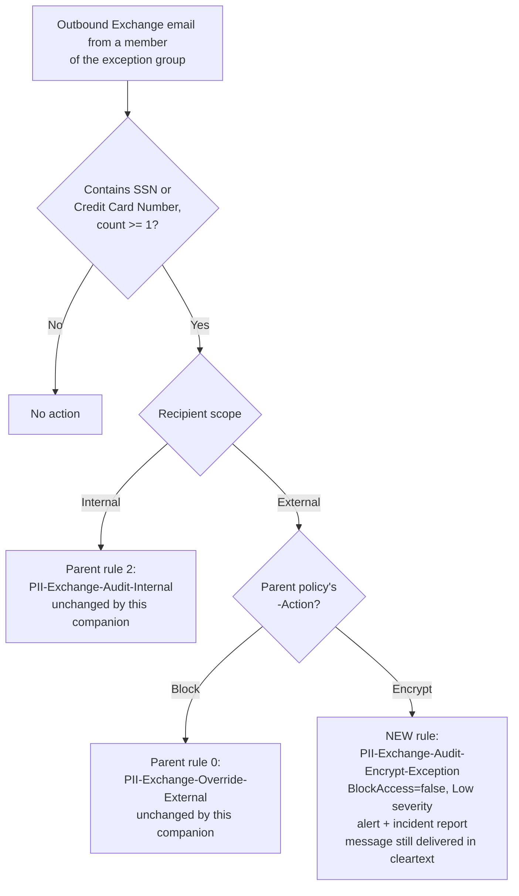

## 1. Problem statement

[`dlp/exchange-pii-exfil-block`](/scenarios/dlp/exchange-pii-exfil-block/)'s own `reviews.md` (Red Team finding 1) and `README.md`
§11 document a specific, accepted-but-flagged residual risk:

> In Block mode, the nominated exception group gets a block-with-justification override — every use
> is logged. In Encrypt mode, the same group is simply excluded from the encrypt rule
> (`ExceptIfFromMemberOf`), because `EncryptRMSTemplate` is non-halting and has no override concept
> to log against. ... a member's matching external mail currently leaves the tenant in cleartext
> with zero alert, incident report, or override record.

That review explicitly deferred a fix to keep the base fragment scoped (`AGENTS.md` §6), and sketched
the shape of the fix: "a separate, low-severity audit rule scoped to `FromMemberOf` the same
`-ExceptionGroupEmail` group, active only when `-Action Encrypt`." This scenario builds exactly that
— nothing more.

## 2. Why a new rule on the existing policy, not a new policy

Three options were considered:

1. **A new, standalone DLP policy** with its own audit rule. Rejected: it would duplicate the exact
   same SIT conditions, exception-group reference, and `AccessScope` already defined on the parent
   policy, creating two places that must be kept in sync with the parent's `-ExceptionGroupEmail`
   instead of one. It also has no independent lifecycle — it only ever makes sense alongside the
   parent policy's Encrypt-mode configuration, so giving it separate policy-level `Mode` semantics
   (Enable/Disable/simulation) that don't actually apply (this rule has no enforcement action to
   stage into) would be misleading.
2. **Modify the parent scenario's own deploy script** to add this rule unconditionally when
   `-Action Encrypt`. Rejected for this build: `AGENTS.md` §6 directs keeping fragments small and
   committing independently: reopening an already-DONE, already-four-lens-reviewed scenario to add a
   new rule risks re-triggering review scope creep on a scenario that already passed its own review
   round. A companion that targets the same policy by name is functionally equivalent for the
   customer and keeps the change auditable as its own fragment/commit.
3. **A new rule added to the parent's existing named policy** (the option built here). The rule
   lives where the exception-group logic it corrects already lives, with no new policy-level state
   to manage, and can be deployed or removed independently of the parent scenario's own deploy/remove
   scripts.

## 3. Architecture

This companion adds exactly one rule. It does not modify, reconfigure, or re-deploy any of the
parent policy's three existing rules — the deploy script (§5) only reads the parent policy's rules
to compute a safe `-Priority` and to run a drift check (§6); it never calls `Set-DlpComplianceRule`
against `PII-Exchange-Protect-External`, `PII-Exchange-Override-External`, or
`PII-Exchange-Audit-Internal`.

## 4. Key decisions

| Decision | Choice | Rationale |
|---|---|---|
| Target policy | The parent scenario's **existing** policy, by `-PolicyName` (default `PII DLP - Exchange External Send Control`) | See §2. This script requires the policy to already exist and fails clearly if it doesn't — it is never used to bootstrap the parent policy. |
| Rule name | `PII-Exchange-Audit-Encrypt-Exception` | Follows the parent scenario's own `PII-Exchange-<Purpose>` naming convention, distinct enough from `PII-Exchange-Audit-Internal` (a different recipient scope entirely) that an analyst scanning the DLP Alerts dashboard by rule name won't confuse the two. |
| Action | `BlockAccess $false`, `GenerateAlert`, `GenerateIncidentReport`, `ReportSeverityLevel <ReportSeverityLevel>` | Pure audit — no enforcement action exists for this rule to take without recreating the "logged override" mechanic Encrypt mode structurally lacks (§1). Defaults to `Low`, matching the internal-audit rule's convention (expected, approved-exception traffic, not a novel threat signal), but is an explicit parameter — not hardcoded — after the four-lens review (`reviews.md`, Blue Team) flagged that a compromised member of a high-risk exception group is exactly the case where a `Low`-severity alert risks under-triage; an operator can pass `-ReportSeverityLevel High` for a group where that risk profile applies. |
| No user-facing policy tip / `NotifyUser` | Not set | Matches `PII-Exchange-Audit-Internal`'s own convention (`design.md`/deploy script of the parent scenario) — this traffic is an approved, intentional exception; notifying the sender would surface a confusing signal about mail that was not, in fact, blocked or altered for them. Visibility is for the SOC/admin audience only (`GenerateAlert`/`GenerateIncidentReport`), not the sender. |
| Priority | Computed at deploy time: one greater than the highest `Priority` currently present among the target policy's rules, unless `-Priority` is explicitly supplied | Microsoft's own guidance states Exchange-hosted-location rules are normally assigned priority by creation order [[1]](#references), and that when a message matches multiple rules only the most-restrictive one is enforced (though all matches are logged) [[1]](#references). Because this rule's `FromMemberOf`/`AccessScope` combination is structurally exclusive of every other rule in the target policy in Encrypt mode (§3), the exact priority value has no correctness impact on which rule "wins" for any given message — but an explicit, deploy-script-computed value keeps repeated deploys idempotent and avoids relying on portal-side creation-order side effects that would differ between a first deploy and a `-Force` re-run. |
| No `StopPolicyProcessing` | Left unset (defaults to `$false`) | Nothing meaningfully follows this rule in the priority order for its exclusive target population — the parent's `PII-Exchange-Protect-External` rule already excludes this population via its own `ExceptIfFromMemberOf`, so there is nothing this rule needs to prevent from also evaluating. |
| Idempotency check on `-ExceptionGroupEmail` | The deploy script reads the parent's `PII-Exchange-Protect-External` rule and warns (does not fail) if its `ExceptIfFromMemberOf` doesn't already contain the same group | Surfaces configuration drift (§ README.md §11) without making this companion's own deploy fail on account of a problem in a different rule it doesn't own. |
| Deploy surface | Security & Compliance PowerShell (`Connect-IPPSSession`, `Get-/New-/Set-/Remove-DlpComplianceRule`) against an existing policy | Automation surface 2 per `docs/automation-surface.md` §1 — same surface the parent scenario and every other DLP scenario in this library uses. No `New-DlpCompliancePolicy` call — this fragment never creates a policy. |

## 5. Non-goals

- This scenario does not change the parent scenario's enforcement behavior in any way — Encrypt
  mode traffic from the exception group is still delivered in cleartext exactly as before. See
  `README.md` §11 for the explicit statement that this is a visibility fix, not a prevention fix.
- This scenario does not build a logged-override mechanism for Encrypt mode. Microsoft's
  `EncryptRMSTemplate` action has no documented override concept (`NotifyAllowOverride` is
  specifically an override for a **blocking** action) — inventing one would violate `AGENTS.md` §4's
  no-invented-behavior standard. A buyer who needs a true logged-override-with-justification path
  for this population should switch it to `-Action Block` instead, where
  `PII-Exchange-Override-External` already exists.
- This scenario does not modify, own, or redeploy any of the parent scenario's three existing rules.
- This scenario does not create its own DLP policy, and it does not manage the parent policy's
  `Mode` (Enable/Disable/simulation) — see §2, option 3.
- This scenario does not attempt automatic reconciliation if the parent scenario's
  `-ExceptionGroupEmail` or `-PolicyName` changes — it is a deploy-time snapshot, checked for drift
  at validation time (§ README.md §7 step 2, §11) but not continuously synchronized.

## References

1. Data Loss Prevention policy reference — rule priority-by-creation-order for hosted locations, and
   multi-rule-match/most-restrictive-action-enforced/all-matches-logged behavior — <https://learn.microsoft.com/purview/dlp-policy-reference#rules>
2. New-DlpComplianceRule reference — full parameter syntax — <https://learn.microsoft.com/powershell/module/exchangepowershell/new-dlpcompliancerule>
3. New-DlpComplianceRule reference — `-NotifyAllowOverride` parameter (override-with-justification is
   documented only in the context of a restricting/blocking action) — <https://learn.microsoft.com/powershell/module/exchangepowershell/new-dlpcompliancerule#-notifyallowoverride>
4. `scenarios/dlp/exchange-pii-exfil-block/reviews.md` — Red Team finding 1, the original review
   that identified this gap and deferred the fix.
5. `scenarios/dlp/exchange-pii-exfil-block/design.md` §6 — the design decision explaining Encrypt
   mode's lack of an override concept.
